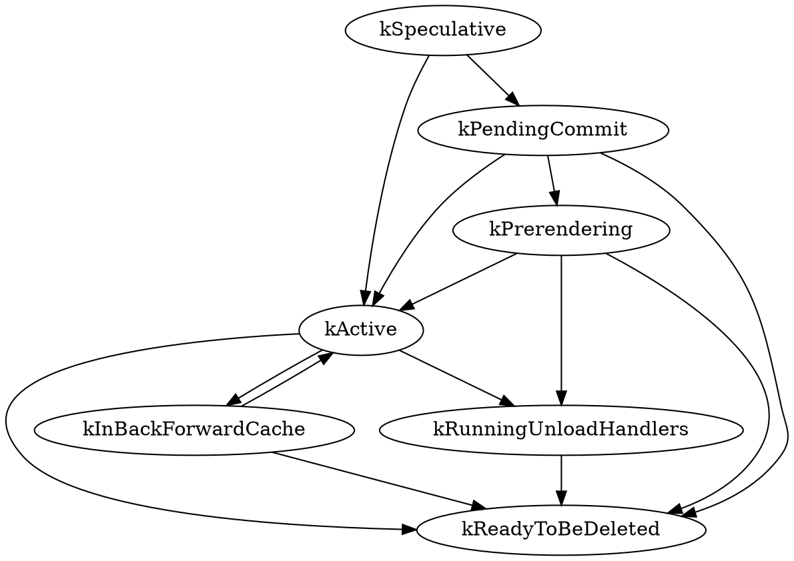

# Blink — the rendering engine

**Consolidated research dossier (XO Research).**
Reference tree: `/home/coder/chromium-ref/src` @ `f288fed6c601ae22461c9c9d8189004050abfaeb`, `chrome/VERSION` **156.0.8067.0**, checked out 2026-09-18; V8 15.6.0. Web sources fetched 2026-09-18 / 09-21 / 09-22. Consolidated 2026-09-22 from eleven section files in `_dossiers/blink/`, with ten verification verdicts (C01–C10) applied and fourteen cross-section contradictions adjudicated (thirteen resolved, one — origin-trial duration — left open).

Sources are cited as repo-relative paths with line numbers (`src/...`, exact at f288fed6), as `main <path>:<lines>` for files fetched from the GitHub mirror of `chromium/main` because the sparse checkout omits them, or as URLs.

| Part | Contents |
|---|---|
| 1 | Verified narrative — 4,646 words, the whole topic as it stands in the 2026 tree |
| 2 | Facts ledger — 1,302 rows (1,274 section facts, 22 rewritten by verification, plus 28 verification-derived facts V1–V28) |
| 3 | Code excerpts — 169 verbatim excerpts, deduplicated, with path and lines |
| 4 | Numbers and dates — 240 rows |
| 5 | Timeline — 194 dated events, 1998 → 2026-09-18 |
| 6 | Glossary — 297 terms |
| 7 | Figure plan — 14 figure specs |
| 8 | Corrections applied — C01–C10 plus ten resolved contradictions |
| 9 | Still unverified / open |

**Section prefixes used in the ledger and figure plan:** `SL` scope/history/layering · `PT` process and thread model · `EM` embedder boundary, input, navigation, loading · `NC` names-to-classes and the CSS front end · `BF` bindings, runtime features, web tests · `WP` WindowProxy, v8::Context, script execution · `EL` event loop and "update the rendering" · `EV` DOM event dispatch · `PL` rendering pipeline · `TX` text stack · `MO` memory (Oilpan/WTF) · `V` verification pass.

---

## 1. Verified narrative

*Reference tree: `/home/coder/chromium-ref/src` at commit `f288fed6c601ae22461c9c9d8189004050abfaeb`, `chrome/VERSION` 156.0.8067.0, checked out 2026-09-18, V8 15.6.0 [src/chrome/VERSION; v8/include/v8-version.h]. Facts marked "main" were fetched from the GitHub mirror of `chromium/main` on 2026-09-18/21/22 because the sparse checkout omits the file.*

### 1.1 What Blink is, and what it delegates

Blink's own definition is one sentence: "Blink is the browser engine used by Chromium. It is located in `src/third_party/blink`" [src/third_party/blink/README.md:3-4]. Its code policy is borrowed from `//content`: "only code that implements web platform features should live in Blink" [src/third_party/blink/README.md:10-11]. Kentaro Hara's "How Blink works" (2018) lists the job: implement the web-platform specs, embed V8 and run JavaScript, request resources from the network stack, build DOM trees, compute style and layout, and embed the Chrome Compositor — and warns that "Blink" means two things, the directory and the project, the latter also spanning `//content/renderer/` and `//content/browser/` [https://docs.google.com/document/d/1aitSOucL0VHZa9Z2vbRJSyAIsAz24kX8LFByQ5xQnUg].

The boundary on the far end is sharp: Blink "encompasses all the phases of rendering prior to compositing, culminating in compositor commit" [https://developer.chrome.com/docs/chromium/blinkng]. Everything after commit — layerize, raster, activate, aggregate, draw — is cc (in the renderer's compositor thread) and Viz (in the GPU process) [https://developer.chrome.com/docs/chromium/renderingng-architecture]. Blink is also not runnable alone: "Blink is implemented on top of an abstract platform and thus cannot be run by itself. The Chromium Content module provides the implementation of this abstract platform" [https://www.chromium.org/blink/]. It delegates JavaScript and Wasm to V8 (`renderer/DEPS` allows `+v8` and only a narrow slice of `//net` [src/third_party/blink/renderer/DEPS:96-99,121]), compositing to cc ("In the renderer, Blink is the client" [src/cc/README.md:3-5]), and process, navigation and IPC plumbing to `//content`, which re-exports the whole thing to Chrome, Android WebView, Opera and others through the Content API [src/content/README.md:4-7,64-68]. Increasingly Blink skips the middle: "Blink can use Mojo and directly talk to the browser process. This allows removal of unnecessary public APIs and abstraction layers" [src/third_party/blink/renderer/README.md:184-187].

### 1.2 How it got here

Adam Barth announced Blink on 3 April 2013 as "a new open source rendering engine based on WebKit", motivated because "Chromium uses a different multi-process architecture than other WebKit-based browsers, and supporting multiple architectures over the years has led to increasing complexity", and promising to "remove 7 build systems and delete more than 7,000 files—comprising more than 4.5 million lines—right off the bat" [https://blog.chromium.org/2013/04/blink-rendering-engine-for-chromium.html]. Blink reached Beta as 28.0.1500.20 on 23 May 2013, the release that shipped "Blink's new threaded HTML parser" [https://blog.chromium.org/2013/05/chrome-28-beta-more-immersive-web.html], and Stable as 28.0.1500.71 on 9 July 2013 "for Windows, Macintosh and Chrome Frame platforms" — Android followed the next day, Linux only on 30 July with 28.0.1500.95 [https://chromereleases.googleblog.com/2013/07/stable-channel-update.html]. The cleanest primary evidence that M28 is the fork milestone is the release-tag DEPS: M27 pins `src/third_party/WebKit/Source` plus `Tools/DumpRenderTree` and `LayoutTests` (663 lines), M28 collapses all of it to a single `src/third_party/WebKit` pin (541 lines, zero DumpRenderTree references) [https://chromium.googlesource.com/chromium/src/+/refs/tags/28.0.1500.71/DEPS?format=TEXT]. The "named after the `<blink>` tag" story is hedged at source — "Rumor has it…" — and has no 2013 primary [https://developer.chrome.com/docs/web-platform/blink].

Three bot-driven megacommits then reshaped the tree: "Reformat blink" (clang-format, 1 Oct 2016), "The Blink Rename" to Chromium identifier style (9 Apr 2017, keeping web-exposed methods `namedLikeThis()`), and "The Great Blink mv" (7 Apr 2018), which moved `Source/` to `third_party/blink/renderer` with snake_case filenames [GitHub commits 1c8e1a7719e9, 1c4d759e4425, 0aee4434a4db]. Two long-running architectural projects ran underneath. **BlinkNG** (from 2014) attacked "leaky abstraction barriers", reentrant entry points and layout running during style, replacing them with uniform entry, functional stages, immutable outputs and lifecycle assertions [https://developer.chrome.com/docs/chromium/blinkng]. **Onion Soup** started in **November 2015** — the founding design doc is bylined "esprehn@, Nov. 2015", it was presented at BlinkOn 5 (San Francisco, 10–11 November 2015) and announced on blink-dev by Elliott Sprehn on 2015-12-09 under crbug.com/561879; Hara later confirmed "Since we started Onion Soup in 2015 November" and drove it from "Onion Soup 2.0" (2017) onward [https://groups.google.com/a/chromium.org/g/blink-dev/c/mE1IbfrKupY; https://groups.google.com/a/chromium.org/g/platform-architecture-dev/c/L8D46_Yabyc]. Its definition — "migrate web-platform features from //content/renderer/ to Blink and massively simplify the abstraction layers" — comes with a number that must be attributed carefully: Hara recalled "64 directories in //content/renderer/" at the start, but the tree held 29 top-level directories at M47 and peaked at 31 (M49/M50); 64 matches `content/renderer` + `content/child` + `content/common` combined [https://groups.google.com/a/chromium.org/g/platform-architecture-dev/c/2De10giTga8; googlesource `+archive` tarballs at those tags]. At f288fed6, `//content/renderer` is down to 7 subdirectories and 231 files [git ls-tree HEAD content/renderer/].

### 1.3 The tree, and the layering that holds it together

`third_party/blink` is 213,000 files, 42% of chromium/src — but 189,640 of them are web tests (96,670 under `external/wpt`) [git ls-tree at f288fed6]. The engine proper is `renderer/`: 18,997 files, of which core 9,191 (css 1,165, html 1,056, layout 854), modules 5,163 across 121 feature directories, platform 3,783 across 38, bindings 588, build 182, controller 61, extensions 22 [git ls-tree]. `public/` is 1,560 files including 360 `.mojom` [git ls-tree].

`renderer/README.md` fixes a strictly downward dependency order — public/web → controller → extensions → modules and bindings/modules → core and bindings/core → platform → public/platform → public/common → //base, V8 [src/third_party/blink/renderer/README.md:119-129] — and DEPS files enforce every edge: platform/DEPS bans bindings, core and modules and enumerates the allowed `base/` headers one by one [src/third_party/blink/renderer/platform/DEPS:2-4,97-99]; public/DEPS bans renderer internals and permits `platform/heap` and `platform/wtf` only inside `INSIDE_BLINK` [src/third_party/blink/public/DEPS:6-13]; controller/DEPS is the only layer with a blanket `+base` [src/third_party/blink/renderer/controller/DEPS:1-11]. The core/modules/platform split is explicitly an implementation convenience — "specs do not have a notion of 'core', 'platform' or 'modules'" — with the rule of thumb: coupled to HTML/CSS/DOM → core, depends on core → modules, core depends on it → platform [src/third_party/blink/renderer/README.md:58-70]. Type discipline is policed three ways: DEPS allow-lists, the `audit_non_blink_usage.py` presubmit (STL and GURL tolerated only for interop with blink/common; `base::BindOnce` disallowed in favour of `blink::BindOnce`) [src/third_party/blink/tools/blinkpy/presubmit/audit_non_blink_usage.py:1012-1020,1115-1119], and two clang plugins wired in `renderer/BUILD.gn`, which also defines `INSIDE_BLINK` [src/third_party/blink/renderer/BUILD.gn:33-50,104-121]. Threading policy is message passing only, because shared-memory patterns "have been one of the major sources of use-after-free security bugs" [src/third_party/blink/renderer/README.md:190-201].

### 1.4 Processes, threads and the scheduler

Blink runs only in sandboxed renderers, and which renderer hosts which document is a browser-side decision built on three abstractions: SiteInfo (the principal, usually scheme+eTLD+1), SiteInstance (a principal instance, "roughly an agent cluster") and BrowsingInstance (the browsing context group) [src/docs/process_model_and_site_isolation.md:80-131]. Desktop runs full site-per-process (shipped in Chrome 67, ~10–13% memory overhead); Android with ≥2 GB RAM runs partial isolation; low-RAM Android, WebView and iOS none [src/docs/process_model_and_site_isolation.md:141-195; https://www.chromium.org/Home/chromium-security/site-isolation/]. Since 127.0.6483.0 even same-site sandboxed iframes get their own desktop process [src/docs/process_model_and_site_isolation.md:453-459].

Inside a renderer there is exactly one main thread (`CrRendererMain`) and one compositor thread; `renderer_main.cc` builds the Blink main-thread scheduler before the sandbox engages, and `RenderThreadImpl::InitializeWebKit` spins up a `NonMainThread` of `ThreadType::kCompositorThread` at `base::ThreadType::kPresentation` unless `--disable-threaded-compositing` [main content/renderer/renderer_main.cc:104-114,196; main content/renderer/render_thread_impl.cc:800-807; main third_party/blink/renderer/platform/scheduler/common/thread.cc:76-107]. Workers are the other family: each `WorkerThread` borrows a `WorkerBackingThread` owning its own V8 isolate and Oilpan heap, termination forcibly stops JS after a 2-second grace period, and pausing enters a nested run loop where only unpausable queues run [main core/workers/worker_backing_thread.h:22-25; main core/workers/worker_thread.cc:84; src/third_party/blink/renderer/core/execution_context/PausingAndFreezing.md:54-61].

The scheduler sits on `base::sequence_manager`. A task is a `base::OnceClosure`, tasks are atomic, and almost every main-thread task must be posted through `FrameScheduler::GetTaskRunner(TaskType)` so the scheduler can freeze, throttle or prioritise individual frames; `SingleThreadTaskRunner::GetCurrentDefault` is banned in `blink/` and `content/renderer/` [src/third_party/blink/renderer/platform/scheduler/TaskSchedulingInBlink.md:23-34,38-47,69-77]. `TaskType` has 79 concrete values [src/third_party/blink/public/platform/task_type.h:10-22,292-296]; `FrameSchedulerImpl` maps each to `QueueTraits` (deferrable / throttleable / intensively throttleable / pausable / freezable plus a prioritisation type), and priorities form an 11-rung ladder from `kControlPriority` to `kBestEffortPriority` [main .../frame_scheduler_impl.cc:487-640; main .../task_priority.h:14-31]. Compositor priority is computed from a `UseCase` state machine (kEarlyLoading … kDiscreteInputResponse) driven by a `UserModel` with 100 ms / 300 ms / 2000 ms / 50 ms constants; rendering counts as starved after 100 ms without a frame, 500 ms under render-blocking loads [main .../use_case.h:13-54; main .../user_model.h:21-39; main .../main_thread_scheduler_impl.h:112-122]. Page-level policy throttles wake-ups to 1 s ten seconds after backgrounding, drops to one wake-up per minute after a 5-minute grace period (60 s once loaded) — and freezes the page one minute after backgrounding, `kDefaultDelayForBackgroundTabFreezing = base::Minutes(1)`. That freezing is Android-only in practice: `blink::features::kStopInBackground` is enabled by default only for `IS_ANDROID && !IS_CAST_ANDROID && !IS_DESKTOP_ANDROID`, so on desktop pages are frozen only when the embedder calls `PageSchedulerImpl::SetPageFrozen()`. The doc's "five minutes" was correct from 2019 until the constant changed at M143 (commit fffc79af056c, 2025-10-06) [main .../page_scheduler_impl.cc:52-56,843-861; main third_party/blink/common/features.cc:2249-2261].

The object graph: `blink::Page` "roughly corresponds to a tab or popup" and owns a FrameTree of `LocalFrame`s and `RemoteFrame`s; "a remote frame is always cross-site" [main core/page/page.h:112-119; src/third_party/blink/public/web/web_frame.h:60-65]. Only local roots own a `WebFrameWidgetImpl` and therefore a `cc::LayerTreeHost` [src/third_party/blink/public/web/web_local_frame.h:275-289]. Each `LocalFrame` has a `LocalDOMWindow`, which *is* the `ExecutionContext` — the `execution_context/README.md` claim that Document inherits it is stale [main core/frame/local_dom_window.h:115-120; src/third_party/blink/renderer/core/execution_context/README.md:10]. Agents implement the HTML agent formalism: one `WindowAgentFactory` per browsing context group hands out a `WindowAgent` per `AgentClusterKey`, and each Agent owns a `scheduler::EventLoop` and microtask queue [main core/execution_context/agent.h:27-59]. There is still one V8 isolate per main thread in shipping builds; `AgentGroupSchedulerImpl::Isolate()` returns the main-thread scheduler's isolate with a TODO for MBI, which is disabled by default [main .../agent_group_scheduler_impl.cc:96-101].

### 1.5 The embedder boundary

`third_party/blink/public` is the whole public API; "everything else in Blink is an implementation detail", the intended consumer is the content layer, and there is no binary compatibility [src/third_party/blink/public/README.md:4-19]. It splits into public/common (browser+renderer shared, STL-flavoured, no `Web` prefix), public/platform (the abstract `blink::Platform` Blink calls *down* into, implemented by `renderer/platform/exported`), public/web (`WebView`, `WebLocalFrame`, implemented by `core/exported` and `modules/exported`), and public/mojom [src/third_party/blink/public/README.md:24-67]. The `INSIDE_BLINK` macro lets one header present WTF types internally and opaque handles externally — `WebString`'s conversions exist only under that macro [src/third_party/blink/public/platform/web_string.h:43-45,167-177].

Boot is: `RenderThreadImpl::InitializeWebKit` constructs `RendererBlinkPlatformImpl`, calls `blink::Initialize(platform, binders, main_thread_scheduler)` and creates the compositor thread [src/third_party/blink/public/web/blink.h:52-61; main content/renderer/render_thread_impl.cc ~810-841]. A page appears when the browser sends `CreateView`: `AgentSchedulingGroup::CreateWebView` calls `WebView::Create` with a self-owned `WebViewClient`, the `PageBroadcast` receiver and the agent-group scheduler, then creates a local, remote or provisional main frame [src/third_party/blink/public/web/web_view.h:98-155; main content/renderer/agent_scheduling_group.cc ~214-285]. `RenderFrameImpl` implements `blink::WebLocalFrameClient`; inside Blink `WebLocalFrameImpl` wraps `LocalFrame` and `LocalFrameClientImpl` forwards callbacks out [main content/renderer/render_frame_impl.h:182-191]. Every renderer object mirrors a browser one, and `ContentRendererClient` is where Chrome, content_shell and other embedders differ [src/content/public/renderer/content_renderer_client.h:96-122]. Blink's own IPC surface is 360 `.mojom` files; `LocalFrame`/`LocalFrameHost` (57 and 77 methods) are "handled directly in Blink without passing through content" [src/third_party/blink/public/mojom/frame/frame.mojom:283-291,863-871]. Ordering is the subtlety: Mojo is FIFO per pipe only, so navigation-ordered messages ride channel-associated interfaces and must use `TaskType::kInternalNavigationAssociated` [src/docs/mojo_ipc_conversion.md:88-127; src/third_party/blink/public/platform/task_type.h:246-259].

### 1.6 Input, navigation and loading

Input starts in the browser: `RenderWidgetHostImpl::Forward{Mouse,Wheel,Keyboard,Gesture}Event` feed an `input::RenderInputRouter` whose `InputRouterImpl` owns the gesture, wheel and touch queues and the `TouchActionFilter`, and calls `blink.mojom.WidgetInputHandler::DispatchEvent` [main components/input/input_router_impl.h:47-56; src/third_party/blink/public/mojom/input/input_handler.mojom:560-577]. In the renderer, `WidgetInputHandlerImpl` is bound on the compositor thread "so that events stay in order"; `InputHandlerProxy` asks `cc::InputHandler` to ScrollBegin/Update/End and returns one of six dispositions [main .../input_handler_proxy.h:121-161]. This resolves an apparent contradiction between sources: the browser *synthesizes* the GestureScroll events, the renderer compositor *latches* them — `ScrollBegin` selects a ScrollNode that "remains latched until the gesture is ended by a call to ScrollEnd" [src/cc/input/input_handler.h:301-309]. Events the compositor cannot resolve go to `MainThreadEventQueue` and thence to `WebFrameWidgetImpl::HandleInputEvent` → `WidgetEventHandler` → `blink::EventHandler` [main .../main_thread_event_queue.h:69-104; main core/input/event_handler.h:77-238]. Blink tells cc which listener classes exist and whether they are none/passive/blocking, which with touch-action is how the compositor decides to handle input itself [src/cc/input/event_listener_properties.h:12-34].

Navigation: `FrameLoader::StartNavigation` → `WebLocalFrameClient::BeginNavigation` → `FrameHost::BeginNavigation`; the browser's `NavigationRequest` walks NOT_STARTED → WILL_START_REQUEST → WILL_REDIRECT_REQUEST → WILL_PROCESS_RESPONSE → READY_TO_COMMIT → DID_COMMIT and calls `NavigationClient::CommitNavigation` with the response head, body pipe, loader-factory bundle and policy container [main content/browser/renderer_host/navigation_request.h:150-210; main content/common/navigation_client.mojom ~293-372]. `RenderFrameImpl::CommitNavigation` builds `WebNavigationParams` and calls `WebNavigationControl::CommitNavigation` → `FrameLoader::CommitNavigation` → `DocumentLoader::CommitNavigation`, which creates the Document, the DocumentParser and the LocalDOMWindow; the renderer's Mojo ack is "the authoritative commit time" [src/docs/navigation.md:76-99]. Subresource loading is renderer-driven: `ResourceFetcher` (per DocumentLoader) creates a `ResourceLoader` per Resource, which creates a `blink::URLLoader` over a factory from the `ChildURLLoaderFactoryBundle` handed over at commit, on unfreezable task runners so frozen pages do not confuse the network service [main platform/loader/fetch/resource_fetcher.h ~93-105; src/third_party/blink/renderer/platform/loader/README.md:5-24].

### 1.7 From names to classes, and the CSS front end

Two "front doors" turn text into C++ objects, both driven by the same json5+Jinja generator toolchain under `renderer/build/scripts` [src/third_party/blink/renderer/build/scripts/scripts.gni:124-163]. On the HTML side, `html_tag_names.json5` lists 153 tags which collapse onto 90 distinct C++ classes (47 tags are plain `HTMLElement`, 5 legacy tags map to `HTMLUnknownElement`) [json5 parse; make_element_factory.py:112-119]. Three generators consume it: `make_element_factory.py` emits `html_names.{h,cc}` (one `HTMLQualifiedName` per tag, `enum class HTMLTag` with `kUnknown = 0`, `TagToQualifiedName()`) and `html_element_factory.{h,cc}`; `make_element_lookup_trie.py` emits `LookupHtmlTag()`, a 2,093-line switch on length then characters; `make_element_type_enum.py` emits `ElementType` (166 element classes) and the `DowncastTraits` behind `IsA<HTMLDivElement>` [templates/make_qualified_names.h.tmpl:27-57; element_lookup_trie.cc.tmpl:15-50]. At runtime: `HTMLTokenizer` → `AtomicHTMLToken` (which calls `LookupHtmlTag` once and caches both the tag and the AtomicString) → `HTMLTreeBuilder` `switch (token->GetHTMLTag())` → `HTMLConstructionSite::CreateElement`, which resolves the custom-element registry for the intended parent and, when a definition exists, performs a microtask checkpoint, opens a `CEReactionsScope` and runs the author constructor synchronously before re-applying attributes [main core/html/parser/html_construction_site.cc:1222-1345].

On the CSS side, `css_properties.json5` (11,136 lines, 75 documented parameters) has 828 entries: 568 longhands, 141 shorthands, 119 aliases (106 `-webkit-`) [json5 parse]. IDs are assigned by sorting on (-priority, internal-visited-first, name) from 2: `kColorScheme = 2` … `kZoom = 43` are the 42 high-priority properties, `kLastCSSProperty = 710`, aliases 711–829 [css_properties.py:292-296,340-373; generated css_property_names.h]. Name lookup is a gperf perfect hash where every property that is not unconditionally web-exposed carries `kNotKnownExposedPropertyBit` (0x8000) so the common case skips the exposure check [main core/css/parser/css_property_parser.cc:352-400; core/css/hash_tools.h:28-37]. `make_css_property_subclasses.py` emits 671 longhand and 157 shorthand `final` classes whose constexpr constructors bake the id, a 40-bit flag word and the separator into a 16-byte `CSSProperty`, and `make_css_property_instances.py` lays them all out in one `alignas(16)` union array indexed by `CSSPropertyID` [css_properties.h.tmpl:35-81; css_property_instances.h.tmpl:27-53]. Style-builder code is no longer a separate file: `style_builder_functions.tmpl` expands `ApplyInitial`/`ApplyInherit`/`ApplyValue` inline into `longhands.cc` (441 and 424 bodies), and the hand-written `StyleBuilder::ApplyPhysicalProperty` just dispatches to `To<Longhand>(property)` [css_properties.cc.tmpl:6,130; main core/css/resolver/style_builder.cc:75-135]. The parser itself is a stateless lookahead `CSSTokenizer` over 33 token types plus `CSSParserTokenStream` with `BlockGuard`; external author sheets defer declaration parsing, skipping blocks with a SIMD `FindLengthOfDeclarationList` described as ~10× faster than tokenizing [main core/css/parser/css_parser_impl.cc:3081-3104]. `html.css` (2,655 lines, ~340 rules, 52 `@supports blink-feature()` blocks, the UA-only `__qem` unit) is parsed once per renderer and intentionally leaked; other UA sheets are lazy [main core/css/css_default_style_sheets.cc:98-137,375-400].

### 1.8 Bindings, contexts and script

Every web-facing interface is Web IDL: `idl_in_core.gni` lists 892 files and `idl_in_modules.gni` 1,350 (the tree has 893 core `.idl` files — the extra one, `core/css/css_nested_declarations_rule.idl`, is not in the build list) [src/third_party/blink/renderer/bindings/idl_in_core.gni:7,874]. The pipeline is `collect_idl_files.py` (parse to IDLNode ASTs, pickle per component) → `build_web_idl_database.py` (IRs copied phase by phase: merge partials, merge mixins, process inheritance, assign `v8::CppHeapPointerTag` values, group overloads, compute exposure) → `generate_bindings.py`, split into eleven per-kind GN actions so they run in parallel on RBE [web_idl/README.md:54-89; idl_compiler.py:99-152; bindings/BUILD.gn:186-292]. Critically the database step consumes `runtime_enabled_features.json5`, so the compiler knows whether a `[RuntimeEnabled]` feature is origin-trial or browser-controlled and therefore "context dependent" [bindings/BUILD.gn:100-134; web_idl/runtime_enabled_features.py:47-73]. Each generated `V8Foo` carries a `WrapperTypeInfo`, `InstallInterfaceTemplate` and three property installers plus `InstallPropertiesPerFeature(ScriptState*, OriginTrialFeature)` [bind_gen/interface.py:4312-4320,7385-7480]. The extended-attribute vocabulary is documented in `IDLExtendedAttributes.md` (1,421 lines) and enforced by a validator listing 77 descriptors [supported_extended_attributes.py:33-46].

A `ScriptState` is 1:1 with a `v8::Context` and must never be stored on a DOM object, because DOM objects are reachable from multiple worlds and a leak between extension worlds is a severe security bug [main platform/bindings/script_state.h:34-41,71-78]. The arithmetic is N frames × M worlds = N×M contexts, created lazily [src/third_party/blink/renderer/bindings/core/v8/V8BindingDesign.md:185-199]. `WindowProxyManager` holds exactly one eager main-world proxy plus a lazy map of isolated-world proxies [window_proxy_manager.h:65,80-81]. The split-window model is implemented as V8's JSGlobalProxy plus a prototype chain Blink wires up: outer global proxy → inner global object → `Window.prototype` → `WindowProperties` → `EventTarget.prototype` → `Object.prototype` → null, versus a two-link chain for `RemoteWindowProxy`, where every access hits the cross-origin interceptors [window_proxy.h:105-129]. The inner global is 1:1 with a Document except for the documented initial-about:blank reuse, which `DocumentLoader::ShouldReuseDOMWindow()` gates on origin access and matching cross-origin-isolation keys — the case that keeps `window.open()` callers' synchronous modifications alive [window_proxy.h:64-68; main core/loader/document_loader.cc:2663-2684]. What a context costs is answered by the build-time V8 context snapshot: a blob of two contexts (main world with a cached HTMLDocument wrapper, isolated world) plus 2×6 FunctionTemplates, generated with all runtime features off because "it's easier to add properties than removing ones", and linked with ICF disabled because identical-code folding breaks the 1:1 external-reference mapping [v8_context_snapshot_impl.cc:62-92,418-452; main tools/v8_context_snapshot/BUILD.gn:41-67].

Turning `<script>` text into running code runs `ScriptLoader::PrepareScript` → a `ClassicPendingScript` with ready states (kWaitingForResource → kWaitingForCacheConsumer → kReady) → `PendingScript::ExecuteScriptBlock` → `V8ScriptRunner::CompileAndRunScript`, which computes `(CompileOptions, ProduceCacheOptions, NoCacheReason)` and executes under a `V8RunMicrotasksScope` and a 44-deep recursion guard [main core/script/pending_script.cc:301-316; src/.../v8_script_runner.cc:76-78,469-512,534-695]. Streaming is decided in layers with a histogram-stable 30-value `NotStreamingReason` enum; with `BackgroundResourceFetch` on by default the streamer starts from the loader's background thread [src/.../script_streamer.h:53-95]. The code cache is Blink-managed metadata on the HTTP-cache entry tagged code (0), timestamp (1) or compile hints (2): scripts under 1024 characters are never cached, a timestamp is "hot" under 72 hours, and production happens *after* top-level execution via `CreateCodeCache` so lazily compiled functions are included [src/.../v8_code_cache.cc:36-77,360,466-541].

### 1.9 The event loop, and where "update the rendering" comes from

Blink implements the HTML event-loop model as three mechanisms that meet inside one main-thread task. **Tasks**: the spec's per-event-loop queues do not exist — "in our implementation, a frame has task queues. This is an intentional violation of the specification. Therefore, currently, EventLoop is a unit that just manages a microtask queue" [main platform/scheduler/public/event_loop.h:40-46]. **Microtasks**: each `blink::Agent` owns a `scheduler::EventLoop` wrapping a `v8::MicrotaskQueue`, created per agent as `v8::MicrotaskQueue::New(isolate, kScoped)` since M108 and bound to every window context on both the `v8::Context::New` and `FromSnapshot` paths [main core/execution_context/window_agent.cc:12-16; main bindings/core/v8/local_window_proxy.cc:349-352]. Checkpoints happen at two places: V8 drains when the outermost `kRunMicrotasks` scope exits (the policy is `kScoped`), and `MainThreadSchedulerImpl::OnTaskCompleted` performs a checkpoint before anything else, because microtasks may detach the very queue that just ran [src/.../v8_initializer.cc:884-889; main .../main_thread_scheduler_impl.cc:2611-2619]. This is why microtasks run *between* two listeners of a browser-dispatched event but not when script calls `el.click()` — a consequence the HTML spec states in a note under "clean up after running script" and Jake Archibald demonstrated in 2015, not merely an inference from the code. Two caveats: Blink's `V8RunMicrotasksScope` wrapper (2026-03-03) degrades to `kDoNotRunMicrotasks` while microtasks are paused, and `~MicrotasksScope` skips the checkpoint when an exception is pending [src/.../v8_microtasks_scope.cc:24-29; v8/main src/api/api.cc:11312-11322].

**Update the rendering** is posted by cc, not Blink. Anything dirtying rendering calls `LocalFrameView::ScheduleAnimation` → `ChromeClientImpl` → `WidgetBase` → `WebFrameWidgetImpl::ScheduleAnimation` → `LayerTreeHost::SetNeedsAnimate` [main core/frame/local_frame_view.cc:4039-4047]. When the next viz BeginFrame arrives and `SchedulerStateMachine::ShouldSendBeginMainFrame` passes, `ProxyImpl::ScheduledActionSendBeginMainFrame` posts `ProxyMain::BeginMainFrame` to the agent-group scheduler's compositor queue, whose priority is dynamic (kVeryHigh after 100 ms of starvation, kExtremelyHigh after 500 ms of render-blocking work, kHighest while waiting after discrete input) [src/cc/scheduler/scheduler_state_machine.cc:505-552; src/cc/trees/proxy_impl.cc:806-851]. Inside that single task the order is fixed: apply compositor scroll deltas, apply mutator events, `WillBeginMainFrame`, `BeginMainFrame` (rAF-aligned input, then `Page::Animate` → `PageAnimator::ServiceScriptedAnimations`), AnimateLayers, `RequestMainFrameUpdate` → `UpdateLifecycle(kAll)` → `LocalFrameView::UpdateAllLifecyclePhases`, UpdateLayers, WillCommit, the blocking commit hand-off, then `DidBeginMainFrame` → `RunPostLifecycleSteps` [src/cc/trees/proxy_main.cc:341-377]. `PageAnimator::ServiceScriptedAnimations` is written against the spec's step numbers (6 reveal, 7 autofocus, 8 resize, 9 scroll, 10 media queries, 11 animations and other queued events, 12 fullscreen, then rVFC, then 14 rAF) and, since a Feb 2023 rewrite, runs each step for *all* documents before the next [main core/page/page_animator.cc:205-351]. Steps 16–21 are `UpdateLifecyclePhasesInternal`, a loop of style+layout, pre-paint, post-layout IntersectionObserver delivery and ResizeObserver delivery — the one place author script runs inside the lifecycle, wrapped in `AllowUserAgentScript` — until nothing dirties layout; then paint [main core/frame/local_frame_view.cc:2515-2563,2650-2668].

### 1.10 The rendering pipeline

RenderingNG names twelve stages (Animate, Style, Layout, Pre-paint, Scroll, Paint, Commit, Layerize, Raster, Activate, Aggregate, Draw) [https://developer.chrome.com/docs/chromium/renderingng-architecture]; inside Blink the same idea is `DocumentLifecycle::LifecycleState`, whose active path is kVisualUpdatePending → kInStyleRecalc/kStyleClean → kInPerformLayout/kAfterPerformLayout/kLayoutClean → kInCompositingInputsUpdate/kCompositingInputsClean → kInPrePaint/kPrePaintClean → kInPaint/kPaintClean [main core/dom/document_lifecycle.h:49-82]. (Cite the header, not `core/layout/README.md`, whose `InLayoutSubtreeChange`/`InPreLayout` states no longer exist.)

Parsing comes first. `HTMLDocumentParser` owns a 76-state tokenizer, a 21-insertion-mode tree builder, a script runner and preload scanners, and yields on a 250-token budget plus a timed budget of 10 ms that widens to 500 ms on desktop (50 ms on Android) after a few yields — constants "chosen using experiment data from the field to optimize Core Web Vitals" [main core/html/parser/html_document_parser.cc:92-99,186-229]. This is the end of an arc worth stating plainly: Chrome 28 shipped a threaded parser in 2013, `ForceSynchronousHTMLParsing` became the default in M96, the background parser was deleted on 2022-02-02 (commit 4dbb35444d), and `kThreadedPreloadScanner` remains disabled by default, so the 2026 parser is a main-thread, budget-and-yield design [src/third_party/blink/public/common/features.h:1356-1358].

Style has three phases: index rules into `RuleSet` buckets keyed by the right-most compound selector, match per element through `ElementRuleCollector`/`SelectorChecker`, then fold declarations through `StyleCascade` into an immutable `ComputedStyle` whose storage is generated from the same `css_properties.json5` [src/third_party/blink/renderer/core/css/style-calculation.md:36-43,89-96,158-173]. Invalidation is set-based: each RuleSet compiles `InvalidationSet`s, and DOM mutations either mark nodes immediately or schedule sets pushed depth-first right before recalc [src/.../css/style-invalidation.md:122-152]. Layout is LayoutNG: every algorithm takes (BlockNode + ComputedStyle, ConstraintSpace, BreakToken) and returns a `LayoutResult` wrapping an immutable `PhysicalFragment`; results are cached on the LayoutBox keyed by constraint space, which is what returned flex and grid to O(n) [src/.../layout/layout_ng.md:17-38,75-95]. Its milestones: Chrome 77 (2019) for block, inline, floats and out-of-flow; 102 core fragmentation; 103 flex/grid; 106 tables; 108 printing, after which "the legacy engine is no longer used to perform layout" — with the qualifier the same article adds immediately: legacy *data structures* still back `offsetLeft`/`offsetTop` [https://developer.chrome.com/docs/chromium/renderingng-fragmentation]. In the 2026 tree even the name is gone: no `NGBlockNode`/`NGConstraintSpace` identifiers remain and no LayoutNG flags survive in the json5.

Pre-paint walks the layout tree once, doing paint invalidation and building the four property trees (transform, clip, effect, scroll) into per-`FragmentData` `ObjectPaintProperties` with 42 node slots [src/.../core/paint/README.md:215-222; src/.../graphics/paint/README.md:38-42; main core/paint/object_paint_properties.h:116-176]. Paint walks the fragment tree in CSS 2.1 Appendix E order across five phases through a single `PaintController`, producing display items grouped into paint chunks that share a `PropertyTreeState`; the immutable `PaintArtifact` doubles as the cache for the next paint [main core/paint/paint_phase.h:32-47; main platform/graphics/paint/paint_artifact.h:20-27]. CompositeAfterPaint then makes layerization a post-paint step: `PaintArtifactCompositor` builds `PendingLayer`s and merges them unless a direct compositing reason, overlap or sparsity (`kMergeSparsityAreaTolerance = 10000` px² × dpr²) forbids it [main platform/graphics/compositing/pending_layer.cc:204-206]. The Slimming Paint chain that got here — SPv1 display items (M45) → SlimmingPaintInvalidation (M58) → SPv175 paint chunks (M67) → BlinkGenPropertyTrees (M75) → CompositeAfterPaint (M94), "following launch, 22,000 lines of c++ were removed" — is exact, but the launch mechanics are often mis-stated: M94 is the **Finch** launch milestone. The tip-of-tree default landed 2021-10-27 (commit 1479240c28d2, flipping the flag from "test" to "stable"), after the M96 branch point [https://www.chromium.org/blink/slimming-paint/; https://groups.google.com/a/chromium.org/g/paint-dev/c/PNOQR4gwfrY]. Downstream, cc commits the layer list to a pending tree, rasterizes 256×256 software tiles or viewport-sized GPU tiles, activates, and builds a CompositorFrame of render passes and quads that Viz's `SurfaceAggregator` merges before SkiaRenderer draws [src/docs/how_cc_works.md:238-282,334-360].

### 1.11 Text, events, memory

**Text.** The stack runs ComputedStyle → `FontDescription` → `Font` (an Oilpan object since 2025-02-06 holding a description and a `FontFallbackList`) → font matching through `CSSFontSelector`/`FontFaceCache` (the CSS Fonts 4 algorithm with its 400/500 weight thresholds) or the thread-local `FontCache` → `SimpleFontData`/`FontPlatformData`/`SkTypeface` [main core/css/resolver/font_builder.cc:656-684; main platform/fonts/font.h:61-72; main .../font_selection_algorithm.cc:98-146]. Before shaping, `RunSegmenter` splits text into runs of constant script, orientation and emoji presentation, the last from the Ragel grammar in `third_party/emoji-segmenter` [main platform/fonts/shaping/run_segmenter.h:24-46]. `HarfBuzzShaper` is constructed on the whole paragraph and shapes windows of it with full context, driving a reshape queue against `FontFallbackIterator`'s stage ladder (family fonts → segmented faces → emoji priority → system fallback → last resort → first candidate for .notdef) [main .../harfbuzz_shaper.cc:897-954; main .../font_fallback_iterator.h:22-50]. The 2026 caches are `NGShapeCache` (per primary font, ≤2048 entries of ≤30 code units) and, for canvas, `FrameShapeCache`; the README's "word cache" is historical — `CachingWordShaper` was removed 2025-10-09 [main .../ng_shape_cache.h:73-134]. The memory-safety story is Fontations: rare formats in Chrome 128, all web fonts on Linux/Android/ChromeOS in 133, system fonts on Linux/Android in 136, and "In Chrome 145 we removed FreeType from Blink" — now corroborated in-tree by `build/config/freetype/freetype.gni` changing from "Blink needs a recent … FreeType" at tag 144 to "Blink no longer needs FreeType. PDFium needs …" at tag 145 (CL 7228204, 2025-12-04) [https://developer.chrome.com/blog/memory-safety-fonts].

**Events.** Every DOM event goes through `EventTarget::DispatchEvent` (trusted) or `dispatchEventForBindings` (untrusted), then the stack-allocated `EventDispatcher`, whose constructor builds an `EventPath` [f288fed6 core/dom/events/event_dispatcher.cc:72-86]. `EventPath::Initialize` is three passes: `CalculatePath` (a child of a shadow host climbs to its assigned `<slot>`, a ShadowRoot to its host — where the `composed` flag lives), `CalculateAdjustedTargets` (one `TreeScopeEventContext` per scope: this is retargeting), and a numbering pass that records the nearest closed shadow tree so `composedPath()` can hide it [event_path.cc:90-231]. `Dispatch()` then runs capture, at-target and bubble passes; `RegisteredEventListener::ShouldFire` implements the M71 split that fires capture listeners before bubble listeners at the target, and a 2026 optimisation skips the whole capture pass when the document has never had a capture listener [event_dispatcher.cc:300-375]. Listeners are fired from a snapshot (a 2023 rewrite matching the spec's clone semantics) with `once` removed before invocation [event_target.cc:1004-1093]. The JS side is Yuki Yamada's 2018 hierarchy: `JSBasedEventListener` with `JSEventListener`, `JSEventHandler` and `JSEventHandlerForContentAttribute`. The result travels back as `DispatchEventResult` → `WebInputEventResult` → `InputEventResultState`, with two caveats worth printing: `WidgetEventHandler::HandleInputEvent` returns `kHandledSystem` for every mousedown/mousemove/mouseleave regardless of what script did, and the click dispatched from pointerup is not merged into the mouseup result [widget_event_handler.cc:53-121; pointer_event_manager.cc:1272-1286].

**Memory.** Oilpan is no longer implemented in Blink: `platform/heap` is a 42-file layer whose *type surface* (`GarbageCollected`, `Member`, `Persistent`, `Visitor`) is 27 `using` aliases onto V8's cppgc, wrapping ~5.9k lines of Blink-specific glue — ThreadState, six custom spaces (two compactable backing spaces plus Node, CSSValue, LayoutObject and, since June 2026, Element), heap collections over WTF, and trace traits [src/.../heap/garbage_collected.h:24-31; member.h:21-28; custom_spaces.h:22-59]. The carve-out ran from early 2020, launched in V8 v9.4, was enabled in Blink in M94, and "heap: Remove Oilpan in Blink" (2021-09-24) deleted 23,206 lines of in-tree GC [https://v8.dev/blog/oilpan-library; commit 0e8ab8bb7a15]. cppgc is mark-sweep with conservative stack scanning, incremental/concurrent marking and sweeping, 128 KiB pages, an 8-byte object header and a 4 GiB cage that lets `Member` be a 32-bit compressed offset — shipped by default in Chrome 106 for −21% P50 / −33% P99 Oilpan memory on Windows [v8/include/cppgc/README.md; https://v8.dev/blog/oilpan-pointer-compression]. The bridge to JavaScript is `ScriptWrappable`, which derives from `v8::Object::Wrappable` (itself `cppgc::GarbageCollected`) and stores its main-world wrapper inline as a `TraceWrapperV8Reference`, with other worlds' wrappers in `DOMDataStore`'s ephemeron map, so V8 major GCs mark one combined graph [main platform/bindings/script_wrappable.h:47-53; dom_data_store.h:218-226]. One correction the docs have not absorbed: `wtf/Allocator.md` still says LayoutObjects are on PartitionAlloc and `wtf/allocator/Allocator.md` still describes a "LayoutObject partition". LayoutObject has been `GarbageCollected` since 2021-08-13 and the `LayoutPartition` — the last ThreadUnsafePartition — was deleted on 2021-12-06. The Strings half of that sentence is still true.

### 1.12 Feature gating, tests, and the social process

`runtime_enabled_features.json5` (7,514 lines) declares **1,227** features: 564 with a plain-string status `"stable"`, 301 `"experimental"`, 90 `"test"`, 90 per-platform status dictionaries and 182 with no status; 95 carry `origin_trial_feature_name`, 188 `base_feature:"none"`, 79 `depends_on`, 26 `implied_by` [src/third_party/blink/renderer/platform/runtime_enabled_features.json5, json5 parse]. Status decides where a feature is on: none = nowhere, test = content_shell web tests, experimental = also under `--enable-experimental-web-platform-features`, stable = everyone [src/.../RuntimeEnabledFeatures.md:20-29]. `make_runtime_features.py` expands this into a single `bool feature_states_[kFlagIndexCount]` array indexed by a `uint16_t` enum with name lookup by binary search over a NUL-separated string pool, accessors that fold in `depends_on`/`implied_by`, and for origin-trial features only a `FeatureEnabled(const FeatureContext*)` overload [templates/runtime_enabled_features.h.tmpl:29-100]. Tokens are base64 structures of one version byte, a 64-byte Ed25519 signature and a JSON payload [src/third_party/blink/public/common/origin_trials/origin_trials_token_structure.md:10-61].

Tests close the loop. `run_web_tests.py` drives `content_shell --run-web-tests`; `TestExpectations` is 9,228 lines, 6,398 of them crbug-tagged; 194 virtual test suites re-run base directories with extra flags, and the `stable` suite (owner blink-api-owners@, expires "never") runs the `webexposed` global-interface listings with `--stable-release-mode`, which is how accidental changes to the shipped API surface are caught [src/third_party/blink/web_tests/TestExpectations; main web_tests/VirtualTestSuites:3179-3222]. WPT is two-way synced by LUCI cron builders, and since the September 2024 PSA the WPT half is migrating from content_shell to wptrunner, with `headless_shell_wpt_tests` (18 shards) now the largest suite [src/docs/testing/web_platform_tests.md:258-395; src/infra/config/targets/basic_suites.star:737-761]. Above the code sits the Blink launch process: ChromeStatus entry, Intent to Prototype (no LGTM), Ready for Developer Testing, optional Intent to Experiment (1 LGTM), and Intent to Ship, which needs 3 LGTMs from the ten API owners listed in `third_party/blink/API_OWNERS` [https://www.chromium.org/blink/launching-features/; src/third_party/blink/API_OWNERS:1-24].

---

## 2. Facts ledger

Every surviving fact. Rows whose confidence carries "(corrected Cnn)" or "(amended Cnn)" were rewritten by the verification pass; `V*` rows are new facts the verification pass established. No fact was dropped.

| ID | Claim | Source | Evidence | Confidence |
|---|---|---|---|---|
| SL-F1 | Blink is Chromium's browser engine and lives at src/third_party/blink. | src/third_party/blink/README.md:3-4 | Blink is the browser engine used by Chromium. It is located in `src/third_party/blink`. | verified-local |
| SL-F2 | Blink follows the //content code policy: only web-platform-feature code belongs in Blink. | src/third_party/blink/README.md:10-11 | Blink follows `content` guidelines: only code that implements web platform features should live in Blink. | verified-local |
| SL-F3 | The top-level README enumerates four directories: common/, public/, renderer/, web_tests/ (tools/, perf_tests/ and manual_tests/ also exist but are not listed). | src/third_party/blink/README.md:15-21; git ls-tree HEAD third_party/blink/ | - `common/`: code that can run in the browser process or renderer process. - `public/`: the Blink Public API ... - `renderer/`: code that runs in the renderer process (most of Blink). - `web_tests/`: integration tests called "web tests". | verified-local |
| SL-F4 | Blink's job list per Hara: implement web-platform specs, embed V8, request resources from the network stack, build DOM trees, compute style/layout, embed the Chrome Compositor. | https://docs.google.com/document/d/1aitSOucL0VHZa9Z2vbRJSyAIsAz24kX8LFByQ5xQnUg (How Blink works, haraken@, last update 2018-08-14) | Implement the specs of the web platform (e.g., HTML standard), including DOM, CSS and Web IDL; Embed V8 and run JavaScript; Request resources from the underlying network stack; Build DOM trees; Calculate style and layout; Embed Chrome Compositor and draw graphics | verified-web |
| SL-F5 | 'Blink' has two meanings: the //third_party/blink/ directory, or the project implementing web-platform features, which also spans //content/renderer/ and //content/browser/. | https://docs.google.com/document/d/1aitSOucL0VHZa9Z2vbRJSyAIsAz24kX8LFByQ5xQnUg | From the code base perspective, "Blink" normally means //third_party/blink/. From the project perspective, "Blink" normally means projects that implement web platform features. Code that implements web platform features span //third_party/blink/, //content/renderer/, //content/browser/ and other places. | verified-web |
| SL-F6 | Blink is embedded by many customers (Chromium, Android WebView, Opera) via the content public APIs. | https://docs.google.com/document/d/1aitSOucL0VHZa9Z2vbRJSyAIsAz24kX8LFByQ5xQnUg | Blink is embedded by many customers such as Chromium, Android WebView and Opera via content public APIs. | verified-web |
| SL-F7 | Blink's scope ends at compositor commit; compositing belongs to cc/Viz. | https://developer.chrome.com/docs/chromium/blinkng | Blink refers to Chromium's implementation of the web platform, and it encompasses all the phases of rendering prior to compositing, culminating in compositor commit. | verified-web |
| SL-F8 | Blink cannot run alone; the Content module implements the abstract platform Blink runs on, and porting happens at the content layer, not in Blink. | https://www.chromium.org/blink/ (section 'Developing Blink' / 'How do I port Blink to my platform?') | Blink runs on an abstract platform inside a sandbox and therefore has few operating-system-specific dependencies. This design has two consequences: (1) Blink cannot run alone, and (2) porting to other platforms happens at a different layer. | verified-web |
| SL-F9 | Blink runs in a sandboxed renderer process; there is one browser process and N renderers, and Blink asks the browser for syscalls and profile data over Mojo. | https://docs.google.com/document/d/1aitSOucL0VHZa9Z2vbRJSyAIsAz24kX8LFByQ5xQnUg | Chromium has one browser process and N sandboxed renderer processes. Blink runs in a renderer process. ... Blink needs to ask the browser process to dispatch system calls (e.g., file access, play audio) and access user profile data (e.g., cookie, passwords). This browser-renderer process communication is realized by Mojo. | verified-web |
| SL-F10 | Blink is initialized by BlinkInitializer::Initialize() and is never finalized; the renderer process is simply exited. | https://docs.google.com/document/d/1aitSOucL0VHZa9Z2vbRJSyAIsAz24kX8LFByQ5xQnUg | Blink is initialized by BlinkInitializer::Initialize(). This method must be called before executing any Blink code. On the other hand, Blink is never finalized; i.e., the renderer process is forcibly exited without being cleaned up. | verified-web |
| SL-F11 | The embedder entry point is blink::Initialize(Platform*, mojo::BinderMap*, WebThreadScheduler*) in public/web/blink.h, which initializes wtf, platform, core, modules and web. | src/third_party/blink/public/web/blink.h:52-61 | // Initialize the entire Blink (wtf, platform, core, modules and web). // If you just need wtf and platform, use Platform::Initialize instead. ... BLINK_EXPORT void Initialize(Platform*, mojo::BinderMap*, scheduler::WebThreadScheduler* main_thread_scheduler); | verified-local |
| SL-F12 | cc is the compositor library whose client in the renderer is Blink; it is embedded in both browser and renderer. | src/cc/README.md:3-5 | This directory contains a compositor, used in both the renderer and the browser.  In the renderer, Blink is the client.  In the browser, both ui and Android browser compositor are the clients. | verified-local |
| SL-F13 | cc is 'historically but inaccurately called the Chrome Compositor'; it takes painted inputs from Blink, rasterizes, and forwards textures to the display compositor as a compositor frame. | src/docs/how_cc_works.md:11-16 | cc/ is historically but inaccurately called the Chrome Compositor. It's neither "the" chrome compositor (of course we have many), nor a compositor at all any more. ... It is also embedded in the renderer process via Blink / RenderWidget. | verified-local |
| SL-F14 | Viz is the client library plus service implementations for compositing and GPU presentation; it lives in //components/viz and //services/viz. | src/components/viz/README.md:3-7 | Viz - short for visuals - is the client library and service implementations for compositing and gpu presentation. | verified-local |
| SL-F15 | Blink core's output is a PaintArtifact, which is turned into cc::Layers and cc property trees by the Blink compositing algorithm in platform/graphics/compositing. | src/third_party/blink/renderer/core/README.md:31-33; src/third_party/blink/renderer/platform/graphics/compositing/README.md:15-16 | The output of core rendering is a `PaintArtifact` ... which is used to produce a list of layers for the renderer compositor. // Inputs: `PaintArtifact` Outputs: List of `cc::Layer` objects and `cc::PropertyTree`'s. | verified-local |
| SL-F16 | RenderingNG splits stages by location: main thread (style, layout, pre-paint, paint, commit), compositor thread (layerize, raster, activate), Viz process (aggregate, draw); animate and scroll can run in either. | https://developer.chrome.com/docs/chromium/renderingng-architecture | Green stages render process main thread; yellow are render process compositors; orange stages are the viz process. ... Commit: copy property trees and the display list to the compositor thread. | verified-web |
| SL-F17 | Blink's renderer code may include V8 headers directly ('+v8') and only a narrow slice of //net (features, cookies, structured headers, storage-access status). | src/third_party/blink/renderer/DEPS:96-99,121 | "+net/base/features.h", "+net/cookies", "+net/http/structured_headers.h", "+net/storage_access_api/status.h", ... "+v8", | verified-local |
| SL-F18 | Blink deliberately does not know how to fetch resources by id from //ui/base; l10n and resource lookup are left to the embedder. | src/third_party/blink/renderer/DEPS:110-113 | # Blink knows about grd files, but the specifics of how to get a resource # given its id is left to the embedder. "-ui/base/l10n", "-ui/base/resource", | verified-local |
| SL-F19 | The core component's public_deps include //cc, //skia, //v8, //url, //ui/base and the Blink mojom targets; deps add //gin, //mojo, //services/network/public/cpp, //services/metrics. | src/third_party/blink/renderer/core/BUILD.gn:369-399,411-450 | public_deps = [ ":buildflags", ":core_generated", ":core_hot", "//cc", "//skia", "//third_party/blink/public/mojom:mojom_core_blink", ... "//third_party/blink/renderer/platform", "//third_party/blink/renderer/platform/wtf", "//third_party/re2", ... "//url", "//v8", ] | verified-local |
| SL-F20 | //content/public/renderer's RenderFrame is the embedder-facing wrapper around blink::WebLocalFrame/WebView and pairs with a RenderFrameHost in the browser. | src/content/public/renderer/render_frame.h:89-121 | // This interface wraps functionality, which is specific to frames, such as // navigation. It provides communication with a corresponding RenderFrameHost // in the browser process. class CONTENT_EXPORT RenderFrame ... static RenderFrame* FromWebFrame(blink::WebLocalFrame* web_frame); ... virtual blink::WebView* GetWebView() = 0; | verified-local |
| SL-F21 | //content is 'the core code needed to render a page using a multi-process sandboxed browser' and excludes Chrome features (extensions, autofill, spelling). | src/content/README.md:4-7 | The "content" module is located in `src/content`, and is the core code needed to render a page using a multi-process sandboxed browser. It includes all the web platform features (i.e. HTML5) and GPU acceleration. It does not include Chrome features, e.g. extensions/autofill/spelling etc. | verified-local |
| SL-F22 | Module layering in Chromium is enforced through DEPS rules; lower modules call upward only through embedder APIs such as the WebKit (Blink) API and the Content API. | src/content/README.md:64-68 | A module can include code directly from lower modules. However, a module can not include code from a module that is higher than it.  This is enforced through DEPS rules. Modules can implement embedder APIs so that modules lower than them can call them. Examples of these APIs are the WebKit API and the Content API. | verified-local |
| SL-F23 | WebKit emerged from KHTML in 2001 and was chosen as Chromium's original engine. | https://blog.chromium.org/2013/04/blink-rendering-engine-for-chromium.html (Adam Barth, 2013-04-03) | WebKit is a lightweight yet powerful rendering engine that emerged out of KHTML in 2001. Its flexibility, performance and thoughtful design made it the obvious choice for Chromium's rendering engine back when we started. | verified-web |
| SL-F24 | Blink was announced on 3 April 2013 as a WebKit-based fork, motivated by Chromium's different multi-process architecture. | https://blog.chromium.org/2013/04/blink-rendering-engine-for-chromium.html | However, Chromium uses a different multi-process architecture than other WebKit-based browsers, and supporting multiple architectures over the years has led to increasing complexity for both the WebKit and Chromium projects. ... today, we are introducing Blink, a new open source rendering engine based on WebKit. | verified-web |
| SL-F25 | The fork was expected to immediately remove 7 build systems and more than 7,000 files / 4.5 million lines. | https://blog.chromium.org/2013/04/blink-rendering-engine-for-chromium.html | we anticipate that we'll be able to remove 7 build systems and delete more than 7,000 files—comprising more than 4.5 million lines—right off the bat. | verified-web |
| SL-F26 | The second stated motive was open-ended performance work, especially parallelism to keep the main thread free. | https://www.chromium.org/blink/developer-faq/ | The main reason is that Chromium uses a different multi-process architecture from other WebKit-based browsers. ... In addition, this gives us an opportunity to do open-ended investigations into other performance improvement strategies. ... we want to make as many of the browser's duties as possible run in parallel, so we can keep the main thread free for your application code. | verified-web |
| SL-F27 | Blink adopted a no-new-vendor-prefixes policy at launch but kept -webkit- for legacy features. | https://www.chromium.org/blink/developer-faq/ | In short: we won't use vendor prefixes for new features. Instead, we'll expose a single setting (in about:flags) to enable experimental DOM/CSS features ... For legacy vendor-prefixed features, we will continue to use the -webkit- prefix | verified-web |
| SL-F28 | Planned architectural changes at fork time included out-of-process iframes, rewriting networking constrained by Mac WebKit API obligations, deleting the Widget tree, splitting WebCore into modules, and removing ScriptValue/ScriptState abstractions kept for two JS engines. | https://www.chromium.org/blink/ (section 'Architectural Changes', source: chromium.googlesource.com/playground/chromium-org-site blink/index.md:369-413) | Delete the Widget tree (a Mac WebKit1 constraint) * Split WebCore into modules * Experiment with moving the DOM into the JS heap ... * Fix memory leaks by removing the ScriptValue/ScriptState abstractions now that there's only one JavaScript engine. | verified-web |
| SL-F29 | Blink shipped to Chrome's Beta channel as 28.0.1500.20 on Thursday 23 May 2013 ("Chrome 28 Beta: A more immersive web, everywhere", Alexandre Elias), the release that introduced Blink's threaded HTML parser: "Starting in today's Beta, your apps get a free speed boost from Blink's new threaded HTML parser." | https://blog.chromium.org/2013/05/chrome-28-beta-more-immersive-web.html | Starting in today's Beta, your apps get a free speed boost from Blink's new threaded HTML parser. ... it loads DOM content about 10% faster and reduces the maximum stop time due to parsing by 40%. | verified-web (amended C05) |
| SL-F30 | Chrome 28.0.1500.71 reached Stable on Tuesday 9 July 2013 — "for Windows, Macintosh and Chrome Frame platforms"; Chrome for Android 28.0.1500.64 followed on 10 July, a Windows hotfix 28.0.1500.72 on 12 July, and the first July Stable post naming Linux is 28.0.1500.95 on 30 July. | https://chromereleases.googleblog.com/2013/07/stable-channel-update.html; https://developer.chrome.com/docs/web-platform/blink | The Stable channel has been updated to 28.0.1500.71 for Windows, Macintosh and Chrome Frame platforms. // Starting from version 28, Chromium engineers decided to begin work on their own rendering engine. They forked their code from WebKit, and they called it Blink. | verified-web (amended C05) |
| SL-F31 | On 1 Oct 2016 the whole of third_party/WebKit was mechanically clang-formatted ('Reformat blink', bug 563793). | https://api.github.com/repos/chromium/chromium/commits/1c8e1a7719e9d223cc84e838c9a31a0210f5878b | Reformat blink. This should be behavior-preserving ... find third_party/WebKit/ -name '*.cpp' -o -name '*.h' -o -name '*.mm' \| xargs buildtools/linux64/clang-format -i  BUG=563793 | verified-web |
| SL-F32 | On 9 Apr 2017 'The Blink Rename' converted identifiers to Chromium style via tools/clang/rewrite_to_chrome_style (bug 578344), keeping web-exposed methods namedLikeThis(). | https://api.github.com/repos/chromium/chromium/commits/1c4d759e44259650dfb2c426a7f997d2d0bc73dc | Identifiers in Blink now largely follow the standard Chrome style conventions, with several additional rules: - web-exposed methods remain namedLikeThis() for consistency with Javascript bindings. - method names are never named_in_hacker_case() - enumerator names are kNamedLikeThis. | verified-web |
| SL-F33 | On 7 Apr 2018 'The Great Blink mv' (bug 768828, parts 1 and 2) moved third_party/WebKit/Source to third_party/blink/renderer and renamed files to snake_case. | https://api.github.com/repos/chromium/chromium/commits/0aee4434a4dba42a42abaea9bfbc0cd196a63bc1; GitHub commits API for path third_party/WebKit/Source/core/dom/Node.cpp | The Great Blink mv for source files, part 2. Move and rename files. ... Bug: 768828 ... Cr-Commit-Position: refs/heads/master@{#549061} | verified-web |
| SL-F34 | BlinkNG began in 2014 to fix leaky pipeline abstractions; Blink's lineage is WebKit -> KHTML (1998). | https://developer.chrome.com/docs/chromium/blinkng (Stefan Zager, Chris Harrelson, 2022-04-19) | Blink began life as a fork of WebKit, which is itself a fork of KHTML, which dates to 1998. It contains some of the oldest (and most critical) code in Chromium, and by 2014 it was definitely showing its age. In that year, we embarked on a set of ambitious projects under the banner of what we're calling BlinkNG | verified-web |
| SL-F35 | BlinkNG's guiding principles: uniform entry point, functional stages, constant inputs, immutable outputs, checkpoint consistency, deduplication of work; sub-projects include Project Squad, LayoutNG, pre-paint, property trees, CompositeAfterPaint. | https://developer.chrome.com/docs/chromium/blinkng | Uniform point of entry: We should always enter the pipeline at the beginning. Functional stages: Each stage should have well-defined inputs and outputs ... Immutable outputs: Once a stage has finished, its outputs should be immutable for the remainder of the rendering update. | verified-web |
| SL-F36 | Blink core still ships WebKit-era license files (LICENSE-APPLE, LICENSE-LGPL-2, LICENSE-LGPL-2.1) and a credits file listing KHTML/WebKit contributors from 1997 onward. | git ls-tree HEAD third_party/blink/renderer/core/ ; src/third_party/blink/LICENSE_FOR_ABOUT_CREDITS:1-8 | (WebKit doesn't distribute an explicit license.  This LICENSE is derived from license text in the source.) Copyright (c) 1997, 1998, 1999, 2000, 2001, 2002, 2003, 2004, 2005, 2006, 2007 Alexander Kellett, Alexey Proskuryakov, ... Apple Inc., ... Google Inc. | verified-local |
| SL-F37 | The Blink public API is a historical artifact of the WebKit era; Onion Soup exists to shrink it by moving web-platform code from Chromium into Blink. | https://docs.google.com/document/d/1aitSOucL0VHZa9Z2vbRJSyAIsAz24kX8LFByQ5xQnUg | This API layer is just a historical artifact inherited from WebKit. ... Now that Chromium is the only embedder of //third_party/blink/, the API layer does not make sense. We're actively decreasing # of Blink public APIs by moving web-platform code from Chromium to Blink (the project is called Onion Soup). | verified-web |
| SL-F38 | Onion Soup is "a code rearchitecture project to migrate web-platform features from //content/renderer/ to Blink and massively simplify the abstraction layers" (Hara, 2020-07-07). His "there were 64 directories in //content/renderer/" is a recollection, not a measured tree fact: at release tags content/renderer held 21 top-level directories at M40, 29 at M47 (Dec 2015, the quarter Onion Soup started), a peak of 31 at M49/M50 and 27 at M52. 64 is closest to content/renderer + content/child + content/common combined (62 at M47, 66 at M49, 65 at M50) — content/child was itself folded away during the project. | https://groups.google.com/a/chromium.org/g/platform-architecture-dev/c/2De10giTga8 (2020-07-07); chromium.googlesource.com/chromium/src/+archive/refs/tags/{40.0.2214.115,47.0.2526.73,49.0.2623.75,50.0.2661.75,52.0.2743.82}/content/{renderer,child,common}.tar.gz (directory counts) | "When we started the project 4 years ago, there were 64 directories in //content/renderer/." vs measured top-level directory counts: M40 21, M45 26, M47 29, M49 31, M50 31, M52 27, M55 27. | verified-web (corrected C04) |
| SL-F39 | Onion Soup started in November 2015 and is Elliott Sprehn's design in origin: the founding doc is "Blink Onion Soup", bylined "esprehn@, Nov. 2015"; it was presented at BlinkOn 5 (San Francisco, 10-11 November 2015) and announced on blink-dev as "Post Merge - Blink Onion Soup" on 2015-12-09 with tracking bug crbug.com/561879. Kentaro Hara drove it from "Onion Soup 2.0" (2017-05-23) onwards: "Since we started Onion Soup in 2015 November, we have made a ton of progress". | https://groups.google.com/a/chromium.org/g/platform-architecture-dev/c/L8D46_Yabyc (2017-05-23); https://groups.google.com/a/chromium.org/g/blink-dev/c/mE1IbfrKupY (Elliott Sprehn, 2015-12-09); https://docs.google.com/document/d/13XsbaBz7A2H0PZIdFcytHf5-fVOlAfkLlIUKhxKzs44/export?format=txt | Since we started Onion Soup in 2015 November, we have made a ton of progress and massively simplified the renderer architecture. | verified-web (amended C04) |
| SL-F40 | As of July 2020 the remaining //content/renderer work was accessibility/, media/, java/, loader/, worker/, service_worker/, pepper/ plus near-empty android/, compositor/, input/, mojo/, performance_manager/. | https://groups.google.com/a/chromium.org/g/platform-architecture-dev/c/2De10giTga8 | The project has become harder and harder over time because we started with easier directories and the harder ones are left. However, we are now getting close to finishing the work. ... We are seeing the light at the end of the tunnel. | verified-web |
| SL-F41 | In the 2026 tree //content/renderer has only 7 subdirectories (accessibility, java, media, memory_coordinator, mojo, service_worker, worker) and 231 files. | git ls-tree HEAD content/renderer/ at f288fed6 | accessibility java media memory_coordinator mojo service_worker worker (7 trees); 231 files recursive | verified-local |
| SL-F42 | Replacing legacy IPC with Mojo is an Onion Soup 2.0 goal; ~450 legacy IPCs existed in Jan 2020 and //content was 98% migrated by March 2021. | https://blogs.igalia.com/gyuyoung/2021/06/24/the-progress-of-the-legacy-ipc-migration-in-chromium/ | replacing the legacy IPC with Mojo is one of the goals for Onion Soup 2.0 ... a prerequisite to further Onion Souping and refactoring | verified-web |
| SL-F43 | Service-worker public API headers are annotated as slated for removal per Onion Soup. | src/third_party/blink/public/web/modules/service_worker/README.md:5-6 | [Blink Public API] header files for service workers. This should be removed per [Onion Soup]. | verified-local |
| SL-F44 | core/paint/DEPS carries a documented Onion Soup violation (direct cc/layers/picture_layer.h include) awaiting CompositeAfterPaint. | src/third_party/blink/renderer/core/paint/DEPS:1-5 | # This goes away after CompositeAfterPaint is enabled. For now it violates # strict onion soup guidelines. "+cc/layers/picture_layer.h", | verified-local |
| SL-F45 | Blink prefers direct Mojo to the browser over public-API abstractions. | src/third_party/blink/renderer/README.md:184-187 | Blink can use Mojo and directly talk to the browser process. This allows removal of unnecessary public APIs and abstraction layers and it is highly recommended. | verified-local |
| SL-F46 | Everything in blink/renderer is an implementation detail; outside code must use public/. | src/third_party/blink/renderer/README.md:13-15 | All code in `blink/renderer` is an implementation detail of Blink and should not be used outside of it. Use Blink's public API in code outside of Blink. | verified-local |
| SL-F47 | core/ is a historically monolithic implementation of the spec-defined web platform; modules/ holds self-contained features factored out of it (e.g. modules/crypto for WebCrypto). | src/third_party/blink/renderer/README.md:18-39 | The `core/` directory implements the essence of the Web Platform defined by specs and IDL interfaces. Due to historical reasons, `core/` contains a lot of features with complex inter-dependencies and hence can be perceived as a single monolithic entity. ... For example, `modules/crypto` implements WebCrypto API. | verified-local |
| SL-F48 | modules/ entries must be large (tens to hundreds of files), self-contained with README.md, have explicit DEPS, and may depend on platform/, core/ or other modules/. | src/third_party/blink/renderer/README.md:26-35 | - large, tens to hundreds of files, with rare exceptions; - self-contained with fine-grained responsibilities and `README.md`; - have dependencies outlined with DEPS explicitly; - can depend on other features under `platform/`, `core/` or `modules/`, forming a healthy dependency tree. | verified-local |
| SL-F49 | platform/ follows the same principles as modules/ but may depend only on other platform/ code, never core/ or modules/; examples are platform/scheduler and platform/wtf. | src/third_party/blink/renderer/README.md:41-55 | - can depend on other features under `platform/` (but not `core/` or `modules/`) ... `platform/scheduler` implements a task scheduler for all tasks posted by Blink, while `platform/wtf` implements Blink-specific containers (e.g., `blink::Vector`, `blink::HashMap`, `blink::String`). | verified-local |
| SL-F50 | The core/modules/platform split is an implementation convenience, not a spec concept; rule: coupled-to-DOM -> core, depends-on-core -> modules, core-depends-on-it -> platform. | src/third_party/blink/renderer/README.md:58-70 | Note that specs do not have a notion of "core", "platform" or "modules". ... features that are tightly coupled with HTML, CSS and other fundamental parts of DOM should go to `core/`; features which conceptually depend on the features from "core" should go to `modules/`; features which the "core" depends upon should go to `platform/`. | verified-local |
| SL-F51 | bindings/ isolates heavy V8 API usage because V8 APIs are complex, error-prone and security-sensitive; bindings/core and core/ are the same link unit. | src/third_party/blink/renderer/README.md:73-83 | The `bindings/` directory contains files that heavily use V8 APIs. The rationale for splitting bindings out is: V8 APIs are complex, error-prone and security-sensitive ... In terms of dependencies, `bindings/core` and `core/` are in the same link unit. | verified-local |
| SL-F52 | extensions/ is for embedder-specific, non-web-exposed APIs built with Blink tech (WebIDL, V8 bindings, Oilpan); it may depend on modules/core/platform but not vice versa. | src/third_party/blink/renderer/README.md:87-95 | The `extensions/` directory contains embedder-specific, not-web-exposed APIs ... In terms of dependencies, `extensions/` can depend on `modules/`, `core/` and `platform/`, but not vice versa. | verified-local |
| SL-F53 | In the 2026 tree the only embedder under extensions/ is webview (Android WebView APIs: android.idl, web_view.idl, media_integrity/); the README's 'extensions/chromeos/' example no longer exists. | git ls-tree -r HEAD third_party/blink/renderer/extensions; src/third_party/blink/renderer/extensions/README.md:14-16 | The `extensions/` directory contains sub-directories for individual embedders (e.g., `extensions/chromeos/`). Each sub-directory is linked into the Blink link unit only when the embedder is built. // tree: extensions/webview only | verified-local |
| SL-F54 | WebView extensions require an explicit Blink API owner LGTM on blink-api-owners-discuss@ before landing. | src/third_party/blink/renderer/extensions/webview/README.md:31-39 | 1. A review request is sent out to blink-api-owners-discuss@chromium.org ... 2. A Blink API owner **must** LGTM the feature on that mailing list before it can land within Blink | verified-local |
| SL-F55 | controller/ is the system infrastructure that drives Blink (not web-platform features); it may depend on everything below it. | src/third_party/blink/renderer/README.md:97-109; src/third_party/blink/renderer/controller/README.md:3-5 | The `controller/` directory contains the system infrastructure that uses or drives Blink. Functionality that implements the Web Platform should not go to `controller/` ... `controller/` can depend on `extensions/`, `modules/`, `core/` and `platform/`, but not vice versa. | verified-local |
| SL-F56 | controller/ contains just 61 files: blink_initializer, blink_leak_detector, blink_shutdown, dev_tools_frontend_impl, oom_intervention_impl, memory_usage_monitor_{mac,posix,win}, memory_saver_controller, javascript_call_stack_collector, etc. | git ls-tree -r HEAD third_party/blink/renderer/controller | third_party/blink/renderer/controller/blink_initializer.cc ... blink_leak_detector.cc ... blink_shutdown.cc ... dev_tools_frontend_impl.cc ... oom_intervention_impl.cc | verified-local |
| SL-F57 | The canonical dependency order is public/web -> controller -> extensions -> modules+bindings/modules -> core+bindings/core -> platform -> public/platform -> public/common -> //base, V8. | src/third_party/blink/renderer/README.md:119-129 | Dependencies only flow in the following order: - `public/web` - `controller/` - `extensions/` - `modules/` and `bindings/modules` - `core/` and `bindings/core` - `platform/` - `public/platform` - `public/common` - `//base`, V8 etc. | verified-local |
| SL-F58 | build/ is a stand-alone directory of Blink build scripts (json5 generators, make_names.py, make_runtime_features.py, etc.). | src/third_party/blink/renderer/README.md:111-115; ls third_party/blink/renderer/build/scripts | The `build/` directory contains scripts to build Blink. In terms of dependencies, `build/` is a stand-alone directory. | verified-local |
| SL-F59 | platform/DEPS explicitly enumerates allowed base/ headers rather than allowing 'base/' wholesale, and bans includes of renderer/bindings, core and modules. | src/third_party/blink/renderer/platform/DEPS:2-4,97-99 | # To only allow a subset of base/ in Blink, we explicitly list all # directories and files instead of writing 'base/'. ... "-third_party/blink/renderer/bindings", "-third_party/blink/renderer/core", "-third_party/blink/renderer/modules", | verified-local |
| SL-F60 | core/DEPS allows bindings/core and core but bans bindings/modules and modules; it enumerates individual cc/ headers (animation, input, layers, trees). | src/third_party/blink/renderer/core/DEPS:110-113,29-70 | "+third_party/blink/renderer/bindings/core", "-third_party/blink/renderer/bindings/modules", "+third_party/blink/renderer/core", "-third_party/blink/renderer/modules", | verified-local |
| SL-F61 | modules/DEPS allows core, bindings and public/web but discourages new deps on core/exported and web_{local,remote}_frame_impl.h 'until we resolve the control layer'. | src/third_party/blink/renderer/modules/DEPS:17-27 | # We do not want any new dependencies on core/exported or # core/frame/web_(local\|remote)_frame_impl.h until we resolve the control # layer. "!third_party/blink/renderer/core/exported", "!third_party/blink/renderer/core/frame/web_local_frame_impl.h", | verified-local |
| SL-F62 | public/DEPS bans renderer/bindings, core and modules; platform/heap and platform/wtf are allowed only inside INSIDE_BLINK. | src/third_party/blink/public/DEPS:6-13 | "-third_party/blink/renderer/bindings", "-third_party/blink/renderer/core", "-third_party/blink/renderer/modules", "+v8", # Allowed only inside INSIDE_BLINK "+third_party/blink/renderer/platform/heap", "+third_party/blink/renderer/platform/wtf", | verified-local |
| SL-F63 | public/platform must not depend on public/web; public/web may include renderer/core and renderer/platform only inside INSIDE_BLINK, and public/ enforces mojom-shared.h headers so files compile inside and outside Blink. | src/third_party/blink/public/platform/DEPS:95,111-114; src/third_party/blink/public/web/DEPS:71-74,92-95 | "-third_party/blink/public/web", ... # Allowed only inside INSIDE_BLINK "+third_party/blink/renderer/core", "+third_party/blink/renderer/platform", // # Enforce to use mojom-shared.h in blink/public so that it can compile # inside and outside Blink. | verified-local |
| SL-F64 | common/DEPS bans components/, content/ and all other third_party/blink, but allows base, net, media, mojo, url and selected services/network mojoms. | src/third_party/blink/common/DEPS:1-16,37-39 | # In general this directory should not depend on any of components/, # content/ or other third_party/blink directories. "-components", "-content", "-third_party/blink", # It is allowed to depend on common chromium stuff (and itself). "+base", "+build", ... "+third_party/blink/common", "+third_party/blink/public/common", "+third_party/blink/public/mojom", | verified-local |
| SL-F65 | controller/DEPS is the only renderer layer allowed a blanket '+base' include. | src/third_party/blink/renderer/controller/DEPS:1-11 | include_rules = [ "+base", "+components/performance_manager/public", "+mojo/public", "+third_party/blink/public/web", "+third_party/blink/renderer/bindings", "+third_party/blink/renderer/controller", "+third_party/blink/renderer/core", "+third_party/blink/renderer/modules", "+third_party/blink/renderer/platform", "+web", | verified-local |
| SL-F66 | core/exported and modules/exported implement the abstract classes declared in public/web, split by whether they need modules/. | src/third_party/blink/renderer/core/exported/README.md:1-2; src/third_party/blink/renderer/modules/exported/README.md:1-2 | Files that are implementations of abstract classes defined in public/web/ that have no dependencies on modules/. // Files that are implementations of abstract classes defined in public/web/ that have dependencies on modules/. | verified-local |
| SL-F67 | The Blink Public API's primary consumer is Content; direct use is discouraged, and it offers no binary compatibility. | src/third_party/blink/public/README.md:9-19 | The primary consumer of this API is Chromium's Content layer. If you are interested in using Blink, please consider interfacing with Blink via the Content layer rather than interfacing directly with this API. ... The API does not support binary compatibility. | verified-local |
| SL-F68 | public/ has three parts: public/common (shared browser/renderer, STL types, .cc in blink/common, mojoms in public/mojom), public/platform (abstract Platform, implemented by renderer/platform/exported) and public/web (WebView etc., implemented by core/exported and modules/exported). | src/third_party/blink/public/README.md:24-51 | The central interface in this part of the API is Platform, which is a pure virtual interface from which Blink obtains many other interfaces. public/platform/ is implemented by blink/renderer/platform/exported. ... The central interface in this part of the API is WebView ... public/web/ is implemented by blink/renderer/{core,modules}/exported/. | verified-local |
| SL-F69 | Conceptually public/platform is implemented by the embedder and used by Blink, while public/web is implemented by Blink and used by Chromium — a distinction the README admits is often abused. | src/third_party/blink/public/README.md:55-67 | - public/platform/ is implemented by the underlying functionalities and used by Blink - public/web/ is implemented by Blink and used by Chromium. In reality, however, they are sometimes abused. Due to the dependency constraint (public/web/ => controller/ => modules/ => core/ => platform/ => public/platform/), people sometimes define classes in public/platform/ or public/web/ just because that place is more convenient. | verified-local |
| SL-F70 | The public API uses WTF containers rather than STL and exposes internal types (e.g. blink::Node) only as opaque forward declarations or behind INSIDE_BLINK. | src/third_party/blink/public/README.md:71-82 | The API does not use STL types, except for a small number of STL types that are used internally by Blink (e.g., std::pair). Instead, we use WTF containers to implement the API. ... In other cases, the full definitions are available behind the INSIDE_BLINK preprocessor macro. | verified-local |
| SL-F71 | INSIDE_BLINK and BLINK_IMPLEMENTATION=1 are defined by the renderer 'inside_blink' GN config, which also turns on -Wconversion-family warnings. | src/third_party/blink/renderer/BUILD.gn:33-50 | config("inside_blink") { cflags = [] defines = [ "BLINK_IMPLEMENTATION=1", "INSIDE_BLINK", ] if (is_clang) { cflags += [ "-Wconversion", ... "-Wshorten-64-to-32", | verified-local |
| SL-F72 | WebString shows the pattern: conversions to WTF String/AtomicString exist only under #if INSIDE_BLINK. | src/third_party/blink/public/platform/web_string.h:43-45,167-177 | #if INSIDE_BLINK #include "third_party/blink/renderer/platform/wtf/forward.h"  // nogncheck #endif ... #if INSIDE_BLINK WebString(const String&); WebString& operator=(const String&); operator String() const; | verified-local |
| SL-F73 | Platform::InitializeBlink / InitializeMainThread initialize platform+wtf only; the embedder owns the WebThreadScheduler. | src/third_party/blink/public/platform/platform.h:155-166 | // Initialize platform and wtf. If you need to initialize the entire Blink, // you should use blink::Initialize. WebThreadScheduler must be owned by // the embedder. | verified-local |
| SL-F74 | The GN group //third_party/blink/public:blink links controller, core, modules and platform (plus extensions/webview when use_blink_extensions_webview). | src/third_party/blink/public/BUILD.gn:24-35 | group("blink") { public_deps = [ ":blink_headers" ] deps = [ "//third_party/blink/renderer/controller", "//third_party/blink/renderer/core", "//third_party/blink/renderer/modules", "//third_party/blink/renderer/platform", ] if (use_blink_extensions_webview) { deps += [ "//third_party/blink/renderer/extensions/webview" ] } } | verified-local |
| SL-F75 | Blink member variables must not be STL strings/containers, GURL/url::Origin, or //base types duplicated in WTF; use blink::String, KURL, SecurityOrigin. | src/third_party/blink/renderer/README.md:136-143 | Member variables of the following types are strongly discouraged in Blink: - STL strings and containers. Use `blink::String` and WTF containers instead. - `GURL` and `url::Origin`. Use `KURL` and `SecurityOrigin` respectively. - Any `//base` type which has a matching type in `platform/wtf`. | verified-local |
| SL-F76 | Exceptions: blink/common and public/common must use STL/base (they run in the browser too), and public/{platform,web} conversion types such as WebString. | src/third_party/blink/renderer/README.md:158-166 | - Code in `//third_party/blink/common` and `//third_party/blink/public/common` also runs in the browser process, and should use STL and base instead of WTF. - Selected types in `public/platform` and `public/web`, whole purpose of which is conversion between WTF and STL, for example `WebString`. | verified-local |
| SL-F77 | Type use is policed by DEPS allow-lists, the audit_non_blink_usage.py presubmit and the BlinkDataMemberTypeChecker clang plugin (ALLOW_DISCOURAGED_TYPE escape hatch). | src/third_party/blink/renderer/README.md:168-182 | To prevent use of random types, we control allowed types by allow listing them in DEPS and a presubmit script (../tools/blinkpy/presubmit/audit_non_blink_usage.py). We also have a clang plugin (../../../tools/clang/plugins/BlinkDataMemberTypeChecker.h) ... std::vector<int> foo_ ALLOW_DISCOURAGED_TYPE("Matches WebBar API"); | verified-local |
| SL-F78 | audit_non_blink_usage.py allows std::.* and GURL in renderer/ only for interop with blink/common, and disallows base::BindOnce in favour of blink::BindOnce. | src/third_party/blink/tools/blinkpy/presubmit/audit_non_blink_usage.py:1012-1020,1115-1119 | # STL containers such as std::string and std::vector are discouraged # but still needed for interop with blink/common. ... 'disallowed': [ ('(base\|WTF)::Bind(Once\|Repeating)', 'Use blink::BindOnce or blink::BindRepeating.'), | verified-local |
| SL-F79 | Blink code must use -blink.h or -shared.h mojom headers; public/ may use only -shared.h, with an allow-list of non-blink interfaces (network url_loader, fetch_api, blob, etc.). | src/third_party/blink/PRESUBMIT.py:36-80 | # In blink the code should either use -blink.h or -shared.h mojom # headers, except in public where only -shared.h headers should be # used to avoid exporting Blink types outside Blink. ... # So far, non-blink interfaces are allowed only for loading / loader and # media interfaces | verified-local |
| SL-F80 | The blink-gc-plugin (Oilpan checker) and check-blink-data-member-type plugin are enabled via cflags in renderer/BUILD.gn when clang_use_chrome_plugins. | src/third_party/blink/renderer/BUILD.gn:104-121 | if (is_clang && clang_use_chrome_plugins) { cflags += [ "-Xclang", "-plugin-arg-find-bad-constructs", "-Xclang", "check-blink-data-member-type", ] } if (is_clang && blink_gc_plugin && clang_use_chrome_plugins) { ... "-add-plugin", "-Xclang", "blink-gc-plugin", | verified-local |
| SL-F81 | WTF cannot depend on other Blink headers and basically only on //base; core and modules cannot depend on //base directly, WTF/platform act as gatekeeper. | src/third_party/blink/renderer/platform/wtf/README.md:10-24 | Dependency-wise, WTF cannot depend on any other Blink headers ... WTF basically can only depend on [base]. Main code base of Blink (core and modules) cannot directly depend on [base]. ... Our approach here is to make WTF and other platform/ components a gatekeeper of the use of [base] libraries. | verified-local |
| SL-F82 | Cross-thread communication in Blink must be message passing; shared-memory patterns are discouraged because they were a major source of UAF security bugs. | src/third_party/blink/renderer/README.md:190-201 | A shared memory model (e.g., using mutex locks or atomics) is strongly discouraged. ... Historically, shared memory programming patterns in Blink have been one of the major sources of use-after-free security bugs and stability issues (e.g., WebAudio, memory access via CrossThreadPersistent). | verified-local |
| SL-F83 | Blink has one main thread, N worker threads and a few internal threads; almost all JS/DOM/CSS/style/layout runs on the main thread. | https://docs.google.com/document/d/1aitSOucL0VHZa9Z2vbRJSyAIsAz24kX8LFByQ5xQnUg | Blink has one main thread, N worker threads and a couple of internal threads. Almost all important things happen on the main thread. All JavaScript (except workers), DOM, CSS, style and layout calculations run on the main thread. | verified-web |
| SL-F84 | third_party/blink holds 213,000 files at f288fed6 — 42% of the 507,507 files in chromium/src — but 189,640 are web_tests. | git ls-tree -r --name-only HEAD (third_party/blink and whole tree) at f288fed6 | TOTAL third_party/blink files: 213000; TOTAL files in chromium/src at f288fed6: 507507; web_tests total: 189640 | verified-local |
| SL-F85 | renderer/ has 18,997 files: core 9,191, modules 5,163, platform 3,783, bindings 588, build 182, controller 61, extensions 22; 7,124 .cc and 6,125 .h files, 1,702 of them *_test.cc. | git ls-tree -r HEAD third_party/blink/renderer at f288fed6 | renderer: 18997 ... renderer/core: 9191 renderer/modules: 5163 renderer/platform: 3783 renderer/bindings: 588 renderer/controller: 61 renderer/extensions: 22 renderer/build: 182 ... .cc files in renderer: 7124 .h files in renderer: 6125 ... *_test.cc in renderer: 1702 | verified-local |
| SL-F86 | core/ has 73 subdirectories (largest: css 1,165 files, html 1,056, testing 854, layout 854, editing 514, svg 493, dom 430, animation 409, frame 349, paint 310). | git ls-tree HEAD third_party/blink/renderer/core/ at f288fed6 | third_party/blink/renderer/core: 73 subdirs, 17 top-level files ... 1165 css 1056 html 854 testing 854 layout 514 editing 493 svg 430 dom 409 animation 349 frame 310 paint | verified-local |
| SL-F87 | modules/ has 121 feature directories (largest: peerconnection 318, webaudio 269, webgl 268, xr 267, mediastream 235, webgpu 225, webcodecs 207); platform/ has 38 (graphics 511, audio 348, fonts 294, wtf 262, loader 241, scheduler 231). | git ls-tree HEAD third_party/blink/renderer/{modules,platform}/ at f288fed6 | third_party/blink/renderer/modules: 121 subdirs ... 318 peerconnection 269 webaudio 268 webgl 267 xr 235 mediastream 225 webgpu 207 webcodecs // platform: 38 subdirs ... 511 graphics 348 audio 294 fonts 262 wtf 241 loader 231 scheduler | verified-local |
| SL-F88 | There are 2,591 .idl files under third_party/blink: 893 in core, 1,350 in modules, 4 in extensions/webview, the rest WPT interface files under web_tests/external/wpt/interfaces. The 893-vs-892 gap against idl_in_core.gni is a single file present in the tree but absent from the build list: core/css/css_nested_declarations_rule.idl. Modules match exactly (1,350 = 1,350). | git ls-tree -r HEAD third_party/blink \| grep '\.idl$' at f288fed6 | IDL files in third_party/blink: 2591; IDL in renderer/core: 893; IDL in renderer/modules: 1350; IDL in renderer/extensions: 4 | verified-local (contradiction resolved) |
| SL-F89 | The bindings build lists 862 production + 30 testing static IDL files in core and 1,329 + 21 in modules (idl_in_core.gni / idl_in_modules.gni). | src/third_party/blink/renderer/bindings/idl_in_core.gni:7,874; src/third_party/blink/renderer/bindings/idl_in_modules.gni:10,1405 | # Statically-defined (not build-time-generated) IDL files in 'core' component # for production. static_idl_files_in_core = [ ... static_idl_files_in_core_for_testing = [ // counts: core production 862, core testing 30, modules production 1329, modules testing 21 | verified-local |
| SL-F90 | IDLCompiler.md's own (early-2022) figure: almost 2,000 IDL files, ~5,000 attributes and ~3,000 operations, mostly machine-generated bindings. | src/third_party/blink/renderer/bindings/IDLCompiler.md:3 | As of early 2022, there are almost 2,000 IDL files, about 5,000 attributes and 3,000 operations. This bindings code is highly repetitive ... hence it is mostly machine-generated. | verified-local |
| SL-F91 | public/mojom contains 360 .mojom files — every .mojom in third_party/blink — and public/ has 141 web, 145 platform and 230 common headers. | git ls-tree -r HEAD third_party/blink/public at f288fed6 | .mojom in public/mojom: 360; .mojom anywhere in blink: 360; public/web headers: 141; public/platform headers: 145; public/common headers: 230 | verified-local |
| SL-F92 | web_tests has 189,640 files: 96,670 in external/wpt (63,657 .html), 28,217 platform baselines, 22,310 fast/, 11,073 http/; 20,064 -expected.txt and 28,618 -expected.png files; TestExpectations is 9,228 lines. | git ls-tree -r HEAD third_party/blink/web_tests at f288fed6; wc -l third_party/blink/web_tests/TestExpectations | web_tests/external/wpt: 96670 ... web_tests/platform (baselines): 28217 ... 22310 fast 11073 http ... -expected.txt: 20064 -expected.png: 28618 ... 9228 TestExpectations | verified-local |
| SL-F93 | Web tests were formerly 'layout tests'; they run pages in content_shell and compare rendered/JS output to expectations; WPT is the preferred form. | src/docs/testing/web_tests.md:1-19 | Web tests are used by Blink to test many components ... web tests involve loading pages in a test renderer (`content_shell`) and comparing the rendered output or JavaScript output against an expected output file. ... "Web platform tests" (WPT) are the preferred form of web tests and are located at web_tests/external/wpt. | verified-local |
| SL-F94 | Chromium runs a 2-way import/export with upstream web-platform-tests; edits under external/wpt are upstreamed within 24 hours. | src/docs/testing/web_platform_tests.md:11-24 | Chromium has a 2-way import/export process with the upstream web-platform-tests repository, where tests are imported into web_tests/external/wpt and any changes to the imported tests are also exported ... the changes will be automatically upstreamed within 24 hours. | verified-local |
| SL-F95 | runtime_enabled_features.json5 (7,514 lines) declares 1,227 features at f288fed6. Canonical breakdown from a json5 parse: 564 plain-string status "stable", 301 "experimental", 90 "test", 90 per-platform status dictionaries (only 22 of which carry default:"stable"), 182 with no status; 95 entries carry origin_trial_feature_name, 188 base_feature:"none", 79 depends_on, 26 implied_by. | src/third_party/blink/renderer/platform/runtime_enabled_features.json5 (python3 json5 parse, 2026-09-22); :7-42 for status semantics | len(data) = 1227; statuses {stable 564, experimental 301, test 90}; dict statuses 90; no status 182 (sum 1227); origin_trial_feature_name 95; base_feature "none" 188; depends_on 79; implied_by 26. | verified-local (corrected C10) |
| SL-F96 | Blink carries 563 README.md, 237 DEPS, 705 OWNERS, 172 BUILD.gn, 69 build.gni, 56 .json5, 2,513 .py and 7 .rs files. | git ls-tree -r HEAD third_party/blink at f288fed6 | README.md in blink: 563; DEPS files in blink: 237; OWNERS files: 705; BUILD.gn files: 172; build.gni: 69; .json5 files: 56; .py files in blink: 2513; .rs files: 7 | verified-local |
| SL-F97 | blink/tools holds blinkpy and the web-test harness scripts: run_web_tests.py, run_wpt_tests.py, wpt_import.py, wpt_export.py, blink_tool.py, check_blink_style.py, lint_test_expectations.py, run_bindings_tests.py. | ls third_party/blink/tools/ | blink_tool.py blinkpy check_blink_style.py ... run_bindings_tests.py ... run_web_tests.py ... run_wpt_tests.py ... wpt_export.py wpt_import.py wpt_update_expectations.py wpt_upload.py | verified-local |
| SL-F98 | core/ is built as a single GN component 'blink_core' assembled from per-subdirectory build.gni lists (blink_core_sources_foo), with 'core_hot' for heavily optimized sources. | src/third_party/blink/renderer/core/BUILD.gn:257-275,484 | component("core") { output_name = "blink_core" ... # If you create a new subdirectory 'foo', make 'foo/build.gni' to define # blink_core_sources_foo, and include it here. ... blink_core_sources("core_hot") { | verified-local |
| SL-F99 | Blink's core rendering has four key stages — DOM, Style, Layout, Paint — with compositing in platform/graphics/compositing and accessibility in modules/accessibility. | src/third_party/blink/renderer/core/README.md:16-26 | Core rendering encompasses four key stages: * DOM * Style * Layout * Paint. Other aspects of rendering are implemented outside of `core/`, such as compositing and accessibility. | verified-local |
| SL-F100 | platform/ contains WTF, Oilpan (heap/), the Blink Scheduler, fonts/text, graphics (incl. compositing algorithm), loader, and widget/ (WidgetBase owns LayerTreeView wrapping cc). | src/third_party/blink/renderer/platform/README.md:10-32 | * `heap/` contains the Blink GC system (a.k.a. Oilpan) * `loader/` contains functionality for loading resources from the network * `scheduler/` contains the Blink Scheduler ... * `widget/` handles input and compositing; WidgetBase owns LayerTreeView which wraps `cc/` (the renderer compositor) | verified-local |
| SL-F101 | Chromium is the sole embedder of //third_party/blink; content/public is the embedding API for Chrome, WebView and others. | https://docs.google.com/document/d/1aitSOucL0VHZa9Z2vbRJSyAIsAz24kX8LFByQ5xQnUg | Content public APIs are the API layer that enables embedders to embed the rendering engine. ... Now that Chromium is the only embedder of //third_party/blink/, the API layer does not make sense. | verified-web |
| SL-F102 | The Blink mission on chromium.org: improve the open web through technical innovation and good citizenship. | https://www.chromium.org/blink/ (index.md:5-8) | ## Blink's Mission: *To improve the open web through * * technical innovation and good citizenship* | verified-web |
| SL-F103 | The "named after the <blink> tag" story is hedged at source and has no 2013 primary: developer.chrome.com/docs/web-platform/blink (last updated 2026-09-16) says "Rumor has it that Blink was named after the (not so) beloved <blink> tag that was available in the Netscape Navigator browser". The 2013-era chromium.org/blink and its Developer FAQ contain no occurrence of "name", "Netscape" or "blink tag". The same page notes that on iOS/iPadOS Chrome must use WebKit. | https://developer.chrome.com/docs/web-platform/blink | Starting from version 28, Chromium engineers decided to begin work on their own rendering engine. They forked their code from WebKit, and they called it Blink. // On iOS/iPadOS, Chrome uses WebKit instead, as Apple's App Store requirements mandate this rendering engine. | verified-web (amended C05) |
| PT-F1 | Blink runs only in sandboxed renderer processes; Chromium has one browser process and N renderers. | https://docs.google.com/document/d/1aitSOucL0VHZa9Z2vbRJSyAIsAz24kX8LFByQ5xQnUg (How Blink works, haraken@, 2018-08-14), section 'Processes' | Chromium has a multi-process architecture. Chromium has one browser process and N sandboxed renderer processes. Blink runs in a renderer process. | verified-web |
| PT-F2 | There is no 1:1 mapping between renderer processes, iframes and tabs; a renderer may host frames from several tabs and a tab may span several renderers. | How Blink works (same doc), section 'Processes' | This means that iframes in one tab may be hosted by different renderer processes and that iframes in different tabs may be hosted by the same renderer process. There is no 1:1 mapping between renderer processes, iframes and tabs. | verified-web |
| PT-F3 | A 'web site instance' is the unit of the process model and roughly equals an HTML agent cluster. | src/docs/process_model_and_site_isolation.md:27-32 | A **web site instance** is a group of documents or workers that must share a process with each other to support their needs, such as cross-document scripting. (This roughly corresponds to an "agent cluster" from the HTML Standard | verified-local |
| PT-F4 | Site Isolation has three pillars: locked renderer processes, browser-enforced IPC restrictions (jail and citadel checks), and network response limitations (CORB/ORB). | src/docs/process_model_and_site_isolation.md:48-72 | "Jail" checks: Ensure that a process locked to a particular site can only access data belonging to that site... "Citadel" checks: Ensure that unlocked processes cannot access data for sites that require a dedicated process. | verified-local |
| PT-F5 | Three abstractions drive process assignment: SiteInfo (principal), SiteInstance (principal instance), BrowsingInstance (browsing context group). | src/docs/process_model_and_site_isolation.md:80-131 | Principal Instance (implemented by SiteInstance): A principal instance is the core unit of Chromium's process model. Any two documents with the same principal in the same browsing context group (see below) must live in the same process | verified-local |
| PT-F6 | Full site-per-process is used on Windows, Mac, Linux, ChromeOS; partial on Android with 2+ GB RAM; none on <2 GB Android, WebView and iOS. | src/docs/process_model_and_site_isolation.md:141-195 | On Android devices with less than 2 GB of RAM, Site Isolation is disabled to avoid requiring multiple renderer processes in a given tab (for out-of-process iframes). | verified-local |
| PT-F7 | Site Isolation shipped for all sites in Chrome 67 on desktop, and for logged-in sites on 2 GB+ Android in Chrome 77. | https://www.chromium.org/Home/chromium-security/site-isolation/ | Site Isolation was enabled by default for all sites in Chrome 67 on Windows, Mac, Linux, and Chrome OS ... On Android devices with at least 2 GB of RAM, Site Isolation has been enabled for sites that users log into since Chrome 77. | verified-web |
| PT-F8 | Memory overhead of full Site Isolation was about 10-13% on desktop (Chrome 67) and 3-5% on Android (Chrome 77). | https://www.chromium.org/Home/chromium-security/site-isolation/ (Tradeoffs) | On desktop in Chrome 67, this is about 10-13% when isolating all sites with many tabs open. ... On Android in Chrome 77, this is about 3-5% overhead when isolating sites that users log into. | verified-web |
| PT-F9 | Origin-Agent-Cluster is now on by default, effectively disabling document.domain changes unless an opt-out header is present. | src/docs/process_model_and_site_isolation.md:219-227 | Note that Origin-Agent-Cluster is now enabled by default, effectively disabling changes to document.domain unless an OAC opt-out header is used. | verified-local |
| PT-F10 | Desktop has a soft process limit; beyond it same-site processes are randomly reused. OOPIFs and fenced frames aggressively reuse existing same-site processes even below the limit. | src/docs/process_model_and_site_isolation.md:322-342 | Out-of-process iframes (OOPIFs) and fenced frames use this approach, such that an example.com iframe in a cross-site page will be placed in an existing example.com process (in any browsing context group), even if the process limit has not been reached. | verified-local |
| PT-F11 | ProcessLocks are always assigned before content loads and, once site-specific, persist for the RenderProcessHost lifetime even across renderer crashes. | src/docs/process_model_and_site_isolation.md:376-383 | Once a site-specific lock is assigned, it remains constant for the lifetime of the RenderProcessHost, even if the renderer process itself exits and is recreated. | verified-local |
| PT-F12 | Since 127.0.6483.0 desktop Chromium moves sandboxed (opaque-origin) iframes into a separate process from their parent. | src/docs/process_model_and_site_isolation.md:453-459 | Since 127.0.6483.0, Desktop Chromium moves these documents into a separate process from their parent or opener. | verified-local |
| PT-F13 | Chromium keeps a spare unlocked RenderProcessHost alive to avoid process-startup latency. | src/docs/process_model_and_site_isolation.md:476-479 | Chromium often creates a spare RenderProcessHost with a live but unlocked renderer process, which is used the next time a renderer process is needed. | verified-local |
| PT-F14 | The threat model assumes a compromised renderer can run native code and forge IPC; Site Isolation is the foundation for the other defenses. | src/docs/security/compromised-renderers.md:15-19,30-39 | In a compromised renderer, an attacker is able to execute arbitrary native (i.e. non-JavaScript) code within the renderer process's sandbox. A compromised renderer can forge malicious IPC messages | verified-local |
| PT-F15 | Mojo trust gradient: the browser is the most privileged process and must validate renderer input; renderer is least trustworthy. | src/docs/security/mojo.md:150-159 | the browser process is the most privileged process type and therefore, must be maximally suspicious of its IPC inputs ... the renderer and the ARC++ processes are the least privileged and least trustworthy process types | verified-local |
| PT-F16 | SiteInstance public header documents FULL / PARTIAL / NO site isolation models and that each RenderFrameHost tracks its SiteInstance to pick a process. | https://raw.githubusercontent.com/chromium/chromium/main/content/public/browser/site_instance.h (chromium/main fetched 2026-09-18) :87-119 | FULL SITE ISOLATION (the current default for desktop platforms): Every document from the web uses a SiteInstance whose process is strictly locked to a single site (scheme + eTLD+1) | verified-web |
| PT-F17 | BrowsingInstance in the browser is mirrored in the renderer by blink::Page::RelatedPages(). | https://raw.githubusercontent.com/chromium/chromium/main/content/browser/browsing_instance.h (chromium/main fetched 2026-09-18) :68-70 | Note that a browsing instance in the browser is independently tracked in the renderer inside blink::Page::RelatedPages() method (in theory the browser and renderer should always stay in sync). | verified-web |
| PT-F18 | Every Chrome process has a main thread and an IO thread; in renderers the main thread is the Blink main thread and all IPC arrives on the IO thread. | src/docs/threading_and_tasks.md:136-153 | in renderer processes (Blink main thread): runs most of Blink ... an IO thread: in all processes: all IPC messages arrive on this thread. | verified-local |
| PT-F19 | Blink has one main thread, N worker threads and a few internal threads; JS (except workers), DOM, CSS, style and layout run on the main thread. | How Blink works (haraken@, 2018), section 'Threads' | Blink has one main thread, N worker threads and a couple of internal threads. Almost all important things happen on the main thread. All JavaScript (except workers), DOM, CSS, style and layout calculations run on the main thread. | verified-web |
| PT-F20 | RenderingNG: exactly one main thread and one compositor thread per render process; main thread runs scripts, event loop, document lifecycle, hit testing, parsing; compositor thread handles input, scroll, animation, layerization. | https://developer.chrome.com/docs/chromium/renderingng-architecture (Chris Harrelson, updated 2021-07-26), 'Threads' | There is only one main thread per render process, even though multiple tabs or frames from the same site may end up in the same process. There is only one compositor thread per render process. | verified-web |
| PT-F21 | RenderingNG: one Viz process for all of Chromium aggregates compositing from all render processes plus the browser. | https://developer.chrome.com/docs/chromium/renderingng-architecture, 'CPU processes' | The Viz process aggregates compositing from multiple render processes plus the browser process. It rasters and draws using the GPU. ... There is exactly one Viz process for all of Chromium | verified-web |
| PT-F22 | cc runs multi-threaded in the renderer (main + compositor thread) and single-threaded in the browser. | src/docs/how_cc_works.md:22-25 | In general, the browser uses the single-threaded version as its main thread is cheap and light, whereas the renderer uses the multi-threaded version as its main thread (Blink) can be quite busy on some pages. | verified-local |
| PT-F23 | Commit copies main-thread layer data to the compositor thread while the main thread is blocked; ProxyImpl is the only class touching both threads' data. | src/docs/how_cc_works.md:64-91 | Rather than sending an ipc, commit is done by blocking the main thread and copying data over. ... ProxyImpl is the only class that accesses data structures on both the main thread and the compositor thread. | verified-local |
| PT-F24 | BeginMainFrame is only sent when there is main-thread damage; otherwise main-thread steps are skipped. | src/docs/life_of_a_frame.md:17-24 | If there is main thread damage, BeginMainFrame will be sent and if there is no main thread damage steps [3], [4] and [5] will be skipped (SchedulerStateMachine::ShouldSendBeginMainFrame()). | verified-local |
| PT-F25 | The renderer main thread is named CrRendererMain and its Blink scheduler is created with a DEFAULT message pump before the sandbox is enabled. | https://raw.githubusercontent.com/chromium/chromium/main/content/renderer/renderer_main.cc (chromium/main fetched 2026-09-18) :104-114,196,211-215,275-280 | base::PlatformThread::SetName("CrRendererMain"); ... std::unique_ptr<blink::scheduler::WebThreadScheduler> main_thread_scheduler = blink::scheduler::WebThreadScheduler::CreateMainThreadScheduler(CreateMainThreadMessagePump()); | verified-web |
| PT-F26 | RenderThreadImpl creates the compositor thread unless --disable-threaded-compositing is passed. | https://raw.githubusercontent.com/chromium/chromium/main/content/renderer/render_thread_impl.cc (chromium/main fetched 2026-09-18) :800-807,839-840 | if (!command_line.HasSwitch(switches::kDisableThreadedCompositing)) InitializeCompositorThread(); | verified-web |
| PT-F27 | The Blink compositor thread is a NonMainThread of ThreadType::kCompositorThread with base::ThreadType::kPresentation priority; on Linux/ChromeOS the browser is asked to set the priority because the sandbox forbids it. | https://raw.githubusercontent.com/chromium/chromium/main/third_party/blink/renderer/platform/scheduler/common/thread.cc (chromium/main fetched 2026-09-18) :76-107 | ThreadCreationParams params(ThreadType::kCompositorThread); params.base_thread_type = base::ThreadType::kPresentation; ... Chrome OS moves tasks between control groups on thread priority changes. This is not possible inside the sandbox, so ask the browser to do it. | verified-web |
| PT-F28 | Thread::CompositorThread() may be null when threaded rendering is disabled. | https://raw.githubusercontent.com/chromium/chromium/main/third_party/blink/renderer/platform/scheduler/public/thread.h (chromium/main fetched 2026-09-18) :107-109 | Return an interface to the compositor thread (if initialized). This can be null if the renderer was created with threaded rendering disabled. | verified-web |
| PT-F29 | blink::ThreadType enumerates main, compositor, dedicated/shared/service worker, animation-and-paint worklet, audio worklet, font, preload scanner and other internal thread kinds. | https://raw.githubusercontent.com/chromium/chromium/main/third_party/blink/renderer/platform/scheduler/public/thread_type.h (chromium/main fetched 2026-09-18) :12-38 | kMainThread = 0, kUnspecifiedWorkerThread = 1, kCompositorThread = 2, kDedicatedWorkerThread = 3, kSharedWorkerThread = 4, kAnimationAndPaintWorkletThread = 5, kServiceWorkerThread = 6, | verified-web |
| PT-F30 | Elevated thread priorities are reserved for WebAudio; other users must consult scheduler-dev@. | https://raw.githubusercontent.com/chromium/chromium/main/third_party/blink/renderer/platform/scheduler/public/thread.h (chromium/main fetched 2026-09-18) :71-73 | Do NOT set the thread priority for non-WebAudio usages. Please consult scheduler-dev@ first in order to use an elevated thread priority. | verified-web |
| PT-F31 | Blink's threading rule: cross-thread communication by message passing (PostTask with copied POD); shared-memory patterns are discouraged because they caused use-after-free bugs. | src/third_party/blink/renderer/README.md:189-212 | A shared memory model (e.g., using mutex locks or atomics) is strongly discouraged. ... Historically, shared memory programming patterns in Blink have been one of the major sources of use-after-free security bugs and stability issues | verified-local |
| PT-F32 | Workers split into in-process (dedicated) and out-of-process (shared, service); worklets into main-thread (paint, layout) and threaded (audio, animation). | src/third_party/blink/renderer/core/workers/README.md:5-12 | In-process workers (Dedicated Workers): A worker of this type always runs in the same renderer process with a parent document ... Out-of-process workers (Shared Workers and Service Workers): A worker of this type may run in a different renderer process | verified-local |
| PT-F33 | Thread hopping between parent and worker thread uses MessagingProxy (parent side) and ObjectProxy (worker side). | src/third_party/blink/renderer/core/workers/README.md:23-26 | MessagingProxy is the main (parent) thread side proxy that communicates to the worker thread. ObjectProxy is the worker thread side proxy that communicates to the main (parent) thread. | verified-local |
| PT-F34 | WorkerThread is a client of WorkerBackingThread; several worklet WorkerThreads may share one backing thread; start/termination are initiated on the parent thread. | https://raw.githubusercontent.com/chromium/chromium/main/third_party/blink/renderer/core/workers/worker_thread.h (chromium/main fetched 2026-09-18) :83-96 | Multiple WorkerThreads may share one WorkerBackingThread for worklets. WorkerThread start and termination must be initiated on the parent thread and an actual task is executed on the worker thread. | verified-web |
| PT-F35 | WorkerBackingThread is a thread with its own V8 isolate and Oilpan heap. | https://raw.githubusercontent.com/chromium/chromium/main/third_party/blink/renderer/core/workers/worker_backing_thread.h (chromium/main fetched 2026-09-18) :22-25,45 | WorkerBackingThread represents a WebThread with Oilpan and V8. A client of WorkerBackingThread (i.e., WorkerThread) needs to call InitializeOnBackingThread() to use V8 and Oilpan functionalities | verified-web |
| PT-F36 | Worker termination forcibly stops JavaScript after a 2-second grace period. | https://raw.githubusercontent.com/chromium/chromium/main/third_party/blink/renderer/core/workers/worker_thread.cc (chromium/main fetched 2026-09-18) :84 | constexpr base::TimeDelta kForcibleTerminationDelay = base::Seconds(2); | verified-web |
| PT-F37 | Pausing or freezing a worker enters a nested run loop on the worker thread in which only unpausable queues run. | src/third_party/blink/renderer/core/execution_context/PausingAndFreezing.md:54-61 | In order to freeze a worker/worklet an implementation will pauses execution of all pausable task queues and tne enters a nested event loop. Only the none pausable tasks will execute in the nested event loop. | verified-local |
| PT-F38 | DedicatedWorkerHostFactory is implemented in the browser and starts top-level script loading; SharedWorkerFactory is exported by the renderer that will host the shared worker and is called by the browser. | src/third_party/blink/public/mojom/worker/dedicated_worker_host_factory.mojom:95-104; src/third_party/blink/public/mojom/worker/shared_worker_factory.mojom:32-35 | An interface used to instantiate a dedicated worker host. The implementation of this interface lives in the browser process. ... This interface is used to instantiate a shared worker. It is exported from a renderer process where the shared worker should run. | verified-local |
| PT-F39 | content::WorkerThread exposes integer worker-thread IDs (>0; 0 means not a worker) for PostTask from other threads. | src/content/public/renderer/worker_thread.h:43-49 | Returns the worker thread ID for the current worker thread, or 0 if this is not a worker thread (for example, the render thread). Worker thread IDs will always be > 0. | verified-local |
| PT-F40 | V8 isolate is 1:1 with a physical thread (main thread has one, each worker has one); a frame with N worlds has N contexts, so M frames x N worlds = M*N contexts, created lazily. | How Blink works (haraken@, 2018), section 'Isolate, Context, World' | Isolate corresponds to a physical thread. Isolate : physical thread in Blink = 1 : 1. ... when we have M Frames and N Worlds, we have M * N Contexts (but the Contexts are created lazily). | verified-web |
| PT-F41 | The 2026 scheduler API anticipates multiple isolates on the main thread (MainThreadScheduler::ForEachMainThreadIsolate, WebAgentGroupScheduler::Isolate()), but in shipping builds it is still one isolate per main thread: AgentGroupSchedulerImpl::Isolate() returns MainThreadSchedulerImpl::isolate() with TODO crbug.com/1051790, and kMBIMode is disabled by default absent MBI_MODE_* buildflags. | https://raw.githubusercontent.com/chromium/chromium/main/third_party/blink/renderer/platform/scheduler/public/main_thread_scheduler.h (chromium/main fetched 2026-09-18) :78-80; src/third_party/blink/public/platform/scheduler/web_agent_group_scheduler.h:47-48 | // Calls `function` for each unique isolate that bound to the main thread. virtual void ForEachMainThreadIsolate(base::FunctionRef<void(v8::Isolate* isolate)>) = 0; | verified-web (contradiction resolved) |
| PT-F42 | The Blink Scheduler is split into public/ (FrameScheduler, PageScheduler, WorkerScheduler interfaces), common/ (ThreadSchedulerImpl base), main_thread/ (MainThreadSchedulerImpl) and worker/ (compositor and worker threads). | src/third_party/blink/renderer/platform/scheduler/README.md:3-18 | `main_thread` -- contains implementation of the main thread scheduler (`MainThreadSchedulerImpl`) and main thread scheduling policies. `worker` -- contains implementation of scheduling infrastructure for the non-main threads (compositor thread, worker threads). | verified-local |
| PT-F43 | scheduler/base is a deprecated staging area whose code moved to //base/sequence_manager. | src/third_party/blink/renderer/platform/scheduler/base/README.md:1-8 | Please refrain from submitting a new code in this directory. It' going to be moved to //base/sequence_manager. | verified-local |
| PT-F44 | A task is a base::OnceClosure; base::BindOnce/Repeating is banned in Blink; use blink::BindOnce (same thread) or blink::CrossThreadBindOnce (deep-copies args). | src/third_party/blink/renderer/platform/scheduler/TaskSchedulingInBlink.md:23-29,181-188 | `blink::CrossThreadBind*` applies `CrossThreadCopier` to its arguments and creates a deep copy, so the resulting closure can run on a different thread. | verified-local |
| PT-F45 | Tasks are atomic: once started they cannot be interrupted; the scheduler only picks the next eligible task or none. | src/third_party/blink/renderer/platform/scheduler/TaskSchedulingInBlink.md:31-34 | At the moment Blink Scheduler treats tasks as an atomic unit -- if a task has started, it can't be interrupted until it completes. | verified-local |
| PT-F46 | Almost all main-thread tasks must be frame-attributed via FrameScheduler::GetTaskRunner(TaskType) (aliases on LocalFrame, WebLocalFrame, RenderFrame, ExecutionContext); the runner keeps working after detach. | src/third_party/blink/renderer/platform/scheduler/TaskSchedulingInBlink.md:38-47 | Almost all main thread tasks should be associated with a frame to allow the scheduler to freeze or prioritise individual frames. ... They return a task runner which continues to run tasks after the frame is detached. | verified-local |
| PT-F47 | base::SingleThreadTaskRunner::GetCurrentDefault is banned in blink/ and content/renderer/ because unattributed tasks cannot be scheduled properly. | src/third_party/blink/renderer/platform/scheduler/TaskSchedulingInBlink.md:69-77 | `base::SingleThreadTaskRunner::GetCurrentDefault` usages are **banned** in `blink/` and `content/renderer/` directories and strongly discouraged elsewhere in the renderer process. | verified-local |
| PT-F48 | Policy summary: input runner highest priority; compositor runner high during gestures; tasks deferred for two seconds after a gesture; pausing via ScopedPagePauser during alert()/print()/debugger; only JS timers are throttled. | src/third_party/blink/renderer/platform/scheduler/TaskSchedulingInBlink.md:112-156 | Scheduler defers tasks for two seconds after a user gesture, as it's very likely that another gesture will arrive soon. ... At the moment only JavaScript timers (`setTimeout`/`setInterval`) are throttleable. | verified-local |
| PT-F49 | Background-tab freezing, resolved: the renderer self-freezes a backgrounded, non-audio page 1 minute after max(page_visibility_changed_time_, audio_state_changed_time_) — kDefaultDelayForBackgroundTabFreezing = base::Minutes(1), overridable by the FeatureParam spelled "DelayForBackgroundTabFreezingMills" — but only where blink::features::kStopInBackground is enabled, i.e. IS_ANDROID && !IS_CAST_ANDROID && !IS_DESKTOP_ANDROID. On desktop, Cast-Android and desktop-Android the renderer never self-freezes; freezing arrives only from the embedder via PageSchedulerImpl::SetPageFrozen(). TaskSchedulingInBlink.md's "five minutes" is a stale 2019 doc, accurate from 2019 until the constant changed to 1 minute in M143 (commit fffc79af056c, 2025-10-06, CL 7013707, bug 435623337). | src/third_party/blink/renderer/platform/scheduler/TaskSchedulingInBlink.md:137-146; main third_party/blink/renderer/platform/scheduler/main_thread/page_scheduler_impl.cc:52-56,127-132,807-814,843-861; main third_party/blink/common/features.cc:2249-2261; GitHub API commit fffc79af056c | page_scheduler_impl.cc:52-56 "constexpr base::TimeDelta kDefaultDelayForBackgroundTabFreezing = base::Minutes(1);"; features.cc:2249-2261 BASE_FEATURE(kStopInBackground, "stop-in-background", #if BUILDFLAG(IS_ANDROID) && !BUILDFLAG(IS_CAST_ANDROID) && !BUILDFLAG(IS_DESKTOP_ANDROID) ENABLED #else DISABLED. | verified-web (corrected C01) |
| PT-F50 | TaskType has 79 concrete enumerators, split into spec'd task sources, kInternal* types and thread-local queue markers; the header's 'Next value: 88' comment is stale (88 and 89 are already used). | src/third_party/blink/public/platform/task_type.h:10-22,292-296,327 | // Next value: 88 ... kInternalAutofill = 88, ... kBackForwardCachePostedMessage = 89, ... kMaxValue = kBackForwardCachePostedMessage, | verified-local |
| PT-F51 | TaskTypes.md tabulates, per frame-attributed task type, whether its queue is throttlable, intensively throttlable, deferrable, freezable, pausable and virtual-time aware; intensive throttling limits wake-ups to 1/min after 5 min hidden. | src/third_party/blink/public/platform/TaskTypes.md:3-11,70-72 | "Throttlable (Intensive)": Wake ups are limited to 1 per minute when the page has been backgrounded for 5 minutes. | verified-local |
| PT-F52 | Associated Mojo endpoints must use TaskType::kInternalNavigationAssociated; ordering across frames is not guaranteed when one frame is frozen. | src/third_party/blink/public/platform/task_type.h:246-259 | Note that the ordering between tasks related to different frames is not always guaranteed - tasks belonging to different frames can be reordered when one of the frames is frozen. Note: all AssociatedRemotes/AssociatedReceivers should use this task type. | verified-local |
| PT-F53 | blink::scheduler::TaskPriority has 11 levels from kControlPriority(0) to kBestEffortPriority(10); default is kNormalPriority(7). | https://raw.githubusercontent.com/chromium/chromium/main/third_party/blink/renderer/platform/scheduler/common/task_priority.h (chromium/main fetched 2026-09-18) :14-31 | kControlPriority = 0, kHighestPriority = 1, kExtremelyHighPriority = 2, kVeryHighPriority = 3, kHighPriorityContinuation = 4, kHighPriority = 5, kNormalPriorityContinuation = 6, kNormalPriority = 7, kDefaultPriority = kNormalPriority, | verified-web |
| PT-F54 | MainThreadTaskQueue::QueueType names the main-thread queues (control, default, frame loading/throttleable/deferrable/pausable/unpausable, compositor, idle, V8 (3 tiers), input, detached, web scheduling, non-waking, IPC tracking for cached pages). | https://raw.githubusercontent.com/chromium/chromium/main/third_party/blink/renderer/platform/scheduler/main_thread/main_thread_task_queue.h (chromium/main fetched 2026-09-18) :53-100 | kFrameThrottleable = 12, kFrameDeferrable = 13, kFramePausable = 14, kFrameUnpausable = 15, kV8 = 16, kV8UserVisible = 27, kV8BestEffort = 28, ... kInput = 18, | verified-web |
| PT-F55 | QueueTraits encode deferrable/throttleable/pausable/freezable bits plus a PrioritisationType; at most one non-loading queue exists per distinct trait set. | https://raw.githubusercontent.com/chromium/chromium/main/third_party/blink/renderer/platform/scheduler/main_thread/main_thread_task_queue.h (chromium/main fetched 2026-09-18) :140-172 | QueueTraits represent the deferrable, throttleable, pausable, and freezable properties of a MainThreadTaskQueue. For non-loading task queues, there will be at most one task queue with a specific set of QueueTraits | verified-web |
| PT-F56 | FrameSchedulerImpl maps TaskType to QueueTraits: delayed JS timers throttleable (high-nesting also intensively throttleable), immediate timers deferrable, loading types get kLoading prioritisation, user-interaction/postMessage/media are pausable-only, inspector and navigation IPC unpausable. | https://raw.githubusercontent.com/chromium/chromium/main/third_party/blink/renderer/platform/scheduler/main_thread/frame_scheduler_impl.cc (chromium/main fetched 2026-09-18) :487-640 | case TaskType::kJavascriptTimerImmediate: // Immediate timers are not throttled. return DeferrableTaskQueueTraits(); case TaskType::kInternalLoading: case TaskType::kNetworking: return LoadingTaskQueueTraits(); | verified-web |
| PT-F57 | MainThreadSchedulerImpl::ComputePriority delegates frame-attributed queues to FrameSchedulerImpl; input queues are kHighestPriority; compositor priority is dynamic; the default queue is kVeryHighPriority when IPC tasks are prioritised. | https://raw.githubusercontent.com/chromium/chromium/main/third_party/blink/renderer/platform/scheduler/main_thread/main_thread_scheduler_impl.cc (chromium/main fetched 2026-09-18) :2664-2695 | case MainThreadTaskQueue::QueueTraits::PrioritisationType::kCompositor: return main_thread_only().compositor_priority; case MainThreadTaskQueue::QueueTraits::PrioritisationType::kInput: return TaskPriority::kHighestPriority; | verified-web |
| PT-F58 | Compositor task priority is derived from UseCase: kCompositorGesture demotes it to kLowPriority (unless blocking input is expected), main-thread gestures/touchstart/discrete input raise it to kHighestPriority. | https://raw.githubusercontent.com/chromium/chromium/main/third_party/blink/renderer/platform/scheduler/main_thread/main_thread_scheduler_impl.cc (chromium/main fetched 2026-09-18) :2910-2945 | case UseCase::kCompositorGesture: if (main_thread_only().blocking_input_expected_soon) return TaskPriority::kHighestPriority; ... return TaskPriority::kLowPriority; | verified-web |
| PT-F59 | UseCase is the scheduler's high-level state: kNone, kEarlyLoading, kLoading, kTouchstart, kCompositorGesture, kSynchronizedGesture, kMainThreadGesture, kMainThreadCustomInputHandling, kDiscreteInputResponse. | https://raw.githubusercontent.com/chromium/chromium/main/third_party/blink/renderer/platform/scheduler/main_thread/use_case.h (chromium/main fetched 2026-09-18) :13-54 | `UseCase` encapsulates several high-level states that are use to apply different scheduling policies, e.g. compositor task queue priority, RAIL mode, and task deferral. | verified-web |
| PT-F60 | Rendering is considered starved after 100 ms without a frame (compositor priority raised) and after 500 ms of render-blocking tasks. | https://raw.githubusercontent.com/chromium/chromium/main/third_party/blink/renderer/platform/scheduler/main_thread/main_thread_scheduler_impl.h (chromium/main fetched 2026-09-18) :112-122 | static constexpr base::TimeDelta kDefaultRenderingStarvationThreshold = base::Milliseconds(100); ... kRenderBlockingStarvationThreshold = base::Milliseconds(500); | verified-web |
| PT-F61 | UserModel constants: 100 ms priority escalation after input, 300 ms median gesture, 2000 ms window in which another gesture is expected, 50 ms max deferral for discrete input. | https://raw.githubusercontent.com/chromium/chromium/main/third_party/blink/renderer/platform/scheduler/main_thread/user_model.h (chromium/main fetched 2026-09-18) :21-39 | kGestureEstimationLimit = base::Milliseconds(100); ... kMedianGestureDuration = base::Milliseconds(300); ... kExpectSubsequentGestureDeadline = base::Milliseconds(2000); ... kDiscreteInputResponseDeadline = base::Milliseconds(50); | verified-web |
| PT-F62 | Idle tasks run at best-effort priority only inside idle periods: short periods (<~10 ms, after BeginMainFrame until the compositor deadline) and long periods (up to 50 ms when no frames are expected); a 1 ms minimum applies. | https://raw.githubusercontent.com/chromium/chromium/main/third_party/blink/renderer/platform/scheduler/common/idle_helper.h (chromium/main fetched 2026-09-18) :26-44,72-77 | Short idle period - typically less than 10ms run after begin main frame has finished, with the idle period ending at the compositor provided deadline. 2. Long idle periods - typically up to 50ms when no frames are being produced. | verified-web |
| PT-F63 | Idle periods stop being scheduled 10 seconds after the renderer's widgets are hidden. | https://raw.githubusercontent.com/chromium/chromium/main/third_party/blink/renderer/platform/scheduler/main_thread/main_thread_scheduler_impl.h (chromium/main fetched 2026-09-18) :549-551 | // The amount of time which idle periods can continue being scheduled when the renderer has been hidden, before going to sleep for good. static const int kEndIdleWhenHiddenDelayMillis = 10000; | verified-web |
| PT-F64 | PageSchedulerImpl policy: throttled wake-ups every 1 s; intensive throttling to 1 wake-up/min after a 5-minute grace period (60 s once loaded); full throttling 10 s after backgrounding; freezing 1 minute after backgrounding — the last only where blink::features::kStopInBackground is enabled (Android phone/tablet); elsewhere freezing is browser-driven via SetPageFrozen(). | https://raw.githubusercontent.com/chromium/chromium/main/third_party/blink/renderer/platform/scheduler/main_thread/page_scheduler_impl.h (chromium/main fetched 2026-09-18) :50-56; https://raw.githubusercontent.com/chromium/chromium/main/third_party/blink/renderer/platform/scheduler/main_thread/page_scheduler_impl.cc (chromium/main fetched 2026-09-18) :48-56; https://raw.githubusercontent.com/chromium/chromium/main/third_party/blink/renderer/platform/scheduler/common/features.h (chromium/main fetched 2026-09-18) :40-41 | kDefaultThrottledWakeUpInterval = base::Seconds(1); ... kIntensiveThrottledWakeUpInterval = base::Minutes(1); ... kThrottlingDelayAfterBackgrounding = base::Seconds(10); ... kIntensiveWakeUpThrottling_GracePeriodSeconds_Default = 5 * 60; | verified-web (amended C01) |
| PT-F65 | FrameScheduler is the per-frame policy handle: FrameType main/subframe, visibility, cross-origin-to-main-frame, agent cluster id, ad-frame, GetTaskRunner(TaskType), parent PageScheduler and AgentGroupScheduler, provisional-load hooks. | https://raw.githubusercontent.com/chromium/chromium/main/third_party/blink/renderer/platform/scheduler/public/frame_scheduler.h (chromium/main fetched 2026-09-18) :53-131 | // Set whether this frame is cross origin w.r.t. the top level frame. Cross origin frames may use a different scheduling policy from same origin frames. virtual void SetCrossOriginToNearestMainFrame(bool) = 0; | verified-web |
| PT-F66 | PageScheduler owns page-level state (visible, frozen, back-forward cached, audio, fullscreen video) and creates FrameSchedulers and WidgetSchedulers. | https://raw.githubusercontent.com/chromium/chromium/main/third_party/blink/renderer/platform/scheduler/public/page_scheduler.h (chromium/main fetched 2026-09-18) :24-91 | virtual std::unique_ptr<FrameScheduler> CreateFrameScheduler(FrameScheduler::Delegate* delegate, const LocalFrameToken& frame_token, bool is_in_embedded_frame_tree, FrameScheduler::FrameType) = 0; | verified-web |
| PT-F67 | AgentGroupScheduler schedules per-AgentSchedulingGroup; each has independent default and compositor task runners with no ordering guarantees between groups, and an Isolate(). | src/third_party/blink/public/platform/scheduler/web_agent_group_scheduler.h:22-48 | AgentSchedulingGroup is Blink's unit of scheduling and performance isolation. ... Default task runners for different AgentSchedulingGroup would be independent and won't have any ordering guarantees between them. | verified-local |
| PT-F68 | MainThreadScheduler offers PauseScheduler() (RAII pause of all JS callbacks per HTML #pause), a NonWakingTaskRunner, CreateAgentGroupScheduler and GetCurrentAgentGroupScheduler (set per running task). | https://raw.githubusercontent.com/chromium/chromium/main/third_party/blink/renderer/platform/scheduler/public/main_thread_scheduler.h (chromium/main fetched 2026-09-18) :41-72 | The current active AgentGroupScheduler is set when the task gets started (i.e., OnTaskStarted) and unset when the task gets finished (i.e., OnTaskCompleted). | verified-web |
| PT-F69 | ThreadScheduler is the per-thread base: PostIdleTask, V8TaskRunner (+UserVisible/BestEffort), CleanupTaskRunner, virtual time, task observers, SetV8Isolate; ThreadScheduler::CompositorThreadScheduler() returns the compositor thread's scheduler. | https://raw.githubusercontent.com/chromium/chromium/main/third_party/blink/renderer/platform/scheduler/public/thread_scheduler.h (chromium/main fetched 2026-09-18) :28-100 | // Schedule an idle task to run the associated WebThread. For non-critical tasks which may be reordered relative to other task types and may be starved for an arbitrarily long time if no idle time is available. | verified-web |
| PT-F70 | The content-facing WebThreadScheduler exposes CreateMainThreadScheduler, CreateWebAgentGroupScheduler, SetRendererBackgrounded and implements IPC::UrgentMessageObserver; backgrounded is stricter than hidden. | src/third_party/blink/public/platform/scheduler/web_thread_scheduler.h:28-101 | Tells the scheduler about the change of renderer background status, i.e., there are no critical, user facing activities (visual, audio, etc...) driven by this process. A stricter condition than \|SetRendererHidden()\| | verified-local |
| PT-F71 | RenderThreadImpl forwards browser backgrounding to the Blink scheduler via SetRendererBackgrounded. | https://raw.githubusercontent.com/chromium/chromium/main/content/renderer/render_thread_impl.cc (chromium/main fetched 2026-09-18) :1698-1708 | void RenderThreadImpl::OnRendererBackgrounded() { ... main_thread_scheduler_->SetRendererBackgrounded(true); | verified-web |
| PT-F72 | Non-main threads use NonMainThreadSchedulerBase: WorkerThreadScheduler (per worker thread, lifecycle-state aware) and CompositorThreadSchedulerImpl (InputTaskRunner + DefaultTaskRunner + idle tasks). | https://raw.githubusercontent.com/chromium/chromium/main/third_party/blink/renderer/platform/scheduler/worker/worker_thread_scheduler.h (chromium/main fetched 2026-09-18) :31-80; https://raw.githubusercontent.com/chromium/chromium/main/third_party/blink/renderer/platform/scheduler/worker/compositor_thread_scheduler_impl.h (chromium/main fetched 2026-09-18) :23-70 | class PLATFORM_EXPORT CompositorThreadSchedulerImpl : public CompositorThreadScheduler, public NonMainThreadSchedulerBase, public SingleThreadIdleTaskRunner::Delegate ... scoped_refptr<base::SingleThreadTaskRunner> InputTaskRunner() override; | verified-web |
| PT-F73 | Render throttling: out-of-viewport cross-origin iframes skip rAF, style, layout and paint on every BeginMainFrame (script keeps running); same-origin iframes are not throttled. | src/third_party/blink/renderer/core/frame/README.md:15-24 | When a cross-origin iframe is scrolled out of view, Blink stops running requestAnimationFrame, style, layout, and paint for that frame on every `BeginMainFrame`. Same-origin iframes are not subject to this throttling. Script execution continues | verified-local |
| PT-F74 | window.scheduler / scheduler.postTask (Prioritized Task Scheduling API) is implemented in renderer/core/scheduler and uses TaskType::kWebSchedulingPostedTask indirectly via WebSchedulingTaskQueues. | src/third_party/blink/renderer/core/scheduler/README.md:1-10; src/third_party/blink/public/platform/task_type.h:174-179 | This task type should not be passed directly to FrameScheduler::GetTaskRunner(); it is used indirectly by WebSchedulingTaskQueues. | verified-local |
| PT-F75 | blink::Page roughly corresponds to a tab or popup, owns a FrameTree whose root is the main frame; frames may be local or remote. | https://raw.githubusercontent.com/chromium/chromium/main/third_party/blink/renderer/core/page/page.h (chromium/main fetched 2026-09-18) :112-119 | A Page roughly corresponds to a tab or popup window in a browser. It owns a tree of frames (a blink::FrameTree). The root frame is called the main frame. Note that frames can be local or remote to this process. | verified-web |
| PT-F76 | Page::CreateOrdinary takes a ChromeClient, opener, AgentGroupScheduler and browsing_context_group_token; non-ordinary pages (SVG images, popups, inspector overlays) are excluded from OrdinaryPages(). | https://raw.githubusercontent.com/chromium/chromium/main/third_party/blink/renderer/core/page/page.h (chromium/main fetched 2026-09-18) :124-157 | static Page* CreateOrdinary(ChromeClient& chrome_client, Page* opener, AgentGroupScheduler& agent_group_scheduler, const base::UnguessableToken& browsing_context_group_token, const ColorProviderColorMaps* color_provider_colors); | verified-web |
| PT-F77 | Page distinguishes 'paused' (renderer-controlled, for sync dialogs / nested loops) from 'frozen' (web-exposed onfreeze/onresume, browser-controlled). | https://raw.githubusercontent.com/chromium/chromium/main/third_party/blink/renderer/core/page/page.h (chromium/main fetched 2026-09-18) :307-319,647-654 | The main distinction is that "frozen" state is web-exposed (onfreeze / onresume) and controlled from the browser process, while "paused" state is an implementation detail of handling sync IPCs and controlled from the renderer. | verified-web |
| PT-F78 | Frame is the GC'd base of LocalFrame and RemoteFrame; FrameDetachType {kRemove,kSwapForLocal,kSwapForRemote}; FrameInsertType::kInsertLater creates a provisional frame. | https://raw.githubusercontent.com/chromium/chromium/main/third_party/blink/renderer/core/frame/frame.h (chromium/main fetched 2026-09-18) :92-101 | // kInsertLater will create a provisional frame, i.e. it will have a parent frame but not be inserted into the frame tree. enum class FrameInsertType { kInsertInConstructor, kInsertLater }; | verified-web |
| PT-F79 | Frame constructor takes an inheriting WindowAgentFactory (parent's or opener's) or nullptr to start an isolated group. | https://raw.githubusercontent.com/chromium/chromium/main/third_party/blink/renderer/core/frame/frame.h (chromium/main fetched 2026-09-18) :466-481 | \|inheriting_agent_factory\| should basically be set to the parent frame or opener's WindowAgentFactory. Pass nullptr if the frame is isolated from other frames ... and a new WindowAgentFactory will be created. | verified-web |
| PT-F80 | LocalFrame is a frame hosted in this process; a 'local root' is the root of a connected LocalFrame subtree that coordinates input and layout; Mojo endpoints live in LocalFrameMojoHandler, not LocalFrame. | https://raw.githubusercontent.com/chromium/chromium/main/third_party/blink/renderer/core/frame/local_frame.h (chromium/main fetched 2026-09-18) :186-198,329-333 | A local root is the root of a connected subtree that contains only LocalFrames. The local root is responsible for coordinating input, layout, et cetera for that subtree of frames. | verified-web |
| PT-F81 | RemoteFrame is a frame possibly hosted in another process; it implements mojom::blink::RemoteFrame and RemoteMainFrame and may be a placeholder main frame with no browser counterpart. | https://raw.githubusercontent.com/chromium/chromium/main/third_party/blink/renderer/core/frame/remote_frame.h (chromium/main fetched 2026-09-18) :47-51,105-110 | // A RemoteFrame is a frame that is possibly hosted outside this process. class CORE_EXPORT RemoteFrame final : public Frame, public ChildFrameCompositor, public mojom::blink::RemoteMainFrame, public mojom::blink::RemoteFrame | verified-web |
| PT-F82 | A remote frame is always cross-site; a local frame may be same-site or cross-site. | src/third_party/blink/public/web/web_frame.h:60-65 | Frames may be rendered in process ('local') or out of process ('remote'). A remote frame is always cross-site; a local frame may be either same-site or cross-site. | verified-local |
| PT-F83 | FrameToken is the stable identifier pairing LocalFrame<->RenderFrameHostImpl and RemoteFrame<->RenderFrameProxyHost. | src/third_party/blink/public/web/web_frame.h:196-199 | This identifier represents the stable identifier between a LocalFrame <--> RenderFrameHostImpl or a RemoteFrame <--> RenderFrameProxyHost in the browser process. | verified-local |
| PT-F84 | A provisional LocalFrame is only partially attached and invisible to Blink until the navigation commits and Swap() links it in; Detach() discards it. | src/third_party/blink/public/web/web_local_frame.h:150-175 | Thus, a provisional frame is invisible to the rest of Blink unless the navigation commits and the provisional frame is fully attached to the frame tree by calling Swap(). It swaps with the \|previous_web_frame\|. | verified-local |
| PT-F85 | A main-frame LocalFrame<->LocalFrame swap leaves a placeholder RemoteFrame in the old Page while the new LocalFrame goes into a new Page. | https://raw.githubusercontent.com/chromium/chromium/main/third_party/blink/renderer/core/frame/frame.h (chromium/main fetched 2026-09-18) :414-420 | In that case, the frame actually being swapped in this frame's place in the old Page will be a placeholder RemoteFrame, while the new LocalFrame will get swapped in into a new Page. | verified-web |
| PT-F86 | InitializeFrameWidget must be called on a LocalRoot and takes FrameWidgetHost/FrameWidget/WidgetHost/Widget associated pipes plus a viz::FrameSinkId. | src/third_party/blink/public/web/web_local_frame.h:275-289 | Creates and returns an associated FrameWidget for this frame. The frame must be a LocalRoot. The WebLocalFrame maintins ownership of the WebFrameWidget that was created. | verified-local |
| PT-F87 | WebFrameWidgetImpl implements WebFrameWidget for both main frames and child local roots (OOPIF); ForSubframe()/ForMainFrame() distinguish them and it owns a WidgetBase and the cc::LayerTreeHost. | https://raw.githubusercontent.com/chromium/chromium/main/third_party/blink/renderer/core/frame/web_frame_widget_impl.h (chromium/main fetched 2026-09-18) :126-137,183-202,884,1224,1256 | // Implements WebFrameWidget for both main frames and child local root frame (OOPIF). ... bool ForSubframe() const { return is_for_child_local_root_; } | verified-web |
| PT-F88 | WebWidget::InitializeCompositing creates a LayerTreeHost but no frame sink until SetCompositorVisible; UpdateAllLifecyclePhases runs the document lifecycle needed to render. | src/third_party/blink/public/web/web_widget.h:70-92,104-112 | Initialize compositing. This will create a LayerTreeHost but will not allocate a frame sink or begin producing frames until SetCompositorVisible is called. | verified-local |
| PT-F89 | ExecutionContext abstracts a script environment (base URL, security context, pause/terminate affordances, console); typically a LocalDOMWindow or WorkerOrWorkletGlobalScope, and is distinct from v8::Context (main and isolated worlds share one ExecutionContext). | https://raw.githubusercontent.com/chromium/chromium/main/third_party/blink/renderer/core/execution_context/execution_context.h (chromium/main fetched 2026-09-18) :109-131 | Typically, the ExecutionContext is an instance of LocalDOMWindow or of WorkerOrWorkletGlobalScope. Note that this is distinct from the notion of a ScriptState or v8::Context | verified-web |
| PT-F90 | LocalDOMWindow inherits ExecutionContext and is constructed from a LocalFrame& and a WindowAgent*; it keeps the LocalFrameToken as its ExecutionContextToken even after detach. | https://raw.githubusercontent.com/chromium/chromium/main/third_party/blink/renderer/core/frame/local_dom_window.h (chromium/main fetched 2026-09-18) :115-120,140-151 | class CORE_EXPORT LocalDOMWindow final : public DOMWindow, public ExecutionContext, ... LocalDOMWindow(LocalFrame&, WindowAgent*); | verified-web |
| PT-F91 | The execution_context README is stale: it says Document inherits ExecutionContext, but in the 2026 tree LocalDOMWindow does and Document only exposes GetExecutionContext(). | src/third_party/blink/renderer/core/execution_context/README.md:10; https://raw.githubusercontent.com/chromium/chromium/main/third_party/blink/renderer/core/dom/document.h (chromium/main fetched 2026-09-18) :350-373 | ExecutionContext is an abstraction of ES global environment and supposed to be inherited by Window and Workers (however, it's inherited by Document instead of DOMWindow/LocalDOMWindow for historical reasons). | verified-local |
| PT-F92 | A Document may or may not have a browsing context; with one, GetExecutionContext() == domWindow() and GetFrame() is non-null; without one (DOMParser etc.) it still has the creating window as ExecutionContext. | https://raw.githubusercontent.com/chromium/chromium/main/third_party/blink/renderer/core/dom/document.h (chromium/main fetched 2026-09-18) :350-368 | A document with a browsing context is created by navigation, and has a non-null domWindow(), GetFrame(), Loader(), etc. ... It will have a valid GetExecutionContext(), which will be equal to domWindow(). | verified-web |
| PT-F93 | Agent implements the HTML agent formalism: a group of browsing contexts with synchronous access; WindowAgentFactory is shared by reachable frames, Agent by reachable and same-site frames; each Agent owns a scheduler::EventLoop and microtask queue. | https://raw.githubusercontent.com/chromium/chromium/main/third_party/blink/renderer/core/execution_context/agent.h (chromium/main fetched 2026-09-18) :27-59 | While an WindowAgentFactory is shared across a group of reachable frames, Agent is shared across a group of reachable and same-site frames. | verified-web |
| PT-F94 | WindowAgentFactory is created per group of Documents reachable via window.opener/window.frames (the browsing context group incl. auxiliary contexts) and maps AgentClusterKey -> WindowAgent, with special shared agents for universal-access and file: URLs. | https://raw.githubusercontent.com/chromium/chromium/main/third_party/blink/renderer/core/execution_context/window_agent_factory.h (chromium/main fetched 2026-09-18) :21-61 | The instance should be created for each group of Documents that are mutually reachable via `window.opener`, `window.frames` or others. These Documents may have different origins. | verified-web |
| PT-F95 | AgentClusterKey is a union of site_key (URL) or OriginKeyedAgentClusterKey {origin, optional CrossOriginIsolationKey{common_origin, kLogical\|kConcrete}}. | src/third_party/blink/public/mojom/frame/agent_cluster_key.mojom:10-60 | The AgentClusterKey is either site-keyed or origin-keyed. In the first case, all agents in the execution context share the same site URL. In the second case, they share the same origin. | verified-local |
| PT-F96 | The browser picks the agent cluster: WebAgentClusterKey carries the AgentClusterKey from CommitNavigationParams into Blink. | src/third_party/blink/public/web/web_agent_cluster_key.h:18-20 | These structs are used to pass the AgentClusterKey received in CommitNavigationParams to blink so that it can be used to select an agent cluster for the navigation. | verified-local |
| PT-F97 | Frame lifecycle states are kRunning, kPaused (nested loops; no freeze/resume events) and kFrozen; frame visibility is kRenderedOutOfViewport, kRenderedInViewport, kNotRendered. | src/third_party/blink/public/mojom/frame/lifecycle.mojom:7-26 | // Paused state is used for nested event loops. Does not fire frozen, resumed events on the document. kPaused, // State is frozen. kFrozen, | verified-local |
| PT-F98 | Page freezing is broadcast via PageBroadcast.SetPageLifecycleState carrying {is_frozen, visibility, is_in_back_forward_cache, pagehide_dispatch, eviction_enabled}; PageBroadcast reaches every WebViewImpl of a WebContents (several when OOPIFs exist). | src/third_party/blink/public/mojom/page/page.mojom:29-45,96-103 | Used for broadcast messages from browser to renderer for messages that need to go to all blink::WebViewImpls for a given content::WebContents. There may be multiple blink::WebViewImpls when there are out-of-process iframes. | verified-local |
| PT-F99 | PausingAndFreezing.md still cites the legacy PageMsg_SetPageFrozen IPC and notes page-scheduler-initiated freezing does not propagate to OOPIFs (historical; freezing is now Mojo). | src/third_party/blink/renderer/core/execution_context/PausingAndFreezing.md:35-51 | Top level documents are frozen via PageMsg_SetPageFrozen message. ... Note: These state transitions do not work correctly for OOPIFs because the information is not propagated to the entire frame tree. | verified-local |
| PT-F100 | Page visibility has three states: kVisible, kHidden, kHiddenButPainting (e.g. being captured). | src/third_party/blink/public/mojom/page/page_visibility_state.mojom | kVisible, // Page is hidden. kHidden, // Page is hidden but still rendering, e.g. to generate a screenshot. kHiddenButPainting, | verified-local |
| PT-F101 | RenderFrame wraps frame-specific functionality and talks to a RenderFrameHost; it exposes GetWebFrame, GetTaskRunner(TaskType), GetAgentGroupScheduler, GetBrowserInterfaceBroker and associated-interface registry/provider. | src/content/public/renderer/render_frame.h:89-96,146-160,192-195,221-224 | This interface wraps functionality, which is specific to frames, such as navigation. It provides communication with a corresponding RenderFrameHost in the browser process. | verified-local |
| PT-F102 | RenderFrameImpl implements RenderFrame, content mojom::Frame, FrameBindingsControl and blink::WebLocalFrameClient, i.e. it is the embedder client of one WebLocalFrame. | https://raw.githubusercontent.com/chromium/chromium/main/content/renderer/render_frame_impl.h (chromium/main fetched 2026-09-18) :182-191 | class CONTENT_EXPORT RenderFrameImpl : public RenderFrame, public blink::mojom::ResourceLoadInfoNotifier, blink::mojom::AutoplayConfigurationClient, public mojom::Frame, mojom::FrameBindingsControl, mojom::MhtmlFileWriter, public blink::WebLocalFrameClient | verified-web |
| PT-F103 | RenderFrameImpl::CreateFrame runs only in response to browser IPC and either creates a local child under a remote parent (WebRemoteFrame::CreateLocalChild) or a provisional frame (WebLocalFrame::CreateProvisional) that later swaps in. | https://raw.githubusercontent.com/chromium/chromium/main/content/renderer/render_frame_impl.h (chromium/main fetched 2026-09-18) :207-245; https://raw.githubusercontent.com/chromium/chromium/main/content/renderer/render_frame_impl.cc (chromium/main fetched 2026-09-18) :1886-1936 | Note: This is called only when RenderFrame is being created in response to IPC message from the browser process. All other frame creation is driven through Blink and Create. | verified-web |
| PT-F104 | RenderThreadImpl is the main-thread object where WebViews live; legacy IPC routing IDs correspond to RenderFrameImpl instances. | https://raw.githubusercontent.com/chromium/chromium/main/content/renderer/render_thread_impl.h (chromium/main fetched 2026-09-18) :112-121 | The RenderThreadImpl class represents the main thread, where `blink::WebView` instances live. Most of the communication occurs in the form of mojo IPC messages, however there is still some legacy IPC messages. | verified-web |
| PT-F105 | RenderThread::GenerateFrameRoutingID allocates routing id, LocalFrameToken, devtools token, DocumentToken and sandbox-origin token for renderer-created child frames. | src/content/public/renderer/render_thread.h:64-69 | virtual bool GenerateFrameRoutingID(int32_t& routing_id, blink::LocalFrameToken& frame_token, base::UnguessableToken& devtools_frame_token, blink::DocumentToken& document_token, std::unique_ptr<base::UnguessableToken>& sandbox_origin_token) = 0; | verified-local |
| PT-F106 | AgentSchedulingGroup (renderer) is Blink's unit of scheduling and performance isolation and the only way to order Mojo associated interfaces with legacy IPC; it owns a WebAgentGroupScheduler, routes frames by LocalFrameToken and creates WebViews. | https://raw.githubusercontent.com/chromium/chromium/main/content/renderer/agent_scheduling_group.h (chromium/main fetched 2026-09-18) :42-79,113-120 | AgentSchedulingGroup is Blink's unit of scheduling and performance isolation, which is the only way to obtain ordering guarantees between different Mojo (associated) interfaces and legacy IPC messages. | verified-web |
| PT-F107 | AgentSchedulingGroupHost (browser) is UserData on the RenderProcessHost; per features::kMBIModeParam there is one per RenderProcessHost or one per SiteInstanceGroup, never more than one per SiteInstanceGroup. | https://raw.githubusercontent.com/chromium/chromium/main/content/browser/renderer_host/agent_scheduling_group_host.h (chromium/main fetched 2026-09-18) :45-67 | There cannot be more than one AgentSchedulingGroup per SiteInstanceGroup without breaking IPC ordering for RenderWidgetHost. | verified-web |
| PT-F108 | MBIMode has kLegacy (process-wide IPC channel), kEnabledPerRenderProcessHost and kEnabledPerSiteInstance; kMBIMode is disabled by default unless MBI_MODE_* buildflags are set. | https://raw.githubusercontent.com/chromium/chromium/main/content/public/common/content_features.h (chromium/main fetched 2026-09-18) :216-235; https://raw.githubusercontent.com/chromium/chromium/main/content/public/common/content_features.cc (chromium/main fetched 2026-09-18) :711-723 | BASE_FEATURE(kMBIMode, #if BUILDFLAG(MBI_MODE_PER_RENDER_PROCESS_HOST) \|\| BUILDFLAG(MBI_MODE_PER_SITE_INSTANCE) base::FEATURE_ENABLED_BY_DEFAULT #else base::FEATURE_DISABLED_BY_DEFAULT #endif); | verified-web |
| PT-F109 | content.mojom.AgentSchedulingGroup exposes BindAssociatedInterfaces, CreateView, CreateFrame; AgentSchedulingGroupHost.DidUnloadRenderFrame acknowledges unload after queued postMessages dispatch. | https://raw.githubusercontent.com/chromium/chromium/main/content/common/agent_scheduling_group.mojom (chromium/main fetched 2026-09-18) :20-71 | This is not simply a reply callback on NavigationControl::Unload() because it needs to be invoked after the AssociatedReceiver (owned by RenderFrame) is already destroyed. This timing is required to ensure that any scheduled postMessages are dispatched | verified-web |
| PT-F110 | RenderFrameHostImpl implements content mojom::FrameHost plus blink::mojom::LocalFrameHost, NonAssociatedLocalFrameHost, BackForwardCacheControllerHost and AssociatedInterfaceProvider. | https://raw.githubusercontent.com/chromium/chromium/main/content/browser/renderer_host/render_frame_host_impl.h (chromium/main fetched 2026-09-18) :341-352 | public mojom::FrameHost, ... public blink::mojom::AssociatedInterfaceProvider, public blink::mojom::BackForwardCacheControllerHost, public blink::mojom::LocalFrameHost, public blink::mojom::NonAssociatedLocalFrameHost, | verified-web |
| PT-F111 | RenderFrameHost users must be back-forward-cache aware because IPCs on freezable task queues can stall indefinitely; hold GlobalRenderFrameHostToken rather than raw pointers. | https://raw.githubusercontent.com/chromium/chromium/main/content/public/browser/render_frame_host.h (chromium/main fetched 2026-09-18) :148-160 | The main side-effect is that any IPCs that are processed on a freezable task queue can stall indefinitely. See MainThreadTaskQueue::QueueTraits::can_be_frozen. | verified-web |
| PT-F112 | RenderFrameHost lifecycle (impl) has 7 states: kSpeculative, kPendingCommit, kPrerendering, kActive, kInBackForwardCache, kRunningUnloadHandlers, kReadyToBeDeleted; the public enum omits kSpeculative and kRunningUnloadHandlers. | src/docs/render-frame-host-lifecycle-state.gv:5-13; https://raw.githubusercontent.com/chromium/chromium/main/content/browser/renderer_host/render_frame_host_lifecycle_state_impl.h (chromium/main fetched 2026-09-18) :20-160; https://raw.githubusercontent.com/chromium/chromium/main/content/public/browser/render_frame_host.h (chromium/main fetched 2026-09-18) :718-758 | kSpeculative -> {kActive, kPendingCommit}; kPendingCommit -> {kPrerendering, kActive, kReadyToBeDeleted}; kPrerendering -> {kActive, kRunningUnloadHandlers, kReadyToBeDeleted}; kActive -> {kInBackForwardCache, kRunningUnloadHandlers, kReadyToBeDeleted}; | verified-local |
| PT-F113 | In kRunningUnloadHandlers the browser sends unload IPCs, deletes the RenderFrame and waits for DidUnloadRenderFrame (navigating frame) or Detach (subframes); BFCache eviction skips unload handlers. | https://raw.githubusercontent.com/chromium/chromium/main/content/browser/renderer_host/render_frame_host_lifecycle_state_impl.h (chromium/main fetched 2026-09-18) :139-153 | The RenderFrameHost waits for an ACK from the renderer process, either mojo::AgentSchedulingGroupHost::DidUnloadRenderFrame for a navigating frame or FrameHostMsg_Detach for its subframes, after which the RenderFrameHost transitions to kReadyToBeDeleted state. | verified-web |
| PT-F114 | RenderFrameProxyHost is the browser-side host of the RemoteFrame placeholder; each FrameTreeNode has one RenderFrameHost plus one proxy per other SiteInstanceGroup that references the frame. | https://raw.githubusercontent.com/chromium/chromium/main/content/browser/renderer_host/render_frame_proxy_host.h (chromium/main fetched 2026-09-18) :57-67 | Each node in the frame tree has a RenderFrameHost for the active SiteInstance and a set of RenderFrameProxyHost objects - one for all other SiteInstanceGroups with references to this frame. | verified-web |
| PT-F115 | FrameTreeNode mirrors the renderer's frame tree; its current RenderFrameHost changes on navigation and subframe FrameTreeNodes are owned by the current RenderFrameHost. | https://raw.githubusercontent.com/chromium/chromium/main/content/browser/renderer_host/frame_tree_node.h (chromium/main fetched 2026-09-18) :48-59 | Each FrameTreeNode has a current RenderFrameHost, which can change over time as the frame is navigated. Any immediate subframes of the current document are tracked using FrameTreeNodes owned by the current RenderFrameHost | verified-web |
| PT-F116 | WebContents owns the primary FrameTree; MPArch allows extra FrameTrees (prerender, BFCache, fenced frames) with placeholder FrameTreeNodes invisible to Blink. | src/docs/frame_trees.md:5-14,86-110 | A WebContents represents a tab. A WebContents owns a FrameTree, the "primary frame tree," for what is being displayed in the tab. ... "MPArch," short for Multiple Page Architecture, refers to the name of the project that introduced the capability of having multiple FrameTrees in a single WebContents. | verified-local |
| PT-F117 | One content::Page may correspond to several blink::Page objects, one per renderer participating in rendering it. | src/docs/frame_trees.md:63-73 | Since frames can be hosted in different renderers (for isolation) there may be a number of Blink `Page` objects, one for each renderer that participates in the rendering of a single `Page` in content. | verified-local |
| PT-F118 | RenderDocument makes RenderFrameHost 1:1 with Document, eliminating same-RFH navigation logic; it was staged as crashed-frames, subframes, main frames. | src/docs/render_document.md:5-14,43-52 | The RenderDocument project is about making the switch to happen unconditionally. This: Eliminates the logic for navigating inside the same RenderFrameHost; Makes RenderFrameHost in the browser process 1:1 with the Document. | verified-local |
| PT-F119 | In the 2026 tree features::kRenderDocument is enabled by default and render_document_level defaults to kAllFrames, so every cross-document navigation gets a new RenderFrameHost (the doc's 'behind flags' framing is historical). | https://raw.githubusercontent.com/chromium/chromium/main/content/public/common/content_features.cc (chromium/main fetched 2026-09-18) :926-927; https://raw.githubusercontent.com/chromium/chromium/main/content/common/content_navigation_policy.cc (chromium/main fetched 2026-09-18) :89-104 | BASE_FEATURE(kRenderDocument, base::FEATURE_ENABLED_BY_DEFAULT); ... const base::FeatureParam<RenderDocumentLevel> render_document_level{&features::kRenderDocument, kRenderDocumentLevelParameterName, RenderDocumentLevel::kAllFrames, &render_document_levels}; | verified-web |
| PT-F120 | Navigation commit: the browser chooses the renderer, sends a commit IPC and treats the renderer's Mojo ack as the authoritative commit time; cross-process unload handlers run concurrently in the old process. | src/docs/navigation.md:76-99 | The browser process's receipt of this acknowledgement from the renderer process marks the authoritative _commit_ time for the navigation ... any unload handlers are executed in the previous document's process concurrently with the creation of the new document | verified-local |
| PT-F121 | A NavigationRequest is owned by the FrameTreeNode while awaiting the response and by the RenderFrameHost between ready-to-commit and commit. | src/docs/navigation_concepts.md:149-159 | The NavigationRequest is owned by FrameTreeNode during this stage ... The NavigationRequests are owned by the RenderFrameHost during this stage, which is usually short-lived. | verified-local |
| PT-F122 | Blink's browser-shared IPC surface is third_party/blink/public/mojom: 360 .mojom files. Counting conventions differ and both published figures are right — 168 top-level entries (149 directories + 19 files) and 150 directories in total, 148 of which contain a .mojom. | src/third_party/blink/public/mojom/README.md:1-4 (count: find ... -name '*.mojom' \| wc -l) | This directory contains the public `mojom` files that need to be shared by renderer-side and browser-side code. | verified-local (contradiction resolved) |
| PT-F123 | LocalFrameHost (browser-implemented, 77 methods) and LocalFrame (Blink-implemented, 57 methods) are called directly in Blink without passing through content (Onion Soup), unlike content/common/frame.mojom. | src/third_party/blink/public/mojom/frame/frame.mojom:283-291,863-871 | Note that this is different than content/common/frame.mojom in that the methods defined here are called directly in Blink without passing through content. In the future this interface will likely host more methods as the Onion Soup project advances | verified-local |
| PT-F124 | LocalMainFrame is only provided to a main frame and there is exactly one local main frame per tab across all renderers. | src/third_party/blink/public/mojom/frame/frame.mojom:1315-1322 | There is only ever one local main frame for a given tab in all renderer processes. This interface will only be provided when the LocalFrame is a main frame. | verified-local |
| PT-F125 | NonAssociatedLocalFrameHost deliberately gives up ordering with LocalFrameHost so pre-navigation hints (MaybeStartOutermostMainFrameNavigation) can be sent on an unassociated pipe. | src/third_party/blink/public/mojom/frame/frame.mojom:840-861 | Note this interface is not a channel-associated interface and as such there are no ordering guarantees for messages sent on this interface against messages sent to LocalFrameHost. | verified-local |
| PT-F126 | RemoteFrame endpoints are pending_associated_* handles bundled in RemoteFrameInterfacesFromBrowser / FromRenderer, and CreateRemoteChildParams is recursive so a whole remote subtree is created in one message. | src/third_party/blink/public/mojom/frame/remote_frame.mojom:48-80 | An internal node in a tree that has the same structure as a `FrameTree` on the host side. Contains all the parameters needed to create a `RemoteFrame` for that node. ... array<CreateRemoteChildParams> child_params; | verified-local |
| PT-F127 | RemoteFrameHost carries cross-process frame state (touch action, render throttling, visibility, OpenURL); RemoteFrame receives replicated state (origin, sandbox, insecure-request policy, frame owner properties). | src/third_party/blink/public/mojom/frame/remote_frame.mojom:181-330 | UpdateRenderThrottlingStatus(bool is_throttled, bool subtree_throttled, bool display_locked); ... SetReplicatedOrigin(url.mojom.Origin origin, bool is_potentially_trustworthy_unique_origin); | verified-local |
| PT-F128 | Mojo guarantees FIFO only within a pipe; associated interfaces multiplex onto one pipe, and Channel-associated interfaces ride the browser<->renderer IPC::Channel to keep ordering with legacy IPC. | src/docs/mojo_ipc_conversion.md:88-127 | While Mojo guarantees strict ordering within each message pipe, Mojo does not (and in fact cannot) make any strict ordering guarantees between separate message pipes ... practical usage of Channel-associated interfaces is restricted to the IPC::Channel between the browser process and a renderer process | verified-local |
| PT-F129 | LocalFrame's LocalFrameHost remote is a channel-associated HeapMojoAssociatedRemote; navigation-associated interfaces are FIFO with navigation and implemented as channel-associated. | https://raw.githubusercontent.com/chromium/chromium/main/third_party/blink/renderer/core/frame/local_frame.h (chromium/main fetched 2026-09-18) :519-530,704-706; https://raw.githubusercontent.com/chromium/chromium/main/third_party/blink/renderer/core/frame/local_frame_mojo_handler.h (chromium/main fetched 2026-09-18) :316-328 | Returns the frame host ptr. The interface returned is backed by an associated interface with the legacy Chrome IPC channel. | verified-web |
| PT-F130 | BrowserInterfaceBroker.GetInterface(GenericPendingReceiver) is the renderer's generic capability request; RenderFrameHostImpl owns one and binders are registered in PopulateFrameBinders. | src/third_party/blink/public/mojom/browser_interface_broker.mojom:9-15; src/docs/mojo_and_services.md:197-227 | `RenderFrameHostImpl` owns an implementation of `BrowserInterfaceBroker`. When this implementation receives a `GetInterface` method call, it calls the handler previously registered for this specific interface. | verified-local |
| PT-F131 | Cross-layer identity uses strongly typed UnguessableToken wrappers: LocalFrameToken/RemoteFrameToken (FrameToken union), Dedicated/Service/SharedWorkerToken, worklet tokens, and the ExecutionContextToken union; they must not be used for browser-to-renderer control messages. | src/third_party/blink/public/mojom/tokens/tokens.mojom:9-17,32-45,115-120; src/third_party/blink/public/common/tokens/README.md:5-11 | They should not be used to identify objects in browser-to-renderer control messages; rather, such messages should exist as methods on the interface bound to the object itself. | verified-local |
| PT-F132 | content mojom::Frame.Unload replaces a RenderFrame with a RenderFrameProxy and FrameHost.CreateChildFrame lets the renderer create child frames with a pre-allocated LocalFrameToken and its own BrowserInterfaceBroker. | https://raw.githubusercontent.com/chromium/chromium/main/content/common/frame.mojom (chromium/main fetched 2026-09-18) :463-473,735-758 | Unload this RenderFrame and replace it by a RenderFrameProxy, so the frame can navigate to a document rendered by a different process. | verified-web |
| PT-F133 | Widget/FrameWidget (Blink-implemented) carry visibility (WasHidden/WasShown), visual properties, redraw and drag-drop from the browser; Widget also sets up the RenderInputRouter connection. | src/third_party/blink/public/mojom/widget/platform_widget.mojom:97-142; src/third_party/blink/public/mojom/page/widget.mojom:62-64 | // Implemented in Blink, this interface defines widget-specific methods that will be invoked from the browser process (e.g. blink::WebWidget). interface Widget { ... WasHidden(); ... WasShown(bool was_evicted, RecordContentToVisibleTimeRequest? record_tab_switch_time_request); | verified-local |
| PT-F134 | Blink's layering: public/web -> controller -> extensions -> modules -> core -> platform -> public/platform -> public/common -> base/V8; public/platform is implemented by renderer/platform/exported and public/web by core,modules/exported. | src/third_party/blink/renderer/README.md:117-129; src/third_party/blink/public/README.md:38-49 | public/platform/ is implemented by blink/renderer/platform/exported. ... public/web/ is implemented by blink/renderer/{core,modules}/exported/. | verified-local |
| PT-F135 | Blink is initialized once by blink::Initialize (BlinkInitializer) and never finalized; the renderer process is forcibly exited. | How Blink works (haraken@, 2018), 'Initialization & finalization of Blink'; https://raw.githubusercontent.com/chromium/chromium/main/content/renderer/render_thread_impl.cc (chromium/main fetched 2026-09-18) :835-836 | On the other hand, Blink is never finalized; i.e., the renderer process is forcibly exited without being cleaned up. | verified-web |
| EM-F1 | blink/public is the whole public API; everything else in Blink is an implementation detail subject to change without notice. | src/third_party/blink/public/README.md:4-7 | This directory contains the public API for Blink. The API consists of a number of C++ header files, scripts, and GN build files. We consider all other files in Blink to be implementation details, which are subject to change at any time without notice. | verified-local |
| EM-F2 | The intended consumer of the Blink public API is the content layer, not third parties. | src/third_party/blink/public/README.md:9-11 | The primary consumer of this API is Chromium's Content layer. If you are interested in using Blink, please consider interfacing with Blink via the Content layer rather than interfacing directly with this API. | verified-local |
| EM-F3 | The Blink public API is source-level only; no binary compatibility is promised. | src/third_party/blink/public/README.md:16-19 | The API does not support binary compatibility. Instead, the API is intended to insulate the rest of the Chromium project from internal changes to Blink. | verified-local |
| EM-F4 | The API is split into public/common, public/platform and public/web (plus public/mojom for IPC). | src/third_party/blink/public/README.md:24-36 | The API is organized into three parts: public/common, public/platform, public/web ... public `.mojom` files live in `blink/public/mojom`. | verified-local |
| EM-F5 | public/platform is the abstract sandboxed platform Blink runs on; blink::Platform is its central pure-virtual interface, implemented under renderer/platform/exported. | src/third_party/blink/public/README.md:38-43 | The central interface in this part of the API is Platform, which is a pure virtual interface from which Blink obtains many other interfaces. public/platform/ is implemented by blink/renderer/platform/exported. | verified-local |
| EM-F6 | public/web is Blink's interface to the embedder; WebView is the entry point; implemented by renderer/{core,modules}/exported. | src/third_party/blink/public/README.md:45-51 | The central interface in this part of the API is WebView, which is a good starting point for exploring the API. public/web/ is implemented by blink/renderer/{core,modules}/exported/. Note that public/platform should not depend on public/web. | verified-local |
| EM-F7 | Direction of use: platform is implemented by the embedder and used by Blink; web is implemented by Blink and used by Chromium, though this is sometimes abused for convenience. | src/third_party/blink/public/README.md:56-66 | public/platform/ is implemented by the underlying functionalities and used by Blink; public/web/ is implemented by Blink and used by Chromium. In reality, however, they are sometimes abused. | verified-local |
| EM-F8 | The public API uses WTF containers rather than STL, and internal types are opaque unless INSIDE_BLINK is defined. | src/third_party/blink/public/README.md:71-82 | The API does not use STL types ... Instead, we use WTF containers to implement the API. ... the full definitions are available behind the INSIDE_BLINK preprocessor macro. | verified-local |
| EM-F9 | public/common drops the Web prefix; public/platform and public/web keep it for consistency. | src/third_party/blink/public/README.md:87-89 | The public/common directory doesn't need to use 'Web' prefix for their classes, structs, and enums. But, public/platform/ and public/web/ directories keep using 'Web' prefix for the internal consistency. | verified-local |
| EM-F10 | DEPS forbids public/ from including renderer/core, renderer/modules or renderer/bindings; heap and wtf are allowed only inside INSIDE_BLINK. | src/third_party/blink/public/DEPS:1-13 | "-third_party/blink/renderer/bindings", "-third_party/blink/renderer/core", "-third_party/blink/renderer/modules", "+v8", # Allowed only inside INSIDE_BLINK "+third_party/blink/renderer/platform/heap", "+third_party/blink/renderer/platform/wtf" | verified-local |
| EM-F11 | public/platform DEPS explicitly forbids public/web and renderer/bindings, and requires mojom-shared.h so headers compile both inside and outside Blink. | src/third_party/blink/public/platform/DEPS:79-84,100-110 | # Enforce to use mojom-shared.h in blink/public so that it can compile inside and outside Blink. ... "-third_party/blink/public/web", "-third_party/blink/renderer/bindings", | verified-local |
| EM-F12 | public/common may not depend on components/, content/ or other Blink directories; it is the browser/renderer shared layer built on base and services. | src/third_party/blink/public/common/DEPS:1-9 | # In general this directory should not depend on any of components/, content/ or other third_party/blink directories. "-components", "-content", "-third_party/blink", # It is allowed to depend on common chromium stuff (and itself). "+base", | verified-local |
| EM-F13 | blink/common code runs in both browser and renderer processes and must use base/STL types and Chromium style instead of WTF. | src/third_party/blink/common/README.md:3-12 and src/third_party/blink/renderer/README.md:159-161 | This directory contains the common Web Platform stuff that needs to be shared by renderer-side and browser-side code. ... Use Chromium's common types (e.g. //base ones) rather than Blink's ones (e.g. WTF types) | verified-local |
| EM-F14 | A Blink PRESUBMIT rejects public headers that include Blink-variant (-blink.h) mojom headers; only -shared.h and -forward.h are allowed there. | src/third_party/blink/PRESUBMIT.py:36-39,122-127 | In blink the code should either use -blink.h or -shared.h mojom headers, except in public where only -shared.h headers should be used to avoid exporting Blink types outside Blink. ... 'Public blink headers using Blink variant mojoms found. You must include .mojom-forward.h or .mojom-shared.h instead:' | verified-local |
| EM-F15 | Mojo generates two C++ variants of every interface (STL and WTF); CrossVariantMojoRemote/Receiver in public/platform convert endpoints across the Blink API boundary type-safely. | src/third_party/blink/public/platform/cross_variant_mojo_util.h:5-16 | Mojo generates two C++ interface classes for a given interface: one using STL types and another using Blink's WTF types. The two are not related to each other in any way. Converting between them previously meant decomposing an interface endpoint into an untyped ScopedMessagePipeHandle | verified-local |
| EM-F16 | The internal dependency order is public/web -> controller -> extensions -> modules -> core -> platform -> public/platform -> public/common -> base/V8. | src/third_party/blink/renderer/README.md:119-129 | Dependencies only flow in the following order: public/web, controller/, extensions/, modules/ and bindings/modules, core/ and bindings/core, platform/, public/platform, public/common, //base, V8 etc. | verified-local |
| EM-F17 | renderer/core/exported holds implementations of public/web classes with no modules/ dependency; renderer/modules/exported holds those that need modules/. | src/third_party/blink/renderer/core/exported/README.md:1-2 and src/third_party/blink/renderer/modules/exported/README.md:1-2 | Files that are implementations of abstract classes defined in public/web/ that have no dependencies on modules/. / Files that are implementations of abstract classes defined in public/web/ that have dependencies on modules/. | verified-local |
| EM-F18 | controller/ is the renderer-process infrastructure that drives Blink (RenderProcess, RenderThread, WebView etc.) and can use core/modules directly without Web types. | src/third_party/blink/renderer/controller/README.md:3 | controller/ contains the system infrastructure of the renderer process that uses or drives the web platform. controller/ can directly use core/ and modules/ without using Web types (but with some DEPS rules). Examples are RenderProcess, RenderThread, Android View, Extensions, Native Client etc. | verified-local |
| EM-F19 | Blink code is encouraged to talk to the browser directly over Mojo instead of adding public API layers. | src/third_party/blink/renderer/README.md (section 'Mojo') | Blink can use Mojo and directly talk to the browser process. This allows removal of unnecessary public APIs and abstraction layers and it is highly recommended. | verified-local |
| EM-F20 | blink.mojom.LocalFrame / LocalFrameHost are handled directly in Blink without passing through content, as part of Onion Soup. | src/third_party/blink/public/mojom/frame/frame.mojom:283-291,863-871 | Note that this is different than content/common/frame.mojom in that the methods defined here are called directly in Blink without passing through content. In the future this interface will likely host more methods as the Onion Soup project advances | verified-local |
| EM-F21 | Onion Soup began in November 2015, not "~2016": the design doc is bylined "esprehn@, Nov. 2015", the blink-dev announcement is 2015-12-09 (crbug.com/561879), and Hara wrote in 2017 "Since we started Onion Soup in 2015 November". His 2020 "four years ago" is a round-down in a status mail. The "64 directories in content/renderer" figure is his recollection; the tree held 29-31 top-level directories at the time. | https://groups.google.com/a/chromium.org/g/platform-architecture-dev/c/L8D46_Yabyc; https://groups.google.com/a/chromium.org/g/blink-dev/c/mE1IbfrKupY; https://groups.google.com/a/chromium.org/g/platform-architecture-dev/c/2De10giTga8 | Status of Onion Soup, Jul 7, 2020, Kentaro Hara: when launched four years prior the directory contained "64 directories in //content/renderer/"; the goal is to "massively simplify the abstraction layers". | verified-web (corrected C04) |
| EM-F22 | The Blink public API was formerly the WebKit API; the embedder owns a WebView and navigates WebFrames within it; most web-API objects are thin wrappers over internal Blink objects. | https://www.chromium.org/blink/public-c-api/ | The Blink public API (formerly known as the WebKit API) is the C++ embedding layer by which Blink and its embedder (Chromium) communicate with each other. ... The embedder typically owns a WebView which represents a page and navigates WebFrames within the page. | verified-web |
| EM-F23 | WebFoo/WebFooClient is the standard idiom: embedder creates both and must keep the client alive longer than the WebFoo. | https://www.chromium.org/blink/public-c-api/ | In this pattern, the WebFooClient and the WebFoo are created by the embedder and the embedder is responsible for ensuring that the lifetime of the WebFooClient is longer than that of the WebFoo. | verified-web |
| EM-F24 | WebPrivatePtrForRefCounted is the opaque handle by which a public value type keeps a Blink-internal object alive across the API boundary. | src/third_party/blink/public/platform/web_private_ptr.h:63-67 | WebPrivatePtrForRefCounted is an opaque reference to a Blink-internal class that can keep an object alive over the Blink API boundary. ... Outside of Blink, WebPrivatePtrForRefCounted only allows constructing an empty reference and checking for an empty reference. | verified-local |
| EM-F25 | Blink was announced on 2013-04-03 as a WebKit fork motivated by Chromium's different multi-process architecture. | https://opensource.googleblog.com/2013/04/blink-rendering-engine-for-chromium.html | Chromium uses a different multi-process architecture than other WebKit-based browsers, and supporting multiple architectures over the years has led to increasing complexity for both the WebKit and Chromium projects. ... today, we are introducing Blink | verified-web |
| EM-F26 | Platform::InitializeBlink / InitializeMainThread set up WTF and platform; the WebThreadScheduler must be owned by the embedder. | src/third_party/blink/public/platform/platform.h:157-166 | Initialize platform and wtf. If you need to initialize the entire Blink, you should use blink::Initialize. WebThreadScheduler must be owned by the embedder. InitializeBlink must be called before WebThreadScheduler is created and passed to InitializeMainThread. | verified-local |
| EM-F27 | blink::Initialize(Platform*, mojo::BinderMap*, WebThreadScheduler*) initializes all of Blink and must run on the eventual main thread before any other public API. | src/third_party/blink/public/web/blink.h:52-61 | Initialize the entire Blink (wtf, platform, core, modules and web). ... Must be called on the thread that will be the main thread before using any other public APIs. The provided Platform must be non-null and must remain valid until the current thread calls shutdown. | verified-local |
| EM-F28 | Platform is the hook through which Blink gets the compositor thread, IO task runner, GPU channel, URLLoaderThrottles, user agent, and the ThreadSafeBrowserInterfaceBroker. | src/third_party/blink/public/platform/platform.h:286-329,359-390,454-459,625-637,748-762 | virtual WebString UserAgent() ... virtual std::unique_ptr<URLLoaderThrottleProvider> ... // Create and initialize the compositor thread ... virtual scoped_refptr<gpu::GpuChannelHost> EstablishGpuChannelSync(); ... virtual ThreadSafeBrowserInterfaceBrokerProxy* GetBrowserInterfaceBroker(); | verified-local |
| EM-F29 | blink::SetWebTestMode alters rendering to a fixed set of rules; the embedder also pushes single-process and focus flags down because Blink cannot read content switches. | src/third_party/blink/public/web/blink.h:87-98 | // Alters the rendering of content to conform to a fixed set of rules. BLINK_EXPORT void SetWebTestMode(bool); ... Blink can't read that switch directly (content_switches.h is above its layer), so the embedder pushes the value down instead. | verified-local |
| EM-F30 | RenderThreadImpl::InitializeWebKit creates RendererBlinkPlatformImpl, then calls blink::Initialize and creates the compositor thread unless --disable-threaded-compositing. | https://raw.githubusercontent.com/chromium/chromium/main/content/renderer/render_thread_impl.cc (InitializeWebKit, lines ~810-841) | blink_platform_impl_ = std::make_unique<RendererBlinkPlatformImpl>(main_thread_scheduler_.get(), GetIOTaskRunner()); ... blink::Initialize(blink_platform_impl_.get(), binders, main_thread_scheduler_.get()); if (!command_line.HasSwitch(switches::kDisableThreadedCompositing)) InitializeCompositorThread(); | verified-web |
| EM-F31 | RenderThreadImpl is the renderer main thread where WebView instances live; messages are routed by routing IDs that correspond to RenderFrameImpl instances. | https://raw.githubusercontent.com/chromium/chromium/main/content/renderer/render_thread_impl.h (lines ~112-121) | The RenderThreadImpl class represents the main thread, where `blink::WebView` instances live. Most of the communication occurs in the form of mojo IPC messages, however there is still some legacy IPC messages. | verified-web |
| EM-F32 | content::RenderFrame is content's public wrapper around a WebLocalFrame and exposes GetWebView/GetWebFrame; it communicates with the browser RenderFrameHost. | src/content/public/renderer/render_frame.h:89-121 | This interface wraps functionality, which is specific to frames, such as navigation. It provides communication with a corresponding RenderFrameHost in the browser process. ... virtual blink::WebView* GetWebView() = 0; ... virtual blink::WebLocalFrame* GetWebFrame() = 0; | verified-local |
| EM-F33 | RenderFrameImpl implements blink::WebLocalFrameClient (and mojom::Frame, ResourceLoadInfoNotifier, etc.), making it the embedder-side counterpart of WebLocalFrameImpl. | https://raw.githubusercontent.com/chromium/chromium/main/content/renderer/render_frame_impl.h (lines ~182-190) | class CONTENT_EXPORT RenderFrameImpl : public RenderFrame, public blink::mojom::ResourceLoadInfoNotifier, blink::mojom::AutoplayConfigurationClient, public mojom::Frame, mojom::FrameBindingsControl, mojom::MhtmlFileWriter, public blink::WebLocalFrameClient, service_manager::mojom::InterfaceProvider | verified-web |
| EM-F34 | WebLocalFrameImpl is the reference-counted (GC'd) implementation of WebFrame and WebNavigationControl; LocalFrameClientImpl adapts LocalFrameClient callbacks to it. | https://raw.githubusercontent.com/chromium/chromium/main/third_party/blink/renderer/core/frame/web_local_frame_impl.h (lines ~113-116) and local_frame_client_impl.h (line ~58) | // Implementation of WebFrame, note that this is a reference counted object. class CORE_EXPORT WebLocalFrameImpl final : public GarbageCollected<WebLocalFrameImpl>, public WebNavigationControl / class CORE_EXPORT LocalFrameClientImpl final : public LocalFrameClient { explicit LocalFrameClientImpl(WebLocalFrameImpl*); | verified-web |
| EM-F35 | WebView::Create takes a WebViewClient, hidden flag, prerender params, fenced-frame mode, compositing flags, opener, the PageBroadcast associated receiver, agent group scheduler, session-storage namespace and history index/length; the WebView lives as long as the page_handle pipe. | src/third_party/blink/public/web/web_view.h:98-155 | Creates a WebView that is NOT yet initialized. To complete initialization, call WebLocalFrame::CreateMainFrame() or WebRemoteFrame::CreateMainFrame() as appropriate. ... The WebView is kept alive as long as the `page_handle` mojo interface is alive. | verified-local |
| EM-F36 | AgentSchedulingGroup::CreateWebView is where content actually calls WebView::Create, then creates a local, remote, or provisional-local main frame depending on CreateMainFrameUnion. | https://raw.githubusercontent.com/chromium/chromium/main/content/renderer/agent_scheduling_group.cc (lines ~214-285) | blink::WebView* web_view = blink::WebView::Create(new SelfOwnedWebViewClient(), params->hidden, std::move(params->prerender_param), ... params->history_index, params->history_length); ... case mojom::CreateMainFrameUnion::Tag::kLocalParams: RenderFrameImpl::CreateMainFrame( | verified-web |
| EM-F37 | WebViewClient has shrunk to four optional callbacks (InvalidateContainer, DidAutoResize, DidFocus, OnDestruct). | src/third_party/blink/public/web/web_view_client.h:38-62 | class WebViewClient { ... virtual void InvalidateContainer() {} ... virtual void DidAutoResize(const gfx::Size& new_size) {} ... virtual void DidFocus() {} ... virtual void OnDestruct() {} | verified-local |
| EM-F38 | WebLocalFrame::CreateMainFrame requires a WebLocalFrameClient, an InterfaceRegistry, a BrowserInterfaceBroker remote and frame/document/initiator-state tokens; CreateProvisional creates a frame only partially attached until Swap(). | src/third_party/blink/public/web/web_local_frame.h:140-184 | When a provisional frame is first created, it is only partially attached to the frame tree. ... a provisional frame is invisible to the rest of Blink unless the navigation commits and the provisional frame is fully attached to the frame tree by calling Swap(). | verified-local |
| EM-F39 | WebFrameWidget is the per-local-root widget (main frame or OOPIF child local root) that owns compositing and input; only WebFrameWidgetImpl may subclass it, and its LayerTreeHost is private. | src/third_party/blink/public/web/web_frame_widget.h:79-96,266-279 | class WebFrameWidget : public WebWidget { ... virtual WebLocalFrame* LocalRoot() const = 0; ... // This is a private virtual method so we don't expose cc::LayerTreeHost outside of this class. ... ensures that WebFrameWidgetImpl is the only concrete subclass | verified-local |
| EM-F40 | WebWidget::InitializeCompositing creates the LayerTreeHost, and HandleInputEvent/DispatchBufferedTouchEvents are the main-thread input entry points on the public API. | src/third_party/blink/public/web/web_widget.h:70-92,125-135 | // Initialize compositing. This will create a LayerTreeHost but will not allocate a frame sink or begin producing frames until SetCompositorVisible is called. ... virtual WebInputEventResult HandleInputEvent(const WebCoalescedInputEvent&) ... virtual WebInputEventResult DispatchBufferedTouchEvents() | verified-local |
| EM-F41 | WebFrameWidgetImpl implements WebFrameWidget, WidgetBaseClient, mojom FrameWidget, viz InputTargetClient, FrameWidgetInputHandler and WidgetEventHandler for both main frames and OOPIF local roots. | https://raw.githubusercontent.com/chromium/chromium/main/third_party/blink/renderer/core/frame/web_frame_widget_impl.h (lines ~126-138) | // Implements WebFrameWidget for both main frames and child local root frame (OOPIF). class CORE_EXPORT WebFrameWidgetImpl : public GarbageCollected<WebFrameWidgetImpl>, public WebFrameWidget, public WidgetBaseClient, public mojom::blink::FrameWidget, public viz::mojom::blink::InputTargetClient, public mojom::blink::FrameWidgetInputHandler, ... public WidgetEventHandler | verified-web |
| EM-F42 | WidgetBase is the foundation of every Blink widget (WebFrameWidgetImpl, WebPagePopupImpl) and implements mojom Widget and RenderInputRouterClient. | https://raw.githubusercontent.com/chromium/chromium/main/third_party/blink/renderer/platform/widget/widget_base.h (lines ~71-80) | This class is the foundational class for all widgets that blink creates. (WebPagePopupImpl, WebFrameWidgetImpl) will contain an instance of this class. ... class PLATFORM_EXPORT WidgetBase : public mojom::blink::Widget, public LayerTreeViewDelegate, public mojom::blink::RenderInputRouterClient | verified-web |
| EM-F43 | RenderWidgetHost/RenderFrameHost/RenderViewHost mirror blink::WidgetBase/RenderFrame/blink::WebView, and the browser tears down the renderer object graph with a single IPC aimed at the root object. | https://raw.githubusercontent.com/chromium/chromium/main/content/browser/renderer_host/render_widget_host_impl.h (lines ~129-155) | Several core rendering primitives are mirrored between the browser and renderer. These are `blink::WidgetBase`, `RenderFrame` and `blink::WebView`. Their browser counterparts are `RenderWidgetHost`, `RenderFrameHost` and `RenderViewHost`. ... we must tear down the renderer object graph with a single IPC | verified-web |
| EM-F44 | ContentRendererClient is the embedder hook for renderer logic: RenderThreadStarted, RenderFrameCreated, WebViewCreated, OverrideCreatePlugin, PrepareErrorPage, etc. | src/content/public/renderer/content_renderer_client.h:96-122,156-175 | // Embedder API for participating in renderer logic. class CONTENT_EXPORT ContentRendererClient { ... virtual void RenderThreadStarted() {} ... virtual void RenderFrameCreated(RenderFrame* render_frame) {} ... virtual void WebViewCreated(blink::WebView* web_view, bool was_created_by_renderer, const url::Origin* outermost_origin) {} | verified-local |
| EM-F45 | Chrome and content_shell each provide their own ContentRendererClient subclass. | https://raw.githubusercontent.com/chromium/chromium/main/chrome/renderer/chrome_content_renderer_client.h (line ~85) and content/shell/renderer/shell_content_renderer_client.h (line ~27) | class ChromeContentRendererClient : public content::ContentRendererClient, public service_manager::LocalInterfaceProvider / class ShellContentRendererClient : public ContentRendererClient { explicit ShellContentRendererClient(bool is_browsertest); | verified-web |
| EM-F46 | The Content API deliberately follows the design of the Blink public API; //content/public should contain only interfaces, enums, structs and mojoms. | https://raw.githubusercontent.com/chromium/chromium/main/content/public/README.md | In general, we follow the design of the Blink Public API. This makes it easier for people who're already familiar with it, and also keeps things consistent. `//content/public` should contain only interfaces, enums, structs and (rarely) static functions. | verified-web |
| EM-F47 | content vs chrome: content implements only spec-tracked web platform features; extensions, spellcheck, autofill, sync, safe browsing and translate live in chrome via extension points. | src/content/README.md:19-44 | `content` should only contain code that is required to implement the web platform. ... A non-exhaustive list: Extensions, SpellCheck, Autofill, Sync, Safe Browsing, Translate. Instead, these features are implemented in `chrome`, while `content` only provides generic extension points | verified-local |
| EM-F48 | content_shell is a basic browser built only on content that renders pages on all platforms, so web-platform engineers need only build content. | src/content/README.md:84-87 | We now have a basic browser built on top of `content` ("`content_shell`") that renders pages using `content` on all platforms. This allow developers working on the web platform and core code to only have to build/test content, instead of all of chrome. | verified-local |
| EM-F49 | ContentClient/ContentBrowserClient/ContentRendererClient are the callback APIs by which content calls back into its embedder. | src/content/README.md:70-79 | we have a `ContentClient` interface that the embedder (Chrome) implements. `ContentClient` is available in all processes. Some processes also have their own callback API as well, i.e. `ContentBrowserClient/ContentRendererClient/ContentPluginClient`. | verified-local |
| EM-F50 | Web tests (formerly layout tests) load pages in content_shell and compare rendered or JS output against expectations; build target blink_tests, runner run_web_tests.py. | src/docs/testing/web_tests.md:1-6,44-49,62 | web tests involve loading pages in a test renderer (`content_shell`) and comparing the rendered output or JavaScript output against an expected output file. ... autoninja -C out/Default blink_tests ... The test runner script is in `third_party/blink/tools/run_web_tests.py`. | verified-local |
| EM-F51 | content_shell --run-web-tests runs a single test and dumps text; content_shell is in single-process mode for most web tests. | src/docs/testing/web_tests_in_content_shell.md:32-38,179-183 | out/Default/content_shell --run-web-tests <url>\|<full_test_source_path>\|<relative_test_path> ... In most cases you don't need `--single-process` because `content_shell` is in single process mode when running most web tests. | verified-local |
| EM-F52 | WebFrameTestProxy subclasses RenderFrameImpl to inject test-only behaviour during web tests. | https://raw.githubusercontent.com/chromium/chromium/main/content/web_test/renderer/web_frame_test_proxy.h (lines ~33-37) | // WebFrameTestProxy is used during running web tests instead of a RenderFrameImpl to inject test-only behaviour by overriding methods in the base class. class WebFrameTestProxy : public RenderFrameImpl, public mojom::WebTestRenderFrame | verified-web |
| EM-F53 | testRunner and internals are Blink-specific test APIs available only in content_shell; testRunner is implemented in content/web_test/renderer/test_runner.h. | src/docs/testing/writing_web_tests.md:221-244 | These APIs are only available in content_shell, and should only be used as a last resort. ... the most popular Blink-specific API is `testRunner`, which is implemented in content/web_test/renderer/test_runner.h ... 'internals' defined in third_party/blink/renderer/core/testing/internals.idl | verified-local |
| EM-F54 | Web tests run via a Driver that launches the test program and reads back a text/audio block plus optional pixel block per test. | src/docs/how_to_extend_web_test_framework.md:33-66 | It will actually wait for 2 blocks of data. The first part being text or audio data. ... The second block is optional and is image data and an image hash (md5) this block of data is used for pixel tests | verified-local |
| EM-F55 | Headless shell and Android WebView are further content embedders; headless_shell is shipped separately since M118 and is no longer inside the Chrome binary since M132. | https://raw.githubusercontent.com/chromium/chromium/main/headless/README.md and android_webview/README.md | As of M118, precompiled `headless_shell` binaries are available for download under the name `chrome-headless-shell` ... As of M132, headless shell functionality is no longer part of the Chrome binary / Android WebView is an Android system component for displaying web content. | verified-web |
| EM-F56 | The renderer compositor receives all input from the browser on the compositor thread and only posts to the Blink main thread when needed. | src/cc/input/README.md:6-13 | The renderer compositor typically receives, on the compositor thread, all input events arriving from the browser. In some cases, the compositor can process input without consulting the main thread. ... If the compositor determines that Blink must be consulted ... the event will be posted to the Blink main thread. | verified-local |
| EM-F57 | how_cc_works: input is processed by InputHandlerProxy (a cc::InputHandlerClient), forwarded to LayerTreeHostImpl (cc::InputHandler) at specific times, or to Blink when a synchronous JS touch/wheel handler exists. | src/docs/how_cc_works.md:53-60 | In the renderer process, input is forwarded from the browser process. It is processed by ui::InputHandlerProxy (a cc::InputHandlerClient). Some of this input is forwarded to the LayerTreeHostImpl (a cc::InputHandler) at specific times. ... Some input can't be handled by the compositor thread (e.g. there's a synchronous Javascript touch or wheel handler) | verified-local |
| EM-F58 | RenderingNG: the main thread does hit testing and script event dispatch; the compositor thread processes input, scrolls and animates. | https://developer.chrome.com/docs/chromium/renderingng-architecture | The main thread runs scripts, the rendering event loop, the document lifecycle, hit testing, script event dispatching ... The Compositor thread processes input events, performs scrolling and animations of web content | verified-web |
| EM-F59 | RenderingNG scroll example: browser -> render process compositor thread -> main thread listeners decide preventDefault -> browser converts to a scroll gesture -> compositor applies scroll; after the first event the main-thread step can be skipped. | https://developer.chrome.com/docs/chromium/renderingng-architecture | The main thread returns whether preventDefault was called to the compositor. If not, the input event is sent back to the browser process. The browser process converts it to a scroll gesture ... Each input event after the first can skip steps three and four, as the scroll has already begun. | verified-web |
| EM-F60 | RenderingNG click example: the browser does an approximate hit test to choose the iframe's render process; the compositor forwards to the main thread which hit tests the DOM element and fires click. | https://developer.chrome.com/docs/chromium/renderingng-architecture | An input event (mouse, touch or keyboard) comes to the browser process. It performs an approximate hit test to determine that the bar.com iframe render process should receive the click, and sends it there. The compositor thread for bar.com routes the click event to the main thread | verified-web |
| EM-F61 | RenderWidgetHostImpl exposes ForwardMouseEvent/ForwardWheelEvent/ForwardKeyboardEvent/ForwardGestureEvent as the browser-side entry points for input. | https://raw.githubusercontent.com/chromium/chromium/main/content/browser/renderer_host/render_widget_host_impl.h (lines ~268-273) | void ForwardMouseEvent(const blink::WebMouseEvent& mouse_event) override; void ForwardWheelEvent(const blink::WebMouseWheelEvent& wheel_event) override; void ForwardKeyboardEvent(const input::NativeWebKeyboardEvent& key_event) override; void ForwardGestureEvent( | verified-web |
| EM-F62 | RenderInputRouter (components/input) is owned by RenderWidgetHostImpl, holds the mojo connections to the renderer, and is designed to run on the Viz compositor thread under the InputVizard project. | https://raw.githubusercontent.com/chromium/chromium/main/components/input/render_input_router.h (lines ~39-46) | RenderInputRouter is currently owned by RenderWidgetHostImpl and is being used for forwarding input events. It maintains mojo connections with renderers to do so. In future ... with Input on Viz project ... this will also be used to handle input events on VizCompositorThread (GPU process). | verified-web |
| EM-F63 | components/input exists so browser and viz can share input code for InputVizard (moving input off the browser main thread to the viz compositor thread). | https://raw.githubusercontent.com/chromium/chromium/main/components/input/README.md | The requirement for this component came out of InputVizard project, which proposes moving input handling off of browser main thread to viz compositor thread. | verified-web |
| EM-F64 | kInputOnViz is enabled by default on Android in the current tree (touch input handled in the Viz process). | https://raw.githubusercontent.com/chromium/chromium/main/components/input/features.cc (lines ~12-13) and features.h (lines ~16-20) | #if BUILDFLAG(IS_ANDROID) BASE_FEATURE(kInputOnViz, base::FEATURE_ENABLED_BY_DEFAULT); / If enabled, touch input on Android is handled on Viz process. | verified-web |
| EM-F65 | InputRouterImpl is the browser's default input router: it owns gesture, wheel, touch, touchpad-pinch queues and the TouchActionFilter, and implements blink.mojom.WidgetInputHandlerHost. | https://raw.githubusercontent.com/chromium/chromium/main/components/input/input_router_impl.h (lines ~47-56) | class COMPONENT_EXPORT(INPUT) InputRouterImpl : public InputRouter, public GestureEventQueueClient, public FlingControllerEventSenderClient, public MouseWheelEventQueueClient, public PassthroughTouchEventQueueClient, public TouchpadPinchEventQueueClient, public TouchActionFilterClient, public blink::mojom::WidgetInputHandlerHost | verified-web |
| EM-F66 | RenderWidgetHostInputEventRouter (owned by WebContentsImpl) routes events to the right RenderWidgetHost on OOPIF pages via a Viz surface hit test. | https://raw.githubusercontent.com/chromium/chromium/main/components/input/render_widget_host_input_event_router.h (lines ~99-108) | Class owned by WebContentsImpl uniquely for the purpose of directing input events to the correct RenderWidgetHost on pages with multiple RenderWidgetHosts ... When an input event requires routing based on window coordinates, this class requests a Surface hit test from the provided \|root_view\| | verified-web |
| EM-F67 | TouchpadPinchEventQueue sends cancelable synthetic wheel events before touchpad pinch gestures so pages can override pinch zoom. | https://raw.githubusercontent.com/chromium/chromium/main/content/browser/renderer_host/input/README.md | In order for pages to override the behaviour of touchpad pinch zooming, we offer synthetic wheel events that may be canceled. The `TouchpadPinchEventQueue` accepts the gesture pinch events created from native events and sends the appropriate wheel events to the renderer. | verified-web |
| EM-F68 | blink.mojom.WidgetInputHandler::DispatchEvent is the browser->renderer input IPC; its reply carries result source, updated LatencyInfo, result state, overscroll and touch action; DispatchNonBlockingEvent has no reply. | src/third_party/blink/public/mojom/input/input_handler.mojom:560-577 | DispatchEvent(Event event, Event? original_event_for_gesture) => (blink.mojom.InputEventResultSource source, ui.mojom.LatencyInfo updated_latency, blink.mojom.InputEventResultState state, DidOverscrollParams? overscroll, TouchActionOptional? touch_action); // Sends a non-blocking input event ... DispatchNonBlockingEvent(Event event); | verified-local |
| EM-F69 | The mojom input structs duplicate ui/events/mojom/event.mojom because the browser still uses WebInputEvents inside RenderWidgetHost and the input router. | src/third_party/blink/public/mojom/input/input_handler.mojom:36-43 | These structs are purposely duplicated from ui/events/mojom/event.mojom. They map WebInputEvent <-> WebInputEvent across mojo. ... The current problem is that the browser uses WebInputEvents inside the render widget host and input router. | verified-local |
| EM-F70 | WidgetInputHandlerHost (browser side) receives SetTouchActionFromMain, DidOverscroll, DidStartScrollingViewport, SetMouseCapture and RequestMouseLock from the renderer. | src/third_party/blink/public/mojom/input/input_handler.mojom:260-316 | // Interface exposed by the browser to the renderer. interface WidgetInputHandlerHost { SetTouchActionFromMain(cc.mojom.TouchAction touch_action); ... DidOverscroll(DidOverscrollParams params); DidStartScrollingViewport(); ... SetMouseCapture(bool capture); ... RequestMouseLock( | verified-local |
| EM-F71 | FrameWidgetInputHandler is an associated interface fetched via WidgetInputHandler so frame-level IME/edit commands stay ordered with widget input. | src/third_party/blink/public/mojom/input/input_handler.mojom:318-323,599-603 | If frame input actions are dispatched the WidgetInputHandler should be fetched via the associated interface request so that input calls remain in order. ... GetFrameWidgetInputHandler(pending_associated_receiver<FrameWidgetInputHandler> interface_request); | verified-local |
| EM-F72 | RenderInputRouterClient (implemented by WidgetBase) is how the browser main thread, and in future the Viz compositor thread, obtains a WidgetInputHandler for a widget. | src/third_party/blink/public/mojom/widget/platform_widget.mojom:142-152 | // Implemented in Blink, this interface defines input-specific methods that will be invoked from the BrowserMain thread. In future, VizCompositor thread will also setup this interface. interface RenderInputRouterClient { GetWidgetInputHandler(pending_receiver<blink.mojom.WidgetInputHandler> request, pending_remote<blink.mojom.WidgetInputHandlerHost> host, bool from_viz); | verified-local |
| EM-F73 | WidgetInputHandlerImpl lives on the compositor thread when threaded compositing is on, proxying events to the main thread so ordering is preserved. | https://raw.githubusercontent.com/chromium/chromium/main/third_party/blink/renderer/platform/widget/input/widget_input_handler_impl.h (lines ~26-30) | This class provides an implementation of the mojo WidgetInputHandler interface. If threaded compositing is used this thread will live on the compositor thread and proxy events to the main thread. This is done so that events stay in order relative to other events. | verified-web |
| EM-F74 | WidgetInputHandlerManager owns the compositor InputHandlerProxy and routes events between compositor and main threads; its lifetime matches WidgetBase. | https://raw.githubusercontent.com/chromium/chromium/main/third_party/blink/renderer/platform/widget/input/widget_input_handler_manager.h (lines ~51-57) | This class maintains the compositor InputHandlerProxy and is responsible for passing input events on the compositor and main threads. The lifecycle of this object matches that of the WidgetBase. class PLATFORM_EXPORT WidgetInputHandlerManager final : public ThreadSafeRefCounted<...>, public InputHandlerProxyClient, public MainThreadEventQueueClient | verified-web |
| EM-F75 | InputHandlerProxy is the proxy between WebInputEvents and cc's input handling; it lives entirely on the compositor thread except in single-threaded web tests, and supports Android WebView synchronous scrolling. | https://raw.githubusercontent.com/chromium/chromium/main/third_party/blink/renderer/platform/widget/input/input_handler_proxy.h (lines ~83-95) | This class is a proxy between the blink web input events for a WebWidget and the compositor's input handling logic. InputHandlerProxy instances live entirely on the compositor thread if one exists; however, it can exist on the main thread in web tests where only a single thread is used. | verified-web |
| EM-F76 | InputHandlerProxy::EventDisposition has six outcomes: DID_HANDLE, DID_NOT_HANDLE, DID_NOT_HANDLE_NON_BLOCKING_DUE_TO_FLING, DID_NOT_HANDLE_NON_BLOCKING, DROP_EVENT, REQUIRES_MAIN_THREAD_HIT_TEST. | https://raw.githubusercontent.com/chromium/chromium/main/third_party/blink/renderer/platform/widget/input/input_handler_proxy.h (lines ~121-161) | DID_NOT_HANDLE_NON_BLOCKING: ... the compositor has determined it shouldn't be cancellable (e.g. the event handler is passive). Because it isn't cancellable, the event (and future events) will be sent non-blocking and be acked to the browser before being dispatched to the main thread. | verified-web |
| EM-F77 | MainThreadEventQueue is a lock-managed queue enqueued by the compositor thread and dequeued by the main thread; blocking events ack after main-thread handling, non-blocking ones ack immediately. | https://raw.githubusercontent.com/chromium/chromium/main/third_party/blink/renderer/platform/widget/input/main_thread_event_queue.h (lines ~69-104) | MainThreadEventQueue implements a queue for events that need to be queued between the compositor and main threads. This queue is managed by a lock where events are enqueued by the compositor thread and dequeued by the main thread. ... Legend: B=Browser, C=Compositor, M=Main Thread, NB=Non-blocking | verified-web |
| EM-F78 | MainThreadEventQueueClient distinguishes rAF-aligned from non-rAF-aligned dispatch and can request an (urgent) BeginMainFrame. | https://raw.githubusercontent.com/chromium/chromium/main/third_party/blink/renderer/platform/widget/input/main_thread_event_queue.h (lines ~56-66) | virtual void InputEventsDispatched(bool raf_aligned) = 0; // Requests a BeginMainFrame callback from the compositor. virtual void SetNeedsMainFrame(cc::BeginMainFrameReason reason, bool urgent) = 0; | verified-web |
| EM-F79 | On the main thread WebFrameWidgetImpl::HandleInputEvent gives DevTools first refusal, drops events in bfcache, handles pointer lock and plugin mouse capture, then delegates to WidgetEventHandler with the local root frame. | https://raw.githubusercontent.com/chromium/chromium/main/third_party/blink/renderer/core/frame/web_frame_widget_impl.cc (HandleInputEvent, ~lines 3480-3583) | // Don't handle events once we've started shutting down or when the page is in bfcache. ... if (WebDevToolsAgentImpl* devtools = ...) ... return WidgetEventHandler::HandleInputEvent(coalesced_event, LocalRootImpl()->GetFrame()); | verified-web |
| EM-F80 | blink::EventHandler (core/input) is the per-LocalFrame DOM-side dispatcher with HandleMousePressEvent, HandleWheelEvent, HandleGestureEvent, HandlePointerEvent, DispatchBufferedTouchEvents and KeyEvent. | https://raw.githubusercontent.com/chromium/chromium/main/third_party/blink/renderer/core/input/event_handler.h (lines ~77-238) | // Handles events for Pointers (Mouse/Touch), HitTests, DragAndDrop, etc. class CORE_EXPORT EventHandler final : public GarbageCollected<EventHandler> { ... WebInputEventResult HandleMousePressEvent(const WebMouseEvent&); WebInputEventResult HandleWheelEvent(const WebMouseWheelEvent&); ... WebInputEventResult KeyEvent(const WebKeyboardEvent&); | verified-web |
| EM-F81 | WebInputEventResult distinguishes kNotHandled, kHandledSuppressed, kHandledApplication (script preventDefault) and kHandledSystem (default action). | src/third_party/blink/public/platform/web_input_event_result.h:10-21 | kHandledApplication, // Event was consumed by application itself; ie. a script handler calling preventDefault. kHandledSystem, // Event was consumed by the system; ie. executing the default action. | verified-local |
| EM-F82 | The ack enums: InputEventResultSource {kUnknown,kCompositorThread,kMainThread,kBrowser} and InputEventResultState {kConsumed,kNotConsumed,kNoConsumerExists,kIgnored,kSetNonBlocking,kSetNonBlockingDueToFling}. | src/third_party/blink/public/mojom/input/input_event_result.mojom:8-30 | enum InputEventResultSource { kUnknown, kCompositorThread, kMainThread, kBrowser, }; ... kSetNonBlocking, // Consumed but forced to be non blocking due to active fling. kSetNonBlockingDueToFling | verified-local |
| EM-F83 | DispatchType records whether the browser must block on the ack: kBlocking, kEventNonBlocking, kListenersNonBlockingPassive, kListenersForcedNonBlockingDueToFling. | src/third_party/blink/public/mojom/input/input_event.mojom:19-31 | enum DispatchType { // Event can be canceled. kBlocking, // Event can not be canceled. kEventNonBlocking, // All listeners are passive; not cancelable. kListenersNonBlockingPassive, ... kListenersForcedNonBlockingDueToFling, | verified-local |
| EM-F84 | Blink tells cc which listener classes exist (pointerrawupdate, touchstart/move, wheel, touchend/cancel) and whether they are none/passive/blocking so the compositor can decide to handle input itself. | src/cc/input/event_listener_properties.h:12-34 and src/cc/trees/layer_tree_host.h:528-534 | enum class EventListenerClass { kPointerRawUpdate = 0, kTouchStartOrMove, kMouseWheel, kTouchEndOrCancel, ... enum class EventListenerProperties { kNone, kPassive, kBlocking, kBlockingAndPassive, / Set or get what event handlers exist on the layer tree in order to inform the compositor thread if it is able to handle an input event | verified-local |
| EM-F85 | Passive event listeners shipped in Chrome 51 (2016) so the browser can scroll immediately without waiting for touch listeners that promise not to preventDefault. | https://developer.chrome.com/blog/passive-event-listeners | New to Chrome 51, passive event listeners are an emerging web standard that provide a major potential boost to scroll performance ... Passive event listeners solve this problem by enabling you to set a flag in the options parameter of addEventListener indicating that the listener will never cancel the scroll. | verified-web |
| EM-F86 | cc::InputHandler::ScrollBegin latches a ScrollNode for the whole gesture; it returns SCROLL_STARTED, SCROLL_ON_MAIN_THREAD or kScrollUnknown. | src/cc/input/input_handler.h:301-309 | Selects a ScrollNode to be "latched" for scrolling using the \|scroll_state\| start position. The selected node remains latched until the gesture is ended by a call to ScrollEnd. Returns SCROLL_STARTED if a node at the coordinates can be scrolled and was latched, SCROLL_ON_MAIN_THREAD if the scroll event should instead be delegated to the main thread | verified-local |
| EM-F87 | ScrollBeginThreadState UMA enumerates compositor, compositor-blocked-on-main, main-thread and raster-inducing scroll starts. | src/cc/input/input_handler.h:55-64 | enum class ScrollBeginThreadState { kScrollingOnCompositor = 0, kScrollingOnCompositorBlockedOnMain = 1, kScrollingOnMain = 2, kRasterInducingScroll = 3, kRasterInducingScrollBlockedOnMain = 4, | verified-local |
| EM-F88 | Wheel scroll latching + async wheel events (M63 canary/dev, Nov 2017): the scroll latches to one scroller and only the first wheel event is cancellable, raising passive desktop scroll share from 37% to 83%. | https://groups.google.com/a/chromium.org/g/blink-dev/c/5jrqZmUBV9c | Wheel scroll latching: scrolling latches to the same scroller during a scrolling sequence. Async wheel events: only the first wheel event of a scrolling sequence is cancellable and scroll events are generated from the rest of the wheel events without waiting for their ack. | verified-web |
| EM-F89 | Compositor-threaded scrollbar scrolling converts mouse events on composited scrollbars into synthetic GestureScroll events on the compositor thread (cc::ScrollbarController). | src/cc/input/README.md:152-160 (Compositor threaded scrollbar scrolling) | we have enabled off-main-thread scrollbar interaction for composited scrollers. ... The core principal here is that MouseEvent(s) are converted to GestureEvent(s) and dispatched in a VSync aligned manner. | verified-local |
| EM-F90 | Scroll snap: cc handles active gestures/flings and snaps at ScrollEnd; Blink handles programmatic scrolls and fires scrollsnapchange from cc-reported targets. | src/cc/input/README.md:111-112 | Compositor Thread (CC): Handles active user gestures (touch, wheel, flings). When a gesture ends, cc::InputHandler::ScrollEnd calls SnapAtScrollEnd ... Main Thread (Blink): Handles programmatic scrolls (e.g., window.scrollTo(), element.scrollIntoView()) and layout changes. | verified-local |
| EM-F91 | Inner/outer viewport = visual/layout viewport; scrolls never bubble above cc::Viewport, and OOPIF compositors have no viewport scroll nodes. | src/cc/input/README.md:22-46 | the viewport is composed of two scrollers: the inner and outer scrollers. These correspond to the visual and layout viewports in Blink, respectively. ... The scroll chain is terminated once we've scrolled the cc::Viewport. i.e. scrolls don't bubble above the cc::Viewport. | verified-local |
| EM-F92 | WebInputEvent lives in public/common (usable in browser and renderer) and its Type aliases blink.mojom.EventType; modifiers are 1-1 with pepper's and generate a Java enum. | src/third_party/blink/public/common/input/web_input_event.h:52-89 | class BLINK_COMMON_EXPORT WebInputEvent { ... using Type = blink::mojom::EventType; // The modifier constants cannot change their values since pepper does a 1-1 mapping of its values ... enum Modifiers { kShiftKey = 1 << 0, | verified-local |
| EM-F93 | The keyboard design note explains why Chrome handles IME in the browser and sends asynchronous key events to the renderer rather than Safari's round-trip. | src/third_party/blink/public/common/input/web_input_event.h:63-71 | An input method is running in a browser process. On the other hand, WebKit is running in a renderer process. ... To support input methods without increasing IPC messages, Chrome handles keyboard events in a browser process and send asynchronous input events (to be translated to DOM events) to a renderer process. | verified-local |
| EM-F94 | WebCoalescedInputEvent bundles an event with its coalesced and predicted events plus ui::LatencyInfo. | src/third_party/blink/public/common/input/web_coalesced_input_event.h:18-49 | This class represents a polymorphic WebInputEvent structure with its coalesced events. ... void AddPredictedEvent(const blink::WebInputEvent&); ... const ui::LatencyInfo& latency_info() const | verified-local |
| EM-F95 | A renderer is considered hung after 15 s on desktop and 5 s on Android (input::kHungRendererDelay, overridable by the kRendererHangWatcher feature param). | https://raw.githubusercontent.com/chromium/chromium/main/components/input/input_constants.h (lines ~12-21) and features.cc (lines ~55-62) | inline constexpr base::TimeDelta kHungRendererDelay = base::Seconds(5); #else ... inline constexpr base::TimeDelta kHungRendererDelay = base::Seconds(15); / BASE_FEATURE_PARAM(base::TimeDelta, kRendererHangWatcherDelay, &kRendererHangWatcher, "delay", input::kHungRendererDelay | verified-web |
| EM-F96 | Life of a frame: BeginMainFrame (step 4) is where HandleInputEvents, Animate, Style and Layout run; commit blocks the main thread while copying to the pending tree. | src/docs/life_of_a_frame.md:17-24 | ### [4] MainThreadUpdates: All updates on main thread such as HandleInputEvents, Animate, StyleUpdate and LayoutUpdate. ### [5] Commit: ... the main thread copies its own version of layertree onto the pending tree (pending_tree_) on the impl thread. The main thread is blocked during the copying process. | verified-local |
| EM-F97 | WebLocalFrameClient::BeginNavigation is Blink asking the embedder to navigate; the embedder may commit directly (about:blank, MHTML), go to the browser, or ignore it. | src/third_party/blink/public/web/web_local_frame_client.h:343-361 | Requests the client to begin a navigation for this frame. The client can just call CommitNavigation() on this frame's WebNavigationControl in response. ... In the case of a navigation which requires network request and goes to the browser process ... It is also totally valid to ignore the request and abandon the navigation entirely. | verified-local |
| EM-F98 | WebNavigationControl (a WebLocalFrame subclass handed to the client in BindToFrame) exposes DispatchBeforeUnloadEvent, CommitNavigation, CommitSameDocumentNavigation, WillStartNavigation and DidDropNavigation. | src/third_party/blink/public/web/web_navigation_control.h:26-98 | This interface gives control to navigation-related functionality of WebLocalFrame. It is separated from WebLocalFrame to give precise control over callers of navigation methods. WebLocalFrameClient gets a reference to this interface in BindToFrame. ... virtual void CommitNavigation(std::unique_ptr<WebNavigationParams> navigation_params, std::unique_ptr<WebDocumentLoader::ExtraData> extra_data) = 0; | verified-local |
| EM-F99 | WebNavigationInfo is what Blink collects when initiating a navigation (request, frame type, navigation type/policy, user activation, load type, form, source location, initiator tokens). | src/third_party/blink/public/web/web_navigation_params.h:87-197 | // This structure holds all information collected by Blink when navigation is being initiated. struct BLINK_EXPORT WebNavigationInfo { ... WebURLRequest url_request; ... WebNavigationType navigation_type ... WebNavigationPolicy navigation_policy ... bool has_transient_user_activation ... WebFormElement form; | verified-local |
| EM-F100 | WebNavigationParams is everything the embedder provides for Blink to load a Document: url, method, referrer, body, response, redirects, body_loader, is_static_data, load type, history item, origin_to_commit, storage key. | src/third_party/blink/public/web/web_navigation_params.h:260-420 | This structure holds all information provided by the embedder that is needed for blink to load a Document. This is hence different from WebDocumentLoader::ExtraData, which is an opaque structure stored in the DocumentLoader and used by the embedder. ... The body loader which allows to retrieve the response body when available. | verified-local |
| EM-F101 | Document content precedence in WebNavigationParams: empty-url documents, MHTML archive, then response+body_loader, then data: URL decoding, else failure. | src/third_party/blink/public/web/web_navigation_params.h:352-365 | 1a. If url loads as an empty document (according to WebDocumentLoader::WillLoadUrlAsEmpty), the document will be empty. 1b. If loading an iframe of mhtml archive ... 2a. If body loader is present, it will be used to fetch the content. 2b. If body loader is missing, but url is a data url, it will be decoded | verified-local |
| EM-F102 | CommitNavigation calls WebLocalFrameClient::DidCommitNavigation synchronously after the new document is committed but before any content is parsed; a new BrowserInterfaceBroker is created unless the Window is reused. | src/third_party/blink/public/web/web_navigation_control.h:43-50 and src/third_party/blink/public/web/web_local_frame_client.h:391-407 | The navigation has been committed, as a result of WebNavigationControl::CommitNavigation call. The newly created document is committed to the frame, the encoding of the response body is known, but no content has been loaded or parsed yet. When a load commits and a new Document is created, WebLocalFrameClient creates a new BrowserInterfaceBroker endpoint | verified-local |
| EM-F103 | SwapIn is called on the client when a provisional frame is about to commit; it must call WebFrame::Swap and return its result (false if JS removed the frame). | src/third_party/blink/public/web/web_local_frame_client.h:381-389 and src/third_party/blink/public/web/web_frame.h:92-100 | A navigation is about to commit in a new frame that is still provisional (i.e. not swapped into the frame tree). Implementations should perform any bookkeeping work to sync the state of the previous frame and the new frame and use `WebFrame::Swap()` to swap in the new frame. | verified-local |
| EM-F104 | WebDocumentLoader is the public view of DocumentLoader; it carries embedder ExtraData, lets the embedder set a subresource filter, a service-worker network provider and CodeCacheHosts, and can block/resume the parser. | src/third_party/blink/public/web/web_document_loader.h:57-150 | virtual void SetSubresourceFilter(WebDocumentSubresourceFilter*) = 0; ... virtual void SetServiceWorkerNetworkProvider(std::unique_ptr<WebServiceWorkerNetworkProvider>) = 0; ... virtual void BlockParser() = 0; virtual void ResumeParser() = 0; ... virtual void SetCodeCacheHost( | verified-local |
| EM-F105 | DocumentLoader fetches the main resource; it implements WebDocumentLoader and WebNavigationBodyLoader::Client, and CommitNavigation() creates the Document, DocumentParser and LocalDOMWindow. | https://raw.githubusercontent.com/chromium/chromium/main/third_party/blink/renderer/core/loader/document_loader.h (lines ~134-141, 302-306) | // The DocumentLoader fetches a main resource and handles the result. ... class CORE_EXPORT DocumentLoader : public GarbageCollected<DocumentLoader>, public WebDocumentLoader, public UseCounter, public WebNavigationBodyLoader::Client / CommitNavigation() does the work of creating a Document and DocumentParser, as well as creating a new LocalDOMWindow if needed. | verified-web |
| EM-F106 | FrameLoader::StartNavigation is the entry for renderer-initiated navigations (except history traversal); FrameLoader::CommitNavigation is called when the browser asks to commit and skips most checks. | https://raw.githubusercontent.com/chromium/chromium/main/third_party/blink/renderer/core/loader/frame_loader.h (lines ~102-118) | This is the entry-point for all renderer-initiated navigations except history traversals. It will eventually send the navigation to the browser process, or call DocumentLoader::CommitSameDocumentNavigation ... Called when the browser process has asked this renderer process to commit a navigation in this frame. This method skips most of the checks assuming that browser process has already performed any checks necessary. | verified-web |
| EM-F107 | RenderFrameImpl::BeginNavigation either synchronously commits about:blank (crbug 778318 quirk), or calls WillStartNavigation, notifies RenderFrameObservers, and posts BeginNavigationInternal which sends FrameHost::BeginNavigation. | https://raw.githubusercontent.com/chromium/chromium/main/content/renderer/render_frame_impl.cc (~lines 5922-5949, 6661) and render_frame_impl.h (~969-1003) | if (should_do_synchronous_about_blank_navigation) { ... SynchronouslyCommitAboutBlankForBug778318(std::move(info)); return; } if (!frame_->WillStartNavigation(*info)) { return; } ... // Everything else is handled asynchronously by the browser process through BeginNavigation. | verified-web |
| EM-F108 | content::NavigationClient is the renderer object bound per navigation; the browser makes exactly one CommitNavigation or CommitFailedNavigation call on it and disconnecting cancels the navigation. | https://raw.githubusercontent.com/chromium/chromium/main/content/common/navigation_client.mojom (lines ~282-292) | When committing a navigation: the browser asks the targeted RenderFrame to bind a NavigationClient and makes exactly one call to `CommitNavigation()` or `CommitFailedNavigation()`. Similar to requesting a navigation above, disconnecting this interface is used as a signal to cancel the navigation. | verified-web |
| EM-F109 | NavigationClient::CommitNavigation is [SupportsUrgent] and carries the response head, body pipe, URLLoaderClient endpoints, subresource loader factory bundle, service worker info, code-cache hosts, cookie/storage info, and replies with DidCommitProvisionalLoadParams. | https://raw.githubusercontent.com/chromium/chromium/main/content/common/navigation_client.mojom (lines ~293-372) | The renderer should bind the \|url_loader_client_endpoints\| to an URLLoaderClient implementation to continue loading the document ... \|subresource_loader_factories\| may also be provided by the browser as a a means for the renderer to load subresources ... [SupportsUrgent] CommitNavigation( ... => (DidCommitProvisionalLoadParams params, | verified-web |
| EM-F110 | RenderFrameImpl::CommitNavigation ends by calling WebNavigationControl::CommitNavigation on the WebLocalFrame, after which the frame may already be gone. | https://raw.githubusercontent.com/chromium/chromium/main/content/renderer/render_frame_impl.cc (~lines 3111-3126) | pending_loader_factories_ = std::move(new_loader_factories); ... base::WeakPtr<RenderFrameImpl> weak_self = weak_factory_.GetWeakPtr(); frame_->CommitNavigation(std::move(navigation_params), std::move(document_state)); // The commit can result in this frame being removed. | verified-web |
| EM-F111 | WebNavigationBodyLoader::FillNavigationParamsResponseAndBodyLoader converts the mojom commit params + response head + data pipe into WebNavigationParams; the loader is kStatic or kNetwork and can be frozen. | src/third_party/blink/public/platform/web_navigation_body_loader.h:29-107 | This class is used to load the body of main resource during navigation. It is provided by the client which commits a navigation. ... static void FillNavigationParamsResponseAndBodyLoader(mojom::CommonNavigationParamsPtr common_params, mojom::CommitNavigationParamsPtr commit_params, int request_id, network::mojom::URLResponseHeadPtr response_head, mojo::ScopedDataPipeConsumerHandle response_body, | verified-local |
| EM-F112 | NavigationRequest is the primary NavigationHandle implementation and lives from navigation start until commit. | https://raw.githubusercontent.com/chromium/chromium/main/content/browser/renderer_host/navigation_request.h (lines ~132-135) | // The primary implementation of NavigationHandle. // Lives from navigation start until the navigation has been committed. class CONTENT_EXPORT NavigationRequest | verified-web |
| EM-F113 | NavigationRequest state machine: NOT_STARTED, WAITING_FOR_RENDERER_RESPONSE, WILL_START_NAVIGATION, WILL_START_REQUEST, WILL_REDIRECT_REQUEST, WILL_PROCESS_RESPONSE, WILL_COMMIT_WITHOUT_URL_LOADER, READY_TO_COMMIT, DID_COMMIT, CANCELING, WILL_FAIL_REQUEST, DID_COMMIT_ERROR_PAGE. | https://raw.githubusercontent.com/chromium/chromium/main/content/browser/renderer_host/navigation_request.h (lines ~150-210) | READY_TO_COMMIT, // The browser process has asked the renderer to commit the response and is waiting for acknowledgement that it has been committed. ... DID_COMMIT, // The response has been committed. This is one of the two final states of the request. | verified-web |
| EM-F114 | The browser's receipt of the renderer's commit acknowledgement is the authoritative commit time; the browser then updates security state and creates the session history entry. | src/docs/navigation.md:76-88 | The browser process then sends the response to the chosen process via a "commit" IPC, waiting for it to create the document and send an acknowledgement via a Mojo callback. The browser process's receipt of this acknowledgement from the renderer process marks the authoritative _commit_ time for the navigation | verified-local |
| EM-F115 | Chromium splits navigation from loading: after commit, loading reads the rest of the response, parses, renders and fetches subresources; errors before commit produce an error page, errors after are shown as far as possible. | src/docs/navigation.md:102-122 | once the navigation has been committed, Chromium moves into the _loading_ phase. Loading consists of reading the remaining response data from the server, parsing it, rendering the document so it is visible to the user, executing any script accompanying it, and loading any subresources specified by the document. | verified-local |
| EM-F116 | WebContentsObserver navigation hooks: DidStartNavigation, DidRedirectNavigation, ReadyToCommitNavigation (not for same-document), DidFinishNavigation; loading hooks: DidStartLoading, DOMContentLoaded, DidFinishLoad, DidStopLoading, DidFailLoad. | src/docs/navigation.md:130-161 | ReadyToCommitNavigation - invoked at the time the browser process has determined that it will commit the navigation and has picked a renderer process for it, but before it has sent it to the renderer process. ... DidFinishLoad - invoked per RenderFrameHost, when the document and all of its subresources have finished loading. | verified-local |
| EM-F117 | RenderFrameObserver is the renderer-side counterpart: DidStartNavigation, ReadyToCommitNavigation, DidCommitProvisionalLoad, DidFailProvisionalLoad, DidFinishLoad, DidDispatchDOMContentLoadedEvent, DidCreateScriptContext. | src/content/public/renderer/render_frame_observer.h:88-140 | Each navigation starts with a DidStartNavigation call. Then it may be followed by a ReadyToCommitNavigation (if the navigation has succeeded), and should always end with a DidFinishNavigation. ... virtual void DidCommitProvisionalLoad(ui::PageTransition transition) {} ... virtual void DidDispatchDOMContentLoadedEvent() {} | verified-local |
| EM-F118 | Same-document navigations create a session history entry without a new document (fragment, pushState/replaceState, document.open, same-document history traversal). | src/docs/navigation_concepts.md:12-27 | A _same-document_ navigation does not create a new document, but rather keeps the same document and changes state associated with it. A same-document navigation does create a new session history entry, even though the same document remains active. | verified-local |
| EM-F119 | Browser-initiated navigations are more trusted (may target file:// and chrome://); renderer-initiated ones are not allowed to target privileged URLs. | src/docs/navigation_concepts.md:39-51 | Browser-initiated navigations are more trustworthy, as they are usually in response to a user interaction with the UI of the browser ... Renderer-initiated navigations are considered less trustworthy and are not allowed to target privileged URLs. | verified-local |
| EM-F120 | A frame can have at most one cross-document navigation awaiting response (owned by FrameTreeNode) plus a queue of ready-to-commit navigations (owned by RenderFrameHost) plus same-document navigations. | src/docs/navigation_concepts.md:144-166 | A cross-document navigation waiting for its final response (at most one per frame). The NavigationRequest is owned by FrameTreeNode during this stage ... A queue of cross-document navigations that are between "ready to commit" and "commit" ... The NavigationRequests are owned by the RenderFrameHost during this stage | verified-local |
| EM-F121 | RenderDocument makes every cross-document navigation use a new RenderFrameHost/RenderFrame so RenderFrameHost is 1:1 with Document. | src/docs/render_document.md:5-26 | The RenderDocument project is about making the switch to happen unconditionally. This: Eliminates the logic for navigating inside the same RenderFrameHost; Makes RenderFrameHost in the browser process 1:1 with the Document ... With RenderDocument, the second page will always use a new RenderFrame (excluding navigation within a document). | verified-local |
| EM-F122 | Provisional local main frames plus a placeholder RemoteFrame in a new WebView are used for RenderDocument same-process main-frame swaps and for prerendered pages. | https://raw.githubusercontent.com/chromium/chromium/main/content/renderer/agent_scheduling_group.cc (~lines 270-285) | Create a provisional local main frame and a placeholder RemoteFrame as the main frame for the new WebView. This is used in two instances: 1. A main frame navigation with RenderDocument that commits in the same renderer process ... 2. A main frame navigation in a prerendered page. | verified-web |
| EM-F123 | Blink's FrameTree and content's FrameTree are parallel; content adds placeholder FrameTreeNodes for nested frame trees (fenced frames, PDF, webview) that Blink never sees; multiple Blink Pages can back one content Page. | src/docs/frame_trees.md:5-18,70-73 | There are two representations of FrameTrees used in rendering Web Pages. ... The renderer side (Blink) will have no notion of this placeholder in the frame tree ... there may be a number of Blink `Page` objects, one for each renderer that participates in the rendering of a single `Page` in content. | verified-local |
| EM-F124 | Content-layer initialization of Blink runtime features goes through content/child/runtime_features.cc using WebRuntimeFeatures::EnableFeatureFromString or custom enablers in public/platform/web_runtime_features.h. | src/docs/initialize_blink_features.md:1-15 | This document outlines how to initialize your Blink runtime features in the Chromium content layer, more specifically in content/child/runtime_features.cc ... If you simply need to enable/disable the Blink feature you can simply use WebRuntimeFeatures::EnableFeatureFromString(). | verified-local |
| EM-F125 | WebPreferences (public/common/web_preferences) is the browser->renderer settings struct that mirrors blink::WebSettings; ~160 scalar fields. | src/third_party/blink/public/common/web_preferences/web_preferences.h:39-45 | // A struct for managing blink's settings. // Adding new values to this class probably involves updating blink::WebSettings, browser/profiles/profile.cc, and content/public/common/common_param_traits_macros.h struct BLINK_COMMON_EXPORT WebPreferences { | verified-local |
| EM-F126 | BrowserInterfaceBroker is the generic per-frame/per-process capability broker through which Blink requests browser interfaces. | src/third_party/blink/public/mojom/browser_interface_broker.mojom:9-15 | // An interface through which the renderer may request interfaces from the browser. interface BrowserInterfaceBroker { GetInterface(mojo_base.mojom.GenericPendingReceiver receiver); }; | verified-local |
| EM-F127 | Fetching is layered: core/fetch (Fetch API), core/loader (high-level), platform/loader/fetch (low-level, implements the fetch spec's 'fetching' with the network service). | src/third_party/blink/renderer/core/loader/README.md:1-6 and src/third_party/blink/renderer/platform/loader/README.md (section 'fetch') | Fetching/loading code is divided into: core/fetch: Fetch API; core/loader: high-level fetching; platform/loader/fetch: low-level fetching / The directory conceptually implements https://fetch.spec.whatwg.org/#fetching (with lower-level components such as the network service). | verified-local |
| EM-F128 | ResourceFetcher is the per-context (roughly per-DocumentLoader, also per worker) gateway to the MemoryCache that enforces security and revalidation rules. | https://raw.githubusercontent.com/chromium/chromium/main/third_party/blink/renderer/platform/loader/fetch/resource_fetcher.h (lines ~93-105) | The ResourceFetcher provides a per-context interface to the MemoryCache and enforces a bunch of security checks and rules for resource revalidation. Its lifetime is roughly per-DocumentLoader, in that it is generally created in the DocumentLoader constructor ... It is also created for workers and worklets. | verified-web |
| EM-F129 | ResourceFetcher creates one ResourceLoader per Resource; the ResourceLoader creates a blink::URLLoader and holds per-load logic. | https://raw.githubusercontent.com/chromium/chromium/main/third_party/blink/renderer/platform/loader/fetch/resource_loader.h (lines ~81-85) | A ResourceLoader is created for each Resource by the ResourceFetcher when it needs to load the specified resource. A ResourceLoader creates a URLLoader and loads the resource using it. Any per-load logic should be implemented in this class basically. | verified-web |
| EM-F130 | blink::URLLoader is constructed with a network::SharedURLLoaderFactory, freezable/unfreezable task runners, a KeepAliveHandle, a bfcache helper and URLLoaderThrottles — i.e. it talks to the network service directly. | https://raw.githubusercontent.com/chromium/chromium/main/third_party/blink/renderer/platform/loader/fetch/url_loader/url_loader.h (lines ~73-85) | URLLoader(const Vector<String>& cors_exempt_header_list, base::WaitableEvent* terminate_sync_load_event, scoped_refptr<base::SingleThreadTaskRunner> freezable_task_runner, scoped_refptr<base::SingleThreadTaskRunner> unfreezable_task_runner, scoped_refptr<network::SharedURLLoaderFactory> url_loader_factory, mojo::PendingRemote<mojom::blink::KeepAliveHandle> keep_alive_handle, BackForwardCacheLoaderHelper* back_forward_cache_loader_helper, Vector<std::unique_ptr<URLLoaderThrottle>> throttles); | verified-web |
| EM-F131 | LoaderFactoryForFrame is the frame-specific ResourceFetcher::LoaderFactory that creates URLLoaders, issues keep-alive handles and pulls throttles from the URLLoaderThrottleProvider. | https://raw.githubusercontent.com/chromium/chromium/main/third_party/blink/renderer/core/loader/loader_factory_for_frame.h (lines ~27-56) | class CORE_EXPORT LoaderFactoryForFrame final : public ResourceFetcher::LoaderFactory { ... std::unique_ptr<URLLoader> CreateURLLoader(const network::ResourceRequest&, ... ) override; ... URLLoaderThrottleProvider* GetURLLoaderThrottleProvider(); Vector<std::unique_ptr<URLLoaderThrottle>> CreateThrottles( | verified-web |
| EM-F132 | WebLocalFrameClient provides GetURLLoaderFactory/GetLoaderFactoryBundle/GetURLLoaderThrottleProvider so Blink's loader gets factories from the embedder. | src/third_party/blink/public/web/web_local_frame_client.h:755-772 | // Loading ---- virtual scoped_refptr<network::SharedURLLoaderFactory> GetURLLoaderFactory() { NOTREACHED(); } virtual blink::ChildURLLoaderFactoryBundle* GetLoaderFactoryBundle() { NOTREACHED(); } virtual URLLoaderThrottleProvider* GetURLLoaderThrottleProvider() | verified-local |
| EM-F133 | URLLoaderFactoryBundle holds a default factory plus scheme-specific and isolated-world factories; ChildURLLoaderFactoryBundle adds subresource-proxying (prefetch/topics), keep-alive and fetchLater factories proxied via the browser. | src/third_party/blink/public/common/loader/url_loader_factory_bundle.h:28-54 and src/third_party/blink/public/platform/child_url_loader_factory_bundle.h:32-56 | Map from URL scheme to PendingRemote<URLLoaderFactory> for handling URL requests for schemes not handled by the \|pending_default_factory\| ... \|pending_keep_alive_loader_factory\| is used only by the frames who may send fetch requests with {keepalive: true} flag. The loader factory allows keepalive request handling to be proxied via the browser process. | verified-local |
| EM-F134 | Loaders run on unfreezable task runners so frozen pages do not confuse the network service; only MojoURLLoaderClient, ResponseBodyLoader, ResourceRequestClient, ThrottlingURLLoader and BackForwardCacheLoaderHelper may run while frozen. | src/third_party/blink/renderer/platform/loader/README.md:5-24 | Loaders (i.e., blink::ResourceLoaders and related objects) run on unfreezable task runners, which means even when the associated page is frozen a loader is still running. This is because having frozen loaders for a long time confuses the network service and the resource scheduler in it. | verified-local |
| EM-F135 | Request priority is decided in three places: resource_fetcher.cc, the browser's navigation_early_hints_manager.cc (103 Early Hints) and chrome's loading_predictor_tab_helper.cc. | src/third_party/blink/renderer/platform/loader/fetch/README.md (Request Prioritization) | Determining request priority is spread across 3 different locations in Chrome: platform/loader/fetch/resource_fetcher.cc ... /content/browser/loader/navigation_early_hints_manager.cc ... /chrome/browser/predictors/loading_predictor_tab_helper.cc | verified-local |
| EM-F136 | Platform::GetBrowserInterfaceBroker returns a thread-safe broker whose GetInterface calls hop to the IO thread; callers should prefer narrower (frame/worker) brokers. | src/third_party/blink/public/platform/platform.h:748-762 | Callable from any thread. Asks the browser to bind an interface receiver on behalf of this renderer. ... Note that all GetInterface requests made on this object will hop to the IO thread ... Callers should consider scoping their interfaces to a more specific context | verified-local |
| NC-F1 | All Blink json5-driven generators run through a single GN wrapper, blink_python_runner, which invokes run_with_pythonpath.py with build/scripts, third_party, third_party/pyjson5/src and tools on PYTHONPATH. | src/third_party/blink/renderer/build/scripts/scripts.gni:124-163 | # A wrapper for python scripts. This adds the following paths to PYTHONPATH, then run invoker.script. #  - //third_party/blink/renderer/build/scripts #  - //third_party #  - //third_party/pyjson5/src #  - //tools template("blink_python_runner") | verified-local |
| NC-F2 | The css_properties GN template always feeds three inputs to every CSS generator: css/css_properties.json5, css/computed_style_field_aliases.json5 and ../platform/runtime_enabled_features.json5, plus the gperf executable. | src/third_party/blink/renderer/build/scripts/scripts.gni:261-284 | template("css_properties") { process_json5_files(target_name) { script = invoker.script in_files = [ "css/css_properties.json5", "css/computed_style_field_aliases.json5", "../platform/runtime_enabled_features.json5", ] ... other_args = [ "--gperf", rebase_path(gperf_exe, root_build_dir), ] | verified-local |
| NC-F3 | json5_generator.py (2017) is the generic loader: a json5 file has an optional metadata map, an optional parameters map that validates every entry's keys/values, and a data array or map; each entry becomes a dict with a NameStyleConverter 'name'. | src/third_party/blink/renderer/build/scripts/json5_generator.py:4-55 | The configuration file is expected to contain either a data array or a data map, an optional parameters validation map, and an optional metdata map. ... If parameters is specified, then data entries may not contain keys not present in parameters. | verified-local |
| NC-F4 | Generators only rewrite an output file when its contents change, so ninja can skip dependents. | src/third_party/blink/renderer/build/scripts/json5_generator.py:312-318 | # Only write the file if the contents have changed. This allows ninja to # skip rebuilding targets which depend on the output. | verified-local |
| NC-F5 | NameStyleConverter carries a SPECIAL_TOKENS list (HTML, CSS, SVG, MathML, IFrame, DList, OList, UList, TSpan ...) so that generated symbols keep conventional capitalisation (kHTMLTag, HTMLIFrameElement, HTMLDListElement). | src/third_party/blink/renderer/build/scripts/blinkbuild/name_style_converter.py:7-67 | SPECIAL_TOKENS = [ # This list should be sorted by length. 'WebCodecs', 'WebSocket', ... 'IFrame', ... 'MathML', ... 'DList', ... 'OList', ... 'TSpan', 'UList', ... 'HTML', ... 'CSS', 'DNS', 'DOM', 'EXT', 'RTC', 'SVG', | verified-local |
| NC-F6 | The .in-to-json5 conversion of the tag/attribute name files (HTMLTagNames.in -> HTMLTagNames.json5 etc.) was one Rietveld change, issue 2645283006, tracked as bug 677884. | https://codereview.chromium.org/2645283006 | Convert make_qualified_names.py, make_element_factory.py, make_element_type_helpers.py, and make_element_lookup_trie.py to use JSON5 config format. ... HTMLTagNames.in -> HTMLTagNames.json5 ... BUG=677884 | verified-web |
| NC-F7 | html_tag_names.json5 declares the HTML namespace metadata (namespace HTML, prefix xhtml, URI http://www.w3.org/1999/xhtml) and HTMLUnknownElement as the fallback interface. | https://github.com/chromium/chromium/blob/f288fed6c601ae22461c9c9d8189004050abfaeb/third_party/blink/renderer/core/html/html_tag_names.json5#L1-L8 | metadata: { namespace: "HTML", namespacePrefix: "xhtml", namespaceURI: "http://www.w3.org/1999/xhtml", fallbackInterfaceName: "HTMLUnknownElement", export: "CORE_EXPORT", }, | verified-web |
| NC-F8 | At f288fed6 html_tag_names.json5 has exactly 153 tag entries (all unique); the regenerated html_names.h confirms kTagsCount = 153. | json5-parsed count of https://github.com/chromium/chromium/blob/f288fed6c601ae22461c9c9d8189004050abfaeb/third_party/blink/renderer/core/html/html_tag_names.json5; generated html_names.h line 806 from running src/third_party/blink/renderer/build/scripts/make_element_factory.py locally | constexpr unsigned kTagsCount = 153; | verified-local |
| NC-F9 | Entries are bare strings when the class name is derivable ("div", "head", "html") and dicts otherwise; e.g. h1..h6 all set interfaceName HTMLHeadingElement. | https://github.com/chromium/chromium/blob/f288fed6c601ae22461c9c9d8189004050abfaeb/third_party/blink/renderer/core/html/html_tag_names.json5#L230-L266 | { name: "h1", interfaceName: "HTMLHeadingElement", }, ... "head", { name: "header", interfaceName: "HTMLElement", }, ... "html", | verified-web |
| NC-F10 | make_element_factory.py derives the C++ interface as namespace + UpperCamelCase(name) + 'Element' unless interfaceName is set, with a hard-coded special case mapping the html tag to HTMLHtmlElement. | src/third_party/blink/renderer/build/scripts/make_element_factory.py:112-119 | def _interface(self, tag): if tag['interfaceName']: return tag['interfaceName'] name = tag['name'].to_upper_camel_case() # FIXME: We shouldn't hard-code HTML here. if name == 'HTML': name = 'Html' return '%s%sElement' % (self.namespace, name) | verified-local |
| NC-F11 | The 153 HTML tags map onto 90 distinct C++ element classes: 47 tags use plain HTMLElement, 5 legacy tags (applet, bgsound, command, image, keygen) use HTMLUnknownElement, and 8 more classes serve several tags (HTMLHeadingElement x6, HTMLPreElement x3, HTMLTableSectionElement x3, HTMLQuoteElement, HTMLTableColElement, HTMLModElement, HTMLTableCellElement x2). | json5-parsed analysis of https://github.com/chromium/chromium/blob/f288fed6c601ae22461c9c9d8189004050abfaeb/third_party/blink/renderer/core/html/html_tag_names.json5 using the _interface rule in src/third_party/blink/renderer/build/scripts/make_element_factory.py:112-119 | tags mapping to plain HTMLElement: 47 ['abbr', 'acronym', 'address', 'article', 'aside', 'b', ...]; 'HTMLUnknownElement': ['applet', 'bgsound', 'command', 'image', 'keygen']; 'HTMLHeadingElement': ['h1'..'h6'] | verified-local |
| NC-F12 | Eight tags (embed, img, input, link, meta, object, script, style) set constructorNeedsCreateElementFlags so their constructor receives the CreateElementFlags (parser-created vs script-created). | https://github.com/chromium/chromium/blob/f288fed6c601ae22461c9c9d8189004050abfaeb/third_party/blink/renderer/core/html/html_tag_names.json5#L284-L288 | { name: "input", constructorNeedsCreateElementFlags: true, interfaceHeaderDir: "third_party/blink/renderer/core/html/forms", }, | verified-web |
| NC-F13 | Thirteen tags are behind RuntimeEnabledFeatures flags (camera, credential, fencedframe, geolocation, install, login, menubar, menuitem, menulist, microphone, persistentwidget, submenu, usermedia); three of them (fencedframe, install, usermedia) set runtimeFlagHasOriginTrial. | json5-parsed analysis of https://github.com/chromium/chromium/blob/f288fed6c601ae22461c9c9d8189004050abfaeb/third_party/blink/renderer/core/html/html_tag_names.json5#L185-L200 | { name: "fencedframe", interfaceName: "HTMLFencedFrameElement", interfaceHeaderDir: "third_party/blink/renderer/core/html/fenced_frame", runtimeEnabled: "FencedFrames", // Set runtimeFlagHasOriginTrial to disable feature flag checks in // the tokenizer ... runtimeFlagHasOriginTrial: true, | verified-web |
| NC-F14 | html_tag_names.json5 documents that an origin-trialled element must be treated as HTMLTag::kUnknown when its flag is off and that the enum member is renamed kYourElementOrUnknown as a reminder. | https://github.com/chromium/chromium/blob/f288fed6c601ae22461c9c9d8189004050abfaeb/third_party/blink/renderer/core/html/html_tag_names.json5#L10-L21 | make sure that any uses of HTMLTag::kYourElement treat it as HTMLTag::kUnknown if the feature flag is disabled. The member is renamed to HTMLTag::kYourElementOrUnknown to remind you of this. ... See https://crbug.com/1512345 | verified-web |
| NC-F15 | make_qualified_names.h.tmpl emits enum class HTMLTag with kUnknown = 0 (explicitly, because comparing to 0 saves an instruction), one extern HTMLQualifiedName per tag, one QualifiedNameWithHash per attribute, kTagsCount/kAttrsCount and TagToQualifiedName(). | src/third_party/blink/renderer/build/scripts/templates/make_qualified_names.h.tmpl:27-57 | enum class {{namespace}}Tag { // Explicitly give unknown a value of 0 as comparison to unknown happens a // lot, and comparing to 0 saves an instruction on some hardware. kUnknown = 0,  {{tag\|tag_symbol}},  }; | verified-local |
| NC-F16 | The generated names .cc places all QualifiedNames in raw static storage and initialises them with placement new in Init(), iterating a single sorted NameEntry table that flags each string as tag and/or attribute. | src/third_party/blink/renderer/build/scripts/templates/make_qualified_names.cc.tmpl:53-112 | void Init() { struct NameEntry { const char* name; unsigned char length; unsigned char is_tag; unsigned char is_attr; }; // Namespace // Use placement new to initialize the globals. new ((void*)&{{namespace_prefix}}NamespaceURI) AtomicString("{{namespace_uri}}"); | verified-local |
| NC-F17 | In the regenerated html_names.cc the merged tag+attribute table has 596 unique strings (153 tags + 460 attributes, 17 names such as form, label, span, style, title being both), and kDivTag / kHTMLTag are slots 38 and 63 of tag_storage. | generated html_names.cc from running src/third_party/blink/renderer/build/scripts/make_element_factory.py on the f288fed6 json5 inputs (lines 66, 91, 851, 909) | const HTMLQualifiedName& kDivTag = reinterpret_cast<HTMLQualifiedName*>(&tag_storage)[38]; ... const HTMLQualifiedName& kHTMLTag = reinterpret_cast<HTMLQualifiedName*>(&tag_storage)[63]; ... { "div", 3, 1, 0 }, ... { "form", 4, 1, 1 }, | verified-local |
| NC-F18 | HTML attributes are 407 entries in html_attribute_names.json5 merged with the 53 ARIA attributes of aria_properties.json5 (make_qualified_names.py pops the ARIA file first), giving kAttrsCount = 460. | src/third_party/blink/renderer/build/scripts/make_qualified_names.py:65-90; generated html_names.h line 809 | # Input files are in a strict order with more optional files *first*: # 1) ARIA properties # 2) Tags # 3) Attributes ... self.attrs_json5_file.merge_from(self.aria_reader.attributes_list())  /  constexpr unsigned kAttrsCount = 460; | verified-local |
| NC-F19 | element_factory.cc.tmpl generates one static constructor function per tag; runtime-flagged tags construct the fallback interface (HTMLUnknownElement) when the feature is disabled for the document's ExecutionContext; classes shared by several tags receive the tag's QualifiedName. | src/third_party/blink/renderer/build/scripts/templates/element_factory.cc.tmpl:34-47 |  if (!RuntimeEnabledFeatures::{{tag.runtimeEnabled}}Enabled(document.GetExecutionContext())) return MakeGarbageCollected<{{fallback_interface}}>({{cpp_namespace}}::{{tag\|symbol}}Tag, document);  return MakeGarbageCollected<{{tag.interface}}>( | verified-local |
| NC-F20 | HTMLElementFactory::Create is a lazily-built HashMap<AtomicString, HTMLConstructorFunction> lookup keyed by local name; unknown names return nullptr. | src/third_party/blink/renderer/build/scripts/templates/element_factory.cc.tmpl:27-32 and 68-79 | using {{namespace}}FunctionMap = HashMap<AtomicString, {{namespace}}ConstructorFunction>; ... if (!g_{{namespace\|lower}}_constructors) Create{{namespace}}FunctionMap(); auto it = g_{{namespace\|lower}}_constructors->find(local_name); if (it == g_{{namespace\|lower}}_constructors->end()) return nullptr; | verified-local |
| NC-F21 | The same make_element_factory.py produces the SVG and MathML factories from svg_tag_names.json5 (64 tags, 216 attributes, fallback SVGUnknownElement) and mathml_tag_names.json5 (34 tags, 31 attributes, fallback MathMLRowElement). | src/third_party/blink/renderer/core/BUILD.gn:976-1017; json5-parsed counts of https://github.com/chromium/chromium/blob/f288fed6c601ae22461c9c9d8189004050abfaeb/third_party/blink/renderer/core/svg/svg_tag_names.json5 and https://github.com/chromium/chromium/blob/f288fed6c601ae22461c9c9d8189004050abfaeb/third_party/blink/renderer/core/mathml/mathml_tag_names.json5 | process_json5_files("make_core_generated_svg_names") { script = "../build/scripts/make_element_factory.py" in_files = [ "svg/svg_tag_names.json5", "svg/svg_attribute_names.json5", ] ... outputs = [ "$blink_core_output_dir/svg_element_factory.cc", | verified-local |
| NC-F22 | CoreInitializer reserves capacity for kQualifiedNamesCount = the sum of tag and attribute counts across HTML, MathML, SVG, xlink, xml and xmlns (968 at f288fed6) and then calls html_names::Init(), mathml_names::Init(), svg_names::Init() ... before StringImpl::FreezeStaticStrings(). | https://github.com/chromium/chromium/blob/f288fed6c601ae22461c9c9d8189004050abfaeb/third_party/blink/renderer/core/core_initializer.cc#L104-L134 | const unsigned kQualifiedNamesCount = html_names::kTagsCount + html_names::kAttrsCount + mathml_names::kTagsCount + mathml_names::kAttrsCount + svg_names::kTagsCount + svg_names::kAttrsCount + xlink_names::kAttrsCount + xml_names::kAttrsCount + xmlns_names::kAttrsCount; ... html_names::Init(); | verified-web |
| NC-F23 | make_element_lookup_trie.py turns the tag list into LookupHtmlTag(span<LChar>/span<UChar>), a generated switch on length then characters (2,093 lines when regenerated); tags whose flag has no origin trial embed a RuntimeEnabledFeatures check directly in the trie. | src/third_party/blink/renderer/build/scripts/templates/element_lookup_trie.cc.tmpl:15-50; src/third_party/blink/renderer/build/scripts/make_element_lookup_trie.py:64-71 |  (RuntimeEnabledFeatures::{{runtimeEnabledWithoutOriginTrial[tag]}}Enabled() ... ? {{namespace\|lower}}_names::HTMLTag::{{tag_symbols[tag]}} : {{namespace\|lower}}_names::HTMLTag::kUnknown) | verified-local |
| NC-F24 | AtomicHTMLToken resolves the HTMLTag once per start/end tag via LookupHtmlTag and stores both the tag and the AtomicString local name (HTMLTokenName), because 'enough code makes use of the name that it's worth caching'. | https://github.com/chromium/chromium/blob/f288fed6c601ae22461c9c9d8189004050abfaeb/third_party/blink/renderer/core/html/parser/atomic_html_token.h#L273-L288 | case HTMLToken::kStartTag: case HTMLToken::kEndTag: { const html_names::HTMLTag html_tag = LookupHtmlTag(token.GetName()); if (html_tag != html_names::HTMLTag::kUnknown) return HTMLTokenName(html_tag); return HTMLTokenName(token.GetName().AsAtomicString()); } | verified-web |
| NC-F25 | HTMLTreeBuilder dispatches insertion modes with switch statements over the HTMLTag enum (e.g. ProcessStartTagForInBody), not string compares. | https://github.com/chromium/chromium/blob/f288fed6c601ae22461c9c9d8189004050abfaeb/third_party/blink/renderer/core/html/parser/html_tree_builder.cc#L775-L792 | void HTMLTreeBuilder::ProcessStartTagForInBody(AtomicHTMLToken* token) { DCHECK_EQ(token->GetType(), HTMLToken::kStartTag); switch (token->GetHTMLTag()) { case HTMLTag::kHTML: ProcessHtmlStartTagForInBody(token); break; case HTMLTag::kBase: case HTMLTag::kBasefont: | verified-web |
| NC-F26 | make_element_type_enum.py merges the HTML, MathML and SVG tag files into one enum class ElementType : uint8_t (kIsNotElement plus 166 element classes: 90 HTML, 64 SVG, 12 MathML) used by the virtual Node::GetElementType() and the generated DowncastTraits. | src/third_party/blink/renderer/build/scripts/templates/element_type_enum.h.tmpl:12-19; generated element_type_enum.h (167 enumerators) from running make_element_type_enum.py on the f288fed6 json5 files | // NOTE: uint8_t is because Clang seemingly does not want to do // the const vtable propagation optimization otherwise. enum class ElementType : uint8_t { kIsNotElement = 0, k{{element}}, | verified-local |
| NC-F27 | Each concrete element class overrides GetElementType() (e.g. HTMLDivElement returns ElementType::kHTMLDivElement) and its constructor passes the generated QualifiedName (html_names::kDivTag) to HTMLElement. | https://github.com/chromium/chromium/blob/f288fed6c601ae22461c9c9d8189004050abfaeb/third_party/blink/renderer/core/html/html_div_element.h#L31-L40 and https://github.com/chromium/chromium/blob/f288fed6c601ae22461c9c9d8189004050abfaeb/third_party/blink/renderer/core/html/html_div_element.cc#L31-L32 | class CORE_EXPORT HTMLDivElement : public HTMLElement { DEFINE_WRAPPERTYPEINFO(); public: explicit HTMLDivElement(Document&); ElementType GetElementType() const final { return ElementType::kHTMLDivElement; }  /  HTMLDivElement::HTMLDivElement(Document& document) : HTMLElement(html_names::kDivTag, document) {} | verified-web |
| NC-F28 | The generated html_element_type_helpers.h notes that HtmlElementTypeForTag returns the JavaScript-interface type, not the C++ class: <bdi> is blink::HTMLBDIElement in C++ but reports ElementType::kHTMLElement (JSInterfaceName: HTMLElement). | src/third_party/blink/renderer/build/scripts/templates/element_type_helpers.h.tmpl:36-45; https://github.com/chromium/chromium/blob/f288fed6c601ae22461c9c9d8189004050abfaeb/third_party/blink/renderer/core/html/html_tag_names.json5#L65-L69 | // Note that this will return the ElementType corresponding to the // JavaScript interface, not the C++ class. For instance, <bdi> is implemented // in blink::HTMLBDIElement, yet we will return ElementType::kHTMLElement | verified-local |
| NC-F29 | HTMLConstructionSite::CreateElement implements the spec's 'create an element for a token': it builds the QualifiedName from the HTMLTag via TagToQualifiedName when the token is a known HTML tag, otherwise from the raw name and namespace. | https://github.com/chromium/chromium/blob/f288fed6c601ae22461c9c9d8189004050abfaeb/third_party/blink/renderer/core/html/parser/html_construction_site.cc#L1222-L1236 | // "create an element for a token" // https://html.spec.whatwg.org/C/#create-an-element-for-the-token Element* HTMLConstructionSite::CreateElement( ... QualifiedName tag_name = ((token->IsValidHTMLTag() && namespace_uri == html_names::xhtmlNamespaceURI) ? static_cast<const QualifiedName&>( html_names::TagToQualifiedName(token->GetHTMLTag())) | verified-web |
| NC-F30 | The parser resolves the custom element registry per intended parent: regular <template> content and template documents get a null registry, declarative shadow-root templates use the shadow root's registry, and a customelementregistry attribute on the token opts out to null. | https://github.com/chromium/chromium/blob/f288fed6c601ae22461c9c9d8189004050abfaeb/third_party/blink/renderer/core/html/parser/html_construction_site.cc#L1251-L1293 | // Regular <template> element: content goes into a template content // document which has no browsing context, so no registry can exist. registry = nullptr; ... if (registry && token->GetAttributeItem(html_names::kCustomelementregistryAttr)) { document.SetScopedCustomElementRegistryUsed(); registry = nullptr; } | verified-web |
| NC-F31 | When a definition is found and the parser is not a fragment parser, the element is created synchronously: microtask checkpoint if the script nesting level is 0, a CEReactionsScope, definition->CreateElement with CreatedByParser cleared, then attributes are re-applied with setAttribute because the constructor may have touched them. | https://github.com/chromium/chromium/blob/f288fed6c601ae22461c9c9d8189004050abfaeb/third_party/blink/renderer/core/html/parser/html_construction_site.cc#L1305-L1345 | element = definition->CreateElement( creation_document, tag_name, GetCreateElementFlags().SetCreatedByParser(false, nullptr)); // "8. Append each attribute in the given token to element." We don't use // setAttributes here because the custom element constructor may have // manipulated attributes. | verified-web |
| NC-F32 | Without a definition the parser calls CustomElement::CreateUncustomizedOrUndefinedElement, which calls Document::CreateRawElement and marks HTML elements with a valid custom-element name (or an is= value) as CustomElementState::kUndefined. | https://github.com/chromium/chromium/blob/f288fed6c601ae22461c9c9d8189004050abfaeb/third_party/blink/renderer/core/html/custom/custom_element.cc#L143-L171 | Element* element = document.CreateRawElement(tag_name, flags); ... else if (tag_name.NamespaceURI() == html_names::xhtmlNamespaceURI && (CustomElement::IsValidName(tag_name.LocalName()) \|\| !is_value.IsNull())) element->SetCustomElementState(CustomElementState::kUndefined); | verified-web |
| NC-F33 | Document::CreateRawElement is the caller of HTMLElementFactory::Create on the parser path; a nullptr result becomes HTMLElement for valid custom element names and HTMLUnknownElement otherwise; SVG falls back to SVGUnknownElement and MathML to MathMLRowElement. | https://github.com/chromium/chromium/blob/f288fed6c601ae22461c9c9d8189004050abfaeb/third_party/blink/renderer/core/dom/document.cc#L1372-L1401 | element = HTMLElementFactory::Create(qname.LocalName(), *this, flags); if (!element) { // 6. If name is a valid custom element name, then return // HTMLElement. // 7. Return HTMLUnknownElement. if (CustomElement::IsValidName(qname.LocalName())) element = MakeGarbageCollected<HTMLElement>(qname, *this); else element = MakeGarbageCollected<HTMLUnknownElement>(qname, *this); | verified-web |
| NC-F34 | Custom element state lives in Node flags as CustomElementState {kUncustomized, kCustom, kPreCustomized, kUndefined, kFailed}. | https://github.com/chromium/chromium/blob/f288fed6c601ae22461c9c9d8189004050abfaeb/third_party/blink/renderer/core/dom/node.h#L138-L145 | enum class CustomElementState : uint32_t { // https://dom.spec.whatwg.org/#concept-element-custom-element-state kUncustomized = 0, kCustom = 1 << kNodeCustomElementShift, kPreCustomized = 2 << kNodeCustomElementShift, kUndefined = 3 << kNodeCustomElementShift, kFailed = 4 << kNodeCustomElementShift, }; | verified-web |
| NC-F35 | Upgrade is triggered on insertion: Element::InsertedInto calls CustomElement::TryToUpgrade for connected elements in the kUndefined state; TryToUpgrade enqueues an upgrade reaction if a definition exists, else registers the element as an upgrade candidate. | https://github.com/chromium/chromium/blob/f288fed6c601ae22461c9c9d8189004050abfaeb/third_party/blink/renderer/core/dom/element.cc#L4272-L4280; https://github.com/chromium/chromium/blob/f288fed6c601ae22461c9c9d8189004050abfaeb/third_party/blink/renderer/core/html/custom/custom_element.cc#L312-L336 | } else if (GetCustomElementState() == CustomElementState::kUndefined) { CustomElement::TryToUpgrade(*this); }  /  definition->EnqueueUpgradeReaction(element); } else { ... registry->AssociatedWith(element.GetDocument()); registry->AddCandidate(element); } | verified-web |
| NC-F36 | customElements.define() drains the candidate set: after building the definition it calls CollectCandidates (sorted in document order by CustomElementUpgradeSorter) and enqueues an upgrade reaction per candidate; CustomElementDefinition::Upgrade sets kFailed, enqueues attributeChanged/connected callbacks, then runs the constructor and sets the definition on success. | https://github.com/chromium/chromium/blob/f288fed6c601ae22461c9c9d8189004050abfaeb/third_party/blink/renderer/core/html/custom/custom_element_registry.cc#L248-L251; https://github.com/chromium/chromium/blob/f288fed6c601ae22461c9c9d8189004050abfaeb/third_party/blink/renderer/core/html/custom/custom_element_definition.cc#L203-L245 | CollectCandidates(descriptor, &candidates); for (Element* candidate : candidates) definition->EnqueueUpgradeReaction(*candidate);  /  // 4.13.5.3. Set element's custom element state to "failed". element.SetCustomElementState(CustomElementState::kFailed); ... succeeded = RunConstructor(element); | verified-web |
| NC-F37 | CustomElementDefinition::CreateElementForConstructor (the JS 'new MyElement()' path) also goes through HTMLElementFactory::Create so customized built-ins get the right C++ class, falling back to a plain HTMLElement for autonomous names. | https://github.com/chromium/chromium/blob/f288fed6c601ae22461c9c9d8189004050abfaeb/third_party/blink/renderer/core/html/custom/custom_element_definition.cc#L104-L121 | HTMLElement* element = HTMLElementFactory::Create(Descriptor().LocalName(), document, CreateElementFlags::ByCreateElement()); if (element) { element->SetIsValue(Descriptor().GetName()); } else { element = MakeGarbageCollected<HTMLElement>( | verified-web |
| NC-F38 | The local core/html/custom/README.md is stale: it says custom elements 'shipped in M33' (v0), still lays out the V0 deprecation plan and says the code is split between core/dom and bindings/core/v8, whereas the 2026 implementation lives in core/html/custom/ and V0 is gone. | src/third_party/blink/renderer/core/html/custom/README.md:3-14 and 129-148 | Custom elements shipped in M33. We colloquially refer to that version as "v0." ... The custom elements implementation is split between core/dom and bindings/core/v8. ... ## "V0" Deprecation The plan is to: | verified-local |
| NC-F39 | Custom Elements v1 (customElements.define) shipped in Chrome 54 (beta announced 2016-09-15) while v0 stayed supported. | https://developer.chrome.com/blog/new-in-chrome-54 and https://blog.chromium.org/2016/09/chrome-54-beta-custom-elements-v1.html | Chrome 54 provides support for the latest custom elements V1 spec, and will continue to support the V0 API until enough of you have moved to V1. | verified-web |
| NC-F40 | Web Components v0 (Custom Elements v0, Shadow DOM v0, HTML Imports) was removed in Chrome 80, around February 2020. | https://developer.chrome.com/blog/web-components-time-to-upgrade (2019-07-09) | The v0 draft APIs are now targeted for removal in Chrome 80, around February 2020. | verified-web |
| NC-F41 | css_properties.json5 is 11,136 lines with a 'parameters' block of 75 documented keys (alias_for, alternative_of, longhands, property_methods, parse_helper, style_builder_template, field_template, runtime_flag, priority, logical_property_group, surrogate_for ...) and a data array starting at line 941. | https://github.com/chromium/chromium/blob/f288fed6c601ae22461c9c9d8189004050abfaeb/third_party/blink/renderer/core/css/css_properties.json5#L5-L10 (json5-parsed: 75 parameters, data at line 941) | // This file specifies all the CSS properties we support and the necessary // information for our code generation. The various supported arguments // are described below with example usage | verified-web |
| NC-F42 | At f288fed6 css_properties.json5 has 828 entries: 568 longhands, 141 shorthands and 119 aliases; 33 entries are descriptor-only (font-display, src, unicode-range, syntax, inherits, base-url ...), 33 are -internal-, 82 carry runtime_flag, and 3 are alternative_of entries. | json5-parsed count of https://github.com/chromium/chromium/blob/f288fed6c601ae22461c9c9d8189004050abfaeb/third_party/blink/renderer/core/css/css_properties.json5; confirmed by generated css_property_names.h (kNumCSSProperties = 828) | total data entries: 828 unique: 828 / aliases: 119 / shorthands (non-alias): 141 / longhands: 568 / descriptor-only: 33 / -internal- entries: 33 / runtime_flag entries: 82 / alternative_of entries: 3 | verified-local |
| NC-F43 | Of the 119 aliases, 106 are -webkit- prefixed; the rest are nine -epub- aliases, word-wrap (overflow-wrap) and grid-gap/grid-row-gap/grid-column-gap (gap/row-gap/column-gap). Aliases 'should be virtually identical to the properties they alias'. | https://github.com/chromium/chromium/blob/f288fed6c601ae22461c9c9d8189004050abfaeb/third_party/blink/renderer/core/css/css_properties.json5#L11-L16 (json5-parsed alias list) | // - alias_for: "other-property" // Properties specifying alias_for should be virtually identical to the // properties they alias. Minor parsing differences are allowed as long as // the CSSValues created are of the same format of the aliased property. | verified-web |
| NC-F44 | 'alternative_of' lets a property definition be swapped at runtime (e.g. from longhand to shorthand); the parser picks the innermost enabled alternative. The three alternatives in the tree are -alternative-line-clamp-shorthand, -alternative-webkit-line-clamp-longhand and -alternative-webkit-line-clamp-shorthand. | https://github.com/chromium/chromium/blob/f288fed6c601ae22461c9c9d8189004050abfaeb/third_party/blink/renderer/core/css/css_properties.json5#L18-L38 | An alternative property has a separate CSSProperty class which (based on runtime flags) is used internally in place of the main CSSProperty class. This makes it possible to e.g. switch a property definition from a longhand to a shorthand at runtime. | verified-web |
| NC-F45 | 'priority' orders style application: values above zero are 'high priority' and are applied before font updates because other properties depend on them (font-size for em units, etc.); 42 properties have priority 1 or 2 (color-scheme, forced-color-adjust, math-depth, position, position-anchor, text-size-adjust at 2). | https://github.com/chromium/chromium/blob/f288fed6c601ae22461c9c9d8189004050abfaeb/third_party/blink/renderer/core/css/css_properties.json5#L633-L645 (json5-parsed priority values) | // Anything above zero are designated "high priority" and done before // certain operations, like updating fonts. (Most high-priority properties // are 1; 2 and higher are used only in special circumstances.) | verified-web |
| NC-F46 | css_properties.py assigns CSSPropertyID values by sorting longhands then shorthands on (-priority, internal-visited-first, name), starting at 2 because 0 is kInvalid and 1 is kVariable; aliases are numbered after all resolved properties. | src/third_party/blink/renderer/build/scripts/core/css/css_properties.py:292-296 and 340-373 | # 0: CSSPropertyID::kInvalid # 1: CSSPropertyID::kVariable self._first_enum_value = 2 ... # The sorted index becomes the CSSPropertyID enum value. for property_ in self._longhands + self._shorthands: property_.enum_value = self._last_used_enum_value | verified-local |
| NC-F47 | The regenerated css_property_names.h gives kColorScheme = 2 ... kZoom = 43 (high priority), kLastCSSProperty = 710, aliases from kAliasWebkitAppearance = 711 to 829, kNumCSSProperties = 828, kLastUnresolvedCSSProperty = 829, kCSSPropertyIDBitLength = 10 and kMaxShorthandExpansion = 19. | generated css_property_names.h (lines 22-43, 735, 1532-1556) from running src/third_party/blink/renderer/build/scripts/core/css/make_css_property_names.py on the f288fed6 inputs | kColorScheme = 2, ... kZoom = 43, ... kAliasWebkitAppearance = 711, ... const int kNumCSSProperties = 828; ... const int kIntLastCSSProperty = 710; ... static_cast<CSSPropertyID>(829); ... constexpr size_t kCSSPropertyIDBitLength = 10; constexpr size_t kMaxShorthandExpansion = 19; | verified-local |
| NC-F48 | The css_property_names.h template hard-codes change-detector asserts that kColorScheme is the first and kZoom the last high-priority property and that exactly 41 IDs separate them. | src/third_party/blink/renderer/build/scripts/core/css/templates/css_property_names.h.tmpl:90-96 | static_assert(CSSPropertyID::kColorScheme == kFirstHighPriorityCSSProperty); static_assert(CSSPropertyID::kZoom == kLastHighPriorityCSSProperty); static_assert((static_cast<int>(kLastHighPriorityCSSProperty) - static_cast<int>(kFirstHighPriorityCSSProperty)) == 41, | verified-local |
| NC-F49 | Name-to-ID lookup is a gperf perfect hash: make_css_property_names.py emits one 'name, static_cast<int>(CSSPropertyID::kX)' pair per non-alternative property (825 at f288fed6) and ORs in kNotKnownExposedPropertyBit for every property not unconditionally web-exposed (110 pairs). | src/third_party/blink/renderer/build/scripts/core/css/make_css_property_names.py:94-101; src/third_party/blink/renderer/build/scripts/gperf.py:59-74 | for property_ in self._css_properties.gperf_properties: assert (property_.enum_value & 0x8000 == 0) val = f'static_cast<int>(CSSPropertyID::{property_.enum_key})' if not property_.known_exposed: val += ' \| kNotKnownExposedPropertyBit' | verified-local |
| NC-F50 | UnresolvedCSSPropertyID (css_property_parser.cc) short-circuits '--' names to kVariable, rejects names longer than kMaxCSSPropertyNameLength, quasi-lowercases into a stack buffer, calls the gperf FindProperty, and only runs the runtime-flag/alternative exposure check when kNotKnownExposedPropertyBit is set. | https://github.com/chromium/chromium/blob/f288fed6c601ae22461c9c9d8189004050abfaeb/third_party/blink/renderer/core/css/parser/css_property_parser.cc#L352-L400 | if (id_and_exposed_bit & kNotKnownExposedPropertyBit) { // The property is behind a runtime flag, so we need to go ahead // and actually do the resolution to see if that flag is on or not. // This should happen only occasionally. | verified-web |
| NC-F51 | kNotKnownExposedPropertyBit is 0x8000 in hash_tools.h, and the generator asserts no real ID uses that bit. | https://github.com/chromium/chromium/blob/f288fed6c601ae22461c9c9d8189004050abfaeb/third_party/blink/renderer/core/css/hash_tools.h#L28-L37 | static constexpr int kNotKnownExposedPropertyBit = 0x8000U; struct Property { DISALLOW_NEW(); int name_offset; // NOTE: kNotKnownExposedPropertyBit is set unless property is known to // be web-exposed. There is an assert in make_css_property_names.py | verified-web |
| NC-F52 | Property exposure is three-valued (CSSExposure::kNone / kUA / kWeb); -internal- properties are kUA and are only accepted when the parser mode is kUASheetMode. | https://github.com/chromium/chromium/blob/f288fed6c601ae22461c9c9d8189004050abfaeb/third_party/blink/renderer/core/css/properties/css_exposure.h#L12-L28; https://github.com/chromium/chromium/blob/f288fed6c601ae22461c9c9d8189004050abfaeb/third_party/blink/renderer/core/css/parser/css_property_parser.cc#L243-L248 | enum class CSSExposure { kNone, kUA, kWeb };  /  return mode == kUASheetMode ? property.IsUAExposed(execution_context) : property.IsWebExposed(execution_context); | verified-web |
| NC-F53 | CSSUnresolvedProperty is the root of the property class hierarchy; CSSUnresolvedProperty::Get(id) indexes the static table for any ID up to kLastUnresolvedCSSProperty and exposes only name/exposure/alternative virtuals. | https://github.com/chromium/chromium/blob/f288fed6c601ae22461c9c9d8189004050abfaeb/third_party/blink/renderer/core/css/properties/css_unresolved_property.h#L22-L56 | class CORE_EXPORT CSSUnresolvedProperty { public: static const CSSUnresolvedProperty& Get(CSSPropertyID id) { DCHECK_NE(id, CSSPropertyID::kInvalid); DCHECK_LE(id, kLastUnresolvedCSSProperty); return *GetPropertyInternal(id); } ... virtual bool IsResolvedProperty() const { return false; } | verified-web |
| NC-F54 | CSSProperty packs a 16-bit property id, an 8-bit repetition separator and 40 bits of flags into 16 bytes (static_assert(sizeof(CSSProperty) <= 16)); CSSProperty::Get uses a SECURITY_CHECK bounds test instead of a To<> downcast. | https://github.com/chromium/chromium/blob/f288fed6c601ae22461c9c9d8189004050abfaeb/third_party/blink/renderer/core/css/properties/css_property.h#L52-L67 and https://github.com/chromium/chromium/blob/f288fed6c601ae22461c9c9d8189004050abfaeb/third_party/blink/renderer/core/css/properties/css_property.h#L322-L334 | static constexpr size_t kPropertyIdBits = 16; uint64_t property_id_ : kPropertyIdBits; uint64_t repetition_separator_ : 8; uint64_t flags_ : 40; ... static_assert(sizeof(CSSProperty) <= 16); | verified-web |
| NC-F55 | Longhand adds the virtuals ParseSingleValue, ApplyInitial, ApplyInherit, ApplyValue (default NOTREACHED) and ApplyUnset; Shorthand adds ParseShorthand which appends constituent longhands to a HeapVector<CSSPropertyValue, 64>. | https://github.com/chromium/chromium/blob/f288fed6c601ae22461c9c9d8189004050abfaeb/third_party/blink/renderer/core/css/properties/longhand.h#L23-L53; https://github.com/chromium/chromium/blob/f288fed6c601ae22461c9c9d8189004050abfaeb/third_party/blink/renderer/core/css/properties/shorthand.h#L19-L47 | virtual void ApplyInitial(StyleResolverState&) const { NOTREACHED(); } virtual void ApplyInherit(StyleResolverState&) const { NOTREACHED(); } virtual void ApplyValue(StyleResolverState&, const CSSValue&, ValueModeFlags) const { NOTREACHED(); } | verified-web |
| NC-F56 | css_properties.h.tmpl generates one 'final' class per property whose constexpr constructor bakes CSSPropertyID, an OR of up to 34 flag names and the separator into the base class; aliases get an empty CSSUnresolvedProperty constructor and only name getters. Multiple inheritance is forbidden because the object must be reinterpret_cast-able. | src/third_party/blink/renderer/build/scripts/core/css/properties/templates/css_properties.h.tmpl:35-81 | // NOTE: Multiple inheritance is not allowed here, since the class must be // reinterpret_cast-able to CSSUnresolvedProperty. See css_property_instances.cc.tmpl // (the cast happens in GetPropertyInternal()). class CORE_EXPORT {{class_name}} final : public {{property.superclass}} { public: constexpr {{class_name}}() : {{property.superclass}}({{ctor_args \| join(', ')}}) { } | verified-local |
| NC-F57 | Regenerating at f288fed6 yields 671 classes in longhands.h (568 longhands + 103 longhand aliases) and 157 in shorthands.h (141 + 16 shorthand aliases); longhands.cc is 21,764 lines and the four files plus css_property_instances.* total ~51,000 generated lines. | generated longhands.h/shorthands.h/longhands.cc from running src/third_party/blink/renderer/build/scripts/core/css/properties/make_css_property_subclasses.py on the f288fed6 inputs | shorthands.h: 157 'class CORE_EXPORT'; longhands.h: 671; wc -l: 7574 css_property_instances.cc 4417 css_property_instances.h 21764 longhands.cc 11546 longhands.h 3372 shorthands.cc 2305 shorthands.h 50978 total | verified-local |
| NC-F58 | The generated Display class shows the pattern: constexpr Display() : Longhand(CSSPropertyID::kDisplay, kProperty \| kNotVisited \| kNotAnimation \| kIdempotent \| kNotLegacyOverlapping \| kValidForKeyframe \| kValidForPermissionElement \| kValidForPermissionIcon, '\0'), with ParseSingleValue, CSSValueFromComputedStyleInternal and the three Apply* overrides. | generated longhands.h lines 3894-3909 (make_css_property_subclasses.py run on f288fed6 inputs) | class CORE_EXPORT Display final : public Longhand { public: constexpr Display() : Longhand(CSSPropertyID::kDisplay, kProperty \| kNotVisited \| kNotAnimation \| kIdempotent \| kNotLegacyOverlapping \| kValidForKeyframe \| kValidForPermissionElement \| kValidForPermissionIcon, '\0') { } | verified-local |
| NC-F59 | css_property_instances.{h,cc} lay every property object out in a single alignas(16) union array kCssProperties[] (kInvalid, Variable, then all properties and aliases by ID); GetPropertyInternal(id) is pointer arithmetic on that array and each GetCSSPropertyX() is a reinterpret_cast of the slot. | src/third_party/blink/renderer/build/scripts/core/css/properties/templates/css_property_instances.h.tmpl:27-53; css_property_instances.cc.tmpl:19-53 | static constexpr size_t kCSSPropertyUnionBytes = 16; union alignas(kCSSPropertyUnionBytes) CSSPropertyUnion; ... inline const CSSUnresolvedProperty* GetPropertyInternal(CSSPropertyID id) { return reinterpret_cast<const CSSUnresolvedProperty *>( reinterpret_cast<const char *>(kCssProperties) + kCSSPropertyUnionBytes * static_cast<unsigned>(id)); } | verified-local |
| NC-F60 | make_css_property_instances.py explicitly deletes stale css_property.{h,cc} and css_unresolved_property.{h,cc} outputs because those files are 'no longer generated' (they are hand-written since 2019), contradicting properties/README.md which still says CSSProperty is 'partially generated (css_property.h and css_property.cc)'. | src/third_party/blink/renderer/build/scripts/core/css/properties/make_css_property_instances.py:21-27; src/third_party/blink/renderer/core/css/properties/README.md:20-24 | # These files are no longer generated. If the files are present from # a previous build, we remove them. ... self._cleanup = set([ 'css_property.cc', 'css_property.h', 'css_unresolved_property.cc', 'css_unresolved_property.h' ]) | verified-local |
| NC-F61 | properties/README.md dates itself to 5 Jan 2018 and Project Ribbon (crbug 545324), and still describes per-property <PropertyName>.h/.cpp files, make_css_property_base.py and CSSPropertyBaseCustom.cpp, none of which exist in the 2026 generator set (longhands.h/shorthands.h replaced them). | src/third_party/blink/renderer/core/css/properties/README.md:36-40 and 128-138 | These property classes are partially generated (<PropertyName\>.h and for some properties <PropertyName\>.cpp), and partially hand written (in shorthands_custom.cc or longhands_custom.cc). ... Currently (5 Jan 2018) the code base is in a transitional state | verified-local |
| NC-F62 | Style-builder code is generated inline into longhands.cc: css_properties.cc.tmpl imports style_builder_functions.tmpl and expands ApplyInitial/ApplyInherit/ApplyValue per property from field_template/converter/style_builder_template metadata. | src/third_party/blink/renderer/build/scripts/core/css/properties/templates/css_properties.cc.tmpl:6 and 130; style_builder_functions.tmpl:85-112 |  ... {{style_builder_functions(property)}}  /     | verified-local |
| NC-F63 | needs_style_builders() excludes shorthands (expanded at parse time), surrogates and logical properties (replaced at cascade time) and descriptors; style_builder_custom_functions lets a property suppress any of initial/inherit/value in favour of hand-written code in longhands_custom.cc. | src/third_party/blink/renderer/build/scripts/core/css/css_properties.py:94-113 and 518-524 | # Shorthands do not get style builders, because shorthands are # expanded to longhands parse-time. if property_.longhands: return False # Surrogates do not get style builders, because they are replaced # with another target property cascade-time. | verified-local |
| NC-F64 | For a keyword property such as float the generated code is three one-liners: SetFloating(ComputedStyleInitialValues::InitialFloating()), SetFloating(state.ParentStyle()->Floating()), and SetFloating(To<CSSIdentifierValue>(value).ConvertTo<blink::EFloat>()). | generated longhands.cc lines 8275-8283 (make_css_property_subclasses.py run on f288fed6 inputs); json5 entry at https://github.com/chromium/chromium/blob/f288fed6c601ae22461c9c9d8189004050abfaeb/third_party/blink/renderer/core/css/css_properties.json5#L3671-L3685 | void Float::ApplyValue(StyleResolverState& state, const CSSValue& value, ValueModeFlags) const { state.StyleBuilder().SetFloating(To<CSSIdentifierValue>(value).ConvertTo<blink::EFloat>()); } | verified-local |
| NC-F65 | The regenerated longhands.cc contains 441 ApplyInitial and 424 ApplyValue bodies; 63 properties opt out of at least one generated function and 23 (e.g. color, will-change, display) hand-write all three. | grep of generated longhands.cc from make_css_property_subclasses.py at f288fed6; json5-parsed style_builder_custom_functions counts of https://github.com/chromium/chromium/blob/f288fed6c601ae22461c9c9d8189004050abfaeb/third_party/blink/renderer/core/css/css_properties.json5 | grep -c '::ApplyValue(' longhands.cc -> 424; grep -c '::ApplyInitial(' -> 441; style_builder_custom_functions count: 63; all-three custom: 23 | verified-local |
| NC-F66 | Properties marked affected_by_zoom (128 of them, e.g. width) get an ApplyInherit that re-applies the parent value when zoom changed, and anchor_mode properties wrap ApplyValue in an AnchorScope; opacity/transform (tracks_animated_source) clear or copy animated-source bookkeeping. | src/third_party/blink/renderer/build/scripts/core/css/properties/templates/style_builder_functions.tmpl:20-61; generated Width::ApplyInherit/ApplyValue (longhands.cc 19704-19717) |  if (state.GetDocument().StandardizedBrowserZoomEnabled()) { if (ApplyParentValueIfZoomChanged(state)) { return; } }  ...  blink::AnchorScope anchor_scope( | verified-local |
| NC-F67 | The hand-written StyleBuilder::ApplyPhysicalProperty resolves initial/inherit/unset and then simply calls To<Longhand>(property).ApplyInitial/ApplyInherit/ApplyValue, DCHECKing that shorthands were expanded at parse time. | https://github.com/chromium/chromium/blob/f288fed6c601ae22461c9c9d8189004050abfaeb/third_party/blink/renderer/core/css/resolver/style_builder.cc#L75-L135 | DCHECK(!property.IsShorthand()) << "Shorthand property id = " << static_cast<int>(id) << " wasn't expanded at parsing time"; ... if (is_initial) { To<Longhand>(property).ApplyInitial(state); } else if (is_inherit) { To<Longhand>(property).ApplyInherit(state); } else { To<Longhand>(property).ApplyValue(state, value, value_mode); } | verified-web |
| NC-F68 | make_style_builder.py no longer emits a style_builder.cc; in the 2026 tree it is a 60-line helper (StyleBuilderWriter) listed only as an input of make_core_generated_css_value_id_mappings. | src/third_party/blink/renderer/build/scripts/make_style_builder.py:30-60; src/third_party/blink/renderer/core/BUILD.gn:804-812 | class StyleBuilderWriter(json5_generator.Writer): def __init__(self, json5_file_paths, output_dir): ... self._properties = self._json5_properties.longhands + self._json5_properties.shorthands  /  other_inputs = [ ... "../build/scripts/make_style_builder.py", ] | verified-local |
| NC-F69 | The same css_properties.json5 also drives make_computed_style_base.py (ComputedStyleBase fields via field_template: 137 external, 112 keyword, 54 primitive, 46 <length>, 18 pointer, 4 multi_keyword, 3 keyword_custom), make_property_bitsets.py (kKnownExposedProperties, kSurrogateProperties ...), make_style_shorthands.py and make_cssom_types.py. | src/third_party/blink/renderer/core/BUILD.gn:770-800 and 884-914; json5-parsed field_template histogram of css_properties.json5 | css_properties("make_core_generated_computed_style_base") { script = "../build/scripts/core/style/make_computed_style_base.py" ... css_properties("make_core_generated_property_bitsets") { script = "../build/scripts/core/css/properties/make_property_bitsets.py" | verified-local |
| NC-F70 | CSSTokenizer follows css-syntax as a stateless fixed-lookahead tokenizer (unlike the state-machine HTMLTokenizer), dispatching on the consumed code point; it keeps a block stack and a string pool used only when escapes occur. | https://github.com/chromium/chromium/blob/f288fed6c601ae22461c9c9d8189004050abfaeb/third_party/blink/renderer/core/css/parser/css_tokenizer.cc#L130-L150; https://github.com/chromium/chromium/blob/f288fed6c601ae22461c9c9d8189004050abfaeb/third_party/blink/renderer/core/css/parser/css_tokenizer.h#L126-L143 | // Unlike the HTMLTokenizer, the CSS Syntax spec is written // as a stateless, (fixed-size) look-ahead tokenizer. ... UChar cc = Consume(); ++token_count_; switch (cc) { case 0: return CSSParserToken(kEOFToken); | verified-web |
| NC-F71 | CSSParserTokenType has 33 values (kIdentToken ... kCommentToken), including the block delimiters that CSSParserTokenStream refuses to Consume() outside a BlockGuard. | https://github.com/chromium/chromium/blob/f288fed6c601ae22461c9c9d8189004050abfaeb/third_party/blink/renderer/core/css/parser/css_parser_token.h#L24-L58 | enum CSSParserTokenType { kIdentToken = 0, kFunctionToken, kAtKeywordToken, kHashToken, kUrlToken, kBadUrlToken, kDelimiterToken, kNumberToken, ... kStringToken, kBadStringToken, kEOFToken, kCommentToken, }; | verified-web |
| NC-F72 | CSSParserTokenStream is the streaming interface: one-token lookahead (Peek/Consume), Save()/Restore() for the few places needing more, and BlockGuard which makes the stream a sub-parser of a block and fast-forwards to its end on scope exit. | https://github.com/chromium/chromium/blob/f288fed6c601ae22461c9c9d8189004050abfaeb/third_party/blink/renderer/core/css/parser/css_parser_token_stream.h#L8-L35 | CSSParserTokenStream is the main interface to everything related to CSS streaming. It provides an interface to the token with a one-token lookahead ... Once the BlockGuard goes out of scope, the stream fast-forwards to the end of the block and past the block-end token. | verified-web |
| NC-F73 | CSSParserImpl::ParseStyleSheet creates a CSSParserTokenStream over the text, optionally a CSSLazyParsingState, runs ConsumeRuleList with kTopLevelRules, drops @charset, gates @import, and appends every other rule with StyleSheetContents::ParserAppendRule. | https://github.com/chromium/chromium/blob/f288fed6c601ae22461c9c9d8189004050abfaeb/third_party/blink/renderer/core/css/parser/css_parser_impl.cc#L486-L545 | CSSParserTokenStream stream(string); CSSParserImpl parser(context, style_sheet); if (defer_property_parsing == CSSDeferPropertyParsing::kYes) { parser.lazy_state_ = MakeGarbageCollected<CSSLazyParsingState>( context, string, parser.style_sheet_); } ... style_sheet->ParserAppendRule(rule); | verified-web |
| NC-F74 | StyleSheetContents keeps four rule vectors: pre-import @layer statements, @import rules (which immediately RequestStyleSheet), @namespace rules, and child_rules_ for everything else; ParserAppendRule routes each rule. | https://github.com/chromium/chromium/blob/f288fed6c601ae22461c9c9d8189004050abfaeb/third_party/blink/renderer/core/css/style_sheet_contents.cc#L183-L216; https://github.com/chromium/chromium/blob/f288fed6c601ae22461c9c9d8189004050abfaeb/third_party/blink/renderer/core/css/style_sheet_contents.h#L294-L297 | HeapVector<Member<StyleRuleLayerStatement>> pre_import_layer_statement_rules_; HeapVector<Member<StyleRuleImport>> import_rules_; HeapVector<Member<StyleRuleNamespace>> namespace_rules_; HeapVector<Member<StyleRuleBase>> child_rules_; | verified-web |
| NC-F75 | StyleRuleBase::RuleType enumerates 34 rule kinds in the 2026 tree (kCharset, kStyle, kImport, kMedia, kFontFace ... kMixin, kResult, kPrivate, kApplyMixin, kContents, kPositionTry, kCustomMedia, kLocation). | https://github.com/chromium/chromium/blob/f288fed6c601ae22461c9c9d8189004050abfaeb/third_party/blink/renderer/core/css/style_rule.h#L58-L93 | enum RuleType { kCharset, kStyle, kImport, kMedia, kFontFace, kFontPaletteValues, kFontFeatureValues, kFontFeature, kPage, kPageMargin, kProperty, kNavigation, kKeyframes, kKeyframe, kLayerBlock, kLayerStatement, kNestedDeclarations, kFunctionDeclarations, kNamespace, kContainer, kCounterStyle, kScope, kSupports, kStartingStyle, kViewTransition, kFunction, kMixin, kResult, kPrivate, kApplyMixin, kContents, kPositionTry, kCustomMedia, kLocation, | verified-web |
| NC-F76 | A StyleRule is allocated with its CSSSelector array inline after the object (AdditionalBytesForSelectors) and either carries a CSSPropertyValueSet or a (CSSLazyParsingState, byte offset) pair whose declaration block is parsed the first time Properties() is called. | https://github.com/chromium/chromium/blob/f288fed6c601ae22461c9c9d8189004050abfaeb/third_party/blink/renderer/core/css/style_rule.h#L196-L225 | // Creates a StyleRule whose declaration block (starting at byte offset // `lazy_offset` of the sheet text held by `lazy_state`) is parsed on // demand, the first time Properties() is called. static StyleRule* Create(base::span<CSSSelector> selectors, CSSLazyParsingState* lazy_state, wtf_size_t lazy_offset) | verified-web |
| NC-F77 | Lazy declaration parsing is enabled only for external author sheets (StyleSheetContents::ParseAuthorStyleSheet passes CSSDeferPropertyParsing::kYes); inline <style> and UA sheets use the default kNo. | https://github.com/chromium/chromium/blob/f288fed6c601ae22461c9c9d8189004050abfaeb/third_party/blink/renderer/core/css/style_sheet_contents.cc#L457-L462; https://github.com/chromium/chromium/blob/f288fed6c601ae22461c9c9d8189004050abfaeb/third_party/blink/renderer/core/css/parser/css_parser_mode.h#L87-L90 | CSSParser::ParseSheet(context, this, sheet_text, CSSDeferPropertyParsing::kYes);  /  // Used in CSSParser APIs to say if we should defer parsing of declaration lists // in style rules until we need them for CSSOM access, or for applying matched // rules to computed style. enum class CSSDeferPropertyParsing { kNo, kYes }; | verified-web |
| NC-F78 | In lazy mode ConsumeStyleRule skips the declaration block using SIMD FindLengthOfDeclarationList (AVX2+PCLMUL or SSE2/NEON), described as ~10x faster than tokenizing, falling back to full parsing when the heuristic errors out. | https://github.com/chromium/chromium/blob/f288fed6c601ae22461c9c9d8189004050abfaeb/third_party/blink/renderer/core/css/parser/css_parser_impl.cc#L3081-L3104; https://github.com/chromium/chromium/blob/f288fed6c601ae22461c9c9d8189004050abfaeb/third_party/blink/renderer/core/css/parser/find_length_of_declaration_list-inl.h#L8-L20 | // This file contains SIMD code to try to heuristically detect // the length of a CSS declaration block. We use this during parsing // in order to skip over them quickly ... a) It is much, much faster (something like 10x), since we don't // need to run the full tokenizer. | verified-web |
| NC-F79 | ConsumeDeclaration turns the ident before ':' into a CSSPropertyID through CSSParserToken::ParseAsUnresolvedCSSPropertyID (or an AtRuleDescriptorID inside descriptor rules); kVariable declarations go to ConsumeVariableValue, everything else to ConsumeDeclarationValue -> CSSPropertyParser::ParseValue. | https://github.com/chromium/chromium/blob/f288fed6c601ae22461c9c9d8189004050abfaeb/third_party/blink/renderer/core/css/parser/css_parser_impl.cc#L3425-L3455 and https://github.com/chromium/chromium/blob/f288fed6c601ae22461c9c9d8189004050abfaeb/third_party/blink/renderer/core/css/parser/css_parser_impl.cc#L3587-L3597 | uint64_t id = parsing_descriptor ? static_cast<uint64_t>(lhs.ParseAsAtRuleDescriptorID()) : static_cast<uint64_t>(lhs.ParseAsUnresolvedCSSPropertyID( context_->GetExecutionContext(), context_->Mode())); | verified-web |
| NC-F80 | CSSPropertyParser::ParseValueStart resolves aliases, rejects descriptor-only IDs, then calls To<Shorthand>(property).ParseShorthand(...) or ParseLonghand, consuming !important afterwards and requiring end of stream. | https://github.com/chromium/chromium/blob/f288fed6c601ae22461c9c9d8189004050abfaeb/third_party/blink/renderer/core/css/parser/css_property_parser.cc#L134-L200 | CSSPropertyID property_id = ResolveCSSPropertyID(unresolved_property); const CSSProperty& property = CSSProperty::Get(property_id); // If a CSSPropertyID is only a known descriptor (@fontface, @property), not a // style property, it will not be a valid declaration. if (!property.IsProperty()) { return false; } | verified-web |
| NC-F81 | ParseLonghand first tries the generated keyword fast path (CSSParserFastPaths::IsHandledByKeywordFastPath, a CSSBitset) and otherwise calls the property object's virtual ParseSingleValue; keyword-template properties must not implement ParseSingleValue. | https://github.com/chromium/chromium/blob/f288fed6c601ae22461c9c9d8189004050abfaeb/third_party/blink/renderer/core/css/properties/css_parsing_utils.cc#L4138-L4158; src/third_party/blink/renderer/build/scripts/core/css/css_properties.py:62-63 | if (CSSParserFastPaths::IsHandledByKeywordFastPath(property_id)) { if (CSSParserFastPaths::IsValidKeywordPropertyAndValue( property_id, stream.Peek().Id(), context.Mode())) { ... return ConsumeIdent(stream); } ... const CSSValue* result = To<Longhand>(CSSProperty::Get(property_id)) .ParseSingleValue(stream, context, local_context); | verified-web |
| NC-F82 | A parsed declaration is a CSSPropertyValue: a 10-bit property id (kCSSPropertyIDBitLength), important/implicit/shorthand bits and a Member<const CSSValue>; a rule's declarations become an ImmutableCSSPropertyValueSet via CreateCSSPropertyValueSet. | https://github.com/chromium/chromium/blob/f288fed6c601ae22461c9c9d8189004050abfaeb/third_party/blink/renderer/core/css/css_property_value.h#L89-L100; https://github.com/chromium/chromium/blob/f288fed6c601ae22461c9c9d8189004050abfaeb/third_party/blink/renderer/core/css/parser/css_parser_impl.cc#L3128-L3131 | AtomicString custom_name_; unsigned property_id_ : kCSSPropertyIDBitLength; unsigned is_set_from_shorthand_ : 1; ... unsigned important_ : 1; ... Member<const CSSValue> value_;  /  style_rule->SetProperties(CreateCSSPropertyValueSet( parsed_properties_, context_->Mode(), context_->GetDocument())); | verified-web |
| NC-F83 | CSSParserMode has 11 modes packed into 4 bits; kUASheetMode 'is parsed in standards mode but also allows internal properties and values' and is excluded from use counters. | https://github.com/chromium/chromium/blob/f288fed6c601ae22461c9c9d8189004050abfaeb/third_party/blink/renderer/core/css/parser/css_parser_mode.h#L38-L71 | // Must not grow beyond 4 bits, due to packing in CSSPropertyValueSet. enum CSSParserMode : uint8_t { kHTMLStandardMode, kHTMLQuirksMode, ... // User agent stylesheets are parsed in standards mode but also allows // internal properties and values. kUASheetMode, | verified-web |
| NC-F84 | html.css is 2,655 lines: an @namespace for XHTML, three -ua- @keyframes, one @page with 16 margin boxes, 52 @supports blink-feature(...) blocks and about 340 style rules / ~1,000 declarations; it uses the UA-only __qem (quirky em) unit. | https://github.com/chromium/chromium/blob/f288fed6c601ae22461c9c9d8189004050abfaeb/third_party/blink/renderer/core/html/resources/html.css#L24-L72 (brace-depth count of the file at f288fed6); https://github.com/chromium/chromium/blob/f288fed6c601ae22461c9c9d8189004050abfaeb/third_party/blink/renderer/core/css/css_primitive_value_units.json5#L257-L260 | @namespace "http://www.w3.org/1999/xhtml"; html { display: block; } ... p { display: block; margin-block-start: 1__qem; margin-block-end: 1__qem;  /  { name: "__qem", unit_type: "kQuirkyEms", }, | verified-web |
| NC-F85 | @supports blink-feature(Name) is a non-web-exposed extension evaluated with RuntimeEnabledFeatures::IsFeatureEnabledFromString, used in html.css to gate rules such as AppearanceBase and MenuElements. | https://github.com/chromium/chromium/blob/f288fed6c601ae22461c9c9d8189004050abfaeb/third_party/blink/renderer/core/css/parser/css_supports_parser.cc#L299-L317; https://github.com/chromium/chromium/blob/f288fed6c601ae22461c9c9d8189004050abfaeb/third_party/blink/renderer/core/html/resources/html.css#L441 and 1937 | bool CSSSupportsParser::ConsumeBlinkFeatureFn(CSSParserTokenStream& stream) { if (stream.Peek().FunctionId() != CSSValueID::kBlinkFeature) { return false; } ... if (RuntimeEnabledFeatures::IsFeatureEnabledFromString( | verified-web |
| NC-F86 | html.css is embedded as IDR_UASTYLE_HTML_CSS (brotli-compressed, flattenhtml) in blink_resources.grd alongside 18 other IDR_UASTYLE_* sheets (quirks, view-source, android, linux, scroll_button, scroll_marker, capability_element, input_multiple_fields, forced_colors, svg, marker, mathml, fullscreen, transition, overscroll, skeleton, json-document, fullscreenAndroid). | src/third_party/blink/public/blink_resources.grd:12-29 and 54 | <include name="IDR_UASTYLE_HTML_CSS" file="../renderer/core/html/resources/html.css" flattenhtml="true" type="BINDATA" compress="brotli"/> <include name="IDR_UASTYLE_QUIRKS_CSS" file="../renderer/core/html/resources/quirks.css" | verified-local |
| NC-F87 | CSSDefaultStyleSheets parses html.css concatenated with LayoutTheme::GetTheme().ExtraDefaultStyleSheet() once per renderer process in kUASheetMode/insecure context and intentionally leaks the StyleSheetContents; quirks.css is skipped for top-chrome WebUI. | https://github.com/chromium/chromium/blob/f288fed6c601ae22461c9c9d8189004050abfaeb/third_party/blink/renderer/core/css/css_default_style_sheets.cc#L98-L137 | // UA stylesheets always parse in the insecure context mode. auto* sheet = MakeGarbageCollected<StyleSheetContents>( MakeGarbageCollected<CSSParserContext>( kUASheetMode, SecureContextMode::kInsecureContext)); sheet->ParseString(str); // User Agent stylesheets are parsed once for the lifetime of the renderer // process and are intentionally leaked. | verified-web |
| NC-F88 | SVG, MathML, media-controls, permission-element, text-track and other UA sheets are parsed lazily by EnsureDefaultStyleSheetsForElement the first time an element that needs them is styled. | https://github.com/chromium/chromium/blob/f288fed6c601ae22461c9c9d8189004050abfaeb/third_party/blink/renderer/core/css/css_default_style_sheets.cc#L375-L400 | bool CSSDefaultStyleSheets::EnsureDefaultStyleSheetsForElement( const Element& element) { bool changed_default_style = false; // FIXME: We should assert that the sheet only styles SVG elements. if (element.IsSVGElement() && !svg_style_sheet_) { svg_style_sheet_ = ParseUASheet(UncompressResourceAsASCIIString(IDR_UASTYLE_SVG_CSS)); | verified-web |
| NC-F89 | An ActiveStyleSheet is a std::pair<Member<CSSStyleSheet>, Member<RuleSet>>; CompareActiveStyleSheets classifies a change as kNoActiveSheetsChanged, kActiveSheetsChanged or kActiveSheetsAppended. | https://github.com/chromium/chromium/blob/f288fed6c601ae22461c9c9d8189004050abfaeb/third_party/blink/renderer/core/css/active_style_sheets.h#L20-L35 | using ActiveStyleSheet = std::pair<Member<CSSStyleSheet>, Member<RuleSet>>; using ActiveStyleSheetVector = HeapVector<ActiveStyleSheet>; enum ActiveSheetsChange { kNoActiveSheetsChanged, // Nothing changed. kActiveSheetsChanged, // Sheets were added and/or inserted. kActiveSheetsAppended // Only additions, and all appended. }; | verified-web |
| NC-F90 | <style> elements register themselves as candidate nodes when connected (StyleElement::ProcessStyleSheet -> StyleEngine::AddStyleSheetCandidateNode) and unregister in RemovedFrom; the sheet text is parsed by StyleEngine::CreateSheet, which shares StyleSheetContents across identical texts via text_to_sheet_cache_ (hashed above 1024 chars). | https://github.com/chromium/chromium/blob/f288fed6c601ae22461c9c9d8189004050abfaeb/third_party/blink/renderer/core/css/style_element.cc#L111-L118; https://github.com/chromium/chromium/blob/f288fed6c601ae22461c9c9d8189004050abfaeb/third_party/blink/renderer/core/css/style_engine.cc#L1165-L1225 | registered_as_candidate_ = true; document.GetStyleEngine().AddStyleSheetCandidateNode(element);  /  if (StyleSheetContents* cached = FindStyleSheetContents(text, inline_context)) { ... style_sheet = CSSStyleSheet::CreateInline(cached, element, start_position); } else { auto* contents = MakeGarbageCollected<StyleSheetContents>(inline_context); ... contents->ParseString(text); | verified-web |
| NC-F91 | StyleEngine tracks dirtiness with document_scope_dirty_, dirty_tree_scopes_, tree_scopes_removed_ and user_style_dirty_; MarkTreeScopeDirty/MarkDocumentDirty flag the StyleSheetCollection and schedule a layout tree update. | https://github.com/chromium/chromium/blob/f288fed6c601ae22461c9c9d8189004050abfaeb/third_party/blink/renderer/core/css/style_engine.h#L855-L858; https://github.com/chromium/chromium/blob/f288fed6c601ae22461c9c9d8189004050abfaeb/third_party/blink/renderer/core/css/style_engine.cc#L1136-L1153 | bool NeedsActiveStyleSheetUpdate() const { return tree_scopes_removed_ \|\| document_scope_dirty_ \|\| dirty_tree_scopes_.size() \|\| user_style_dirty_; }  /  collection->MarkSheetListDirty(); dirty_tree_scopes_.insert(&scope); GetDocument().ScheduleLayoutTreeUpdateIfNeeded(); | verified-web |
| NC-F92 | StyleSheetCollection (one per TreeScope) is the bookkeeping unit: it separates the DOM-visible 'style sheet list' from the 'active style sheets' used for style calculation, and is told about relevant nodes via Add/RemoveStyleSheetCandidateNode. | https://github.com/chromium/chromium/blob/f288fed6c601ae22461c9c9d8189004050abfaeb/third_party/blink/renderer/core/css/style_sheet_collection.h#L49-L72 | // StyleSheetCollection is responsible for keeping track of which style sheets // are relevant for a given tree scope. Style sheets may be relevant for either // or both of: // - DOM visibility purposes (the "style sheet list" ...) // - Style calculation ("active style sheets" ...) | verified-web |
| NC-F93 | PrepareUpdateActiveStyleSheets assembles the new active list in cascade order: injected author sheets (document scope only), then enabled and loaded candidate nodes (respecting the preferred stylesheet set name), then adoptedStyleSheets, then inspector sheets; it also merges @mixin maps across sheets. | https://github.com/chromium/chromium/blob/f288fed6c601ae22461c9c9d8189004050abfaeb/third_party/blink/renderer/core/css/style_sheet_collection.cc#L156-L220 | for (Node* n : style_sheet_candidate_nodes_) { StyleSheetCandidate candidate(*n); ... if (sheet && candidate.CanBeActivated(preferred_name)) { CSSStyleSheet* css_sheet = To<CSSStyleSheet>(sheet); new_active_style_sheets.push_back(std::pair(css_sheet, nullptr)); } } if (tree_scope_->HasAdoptedStyleSheets()) { | verified-web |
| NC-F94 | FinishUpdateActiveStyleSheets creates the RuleSets (StyleEngine::RuleSetForSheet -> StyleSheetContents::EnsureRuleSet, which caches a RuleSet on the contents unless media-query results, routes or mixins changed), swaps the vectors and calls StyleEngine::ApplyRuleSetChanges - the hand-off to the RuleSet stage. | https://github.com/chromium/chromium/blob/f288fed6c601ae22461c9c9d8189004050abfaeb/third_party/blink/renderer/core/css/style_sheet_collection.cc#L51-L69; https://github.com/chromium/chromium/blob/f288fed6c601ae22461c9c9d8189004050abfaeb/third_party/blink/renderer/core/css/style_sheet_contents.cc#L878-L900 | CreateRuleSets(GetDocument().GetStyleEngine(), effective_mixins, pending_active_style_sheets_, rule_set_diffs); ... GetDocument().GetStyleEngine().ApplyRuleSetChanges( *tree_scope_, old_active_style_sheets, active_style_sheets_, rule_set_diffs);  /  if (!rule_set_) { rule_set_ = MakeGarbageCollected<RuleSet>(); rule_set_->AddRulesFromSheet(this, medium, mixins); | verified-web |
| NC-F95 | UpdateActiveStyle is the entry point run before style recalc: UpdateViewport, UpdateActiveStyleSheets (document collection first, then each dirty shadow tree scope) and UpdateGlobalRuleSet. | https://github.com/chromium/chromium/blob/f288fed6c601ae22461c9c9d8189004050abfaeb/third_party/blink/renderer/core/css/style_engine.cc#L673-L720 and https://github.com/chromium/chromium/blob/f288fed6c601ae22461c9c9d8189004050abfaeb/third_party/blink/renderer/core/css/style_engine.cc#L829-L836 | void StyleEngine::UpdateActiveStyle() { DCHECK(GetDocument().IsActive()); DCHECK(IsMainThread()); TRACE_EVENT0("blink", "Document::updateActiveStyle"); UpdateViewport(); UpdateActiveStyleSheets(); UpdateGlobalRuleSet(); } | verified-web |
| NC-F96 | ApplyRuleSetChanges compares old and new active sheets, escalates to a full rebuild when @layer rules change non-appendingly, rebuilds font-face/@property/@font-palette-values registries as needed, and calls InvalidateForRuleSetChanges - the point where the explainer's RuleSet/invalidation narrative takes over. | https://github.com/chromium/chromium/blob/f288fed6c601ae22461c9c9d8189004050abfaeb/third_party/blink/renderer/core/css/style_engine.cc#L3082-L3145 | ActiveSheetsChange change = CompareActiveStyleSheets( old_style_sheets, new_style_sheets, diffs, changed_rule_sets); unsigned changed_rule_flags = GetRuleSetFlags(changed_rule_sets); if (changed_rule_flags & kLayerRules && change == kActiveSheetsChanged) { ... changed_rule_flags = kRuleSetFlagsAll; } | verified-web |
| NC-F97 | Besides tags and properties the same toolchain generates css_value_keywords.h (CSSValueID from css_value_keywords.json5, 1,166 keywords, via gperf), at_rule_descriptors.h (40 descriptors from at_rule_names.json5) and a dozen make_names.py tables (event_type_names, input_type_names, media_type_names ...), all listed as make_core_generated_* targets. | src/third_party/blink/renderer/core/BUILD.gn:856-873, 916-933, 1037-1156 and 1320-1367; json5-parsed counts of https://github.com/chromium/chromium/blob/f288fed6c601ae22461c9c9d8189004050abfaeb/third_party/blink/renderer/core/css/css_value_keywords.json5 and https://github.com/chromium/chromium/blob/f288fed6c601ae22461c9c9d8189004050abfaeb/third_party/blink/renderer/core/css/parser/at_rule_names.json5 | code_generator("make_core_generated_css_value_keywords") { script = "../build/scripts/core/css/make_css_value_keywords.py" json_inputs = [ "css/css_value_keywords.json5" ] other_inputs = [ "../build/scripts/gperf.py" ] | verified-local |
| NC-F98 | make_names.py requires a lower-case namespace, rejects duplicate entries unless allowDuplicates is set, and emits AtomicString globals initialised from static StringImpls in Init(); RuntimeEnabledFeatures.md and origin_trials_integration.md both point CSS feature authors at runtime_flag in css_properties.json5. | src/third_party/blink/renderer/build/scripts/make_names.py:67-84; src/third_party/blink/renderer/platform/RuntimeEnabledFeatures.md:199-201; src/docs/origin_trials_integration.md:154-160 | If your feature is adding new CSS Properties you will need to use the runtime_flag argument in [renderer/core/css/css_properties.json5][cssProperties].  /  You can also run experiment for new CSS properties with origin trial. ... you use `runtime_flag` to associate the CSS property with the feature | verified-local |
| NC-F99 | css_properties.py links runtime_flag to origin trials by loading runtime_enabled_features.json5 through OriginTrialsWriter (in_origin_trial), and asserts that shorthands cannot be origin-trial controlled (crbug.com/425974279). | src/third_party/blink/renderer/build/scripts/core/css/css_properties.py:281-290 and 603-611 | property_.in_origin_trial = property_.runtime_flag and property_.runtime_flag in self._origin_trial_features assert not property_.is_shorthand or not property_.in_origin_trial, 'Shorthand property [%s] cannot be controlled by an origin trial. See https://crbug.com/425974279' | verified-local |
| NC-F100 | kMaxCSSPropertyNameLength in the generated header is 48 even though the longest CSS name (-internal-visited-border-inline-start-color) is 43 characters, because the generator takes max(len) over the C++ ids (CSSPropertyInternalVisitedBorderInlineStartColor) in properties_by_id rather than over the CSS names. | src/third_party/blink/renderer/build/scripts/core/css/make_css_property_names.py:69-70; generated css_property_names.h line 1554 | 'max_name_length': max(map(len, self._css_properties.properties_by_id)),  /  const size_t kMaxCSSPropertyNameLength = 48; | verified-local |
| BF-F1 | The bindings/ directory implements V8-DOM bindings per the Web IDL spec; the IDL compiler lives in scripts/ and generated code goes under out/*/gen/. | src/third_party/blink/renderer/bindings/README.md:3-19 | bindings/ is a layer that implements high-performance C++ bindings between V8 and DOM per the Web IDL spec ... `//out/*/gen/blink/bindings/` is a directory where the auto-generated code is generated. | verified-local |
| BF-F2 | IDLCompiler.md's narrative (Jinja/PLY pipeline) is explicitly marked obsolete; current design is in web_idl/README.md and bind_gen/README.md. | src/third_party/blink/renderer/bindings/IDLCompiler.md:9-14 | **The rest of this document is obsolete.** See renderer/bindings/scripts/web_idl/README.md and renderer/bindings/scripts/bind_gen/README.md about the design of the current bindings generator. | verified-local |
| BF-F3 | Scale of the IDL surface as of early 2022: ~2,000 IDL files, ~5,000 attributes, ~3,000 operations. | src/third_party/blink/renderer/bindings/IDLCompiler.md:3 | As of early 2022, there are almost 2,000 IDL files, about 5,000 attributes and 3,000 operations. This bindings code is highly repetitive ... hence it is mostly machine-generated. | verified-local |
| BF-F4 | Preprocessing: collect_idl_files.py parses *.idl with //tools/idl_parser into IDLNode ASTs and groups them per component into pickled web_idl.AstGroup files. | src/third_party/blink/renderer/bindings/scripts/web_idl/README.md:54-72 | *.idl files are preprocessed by collect_idl_files.py before the main IDL compiler starts processing ... The *.idl files are parsed by //tools/idl_parser/, which is a Blink-independent IDL parser ... The web_idl.AstGroups are saved in intermediate *.pickle files. | verified-local |
| BF-F5 | The web_idl compiler flow is AST nodes -> mutable IRs -> immutable public objects, saved as web_idl_database.pickle. | src/third_party/blink/renderer/bindings/scripts/web_idl/README.md:74-89 | AST nodes ==> IRs (mutable) ==> public (final immutable) objects ... The Database is saved as a pickle file, whose name by default is out/Default/gen/third_party/blink/renderer/bindings/web_idl_database.pickle. | verified-local |
| BF-F6 | Compilation phases copy IRs into an IRMap keyed by phase number; e.g. [RuntimeEnabled] on a partial interface is propagated to members before members are merged into the primary interface. | src/third_party/blink/renderer/bindings/scripts/web_idl/README.md:120-164 | (1) apply a partial interface's [RuntimeEnabled] to each member, and then (2) copy the partial interface's members to the primary interface definition ... At each compilation phase, a set of new IRs is produced from the current IRs. | verified-local |
| BF-F7 | IdlCompiler.build_database runs a fixed sequence of phases: merge partials, merge mixins, process inheritance, assign v8::CppHeapPointerTag values, group overloads, calculate exposure, then create public objects/unions/observable arrays. | src/third_party/blink/renderer/bindings/scripts/web_idl/idl_compiler.py:99-152 | self._merge_partial_interface_likes() ... self._merge_interface_mixins() ... self._process_interface_inheritances() ... # Assign v8::CppHeapPointerTag values self._assign_tags() ... self._group_overloaded_functions() ... self._calculate_group_exposure() | verified-local |
| BF-F8 | The web_idl_database GN action consumes the per-component pickles plus runtime_enabled_features.json5 (passed as --runtime_enabled_features). | src/third_party/blink/renderer/bindings/BUILD.gn:100-134 | runtime_enabled_features_file = "../platform/runtime_enabled_features.json5" ... args = [ "--output", ..., "--runtime_enabled_features", rebase_path(runtime_enabled_features_file, root_build_dir), "--", ] + rebase_path(input_data_files, root_build_dir) | verified-local |
| BF-F9 | The IDL compiler reads the json5 to classify a feature as context-dependent (origin trial or browser_process_read_write_access). | src/third_party/blink/renderer/bindings/scripts/web_idl/runtime_enabled_features.py:47-73 | def is_context_dependent(cls, feature_name): """Returns True if the feature may be enabled per-context.""" return (cls.is_browser_controlled(feature_name) or cls.is_origin_trial(feature_name)) | verified-local |
| BF-F10 | An IDL construct's exposure is context-dependent if it uses a context-dependent runtime feature, [ContextEnabled], [CrossOriginIsolated], [InjectionMitigated], [IsolatedContext] or [SecureContext]. | src/third_party/blink/renderer/bindings/scripts/web_idl/exposure.py:184-201 | if (self.context_dependent_runtime_enabled_features or self.context_enabled_features or self.only_in_coi_contexts or self.only_in_injection_mitigated_contexts or self.only_in_isolated_contexts or self.only_in_secure_contexts): return True | verified-local |
| BF-F11 | bind_gen (driven by generate_bindings.py) consumes web_idl_database.pickle and emits v8_*.h/.cc; code is represented as a CodeNode tree rather than strings. | src/third_party/blink/renderer/bindings/scripts/bind_gen/README.md:5-32 | generate_bindings.py is the driver script, which takes a Web IDL database ... and produces a set of C++ source files of Blink-V8 bindings (v8_*.h, v8_*.cc) ... The content of each file is represented as a CodeNode tree. | verified-local |
| BF-F12 | bind_gen's two-step code generation: SymbolNode definitions are inserted only where a ${symbol} is referenced, avoiding duplicated locals and heavy calls. | src/third_party/blink/renderer/bindings/scripts/bind_gen/README.md:270-279 | When a symbol name is referenced as `${symbol_name}`, it's simply replaced with `symbol_name`, plus it triggers insertion of the symbol definition into a surrounding `SequenceNode`. This step happens recursively. | verified-local |
| BF-F13 | generate_bindings.py supports --format_generated_files (clang-format) and --enable_code_generation_tracing (emits comments like /* make_wrapper_type_info:6304 */). | src/third_party/blink/renderer/bindings/scripts/bind_gen/README.md:407-422 | `--enable_code_generation_tracing` outputs code comments (e.g. `/* make_wrapper_type_info:6304 */` in addition to the regular output in order to clarify which line of the code generator code generated which line of generated code. | verified-local |
| BF-F14 | Bindings generation is split into eleven per-kind GN actions so they run in parallel on RBE; generate_bindings_all groups them. | src/third_party/blink/renderer/bindings/BUILD.gn:186-292 | # Per-type bindings generation actions. These run in parallel on RBE, each on its own worker, instead of generating all types in a single monolithic action. ... group("generate_bindings_all") | verified-local |
| BF-F15 | Generated output directories are gen/third_party/blink/renderer/bindings/core/v8/ and modules/v8/ (plus extensions_webview/v8/ when enabled). | src/third_party/blink/renderer/bindings/BUILD.gn:164-176 | "--output_reldir", "core=" + rebase_path("${bindings_gen_dir}/core/v8/", root_gen_dir), "--output_reldir", "modules=" + rebase_path("${bindings_gen_dir}/modules/v8/", root_gen_dir), | verified-local |
| BF-F16 | check_generated_file_list deliberately depends on generate_bindings_all so it does not compete for CPU with the generator that unblocks most Blink C++ compiles. | src/third_party/blink/renderer/bindings/BUILD.gn:447-461 | A lot of C++ compile tasks are waiting for the completion of the bindings generator because most Blink C++ source files directly or indirectly depend on the generated bindings files ... This trick (unnecessary dependency to `generate_bindings_all`) makes `check_generated_file_list` wait | verified-local |
| BF-F17 | Counts in the 2026 tree: idl_in_core.gni lists 892 .idl paths, idl_in_modules.gni 1,350; generated_in_core.gni lists 2,243 generated files, generated_in_modules.gni 3,619. | src/third_party/blink/renderer/bindings/idl_in_core.gni, idl_in_modules.gni, generated_in_core.gni, generated_in_modules.gni (grep counts) | grep -c '\.idl"' idl_in_core.gni -> 892; idl_in_modules.gni -> 1350; grep -c '"$root_gen_dir' generated_in_core.gni -> 2243; generated_in_modules.gni -> 3619 | verified-local |
| BF-F18 | Generated file naming: v8_<snake_case>.{h,cc}, e.g. v8_async_iterator_readable_stream.cc, v8_frame_request_callback.h. | src/third_party/blink/renderer/bindings/generated_in_core.gni:7-46 | "$root_gen_dir/third_party/blink/renderer/bindings/core/v8/v8_async_iterator_readable_stream.cc" ... "$root_gen_dir/third_party/blink/renderer/bindings/core/v8/v8_frame_request_callback.h" | verified-local |
| BF-F19 | union_name_map.conf (2025) lets long union typedefs map to short generated class/file names to avoid file-name length limits. | src/third_party/blink/renderer/bindings/union_name_map.conf:5-24 | This allows to assign mnemonic names for unions that contain large number of variants and would otherwise produce very long identifiers, as well as file names that exceed name limits of certain file systems ... MapUnionName("LanguageModelPrompt") | verified-local |
| BF-F20 | Every generated interface has three property installers (unconditional, context-independent, context-dependent) plus InstallInterfaceTemplate. | src/third_party/blink/renderer/bindings/scripts/bind_gen/interface.py:4312-4320 | FN_INSTALL_INTERFACE_TEMPLATE = name_style.func("InstallInterfaceTemplate") FN_INSTALL_UNCONDITIONAL_PROPS = name_style.func("InstallUnconditionalProperties") FN_INSTALL_CONTEXT_INDEPENDENT_PROPS = ... FN_INSTALL_CONTEXT_DEPENDENT_PROPS = name_style.func("InstallContextDependentProperties") | verified-local |
| BF-F21 | bind_gen also generates InstallPropertiesPerFeature(ScriptState*, mojom::blink::OriginTrialFeature) that installs ES properties when an origin-trial feature becomes enabled in a context. | src/third_party/blink/renderer/bindings/scripts/bind_gen/interface.py:7385-7480 | arg_decls = ["ScriptState* script_state", "mojom::blink::OriginTrialFeature feature",] ... TextNode("// Install ES properties associated with the given origin trial feature.") | verified-local |
| BF-F22 | The bindings presubmit runs run_bindings_tests.py when templates or scripts change (error on commit, warning on upload). | src/third_party/blink/renderer/bindings/PRESUBMIT.py:36-60 | def _RunBindingsTests(input_api, output_api): ... FILES_TO_CHECK = (r'.+\.tmpl$', ) # Changes to v8/ do not change generated code or tests. FILES_TO_SKIP = (r'.*\bv8[\\\/].*', ) | verified-local |
| BF-F23 | The authoritative allow-list of extended attributes is validator/rules/supported_extended_attributes.py; validation runs on build. | src/third_party/blink/renderer/bindings/IDLExtendedAttributes.md:9 | The authoritative list of allowed extended attributes and values is bindings/scripts/validator/rules/supported_extended_attributes.py. This is complete but not necessarily precise ... since validation is run on build, but coverage isn't checked. | verified-local |
| BF-F24 | supported_extended_attributes.py declares 77 descriptors, each with applicable_to targets, forms and allowed values. | src/third_party/blink/renderer/bindings/scripts/validator/rules/supported_extended_attributes.py:33-46 (grep -c '^        E("' -> 77) | E("name of an extended attribute", applicable_to=[T.TARGET1, T.TARGET2, ...], forms=[F.FORM1, F.FORM2, ...], values=["allowed value 1", ...], post_validate=func) | verified-local |
| BF-F25 | [CallWith] accepts Document, ExecutionContext, Isolate, ScriptState or ThisValue. | src/third_party/blink/renderer/bindings/scripts/validator/rules/supported_extended_attributes.py:22-24 | V_CALL_WITH = [ "Document", "ExecutionContext", "Isolate", "ScriptState", "ThisValue" ] | verified-local |
| BF-F26 | Blink policy: do not add extended attributes the compiler does not support; leave a TODO comment instead. | src/third_party/blink/renderer/bindings/IDLExtendedAttributes.md:23-28 | As a rule, we do _not_ add extended attributes to the IDL that are not supported by the compiler (and are thus nops) ... Instead, please place a comment on the preceding line, with the desired extended attribute and a TODO referring to the relevant bug. | verified-local |
| BF-F27 | [RuntimeEnabled] on a partial interface behaves as if applied to every member; partial interfaces must carry [ImplementedAs]. | src/third_party/blink/renderer/bindings/IDLExtendedAttributes.md:85-96 | `[RuntimeEnabled]`, etc. are used to allow the entire partial interface to be selectively enabled or disabled, and function as if the extended attribute were applied to each _member_ ... The extended attribute `[ImplementedAs]` is mandatory. | verified-local |
| BF-F28 | [ActiveScriptWrappable] is the only inherited extended attribute; the class must derive ActiveScriptWrappable<T> and override HasPendingActivity(). | src/third_party/blink/renderer/bindings/IDLExtendedAttributes.md:106-108,531-563 | There are a handful of extended attributes that are inherited ... currently consists of `[ActiveScriptWrappable]` ... the corresponding Blink class needs to inherit ActiveScriptWrappable and override hasPendingActivity(). | verified-local |
| BF-F29 | [Exposed] names the global(s) where an interface object exists; Blink adds an Exposed(Window Feature1, Worker Feature2) form gated per runtime feature. | src/third_party/blink/renderer/bindings/IDLExtendedAttributes.md:233-271 | As a Blink-specific extension, we allow `Exposed(Arguments)` form, such as `[Exposed(Window Feature1, DedicatedWorker Feature2)]`. You can use this form to vary the exposing global scope based on runtime enabled features. | verified-local |
| BF-F30 | [CallWith=ScriptState] prepends ScriptState* to the Blink method signature; storing it on a DOM object leaks it across worlds. | src/third_party/blink/renderer/bindings/IDLExtendedAttributes.md:616-644 | String Example::func(ScriptState* state, bool a, bool b); ... You should not store the passed-in ScriptState on a DOM object ... it leaks the ScriptState to the world. | verified-local |
| BF-F31 | [CallWith] args go at the head of the argument list; [RaisesException]'s ExceptionState goes at the tail. | src/third_party/blink/renderer/bindings/IDLExtendedAttributes.md:668-670 | `[CallWith=...]` arguments are added at the _head_ of `XXX::Create(...)'s` arguments, and ` [RaisesException]`'s `ExceptionState` argument is added at the _tail_ | verified-local |
| BF-F32 | [ContextEnabled=Name] generates an InstallName() method on the global so individual contexts (e.g. MojoJS) can opt in; it ORs with [RuntimeEnabled]. | src/third_party/blink/renderer/bindings/IDLExtendedAttributes.md:672-686 | `[ContextEnabled]` renders the generated interface bindings unavailable by default, but also generates code which allows individual script contexts opt into installing the bindings ... `[ContextEnabled=MojoJS] interface Mojo` | verified-local |
| BF-F33 | [Measure]/[MeasureAs] hook UseCounter; names must exist in web_feature.mojom, or WebDXFeature:: names in webdx_feature.mojom. | src/third_party/blink/renderer/bindings/IDLExtendedAttributes.md:736-772 | The generated feature name must be added to `WebFeature` (in blink/public/mojom/use_counter/metrics/web_feature.mojom) ... For WebDX features, the value must start with `WebDXFeature::` | verified-local |
| BF-F34 | [DeprecateAs] is [MeasureAs] plus a DevTools deprecation issue. | src/third_party/blink/renderer/bindings/IDLExtendedAttributes.md:688-702 | `[DeprecateAs]` can be considered an extended form of `[MeasureAs]`: it both measures the feature's usage via the same `UseCounter` mechanism, and also sends out an issue to devtools | verified-local |
| BF-F35 | [PassAsSpan] passes ArrayBuffer-like args as base::span<const uint8_t> valid only for the call, and is much faster than BufferSource unions. | src/third_party/blink/renderer/bindings/IDLExtendedAttributes.md:806-820 | The memory referred by the span is only valid for the duration of the bindings call. Passing array buffers as spans is much faster compared to passing a union of several array-like types (such as `BufferSource` union) | verified-local |
| BF-F36 | [RaisesException] appends ExceptionState&; variants Getter/Setter/Constructor exist. | src/third_party/blink/renderer/bindings/IDLExtendedAttributes.md:822-828 | Tells the code generator to append an `ExceptionState&` argument when calling the Blink implementation ... `[RaisesException=Getter]` and `[RaisesException=Setter]` can be specified on attributes | verified-local |
| BF-F37 | [Reflect] / [Reflect=X] make an IDL attribute read/write a content attribute. | src/third_party/blink/renderer/bindings/IDLExtendedAttributes.md:892-915 | [Reflect] attribute DOMString id; [Reflect=class] attribute DOMString className; ... the attribute getter returns the value of the corresponding content attribute and that the attribute setter sets the value | verified-local |
| BF-F38 | [RuntimeEnabled=Feature] wraps generated code in if (RuntimeEnabledFeatures::FeatureEnabled); Feature must be in runtime_enabled_features.json5; use overloads, not per-argument guards. | src/third_party/blink/renderer/bindings/IDLExtendedAttributes.md:1010-1030 | `[RuntimeEnabled]` wraps the generated code with `if (RuntimeEnabledFeatures::FeatureNameEnabled) { ...code... }` ... FeatureName must be included in runtime_enabled_features.json5 | verified-local |
| BF-F39 | [NoAllocDirectCall] enables V8 fast API calls with conversions inlined in TurboFan; the 'NoAlloc' name is historical, allocation/exceptions/JS callbacks are now allowed. | src/third_party/blink/renderer/bindings/IDLExtendedAttributes.md:1256-1262 | marks a given method as being usable with the fast API calls implemented in V8. They get their value conversions inlined in TurboFan ... the `NoAlloc` portion of the name is historical only, as nowadays it is allowed to allocate memory | verified-local |
| BF-F40 | [PerWorldBindings] generates separate main-world and isolated-world code paths at a binary-size cost. | src/third_party/blink/renderer/bindings/IDLExtendedAttributes.md:1264-1272 | This optimization works by generating 2 separate code paths for the main world and for isolated worlds. As a consequence, using this extended attribute will increase binary size | verified-local |
| BF-F41 | [SecureContext], [CrossOriginIsolated] and [IsolatedContext] restrict exposure to secure, cross-origin-isolated and isolated (Isolated Web App) contexts respectively. | src/third_party/blink/renderer/bindings/IDLExtendedAttributes.md:191-195,479-483,1220-1224 | Interfaces and interface members with a `SecureContext` attribute are exposed only inside "Secure Contexts" ... `IsolatedContext` ... exposed only inside isolated contexts. This attribute is primarily intended for Isolated Web Apps | verified-local |
| BF-F42 | [InjectionMitigated] (temporary) exposes members only under strict CSP + Trusted Types; [IsCodeLike] implements TC39 dynamic code brand checks. | src/third_party/blink/renderer/bindings/IDLExtendedAttributes.md:1328-1340 | Interfaces and interface members with an `[InjectionMitigated]` attribute are exposed only in contexts that enforce a strict Content Security Policy and Trusted Types. | verified-local |
| BF-F43 | [RuntimeCallStatsCounter] is deprecated; counters live in Source/platform/bindings/RuntimeCallStats.h under CALLBACK_COUNTERS. | src/third_party/blink/renderer/bindings/IDLExtendedAttributes.md:1378-1400 | Adding `[RuntimeCallStatsCounter=<Counter>]` as an extended attribute to an interface method or attribute results in call counts and run times ... using RuntimeCallStats | verified-local |
| BF-F44 | Real example: Node.idl uses Exposed=Window, ImplementedAs, RuntimeCallStatsCounter, Measure, PerWorldBindings, Affects=Nothing, SameObject, MeasureAs, CEReactions, RaisesException=Setter, NewObject. | https://raw.githubusercontent.com/chromium/chromium/main/third_party/blink/renderer/core/dom/node.idl (lines 23-60) | [Exposed=Window] interface Node : EventTarget { ... [Measure] readonly attribute boolean isConnected; [PerWorldBindings] readonly attribute Document? ownerDocument; ... [NewObject, CEReactions, RaisesException] Node cloneNode(optional boolean deep = false); | verified-web |
| BF-F45 | Real example of feature-gated exposure: LanguageModel uses Exposed(Window AIPromptAPI, Worker AIPromptAPIForWorkers), RuntimeEnabled=AIPromptAPI, SecureContext, and MeasureAs + CallWith=ScriptState + RaisesException on static promise-returning methods. | https://raw.githubusercontent.com/chromium/chromium/main/third_party/blink/renderer/modules/ai/language_model.idl (lines 21-42) | [ Exposed(Window AIPromptAPI, Worker AIPromptAPIForWorkers), RuntimeEnabled=AIPromptAPI, SecureContext ] interface LanguageModel : EventTarget { [ MeasureAs=LanguageModel_Create, CallWith=ScriptState, RaisesException ] static Promise<LanguageModel> create( | verified-web |
| BF-F46 | bind_gen emits one fast-API callback per [NoAllocDirectCall] overload and per optional-argument arity (e.g. F(), F(int32_t), F(int32_t,int32_t)). | src/third_party/blink/renderer/bindings/scripts/bind_gen/interface.py:2392-2438 | [NoAllocDirectCall] undefined f(optional long a, optional long b); // (c) the following callback functions should be generated, void F(v8::Local<v8::Value> node); // (b) void F(); // (c) void F(int32_t a); // (c) void F(int32_t a, int32_t b); | verified-local |
| BF-F47 | Fast callbacks take v8::Local<v8::Object> receiver first and v8::FastApiCallbackOptions& last. | src/third_party/blink/renderer/bindings/scripts/bind_gen/interface.py:2481-2486 | arg_decls = (["v8::Local<v8::Object> v8_arg0_receiver"] + list(map(lambda arg: "{} {}".format(arg.v8_type, arg.v8_arg_name), arg_list)) + ["v8::FastApiCallbackOptions& v8_arg_callback_options"]) | verified-local |
| BF-F48 | The generator builds a static const v8::CFunction[] overload table via v8::CFunctionBuilder().Fn(...).Build(), adding CTypeInfo flags like kIsRestrictedBit for unrestricted float/double. | src/third_party/blink/renderer/bindings/scripts/bind_gen/interface.py:4735-4751 | F("v8::CFunctionBuilder().Fn({}){}.Build(),", nadc_entry.callback_name, nadc_arg_flags)) ... T("static const v8::CFunction " + nadc_overload_table_name + "[] = {"), | verified-local |
| BF-F49 | [NoAllocDirectCall] is disabled on 32-bit x86 when an [EnforceRange] argument is involved (crbug.com/1433212). | src/third_party/blink/renderer/bindings/scripts/bind_gen/interface.py:4795-4813 | # Disable [NoAllocDirectCall] on x86 due to https://crbug.com/1433212 if has_no_alloc_direct_call_with_enforce_range: ... T("#if defined(ARCH_CPU_X86)"), | verified-local |
| BF-F50 | V8's fast API executes embedder C++ directly from optimized code with type checks done in the compiler; options.fallback lets the fast path defer to the slow callback. | v8/include/v8-fast-api-calls.h:8-54 | The functions are being called directly from optimized code, doing all the necessary typechecks in the compiler itself, instead of on the embedder side. Hence the "fast" in the name ... it must set options.fallback to true and do an early return | verified-local |
| BF-F51 | CTypeInfo flags in V8: kAllowSharedBit, kEnforceRangeBit (integral only), kIsRestrictedBit (float/double only). | v8/include/v8-fast-api-calls.h:258-261 | kAllowSharedBit = 1 << 0, // Must be an ArrayBuffer or TypedArray kEnforceRangeBit = 1 << 1, // T must be integral ... kIsRestrictedBit = 1 << 3, // T must be float or double | verified-local |
| BF-F52 | ScriptState holds isolate, context, world and ExecutionContext and is 1:1 with v8::Context; obtain it with [CallWith=ScriptState]. | https://raw.githubusercontent.com/chromium/chromium/main/third_party/blink/renderer/platform/bindings/script_state.h (lines 34-41) | ScriptState is an abstraction class that holds all information about script execution (e.g., v8::Isolate, v8::Context, DOMWrapperWorld, ExecutionContext etc) ... ScriptState is in a 1:1 relationship with v8::Context. | verified-web |
| BF-F53 | ScriptState must not be stored on DOM objects with IDL interfaces because they are reachable from multiple worlds; a leak between extensions' worlds is a severe security bug. | https://raw.githubusercontent.com/chromium/chromium/main/third_party/blink/renderer/platform/bindings/script_state.h (lines 71-78) | you cannot store ScriptState on a DOM object that has an IDL interface because the DOM object can be accessed from multiple worlds. If ScriptState of one world "leak"s to another world, you will end up with leaking any JavaScript objects from one Chrome extension to another | verified-web |
| BF-F54 | ScriptState::ForCurrentRealm(isolate) reads the current context; ForRelevantRealm(isolate, object) reads the object's creation context via embedder data. | https://raw.githubusercontent.com/chromium/chromium/main/third_party/blink/renderer/platform/bindings/script_state.h (lines 138-164) | static ScriptState* ForCurrentRealm(v8::Isolate* isolate) { DCHECK(isolate->InContext()); return From(isolate, isolate->GetCurrentContext()); } ... static ScriptState* ForRelevantRealm(v8::Isolate* isolate, v8::Local<v8::Object> object) | verified-web |
| BF-F55 | Isolate = one per thread; context = one per (frame, world) pair; main-thread isolate has 1 main world + N isolated worlds; worker has 1 world and 1 context. | src/third_party/blink/renderer/bindings/core/v8/V8BindingDesign.md:9-16,141-143,185-188 | In Blink, isolates and threads are in 1:1 relationship ... An isolate of the main thread has 1 main world and N isolated worlds ... there exists N * M contexts. In other words, one context is created for each pair of (frame, world). | verified-local |
| BF-F56 | Worlds sandbox DOM wrappers: all worlds share C++ DOM objects but each has its own wrappers, context, globals and prototypes; main-world wrapper lives in ScriptWrappable, others in DOMDataStore. | src/third_party/blink/renderer/bindings/core/v8/V8BindingDesign.md:146-150,226-230 | All worlds in one isolate share underlying C++ DOM objects, but each world has its own DOM wrappers ... The mapping of the main world is written in `ScriptWrappable` ... The mapping of other worlds are written in `DOMDataStore`. | verified-local |
| BF-F57 | Entered context implements the HTML 'entry settings object'; current context implements 'incumbent settings object'. | src/third_party/blink/renderer/bindings/core/v8/V8BindingDesign.md:119-123 | The entered context is a concept to implement the entry settings object of the HTML spec. The current context is a concept to implement the incumbent settings object of the HTML spec. | verified-local |
| BF-F58 | ScriptPromise<IDLResolvedType> is STACK_ALLOCATED; use ScriptPromiseResolver to hand promises to JS, MemberScriptPromise to store, ScriptPromiseProperty for same-promise attributes. | src/third_party/blink/renderer/bindings/core/v8/script_promise.h:184-198 | ScriptPromise holds a Promise. ScriptPromise is STACK_ALLOCATED, and thus cannot be stored. Typically you hold a `ScriptPromiseResolver` when creating a Promise ... if the promise needs to be stored for later use, ScriptPromise must be converted to a MemberScriptPromise | verified-local |
| BF-F59 | ScriptPromise::FromV8Value wraps non-promise values by creating a v8::Promise::Resolver under V8DoNotRunMicrotasksScope. | src/third_party/blink/renderer/bindings/core/v8/script_promise.h:211-228 | if (value->IsPromise()) { return ScriptPromise<IDLResolvedType>(isolate, value.As<v8::Promise>()); } ... V8DoNotRunMicrotasksScope microtasks_scope(script_state); auto resolver = v8::Promise::Resolver::New(context).ToLocalChecked(); std::ignore = resolver->Resolve(context, value); | verified-local |
| BF-F60 | ScriptPromiseResolver<T> is templated on the IDL resolve type (IDLBoolean, IDLAny, C++ class, IDLNullable<>), retains a ScriptState, and ignores resolve/reject once the ExecutionContext is destroyed. | src/third_party/blink/renderer/bindings/core/v8/script_promise_resolver.h:38-71 | A ScriptPromiseResolver must be templated with its IDLResolveType ... This class retains a ScriptState, so a caller can call resolve or reject from outside of a V8 context. When the ScriptState's associated ExecutionContext is destroyed, resolve or reject will be ignored. | verified-local |
| BF-F61 | Preferred exception pattern: [RaisesException] + ExceptionState; when using raw V8 Maybe/MaybeLocal, use TryRethrowScope to forward into ExceptionState. | src/third_party/blink/renderer/platform/bindings/bindings_tips.md:8-50 | The best way is to use `[RaisesException]` IDL extended attribute ... Use `TryRethrowScope` to implicitly create a v8::TryCatch and tie it to an ExceptionState, so that the ExceptionState will pick up the exception. | verified-local |
| BF-F62 | To retain a v8::Value in Blink use TraceWrapperV8Reference or WorldSafeWrapperReference; ScriptValue/v8::Persistent/v8::Global/v8::Eternal are obsolete since unified heap. | src/third_party/blink/renderer/platform/bindings/bindings_tips.md:84-106 | `ScriptValue`, `v8::Persistent`, `v8::Global`, and `v8::Eternal` are _NOT_ recommended as a way of storing v8::Value in a Blink object ... now obsolete after the unified heap project. | verified-local |
| BF-F63 | Any use of bare V8 APIs in core/ or modules/ should be reviewed by blink-reviews-bindings@chromium.org. | src/third_party/blink/renderer/bindings/README.md:59-66 | It is not disallowed to use bare V8 APIs in `Source/core/` and `Source/modules/` but when you use V8 APIs, please ask blink-reviews-bindings@chromium.org for review. | verified-local |
| BF-F64 | The Blink Launch Process requires new web-exposed features to sit behind a runtime flag until Intent to Ship is approved. | src/third_party/blink/renderer/platform/RuntimeEnabledFeatures.md:3 | It is a requirement of the Blink Launch Process to implement new web exposed features behind a runtime flag until an Intent To Ship has been approved. | verified-local |
| BF-F65 | Status table: missing status = off; test = on in content_shell web tests; experimental = also on under 'Experimental Web Platform features'; stable = on in stable release. | src/third_party/blink/renderer/platform/RuntimeEnabledFeatures.md:20-29 | \| `test` \| Yes \| No \| No \| No \| \| `experimental` \| Yes \| Yes \| No \| No \| \| `stable` \| Yes \| Yes \| Yes \| No \| ... Navigate to about:flags in the URL bar and turn on "Enable experimental web platform features" **or** run Chromium with `--enable-experimental-web-platform-features` | verified-local |
| BF-F66 | Valid status values are stable/experimental/test; valid platform keys are Android, Win, ChromeOS, Mac, Linux, iOS, Fuchsia; Android implies Chrome for Android and WebView. | src/third_party/blink/renderer/platform/runtime_enabled_features.json5:34-41 | Note that the Android status key implies Chrome for Android and WebView. ... status: { valid_values: ["stable", "experimental", "test"], valid_keys: ["Android", "Win", "ChromeOS", "Mac", "Linux", "iOS", "Fuchsia"] }, | verified-local |
| BF-F67 | implied_by = enabled if ANY listed feature is enabled; depends_on = enabled only if ALL listed features are enabled; only one may be used. | src/third_party/blink/renderer/platform/runtime_enabled_features.json5:43-64 | * implied_by: ["feature1","feature2",...] The feature is automatically enabled if any implied_by features is enabled ... * depends_on: [...] The feature can be enabled only if all depends_on features are enabled. Only one of "implied_by" and "depends_on" can be specified. | verified-local |
| BF-F68 | depends_on on origin-trial features is unsupported (crbug.com/954679); workaround is sharing origin_trial_feature_name or using implied_by. | src/third_party/blink/renderer/platform/runtime_enabled_features.json5:56-60 | *DO NOT* specify features that depend on origin trial features. It is NOT supported. As a workaround, you can either specify the same \|origin_trial_feature_name\| for the feature or add the OT feature to the \|implied_by\| list. | verified-local |
| BF-F69 | origin_trial_feature_name integrates with the Origin Trials framework and removes the no-argument accessor; callers must pass a const FeatureContext*. | src/third_party/blink/renderer/platform/runtime_enabled_features.json5:66-75 | Declaring the origin_trial_feature_name will modify the generation of the static methods in runtime_enabled_features.h/cpp -- the no-parameter version will not be generated, so all callers have to use the version that takes a const FeatureContext* argument. | verified-local |
| BF-F70 | origin_trial_os, origin_trial_type (deprecation\|intervention\|''), origin_trial_allows_insecure (deprecation only) and origin_trial_allows_third_party are the remaining OT fields. | src/third_party/blink/renderer/platform/runtime_enabled_features.json5:76-100 | origin_trial_type: { ... valid_values: ["deprecation", "intervention", ""], }, // origin_trial_allows_insecure specifies whether the trial can be enabled in an insecure context ... This can only be set to true for a "deprecation" type trial. | verified-local |
| BF-F71 | base_feature: by default a base::Feature blink::features::k<Name> is generated (ENABLED_BY_DEFAULT iff status is stable); base_feature:'none' is strongly discouraged because it removes the Finch killswitch. | src/third_party/blink/renderer/platform/runtime_enabled_features.json5:120-139 | As long as this field isn't "none", a base::Feature is automatically generated in features_generated.{h,cc} ... `base_feature: "none"` is strongly discouraged if the feature doesn't have an associated base feature because the feature would lack a killswitch controllable via finch. | verified-local |
| BF-F72 | copied_from_base_feature_if has two modes: enabled_or_overridden (default) and overridden (used for origin trials so the browser-side default does not leak into Blink). | src/third_party/blink/renderer/platform/runtime_enabled_features.json5:153-186 | * "overridden" Enables the Blink feature when the base::Feature status is overridden to the enabled or disabled state by field trial or command line. Otherwise no change ... This is useful for Blink origin trial features especially those implemented in both Chromium and Blink. | verified-local |
| BF-F73 | Recommended origin-trial pattern: base_feature_status:'enabled' + copied_from_base_feature_if:'overridden' keeps the browser feature on, the Blink flag token-gated, and the killswitch working. | src/third_party/blink/renderer/platform/RuntimeEnabledFeatures.md:110-132 | To resolve this, use `base_feature_status: "enabled"` in combination with `copied_from_base_feature_if: "overridden"` ... the Blink feature remains disabled by default, ensuring the origin trial token is strictly required ... Kill Switch: ... `--disable-features=MyAmazingTrialFeature` | verified-local |
| BF-F74 | browser_process_read_access / browser_process_read_write_access expose the per-document flag state to the browser via RuntimeFeatureStateReadContext / RuntimeFeatureStateContext; OT tokens in HTTP headers are not seen there (crbug.com/1377000). | src/third_party/blink/renderer/platform/runtime_enabled_features.json5:188-206; RuntimeEnabledFeatures.md:221-249 | browser_process_read_access indicates the runtime feature state should be readable in the browserprocess via RuntimeFeatureStateReadContext. TODO(crbug.com/1377000): this feature does not support origin trial tokens provided in HTTP headers. | verified-local |
| BF-F75 | custom_enable_check names a hand-written bool RuntimeEnabledFeaturesBase::X() in runtime_enabled_feature_checks.cc for security-sensitive features; it is mutually exclusive with OT, browser access, public, settable_from_internals, implied_by, depends_on. | src/third_party/blink/renderer/platform/runtime_enabled_features.json5:208-236; RuntimeEnabledFeatures.md:152-197 | `custom_enable_check` declares a method on `RuntimeEnabledFeaturesBase`; authors must provide a corresponding definition of the method in runtime_enabled_feature_checks.cc. Typically used to guard powerful or security-sensitive features | verified-local |
| BF-F76 | Only three entries use custom_enable_check: MojoJS (CanEnableMojoJS), MojoJSTest (CanEnableMojoJSTest) and TestFeatureCustomEnableCheck. | src/third_party/blink/renderer/platform/runtime_enabled_features.json5:4271-4283,6274-6277 | { name: "MojoJS", status: "test", custom_enable_check: "CanEnableMojoJS", }, ... { name: "MojoJSTest", status: "test", base_feature: "none", custom_enable_check: "CanEnableMojoJSTest", }, | verified-local |
| BF-F77 | Concrete entries: AddressSpace implied_by CorsRFC1918; AdInterestGroupAPI (stable, OT name AdInterestGroupAPI) implied_by Fledge and Parakeet; AnimationTrigger implied_by EventTrigger/TimelineTrigger. | src/third_party/blink/renderer/platform/runtime_enabled_features.json5:315-326,640-644 | name: "AdInterestGroupAPI", status: "stable", origin_trial_feature_name: "AdInterestGroupAPI", implied_by: ["Fledge", "Parakeet"], public: true, | verified-local |
| BF-F78 | Concrete depends_on entries: CaptureHandle depends_on GetDisplayMedia; Canvas2dLayersWithOptions depends_on Canvas2dLayers; CSSLineClampAsShorthand (test) depends_on CSSLineClamp. | src/third_party/blink/renderer/platform/runtime_enabled_features.json5:1048-1051,1152-1154,1809-1811 | name: "CaptureHandle", depends_on: ["GetDisplayMedia"], status: {"Android": "", "default": "stable"}, ... name: "CSSLineClampAsShorthand", depends_on: ["CSSLineClamp"], status: "test" | verified-local |
| BF-F79 | Concrete origin-trial entries: AIProofreadingAPI / AIRewriterAPI are experimental on desktop only, with origin_trial_os and third-party tokens and the enabled+overridden base-feature pattern. | src/third_party/blink/renderer/platform/runtime_enabled_features.json5:501-530 | name: "AIRewriterAPI", status: { "Win": "experimental", "Mac": "experimental", "Linux": "experimental", "ChromeOS": "experimental", "default": "", }, origin_trial_feature_name: "AIRewriterAPI", origin_trial_os: ["win", "mac", "linux", "chromeos"], origin_trial_allows_third_party: true, base_feature_status: "enabled", copied_from_base_feature_if: "overridden", | verified-local |
| BF-F80 | Deprecation-trial example: DeprecateUnloadOptOut is origin_trial_type 'deprecation', allows third-party and insecure contexts, has no status. | src/third_party/blink/renderer/platform/runtime_enabled_features.json5:2297-2303 | name: "DeprecateUnloadOptOut", origin_trial_feature_name: "DeprecateUnloadOptOut", origin_trial_type: "deprecation", origin_trial_allows_third_party: true, origin_trial_allows_insecure: true, | verified-local |
| BF-F81 | Canonical counts in the 2026 tree, from a json5 parse rather than grep: 1,227 feature entries (each with a unique name); 564 stable / 301 experimental / 90 test plain-string statuses plus 90 platform dictionaries and 182 statusless entries; 95 origin_trial_feature_name; 188 base_feature:"none"; 79 depends_on; 26 implied_by; 165 public; 11 settable_from_internals; 3 custom_enable_check. The previously published 1,225 / 562 / 97 / 190 / 81 / 28 tuple was a set of grep artifacts (two `name:"X"` entries without a space at :3310 and :4087, `status:"stable"` at :4088, a quoted `"status": "stable"` at :4818, and comment/schema lines at :66, :74, :132-133, :44, :51, plus a quoted `"depends_on"` key at :1140). | src/third_party/blink/renderer/platform/runtime_enabled_features.json5 (json5 0.15.0 parse plus counter-greps, 2026-09-22) | grep -cE '^\s*name: ' = 1225 vs grep -cE '^\s*name:' = 1227; grep -cE '^\s*status: "stable"' = 562 vs grep -cE 'status"?:\s*"stable"' = 564; grep -c 'origin_trial_feature_name:' = 97 = 95 data entries + comment :66 + parameters-schema :74. | verified-local (corrected C10) |
| BF-F82 | Stable flags should be rare and removed soon after shipping; permanent features should not have flags. | src/third_party/blink/renderer/platform/runtime_enabled_features.json5:36-37; RuntimeEnabledFeatures.md:76 | "stable" features listed here should be rare, as anything which we've shipped stable can have its runtime flag removed soon after. ... When a feature has shipped and is no longer at risk of needing to be disabled, its associated RuntimeEnableFeatures entry should be removed entirely. | verified-local |
| BF-F83 | Guidance: status:'test' should not be used for features with substantially different code paths from shipping (coverage loss); prefer virtual test suites or flag-specific bots (LayoutNG, BlinkGenPropertyTrees examples). | src/third_party/blink/renderer/platform/RuntimeEnabledFeatures.md:66 | using `status: "test"` for features that have substantially different code paths from the shipped product is strongly discouraged. Consider using a virtual test suite or setting up a flag-specific trybot | verified-local |
| BF-F84 | Command-line switches --enable-blink-features= and --disable-blink-features= toggle Blink flags; disable wins regardless of order. | src/third_party/blink/renderer/platform/RuntimeEnabledFeatures.md:325-331 | --enable-blink-features=SomeNewFeature,SomeOtherNewFeature --disable-blink-features=SomeOldFeature ... "disable" is applied later (and takes precedence), regardless of the order the switches appear on the command line. | verified-local |
| BF-F85 | V8 object templates are built at startup, so IDL-gated exposure cannot be flipped at runtime. | src/third_party/blink/renderer/platform/RuntimeEnabledFeatures.md:292 | You will not be able to change the enabled state of these at runtime as the V8 object templates definitions are created during start up and will not be updated during runtime. | verified-local |
| BF-F86 | Downstream embedders add entries in runtime_enabled_features.override.json5; both the generator and the IDL compiler load the override file. | src/third_party/blink/renderer/platform/RuntimeEnabledFeatures.md:334; build/scripts/make_runtime_features.py:56-60 | override_file_path = f"{file_root}.override{file_ext}" if os.path.exists(override_file_path): self.json5_file.load_override_file(override_file_path) | verified-local |
| BF-F87 | make_runtime_features.py generates runtime_enabled_features.h/.cc and exported/web_runtime_features_base.cc, plus runtime_enabled_features_test_helpers.h (ScopedRuntimeEnabledFeatureForTest). | src/third_party/blink/renderer/build/scripts/make_runtime_features.py:137-149,220-229 | class RuntimeFeatureWriter(BaseRuntimeFeatureWriter): class_name = 'RuntimeEnabledFeatures' ... self._outputs = { (self.file_basename + '.h'): self.generate_header, (self.file_basename + '.cc'): self.generate_implementation, ('exported/web_runtime_features_base.cc'): self.generate_web_implementation, } | verified-local |
| BF-F88 | The generator validates the depends_on/implied_by graph: names must exist, no cycles, and a feature implied by an OT feature must itself be an OT feature; OT-ness propagates to dependents via DFS. | src/third_party/blink/renderer/build/scripts/make_runtime_features_utilities.py:15-90 | assert not has_cycle(str(f['name'])), _error_message('Cycle found in depends_on/implied_by graph', f['name']) ... The dependency is considered in origin trial if itself is in origin trial or any of its dependencies are in origin trial. | verified-local |
| BF-F89 | Generated header: all flags live in one static bool feature_states_[kFlagIndexCount] indexed by a uint16_t FlagIndex enum; Backup saves/restores the array. | src/third_party/blink/renderer/build/scripts/templates/runtime_enabled_features.h.tmpl:29-52 | enum FlagIndex : uint16_t {  k{{feature.name}}FlagIndex,  kFlagIndexCount, }; static bool feature_states_[kFlagIndexCount]; | verified-local |
| BF-F90 | Generated accessor folds depends_on (return false if any parent off), custom_enable_check, and implied_by (return true if any parent on). | src/third_party/blink/renderer/build/scripts/templates/runtime_enabled_features.h.tmpl:54-75 | static bool {{feature.name}}Enabled() {  if (!{{depends_on}}Enabled()) return false;  ...  if ({{implied_by}}Enabled()) return true;  return feature_states_[k{{feature.name}}FlagIndex]; | verified-local |
| BF-F91 | For origin-trial features only <Feature>EnabledByRuntimeFlag() and <Feature>Enabled(const FeatureContext*) are generated; ASSERT_ORIGIN_TRIAL static_asserts a feature is OT. | src/third_party/blink/renderer/build/scripts/templates/runtime_enabled_features.h.tmpl:17-21,86-100 | #define ASSERT_ORIGIN_TRIAL(feature) static_assert(std::is_same<decltype(::blink::RuntimeEnabledFeatures::feature##EnabledByRuntimeFlag()), bool>(), #feature " must be part of an origin trial"); | verified-local |
| BF-F92 | Setters are protected; only DevToolsEmulator, InternalRuntimeFlags, V8ContextSnapshotImpl, WebRuntimeFeatures(Base), WebView and the unit test are friends. | src/third_party/blink/renderer/build/scripts/templates/runtime_enabled_features.h.tmpl:139-153 | friend class DevToolsEmulator; friend class InternalRuntimeFlags; friend class V8ContextSnapshotImpl; friend class WebRuntimeFeaturesBase; friend class WebRuntimeFeatures; friend class WebView; friend class RuntimeEnabledFeaturesTest; | verified-local |
| BF-F93 | Name lookup uses a NUL-separated constexpr string pool (must fit in uint16_t offsets) and std::lower_bound; parallel arrays avoid relocations. | src/third_party/blink/renderer/build/scripts/templates/runtime_enabled_features.cc.tmpl:76-124 | constexpr char kFeatureNamePool[] =  "{{feature.name}}\0"  ; static_assert(std::size(kFeatureNamePool) <= std::numeric_limits<uint16_t>::max()); | verified-local |
| BF-F94 | Origin-trial feature context check: force-enable/disable from RuntimeFeatureStateOverrideContext, then depends_on/implied_by, then the global flag, then context->FeatureEnabled(mojom::blink::OriginTrialFeature::kX). | src/third_party/blink/renderer/build/scripts/templates/runtime_enabled_features.cc.tmpl:233-264 | if (feature_states_[k{{feature.name}}FlagIndex]) return true; ... return context && context->FeatureEnabled(mojom::blink::OriginTrialFeature::k{{feature.name}}); | verified-local |
| BF-F95 | UpdateStatusFromBaseFeatures copies base::Feature state into Blink flags honoring copied_from_base_feature_if. | src/third_party/blink/renderer/build/scripts/templates/runtime_enabled_features.cc.tmpl:175-212 | if (kCopyIfOverridden[i]) { if (is_overridden) feature_states_[kFlagIndices[i]] = feature_enabled; } else { if (feature_enabled \|\| is_overridden) feature_states_[kFlagIndices[i]] = feature_enabled; } | verified-local |
| BF-F96 | Initial flag values are emitted as true iff status is stable, with BUILDFLAG ternaries for platform dictionaries. | src/third_party/blink/renderer/build/scripts/templates/runtime_enabled_features.cc.tmpl:267-281 | bool RuntimeEnabledFeaturesBase::feature_states_[kFlagIndexCount] = { ... {{'true' if feature.status == 'stable' else 'false'}}, ... {{platform_buildflag(platform)}} ? {{'true' if feature.status[platform] == 'stable' else 'false'}} : | verified-local |
| BF-F97 | make_origin_trials.py reuses the RuntimeFeatureWriter parsing to emit origin_trials.cc: a TrialToFeature table, insecure/third-party/browser-read allow-lists, GetTrialType, GetImpliedFeatures and FeatureEnabledForOS. | src/third_party/blink/renderer/build/scripts/make_origin_trials.py:37-51; templates/origin_trials.cc.tmpl:24-42,105-118 | class OriginTrialsWriter(make_runtime_features.BaseRuntimeFeatureWriter): file_basename = 'origin_trials' ... bool origin_trials::IsTrialValid(std::string_view trial_name) { return std::ranges::contains(kTrialToFeaturesMap, trial_name, &TrialToFeature::trial_name); } | verified-local |
| BF-F98 | The json5 also drives internal_runtime_flags.idl (internals.runtimeFlags.<lowerCamel>Enabled, writable only with settable_from_internals) which is itself compiled by the bindings generator. | src/third_party/blink/renderer/build/scripts/templates/internal_runtime_flags.idl.tmpl:6-15; core/BUILD.gn:739-759; RuntimeEnabledFeatures.md:296-304 | interface InternalRuntimeFlags {  ...  attribute boolean {{feature.name.to_lower_camel_case()}}Enabled;  readonly attribute boolean {{feature.name.to_lower_camel_case()}}Enabled; | verified-local |
| BF-F99 | The mojom OriginTrialFeature enum is generated from the json5 by make_origin_trial_feature_mojom_defs.py. | src/third_party/blink/public/mojom/origin_trials/BUILD.gn:8-14,48-68 | mojom("origin_trial_feature") { sources = [ "$root_gen_dir/third_party/blink/public/mojom/origin_trials/origin_trial_feature.mojom" ] ... blink_python_runner("generate_origin_trial_feature") { script = "../../../renderer/build/scripts/make_origin_trial_feature_mojom_defs.py" | verified-local |
| BF-F100 | WebRuntimeFeatures (public API for content/) offers EnableExperimentalFeatures, EnableTestOnlyFeatures and EnableOriginTrialControlledFeatures; stable features are on by default. | src/third_party/blink/public/platform/web_runtime_features.h:41-59 | // Stable features are enabled by default. class BLINK_PLATFORM_EXPORT WebRuntimeFeatures ... static void EnableExperimentalFeatures(bool); ... static void EnableTestOnlyFeatures(bool); ... static void EnableOriginTrialControlledFeatures(bool); | verified-local |
| BF-F101 | content/child/runtime_features.cc maps base::Features and switches to Blink flags; with kDefault a disabled-by-default base::Feature leaves a status:experimental Blink feature off except for tests/--enable-experimental-web-platform-features. | src/docs/initialize_blink_features.md:22-63 | {"NewFeatureY", features::kNewFeatureY, kDefault}, will call `wf::EnableFeatureFromString` ... `FEATURE_DISABLED_BY_DEFAULT` \| Disabled everywhere \| Blink feature is enabled for tests, or everywhere with `--enable-blink-test-features` \| ... with `--enable-experimental-web-platform-features` | verified-local |
| BF-F102 | chrome://flags entries are a separate layer: about_flags.cc, flag_descriptions.h, enums.xml and flag-metadata.json must all be edited; it is not required unless a UI toggle is wanted. | src/docs/how_to_add_your_feature_flag.md:1-9,104-150 | This document describes how to add a new Chrome feature flag visible to users via `chrome://flags` UI. **NOTE:** It's NOT required if you don't intend to make your feature appear in `chrome://flags` UI. ... You have to modify these five files in total. | verified-local |
| BF-F103 | Blink features live in third_party/blink/common/features.cc + public/common/features.h as base::Features; Blink 'historically' has its own runtime feature mechanism in addition. | src/docs/how_to_add_your_feature_flag.md:37-49 | Historically, Blink also has its own runtime feature mechanism. So if you feature needs to be runtime-enabled, read also Blink's Runtime Enable Features doc and Initialization of Blink runtime features in content layer. | verified-local |
| BF-F104 | Flag-guarding guidelines: every web platform API addition/deprecation and every origin-trial feature needs a killswitch flag; gradual Finch rollouts of platform changes are discouraged in favor of waterfall (canary/dev/beta/stable). | src/docs/flag_guarding_guidelines.md:27-32,78-98 | Every feature using origin trials ... Every deprecation/addition of web platform APIs ... A/B testing or gradual Finch rollouts of developer-visible platform changes are **discouraged** ... should usually use a "waterfall" rollout | verified-local |
| BF-F105 | Origin trial integration steps: json5 entry (name, origin_trial_feature_name, origin_trial_os, allows_third_party, base_feature), gate via RuntimeEnabledFeatures::XEnabled(ExecutionContext*) or [RuntimeEnabled] IDL, count usage via [MeasureAs] or UseCounter, add web tests under http/tests/origin_trials/webexposed. | src/docs/origin_trials_integration.md:22-58,113-150,343-349 | If the runtime enabled feature flag is used in C++, you will have to change all callers of the no-argument overload of `RuntimeEnabledFeatures::MyFeatureEnabled()` to the overload that takes a `const FeatureContext*`. You can pass an `ExecutionContext` here | verified-local |
| BF-F106 | Implementations must not cache the enabled check; call RuntimeEnabledFeatures::MyFeatureEnabled(ExecutionContext*) every time. | src/docs/origin_trials_integration.md:128-133 | **WARNING:** Your feature implementation must not persist the result of the enabled check. Your code should simply call `RuntimeEnabledFeatures::MyFeatureEnabled(ExecutionContext*)` as often as necessary to gate access to your feature. | verified-local |
| BF-F107 | Turning on the Blink flag does not turn on blink::features::kMyFeature and vice versa; the fix is base_feature_status enabled + copied_from_base_feature_if overridden or a custom mapping in origin_trial_context.cc / runtime_features.cc. | src/docs/origin_trials_integration.md:175-274 | **TLDR:** Turning on `MyFeature` doesn't automatically turning on `blink::features::kMyFeature`, and vice versa. ... bool OriginTrialContext::CanEnableTrialFromName(const StringView& trial_name) { ... if (trial_name == "MyFeature") { return base::FeatureList::IsEnabled(blink::features::kMyFeatures); } | verified-local |
| BF-F108 | Manual testing: tools/origin_trials/generate_token.py signs with the test key eftest.key; Chrome needs --origin-trial-public-key=dRCs+TocuKkocNKa0AtZ4awrt9XKH2SQCI6o4FY6BNA= while content_shell trusts the test key by default. | src/docs/origin_trials_integration.md:373-414 | tools/origin_trials/generate_token.py http://localhost:8000 MyFeature ... `--origin-trial-public-key=dRCs+TocuKkocNKa0AtZ4awrt9XKH2SQCI6o4FY6BNA=` ... The `--origin-trial-public-key` switch is not needed with `content_shell`, as it uses the test public key by default. The test private key is stored in the repo at `tools/origin_trials/eftest.key`. | verified-local |
| BF-F109 | Token format: 1 version byte (0x02 or 0x03), 64-byte Ed25519 signature, 4-byte big-endian payload length, JSON payload {origin, feature, expiry, isSubdomain?, isThirdParty?, usage?}; v2 since M51, v3 since M86. | src/third_party/blink/public/common/origin_trials/origin_trials_token_structure.md:10-61 | **Version** (1 byte): This should be the byte 0x02 or 0x03 (the preferred version) ... Version 2 is supported from M51 and Version 3 is supported from M86 ... **Signature**: (64 bytes): Ed25519(private_key, signed_data) | verified-local |
| BF-F110 | Tokens are delivered via an Origin-Trial HTTP response header or an HTML <meta> tag; features stay disabled without a valid token. | https://www.chromium.org/blink/origin-trials/running-an-origin-trial/ | Features are disabled by default, and only be enabled if a properly signed token...is present in either: an HTTP Origin-Trial header in the server response, an HTML <META> tag in the document's head | verified-web |
| BF-F111 | Running-an-origin-trial prerequisites include an explainer, draft spec, a way to remotely disable, UMA metrics, and an Intent to Experiment via ChromeStatus; the page states trials run up to 6 milestones (~24 weeks) extendable. | https://www.chromium.org/blink/origin-trials/running-an-origin-trial/ | Have a way to remotely disable the feature ... Send an Intent to Experiment via the ChromeStatus entry for your feature ... Origin trials can run for up to 6 milestones (~24 weeks), and can be extended under certain conditions. | verified-web |
| BF-F112 | The launching-features page states an initial origin trial may run 12 milestones and each extension 6 milestones, each requiring substantial progress (spec, TAG, signals, WPT). | https://www.chromium.org/blink/launching-features/ | An initial origin trial or experiment for a feature may only run for 12 milestones of Chromium. Each request to extend beyond that limit may only be for 6 milestones at a time. | verified-web |
| BF-F113 | run_wpt_tests.py / content_shell enable MojoJS and MojoJSTest for test-only APIs; MojoJS in public WPT is allowed only to polyfill spec-defined testing APIs. | src/docs/testing/web_platform_tests.md:151-176; src/third_party/blink/tools/blinkpy/wpt_tests/wpt_adapter.py:263-265 | # Implicitly pass `--enable-blink-features=MojoJS,MojoJSTest`. runner_options.mojojs_path = self.port.generated_sources_directory() runner_options.enable_mojojs = True | verified-local |
| BF-F114 | First step of every launch is a ChromeStatus entry; Intent to Prototype is drafted from ChromeStatus and sent to blink-dev, after which code lands behind a runtime flag with no LGTM required. | https://www.chromium.org/blink/launching-features/ | Click the 'API Owners' button in that section and then click 'Draft Intent to Prototype email' - this will generate an email for you. Send that email to blink-dev and start checking in prototype code to Chromium under a runtime flag. | verified-web |
| BF-F115 | Stages in order: Start Incubating -> Start Prototyping (Intent to Prototype) -> Dev Trials (Ready for Developer Testing) -> Evaluating readiness to ship (TAG review >= 1 month before I2S) -> Origin Trial (Intent to Experiment, 1 LGTM) -> Prepare to Ship (Intent to Ship, 3 LGTMs) -> post-ship cleanup. | https://www.chromium.org/blink/launching-features/ | Once you have a functional and reasonably complete feature implementation available as a runtime enabled feature, we recommend (but don't require) that you request an Early Design/Incubation Review from the TAG and proceed to the 'Dev Trials' stage in ChromeStatus. | verified-web |
| BF-F116 | Intent to Ship requires 3 LGTMs from API owners; escalate to blink-api-owners-discuss@ after 5 days without feedback; link the blink-dev thread in the CL description. | https://www.chromium.org/blink/launching-features/ | once you get 3 LGTMs from the API owners, you may enable the feature by default ... Email blink-api-owners-discuss@chromium.org or reach out to one of the API owners if there is no open/unaddressed feedback and you are still blocked on LGTMs after 5 days. | verified-web |
| BF-F117 | API owners page: 3 LGTMs to ship or change a web platform feature, 1 LGTM to start an experiment or deprecation; weekly meetings process the intent backlog. | https://www.chromium.org/blink/guidelines/api-owners/ | LGTMs from at least three Blink API owners are necessary to ship or change a web platform feature in Chromium ... One LGTM is necessary to start an experiment or a deprecation period ... Weekly meetings process the backlog of intents needing decisions | verified-web |
| BF-F118 | third_party/blink/API_OWNERS lists 10 current owners (including non-Google addresses bratell.d@gmail.com and daniec@microsoft.com) and 8 emeritus. | src/third_party/blink/API_OWNERS:1-24 | # Blink API owners are responsible for decisions about what APIs Blink should expose to the open web. ... bratell.d@gmail.com chrishtr@chromium.org daniec@microsoft.com foolip@chromium.org miketaylr@chromium.org rbyers@chromium.org slightlyoff@chromium.org tkent@chromium.org vmpstr@chromium.org yoavweiss@chromium.org | verified-local |
| BF-F119 | After enabling by default has 'stuck' (typically 2 milestones) the RuntimeEnabledFeatures entry and unused code are removed. | https://www.chromium.org/blink/launching-features/ | When you are convinced enabling the feature by default has 'stuck' (typically 2 milestones), remove any unused code including RuntimeEnabledFeatures entries. | verified-web |
| BF-F120 | docs/standards/positions/OWNERS delegates to third_party/blink/API_OWNERS for publishing standards positions. | src/docs/standards/positions/OWNERS:1-9 | # Override the OWNERS: * from the parent directory. set noparent file://ATL_OWNERS file://third_party/blink/API_OWNERS | verified-local |
| BF-F121 | Web tests load pages in content_shell and compare rendered/JS output to baselines; WPT under web_tests/external/wpt is the preferred form. | src/docs/testing/web_tests.md:3-20 | web tests involve loading pages in a test renderer (`content_shell`) and comparing the rendered output or JavaScript output against an expected output file ... "Web platform tests" (WPT) are the preferred form of web tests | verified-local |
| BF-F122 | Build blink_tests, then run third_party/blink/tools/run_web_tests.py -t Default [paths]; the script wraps blinkpy.web_tests.run_web_tests. | src/docs/testing/web_tests.md:44-110; src/third_party/blink/tools/run_web_tests.py:11-22 | autoninja -C out/Default blink_tests ... third_party/blink/tools/run_web_tests.py -t Default ... from blinkpy.web_tests import run_web_tests ... return run_web_tests.main(sys.argv[1:], sys.stderr) | verified-local |
| BF-F123 | The driver launches content_shell with --run-web-tests --user-data-dir and reads test names on stdin ('-'), which is what flips test/experimental features on. | src/third_party/blink/tools/blinkpy/web_tests/port/driver.py:608-630; RuntimeEnabledFeatures.md:27 | return [ self._port.path_to_driver(), '--run-web-tests', ... '--user-data-dir', ] ... cmd.append('-') ... content_shell will not enable experimental/test features by default. The `--run-web-tests` flag used as part of running web tests enables this behaviour. | verified-local |
| BF-F124 | Baselines are -expected.{txt,png,wav} next to the test or under platform/<PLATFORM-VERSION>/; testharness.js tests need no baseline when all cases pass. | src/docs/testing/web_test_expectations.md:10-24; web_tests.md:199-206 | The filename of a baseline is the same as that of the corresponding test, but the extension is replaced with `-expected.{txt,png,wav}` ... Tests which use testharness.js do not have expected result files if all test cases pass. | verified-local |
| BF-F125 | Four web test types in order of preference: JavaScript (testharness.js), reference, pixel, text/layout-tree dumps; testRunner and internals are the Blink-only test APIs. | src/docs/testing/writing_web_tests.md:38-60,221-244 | There are four broad types of web tests, listed in the order of preference. * *JavaScript Tests* ... * *Reference Tests* ... * *Pixel Tests* ... the most popular Blink-specific API is `testRunner` ... Another popular Blink-specific API 'internals' defined in third_party/blink/renderer/core/testing/internals.idl | verified-local |
| BF-F126 | TestExpectations header declares the tag vocabulary (platforms incl. Mac26, Win11-arm64, iOS26-simulator; Release/Debug) and results Timeout Crash Pass Failure Skip; lone [ Skip ] is forbidden there. | src/third_party/blink/web_tests/TestExpectations:1-24 | # tags: [ Android Fuchsia Linux Mac Mac13 Mac13-arm64 Mac14 Mac14-arm64 Mac15 Mac15-arm64 Mac26 Mac26-arm64 Webview Win Win10.20h2 Win11 Win11-arm64 iOS26-simulator ] # tags: [ Release Debug ] # results: [ Timeout Crash Pass Failure Skip ] ... Single [ Skip ] expectation is not allowed in this file. | verified-local |
| BF-F127 | Line grammar: [ bugs ] [ "[" modifiers "]" ] test_name_or_directory [ "[" expectations "]" ]; directories end in /*; multiple results mean flaky; bug ids like crbug.com/12345 are required by the linter. | src/docs/testing/web_test_expectations.md:250-301 | [ bugs ] [ "[" modifiers "]" ] test_name_or_directory [ "[" expectations "]" ] ... If multiple expectations are listed, the test is considered "flaky" and any of those results will be considered as expected. ... crbug.com/12345 [ Win Debug ] fast/html/keygen.html [ Crash ] | verified-local |
| BF-F128 | Semantics: more-specific paths win, non-matching configurations are ignored, virtual tests inherit base expectations, Slow gives 5x timeout and lives in SlowTests; lint with lint_test_expectations.py. | src/docs/testing/web_test_expectations.md:317-381 | `Slow` causes the test runner to give the test 5x the usual time limit to run ... Expectations that match more of a test name are used before expectations that match less of a test name ... third_party/blink/tools/lint_test_expectations.py | verified-local |
| BF-F129 | Expectation file family: TestExpectations, ASANExpectations, CfTTestExpectations, LeakExpectations, MSANExpectations, NeverFixTests, SlowTests, StaleTestExpectations, W3CImportExpectations, FlagExpectations/<config>. | src/docs/testing/web_test_expectations.md:207-241 | * NeverFixTests: Tests that we never intend to fix ... * SlowTests: ... Slow tests are given 5x the usual timeout. * StaleTestExpectations: Platform-specific lines that have been in TestExpectations for many months. * W3CImportExpectations: A record of which W3C tests should be imported or skipped. | verified-local |
| BF-F130 | TestExpectations size in the 2026 tree: 9,228 lines, 6,817 non-comment lines, 6,398 crbug-tagged, 4,845 Failure, 2,094 Timeout, 978 Skip, 5,219 mention external/wpt, 1,449 mention virtual/. | src/third_party/blink/web_tests/TestExpectations (wc/grep counts) | wc -l -> 9228; grep -cvE '^\s*(#\|$)' -> 6817; grep -c crbug.com -> 6398; '\[ Failure' -> 4845; Timeout -> 2094; Skip -> 978; external/wpt/ -> 5219; ' virtual/' -> 1449 | verified-local |
| BF-F131 | Rebaselining prefers blink_tool.py rebaseline-cl using tryserver.blink jobs; rebaseline instead of adding TestExpectations lines whenever possible; reverting is preferred over suppressing. | src/docs/testing/web_test_expectations.md:44-63,90-106 | If a test can be rebaselined, it should always be rebaselined instead of adding lines to TestExpectations ... **reverting the patch is strongly preferred** ... `third_party/blink/tools/blink_tool.py rebaseline-cl` | verified-local |
| BF-F132 | Two ways to test runtime flags: --flag-specific=<name> (FlagSpecificConfig + FlagExpectations/<name> + flag-specific/ baselines, Linux bots only) and virtual test suites. | src/docs/testing/web_tests.md:221-260 | third_party/blink/tools/run_web_tests.py --flag-specific=blocking-repaint ... It will also look for flag-specific expectations in `web_tests/FlagExpectations/blocking-repaint` ... flag-specific test expectations and baselines are only downloaded to linux bots. | verified-local |
| BF-F133 | Virtual test suites are defined in web_tests/VirtualTestSuites with prefix, platforms, bases, args, optional exclusive_tests; tests appear as virtual/<prefix>/<base>. | src/docs/testing/web_tests.md:262-316 | { "prefix": "blocking_repaint", "platforms": ["Linux", "Mac", "Win"], "bases": ["compositing", "fast/repaint"], "args": ["--blocking-repaint"] } This will create new "virtual" tests of the form `virtual/blocking_repaint/compositing/...` | verified-local |
| BF-F134 | VirtualTestSuites entries also carry owners and an expires date (or 'never'); a bug is filed when a suite expires; the file has 194 prefix entries (5,151 lines). | https://raw.githubusercontent.com/chromium/chromium/main/third_party/blink/web_tests/VirtualTestSuites (lines 4-25; grep -c '"prefix"' -> 194) | expires: An expiration date formatted as either `%b %d, %Y` (Jan 1, 2000) or `%B %d, %Y` (January 1, 2000). If the suite is not supposed to expire, use `never`. A bug will be filed for removing expired suites. | verified-web |
| BF-F135 | The 'stable' virtual suite (owner blink-api-owners@chromium.org, expires never) runs webexposed and other bases with --stable-release-mode --disable-auto-wpt-origin-isolation --disable-field-trial-config. | https://raw.githubusercontent.com/chromium/chromium/main/third_party/blink/web_tests/VirtualTestSuites (lines 3179-3222) | "The stable suite tests for conformance to HTML/web specifications, and", "detects unintentional changes to web exposed surface, so should not expire.", "Owners are part of third_party/blink/API_OWNERS.", { "prefix": "stable", "owners": [ "blink-api-owners@chromium.org" ], ... "args": [ "--stable-release-mode", ... | verified-web |
| BF-F136 | --stable-release-mode turns off status:test and status:experimental features; virtual/stable is one of the ways production code paths keep coverage. | src/third_party/blink/renderer/platform/RuntimeEnabledFeatures.md:307 | When content_shell is run for web tests with `--stable-release-mode` flag, test-only and experimental features ... are turned off. The virtual/stable suite runs with the flag | verified-local |
| BF-F137 | webexposed/global-interface-listing tests enumerate every interface/method/getter on Window, workers, service worker and worklets; IDL additions must change these expectations, normally behind [RuntimeEnabled] so virtual/stable is untouched; changes there may need API OWNERS. | src/third_party/blink/web_tests/webexposed/README.txt:1-47 | web_tests/virtual/stable/webexposed/ runs the same tests without the experimental and test flags enabled. It is testing what is exposed to the stable channel. Changes there may require approval from blink API OWNERS. | verified-local |
| BF-F138 | Interface inheritance changes cannot be flag-guarded and therefore always show up in virtual/stable expectations. | src/third_party/blink/web_tests/webexposed/README.txt:23-25 | NOTE: Changes to the inheritance of an existing interface (e.g. changing an interface to derive from EventTarget) can't be guarded by runtime flags, and will introduce virtual/stable changes. | verified-local |
| BF-F139 | Virtual suites vs flag-specific trade-off: virtual suites run on all waterfall/try bots but restart content_shell when flags change, so they don't scale to architecture-wide flags. | src/docs/testing/web_tests.md:352-380 | virtual test suites incur a performance penalty for the commit queue ... exacerbated by the need to restart `content_shell` whenever flags change, which limits parallelism ... they don't scale to flags that make deep architectural changes | verified-local |
| BF-F140 | Baseline fallback for a virtual test: first search platform/*/virtual/<prefix>/... and the virtual root, then fall back to the base test's baselines. | src/docs/testing/web_test_baseline_fallback.md:59-75 | The baseline search process for a virtual test consists of two passes: 1. Treat the virtual test name as a regular test name ... 2. If no baseline can be found so far, we retry with the non-virtual (base) test | verified-local |
| BF-F141 | wpt_internal is the Chromium-only counterpart of external/wpt: full WPT infra (wptserve, testharness) but never upstreamed; tests must live in subdirectories. | src/third_party/blink/web_tests/wpt_internal/README.md:1-18 | This directory is the Chromium-internal counterpart of `external/wpt`. All WPT features (except some `wpt lint` rules) are enabled in this directory, including wptserve ... Note: tests have to go into subdirectories. | verified-local |
| BF-F142 | Chromium has a two-way sync with upstream WPT: edits under web_tests/external/wpt are upstreamed automatically within ~24h; -expected.txt, OWNERS and MANIFEST.json are not exported. | src/docs/testing/web_platform_tests.md:11-34 | Chromium has a 2-way import/export process with the upstream web-platform-tests repository ... just commit your changes directly to web_tests/external/wpt and the changes will be automatically upstreamed within 24 hours ... any changes `*-expected.txt`, `OWNERS`, and `MANIFEST.json`, will also not be upstreamed. | verified-local |
| BF-F143 | Import runs on the wpt-importer LUCI cron builder (source third_party/blink/tools/wpt_import.py -> blinkpy.w3c.test_importer.TestImporter); CLs are authored by wpt-autoroller and approved by the Rubber-Stamper bot. | src/docs/testing/web_platform_tests.md:258-278,420-448; src/third_party/blink/tools/wpt_import.py:10-19 | The import is done by the builder wpt-importer builder ... it utilizes the Rubber-Stamper bot to approve import CLs. Adding the Rubber-Stamper as a reviewer is one of the last steps the importer takes, once tests have been rebaselined and the CQ passes. | verified-local |
| BF-F144 | The importer files bugs for newly failing tests against the component in the nearest DIR_METADATA (buganizer_public.component_id, team_email); wpt { notify: NO } opts out; W3CImportExpectations lists skipped directories. | src/docs/testing/web_platform_tests.md:280-343 | Test owners are encouraged to create an `DIR_METADATA` file in the appropriate `external/wpt/` subdirectory that contains at least the `buganizer_public.component_id` field ... To opt-out of this notification, add `wpt.notify` field set to `NO` | verified-local |
| BF-F145 | Export runs on wpt-exporter: a provisional PR labelled chromium-export (and 'do not merge yet' until the CL lands) is created; Force-WPT-Export: true and No-Export: true footers control it; CLs over 1000 files are not exported. | src/docs/testing/web_platform_tests.md:362-395 | once your CL is ready to submit the exporter will create a provisional pull request ... add the tag `Force-WPT-Export: true` ... `No-Export: true` footer ... CLs that change over 1000 files will not be exported. All PRs use the chromium-export label. | verified-local |
| BF-F146 | Chromium's copy comes from a googlesource mirror of the GitHub repo; the goal is to track tip-of-tree WPT as closely as possible. | src/docs/testing/web_platform_tests.md:247-256 | Chromium has a mirror of the GitHub repo and periodically imports a subset of the tests ... ensure that we are tracking tip-of-tree in the web-platform-tests repository as closely as possible | verified-local |
| BF-F147 | run_wpt_tests.py is a WebDriver-based alternative to run_web_tests.py that runs WPT with headless_shell (default), chrome, chrome_android or android_webview; it wraps upstream wptrunner. | src/docs/testing/run_web_platform_tests.md:3-50; src/third_party/blink/tools/blinkpy/wpt_tests/wpt_adapter.py:36-40 | `run_wpt_tests.py` is a WebDriver-based alternative that can run web platform tests with Chrome, headless shell, Chrome Android, and WebView ... path_finder.bootstrap_wpt_imports() import mozlog from tools.wpt import run ... from wptrunner import wptcommandline, wptlogging | verified-local |
| BF-F148 | CI/CQ partitions WPT across headless_shell_wpt_tests (default), chrome_wpt_tests (chrome --headless=new, tests listed in chrome.filter) and blink_wpt_tests (content_shell, content_shell.filter, wpt_internal); each test runs in exactly one. | src/docs/testing/run_web_platform_tests.md:58-85 | `headless_shell_wpt_tests` \| `headless_shell` \| `run_wpt_tests.py` \| The default test suite for WPTs if not specified otherwise. ... `blink_wpt_tests` \| `content_shell --run-web-tests` \| `run_web_tests.py` \| Tests under internal WPTs plus any public WPTs not migrated yet. To avoid redundant coverage, each WPT should run in exactly one suite | verified-local |
| BF-F149 | Running WPT in blink_wpt_tests is discouraged because run_web_tests.py does not use standard WebDriver endpoints, so results diverge from wpt.fyi; the wptrunner-migration hotlist tracks differences. | src/docs/testing/run_web_platform_tests.md:77-83,155-158 | Running tests in `blink_wpt_tests` is discouraged because `run_web_tests.py` doesn't drive tests through standard WebDriver endpoints. This can cause `blink_wpt_tests` results to diverge from the Chrome results published to wpt.fyi ... The `wptrunner-migration` hostlist tracks test results where headless shell and content shell differ. | verified-local |
| BF-F150 | The wptrunner migration PSA (3 Sep 2024, Weizhong Xia for Blink Engprod) announced chrome_wpt_tests/headless_shell_wpt_tests in CI/CQ, directory-by-directory migration via TestLists/headless_shell.filter, 2000+ regressions per platform tracked with label wptrunner-migration. | https://www.mail-archive.com/blink-dev@chromium.org/msg11292.html | chrome_wpt_tests and headless_shell_wpt_tests have been added to Chromium CI/CQ, and migration to Wptrunner has started ... there are 2000+ regressions on each platform | verified-web |
| BF-F151 | Shard counts in chromium_blink_isolated_scripts: blink_web_tests 5, blink_wpt_tests 2, chrome_wpt_tests 1, headless_shell_wpt_tests 18. | src/infra/config/targets/basic_suites.star:737-761 | "blink_web_tests": targets.legacy_test_config( swarming = targets.swarming( shards = 5, ), ), "blink_wpt_tests": ... shards = 2 ... "chrome_wpt_tests": ... shards = 1 ... "headless_shell_wpt_tests": ... shards = 18, | verified-local |
| BF-F152 | blink_web_tests on bots always retries failures 3 times and merges shard results with merge_web_test_results.py under the 'layout tests' results handler. | src/infra/config/targets/tests.star:313-325; src/infra/config/targets/binaries.star:301-316 | # layout test failures are retried 3 times when '--test-list' is not passed, but 0 times when '--test-list' is passed. We want to always retry 3 times, so we explicitly specify it. "--num-retries=3", ... results_handler = "layout tests", ... script = "//third_party/blink/tools/merge_web_test_results.py", | verified-local |
| BF-F153 | Debug/sanitizer wpt runs use a 5x timeout multiplier; --no-expectations mode disables retries and fail-on-unexpected for wpt.fyi reports. | src/third_party/blink/tools/blinkpy/wpt_tests/wpt_adapter.py:275-300 | runner_options.timeout_multiplier = (self.options.timeout_multiplier or 1) * 5 ... # Reports to wpt.fyi (https://github.com/w3c/wptreport) ... runner_options.fail_on_unexpected = False runner_options.retry_unexpected = 0 | verified-local |
| BF-F154 | Per-test tracing of bindings usage: build with extended_tracing_enabled=true and run run_wpt_tests.py --enable-per-test-tracing=blink.bindings; traces open in Perfetto. | src/docs/testing/run_web_platform_tests.md:113-128 | One use case is to record JavaScript bindings used: 1. Build `blink_tests` with the GN arg `extended_tracing_enabled=true`. 1. Run the desired tests with `--enable-per-test-tracing=blink.bindings`. | verified-local |
| WP-F1 | SpecMapping.md maps the HTML 'browsing context' to Frame/LocalFrame, 'origin' to SecurityOrigin, 'Window object' to DOMWindow/LocalDOMWindow and 'WindowProxy' to the bindings' WindowProxy class. | src/third_party/blink/renderer/SpecMapping.md:13-46 | A browsing context corresponds to the [Frame] interface where the main implementation is [LocalFrame]. ... A Window object corresponds to the [DOMWindow] interface where the main implementation is [LocalDOMWindow]. ... The WindowProxy is part of the bindings implemented by the [WindowProxy class] | verified-local |
| WP-F2 | The HTML spec defines WindowProxy as an exotic object wrapping a Window; every browsing context has one, and navigation swaps the wrapped Window while the proxy identity persists. | https://html.spec.whatwg.org/multipage/nav-history-apis.html#the-windowproxy-exotic-object (Living Standard, fetched 2026-09-21) | A WindowProxy is an exotic object that wraps a Window ordinary object, indirecting most operations through to the wrapped object. Each browsing context has an associated WindowProxy object. When the browsing context is navigated, the Window object wrapped by the browsing context's associated WindowProxy object is changed. | verified-web |
| WP-F3 | The spec's WindowProxy [[GetPrototypeOf]] returns the Window's prototype only for same-origin access and null otherwise; cross-origin [[GetOwnProperty]] goes through CrossOriginGetOwnPropertyHelper and is a 'willful violation' of ES invariants. | https://html.spec.whatwg.org/multipage/nav-history-apis.html#windowproxy-getprototypeof (Living Standard, fetched 2026-09-21) | [[GetPrototypeOf]] ( ) Let W be the value of the [[Window]] internal slot of this. If IsPlatformObjectSameOrigin(W) is true, then return ! OrdinaryGetPrototypeOf(W). Return null. ... This is a willful violation of the JavaScript specification's invariants of the essential internal methods to maintain compatibility with existing web content. | verified-web |
| WP-F4 | Blink's WindowProxy class implements the split window model: Window (inner global object) is backed by DOMWindow in C++, while the WindowProxy interface has no C++ counterpart—its behaviour comes from V8's JSGlobalProxy plus the prototype chain set up at context initialization. | src/third_party/blink/renderer/bindings/core/v8/window_proxy.h:46-56 | The Window interface is backed by the Blink DOMWindow C++ implementation. In contrast, the WindowProxy interface does not have a corresponding C++ implementation in Blink: the WindowProxy class defined here only manages context initialization and detach. Instead, the behavior of the WindowProxy interface is defined by JSGlobalProxy in v8 and the prototype chain set up during context initialization. | verified-local |
| WP-F5 | V8's own API documents the global proxy as a thin wrapper whose prototype is the real global object, done 'for security reasons' per Gecko's SplitWindow design; V8 expects only the global object as the proxy's prototype. | v8/include/v8-context.h:55-62 | Global proxy object is a thin wrapper whose prototype points to actual context's global object with the properties like Object, etc. This is done that way for security reasons (for more details see https://wiki.mozilla.org/Gecko:SplitWindow). Please note that changes to global proxy object prototype most probably would break VM | verified-local |
| WP-F6 | The inner global object is the script global for a Frame; Window and Document are 1:1, and on navigation the new Document receives a new inner global object. | src/third_party/blink/renderer/bindings/core/v8/window_proxy.h:58-62 | The inner global object is the global for the script environment of a Frame. Since Window and Document also have a 1:1 relationship, this means that each inner global object has an associated Document which does not change. On navigation, the new Document receives a new inner global object. | verified-local |
| WP-F7 | The single exception to the 1:1 DOMWindow:Document rule is the initial empty document: if the previous Document is the initial about:blank and the new Document is same-origin, the inner global object is reused. | src/third_party/blink/renderer/bindings/core/v8/window_proxy.h:64-68 | However, there is one exception to the 1:1 DOMWindow:Document rule. If: - the previous Document is the initial empty document - the new Document is same-origin to the previous Document then the inner global object will be reused for the new Document. This is the only case where the associated Document of an inner global object can change. | verified-local |
| WP-F8 | The HTML spec encodes the same reuse rule in 'create and initialize a Document object': the initial about:blank Document and the new Document share the same Window if same origin-domain. | https://html.spec.whatwg.org/multipage/document-lifecycle.html#initialise-the-document-object (Living Standard, fetched 2026-09-21) | If browsingContext's active document's is initial about:blank is true, and browsingContext's active document's origin is same origin-domain with navigationParams's origin, then set window to browsingContext's active window. This means that both the initial about:blank Document, and the new Document that is about to be created, will share the same Window object. | verified-web |
| WP-F9 | DocumentLoader implements the reuse decision in ShouldReuseDOMWindow(): only navigations away from the initial empty document may reuse the LocalDOMWindow, and only if the old origin CanAccess the new one and the cross-origin-isolation keys match; otherwise LocalFrame::SetDOMWindow installs a fresh LocalDOMWindow. | https://raw.githubusercontent.com/chromium/chromium/main/third_party/blink/renderer/core/loader/document_loader.cc (chromium/main fetched 2026-09-21; not in sparse checkout) :2663-2684,2860-2864 | // Only navigations from the initial empty document can reuse the window. if (!window->document()->IsInitialEmptyDocument()) { return false; } // The new origin must match the origin of the initial empty document. if (!window->GetSecurityOrigin()->CanAccess(security_origin)) { return false; } | verified-web |
| WP-F10 | The motivating case for window reuse is window.open(): script gets a window synchronously, modifies it, and expects those modifications to survive when the asynchronous network load commits. | https://raw.githubusercontent.com/chromium/chromium/main/third_party/blink/renderer/core/loader/document_loader.cc (chromium/main fetched 2026-09-21; not in sparse checkout) :2852-2859 | For example, when a script calls window.open("..."), the browser gives JavaScript a window synchronously but kicks off the load in the window asynchronously. Web sites expect that modifications that they make to the window object synchronously won't be blown away when the network load commits. | verified-web |
| WP-F11 | Global variables declared by page script live on the inner global object, alongside all Window IDL members. | src/third_party/blink/renderer/bindings/core/v8/window_proxy.h:70-72 | All methods and attributes defined on the Window interface are exposed via the inner global object. Global variables defined by script running in the Document also live on the inner global object. | verified-local |
| WP-F12 | The outer global proxy survives navigations and performs the same-origin/cross-origin check; same-origin access is forwarded to the inner global of the active Document, cross-origin access is delegated to cross-origin interceptors that either return a cross-origin-exposed value or throw. | src/third_party/blink/renderer/bindings/core/v8/window_proxy.h:74-88 | The outer global proxy is reused across navigations. It implements the security checks for same-origin/cross-origin access to the Window interface. ... When the security check fails, the access is delegated to the outer global proxy's cross-origin interceptors. The cross-origin interceptors may choose to return a value (if the property is exposed cross-origin) or throw an exception otherwise. | verified-local |
| WP-F13 | LocalWindowProxy's full prototype chain is: outer global proxy -> inner global object -> Window.prototype -> WindowProperties (the named properties object) -> EventTarget.prototype -> Object.prototype -> null. | src/third_party/blink/renderer/bindings/core/v8/window_proxy.h:105-117 | outer global proxy -- has prototype --> inner global object -- has prototype --> Window.prototype -- has prototype --> WindowProperties [1] -- has prototype --> EventTarget.prototype -- has prototype --> Object.prototype -- has prototype --> null [1] WindowProperties is the named properties object of the Window interface. | verified-local |
| WP-F14 | RemoteWindowProxy (a RemoteFrame in another process) has a two-element chain, outer global proxy -> inner global object -> null, and every property access is routed through the cross-origin interceptors because any access fails the security check by definition. | src/third_party/blink/renderer/bindings/core/v8/window_proxy.h:119-129 | Since a RemoteWindowProxy only represents a cross-origin frame, it has a much simpler prototype chain. outer global proxy -- has prototype --> inner global object -- has prototype --> null Property access to get/set attributes and methods on the outer global proxy are redirected through the cross-origin interceptors, since any access will fail the security check, by definition. | verified-local |
| WP-F15 | A RemoteFrame's origin may pass SecurityOrigin::CanAccess() yet must still be treated as cross-origin, a deliberate deviation from HTML caused by renderer process allocation (crbug.com/601629). | src/third_party/blink/renderer/bindings/core/v8/window_proxy.h:97-103 | One additional complexity (which slightly violates the HTML standard): it is possible to have SecurityOrigin::CanAccess() return true for a RemoteFrame's security origin; however, it is important to still deny access as if the frame were cross-origin. This is due to complexities in the process allocation model for renderer processes. See https://crbug.com/601629. | verified-local |
| WP-F16 | Method invocations always use the inner global object as receiver: Blink bindings use v8::Signature for strict receiver checks and only the inner global is instantiated from Blink's global FunctionTemplate. | src/third_party/blink/renderer/bindings/core/v8/window_proxy.h:131-137 | Blink bindings use v8::Signature to perform a strict receiver check, which requires that the FunctionTemplate used to instantiate the receiver object matches exactly. However, when creating a new context, only inner global object is instantiated using Blink's global template, so by definition, it is the only receiver object in the prototype chain that will match. | verified-local |
| WP-F17 | window_proxy.cc's long comment records the historical design: a shadow object was split into an outer window (stuck to the frame, exposed via window.window/self/parent, cannot own properties) and an inner window (the context's default global, hidden prototype of the outer); on navigation the inner window is cut off and closures holding the old inner window cannot reach the outer window. | src/third_party/blink/renderer/bindings/core/v8/window_proxy.cc:130-150 | we need to split the shadow object further into two objects: an outer window and an inner window. The inner window is the hidden prototype of the outer window. The inner window is the default global object of the context. A variable declared in the global scope is a property of the inner window. | verified-local |
| WP-F18 | The split-window comment cites WebKit bug 17249, Mozilla's Gecko:SplitWindow wiki and Mozilla bug 296639 as the design lineage (Chromium's window_proxy.cc carries 2008/2009 Google copyright). | src/third_party/blink/renderer/bindings/core/v8/window_proxy.cc:2,130-133 | Copyright (C) 2008, 2009, 2011 Google Inc. ... To implement split-window, see 1) https://bugs.webkit.org/show_bug.cgi?id=17249 2) https://wiki.mozilla.org/Gecko:SplitWindow 3) https://bugzilla.mozilla.org/show_bug.cgi?id=296639 | verified-local |
| WP-F19 | window.idl declares Window with [ImplementedAs=DOMWindow, Global=Window, Exposed=Window] inheriting from WindowProperties, an extra IDL layer that exists only to implement the named properties object. | https://raw.githubusercontent.com/chromium/chromium/main/third_party/blink/renderer/core/frame/window.idl (chromium/main fetched 2026-09-21; not in sparse checkout) :30-36 | // NOTE: In the spec, Window inherits from EventTarget. We inject an additional layer to implement window's named properties object. [ ImplementedAs=DOMWindow, Global=Window, Exposed=Window ] interface Window : WindowProperties { | verified-web |
| WP-F20 | WindowProperties is a [LegacyNoInterfaceObject] interface with a single [NotEnumerable, CrossOrigin] named getter, an 'implementation convenience' for the spec's named properties object. | https://raw.githubusercontent.com/chromium/chromium/main/third_party/blink/renderer/core/frame/window_properties.idl (chromium/main fetched 2026-09-21; not in sparse checkout) :5-13 | // Note that in the spec, the named properties object is not implemented as its own idl interface. This is an implementation convenience. [ LegacyNoInterfaceObject ] interface WindowProperties : EventTarget { [NotEnumerable, CrossOrigin] getter object (DOMString name); }; | verified-web |
| WP-F21 | Cross-origin-exposed Window members are marked with the Blink-specific [CrossOrigin] extended attribute (window, self, location with Getter+Setter, close(), closed, focus(), blur(), frames, length, top, opener, parent, postMessage(), the indexed getter); [CachedAccessor=kWindowProxy] caches window/self/frames. | https://raw.githubusercontent.com/chromium/chromium/main/third_party/blink/renderer/core/frame/window.idl (chromium/main fetched 2026-09-21; not in sparse checkout) :39-96 | [LegacyUnforgeable, CrossOrigin, CachedAccessor=kWindowProxy, Measure] readonly attribute Window window; [Replaceable, CrossOrigin, CachedAccessor=kWindowProxy, Measure] readonly attribute Window self; [LegacyUnforgeable, CachedAccessor=kWindowDocument] readonly attribute Document document; ... [CrossOrigin, CallWith=Isolate, RaisesException, Measure] void postMessage( | verified-web |
| WP-F22 | [CrossOrigin] exists to implement the spec's CrossOriginProperties for location.idl and window.idl; with no argument it allows cross-origin reads only, =Setter allows writes only (Location.href), =(Getter,Setter) both (Window.location). | src/third_party/blink/renderer/bindings/IDLExtendedAttributes.md:1177-1210 | Summary: Allows cross-origin access to an attribute or method. Used for implementing [CrossOriginProperties] from the spec in location.idl and window.idl. ... With no arguments, defaults to allowing cross-origin reads, but not cross-origin writes. | verified-local |
| WP-F23 | The IDL compiler installs the cross-origin machinery on the Window instance template with v8::ObjectTemplate::SetAccessCheckCallbackAndHandler: a CrossOriginAccessCheckCallback plus named and indexed interceptor handler configurations (getter, setter, query, deleter, enumerator, definer, descriptor). | src/third_party/blink/renderer/bindings/scripts/bind_gen/interface.py:6267-6292 | ${instance_template}->SetAccessCheckCallbackAndHandler( CrossOriginAccessCheckCallback, v8::NamedPropertyHandlerConfiguration( CrossOriginNamedGetterCallback, CrossOriginNamedSetterCallback, CrossOriginNamedQueryCallback, CrossOriginNamedDeleterCallback, CrossOriginNamedEnumeratorCallback, CrossOriginNamedDefinerCallback, CrossOriginNamedDescriptorCallback, | verified-local |
| WP-F24 | The generated CrossOriginAccessCheckCallback simply asks BindingSecurity::ShouldAllowAccessTo(ToLocalDOMWindow(accessing_context), accessed DOMWindow); BindingSecurity documents that only Window and Location are cross-origin accessible receivers. | src/third_party/blink/renderer/bindings/scripts/bind_gen/interface.py:3848-3864; src/third_party/blink/renderer/bindings/core/v8/binding_security.h:56-61 | TextNode("return BindingSecurity::ShouldAllowAccessTo(" "ToLocalDOMWindow(${accessing_context}), " "blink_accessed_object);"), ... Note that only Window and Location objects are cross-origin accessible, so the receiver object must be of type DOMWindow or Location. | verified-local |
| WP-F25 | Failed access checks are reported through an isolate-wide callback installed by V8Initializer::InitializeMainThread (SetFailedAccessCheckCallbackFunction -> BindingSecurity::FailedAccessCheckFor). | src/third_party/blink/renderer/bindings/core/v8/v8_initializer.cc:466-470,1087-1088 | isolate->SetFailedAccessCheckCallbackFunction( V8Initializer::FailedAccessCheckCallbackInMainThread); | verified-local |
| WP-F26 | WindowProxy has six lifecycle states: kContextIsUninitialized, kContextIsInitialized, kV8MemoryIsForciblyPurged, kGlobalObjectIsDetached, kFrameIsDetached, kFrameIsDetachedAndV8MemoryIsPurged; WindowProxies are lazily initialized 'for performance reasons'. | src/third_party/blink/renderer/bindings/core/v8/window_proxy.h:171-254 | We lazily initialize WindowProxies for performance reasons, and this state is "to be initialized on demand". ... enum class Lifecycle { ... kContextIsUninitialized, ... kContextIsInitialized, ... kV8MemoryIsForciblyPurged, ... kGlobalObjectIsDetached, ... kFrameIsDetached, ... kFrameIsDetachedAndV8MemoryIsPurged, }; | verified-local |
| WP-F27 | kGlobalObjectIsDetached is the mid-navigation state: the inner global is detached from the outer proxy but stays alive for closures; DocumentLoader::InstallNewDocument ends in WindowProxy::UpdateDocument which reinitializes the proxy. | src/third_party/blink/renderer/bindings/core/v8/window_proxy.h:206-220 | The global object (inner global) is detached from the global proxy (outer global), but the (detached) global object and context are still alive, and author script may have references to the context. ... Once document loading is completed, the WindowProxy will always be reinitialized, as \|DocumentLoader::InstallNewDocument\| ends up calling to \|WindowProxy::UpdateDocument\| | verified-local |
| WP-F28 | The four public clear operations map onto DisposeContext transitions: ClearForClose -> kFrameIsDetached (or ...AndV8MemoryIsPurged), ClearForNavigation and ClearForSwap -> kGlobalObjectIsDetached (frame reused vs. not), ClearForV8MemoryPurge -> kV8MemoryIsForciblyPurged. | src/third_party/blink/renderer/bindings/core/v8/window_proxy.cc:64-81 | void WindowProxy::ClearForNavigation() { DisposeContext(Lifecycle::kGlobalObjectIsDetached, kFrameWillBeReused); } void WindowProxy::ClearForSwap() { DisposeContext(Lifecycle::kGlobalObjectIsDetached, kFrameWillNotBeReused); } void WindowProxy::ClearForV8MemoryPurge() { DisposeContext(Lifecycle::kV8MemoryIsForciblyPurged, kFrameWillNotBeReused); } | verified-local |
| WP-F29 | global_proxy_ is a TraceWrapperV8Reference (unified-heap traced), replacing an older ScopedPersistent that had to be made phantom on dispose to avoid a WindowProxy -> global_proxy_ -> v8::Context -> JS object -> Blink C++ -> WindowProxy cycle. | src/third_party/blink/renderer/bindings/core/v8/window_proxy.h:280-293 | With unified tracing, `global_proxy_` can simply be a traced v8 reference. Once `WindowProxy` is no longer reachable from a GC root, `global_proxy_` will also become collectible with no need to explicitly break a cycle. TraceWrapperV8Reference<v8::Object> global_proxy_; | verified-local |
| WP-F30 | LocalWindowProxy::DisposeContext, for navigation/purge, clears the native info on the global, clears the world's DomDataStore entry for the window, calls ScriptState::DetachGlobalObject (v8::Context::DetachGlobal), disposes per-context data and notifies V8GCForContextDispose. | src/third_party/blink/renderer/bindings/core/v8/local_window_proxy.cc:204-241 | V8DOMWrapper::ClearNativeInfo(GetIsolate(), global, V8Window::GetWrapperTypeInfo()); script_state_->World().DomDataStore().ClearIfEqualTo(window, global); ... script_state_->DetachGlobalObject(); ... script_state_->DisposePerContextData(); ... It's likely that disposing the context has created a lot of garbage. Notify V8 about this so it'll have a chance of cleaning it up when idle. | verified-local |
| WP-F31 | WindowProxyManager holds exactly one main-world WindowProxy (window_proxy_) plus a HeapHashMap<int, Member<WindowProxy>> of isolated-world proxies keyed by world id, created lazily on first lookup—this is the 'one context per (frame, world)' structure. | src/third_party/blink/renderer/bindings/core/v8/window_proxy_manager.h:65,80-81; src/third_party/blink/renderer/bindings/core/v8/window_proxy_manager.cc:125-140 | if (world.IsMainWorld()) { window_proxy = window_proxy_.Get(); } else { IsolatedWorldMap::iterator iter = isolated_worlds_.find(world.GetWorldId()); if (iter != isolated_worlds_.end()) { window_proxy = iter->value.Get(); } else { window_proxy = CreateWindowProxy(world); isolated_worlds_.Set(world.GetWorldId(), window_proxy); } } | verified-local |
| WP-F32 | GetWindowProxy(world) calls InitializeIfNeeded(), so merely asking for a world's proxy forces v8::Context creation; WindowProxyManagers must be created on the main thread and the main-world proxy is created eagerly in the constructor. | src/third_party/blink/renderer/bindings/core/v8/window_proxy_manager.h:51-55; src/third_party/blink/renderer/bindings/core/v8/window_proxy_manager.cc:97-106 | WindowProxy* GetWindowProxy(DOMWrapperWorld& world) { WindowProxy* window_proxy = WindowProxyMaybeUninitialized(world); window_proxy->InitializeIfNeeded(); return window_proxy; } ... window_proxy_(CreateWindowProxy(DOMWrapperWorld::MainWorld(isolate))) { // All WindowProxyManagers must be created in the main thread. CHECK(IsMainThread()); | verified-local |
| WP-F33 | V8BindingDesign.md's arithmetic: N frames x M worlds = N*M contexts, one per (frame, world) pair; the main thread has one current context at a time, a worker has exactly one context. | src/third_party/blink/renderer/bindings/core/v8/V8BindingDesign.md:185-199 | As a result, when we execute the main thread where N frames and M worlds are involved, there exists N * M contexts. In other words, one context is created for each pair of (frame, world). ... On the other hand, a worker thread has 0 frame and 1 world. Thus a worker thread has only 1 context. | verified-local |
| WP-F34 | LocalFrame constructs its LocalWindowProxyManager with the isolate obtained from page.GetAgentGroupScheduler().Isolate()—the MBI-ready plumbing—while WindowProxyManager itself CHECKs it runs on the main thread; in shipping builds this resolves to the single main-thread isolate (see process-thread contradiction note). | https://raw.githubusercontent.com/chromium/chromium/main/third_party/blink/renderer/core/frame/local_frame.cc (chromium/main fetched 2026-09-21; not in sparse checkout) :2045-2047 | MakeGarbageCollected<LocalWindowProxyManager>( page.GetAgentGroupScheduler().Isolate(), *this), | verified-web |
| WP-F35 | Frame swaps (local<->remote) keep global-proxy identity: ClearForSwap preserves the v8::Objects, Swap() calls ReleaseGlobalProxies() on the old frame and SetGlobalProxies() on the new one, main world first (crbug.com/700077). | https://raw.githubusercontent.com/chromium/chromium/main/third_party/blink/renderer/core/frame/frame.cc (chromium/main fetched 2026-09-21; not in sparse checkout) :162-167,899-902,1037; src/third_party/blink/renderer/bindings/core/v8/window_proxy_manager.h:35-49 | `ClearForSwap()` preserves the v8::Objects that represent the global proxies; `Swap()` will later use `ReleaseGlobalProxies()` + `SetGlobalProxies()` to adopt the global proxies into the new frame. ... Global proxies are passed in a vector to ensure the main world is always processed first. | verified-web |
| WP-F36 | SetGlobalProxy on a transferred proxy advances the lifecycle straight to kGlobalObjectIsDetached so UpdateDocument() reinitializes it; for local frames reinitialization is deferred until the new Document is installed, before the commit yields to the event loop. | src/third_party/blink/renderer/bindings/core/v8/window_proxy.cc:101-114; src/third_party/blink/renderer/bindings/core/v8/window_proxy_manager.cc:72-87 | For local frames, the global proxies cannot be reinitialized yet. Blink is in the midst of committing a navigation and swapping in the new frame. Instead, the global proxies will be reinitialized after this via a call to `UpdateDocument()` when the new `Document` is installed | verified-local |
| WP-F37 | LocalWindowProxy::Initialize is the whole 'window comes to exist' sequence: CreateContext, register any deferred abort-script callback, capture context->Global() as global_proxy_, SetupWindowPrototypeChain, apply CSP eval/wasm-eval policy, set document/activity-logger/security token, notify MainThreadDebugger and the embedder (DidCreateScriptContext), InstallConditionalFeatures, then DispatchDidClearWindowObjectInMainWorld. | src/third_party/blink/renderer/bindings/core/v8/local_window_proxy.cc:243-319 | CreateContext(); ... SetupWindowPrototypeChain(); ... context->AllowCodeGenerationFromStrings(!csp->ShouldCheckEval()); ... GetFrame()->Client()->DidCreateScriptContext(context, world_->GetWorldId()); } InstallConditionalFeatures(); if (World().IsMainWorld()) { probe::DidCreateMainWorldContext(GetFrame()); GetFrame()->Loader().DispatchDidClearWindowObjectInMainWorld(); } base::UmaHistogramTimes("V8.LocalWindowProxy.InitializeTime", timer.Elapsed()); | verified-local |
| WP-F38 | Initialize() runs under ScriptForbiddenScope::AllowUserAgentScript and CHECKs the frame is not provisional; timings are recorded to the V8.LocalWindowProxy.InitializeTime and V8.LocalWindowProxy.CreateContextTime UMA histograms. | src/third_party/blink/renderer/bindings/core/v8/local_window_proxy.cc:247-251,317-318,369-370 | CHECK(!GetFrame()->IsProvisional()); base::ElapsedTimer timer; ScriptForbiddenScope::AllowUserAgentScript allow_script; ... base::UmaHistogramTimes("V8.LocalWindowProxy.CreateContextTime", timer.Elapsed()); | verified-local |
| WP-F39 | CreateContext first tries V8ContextSnapshot::CreateContextFromSnapshot(isolate, world, global_proxy, document); only if that returns empty (e.g. XML documents, or no snapshot) does it fall back to v8::Context::New with V8Window's InstanceTemplate, the existing global proxy and the window's microtask queue. | src/third_party/blink/renderer/bindings/core/v8/local_window_proxy.cc:335-354 | context = V8ContextSnapshot::CreateContextFromSnapshot( isolate, World(), global_proxy, document); context_was_created_from_snapshot_ = !context.IsEmpty(); ... Even if we enable V8 context snapshot feature, we may hit this branch in some cases, e.g. loading XML files. ... context = v8::Context::New(isolate, nullptr, global_template, global_proxy, v8::DeserializeInternalFieldsCallback(), GetFrame()->DomWindow()->GetMicrotaskQueue()); | verified-local |
| WP-F40 | Passing the existing global proxy into v8::Context::New is what preserves outer-window identity across navigations: V8 documents that the reused global object 'must have been created by a previous call to Context::New with the same global template' and that its state is completely reset, only identity remains. | v8/include/v8-context.h:84-88 | \param global_object An optional global object to be reused for the newly created context. This global object must have been created by a previous call to Context::New with the same global template. The state of the global object will be completely reset and only object identify will remain. | verified-local |
| WP-F41 | Use counters are disabled during context creation (V8PerIsolateData::UseCounterDisabledScope) because UseCounter needs a current context that does not yet exist. | src/third_party/blink/renderer/bindings/core/v8/local_window_proxy.cc:331-332; https://raw.githubusercontent.com/chromium/chromium/main/third_party/blink/renderer/platform/bindings/v8_per_isolate_data.h (chromium/main fetched 2026-09-21; not in sparse checkout) :83-88 | // UseCounter depends on the current context, but it's not available during the initialization of v8::Context and the global object. So we need to disable the UseCounter while the initialization of the context and global object. | verified-local |
| WP-F42 | After the v8::Context exists, CreateContext allocates a ScriptStateImpl(context, world, *DomWindow) and moves lifecycle_ to kContextIsInitialized; ScriptState is 1:1 with v8::Context and stores itself in the context's embedder-data slot. | src/third_party/blink/renderer/bindings/core/v8/local_window_proxy.cc:362-367; https://raw.githubusercontent.com/chromium/chromium/main/third_party/blink/renderer/platform/bindings/script_state.cc (chromium/main fetched 2026-09-21; not in sparse checkout) :18-31 | script_state_ = MakeGarbageCollected<ScriptStateImpl>( context, world_, *GetFrame()->DomWindow()); ... lifecycle_ = Lifecycle::kContextIsInitialized; ... context->SetAlignedPointerInEmbedderData(kV8ContextPerContextDataIndex, this, kTypeTag); | verified-local |
| WP-F43 | ScriptStateImpl exists to resolve a layering violation: ScriptState (platform/) cannot hold Member<ExecutionContext> (core/), so the core-side subclass holds a WeakMember<ExecutionContext> and ToExecutionContext(ScriptState*) casts. | src/third_party/blink/renderer/bindings/core/v8/script_state_impl.h:15-34 | This is a helper class to resolve a layering violation. ScripState should hold a Member<ExecutionContext>, but ExecutionContext lives in core/, and ScriptState lives in platform/, which isn't allowed. ... WeakMember<ExecutionContext> execution_context_; | verified-local |
| WP-F44 | SetupWindowPrototypeChain links the JS objects to C++: SetNativeInfoForGlobal sets the DOMWindow pointer on both JSGlobalProxy and its hidden prototype (JSGlobalObject), AssociateWithWrapper registers the global proxy as the window's wrapper in this world, and WindowProperties (Window.prototype's prototype) also gets native info so the named getter can find the window. | src/third_party/blink/renderer/bindings/core/v8/local_window_proxy.cc:411-437 | // Set a link from both JSGlobalProxy and its hidden prototype (JSGlobalObject) to the native DOMWindow object. V8DOMWrapper::SetNativeInfoForGlobal(GetIsolate(), global_proxy, window); ... // The named properties object of Window interface (aka WindowProperties) also needs a link to DOMWindow object. ... V8DOMWrapper::SetNativeInfo(GetIsolate(), window_properties, window); | verified-local |
| WP-F45 | Note the asymmetry that context->Global() returns the *proxy* (not the global object) and global_proxy->GetPrototype() is Window.prototype from JS's point of view—the inner global is skipped because V8 hides it. | src/third_party/blink/renderer/bindings/core/v8/local_window_proxy.cc:417-430; src/third_party/blink/renderer/bindings/core/v8/window_proxy.cc:118-123 | // The global proxy object.  Note this is not the global object. v8::Local<v8::Object> global_proxy = context->Global(); ... // The prototype object of Window interface (aka Window.prototype). v8::Local<v8::Object> window_prototype = global_proxy->GetPrototype().As<v8::Object>(); ... The JS DOMWindow instance is undetectable from JavaScript code because the __proto__ accessors skip that object. | verified-local |
| WP-F46 | The [CachedAccessor=kWindowProxy] private symbol is set on the global proxy pointing at itself so window.window/self/frames are answered from a cache; window.document is likewise cached as a private property (UpdateDocumentProperty) as 'a performance optimization for accessing window.document in the main world'. | src/third_party/blink/renderer/bindings/core/v8/local_window_proxy.cc:439-442,452-467; src/third_party/blink/renderer/bindings/core/v8/local_window_proxy.h:93-103 | // [CachedAccessor=kWindowProxy] V8PrivateProperty::GetCachedAccessor( GetIsolate(), V8PrivateProperty::CachedAccessor::kWindowProxy) .Set(global_proxy, global_proxy); ... // Update the cached accessor for window.document. CHECK(V8PrivateProperty::GetWindowDocumentCachedAccessor(GetIsolate()) .Set(context->Global(), document_wrapper)); | verified-local |
| WP-F47 | The V8 security token is a fast path for cross-context checks: identical tokens mean same-origin without a callback; Blink deliberately uses the default (unique) token—forcing a full CanAccess()—for the initial empty document (so the browser can be told it was accessed), when document.domain was set, and for opaque origins. | src/third_party/blink/renderer/bindings/core/v8/local_window_proxy.cc:477-513 | The security token is a fast path optimization for cross-context v8 checks. If two contexts have the same token, then the SecurityOrigins can access each other. Otherwise, v8 will fall back to a full CanAccess() check. ... bool use_default_security_token = world_->IsMainWorld() && (GetFrame()->GetDocument()->IsInitialEmptyDocument() \|\| origin->DomainWasSetInDOM()); | verified-local |
| WP-F48 | Isolated-world contexts get a security token that concatenates the frame's origin token with the isolated world's origin token, and V8 compares tokens by identity so an atomic string (symbol-like) must be used. | src/third_party/blink/renderer/bindings/core/v8/local_window_proxy.cc:517-536 | token = StrCat({frame_security_token, token}); } ... NOTE: V8 does identity comparison in fast path, must use a symbol as the security token. ... context->SetSecurityToken(V8AtomicString(GetIsolate(), token)); | verified-local |
| WP-F49 | Eval policy is applied per context at initialization: the main world and isolated worlds with their own CSP get AllowCodeGenerationFromStrings(!csp->ShouldCheckEval()) plus the CSP's eval and wasm-eval error messages; isolated worlds without a CSP are exempt (crbug.com/982388). | src/third_party/blink/renderer/bindings/core/v8/local_window_proxy.cc:271-288 | // Setup handling for eval checks for the context. Isolated worlds which don't specify their own CSPs are exempt from eval checks currently. ... context->AllowCodeGenerationFromStrings(!csp->ShouldCheckEval()); context->SetErrorMessageForCodeGenerationFromStrings( V8String(GetIsolate(), csp->EvalDisabledErrorMessage())); | verified-local |
| WP-F50 | The embedder hook DidCreateScriptContext(context, world_id) fires once per frame context (this is where content/extensions inject into isolated worlds); WillReleaseScriptContext fires before Blink drops the context. | src/third_party/blink/public/web/web_local_frame_client.h:679-687; src/third_party/blink/renderer/bindings/core/v8/local_window_proxy.cc:200,308 | // Notifies that a new script context has been created for this frame. This is similar to didClearWindowObject but only called once per frame context. virtual void DidCreateScriptContext(v8::Local<v8::Context>, int32_t world_id) {} | verified-local |
| WP-F51 | InstallConditionalFeatures: if the context came from the snapshot, V8ContextSnapshot::InstallContextIndependentProps installs the properties that the snapshot omitted; then the Window constructor is warmed up, conditional features re-installed if inherited from a same-origin opener, V8's own InstallConditionalFeatures (origin trials) run, and ExtensionsRegistry extensions are installed. | src/third_party/blink/renderer/bindings/core/v8/local_window_proxy.cc:373-404 | if (context_was_created_from_snapshot_) { V8ContextSnapshot::InstallContextIndependentProps(script_state_); } ... std::ignore = per_context_data->ConstructorForType(V8Window::GetWrapperTypeInfo()); ... script_state_->GetIsolate()->InstallConditionalFeatures( script_state_->GetContext()); ExtensionsRegistry::GetInstance().InstallExtensions(script_state_); | verified-local |
| WP-F52 | A 2026 subtlety: because V8 evaluates conditional runtime features during the initial about:blank context creation and never re-evaluates, Blink inherits DirectSockets/SetShape force-enables from a same-origin opener before generating bindings, and on snapshot builds force-reinstalls Window's conditional features after the warm-up cache hit. | src/third_party/blink/renderer/bindings/core/v8/local_window_proxy.cc:105-162,392-397 | Conditional runtime-enabled features (like Direct Sockets and SetShape) are evaluated by V8 during the initial context creation (which synchronously spawns an `about:blank` document). API exposure is never re-evaluated, leaving features permanently disabled in the child window even after navigation commits. | verified-local |
| WP-F53 | UpdateDocument() is the navigation re-entry point: uninitialized proxies do nothing, a kGlobalObjectIsDetached proxy is fully re-Initialize()d, and an initialized main-world proxy refreshes activity logger, document property and security origin; DocumentLoader calls GetScriptController().UpdateDocument() after installing the new Document. | src/third_party/blink/renderer/bindings/core/v8/local_window_proxy.cc:539-566; https://raw.githubusercontent.com/chromium/chromium/main/third_party/blink/renderer/core/loader/document_loader.cc (chromium/main fetched 2026-09-21; not in sparse checkout) :3557 | // For a navigated-away window proxy, reinitialize it as a new window with new context and document. if (lifecycle_ == Lifecycle::kGlobalObjectIsDetached) { Initialize(); ... frame_->DomWindow()->GetScriptController().UpdateDocument(); | verified-local |
| WP-F54 | Document named items (window.foo for <iframe name=foo> etc.) are implemented by adding/removing native data properties on the HTMLDocument wrapper (NamedItemAdded/NamedItemRemoved) rather than a generic named getter, because a Blink call before every Document property access hurt benchmarks (crbug.com/614559). | src/third_party/blink/renderer/bindings/core/v8/local_window_proxy.cc:570-580,651-675 | Document interface has [LegacyOverrideBuiltIns] and a named getter. If we implemented the named getter as a standard IDL-mapped code, we would call a Blink function before any of Document property access, and it would be performance overhead even for builtin properties. | verified-local |
| WP-F55 | RemoteWindowProxy creates its 'context' with v8::Context::NewRemoteContext(isolate, global_template, existing_global_proxy): a global proxy not backed by a real context whose access-check handlers answer every access. | src/third_party/blink/renderer/bindings/core/v8/remote_window_proxy.cc:107-125; v8/include/v8-context.h:177-196 | v8::Local<v8::Object> global_proxy = v8::Context::NewRemoteContext(GetIsolate(), global_template, global_proxy_.Get(GetIsolate())) .ToLocalChecked(); ... Returns an global object that isn't backed by an actual context. The global template needs to have access checks with handlers installed. | verified-local |
| WP-F56 | V8ContextSnapshot (core) is a table of function pointers filled in by V8ContextSnapshotImpl::Init() in modules: CreateContext, InstallContextIndependentProps, InstallInterfaceTemplates, TakeSnapshot, GetReferenceTable. | src/third_party/blink/renderer/bindings/core/v8/v8_context_snapshot.h:18-36; src/third_party/blink/renderer/bindings/modules/v8/v8_context_snapshot_impl.cc:51-58 | The V8 context snapshot is taken by //tools/v8_context_snapshot at build time, and it makes it faster to create a new v8::Context and global object. The actual implementation is provided by V8ContextSnapshotImpl. | verified-local |
| WP-F57 | The snapshot blob contains exactly two contexts (kNumOfWorlds = 2): index 0 is the main world (Window global plus an HTMLDocument wrapper cached as window.document), index 1 is an isolated world with the Window only; per-world data slots hold the FunctionTemplates of the snapshotted interfaces. | src/third_party/blink/renderer/bindings/modules/v8/v8_context_snapshot_impl.cc:62-92 | Layout of the snapshot Context: [ main world context, isolated world context ] Data: [ main world: [ Window template, HTMLDocument template, ... The main world's snapshot contains the window object (as the global object) and the main document of type HTMLDocument ... constexpr const size_t kNumOfWorlds = 2; | verified-local |
| WP-F58 | Six interfaces are snapshotted (type_info_table): Window, WindowProperties, HTMLDocument, Document, Node, EventTarget—exactly the Window prototype chain plus the document chain; HTMLDocument/Document/Node need per-context installation only in the main world. | src/third_party/blink/renderer/bindings/modules/v8/v8_context_snapshot_impl.cc:117-149 | } type_info_table[] = { {V8Window::GetWrapperTypeInfo(), ... {true, true}}, {V8WindowProperties::GetWrapperTypeInfo(), ... {true, true}}, {V8HTMLDocument::GetWrapperTypeInfo(), ... {true, false}}, {V8Document::GetWrapperTypeInfo(), ... {true, false}}, {V8Node::GetWrapperTypeInfo(), ... {true, false}}, {V8EventTarget::GetWrapperTypeInfo(), ... {true, true}}, }; | verified-local |
| WP-F59 | The IDL compiler emits, for Window/HTMLDocument and their ancestors, a v8_context_snapshot namespace with GetRefTableOfV8X (a table of callback addresses that V8 needs as external references) and InstallPropsOfV8X per-isolate and per-context installers that skip unconditional and context-dependent properties. | https://raw.githubusercontent.com/chromium/chromium/main/third_party/blink/renderer/bindings/scripts/bind_gen/interface.py (chromium/main fetched 2026-09-21; not in sparse checkout) :6607-6741 | if not ("Window" in subclass_names or "HTMLDocument" in subclass_names): return None, None ... def selector(entry): if entry.exposure_conditional.is_always_true: return False if entry.is_context_dependent: return False return True | verified-web |
| WP-F60 | TakeSnapshot is run with all stable/experimental/test runtime features turned off ('It's easier to add properties than removing ones'), sets a plain default context, snapshots both worlds, clears Blink's v8::Eternal persistents, and calls SnapshotCreator::CreateBlob with FunctionCodeHandling::kClear. | src/third_party/blink/renderer/bindings/modules/v8/v8_context_snapshot_impl.cc:418-452 | // Take a snapshot with minimum set-up.  It's easier to add properties than removing ones, so make it no need to remove any property. RuntimeEnabledFeatures::SetStableFeaturesEnabled(false); RuntimeEnabledFeatures::SetExperimentalFeaturesEnabled(false); RuntimeEnabledFeatures::SetTestFeaturesEnabled(false); ... return snapshot_creator->CreateBlob( v8::SnapshotCreator::FunctionCodeHandling::kClear); | verified-local |
| WP-F61 | For the main world the snapshot also contains a document wrapper whose single internal-field byte (kSwHTMLDocument = 1) is re-bound at deserialization to the real HTMLDocument via DeserializeAPIWrapperCallback -> SetNativeInfo + DOMDataStore::SetWrapperInInlineStorage. | src/third_party/blink/renderer/bindings/modules/v8/v8_context_snapshot_impl.cc:155-157,228-248,284-299 | CHECK_EQ(*reinterpret_cast<const InternalFieldSerializedValue*>(payload.data), InternalFieldSerializedValue::kSwHTMLDocument); ... V8DOMWrapper::SetNativeInfo(deserializer_data->isolate, holder, deserializer_data->html_document); | verified-local |
| WP-F62 | CreateContext from snapshot bails out (returning empty, so the template path is used) unless the snapshot is loaded and the isolate is in kUseSnapshot mode, and, for the main world, unless the document is an HTMLDocument; it then calls v8::Context::FromSnapshot(isolate, world index, ..., global_proxy, microtask queue, api_wrappers_deserializer). | src/third_party/blink/renderer/bindings/modules/v8/v8_context_snapshot_impl.cc:313-351 | if (world.IsMainWorld()) { if (!html_document) { return v8::Local<v8::Context>(); } } ... return v8::Context::FromSnapshot( isolate, WorldToIndex(world), internal_field_desrializer, nullptr, global_proxy, document->GetExecutionContext()->GetMicrotaskQueue(), v8::DeserializeContextDataCallback(), api_wrappers_deserializer) .ToLocalChecked(); | verified-local |
| WP-F63 | At isolate start-up (V8Initializer::InitializeV8Common) EnsureInterfaceTemplates pulls the six FunctionTemplates per world out of the snapshot with GetDataFromSnapshotOnce and registers them in V8PerIsolateData's template cache, so later GetV8ClassTemplate calls hit the cache. | src/third_party/blink/renderer/bindings/core/v8/v8_initializer.cc:909; src/third_party/blink/renderer/bindings/modules/v8/v8_context_snapshot_impl.cc:387-416 | v8::Local<v8::FunctionTemplate> interface_template = isolate ->GetDataFromSnapshotOnce<v8::FunctionTemplate>( world_index * std::size(type_info_table) + i) .ToLocalChecked(); per_isolate_data->AddV8Template(*world, type_info.wrapper_type_info, interface_template); | verified-local |
| WP-F64 | V8PerIsolateData has three V8ContextSnapshotMode values—kTakeSnapshot, kDontUseSnapshot, kUseSnapshot—chosen at main-thread isolate creation from Platform::IsTakingV8ContextSnapshot() and gin::GetLoadedSnapshotFileType() == kWithAdditionalContext. | https://raw.githubusercontent.com/chromium/chromium/main/third_party/blink/renderer/platform/bindings/v8_per_isolate_data.h (chromium/main fetched 2026-09-21; not in sparse checkout) :77-81; src/third_party/blink/renderer/bindings/core/v8/v8_initializer.cc:1024-1034 | if (Platform::Current()->IsTakingV8ContextSnapshot()) return V8PerIsolateData::V8ContextSnapshotMode::kTakeSnapshot; if (gin::GetLoadedSnapshotFileType() == gin::V8SnapshotFileType::kWithAdditionalContext) { return V8PerIsolateData::V8ContextSnapshotMode::kUseSnapshot; } | verified-local |
| WP-F65 | gin distinguishes two snapshot files: snapshot_blob.bin (kDefault) and the Blink-augmented v8_context_snapshot.bin (kWithAdditionalContext, 'augmented with customized contexts, which can be deserialized using v8::Context::FromSnapshot'); the context snapshot is loaded when USE_V8_CONTEXT_SNAPSHOT is set. | https://raw.githubusercontent.com/chromium/chromium/main/gin/public/v8_snapshot_file_type.h (chromium/main fetched 2026-09-21; not in sparse checkout) :17-23; https://raw.githubusercontent.com/chromium/chromium/main/gin/v8_initializer.cc (chromium/main fetched 2026-09-21; not in sparse checkout) :106-123; https://raw.githubusercontent.com/chromium/chromium/main/content/app/content_main_runner_impl.cc (chromium/main fetched 2026-09-21; not in sparse checkout) :250-261 | // Snapshot augmented with customized contexts, which can be deserialized using v8::Context::FromSnapshot. kWithAdditionalContext, ... #elif BUILDFLAG(USE_V8_CONTEXT_SNAPSHOT) return gin::V8SnapshotFileType::kWithAdditionalContext; | verified-web |
| WP-F66 | The build-time generator (//tools/v8_context_snapshot) is a small executable that loads snapshot_blob.bin, initializes Blink with a SnapshotPlatform whose IsTakingV8ContextSnapshot() returns true, sets V8's --predictable flag for reproducibility, calls WebV8ContextSnapshot::TakeSnapshot and writes the blob to --output_file. | https://raw.githubusercontent.com/chromium/chromium/main/tools/v8_context_snapshot/v8_context_snapshot_generator.cc (chromium/main fetched 2026-09-21; not in sparse checkout) :24-31,85-94 | // Set predictable flag in V8 to generate identical snapshot file. static constexpr char kPredictableFlag[] = "--predictable"; ... blink::CreateMainThreadAndInitialize(&platform, &binders); auto* isolate = blink::CreateMainThreadIsolate(); v8::StartupData blob = blink::WebV8ContextSnapshot::TakeSnapshot(isolate); | verified-web |
| WP-F67 | The generate_v8_context_snapshot action depends on //v8:run_mksnapshot_default, is linked with ICF disabled ('ICF breaks 1:1 mappings of the external references for V8 snapshot'), and in component builds re-runs when blink_core/blink_modules/blink_platform/v8 shared libraries change. | https://raw.githubusercontent.com/chromium/chromium/main/tools/v8_context_snapshot/BUILD.gn (chromium/main fetched 2026-09-21; not in sparse checkout) :41-67,113-128 | This config disables a link time optimization "ICF", which may merge different functions into one if the function signature and body of them are identical. ICF breaks 1:1 mappings of the external references for V8 snapshot, so we disable it while taking a V8 snapshot. | verified-web |
| WP-F68 | use_v8_context_snapshot is on by default except on ChromeOS, Android (unless include_both_v8_snapshots, an official arm64 build), Cast, Fuchsia, MSan, and Windows/Mac cross-builds ('building Blink twice is slow'); it is forced off when V8 does not use external startup data; the file is v8_context_snapshot.bin (arch-suffixed on macOS, _32/_64 on Android). | https://raw.githubusercontent.com/chromium/chromium/main/tools/v8_context_snapshot/v8_context_snapshot.gni (chromium/main fetched 2026-09-21; not in sparse checkout) :14-40,50-72 | use_v8_context_snapshot = include_both_v8_snapshots \|\| (!is_chromeos && !is_android && !is_castos && !is_fuchsia && !(host_toolchain == default_toolchain && is_msan) && !(is_win && host_os != "win") && !(is_mac && host_os != "mac")) | verified-web |
| WP-F69 | The V8 context snapshot was proposed by Hitoshi Yoshida (peria) on 2017-07-12 as a build-time image of function templates and contexts making V8 context initialization '1.6-3 times faster', motivated by LocalWindowProxy::initialize() being called '>100 times' for 10 extensions x 10 iframes; reviewers questioned Android (1.6 MB size, ~10 ms win). | https://groups.google.com/a/chromium.org/g/blink-dev/c/d8LMrlnba8o (Intent to Implement: V8 context snapshot, 2017-07-12) | V8 context snapshot is a set of snapshot images of function templates and V8 contexts. We will make it at build time, and then create new function templates or contexts from the image in client processes. | verified-web |
| WP-F70 | The implementing CL was 2841443005 '[Bindings] Create and use V8 context snapshots' (peria, reviewed June 2017), snapshotting V8Window and V8HTMLDocument for main and non-main worlds with an external reference table. | https://groups.google.com/a/chromium.org/g/blink-reviews-bindings/c/DcrSa92biUw (blink-reviews-bindings, 2017-06-20/21) | [Bindings] Create and use V8 context snapshots ... V8Window::wrapperTypeInfo, &V8HTMLDocument::wrapperTypeInfo | verified-web |
| WP-F71 | V8's generic startup-snapshot rationale (2015): deserializing a prepared heap image instead of building built-ins from scratch cut context creation from ~40 ms to under 2 ms on desktop and 270 ms to 10 ms on a phone; snapshots cannot capture API callbacks or typed arrays. | https://v8.dev/blog/custom-startup-snapshots (2015-09-25) | On a regular desktop computer, this can bring the time to create a context from 40 ms down to less than 2 ms. On an average mobile phone, this could mean a difference between 270 ms and 10 ms. | verified-web |
| WP-F72 | core/script owns the <script> element algorithms (prepare, fetch, create, calling scripts, module integration); loading is done by core/loader and execution by V8 via bindings/core/v8. | src/third_party/blink/renderer/core/script/README.md:1-20 | The scripts are loaded by `core/loader` and executed by V8 via `bindings/core/v8`. The interaction between `<script>` elements and these components is controlled by `core/script`. | verified-local |
| WP-F73 | ScriptController is obtained from LocalDOMWindow::GetScriptController() and is a thin front over LocalWindowProxyManager: WindowProxy(world) returns an initialized proxy, UpdateDocument/UpdateSecurityOrigin forward to the manager, and it executes javascript: URLs and toggles eval per world. | src/third_party/blink/renderer/bindings/core/v8/script_controller.h:53-70,108-109; src/third_party/blink/renderer/bindings/core/v8/script_controller.cc:114-121,202-204 | // This class exposes methods to run script in a frame (in the main world and in isolated worlds). An instance can be obtained by using LocalDOMWindow::GetScriptController(). ... LocalWindowProxy* ScriptController::WindowProxy(DOMWrapperWorld& world) { return window_proxy_manager_->WindowProxy(world); } | verified-local |
| WP-F74 | LocalDOMWindow constructs its ScriptController from the frame's LocalWindowProxyManager, and LocalDOMWindow itself derives from ExecutionContext (confirming the resolution of the stale execution_context/README.md claim). | https://raw.githubusercontent.com/chromium/chromium/main/third_party/blink/renderer/core/frame/local_dom_window.cc (chromium/main fetched 2026-09-21; not in sparse checkout) :236-244 | LocalDOMWindow::LocalDOMWindow(LocalFrame& frame, WindowAgent* agent) : DOMWindow(frame), ExecutionContext(agent->isolate(), agent, /*Same value as IsWindow(). is_window=*/true), script_controller_(MakeGarbageCollected<ScriptController>( *this, *static_cast<LocalWindowProxyManager*>( frame.GetWindowProxyManager()))), | verified-web |
| WP-F75 | ToScriptStateForMainWorld(frame) -> ToV8ContextEvenIfDetached -> frame->WindowProxy(world)->ContextIfInitialized(): obtaining a ScriptState forces context creation through WindowProxy() (acknowledged as a TODO), which is why CompileAndRunScript can assume the context exists. | src/third_party/blink/renderer/bindings/core/v8/v8_binding_for_core.cc:693-706,734-750,794-801 | // TODO(yukishiino): this method probably should not force context creation, but it does through WindowProxy() call. ... return frame->WindowProxy(world)->ContextIfInitialized(); | verified-local |
| WP-F76 | ScriptLoader::PrepareScript implements 'prepare the script element' step by step; for inline classic scripts it creates a ClassicPendingScript::CreateInline with a ScriptSourceLocationType of kInline, kInlineInsideGeneratedElement or kInlineInsideDocumentWrite plus the cache-hint attribute. | https://raw.githubusercontent.com/chromium/chromium/main/third_party/blink/renderer/core/script/script_loader.cc (chromium/main fetched 2026-09-21; not in sparse checkout) :981-1007 | ScriptSourceLocationType script_location_type = ScriptSourceLocationType::kInline; if (!parser_inserted_) { script_location_type = ScriptSourceLocationType::kInlineInsideGeneratedElement; } else if (is_in_document_write) { script_location_type = ScriptSourceLocationType::kInlineInsideDocumentWrite; } | verified-web |
| WP-F77 | Scheduling (spec steps 31-32) yields ScriptSchedulingType kAsync/kInOrder (queued on the Document's ScriptRunner), kDefer/kParserBlocking/kParserBlockingInline (returned to the HTML/XML parser script runner), or kImmediate (inline script executed on the spot via ExecuteScriptBlock). | https://raw.githubusercontent.com/chromium/chromium/main/third_party/blink/renderer/core/script/script_loader.cc (chromium/main fetched 2026-09-21; not in sparse checkout) :1077-1139; https://raw.githubusercontent.com/chromium/chromium/main/third_party/blink/renderer/core/script/script_scheduling_type.h (chromium/main fetched 2026-09-21; not in sparse checkout) :17-82 | case ScriptSchedulingType::kImmediate: { ... <spec step="32.3">Otherwise, immediately execute the script element el, even if other scripts are already executing.</spec> ... TakePendingScript(ScriptSchedulingType::kImmediate)->ExecuteScriptBlock(); return nullptr; } | verified-web |
| WP-F78 | ClassicPendingScript is the PendingScript for classic scripts; it is a ResourceClient and ScriptCacheConsumerClient with ready states kWaitingForResource -> kWaitingForCacheConsumer -> kReady \| kErrorOccurred. | https://raw.githubusercontent.com/chromium/chromium/main/third_party/blink/renderer/core/script/classic_pending_script.h (chromium/main fetched 2026-09-21; not in sparse checkout) :29-32,93-100 | enum ReadyState : uint8_t { // These states are considered "not ready". kWaitingForResource, kWaitingForCacheConsumer, // These states are considered "ready". kReady, kErrorOccurred, }; | verified-web |
| WP-F79 | When the external resource finishes (NotifyFinished), after SRI and nosniff MIME checks, ClassicScript::CreateFromResource takes the streamer (ScriptStreamer::TakeFrom) and the off-thread ScriptCacheConsumer from the ScriptResource; if a cache consumer is pending the script waits in kWaitingForCacheConsumer. | https://raw.githubusercontent.com/chromium/chromium/main/third_party/blink/renderer/core/script/classic_pending_script.cc (chromium/main fetched 2026-09-21; not in sparse checkout) :519-536; https://raw.githubusercontent.com/chromium/chromium/main/third_party/blink/renderer/core/script/classic_script.cc (chromium/main fetched 2026-09-21; not in sparse checkout) :95-127 | classic_script_ = ClassicScript::CreateFromResource(To<ScriptResource>(resource), options_); ... We'll still wait for ScriptCacheConsumer before marking this PendingScript ready. ... if (classic_script_->CacheConsumer()) { AdvanceReadyState(kWaitingForCacheConsumer); | verified-web |
| WP-F80 | For inline scripts GetSource() may pick up an InlineScriptStreamer produced by the background HTML scanner (keyed by full source text) and, with kInlineScriptCache, a SourceKeyedCachedMetadataHandler fed by CodeCacheHost::FetchInlineScriptCacheSync; otherwise the NotStreamingReason is kInlineScript. | https://raw.githubusercontent.com/chromium/chromium/main/third_party/blink/renderer/core/script/classic_pending_script.cc (chromium/main fetched 2026-09-21; not in sparse checkout) :57-69,563-614 | // The inline script streamers are keyed by the full source text to make sure the script that was parsed in the background scanner exactly matches the script we want to compile here. ... streamer ? ScriptStreamer::NotStreamingReason::kInvalid : ScriptStreamer::NotStreamingReason::kInlineScript, | verified-web |
| WP-F81 | ClassicScript carries everything V8ScriptRunner needs: ParkableString source text, source/base URL, ScriptSourceLocationType, SanitizeScriptErrors (muted errors), CachedMetadataHandler, ScriptStreamer + NotStreamingReason, ScriptCacheConsumer and source-map URL; CreateScriptOrigin builds the v8::ScriptOrigin with host-defined options. | https://raw.githubusercontent.com/chromium/chromium/main/third_party/blink/renderer/core/script/classic_script.h (chromium/main fetched 2026-09-21; not in sparse checkout) :59-72,118-131; https://raw.githubusercontent.com/chromium/chromium/main/third_party/blink/renderer/core/script/classic_script.cc (chromium/main fetched 2026-09-21; not in sparse checkout) :193-213 | const ParkableString source_text_; const ScriptSourceLocationType source_location_type_; const SanitizeScriptErrors sanitize_script_errors_; const Member<CachedMetadataHandler> cache_handler_; const Member<ScriptStreamer> streamer_; const ScriptStreamer::NotStreamingReason not_streaming_reason_; const Member<ScriptCacheConsumer> cache_consumer_; | verified-web |
| WP-F82 | PendingScript::ExecuteScriptBlock (spec 'execute the script block') pushes document.currentScript, then calls script->RunScript(window) -> ToScriptStateForMainWorld -> ClassicScript::RunScriptOnScriptStateAndReturnValue -> V8ScriptRunner::CompileAndRunScript—'This is where the script is compiled and actually executed.' | https://raw.githubusercontent.com/chromium/chromium/main/third_party/blink/renderer/core/script/pending_script.cc (chromium/main fetched 2026-09-21; not in sparse checkout) :301-316; https://raw.githubusercontent.com/chromium/chromium/main/third_party/blink/renderer/core/script/script.cc (chromium/main fetched 2026-09-21; not in sparse checkout) :39-44; https://raw.githubusercontent.com/chromium/chromium/main/third_party/blink/renderer/core/script/classic_script.cc (chromium/main fetched 2026-09-21; not in sparse checkout) :215-229 | // Note: This is where the script is compiled and actually executed. ... script->RunScript(context_document->domWindow()); ... return V8ScriptRunner::CompileAndRunScript(script_state, this, policy, std::move(rethrow_errors)); | verified-web |
| WP-F83 | V8ScriptRunner::CompileAndRunScript implements the spec's 'run a classic script' incl. the rethrow-errors flag: it checks CanExecuteScripts, marks the initial empty document as accessed, enters the context, checks the cache handler against the source, computes compile options via V8CodeCache::GetCompileOptions, compiles, runs, then produces the code cache and records compile hints. | src/third_party/blink/renderer/bindings/core/v8/v8_script_runner.h:57-61,122-125; src/third_party/blink/renderer/bindings/core/v8/v8_script_runner.cc:534-695 | if (window && window->document()->IsInitialEmptyDocument()) { window->GetFrame()->Loader().DidAccessInitialDocument(); } ... std::tie(compile_options, produce_cache_options, no_cache_reason) = V8CodeCache::GetCompileOptions( execution_context->GetV8CacheOptions(), *classic_script, might_generate_crowdsourced_compile_hints, can_use_crowdsourced_compile_hints, v8_compile_hints::GetMagicCommentMode(execution_context)); | verified-local |
| WP-F84 | Error handling follows the spec text: with rethrow errors false, TryCatch::SetVerbose(true) makes V8 report the exception; with rethrow true and muted errors false the exception is rethrown (importScripts); with muted errors true a NetworkError DOMException is thrown 'to avoid leaking details'. | src/third_party/blink/renderer/bindings/core/v8/v8_script_runner.cc:582-591,716-757 | Step 8.2. If rethrow errors is true and script's muted errors is true, then: [spec text] ... Step 8.2.2. Throw a "NetworkError" DOMException. [spec text] ... We don't supply any message here to avoid leaking details of muted errors. | verified-local |
| WP-F85 | CompileScriptInternal's dispatch order: a streamed source (final v8::ScriptCompiler::Compile with StreamedSource) wins; then inspector-injected cache; then kConsumeCompileHints (crowdsourced via Page's consumer, else local from CachedMetadata); kProduceCompileHints; kConsumeCodeCache (with off-thread ConsumeCodeCacheTask, clearing persisted metadata if rejected); else plain compile. | src/third_party/blink/renderer/bindings/core/v8/v8_script_runner.cc:118-302 | if (ScriptStreamer* streamer = classic_script.Streamer()) { if (v8::ScriptCompiler::StreamedSource* source = streamer->Source(v8::ScriptType::kClassic)) { ... Final compile call for a streamed compilation. ... Streaming compilation may involve use of code cache. ... return v8::ScriptCompiler::Compile(script_state->GetContext(), source, code, origin); | verified-local |
| WP-F86 | A source longer than v8::String::kMaxLength is rejected with 'Source file too large.'; compilation is wrapped in a v8.compile trace event (v8,devtools.timeline) whose end data records cache result, eager-compile and streaming reason. | src/third_party/blink/renderer/bindings/core/v8/v8_script_runner.cc:313-357 | if (classic_script.SourceText().length() >= v8::String::kMaxLength) { V8ThrowException::ThrowError(isolate, "Source file too large."); return v8::Local<v8::Script>(); } | verified-local |
| WP-F87 | RunCompiledScript guards execution: it throws a RangeError 'Maximum call stack size exceeded.' when the microtasks-scope depth exceeds kMaxRecursionDepth = 44 (crbug.com/449744), throws 'Script execution is forbidden.' under ScriptForbiddenScope, enters a V8RunMicrotasksScope and calls script->Run(context, host_defined_options) inside a v8.run trace/probe. | src/third_party/blink/renderer/bindings/core/v8/v8_script_runner.cc:76-78,469-512 | // Used to throw an exception before we exceed the C++ stack and crash. This limit was arrived at arbitrarily. crbug.com/449744 const int kMaxRecursionDepth = 44; ... V8RunMicrotasksScope microtasks_scope(context); ... result = script->Run(isolate->GetCurrentContext(), host_defined_options); | verified-local |
| WP-F88 | Modules take a parallel path: CompileModule uses the streamer's kModule StreamedSource or v8::ScriptCompiler::CompileModule with kConsumeCodeCache; compile hints are stripped for modules (TODO 40286622); EvaluateModule calls record->Evaluate (or EvaluateForImportDefer) and posts Modulator::ProduceCacheModuleTreeTopLevel on success. | src/third_party/blink/renderer/bindings/core/v8/v8_script_runner.cc:359-467,870-992 | // TODO(40286622): Compile hints for modules. compile_options = v8::ScriptCompiler::CompileOptions( compile_options & (~(v8::ScriptCompiler::kProduceCompileHints \| v8::ScriptCompiler::kConsumeCompileHints))); ... execution_context->GetTaskRunner(TaskType::kNetworking) ->PostTask(FROM_HERE, BindOnce(&Modulator::ProduceCacheModuleTreeTopLevel, | verified-local |
| WP-F89 | ScriptEvaluationResult models the spec completion: kNotRun, kSuccess (a promise for modules under top-level await), kException; classic scripts with Rethrow() leave the exception empty because V8 keeps it. | src/third_party/blink/renderer/bindings/core/v8/script_evaluation_result.h:18-79 | The script is evaluated and an exception is thrown. ... Spec: #run-a-classic-script/#run-a-module-script return an abrupt completion. ... \|value_\| is the non-empty exception thrown for ... module scripts or ... classic scripts with \|RethrowErrorsOption::DoNotRethrow()\| ... or empty for ... classic scripts with \|RethrowErrorsOption::Rethrow()\| | verified-local |
| WP-F90 | javascript: URLs are run by ScriptController::ExecuteJavaScriptURL as a classic script (ScriptSourceLocationType::kJavascriptUrl, kDoNotSanitize) and, if the result is a string and no navigation began, the document is replaced with it (CommitReason::kJavascriptUrl); 22 'trivial' bodies like void(0) are excluded from the non-trivial use counter. | src/third_party/blink/renderer/bindings/core/v8/script_controller.cc:75-105,220-301 | ClassicScript* script = ClassicScript::Create( script_source, NullUrl(), base_url, ScriptFetchOptions(), ScriptSourceLocationType::kJavascriptUrl, SanitizeScriptErrors::kDoNotSanitize); ... if (v8_result.IsEmpty() \|\| !v8_result->IsString()) return; UseCounter::Count(window_.Get(), WebFeature::kReplaceDocumentViaJavaScriptURL); | verified-local |
| WP-F91 | ScriptStreamer is the abstract base (Source(), IsStreamingSuppressed, StreamingSuppressedReason, GetScriptType) with three concrete streamers: ResourceScriptStreamer (main-thread-started, data pipe), BackgroundInlineScriptStreamer/InlineScriptStreamer (inline scripts pre-compiled by the background HTML scanner) and BackgroundResourceScriptStreamer (started from BackgroundURLLoader's thread). | src/third_party/blink/renderer/bindings/core/v8/script_streamer.h:49-127,129-134,299-301,378-383 | // ResourceScriptStreamer streams incomplete script data to V8 so that it can be parsed while it's loaded. ... // BackgroundInlineScriptStreamer allows parsing and compiling inline scripts in the background before they have been parsed by the HTML parser. ... // BackgroundResourceScriptStreamer allows starting the script parser from the background thread of BackgroundURLLoader. | verified-local |
| WP-F92 | NotStreamingReason has 30 numbered values (five marked DEPRECATED) and 'not streaming is part of normal operation'; values include kNotHTTP, kRevalidate, kContextNotValid, kEncodingNotSupported, kV8CannotStream, kScriptTooSmall, kHasCodeCache, kInlineScript, kStreamingDisabled, kSecondScriptResourceUse, kWorkerTopLevelScript, kModuleScript, kNoDataPipe, kNonJavascriptModule, kDisabledByFeatureList, kBackgroundResponseProcessorWillBeUsed, the *Background variants and kNonModuleWithWasmMimeType; kInvalid = -1 means 'streamed'. | src/third_party/blink/renderer/bindings/core/v8/script_streamer.h:53-95 | For tracking why some scripts are not streamed. Not streaming is part of normal operation (e.g., script already loaded, script too small) and doesn't necessarily indicate a failure. ... The enum values were used in histograms and thus do not change existing enum values when modifying. | verified-local |
| WP-F93 | ScriptResource decides streaming eligibility up front: kDisabledByFeatureList if features::kScriptStreaming is off, kStreamingDisabled if the caller passed kNoStreaming, kNotHTTP for non-HTTP URLs (unless kScriptStreamingForNonHTTP); off-thread code-cache consumption is disabled for modules and non-main-thread isolates. | https://raw.githubusercontent.com/chromium/chromium/main/third_party/blink/renderer/core/loader/resource/script_resource.cc (chromium/main fetched 2026-09-21; not in sparse checkout) :169-197 | if (!script_streaming_enabled) { DisableStreaming( ScriptStreamer::NotStreamingReason::kDisabledByFeatureList); } else if (streaming_allowed == kNoStreaming) { DisableStreaming(ScriptStreamer::NotStreamingReason::kStreamingDisabled); } else if (!Url().ProtocolIsInHttpFamily() && !script_streaming_for_non_http_enabled) { DisableStreaming(ScriptStreamer::NotStreamingReason::kNotHTTP); } | verified-web |
| WP-F94 | Defaults in 2026: kScriptStreaming ENABLED, kConsumeCodeCacheOffThread ENABLED, kBackgroundResourceFetch ENABLED with background-script-response-processor=true, kLocalCompileHints ENABLED, kDecodeScriptsInBlink DISABLED, kPrecompileInlineScripts DISABLED, kInlineScriptCache DISABLED (min_script_length 1024, timeout 100 ms). | https://raw.githubusercontent.com/chromium/chromium/main/third_party/blink/common/features.cc (chromium/main fetched 2026-09-21; not in sparse checkout) :201-211,380,414,839-850,1775,1922,2021 | BASE_FEATURE(kScriptStreaming, base::FEATURE_ENABLED_BY_DEFAULT); ... BASE_FEATURE(kConsumeCodeCacheOffThread, base::FEATURE_ENABLED_BY_DEFAULT); ... BASE_FEATURE(kLocalCompileHints, base::FEATURE_ENABLED_BY_DEFAULT); ... BASE_FEATURE(kInlineScriptCache, base::FEATURE_DISABLED_BY_DEFAULT); | verified-web |
| WP-F95 | With BackgroundResourceFetch (default), ScriptResource sets no_streamer_reason_ = kBackgroundResponseProcessorWillBeUsed and creates a BackgroundResourceScriptStreamer whose BackgroundProcessor starts V8 streaming (or code-cache decoding) directly from the URL loader's background thread; TakeFrom converts that marker back to kInvalid when a usable streamer exists. | https://raw.githubusercontent.com/chromium/chromium/main/third_party/blink/renderer/core/loader/resource/script_resource.cc (chromium/main fetched 2026-09-21; not in sparse checkout) :685-712; src/third_party/blink/renderer/bindings/core/v8/script_streamer.cc:648-676 | // Set `no_streamer_reason_` to kBackgroundResponseProcessorWillBeUsed. This is intended to prevent starting the ScriptStreamer from the main thread, because BackgroundResourceScriptStreamer will be started from the background thread. | verified-web |
| WP-F96 | ResourceScriptStreamer::TryStartStreamingTask refuses to start for non-JS module MIME types, Wasm requested as classic, fewer than kMaximumLengthOfBOM = 4 bytes (wait for more data), unsupported encodings, an existing code cache (kHasCodeCache—'unnecessary to stream and parse'), a missing isolate (kContextNotValid) or V8 returning no ScriptStreamingTask (kV8CannotStream). | src/third_party/blink/renderer/bindings/core/v8/script_streamer.cc:914-1075 | if (V8CodeCache::HasCodeCache(script_resource_->CacheHandler(), CachedMetadataHandler::kAllowUnchecked)) { ... The resource has a code cache entry, so it's unnecessary to stream and parse the code. ... SuppressStreaming(ScriptStreamer::NotStreamingReason::kHasCodeCache); return false; } | verified-local |
| WP-F97 | Only one-byte encodings stream: windows-1252/ISO-8859-1/US-ASCII map to WINDOWS_1252 and UTF-8 to UTF8 ('we don't stream two byte scripts to avoid the handling of endianness'); with kDecodeScriptsInBlink all four map to FLEXIBLE_UTF16 because Blink decodes and shares the text with V8. | src/third_party/blink/renderer/bindings/core/v8/script_streamer.cc:755-783; src/third_party/blink/public/common/features.h:284-286 | // We don't stream other encodings; especially we don't stream two byte scripts to avoid the handling of endianness. Most scripts are Latin1 or UTF-8 anyway, so this should be enough for most real world purposes. | verified-local |
| WP-F98 | The V8 streaming task is created with v8::ScriptCompiler::StartStreaming(isolate, source, script_type, compile_options, compile_hint_callback, data) and posted to worker_pool at USER_BLOCKING priority with MayBlock, because 'they can block the parser' and block waiting for network input; task->Run() then drives SourceStream::GetSomeData. | src/third_party/blink/renderer/bindings/core/v8/script_streamer.cc:1059-1075,1101-1111,869-892 | Script streaming tasks are high priority, as they can block the parser, and they can (and probably will) block during their own execution as they wait for more input. ... worker_pool::PostTask( FROM_HERE, {base::TaskPriority::USER_BLOCKING, base::MayBlock()}, CrossThreadBindOnce( RunScriptStreamingTask, std::move(script_streaming_task), | verified-local |
| WP-F99 | V8's StartStreaming contract: it returns a task the embedder must run on a background thread; the task parses as data arrives, and after Run() the script is compiled with ScriptCompiler::Compile(context, StreamedSource, full_source_string, origin)—V8 does not reconstruct the source string itself. | v8/include/v8-script.h:896-928 | Returns a task which streams script data into V8, or NULL if the script cannot be streamed. The user is responsible for running the task on a background thread and deleting it. ... V8 doesn't construct the source string during streaming, so the embedder needs to pass the full source here. | verified-local |
| WP-F100 | Streaming outcomes are recorded per scheduling type in WebCore.Scripts.{ParsingBlocking,Deferred,Async,Other}.StartedStreaming and .NotStreamingReason histograms. | src/third_party/blink/renderer/bindings/core/v8/script_streamer.cc:687-753 | UMA_HISTOGRAM_ENUMERATION( "WebCore.Scripts.ParsingBlocking.StartedStreaming", streamed); ... UMA_HISTOGRAM_ENUMERATION( "WebCore.Scripts.ParsingBlocking.NotStreamingReason", reason); | verified-local |
| WP-F101 | History: script streaming shipped in Chrome 41 (March 2015) for async/defer scripts on a separate thread ('as much as 10% faster'), Chrome 42 added on-disk code caching ('avoid about 40% of compile time'); Chrome 66 (2018) moved bytecode compilation to the background thread (5-20% less main-thread compile), Chrome 72 (2019) made streaming the default for all non-inline scripts. | https://blog.chromium.org/2015/03/new-javascript-techniques-for-rapid.html (2015-03-18); https://v8.dev/blog/background-compilation (2018-03-26); https://v8.dev/blog/cost-of-javascript-2019 | Starting in version 41, Chrome parses async and deferred scripts on a separate thread as soon as the download has begun. ... In Chrome 72, we switched to using streaming as the main way to parse: now also regular synchronous scripts are parsed that way (not inline scripts though). | verified-web |
| WP-F102 | V8CodeCache::ProduceCacheOptions has three values—kNoProduceCache, kSetTimeStamp, kProduceCodeCache—and GetCompileOptions returns a tuple of (v8 CompileOptions, ProduceCacheOptions, NoCacheReason). | src/third_party/blink/renderer/bindings/core/v8/v8_code_cache.h:39-43,76-98 | enum class ProduceCacheOptions { kNoProduceCache, kSetTimeStamp, kProduceCodeCache, }; ... static std::tuple<v8::ScriptCompiler::CompileOptions, ProduceCacheOptions, v8::ScriptCompiler::NoCacheReason> GetCompileOptions( | verified-local |
| WP-F103 | Cached metadata is tagged by kind—kCacheTagCode = 0, kCacheTagTimeStamp = 1, kCacheTagCompileHints = 2—packed into (CachedDataVersionTag << 2 \| kind) plus a hash of the encoding, so a V8 version bump or a different document encoding invalidates every entry. | src/third_party/blink/renderer/bindings/core/v8/v8_code_cache.cc:36-59 | static uint32_t v8_cache_data_version = v8::ScriptCompiler::CachedDataVersionTag() << kCacheTagKindSize; ... return (v8_cache_data_version \| kind) + (encoding.IsNull() ? 0 : GetHash(encoding)); | verified-local |
| WP-F104 | A timestamp counts as 'hot' if it is younger than kHotHours = 72 hours; HasHotTimestamp accepts either a timestamp entry or a compile-hints entry carrying a timestamp. | src/third_party/blink/renderer/bindings/core/v8/v8_code_cache.cc:61-69,151-171 | bool TimestampIsRecent(const CachedMetadata* cached_metadata) { const base::TimeDelta kHotHours = base::Hours(72); ... return (base::TimeTicks::Now() - time_stamp) < kHotHours; } | verified-local |
| WP-F105 | Small scripts are never cached: non-inline scripts shorter than kMinimalCodeLengthForNonInlineScript = 1024 characters, and inline scripts shorter than kInlineScriptCacheMinScriptLength (1024 by default) get kNoCacheBecauseScriptTooSmall. | src/third_party/blink/renderer/bindings/core/v8/v8_code_cache.cc:360,443-460 | static const int kMinimalCodeLengthForNonInlineScript = 1024; ... if (source_location_type != ScriptSourceLocationType::kInline && source_text_length < kMinimalCodeLengthForNonInlineScript) { no_cache_reason = v8::ScriptCompiler::kNoCacheBecauseScriptTooSmall; | verified-local |
| WP-F106 | The cold/warm/hot ladder in code: with an existing code cache -> kConsumeCodeCache/kNoProduceCache; with no hot timestamp -> kSetTimeStamp (and kProduceCompileHints when local compile hints are on); with a hot timestamp -> kProduceCodeCache after execution (kNoCacheBecauseDeferredProduceCodeCache), consuming hot compile hints if present; kCodeWithoutHeatCheck skips the heat check and kFullCodeWithoutHeatCheck adds kEagerCompile. | src/third_party/blink/renderer/bindings/core/v8/v8_code_cache.cc:466-541 | if (!HasHotTimestamp(cache_handler)) { ... return std::make_tuple(v8::ScriptCompiler::kProduceCompileHints, ProduceCacheOptions::kSetTimeStamp, no_cache_reason); } ... return std::make_tuple( no_code_cache_compile_options, ProduceCacheOptions::kProduceCodeCache, v8::ScriptCompiler::kNoCacheBecauseDeferredProduceCodeCache); | verified-local |
| WP-F107 | Resources served from CacheStorage (service-worker Cache API) are upgraded to kCodeWithoutHeatCheck so the code cache is generated on first load; WebUI bundled caches only consume and never produce (kNoCacheBecauseStaticCodeCache). | src/third_party/blink/renderer/bindings/core/v8/v8_code_cache.cc:431-441,474-479 | // If the resource is served from CacheStorage, generate the V8 code cache in the first load. if (cache_handler->GetServingSource() == CachedMetadataHandler::ServingSource::kCacheStorage) { cache_options = mojom::blink::V8CacheOptions::kCodeWithoutHeatCheck; } | verified-local |
| WP-F108 | The V8CacheOptions policy enum comes over Mojo from settings: kDefault, kNone, kCode, kCodeWithoutHeatCheck, kFullCodeWithoutHeatCheck; Fuchsia size-optimized builds turn kDefault into kNone. | src/third_party/blink/public/mojom/v8_cache_options.mojom:10-25; src/third_party/blink/renderer/bindings/core/v8/v8_code_cache.cc:415-422 | enum V8CacheOptions { // Use whatever the current default is. kDefault, // V8 caching turned off. kNone, // Use code caching. kCode, // Generate the code cache in the first load. kCodeWithoutHeatCheck, // Generate the full code cache in the first load. kFullCodeWithoutHeatCheck, }; | verified-local |
| WP-F109 | Producing the cache happens after top-level execution via v8::ScriptCompiler::CreateCodeCache(unbound_script), replacing the handler's metadata under the code tag and recording V8.ProduceCodeCacheMicroseconds; service workers defer production by kCacheCodeOnIdleDelay = 1 ms task. | src/third_party/blink/renderer/bindings/core/v8/v8_code_cache.cc:571-603; src/third_party/blink/renderer/bindings/core/v8/v8_script_runner.cc:647-673 | std::unique_ptr<v8::ScriptCompiler::CachedData> cached_data( v8::ScriptCompiler::CreateCodeCache(unbound_script)); if (cached_data) { ... cache_handler->SetCachedMetadata( code_cache_host, V8CodeCache::TagForCodeCache(cache_handler), ToSpan(*cached_data)); | verified-local |
| WP-F110 | GenerateFullCodeCache eagerly compiles (kEagerCompile) and stores a CachedMetadata flagged DetailFlags::kFull = 1; IsFull() reads that flag so the inspector can report full vs. lazy caches. | src/third_party/blink/renderer/bindings/core/v8/v8_code_cache.cc:71-77,547-550,678-748 | enum class DetailFlags : uint64_t { kNone = 0, kFull = 1, }; ... bool V8CodeCache::IsFull(const CachedMetadata* metadata) { const uint64_t full_flag = static_cast<uint64_t>(DetailFlags::kFull); return (metadata->tag() & full_flag) != 0; } | verified-local |
| WP-F111 | V8's official account of the ladder: cold run = download + compile, warm run = serialize bytecode as metadata on the HTTP-cache entry, hot run = deserialize and skip compilation; the in-isolate compilation cache sees ~80% hit rate and caching happens after execution to include lazily compiled functions. | https://v8.dev/blog/code-caching-for-devs (2019-04-08, updated 2020-06-16) | In summary: Code caching is split into cold, warm, and hot runs, using the in-memory cache on warm runs and the disk cache on hot runs. ... One of the more recent optimizations to our code caching implementation is to only serialize the compiled code after it has executed. | verified-web |
| WP-F112 | Chrome 66 moved cache production after top-level execution using the then-new ScriptCompiler::CreateCodeCache API (Ignition made bytecode context-independent), yielding a 20-40% reduction in parse+compile on hot loads; ~86% hit rate for cacheable scripts. | https://v8.dev/blog/improved-code-caching (2018-04-24) | V8 exposes a new API, ScriptCompiler::CreateCodeCache, to request code caches independent of the compile requests. ... Since version 66, Chrome uses this API to request the code cache after the top-level execute. | verified-web |
| WP-F113 | ScriptCacheConsumer deserializes a V8 code cache off-thread speculatively on unchecked CachedMetadata before the source arrives; if CachedMetadataHandler::Check() later fails the result is dropped at TakeV8ConsumeTask. | src/third_party/blink/renderer/bindings/core/v8/script_cache_consumer.h:26-34 | ScriptCacheConsumer works on unchecked CachedMetadata speculatively, before the source is available. If CachedMetadataHandler::Check() fails later, the CachedMetadata on the CachedMetadataHandler will be cleared, and the result of this ScriptCacheConsumer will be dropped on TakeV8ConsumeTask() due to a CachedMetadata mismatch. | verified-local |
| WP-F114 | V8's CompileOptions are bit flags: kConsumeCodeCache=1, kEagerCompile=2, kProduceCompileHints=4, kConsumeCompileHints=8, kFollowCompileHintsMagicComment=16, kFollowCompileHintsPerFunctionMagicComment=32; kConsumeCodeCache and kEagerCompile are mutually exclusive with everything else. | v8/include/v8-script.h:808-831 | enum CompileOptions { kNoCompileOptions = 0, kConsumeCodeCache = 1 << 0, kEagerCompile = 1 << 1, kProduceCompileHints = 1 << 2, kConsumeCompileHints = 1 << 3, kFollowCompileHintsMagicComment = 1 << 4, kFollowCompileHintsPerFunctionMagicComment = 1 << 5, | verified-local |
| WP-F115 | Three compile-hint sources coexist: crowdsourced (Page-level V8CrowdsourcedCompileHintsProducer/Consumer, UKM Bloom filter), local (per-script CachedMetadata under kCacheTagCompileHints, produced by V8LocalCompileHintsProducer at FMP and interactive), and explicit magic comments (//# allFunctionsCalledOnLoad, MagicCommentMode kOnlyTopLevel or kTopLevelAndFunctions). | src/third_party/blink/renderer/bindings/core/v8/v8_compile_hints_common.h:18-32; src/third_party/blink/renderer/bindings/core/v8/v8_compile_hints_producer.h:29-34; src/third_party/blink/renderer/bindings/core/v8/v8_local_compile_hints_producer.cc:24-28,76-79 | enum class MagicCommentMode { kNone = 0, kOnlyTopLevel = 1, kTopLevelAndFunctions = 2, }; ... V8CrowdsourcedCompileHintsProducer gathers data about which JavaScript functions are compiled and uploads it to UKM. | verified-local |
| WP-F116 | CompileHintsForStreaming::Builder resolves which hints a streaming compile gets—produce (crowdsourced generation), consume crowdsourced, consume local (only with a hot timestamp), produce local, or none—and its Build() may run on the background fetch thread; local and crowdsourced hints are never consumed together. | src/third_party/blink/renderer/bindings/core/v8/v8_compile_hints_for_streaming.h:26-32; src/third_party/blink/renderer/bindings/core/v8/v8_compile_hints_for_streaming.cc:41-111 | We can only consume local or crowdsourced compile hints, but not both at the same time. If the page has crowdsourced compile hints, we won't generate local compile hints, so won't ever have them. | verified-local |
| WP-F117 | Crowdsourced hints are only collected on Windows (0.5% of clients, kProduceCompileHintsDataProductionLevel = 0.005), once per process, main frame local only, into a 2^16-bit Bloom filter (kBloomFilterKeySize 16, 2048 int32s) with 0.5 noise, requiring at least 100 functions, sent as UKM V8CompileHints_Version5; the PRODUCE_V8_COMPILE_HINTS buildflag is !is_android. | src/third_party/blink/renderer/bindings/core/v8/v8_compile_hints_producer.cc:31-47,152-171,190-229; src/third_party/blink/renderer/bindings/core/v8/v8_compile_hints_common.h:34-35; src/third_party/blink/renderer/bindings/bindings.gni:5-8 | // Data collection is only enabled on Windows. TODO(chromium:1406506): enable on more platforms. ... constexpr float kProduceCompileHintsDataProductionLevel = 0.005; ... constexpr int kFunctionCountThreshold = 100; ... ukm::builders::V8CompileHints_Version5 ch(execution_context->UkmSourceID()); | verified-local |
| WP-F118 | Local compile hints are serialized as a little-endian uint64 timestamp prefix followed by sorted int function positions, and are skipped ('obsoleted') once a real code cache exists for the script. | src/third_party/blink/renderer/bindings/core/v8/v8_local_compile_hints_producer.cc:61-75,108-139 | // We're trying to set compile hints even though the code cache exists already. This can happen if the user navigated around on the website and the script became so hot that a code cache was created. | verified-local |
| WP-F119 | Explicit compile hints (magic comment //# allFunctionsCalledOnLoad) shipped in Chrome 136 (V8 13.6) after an Intent to Ship dated 2024-09-30; experiments showed 17 of 20 popular pages improving with an average 630 ms foreground parse+compile reduction. | https://v8.dev/blog/explicit-compile-hints (2025-04-29); https://groups.google.com/a/chromium.org/g/blink-dev/c/uNUWZ14SYJI (2024-09-30) | Chrome 136 is now shipping a version where you can select individual files for eager compilation. ... You can trigger eager compilation for the whole file by inserting the magic comment //# allFunctionsCalledOnLoad at the top of the file. | verified-web |
| WP-F120 | Generated callbacks convert arguments with NativeValueTraits<IDLType>::NativeValue(isolate, value, exception_state) (JS->C++) and return values with ToV8Traits<IDLType>::ToV8(script_state, value) (C++->JS); for ScriptWrappable types ToV8 simply calls script_wrappable->ToV8(script_state). | src/third_party/blink/renderer/bindings/core/v8/native_value_traits.h:19-45; src/third_party/blink/renderer/bindings/core/v8/to_v8_traits.h:65-74,241-249 | Primary template for NativeValueTraits. It is not supposed to be used directly: there needs to be a specialization for each type which represents a JavaScript type that will be converted to a C++ representation. ... ToV8Traits provides C++ -> V8 conversion. | verified-local |
| WP-F121 | DOMWrapperWorld world ids: kMainWorldId = 0; embedder isolated worlds use [1, 1<<29); then kDocumentXMLTreeViewerWorldId and a 2^29-wide DevTools range; world types are kMain, kIsolated, kInspectorIsolated, kForV8ContextSnapshotNonMain, kWorkerOrWorklet, kShadowRealm. | https://raw.githubusercontent.com/chromium/chromium/main/third_party/blink/renderer/platform/bindings/dom_wrapper_world.h (chromium/main fetched 2026-09-21; not in sparse checkout) :56-63,74-111 | enum IsolatedWorldId { // Embedder isolated worlds can use IDs in [1, 1<<29). kEmbedderWorldIdLimit = (1 << 29), kDocumentXMLTreeViewerWorldId, kDevToolsFirstIsolatedWorldId, kDevToolsLastIsolatedWorldId = kDevToolsFirstIsolatedWorldId + (1 << 29), kIsolatedWorldIdLimit, }; | verified-web |
| WP-F122 | The main world lives in V8PerIsolateData (no map lookup); non-main worlds are kept in a thread-specific WorldMap keyed by id, and NonMainWorldsExistInMainThread() is a cheap counter check used on hot paths. | https://raw.githubusercontent.com/chromium/chromium/main/third_party/blink/renderer/platform/bindings/dom_wrapper_world.cc (chromium/main fetched 2026-09-21; not in sparse checkout) :61-79,140-162; https://raw.githubusercontent.com/chromium/chromium/main/third_party/blink/renderer/platform/bindings/dom_wrapper_world.h (chromium/main fetched 2026-09-21; not in sparse checkout) :144-148 | DOMWrapperWorld& DOMWrapperWorld::MainWorld(v8::Isolate* isolate) { DCHECK(IsMainThread()); return V8PerIsolateData::From(isolate)->GetMainWorld(); } | verified-web |
| WP-F123 | V8PerContextData (1:1 with v8::Context, owned by ScriptState) caches per-context wrapper boilerplates (cloned to create wrappers), the constructor map (interface objects with context-dependent properties installed) and the event loop pointer. | https://raw.githubusercontent.com/chromium/chromium/main/third_party/blink/renderer/platform/bindings/v8_per_context_data.h (chromium/main fetched 2026-09-21; not in sparse checkout) :61-98,132-150 | // To create JS Wrapper objects, we create a cache of a 'boiler plate' object, and then simply Clone that object each time we need a new one. This is faster than going through the full object creation process. | verified-web |
| EL-F1 | The HTML event loop processing model (as of the 2026-09-21 Living Standard) runs one task per iteration, then performs a microtask checkpoint; 'update the rendering' is a separate task queued on the rendering task source when a navigable has a rendering opportunity. | https://html.spec.whatwg.org/multipage/webappapis.html#event-loop-processing-model (Living Standard, 'Last Updated 21 September 2026') | Set the event loop's currently running task to oldestTask. Perform oldestTask's steps. Set the event loop's currently running task back to null. Perform a microtask checkpoint. | verified-web |
| EL-F2 | The spec's 'update the rendering' task (2026-09-21 text) has 23 top-level steps; the ones Blink mirrors by number are 6 reveal, 7 flush autofocus candidates, 8 resize steps, 9 scroll steps, 10 evaluate media queries and report changes, 11 update animations and send events, 12 fullscreen steps, 14 animation frame callbacks, 16 style/layout + content-visibility + ResizeObserver loop, 18 pending transition operations, 19 update intersection observations, 21 mark paint timing, 22 update the rendering or user interface, 23 process top layer removals. | https://html.spec.whatwg.org/multipage/webappapis.html#update-the-rendering (Living Standard, fetched and step-counted 2026-09-21) | For each doc of docs, run the animation frame callbacks for doc, passing in the relative high resolution time given frameTimestamp and doc's relevant global object as the timestamp. | verified-web |
| EL-F3 | The spec's 'perform a microtask checkpoint' is guarded by a 'performing a microtask checkpoint' flag, drains the microtask queue, then notifies about rejected promises, cleans up IndexedDB transactions and performs ClearKeptObjects(). | https://html.spec.whatwg.org/multipage/webappapis.html#perform-a-microtask-checkpoint (Living Standard, fetched 2026-09-21) | If the event loop's performing a microtask checkpoint is true, then return. ... While the event loop's microtask queue is not empty: ... notify about rejected promises ... Cleanup Indexed Database transactions. Perform ClearKeptObjects(). | verified-web |
| EL-F4 | The spec defines a 'rendering opportunity' as the UA being able to present the navigable's contents, subject to refresh rate and throttling; it explicitly does not mandate a model (60 Hz, 30, 4/s for hidden pages are examples). | https://html.spec.whatwg.org/multipage/webappapis.html#rendering-opportunity (Living Standard, fetched 2026-09-21) | A navigable has a rendering opportunity if the user agent is currently able to present the contents of the navigable to the user, accounting for hardware refresh rate constraints and user agent throttling for performance reasons | verified-web |
| EL-F5 | The spec's 'Unnecessary rendering' step lets the UA skip a document whose rendering would have no visible effect and whose map of animation frame callbacks is empty; the spec docs list is ordered so container documents precede nested documents. | https://html.spec.whatwg.org/multipage/webappapis.html#update-the-rendering (Living Standard, fetched 2026-09-21) | Unnecessary rendering: Remove from docs any Document object doc for which all of the following are true: the user agent believes that updating the rendering of doc's node navigable would have no visible effect; and doc's map of animation frame callbacks is empty. | verified-web |
| EL-F6 | scheduler::EventLoop is Blink's representation of the HTML event loop; documents that can script each other must share one, while workers and worklets get their own. | https://raw.githubusercontent.com/chromium/chromium/main/third_party/blink/renderer/platform/scheduler/public/event_loop.h (chromium/main fetched 2026-09-21; not in sparse checkout) :29-38 | Browsing contexts must share the same EventLoop if they have a chance to access each other synchronously. ... Workers and Worklets can have its own EventLoop, as no other browsing context can access it synchronously. | verified-web |
| EL-F7 | Blink deliberately violates the spec's model in which an event loop owns the task queues: in Blink a *frame* owns task queues, so EventLoop only manages the microtask queue. | https://raw.githubusercontent.com/chromium/chromium/main/third_party/blink/renderer/platform/scheduler/public/event_loop.h (chromium/main fetched 2026-09-21; not in sparse checkout) :40-46 | The specification says an event loop has (non-micro) task queues. However, we process regular tasks in a different granularity; in our implementation, a frame has task queues. This is an intentional violation of the specification. Therefore, currently, EventLoop is a unit that just manages a microtask queue | verified-web |
| EL-F8 | The reason tasks are frame-attributed is scheduling: almost all main-thread tasks must be associated with a frame so the scheduler can freeze or prioritise individual frames. | src/third_party/blink/renderer/platform/scheduler/TaskSchedulingInBlink.md:38-47 | Almost all main thread tasks should be associated with a frame to allow the scheduler to freeze or prioritise individual frames. This is a hard requirement backed by a `DCHECK` that a task running JavaScript should have this association | verified-local |
| EL-F9 | A spec 'task' is a base::OnceClosure posted through a per-frame task runner obtained from FrameScheduler::GetTaskRunner(TaskType); the scheduler treats tasks as atomic units and picks among eligible tasks by priority. | src/third_party/blink/renderer/platform/scheduler/TaskSchedulingInBlink.md:21-34,105-117 | At the moment Blink Scheduler treats tasks as an atomic unit — if a task has started, it can’t be interrupted until it completes. The scheduler can only choose a new task to run from the eligible tasks | verified-local |
| EL-F10 | FrameSchedulerImpl maps a TaskType to QueueTraits and lazily obtains a MainThreadTaskQueue from FrameTaskQueueController; task runners are cached per TaskType. | https://raw.githubusercontent.com/chromium/chromium/main/third_party/blink/renderer/platform/scheduler/main_thread/frame_scheduler_impl.cc (chromium/main fetched 2026-09-21; not in sparse checkout) :670-689 | QueueTraits queue_traits = CreateQueueTraitsForTaskType(type); queue_traits = queue_traits.SetCanBeDeferredForRendering(ComputeCanBeDeferredForRendering(queue_traits.can_be_deferred, type)); return frame_task_queue_controller_->GetTaskQueue(queue_traits); | verified-web |
| EL-F11 | The event_loop.h implementation note still says V8 uses its per-isolate default microtask queue rather than the EventLoop's queue and that the queues will 'eventually' be merged. | https://raw.githubusercontent.com/chromium/chromium/main/third_party/blink/renderer/platform/scheduler/public/event_loop.h (chromium/main fetched 2026-09-21; not in sparse checkout) :52-57 | V8 allocates a default microtask queue per isolate, and it still uses the default queue, not the one in this EventLoop class. This is not correct in terms of the standards conformance, and we'll eventually merge the queues | verified-web |
| EL-F12 | That note is stale: WindowAgent allocates its own v8::MicrotaskQueue (policy kScoped) per agent and hands it to the EventLoop. | https://raw.githubusercontent.com/chromium/chromium/main/third_party/blink/renderer/core/execution_context/window_agent.cc (chromium/main fetched 2026-09-21; not in sparse checkout) :11-19 | WindowAgent::WindowAgent(AgentGroupScheduler& agent_group_scheduler) : blink::Agent(agent_group_scheduler.Isolate(), base::UnguessableToken::Create(), blink::Agent::AgentType::kDocument, v8::MicrotaskQueue::New(agent_group_scheduler.Isolate(), v8::MicrotasksPolicy::kScoped)) | verified-web |
| EL-F13 | Per-WindowAgent microtask queues landed 2022-10-05 (CL 3928076, dtapuska, bug 961186) and shipped in M108; the flag to turn them off was removed 2023-08-16 (CL 4780238). | https://api.github.com/repos/chromium/chromium/commits/c1fb77438b37 (commit c1fb77438b37, 2023-08-16) and .../commits/1f8ed4479f86 (2022-10-05) | Remove feature flag for WindowAgents having microtask queues / WindowAgents had microtask queues since M108. Remove the ability to turn it off. Bug: 961186 | verified-web |
| EL-F14 | The per-agent queue is bound to every window v8::Context at creation, both on the non-snapshot path (v8::Context::New) and the snapshot path (v8::Context::FromSnapshot). | https://raw.githubusercontent.com/chromium/chromium/main/third_party/blink/renderer/bindings/core/v8/local_window_proxy.cc (chromium/main fetched 2026-09-21; not in sparse checkout) :349-352 and src/third_party/blink/renderer/bindings/modules/v8/v8_context_snapshot_impl.cc:346-350 | context = v8::Context::New(isolate, nullptr, global_template, global_proxy, v8::DeserializeInternalFieldsCallback(), GetFrame()->DomWindow()->GetMicrotaskQueue()); ... v8::Context::FromSnapshot(isolate, WorldToIndex(world), internal_field_desrializer, nullptr, global_proxy, document->GetExecutionContext()->GetMicrotaskQueue(), | verified-local |
| EL-F15 | ExecutionContext::GetMicrotaskQueue() and ToEventLoop() both resolve through the Agent: the microtask queue *is* the agent's EventLoop's queue. | https://raw.githubusercontent.com/chromium/chromium/main/third_party/blink/renderer/core/execution_context/execution_context.cc (chromium/main fetched 2026-09-21; not in sparse checkout) :574-578 and https://raw.githubusercontent.com/chromium/chromium/main/third_party/blink/renderer/bindings/core/v8/v8_binding_for_core.cc (chromium/main fetched 2026-09-21; not in sparse checkout) :842-859 | return GetAgent()->event_loop()->microtask_queue(); ... scheduler::EventLoop& ToEventLoop(ExecutionContext* execution_context) { DCHECK(execution_context); return *execution_context->GetAgent()->event_loop(); } | verified-web |
| EL-F16 | Workers and worklets also get a fresh kScoped v8::MicrotaskQueue per Agent, bound to the worker v8::Context; on teardown DetachGlobal() detaches the queue pointer so the EventLoop can be destroyed. | https://raw.githubusercontent.com/chromium/chromium/main/third_party/blink/renderer/core/workers/worker_global_scope.cc (chromium/main fetched 2026-09-21; not in sparse checkout) :905-914 and https://raw.githubusercontent.com/chromium/chromium/main/third_party/blink/renderer/bindings/core/v8/worker_or_worklet_script_controller.cc (chromium/main fetched 2026-09-21; not in sparse checkout) :105-107,131-137 | MakeGarbageCollected<Agent>(thread->GetIsolate(), ..., v8::MicrotaskQueue::New(thread->GetIsolate(), v8::MicrotasksPolicy::kScoped)) ... // This detaches v8::MicrotaskQueue pointer from v8::Context, so that we can destroy EventLoop safely. context->DetachGlobal(); | verified-web |
| EL-F17 | V8 documents exactly this granularity: one MicrotaskQueue instance for all contexts that may access each other synchronously, e.g. same scheme+eTLD+1 for the web. | v8/include/v8-microtask-queue.h:34-41 | Use the same instance of MicrotaskQueue for all Contexts that may access each other synchronously. E.g. for Web embedding, use the same instance for all origins that share the same URL scheme and eTLD+1. | verified-local |
| EL-F18 | Agent (spec: HTML agent formalism) is the unit that owns the EventLoop (a unique_ptr since 2026-09-02) and the RejectedPromises list; it implements EventLoop::Delegate::NotifyRejectedPromises. | https://raw.githubusercontent.com/chromium/chromium/main/third_party/blink/renderer/core/execution_context/agent.h (chromium/main fetched 2026-09-21; not in sparse checkout) :27-37,104-113; commit feac0741bc47 (2026-09-02) 'Make EventLoop non-refcounted and owned by Agent' | scoped_refptr<RejectedPromises> rejected_promises_; const std::unique_ptr<scheduler::EventLoop> event_loop_; const base::UnguessableToken cluster_id_; | verified-web |
| EL-F19 | EventLoop construction registers RunEndOfCheckpointTasks as the V8 MicrotasksCompleted callback, which is how the spec's post-drain steps (rejected promises, IndexedDB cleanup) run after every checkpoint, whoever triggered it. | https://raw.githubusercontent.com/chromium/chromium/main/third_party/blink/renderer/platform/scheduler/common/event_loop.cc (chromium/main fetched 2026-09-21; not in sparse checkout) :43-55,83-104 | microtask_queue_->AddMicrotasksCompletedCallback(&EventLoop::RunEndOfCheckpointTasks, this); ... // 4. For each environment settings object whose responsible event loop is this event loop, notify about rejected promises ... delegate_->NotifyRejectedPromises(); // 5. Cleanup Indexed Database Transactions. | verified-web |
| EL-F20 | Running the completion steps on every checkpoint (not just Agent::PerformMicrotaskCheckpoint) was a 2023 fix: earlier, rejected-promise reporting only happened on the scheduler's end-of-task checkpoint. | https://api.github.com/repos/chromium/chromium/commits/071044208c81 (commit 071044208c81, 2023-03-23, CL 4355716) | Previously the promise resolution steps would only happen when Agent::PerformMicrotaskCheckpoint was called. This was incorrect because there were other microtask checkpoints that either call into the EventLoop directly or use a v8::MicrotaskScope block to run tasks. | verified-web |
| EL-F21 | EventLoop::PerformMicrotaskCheckpoint is a no-op while microtasks are paused or script is forbidden; PauseMicrotasks() returns a counted RAII handle. | https://raw.githubusercontent.com/chromium/chromium/main/third_party/blink/renderer/platform/scheduler/common/event_loop.cc (chromium/main fetched 2026-09-21; not in sparse checkout) :106-121 | if (AreMicrotasksPaused() \|\| ScriptForbiddenScope::IsScriptForbidden()) { return; } microtask_queue_->PerformCheckpoint(isolate_); | verified-web |
| EL-F22 | Since December 2025 a frame entering the back/forward cache pauses its agent's microtasks (feature kBackForwardCachePauseMicrotasks, enabled by default, kill switch slated for removal by M155); the handle is released on restore or detach. | https://raw.githubusercontent.com/chromium/chromium/main/third_party/blink/renderer/core/frame/local_frame.cc (chromium/main fetched 2026-09-21; not in sparse checkout) :1248-1260,1289-1300 and https://raw.githubusercontent.com/chromium/chromium/main/third_party/blink/common/features.cc (chromium/main fetched 2026-09-21; not in sparse checkout) :185-188; commit 117d86bef4eb (2025-12-15) | if (base::FeatureList::IsEnabled(features::kBackForwardCachePauseMicrotasks)) { if (LocalDOMWindow* window = DomWindow()) { microtasks_pauser_ = window->GetAgent()->event_loop()->PauseMicrotasks(); } } | verified-web |
| EL-F23 | Blink sets V8's microtask policy to kScoped for every isolate it creates; under kScoped, microtasks run when the outermost MicrotasksScope of type kRunMicrotasks exits. | src/third_party/blink/renderer/bindings/core/v8/v8_initializer.cc:884-889 and v8/include/v8-microtask-queue.h:117-125 | isolate->SetMicrotasksPolicy(v8::MicrotasksPolicy::kScoped); ... In this mode every non-primitive call to V8 should be done inside some MicrotasksScope. Microtasks are executed when topmost MicrotasksScope marked as kRunMicrotasks exits. | verified-local |
| EL-F24 | V8MicrotasksScope<kMode> wraps v8::MicrotasksScope with the execution context's isolate and (per-agent) microtask queue; the kRunMicrotasks variant silently degrades to kDoNotRunMicrotasks when the EventLoop has microtasks paused. | src/third_party/blink/renderer/bindings/core/v8/v8_microtasks_scope.h:19-46 and .../v8_microtasks_scope.cc:21-29 | return ToEventLoop(execution_context).AreMicrotasksPaused() ? MicrotasksScopeMode::kDoNotRunMicrotasks : MicrotasksScopeMode::kRunMicrotasks; | verified-local |
| EL-F25 | Every JavaScript callback invocation from Blink (event listeners, rAF, timers, promise reactions from bindings) goes through V8ScriptRunner::CallFunction, which opens a V8RunMicrotasksScope around function->Call; so microtasks drain as soon as the outermost callback returns to C++. | src/third_party/blink/renderer/bindings/core/v8/v8_script_runner.cc:810-856 and .../callback_invoke_helper.cc:120-127 | V8RunMicrotasksScope microtasks_scope(context); if (!depth) { TRACE_EVENT_BEGIN("devtools.timeline", "FunctionCall", ... } probe::CallFunction probe(context, isolate->GetCurrentContext(), function, depth); v8::MaybeLocal<v8::Value> result = function->Call( | verified-local |
| EL-F26 | The microtask-scope depth doubles as Blink's script recursion guard: CallFunction throws a stack-overflow RangeError when the queue's MicrotasksScope depth reaches kMaxRecursionDepth = 44. | src/third_party/blink/renderer/bindings/core/v8/v8_script_runner.cc:78,304-309,822-825 | const int kMaxRecursionDepth = 44; ... int depth = GetMicrotasksScopeDepth(isolate, microtask_queue); if (depth >= kMaxRecursionDepth) return ThrowStackOverflowExceptionIfNeeded(context); | verified-local |
| EL-F27 | V8's scope destructor performs the checkpoint only when the depth returns to zero, the policy is kScoped and no exception is pending; MicrotaskQueue::ShouldPerformCheckpoint also refuses while microtasks are already running (the spec's reentrancy flag) or suppressed. | https://raw.githubusercontent.com/v8/v8/main/src/api/api.cc (v8/main fetched 2026-09-21) :11312-11326 and https://raw.githubusercontent.com/v8/v8/main/src/execution/microtask-queue.cc (v8/main fetched 2026-09-21) :132-137 | return !IsRunningMicrotasks() && !GetMicrotasksScopeDepth() && !HasMicrotasksSuppressions() && isolate->is_javascript_execution_allowed(); | verified-web |
| EL-F28 | Microtask timing, confirmed rather than inferred: every Blink→JS callback entry point installs a V8RunMicrotasksScope (V8ScriptRunner::CallFunction for event listeners and IDL callbacks; RunCompiledScript, CallAsConstructor and EvaluateModule for the other entries; promise reaction jobs never pass through any of them). A browser-dispatched event therefore drains microtasks between listeners, because each listener's scope exits at depth 0, whereas listeners reached from script (el.click()) wait until the outermost kRunMicrotasks scope on that queue exits. The HTML spec states the consequence in a note under "clean up after running script", and Jake Archibald's 2015 article demonstrates it empirically. Three caveats: V8RunMicrotasksScope is a Blink wrapper (landed 2026-03-03, commit 1be1a11d01) whose EffectiveMode() degrades to kDoNotRunMicrotasks when the EventLoop has microtasks paused; ~MicrotasksScope skips the checkpoint when an exception is pending; and the queue used for Window contexts is the per-agent queue created kScoped in window_agent.cc, not only the isolate default queue set in v8_initializer.cc:889. | src/third_party/blink/renderer/bindings/core/v8/v8_script_runner.cc:810-856 (scope :837, call :848-849); .../v8_microtasks_scope.{h,cc}; v8/include/v8-microtask-queue.h:117-124; main core/execution_context/window_agent.cc:12-16; v8/main src/api/api.cc:11312-11322; https://html.spec.whatwg.org/multipage/webappapis.html#clean-up-after-running-script; https://jakearchibald.com/2015/tasks-microtasks-queues-and-schedules/ | v8-microtask-queue.h:121-122 "Microtasks are executed when topmost MicrotasksScope marked as kRunMicrotasks exits."; jakearchibald.com 2015: "Previously, this meant that microtasks ran between listener callbacks, but `.click()` causes the event to dispatch synchronously ... we don't process the microtask queue between listener callbacks". | verified-web (corrected C03) |
| EL-F29 | The second checkpoint site is the scheduler: MainThreadSchedulerImpl::OnTaskCompleted calls PerformMicrotaskCheckpoint before anything else, because microtasks may detach the very task queue that just ran. | https://raw.githubusercontent.com/chromium/chromium/main/third_party/blink/renderer/platform/scheduler/main_thread/main_thread_scheduler_impl.cc (chromium/main fetched 2026-09-21; not in sparse checkout) :2611-2619 | TRACE_EVENT("renderer.scheduler", "BlinkScheduler_OnTaskCompleted"); // Microtasks may detach the task queue and invalidate \|queue\|. PerformMicrotaskCheckpoint(); | verified-web |
| EL-F30 | MainThreadSchedulerImpl::PerformMicrotaskCheckpoint first checkpoints the isolate's default queue (fallback) and then calls PerformMicrotaskCheckpoint on every AgentGroupScheduler, which in turn checkpoints every Agent; a TODO notes it should be scoped to the current AgentGroupScheduler. | https://raw.githubusercontent.com/chromium/chromium/main/third_party/blink/renderer/platform/scheduler/main_thread/main_thread_scheduler_impl.cc (chromium/main fetched 2026-09-21; not in sparse checkout) :1263-1293 and https://raw.githubusercontent.com/chromium/chromium/main/third_party/blink/renderer/platform/scheduler/main_thread/agent_group_scheduler_impl.cc (chromium/main fetched 2026-09-21; not in sparse checkout) :108-119 | // This will fallback to execute the microtask checkpoint for the default EventLoop for the isolate. if (isolate()) EventLoop::PerformIsolateGlobalMicrotasksCheckpoint(isolate()); // Perform a microtask checkpoint for each AgentSchedulingGroup. | verified-web |
| EL-F31 | Worker threads do the same per task: WorkerThread::DidProcessTask checkpoints the global scope's agent EventLoop and then processes rejected promises. | https://raw.githubusercontent.com/chromium/chromium/main/third_party/blink/renderer/core/workers/worker_thread.cc (chromium/main fetched 2026-09-21; not in sparse checkout) :323-338 | GlobalScope()->GetAgent()->event_loop()->PerformMicrotaskCheckpoint(); ... GlobalScope()->ScriptController()->GetRejectedPromises()->ProcessQueue(); | verified-web |
| EL-F32 | queueMicrotask() lives in UniversalGlobalScope (moved there with the 2024-12 UniversalGlobalScope refactor) and simply enqueues the callback on the agent's EventLoop. | https://raw.githubusercontent.com/chromium/chromium/main/third_party/blink/renderer/core/frame/universal_global_scope.cc (chromium/main fetched 2026-09-21; not in sparse checkout) :64-68; commit c9ebdd6ac4ab (2024-12-11) 'Implement UniversalGlobalScope' | void UniversalGlobalScope::queueMicrotask(V8VoidFunction* callback) { GetExecutionContext()->GetAgent()->event_loop()->EnqueueMicrotask(BindOnce(&V8VoidFunction::InvokeAndReportException, WrapPersistent(callback), nullptr)); } | verified-web |
| EL-F33 | MutationObserver notification is per-agent: MutationObserverAgentData (a Supplement<Agent>) enqueues one DeliverMutations microtask on the agent's EventLoop when the first observer/slot becomes active. | https://raw.githubusercontent.com/chromium/chromium/main/third_party/blink/renderer/core/dom/mutation_observer.cc (chromium/main fetched 2026-09-21; not in sparse checkout) :63-69,112-119 | void EnsureEnqueueMicrotask() { if (active_mutation_observers_.empty() && active_slot_change_list_.empty()) { GetSupplementable()->event_loop()->EnqueueMicrotask(BindOnce(&MutationObserverAgentData::DeliverMutations, WrapWeakPersistent(this))); } } | verified-web |
| EL-F34 | There is exactly one V8 isolate per main thread in shipping builds: AgentGroupSchedulerImpl::Isolate() returns the MainThreadScheduler's isolate with a TODO to implement an isolate per scheduler (crbug.com/1051790), so per-agent microtask queues share one isolate. | https://raw.githubusercontent.com/chromium/chromium/main/third_party/blink/renderer/platform/scheduler/main_thread/agent_group_scheduler_impl.cc (chromium/main fetched 2026-09-21; not in sparse checkout) :96-101 | // TODO(dtapuska): crbug.com/1051790 implement an Isolate per scheduler. v8::Isolate* isolate = main_thread_scheduler_->isolate(); | verified-web |
| EL-F35 | setTimeout is a DOMTimer posted to a frame task runner chosen by nesting level and delay (TaskType kJavascriptTimerImmediate=72, kJavascriptTimerDelayedLowNesting=73, kJavascriptTimerDelayedHighNesting=10; the two delayed types are throttlable; TaskType::kMicrotask=9 exists as a spec task source but real microtasks never traverse task queues); timeouts below 4 ms are clamped to 4 ms once nesting exceeds kSpecCompliantMaxTimerNestingLevel (6, because Blink's counter starts at 1), and setInterval is clamped to at least 1 ms. | https://raw.githubusercontent.com/chromium/chromium/main/third_party/blink/renderer/core/scheduler/dom_timer.cc (chromium/main fetched 2026-09-21; not in sparse checkout) :57-63,331-353 and src/third_party/blink/public/platform/task_type.h:80-96, TaskTypes.md:22-25 | if (nesting_level_ > max_timer_nesting_level && timeout < kMinimumInterval) { timeout = kMinimumInterval; } // Select TaskType based on nesting level. ... task_type = TaskType::kJavascriptTimerDelayedHighNesting; ... task_type = TaskType::kJavascriptTimerImmediate; | verified-web |
| EL-F36 | cc's own documentation: most pages request a commit via requestAnimationFrame, which calls SetNeedsAnimate on LayerTreeHost; SetNeedsAnimate/SetNeedsUpdateLayers/SetNeedsCommit allow progressively earlier early-outs, and all request a BeginMainFrame — cc's name for 'should cc tell Blink to run requestAnimationFrame and produce a commit', as opposed to the per-vsync BeginImplFrame. | src/docs/how_cc_works.md:69-73,314-317 | Most webpages request one via requestAnimationFrame, which eventually calls SetNeedsAnimate on LayerTreeHost. ... The different SetNeeds functions allow for different levels of early-out aborts of the commit if no work is determined to be needed. | verified-local |
| EL-F37 | BeginMainFrame is only sent when the main thread has damage; otherwise steps [3]-[5] of the life of a frame are skipped (SchedulerStateMachine::ShouldSendBeginMainFrame). | src/docs/life_of_a_frame.md:17-24 | If there is main thread damage, BeginMainFrame will be sent and if there is no main thread damage steps [3], [4] and [5] will be skipped (SchedulerStateMachine::ShouldSendBeginMainFrame()). | verified-local |
| EL-F38 | SchedulerStateMachine::CouldSendBeginMainFrame requires needs_begin_main_frame_, visibility, an unpaused BeginFrameSource, no deferral and no pause; ShouldSendBeginMainFrame additionally sends at most one per BeginImplFrame and never while a previous BeginMainFrame is SENT. | src/cc/scheduler/scheduler_state_machine.cc:505-527,534-552 | // Do not send more than one begin main frame in a begin frame. if (did_send_begin_main_frame_for_current_frame_ && !urgent_begin_main_frame_pending_) { return false; } // Only send BeginMainFrame when there isn't another commit pending already. | verified-local |
| EL-F39 | Every request carries a cc::BeginMainFrameReason (kOther, kRAF/kServiceScriptedAnimations, kVideoFrameCallback, kAnimation/kCSSAnimation, kStylePaintOrLayoutInvalidation, kScroll, kInput, kMainThreadScroll, kDelayedTimerFired) recorded as a bitset for UMA. | src/cc/metrics/begin_main_frame_metrics.h:17-47 | // ServiceScriptedAnimations almost always occurs as a result of RAF, so these two can be grouped together. kRAFOrServiceScriptedAnimations = 1, kRAF = kRAFOrServiceScriptedAnimations, kServiceScriptedAnimations = kRAFOrServiceScriptedAnimations, | verified-local |
| EL-F40 | On the Blink side the request chain is LocalFrameView::ScheduleAnimation -> ChromeClientImpl::ScheduleAnimation -> FrameWidget::RequestAnimationAfterDelay -> WidgetBase -> WebFrameWidgetImpl::ScheduleAnimation -> LayerTreeHost::SetNeedsAnimate(reason, urgent); PageAnimator::ScheduleVisualUpdate short-circuits while a frame is being serviced. | https://raw.githubusercontent.com/chromium/chromium/main/third_party/blink/renderer/core/frame/local_frame_view.cc (chromium/main fetched 2026-09-21; not in sparse checkout) :4039-4047; https://raw.githubusercontent.com/chromium/chromium/main/third_party/blink/renderer/core/page/chrome_client_impl.cc (chromium/main fetched 2026-09-21; not in sparse checkout) :593-607; https://raw.githubusercontent.com/chromium/chromium/main/third_party/blink/renderer/core/frame/web_frame_widget_impl.cc (chromium/main fetched 2026-09-21; not in sparse checkout) :1919-1931; https://raw.githubusercontent.com/chromium/chromium/main/third_party/blink/renderer/core/page/page_animator.cc (chromium/main fetched 2026-09-21; not in sparse checkout) :430-437 | if (servicing_animations_ \|\| updating_layout_and_style_for_painting_ \|\| suppress_frame_requests_workaround_for704763_only_) { return; } page_->GetChromeClient().ScheduleAnimation(frame->View(), reason); | verified-web |
| EL-F41 | requestAnimationFrame registers a V8FrameCallback with the document's ScriptedAnimationController and immediately requests a frame with reason kRAF; the controller only asks for a frame if it has something to do (HasScheduledFrameTasks) and the context is not paused. | https://raw.githubusercontent.com/chromium/chromium/main/third_party/blink/renderer/core/frame/local_dom_window.cc (chromium/main fetched 2026-09-21; not in sparse checkout) :187-201,2215-2226; https://raw.githubusercontent.com/chromium/chromium/main/third_party/blink/renderer/core/dom/scripted_animation_controller.cc (chromium/main fetched 2026-09-21; not in sparse checkout) :100-110,197-202,240-253 | CallbackId id = callback_collection_.RegisterFrameCallback(callback, type); ScheduleAnimationIfNeeded(cc::BeginMainFrameReason::kRAF); ... if (HasScheduledFrameTasks()) { frame->View()->ScheduleAnimation(reason); return; } | verified-web |
| EL-F42 | ProxyMain::SetNeedsAnimate records the reason and posts SetNeedsCommitOnImpl to the compositor thread; if a request arrives while the main thread is already in the ANIMATE stage, SetNeedsCommit/SetNeedsUpdateLayers just raise final_pipeline_stage_ so the running frame does more work instead of scheduling another. | src/cc/trees/proxy_main.cc:715-755,1112-1143 | // If we are currently animating, make sure we don't skip the commit. Note that requesting a commit during the layer update stage means we need to schedule another full commit. if (current_pipeline_stage_ == ANIMATE_PIPELINE_STAGE) { final_pipeline_stage_ = std::max(final_pipeline_stage_, COMMIT_PIPELINE_STAGE); return; } | verified-local |
| EL-F43 | The 'update the rendering' task is posted by cc, not Blink: ProxyImpl::ScheduledActionSendBeginMainFrame packages BeginFrameArgs, compositor scroll deltas, mutator events and the reason, then PostTasks ProxyMain::BeginMainFrame to the main thread. | src/cc/trees/proxy_impl.cc:806-851 | begin_main_frame_state->commit_data = host_impl_->ProcessCompositorDeltas(...); ... MainThreadTaskRunner()->PostTask(FROM_HERE, base::BindOnce(&ProxyMain::BeginMainFrame, proxy_main_weak_ptr_, std::move(begin_main_frame_state))); | verified-local |
| EL-F44 | That main-thread task runner is the AgentGroupScheduler's compositor task queue (QueueType::kCompositor, PrioritisationType::kCompositor, TaskType::kMainThreadTaskQueueCompositor), handed to LayerTreeView::Initialize by WidgetBase::InitializeCompositing. | https://raw.githubusercontent.com/chromium/chromium/main/third_party/blink/renderer/platform/widget/widget_base.cc (chromium/main fetched 2026-09-21; not in sparse checkout) :209-246 and https://raw.githubusercontent.com/chromium/chromium/main/third_party/blink/renderer/platform/scheduler/main_thread/agent_group_scheduler_impl.cc (chromium/main fetched 2026-09-21; not in sparse checkout) :34-57,82-90 | main_thread_compositor_task_runner_ = page_scheduler.GetAgentGroupScheduler().CompositorTaskRunner(); ... layer_tree_view_->Initialize(*settings, main_thread_compositor_task_runner_, | verified-web |
| EL-F45 | The compositor queue's priority is dynamic: normal by default; kVeryHigh once rendering is starved (no main frame for kDefaultRenderingStarvationThreshold = 100 ms), kExtremelyHigh when starved by render-blocking tasks (500 ms), kHighest while waiting for a frame after discrete input; a completed main-frame task (flagged by MainThreadSchedulerImpl::WillBeginFrame, which LayerTreeView::BeginMainFrame calls first and which also ends any idle period) resets the state. | https://raw.githubusercontent.com/chromium/chromium/main/third_party/blink/renderer/platform/scheduler/main_thread/main_thread_scheduler_impl.h (chromium/main fetched 2026-09-21; not in sparse checkout) :113-125 and https://raw.githubusercontent.com/chromium/chromium/main/third_party/blink/renderer/platform/scheduler/main_thread/main_thread_scheduler_impl.cc (chromium/main fetched 2026-09-21; not in sparse checkout) :2865-2907,2947-2966 | static constexpr base::TimeDelta kDefaultRenderingStarvationThreshold = base::Milliseconds(100); ... static constexpr base::TimeDelta kRenderBlockingStarvationThreshold = base::Milliseconds(500); | verified-web |
| EL-F46 | cc documents what a Blink-backed BeginMainFrame does: dispatch BeginMainFrame-aligned input, then advance frame-synchronized animations and callbacks (gesture, autoscroll, CSS and rAF); UpdateLayerTreeHost is where Blink updates style, layout, paint invalidation and compositing state. | src/cc/trees/layer_tree_host_delegate.h:103-116,142-152 | For a LayerTreeHostDelegate backed by Blink, BeginMainFrame will: -Dispatch BeginMainFrame-aligned input events. -Advance frame-synchronized animations and callbacks. ... For a LayerTreeHostDelegate backed by Blink, this method will update (Blink's notions of) style, layout, paint invalidation and compositing state. | verified-local |
| EL-F47 | Inside the single ProxyMain::BeginMainFrame task the order is: ApplyCompositorChanges (scroll/pinch deltas), ApplyMutatorEvents, WillBeginMainFrame, LayerTreeHost::BeginMainFrame (rAF etc.), AnimateLayers, RequestMainFrameUpdate (style/layout/paint), then UpdateLayers, WillCommit, hand-off to the impl thread, DidBeginMainFrame; LayerTreeHost brackets this with inside_main_frame_ and RequestMainFrameUpdate captures BeginMainFrameMetrics (handle_input_events, animate, style_update, layout_update, accessibility, prepaint, compositing_inputs, paint, composite_commit, update_layers). | src/cc/trees/proxy_main.cc:341-377,445-453,535-580; src/cc/trees/layer_tree_host.cc:367-411; src/cc/metrics/begin_main_frame_metrics.h:49-66 | layer_tree_host_->WillBeginMainFrame(); // See LayerTreeHostDelegate::BeginMainFrame for more documentation on what this does. layer_tree_host_->BeginMainFrame(frame_args); ... layer_tree_host_->RequestMainFrameUpdate(true /* report_cc_metrics */); | verified-local |
| EL-F48 | cc explicitly ties DidBeginMainFrame to Blink's post-lifecycle steps: it is the hook that delivers intersection observer events after the commit hand-off, except when canvas.onpaint forces them to run before commit via WillCommit. | src/cc/trees/proxy_main.cc:568-574 | // For Blink implementations, this is the typical hook that will deliver intersection observer events for chromium-internal customers, see: blink::LocalFrameView::RunPostLifecycleSteps. // Canvas.onpaint requires running post lifecycle steps before the commit | verified-local |
| EL-F49 | Two early-outs exist in the same task: skip_commit (deferred main frame updates/commits or animate_only) aborts with DEFERRED_COMMIT_ABORTED after still running layout and paint; and a WillCommit that produces no CommitState aborts with NO_UPDATE ('EarlyOut_NoUpdates'), with cc still reporting CommitComplete so input is not throttled. | src/cc/trees/proxy_main.cc:382-425,476-523 | // When we don't need to produce a CompositorFrame, there's also no need to commit our updates. We still need to run layout and paint though, as it can have side effects on page loading behavior. skip_commit \|= frame_args.animate_only; | verified-local |
| EL-F50 | WidgetBase::BeginMainFrame first dispatches rAF-aligned input (queued mousemove, mousewheel, touchmove — unless low-latency mode or a debugger disables alignment) with the frame time, then calls WebFrameWidgetImpl::BeginMainFrame. | https://raw.githubusercontent.com/chromium/chromium/main/third_party/blink/renderer/platform/widget/widget_base.cc (chromium/main fetched 2026-09-21; not in sparse checkout) :1159-1185 and https://raw.githubusercontent.com/chromium/chromium/main/third_party/blink/renderer/platform/widget/input/main_thread_event_queue.cc (chromium/main fetched 2026-09-21; not in sparse checkout) :874-893 | widget_input_handler_manager_->input_event_queue()->DispatchRafAlignedInput(args.frame_time); // DispatchRafAlignedInput could have detached the frame. if (!weak_this) return; ... client_->BeginMainFrame(args); | verified-web |
| EL-F51 | WebFrameWidgetImpl::BeginMainFrame recomputes hover state, starts the kAnimate UKM timer and calls Page::Animate(frame_time); Page::Animate ticks autoscroll, then PageAnimator::ServiceScriptedAnimations, then the validation-message overlay page. | https://raw.githubusercontent.com/chromium/chromium/main/third_party/blink/renderer/core/frame/web_frame_widget_impl.cc (chromium/main fetched 2026-09-21; not in sparse checkout) :3042-3078 and https://raw.githubusercontent.com/chromium/chromium/main/third_party/blink/renderer/core/page/page.cc (chromium/main fetched 2026-09-21; not in sparse checkout) :1524-1532 | GetPage()->Animate(last_frame_time); // Animate can cause the local frame to detach. if (!LocalRootImpl()) return; ... void Page::Animate(base::TimeTicks monotonic_frame_begin_time) { GetAutoscrollController().Animate(); Animator().ServiceScriptedAnimations(monotonic_frame_begin_time); | verified-web |
| EL-F52 | WidgetBase::WillBeginMainFrame turns on the crbug.com/704763 frame-request suppression and UpdateVisualState turns it off after UpdateLifecycle(kAll), so ScheduleVisualUpdate calls made during the frame are dropped as redundant. | https://raw.githubusercontent.com/chromium/chromium/main/third_party/blink/renderer/platform/widget/widget_base.cc (chromium/main fetched 2026-09-21; not in sparse checkout) :1092-1097,1142-1157 | client_->SetSuppressFrameRequestsWorkaroundFor704763Only(true); client_->WillBeginMainFrame(); ... client_->UpdateLifecycle(WebLifecycleUpdate::kAll, lifecycle_reason); if (!weak_this) { return; } client_->SetSuppressFrameRequestsWorkaroundFor704763Only(false); | verified-web |
| EL-F53 | UpdateLayerTreeHost -> WidgetBase::UpdateVisualState -> WebFrameWidgetImpl::UpdateLifecycle(kAll, DocumentUpdateReason::kBeginMainFrame) -> Page::UpdateLifecycle -> PageAnimator::UpdateAllLifecyclePhases -> LocalFrameView::UpdateAllLifecyclePhases; the kLayout and kPrePaint variants stop at LayoutClean / PrePaintClean. | https://raw.githubusercontent.com/chromium/chromium/main/third_party/blink/renderer/platform/widget/compositing/layer_tree_view.cc (chromium/main fetched 2026-09-21; not in sparse checkout) :289-293; https://raw.githubusercontent.com/chromium/chromium/main/third_party/blink/renderer/core/frame/web_frame_widget_impl.cc (chromium/main fetched 2026-09-21; not in sparse checkout) :1847-1861; https://raw.githubusercontent.com/chromium/chromium/main/third_party/blink/renderer/core/page/page.cc (chromium/main fetched 2026-09-21; not in sparse checkout) :1534-1544; https://raw.githubusercontent.com/chromium/chromium/main/third_party/blink/renderer/core/page/page_animator.cc (chromium/main fetched 2026-09-21; not in sparse checkout) :439-462 | if (requested_update == WebLifecycleUpdate::kLayout) { Animator().UpdateLifecycleToLayoutClean(root, reason); } else if (requested_update == WebLifecycleUpdate::kPrePaint) { Animator().UpdateAllLifecyclePhasesExceptPaint(root, reason); } else { Animator().UpdateAllLifecyclePhases(root, reason); } | verified-web |
| EL-F54 | DidBeginMainFrame on the Blink side runs LocalFrameView::RunPostLifecycleSteps (unless WillCommit already ran them for canvas.onpaint) and then PageAnimator::PostAnimate, which unfreezes the AnimationClock if no rAF is pending for the next frame. | https://raw.githubusercontent.com/chromium/chromium/main/third_party/blink/renderer/core/frame/web_frame_widget_impl.cc (chromium/main fetched 2026-09-21; not in sparse checkout) :1834-1845; https://raw.githubusercontent.com/chromium/chromium/main/third_party/blink/renderer/core/frame/local_frame_view.cc (chromium/main fetched 2026-09-21; not in sparse checkout) :1061-1090; https://raw.githubusercontent.com/chromium/chromium/main/third_party/blink/renderer/core/page/page_animator.cc (chromium/main fetched 2026-09-21; not in sparse checkout) :363-377 | void LocalFrameView::DidBeginMainFrame() { if (!did_run_post_lifecycle_steps_before_commit_) { RunPostLifecycleSteps(); } did_run_post_lifecycle_steps_before_commit_ = false; } | verified-web |
| EL-F55 | PageAnimator::ServiceScriptedAnimations is written against the spec's numbered steps: the header says the order 'is defined by HTML', and the .cc annotates steps 6, 7, 8, 9, 10, 11, 12, 14 and (in LocalFrameView) 21 with the spec's numbers. | https://raw.githubusercontent.com/chromium/chromium/main/third_party/blink/renderer/core/page/page_animator.h (chromium/main fetched 2026-09-21; not in sparse checkout) :41-46 and https://raw.githubusercontent.com/chromium/chromium/main/third_party/blink/renderer/core/page/page_animator.cc (chromium/main fetched 2026-09-21; not in sparse checkout) :205-351 | // Invokes callbacks, dispatches events, etc. The order is defined by HTML: // https://html.spec.whatwg.org/C/#event-loop-processing-model static void ServiceScriptedAnimations(base::TimeTicks monotonic_time_now, const ControllersVector& documents_vector); | verified-web |
| EL-F56 | Since CL 4234962 (2023-02-27) each spec step runs for *all* documents before the next step, replacing the older per-document loop; the trade-off was more base::TimeTicks::Now() calls for per-frame task-time attribution. | https://api.github.com/repos/chromium/chromium/commits/766274f6af98 (commit 766274f6af98, 2023-02-27) | As per https://html.spec.whatwg.org/C/#update-the-rendering now each step is run for all docs at one time vs. it was all steps for one doc at one time. | verified-web |
| EL-F57 | The 'docs' list is built by walking the frame tree in DOM order from the main frame (containers before children), recording per document whether its view can throttle rendering; throttled documents are excluded from the 'active controllers' that receive most steps. | https://raw.githubusercontent.com/chromium/chromium/main/third_party/blink/renderer/core/page/page_animator.cc (chromium/main fetched 2026-09-21; not in sparse checkout) :42-54,125-161 | // We walk through all the frames in DOM tree order and get all the documents DocumentsVector GetAllDocuments(Frame* main_frame) { for (Frame* frame = main_frame; frame; frame = frame->Tree().TraverseNext()) { | verified-web |
| EL-F58 | Before the steps, the page and per-document AnimationClocks are frozen at the frame time (coarsened through TimeClamper to 100 µs, or 5 µs when cross-origin isolated) so every timestamp read during the frame agrees; rAF timestamps are the document timeline's current time, with a pseudo-wall-clock legacy value for webkitRequestAnimationFrame. | https://raw.githubusercontent.com/chromium/chromium/main/third_party/blink/renderer/core/page/page_animator.cc (chromium/main fetched 2026-09-21; not in sparse checkout) :78-100,140-148 and https://raw.githubusercontent.com/chromium/chromium/main/third_party/blink/renderer/core/timing/time_clamper.h (chromium/main fetched 2026-09-21; not in sparse checkout) :23-24 | // Once we are inside a frame's lifecycle, the AnimationClock should hold its time value until the end of the frame. Clock().SetAllowedToDynamicallyUpdateTime(false); Clock().UpdateTime(monotonic_animation_start_time); | verified-web |
| EL-F59 | Step 6 'reveal' dispatches the pagereveal event once per window; the filter resolves any cross-document view transition first, and after dispatch a navigation transition is activated from its snapshot. | https://raw.githubusercontent.com/chromium/chromium/main/third_party/blink/renderer/core/page/page_animator.cc (chromium/main fetched 2026-09-21; not in sparse checkout) :207-249 | // 1. Resolve the view transition based on @view-transition and set it to the event. This happens in the filter so before the event is fired. // 2. Dispatch the pagereveal event // 3. Activate the view transition | verified-web |
| EL-F60 | Step 8 resize events are dispatched to *all* controllers including throttled frames (a 2021 change), while step 9 scroll steps (scroll, scrollend, scrollsnapchange, scrollsnapchanging) run only for active controllers under the SyncScrollAttemptHeuristic scroll-handler scope. | https://raw.githubusercontent.com/chromium/chromium/main/third_party/blink/renderer/core/page/page_animator.cc (chromium/main fetched 2026-09-21; not in sparse checkout) :259-275; commit bb96a2827e25 (2021-08-06) 'Dispatch resize events to throttled frames' | // 8. For each doc of docs, run the resize steps for doc. run_for_all_controllers_with_timing([&](wtf_size_t i) { controllers[i].first->DispatchEvents(BindRepeating([](Event* event) { return event->type() == event_type_names::kResize; })); }); | verified-web |
| EL-F61 | Step 10 runs legacy mql.addListener() callbacks and, with EventTimingMatchingHTML (stable at f288fed6), the standard MediaQueryListEvent 'change' events in the same step. | https://raw.githubusercontent.com/chromium/chromium/main/third_party/blink/renderer/core/page/page_animator.cc (chromium/main fetched 2026-09-21; not in sparse checkout) :277-290 and src/third_party/blink/renderer/platform/runtime_enabled_features.json5:2735-2740 | // CallMediaQueryListListeners handles legacy mql.addListener() callbacks, while DispatchEvents handles standard mql.addEventListener('change') events. Both must be dispatched in Step 10 per spec. | verified-local |
| EL-F62 | Step 11 (spec-matching branch, now default) updates each document's animations and scroll animations, then dispatches animation events *and* every queued event type not covered by earlier steps (e.g. <dialog> close, text-control select/change) for backward compatibility. | https://raw.githubusercontent.com/chromium/chromium/main/third_party/blink/renderer/core/page/page_animator.cc (chromium/main fetched 2026-09-21; not in sparse checkout) :292-323; commits 678107367b14 (2026-07-08) and 87c9c00d7ccb (2026-07-14) | // While the HTML spec mentions only animation events for this step, we are sending animation events as well as any event types not covered by the HTML steps (e.g., <dialog> 'close' events or text control 'select' and 'change' events). | verified-web |
| EL-F63 | Step 12 'fullscreen steps' is ScriptedAnimationController::RunTasks, a generic per-frame closure queue that Fullscreen (and display-lock activation) feed; fullscreenchange/fullscreenerror are fired from such a task rather than from a 'list of pending fullscreen events'. | https://raw.githubusercontent.com/chromium/chromium/main/third_party/blink/renderer/core/page/page_animator.cc (chromium/main fetched 2026-09-21; not in sparse checkout) :325-327 and https://raw.githubusercontent.com/chromium/chromium/main/third_party/blink/renderer/core/fullscreen/fullscreen.cc (chromium/main fetched 2026-09-21; not in sparse checkout) :521-528,556-564 | // \|Document::EnqueueAnimationFrameTask()\| is used instead of a "list of pending fullscreen events", so only the body of the "run the fullscreen rendering steps" loop appears here: | verified-web |
| EL-F64 | Between steps 12 and 14 Blink runs HTMLVideoElement.requestVideoFrameCallback callbacks (WICG video-rvfc, not in the HTML list), then step 14 executes the rAF callbacks under the SyncScrollAttemptHeuristic rAF scope and immediately re-requests a frame (reason kServiceScriptedAnimations) if callbacks were re-registered. | https://raw.githubusercontent.com/chromium/chromium/main/third_party/blink/renderer/core/page/page_animator.cc (chromium/main fetched 2026-09-21; not in sparse checkout) :329-351 | // 14. For each doc of docs, run the animation frame callbacks for doc ... active_controllers[i]->ExecuteFrameCallbacks(); ... // See LocalFrameView::RunPostLifecycleSteps() for 15 and 16. active_controllers[i]->ScheduleAnimationIfNeeded(cc::BeginMainFrameReason::kServiceScriptedAnimations); | verified-web |
| EL-F65 | ScriptedAnimationController is per LocalDOMWindow (created by Document, observing the window's lifecycle state) and holds the spec's per-document bookkeeping: rAF callbacks, a frame task queue, video-frame callbacks, an event queue with per-frame (target,type) de-duplication, and media-query listeners. | https://raw.githubusercontent.com/chromium/chromium/main/third_party/blink/renderer/core/dom/scripted_animation_controller.h (chromium/main fetched 2026-09-21; not in sparse checkout) :53-58,119-136 and https://raw.githubusercontent.com/chromium/chromium/main/third_party/blink/renderer/core/dom/document.cc (chromium/main fetched 2026-09-21; not in sparse checkout) :1028-1029 | FrameRequestCallbackCollection callback_collection_; Vector<base::OnceClosure> task_queue_; Vector<ExecuteVfcCallback> vfc_execution_queue_; HeapVector<Member<Event>> event_queue_; ... PerFrameEventsMap per_frame_events_; | verified-web |
| EL-F66 | EnqueuePerFrameEvent drops a second event of the same type for the same target within one frame; scroll events are queued this way by PaintLayerScrollableArea::EnqueueScrollEventIfNeeded whenever the committed scroll offset changed, resize events by Document::LayoutViewportWasResized, media-query changes by MediaQueryMatcher::MediaFeaturesChanged. | https://raw.githubusercontent.com/chromium/chromium/main/third_party/blink/renderer/core/dom/scripted_animation_controller.cc (chromium/main fetched 2026-09-21; not in sparse checkout) :215-226; https://raw.githubusercontent.com/chromium/chromium/main/third_party/blink/renderer/core/paint/paint_layer_scrollable_area.cc (chromium/main fetched 2026-09-21; not in sparse checkout) :627-638; https://raw.githubusercontent.com/chromium/chromium/main/third_party/blink/renderer/core/dom/document.cc (chromium/main fetched 2026-09-21; not in sparse checkout) :5705-5709,6580-6589,6649-6658; https://raw.githubusercontent.com/chromium/chromium/main/third_party/blink/renderer/core/css/media_query_matcher.cc (chromium/main fetched 2026-09-21; not in sparse checkout) :145-153 | void ScriptedAnimationController::EnqueuePerFrameEvent(Event* event) { if (!InsertToPerFrameEventsMap(event)) return; EnqueueEvent(event); } | verified-web |
| EL-F67 | FrameRequestCallbackCollection swaps the pending list into callbacks_to_invoke_ before running anything, so a requestAnimationFrame issued inside a callback lands in the next frame; cancelled callbacks are skipped and counted; each callback is wrapped in devtools FireAnimationFrame/AsyncTask probes. | https://raw.githubusercontent.com/chromium/chromium/main/third_party/blink/renderer/core/dom/frame_request_callback_collection.cc (chromium/main fetched 2026-09-21; not in sparse checkout) :74-128 | // First, snapshot both lists. Callbacks registered from this point on are considered only for the "next" frame, not this one. ... swap(callbacks_to_invoke_, frame_callbacks_); swap(internal_callbacks_to_invoke_, internal_frame_callbacks_); | verified-web |
| EL-F68 | Frozen or paused contexts are skipped entirely; when a window returns to kRunning the controller re-requests a frame, so rAF callbacks registered while frozen fire after resume. | https://raw.githubusercontent.com/chromium/chromium/main/third_party/blink/renderer/core/page/page_animator.cc (chromium/main fetched 2026-09-21; not in sparse checkout) :127-131 and https://raw.githubusercontent.com/chromium/chromium/main/third_party/blink/renderer/core/dom/scripted_animation_controller.cc (chromium/main fetched 2026-09-21; not in sparse checkout) :80-84 | void ScriptedAnimationController::ContextLifecycleStateChanged(mojom::FrameLifecycleState state) { if (state == mojom::FrameLifecycleState::kRunning) ScheduleAnimationIfNeeded(); } | verified-web |
| EL-F69 | Rendering throttling: an out-of-viewport cross-origin iframe skips requestAnimationFrame, style, layout and paint on every BeginMainFrame while its script keeps running; same-origin iframes are never throttled this way. | src/third_party/blink/renderer/core/frame/README.md:15-24 | When a cross-origin iframe is scrolled out of view, Blink stops running requestAnimationFrame, style, layout, and paint for that frame on every `BeginMainFrame`. Same-origin iframes are not subject to this throttling. Script execution continues | verified-local |
| EL-F70 | Worker requestAnimationFrame (core/animation_frame, for OffscreenCanvas) is driven by a viz BeginFrameProvider and runs its callbacks inside a microtask enqueued on the worker agent's EventLoop, not inside a BeginMainFrame. | https://raw.githubusercontent.com/chromium/chromium/main/third_party/blink/renderer/core/animation_frame/worker_animation_frame_provider.cc (chromium/main fetched 2026-09-21; not in sparse checkout) :45-84 and src/third_party/blink/renderer/core/animation_frame/README.md:1-3 | context_->GetAgent()->event_loop()->EnqueueMicrotask(BindOnce([](WeakPersistent<WorkerAnimationFrameProvider> provider, const viz::BeginFrameArgs& args) { ... provider->callback_collection_.ExecuteFrameCallbacks(time, time); } provider->begin_frame_provider_->FinishBeginFrame(args); | verified-web |
| EL-F71 | LocalFrameView::UpdateAllLifecyclePhases runs the lifecycle from the local root to kPaintClean with throttling allowed; UpdateLifecyclePhases only accepts the target states kLayoutClean, kCompositingInputsClean, kPrePaintClean and kPaintClean, refuses reentrance, and returns early for throttled frames that need no intersection observation. | https://raw.githubusercontent.com/chromium/chromium/main/third_party/blink/renderer/core/frame/local_frame_view.cc (chromium/main fetched 2026-09-21; not in sparse checkout) :2174-2200,2375-2419 and https://raw.githubusercontent.com/chromium/chromium/main/third_party/blink/renderer/core/frame/local_frame_view.h (chromium/main fetched 2026-09-21; not in sparse checkout) :380-386 | // Run all needed lifecycle stages. After calling this method, all non-throttled frames will be in the lifecycle state PaintClean. AllowThrottlingScope is used to allow frame throttling. Throttled frames will skip the lifecycle update and will not end up being PaintClean. | verified-web |
| EL-F72 | A kPaintClean update starts by notifying LifecycleNotificationObservers (WillStartLifecycleUpdate) and running 'start of lifecycle' tasks queued via EnqueueStartOfLifecycleTask; DidFinishLifecycleUpdate fires when the internal update returns. | https://raw.githubusercontent.com/chromium/chromium/main/third_party/blink/renderer/core/frame/local_frame_view.cc (chromium/main fetched 2026-09-21; not in sparse checkout) :2434-2477 and https://raw.githubusercontent.com/chromium/chromium/main/third_party/blink/renderer/core/frame/local_frame_view.h (chromium/main fetched 2026-09-21; not in sparse checkout) :159-175,822-825 | TRACE_EVENT0("blink", "LocalFrameView::UpdateLifecyclePhases - start of lifecycle tasks"); ForAllNonThrottledLocalFrameViews([](LocalFrameView& frame_view) { Vector<base::OnceClosure> tasks; frame_view.start_of_lifecycle_tasks_.swap(tasks); for (auto& task : tasks) std::move(task).Run(); }); | verified-web |
| EL-F73 | UpdateLifecyclePhasesInternal is the spec's step-16 loop: under BlinkLifecycleScopeWillBeScriptForbidden it repeats style+layout, post-layout snapshot (scroll-timeline/anchor), compositing inputs, pre-paint, then post-layout IntersectionObserver delivery (content-visibility first), ResizeObserver delivery, container-query list steps and view-transition steps until nothing dirties layout. | https://raw.githubusercontent.com/chromium/chromium/main/third_party/blink/renderer/core/frame/local_frame_view.cc (chromium/main fetched 2026-09-21; not in sparse checkout) :2515-2563,2623-2701 | // Run style, layout, compositing and prepaint lifecycle phases and deliver resize observations if required. Resize observer callbacks/delegates have the potential to dirty layout (until loop limit is reached) and therefore the above lifecycle phases need to be re-run until the limit is reached or no layout is pending. | verified-web |
| EL-F74 | ResizeObserver callbacks are the one place author script runs inside the lifecycle: RunResizeObserverSteps is wrapped in ScriptForbiddenScope::AllowUserAgentScript with target_state_ reset, and only when the target is kPaintClean (i.e. a real rendering update, not a forced layout). | https://raw.githubusercontent.com/chromium/chromium/main/third_party/blink/renderer/core/frame/local_frame_view.cc (chromium/main fetched 2026-09-21; not in sparse checkout) :2650-2668,2836-2855 and https://raw.githubusercontent.com/chromium/chromium/main/third_party/blink/renderer/platform/bindings/script_forbidden_scope.h (chromium/main fetched 2026-09-21; not in sparse checkout) :70-78,131-136 | ScriptForbiddenScope::AllowUserAgentScript allow_script; base::AutoReset<DocumentLifecycle::LifecycleState> saved_target_state(&target_state_, DocumentLifecycle::kUninitialized); ForAllNonThrottledLocalFrameViews([&needs_to_repeat_lifecycle, &target_state](LocalFrameView& frame_view) { bool result = frame_view.RunResizeObserverSteps(target_state); | verified-web |
| EL-F75 | NotifyResizeObservers implements 'gather/broadcast active resize observations' with a depth limit: when observations are skipped at the limit it fires the 'ResizeObserver loop completed with undelivered notifications.' error at the window and schedules another frame. | https://raw.githubusercontent.com/chromium/chromium/main/third_party/blink/renderer/core/frame/local_frame_view.cc (chromium/main fetched 2026-09-21; not in sparse checkout) :2302-2339 and https://raw.githubusercontent.com/chromium/chromium/main/third_party/blink/renderer/core/resize_observer/resize_observer_controller.cc (chromium/main fetched 2026-09-21; not in sparse checkout) :44-54,64-74 | ErrorEvent* error = ErrorEvent::Create("ResizeObserver loop completed with undelivered notifications.", CaptureSourceLocation(frame_->DomWindow()), nullptr); ... // Ensure notifications will get delivered in next cycle. ScheduleAnimation(); | verified-web |
| EL-F76 | RunStyleAndLayoutLifecyclePhases also performs the post-layout housekeeping the spec folds into layout: root-scroller selection, scroll anchoring adjustments, pending snap updates, EnqueueScrollEvents (which queues scroll events for the *next* frame's step 9), and DidFinishLayout observers. | https://raw.githubusercontent.com/chromium/chromium/main/third_party/blink/renderer/core/frame/local_frame_view.cc (chromium/main fetched 2026-09-21; not in sparse checkout) :2890-2940,3231-3240 | // Now we can run post layout steps in preparation for further phases. ForAllNonThrottledLocalFrameViews([](LocalFrameView& frame_view) { frame_view.PerformScrollAnchoringAdjustments(); }); ExecutePendingSnapUpdates(); ExecutePendingScrollMarkerSelectionUpdates(); EnqueueScrollEvents(); | verified-web |
| EL-F77 | After the loop settles, the spec's step 21 'mark paint timing' is executed explicitly for every non-throttled document, then paint runs and the state must be kPaintClean. | https://raw.githubusercontent.com/chromium/chromium/main/third_party/blink/renderer/core/frame/local_frame_view.cc (chromium/main fetched 2026-09-21; not in sparse checkout) :2703-2718,2754-2757 | // 21. For each doc of docs, mark paint timing for doc. ForAllNonThrottledLocalFrameViews([&](LocalFrameView& frame_view) { PaintTiming::From(*frame_view.frame_->GetDocument()).MarkPaintTiming(); }); | verified-web |
| EL-F78 | The document lifecycle states traversed by an active document are kVisualUpdatePending -> kInStyleRecalc/kStyleClean -> kInPerformLayout/kAfterPerformLayout/kLayoutClean -> kInCompositingInputsUpdate/kCompositingInputsClean -> kInPrePaint/kPrePaintClean -> kInPaint/kPaintClean. | https://raw.githubusercontent.com/chromium/chromium/main/third_party/blink/renderer/core/dom/document_lifecycle.h (chromium/main fetched 2026-09-21; not in sparse checkout) :49-82 | kVisualUpdatePending, kInStyleRecalc, kStyleClean, kInPerformLayout, kAfterPerformLayout, kLayoutClean, kInCompositingInputsUpdate, kCompositingInputsClean, // In InPrePaint step, any data needed by painting are prepared. kInPrePaint, kPrePaintClean, ... kInPaint, kPaintClean, | verified-web |
| EL-F79 | RunPostLifecycleSteps (spec steps 19/22 territory) runs accessibility updates, RunIntersectionObserverSteps, mobile-friendliness checks, remote-frame compositing scale updates and DidFinishPostLifecycleSteps observers under an InvalidationDisallowedScope, then canvas onpaint steps; RunIntersectionObserverSteps computes viewport intersections for the whole subtree (reporting the main frame rectangle to the embedder) and then delivers only kDeliverDuringPostLifecycleSteps observers synchronously. | https://raw.githubusercontent.com/chromium/chromium/main/third_party/blink/renderer/core/frame/local_frame_view.cc (chromium/main fetched 2026-09-21; not in sparse checkout) :1092-1115,1167-1206,4847-4856 and https://raw.githubusercontent.com/chromium/chromium/main/third_party/blink/renderer/core/frame/local_frame_view.h (chromium/main fetched 2026-09-21; not in sparse checkout) :456-465 | InvalidationDisallowedScope invalidation_disallowed(*this); AllowThrottlingScope allow_throttling(*this); RunAccessibilitySteps(); RunIntersectionObserverSteps(); ... RunCanvasOnpaintSteps(); | verified-web |
| EL-F80 | JavaScript IntersectionObservers use kPostTaskToDeliver: their callbacks are posted as a task on the frame's kInternalIntersectionObserver queue (spec: 'queue an intersection observer task'); Blink-internal observers deliver synchronously post-layout or post-lifecycle. | src/third_party/blink/renderer/bindings/core/v8/v8_intersection_observer_delegate.h:33-35; https://raw.githubusercontent.com/chromium/chromium/main/third_party/blink/renderer/core/intersection_observer/intersection_observer.h (chromium/main fetched 2026-09-21; not in sparse checkout) :82-91; https://raw.githubusercontent.com/chromium/chromium/main/third_party/blink/renderer/core/intersection_observer/intersection_observer_controller.cc (chromium/main fetched 2026-09-21; not in sparse checkout) :90-106 | // Blink-internal users of IntersectionObserver will have their callbacks invoked synchronously either at the end of a lifecycle update or in the middle of the lifecycle post layout. Javascript observers will PostTask to invoke their callbacks. | verified-local |
| EL-F81 | Forced (synchronous) layout from script — e.g. getBoundingClientRect — goes through Document::UpdateStyleAndLayout with a non-kBeginMainFrame DocumentUpdateReason, forbids script, updates only to kLayoutClean and is attributed via WillStartForcedLayout; the DocumentUpdateReason enum names 37 callers (kBeginMainFrame, kJavaScript, kHitTest, kScroll, kFocus, kPrinting, ...). | https://raw.githubusercontent.com/chromium/chromium/main/third_party/blink/renderer/core/dom/document.cc (chromium/main fetched 2026-09-21; not in sparse checkout) :3129-3166 and src/third_party/blink/public/common/metrics/document_update_reason.h:18-57 | if (reason != DocumentUpdateReason::kBeginMainFrame && frame_view) frame_view->WillStartForcedLayout(reason, is_potentially_clean); ScriptForbiddenScope forbid_script; ... if (Lifecycle().GetState() < DocumentLifecycle::kLayoutClean) Lifecycle().AdvanceTo(DocumentLifecycle::kLayoutClean); | verified-web |
| EL-F82 | Post-layout snapshotting (scroll-state(), anchor positioning, scroll timelines) is only performed for the real rendering update (reason kBeginMainFrame targeting kPaintClean), plus tests and printing; the code comments that snapshotting 'only happens after updating the rendering in the HTML event loop'. | https://raw.githubusercontent.com/chromium/chromium/main/third_party/blink/renderer/core/frame/local_frame_view.cc (chromium/main fetched 2026-09-21; not in sparse checkout) :2760-2793 | // Snapshotting only happens after updating the rendering in the HTML event loop. That is equivalent to the target_state being kPaintClean. return false; | verified-web |
| EL-F83 | cc can throttle repeated no-damage main frames (e.g. an idle rAF loop): after 360 consecutive no-damage frames the BeginMainFrame rate is halved and after 60 more quartered — but kThrottleRepeatedNoDamageFrames is FEATURE_DISABLED_BY_DEFAULT in the 2026 tree. | src/cc/trees/proxy_common.cc:19-59 and src/cc/base/features.cc:151-176 | BASE_FEATURE(kThrottleRepeatedNoDamageFrames, base::FEATURE_DISABLED_BY_DEFAULT); ... "repeated_no_damage_frame_throttling_threshold1", 360); ... "repeated_no_damage_frame_throttling_threshold2", 60); ... "repeated_no_damage_frame_throttling_factor1", 2); | verified-local |
| EV-F1 | EventTarget::DispatchEvent marks the event trusted and delegates to DispatchEventInternal (kCanceledBeforeDispatch without an ExecutionContext); script-initiated dispatchEvent() instead goes through dispatchEventForBindings, which marks the event untrusted, throws InvalidStateError for uninitialized or in-flight events, and reports only whether a listener cancelled it. | https://github.com/chromium/chromium/blob/f288fed6c601ae22461c9c9d8189004050abfaeb/third_party/blink/renderer/core/dom/events/event_target.cc#L840-L870 | event.SetTrusted(true); return DispatchEventInternal(event); ... event->SetTrusted(false); // Return whether the event was cancelled or not to JS not that it might have actually been default handled; so check only against CanceledByEventHandler. return DispatchEventInternal(*event) != DispatchEventResult::kCanceledByEventHandler; | verified-web |
| EV-F2 | Node::DispatchEventInternal hands every node-targeted event to the static EventDispatcher::DispatchEvent; non-node targets (XHR, EventTargetImpl) fire listeners directly at kAtTarget with no path. | https://github.com/chromium/chromium/blob/f288fed6c601ae22461c9c9d8189004050abfaeb/third_party/blink/renderer/core/dom/node.cc#L3333-L3335 ; https://github.com/chromium/chromium/blob/f288fed6c601ae22461c9c9d8189004050abfaeb/third_party/blink/renderer/core/dom/events/event_target.cc#L872-L882 | DispatchEventResult Node::DispatchEventInternal(Event& event) { return EventDispatcher::DispatchEvent(*this, event); } ... event.SetTarget(this); event.SetCurrentTarget(this); event.SetEventPhase(Event::PhaseType::kAtTarget); DispatchEventResult dispatch_result = FireEventListeners(event); | verified-web |
| EV-F3 | EventDispatcher is a STACK_ALLOCATED helper whose constructor builds the event path immediately via Event::InitEventPath (a GarbageCollected EventPath, re-initialized if the event is re-dispatched); EventDispatcher::DispatchEvent then calls the virtual Event::DispatchEvent(EventDispatcher&) hook that subclasses override to adjust the path before Dispatch(). | https://github.com/chromium/chromium/blob/f288fed6c601ae22461c9c9d8189004050abfaeb/third_party/blink/renderer/core/dom/events/event_dispatcher.cc#L72-L86 ; https://github.com/chromium/chromium/blob/f288fed6c601ae22461c9c9d8189004050abfaeb/third_party/blink/renderer/core/dom/events/event.cc#L302-L310 ; https://github.com/chromium/chromium/blob/f288fed6c601ae22461c9c9d8189004050abfaeb/third_party/blink/renderer/core/dom/events/event.cc#L402-L404 | EventDispatcher dispatcher(node, event); return event.DispatchEvent(dispatcher); } EventDispatcher::EventDispatcher(Node& node, Event& event) : node_(&node), event_(&event) { view_ = node.GetDocument().View(); event_->InitEventPath(*node_); } ... event_path_ = MakeGarbageCollected<EventPath>(node, this); | verified-web |
| EV-F4 | MouseEvent::DispatchEvent retargets relatedTarget, truncates the path at disabled form controls for click/mousedown/mouseup/dblclick, and after a click with detail()==2 synthesizes and dispatches a separate dblclick event. | https://github.com/chromium/chromium/blob/f288fed6c601ae22461c9c9d8189004050abfaeb/third_party/blink/renderer/core/events/mouse_event.cc#L390-L452 | GetEventPath().AdjustForRelatedTarget(dispatcher.GetNode(), relatedTarget()); ... if (is_click \|\| type() == event_type_names::kMousedown \|\| type() == event_type_names::kMouseup \|\| type() == event_type_names::kDblclick) { GetEventPath().AdjustForDisabledFormControl(); } | verified-web |
| EV-F5 | PointerEvent::DispatchEvent sets the target on coalesced/predicted events, routes click through MouseEvent::DispatchEvent, and otherwise only adjusts relatedTarget; FocusEvent and TouchEvent likewise override the hook. | https://github.com/chromium/chromium/blob/f288fed6c601ae22461c9c9d8189004050abfaeb/third_party/blink/renderer/core/events/pointer_event.cc#L177-L199 ; https://github.com/chromium/chromium/blob/f288fed6c601ae22461c9c9d8189004050abfaeb/third_party/blink/renderer/core/events/touch_event.cc#L192-L196 | if (type() == event_type_names::kClick) { return MouseEvent::DispatchEvent(dispatcher); } ... GetEventPath().AdjustForRelatedTarget(dispatcher.GetNode(), relatedTarget()); return dispatcher.Dispatch(); ... if (isTrusted()) GetEventPath().AdjustForTouchEvent(*this); | verified-web |
| EV-F6 | EventPath::Initialize runs three passes — CalculatePath, CalculateAdjustedTargets, CalculateTreeOrderAndSetNearestAncestorClosedTree — and leaves the path empty for orphaned pseudo-elements or stopped documents. | https://github.com/chromium/chromium/blob/f288fed6c601ae22461c9c9d8189004050abfaeb/third_party/blink/renderer/core/dom/events/event_path.cc#L90-L105 | return (node.IsPseudoElement() && !node.parentElement()) \|\| node.GetDocument().IsStopped(); } void EventPath::Initialize() { if (EventPathShouldBeEmptyFor(*node_)) return; CalculatePath(); CalculateAdjustedTargets(); CalculateTreeOrderAndSetNearestAncestorClosedTree(); } | verified-web |
| EV-F7 | CalculatePath's 'get the parent' rule: a child of a shadow host climbs to its assigned <slot>, a ShadowRoot climbs to its host (subject to the composed flag), anything else to parentNode(); nodes are gathered in a 64-inline stack vector before being copied into a perfectly sized HeapVector<NodeEventContext>. | https://github.com/chromium/chromium/blob/f288fed6c601ae22461c9c9d8189004050abfaeb/third_party/blink/renderer/core/dom/events/event_path.cc#L107-L151 | if (current->IsChildOfShadowHost() && !current->IsPseudoElement()) { if (HTMLSlotElement* slot = current->AssignedSlot()) { current = slot; nodes_in_path.push_back(current); continue; } } if (auto* shadow_root = DynamicTo<ShadowRoot>(current)) { current = GetShadowRootParent(*shadow_root, event_, *node_); } else { current = current->parentNode(); } | verified-web |
| EV-F8 | The composed flag is implemented in GetShadowRootParent: a non-composed event stops at the shadow root that contains the original target; a composed event (or any shadow root other than the target's own) continues to the host. | https://github.com/chromium/chromium/blob/f288fed6c601ae22461c9c9d8189004050abfaeb/third_party/blink/renderer/core/dom/events/event_path.cc#L60-L75 | A shadow root's get the parent algorithm, given an event, returns null if event's composed flag is unset and shadow root is the root of event's path's first struct's invocation target; otherwise shadow root's host. ... if (!event \|\| event->composed()) { return &shadow_root.host(); } if (&shadow_root != target.ContainingShadowRoot()) { return &shadow_root.host(); } return nullptr; | verified-web |
| EV-F9 | Pseudo-element targets are not exposed in the event path: CalculatePath records the pseudo on the event and starts the walk at its UltimateOriginatingElement(); EventTargetRespectingTargetRules keeps only pseudos with activation behavior (::scroll-marker, ::scroll-button, ::interest-button) as the internal, never web-exposed Event::RawTarget() (introduced 2025-08). | https://github.com/chromium/chromium/blob/f288fed6c601ae22461c9c9d8189004050abfaeb/third_party/blink/renderer/core/dom/events/event_path.cc#L42-L58 ; https://github.com/chromium/chromium/blob/f288fed6c601ae22461c9c9d8189004050abfaeb/third_party/blink/renderer/core/dom/events/event_path.cc#L117-L123 | Pseudos with activation behavior (::scroll-marker, ::scroll-button, ::interest-button) are kept as event.RawTarget() so their DefaultEventHandler fires correctly ... Other pseudos resolve to their originating element. | verified-web |
| EV-F10 | Retargeting is computed per tree scope: EnsureTreeScopeEventContext creates one TreeScopeEventContext per scope; a scope inherits the parent scope's target if it already has one, otherwise its target is the first path node in that scope (the shadow host when climbing out of a shadow tree). | https://github.com/chromium/chromium/blob/f288fed6c601ae22461c9c9d8189004050abfaeb/third_party/blink/renderer/core/dom/events/event_path.cc#L187-L231 | if (parent_tree_scope_event_context && parent_tree_scope_event_context->Target()) { tree_scope_event_context->SetTarget(*parent_tree_scope_event_context->Target()); } else if (current_target) { tree_scope_event_context->SetTarget(EventTargetRespectingTargetRules(*current_target)); } | verified-web |
| EV-F11 | The dom/README worked example: an event fired on light-DOM node U traverses a 21-entry path through five shadow roots and five slots and event.target stays U everywhere, because U is visible from every scope. | src/third_party/blink/renderer/core/dom/README.md:773-792 | [U => T => slot-S => slot-R => Q => slot-P => slot-O => shadowroot-N => M => shadowroot-L => K => shadowroot-J => I => H => slot-G => F => shadowroot-E => D => shadowroot-C => B => A] ... `event.target`, `U`, doesn't change in its lifetime because `U` can be _seen_ from every nodes there. | verified-local |
| EV-F12 | The README's second example shows retargeting: for an event on Q (inside shadowroot-J) currentTargets Q..shadowroot-J see target Q, I..shadowroot-C see I, and B and A see B. | src/third_party/blink/renderer/core/dom/README.md:794-815 | \| I \| I \| ... \| shadowroot-C \| I \| \| B \| B \| \| A \| B \| | verified-local |
| EV-F13 | The README's own design sections ('Design goal of event path calculation', 'Composed events', 'Event path and related targets', 'DOM mutations', 'Related flags') are unfilled 'TODO(hayato): Explain.' stubs and must not be cited as content. | src/third_party/blink/renderer/core/dom/README.md:816-834 | # Design goal of event path calculation TODO(hayato): Explain. # Composed events TODO(hayato): Explain. | verified-local |
| EV-F14 | At each path entry NodeEventContext::HandleLocalEvents installs the scope-adjusted target, relatedTarget, currentTarget and the saved invocationTargetInShadowTree on the Event, then calls Node::HandleLocalEvents, which fires listeners only if the node has EventTargetData. | https://github.com/chromium/chromium/blob/f288fed6c601ae22461c9c9d8189004050abfaeb/third_party/blink/renderer/core/dom/events/node_event_context.cc#L53-L63 ; https://github.com/chromium/chromium/blob/f288fed6c601ae22461c9c9d8189004050abfaeb/third_party/blink/renderer/core/dom/node.cc#L3320-L3326 | } else if (RelatedTarget()) { event.SetRelatedTarget(RelatedTarget()); } event.SetTarget(Target()); event.SetCurrentTarget(current_target_.Get()); event.SetInvocationTargetInShadowTree(invocation_target_in_shadow_tree_); node_->HandleLocalEvents(event); | verified-web |
| EV-F15 | composedPath() is answered from the current target's TreeScopeEventContext::EnsureEventPath, which includes only path nodes whose scope IsUnclosedTreeOf the caller's scope (closed shadow trees are hidden from ancestors) and appends the window. | https://github.com/chromium/chromium/blob/f288fed6c601ae22461c9c9d8189004050abfaeb/third_party/blink/renderer/core/dom/events/tree_scope_event_context.cc#L39-L82 ; https://github.com/chromium/chromium/blob/f288fed6c601ae22461c9c9d8189004050abfaeb/third_party/blink/renderer/core/dom/events/event.cc#L327-L364 | // If a node is in a closed shadow root, or in a tree whose ancestor has a closed shadow root, it should not be visible to nodes above the closed shadow root. ... for (auto& context : path.NodeEventContexts()) { if (context.GetTreeScopeEventContext().IsUnclosedTreeOf(*this)) event_path_->push_back(context.GetNode()); } | verified-web |
| EV-F16 | relatedTarget adjustment builds a RelatedTargetMap by computing the related node's own EventPath (tree scope -> its retargeted node), then FindRelatedNode walks each event-path scope up through parent scopes to find the visible related node. | https://github.com/chromium/chromium/blob/f288fed6c601ae22461c9c9d8189004050abfaeb/third_party/blink/renderer/core/dom/events/event_path.cc#L233-L265 | EventPath* related_target_event_path = MakeGarbageCollected<EventPath>(const_cast<Node&>(related_node)); for (const auto& tree_scope_event_context : related_target_event_path->tree_scope_event_contexts_) { related_target_map.insert(&tree_scope_event_context->GetTreeScope(), tree_scope_event_context->Target()); } | verified-web |
| EV-F17 | ShrinkForRelatedTarget truncates the event path at the first entry whose adjusted target equals its adjusted relatedTarget, except while both are still in their original tree scopes; an empty path makes Dispatch() return kNotCanceled without firing anything. | https://github.com/chromium/chromium/blob/f288fed6c601ae22461c9c9d8189004050abfaeb/third_party/blink/renderer/core/dom/events/event_path.cc#L324-L357 ; https://github.com/chromium/chromium/blob/f288fed6c601ae22461c9c9d8189004050abfaeb/third_party/blink/renderer/core/dom/events/event_dispatcher.cc#L189-L193 | // Events should be dispatched at least until its root even when event's target and related_target are identical. ... if (GetEvent().GetEventPath().IsEmpty()) { // eventPath() can be empty if relatedTarget retargeting has shrunk the path. return DispatchEventResult::kNotCanceled; } | verified-web |
| EV-F18 | Reference Target (ShadowRootReferenceTarget, stable in the 2026 tree, with an origin-trial name) reuses relatedTarget retargeting: AdjustForReferenceTarget substitutes the target itself when the source retargets to the target so the path is not emptied. | https://github.com/chromium/chromium/blob/f288fed6c601ae22461c9c9d8189004050abfaeb/third_party/blink/renderer/core/dom/events/event_path.cc#L289-L304 ; src/third_party/blink/renderer/platform/runtime_enabled_features.json5:5778-5783 ; https://github.com/chromium/chromium/commit/734bb1fbc553 | If the source retargeted against target is equal to target (for example, when a shadow-internal button targets its own host), AdjustForRelatedTarget would remove the entire event path. Use target as the related target so the event is still dispatched at target. | verified-web |
| EV-F19 | Disabled form controls: AdjustForDisabledFormControl shrinks the path at the first disabled control so neither it nor its ancestors receive click/mousedown/mouseup; the behaviour landed behind SendMouseEventsDisabledFormControls in 2022 and is unconditional in the 2026 tree (the flag is gone from runtime_enabled_features.json5). | https://github.com/chromium/chromium/blob/f288fed6c601ae22461c9c9d8189004050abfaeb/third_party/blink/renderer/core/dom/events/event_path.cc#L424-L431 ; https://github.com/chromium/chromium/commit/bf57b47313a1 | This patch makes click, mousedown, and mouseup events have their event paths never include any disabled form controls or ancestors of disabled form controls. | verified-web |
| EV-F20 | The window joins the path only when the top node is a Document (ClearTargetOnlyIfInShadowTree, stable: top node not in a shadow tree) and never for load events — a Mozilla-compatibility quirk. | https://github.com/chromium/chromium/blob/f288fed6c601ae22461c9c9d8189004050abfaeb/third_party/blink/renderer/core/dom/events/window_event_context.cc#L39-L58 | // We don't dispatch load events to the window. This quirk was originally added because Mozilla doesn't propagate load events to the window object. if (event.type() == event_type_names::kLoad) return; | verified-web |
| EV-F21 | EventDispatcher::Dispatch computes the activation target for click and Blink's non-standard textInput (the target if it has activation behavior, else the first bubbling ancestor that does), then runs legacy-pre-activation behaviour, capturing, bubbling and post-process, returning EventTarget::GetDispatchEventResult(*event_). | https://github.com/chromium/chromium/blob/f288fed6c601ae22461c9c9d8189004050abfaeb/third_party/blink/renderer/core/dom/events/event_dispatcher.cc#L219-L275 | // We need to include non-standard textInput event for HTMLInputElement. const bool is_activation_event = is_click \|\| event_->type() == event_type_names::kTextInput; ... Node* activation_target = is_activation_event && node_->HasActivationBehavior() ? node_ : nullptr; | verified-web |
| EV-F22 | Capturing walks the path in reverse from the window; when a context's current target equals the scope-adjusted target the phase becomes AT_TARGET and only capture listeners fire there (FireOnlyCaptureListenersAtTarget); propagation stops end the pass. | https://github.com/chromium/chromium/blob/f288fed6c601ae22461c9c9d8189004050abfaeb/third_party/blink/renderer/core/dom/events/event_dispatcher.cc#L310-L335 | if (event_context.CurrentTargetSameAsTarget()) { // 6.13.1. If struct's shadow-adjusted target is non-null, then set // event's eventPhase attribute to AT_TARGET. event_->SetEventPhase(Event::PhaseType::kAtTarget); event_->SetFireOnlyCaptureListenersAtTarget(true); ... event_context.HandleLocalEvents(*event_); event_->SetFireOnlyCaptureListenersAtTarget(false); | verified-web |
| EV-F23 | Bubbling walks the path forward: at-target entries fire only non-capture listeners, other entries fire only if bubbles() and not cancelBubble, and finally the window's listeners fire in BUBBLING_PHASE. | https://github.com/chromium/chromium/blob/f288fed6c601ae22461c9c9d8189004050abfaeb/third_party/blink/renderer/core/dom/events/event_dispatcher.cc#L337-L375 | } else if (event_->bubbles() && !event_->cancelBubble()) { // 6.14.2.2. Set event's eventPhase attribute to BUBBLING_PHASE. event_->SetEventPhase(Event::PhaseType::kBubblingPhase); ... event_context.HandleLocalEvents(*event_); } else { // 6.14.1.1. If event's bubbles attribute is false, then continue. continue; } | verified-web |
| EV-F24 | RegisteredEventListener::ShouldFire implements the phase filter: the two at-target flags select capture-only or bubble-only listeners, CAPTURING_PHASE selects capture listeners, BUBBLING_PHASE non-capture ones. | https://github.com/chromium/chromium/blob/f288fed6c601ae22461c9c9d8189004050abfaeb/third_party/blink/renderer/core/dom/events/registered_event_listener.cc#L84-L98 | if (event.FireOnlyCaptureListenersAtTarget()) { DCHECK_EQ(event.eventPhase(), Event::PhaseType::kAtTarget); return Capture(); } if (event.FireOnlyNonCaptureListenersAtTarget()) { ... return !Capture(); } if (event.eventPhase() == Event::PhaseType::kCapturingPhase) return Capture(); | verified-web |
| EV-F25 | Firing capture listeners in the capturing phase at shadow hosts (and hence capture-before-bubble at target) shipped in M71: Hayato Ito landed it behind CallCaptureListenersAtCapturePhaseAtShadowHosts on 2018-09-18 per whatwg/dom#685, and the flag was retired on 2019-05-21. | https://chromium-review.googlesource.com/c/chromium/src/+/1212255 ; https://chromestatus.com/feature/5636327009681408 ; https://github.com/chromium/chromium/commit/24044dc5659a | So far, Blink and WebKit call capture event listeners in *bubbling* phase, instead of *capturing* phase, at shadow hosts. ... Call capture event listeners in capturing phase at shadow hosts \| Enabled by default \| desktop M 71 | verified-web |
| EV-F26 | A stale comment in EventTarget::FireEventListeners still says AT_TARGET fires both capturing and bubbling listeners 'to match Mozilla'; the dispatcher's at-target flags now split them into separate capture and bubble passes. | https://github.com/chromium/chromium/blob/f288fed6c601ae22461c9c9d8189004050abfaeb/third_party/blink/renderer/core/dom/events/event_target.cc#L1077-L1079 | // To match Mozilla, the AT_TARGET phase fires both capturing and bubbling // event listeners, even though that violates some versions of the DOM spec. listener->Invoke(context, &event); | verified-web |
| EV-F27 | SkipEventCapture (stable) skips the whole capture pass when Document::HasCaptureListener() is false; the flag is set by Node::AddedEventListener and LocalDOMWindow::AddedEventListener when a capture listener is added and is never cleared. | https://github.com/chromium/chromium/blob/f288fed6c601ae22461c9c9d8189004050abfaeb/third_party/blink/renderer/core/dom/events/event_dispatcher.cc#L300-L303 ; https://github.com/chromium/chromium/blob/f288fed6c601ae22461c9c9d8189004050abfaeb/third_party/blink/renderer/core/dom/document.h#L3082-L3086 ; https://github.com/chromium/chromium/blob/f288fed6c601ae22461c9c9d8189004050abfaeb/third_party/blink/renderer/core/dom/node.cc#L3054-L3057 ; src/third_party/blink/renderer/platform/runtime_enabled_features.json5:5857-5861 | // Improves performance of event dispatching by skipping the capture phase if there are no capture listeners registered on the page. name: "SkipEventCapture", status: "stable", ... // Once set to true, it is never set to false again. bool has_capture_listener_ = false; | verified-web |
| EV-F28 | DispatchEventPostProcess resets phase to NONE, currentTarget to null and the propagation flags; for click it notifies the AXObjectCache and runs RunActivationBehavior; at the very end it sets event.target to the WindowEventContext target and nulls relatedTarget when that is null (the spec's 'clearTargets' step for shadow-tree targets). | https://github.com/chromium/chromium/blob/f288fed6c601ae22461c9c9d8189004050abfaeb/third_party/blink/renderer/core/dom/events/event_dispatcher.cc#L377-L419 ; https://github.com/chromium/chromium/blob/f288fed6c601ae22461c9c9d8189004050abfaeb/third_party/blink/renderer/core/dom/events/event_dispatcher.cc#L488-L493 | // 7. Set event's eventPhase attribute to NONE. event_->SetEventPhase(Event::PhaseType::kNone); // 8. Set event's currentTarget attribute to null. event_->SetCurrentTarget(nullptr); ... if (activation_target) { activation_target->RunActivationBehavior(*event_, pre_dispatch_event_handler_result); } | verified-web |
| EV-F29 | Blink's internal default event handlers run after dispatch only when the event is neither defaultPrevented nor DefaultHandled and is trusted or a click: the target's DefaultEventHandler first, then (for bubbling events) each path node in bubbling order until one handles it. | https://github.com/chromium/chromium/blob/f288fed6c601ae22461c9c9d8189004050abfaeb/third_party/blink/renderer/core/dom/events/event_dispatcher.cc#L421-L462 | // The DOM Events spec says that events dispatched by JS (other than "click") // should not have their default handlers invoked. bool is_trusted_or_click = event_->isTrusted() \|\| is_click; ... if (!event_->defaultPrevented() && !event_->DefaultHandled() && is_trusted_or_click) { // Non-bubbling events call only one default event handler, the one for the // target. node_->DefaultEventHandler(*event_); | verified-web |
| EV-F30 | Node::DefaultEventHandler turns click into a DOMActivate event (marking the click DefaultHandled if DOMActivate was cancelled), routes keydown/keypress/keyup to EventHandler::DefaultKeyboardEventHandler, contextmenu to ContextMenuController, and textInput to DefaultTextInputEventHandler. | https://github.com/chromium/chromium/blob/f288fed6c601ae22461c9c9d8189004050abfaeb/third_party/blink/renderer/core/dom/node.cc#L3368-L3399 | } else if (event_type == event_type_names::kClick) { auto* ui_event = DynamicTo<UIEvent>(event); int detail = ui_event ? ui_event->detail() : 0; if (DispatchDOMActivateEvent(detail, event) != DispatchEventResult::kNotCanceled) event.SetDefaultHandled(); | verified-web |
| EV-F31 | node.h documents that Blink inverts the spec's activation model: interaction events reach each node's DefaultEventHandler directly instead of being reduced to a synthetic click, so much of what the spec calls 'activation behavior' lives in DefaultEventHandler overrides; the hooks were renamed to LegacyPreActivationBehavior/RunActivationBehavior on 2025-12-05. | https://github.com/chromium/chromium/blob/f288fed6c601ae22461c9c9d8189004050abfaeb/third_party/blink/renderer/core/dom/node.h#L1059-L1076 ; https://github.com/chromium/chromium/commit/76336e1a9800 | Blink, on the other hand, kind of inverts this model. Blink responds to user interactions and their associated (non-click) events *directly*, without first firing a synthetic click at the activation target. | verified-web |
| EV-F32 | DispatchSimulatedClick (element.click(), accessibility) guards against recursion with a static set of nodes, refuses disabled form controls, sends pointerdown/mousedown/pointerup/mouseup only for the accessibility scope, and 'Always send click'. | https://github.com/chromium/chromium/blob/f288fed6c601ae22461c9c9d8189004050abfaeb/third_party/blink/renderer/core/dom/events/event_dispatcher.cc#L95-L157 | if (IsDisabledFormControl(&node)) return; if (nodes_dispatching_simulated_clicks->Contains(&node)) return; ... // Always send click. EventDispatcher(node, *SimulatedEventUtil::CreateEvent(event_type_names::kClick, node, underlying_event, creation_scope)).Dispatch(); | verified-web |
| EV-F33 | DispatchScopedEvent sets the target early and queues the event on ScopedEventQueue; while any EventQueueScope is alive (scoping_level_ > 0) queued events are held and dispatched when the scope ends — used for DOMActivate and simulated Enter key events. | https://github.com/chromium/chromium/blob/f288fed6c601ae22461c9c9d8189004050abfaeb/third_party/blink/renderer/core/dom/events/event_dispatcher.cc#L88-L93 ; https://github.com/chromium/chromium/blob/f288fed6c601ae22461c9c9d8189004050abfaeb/third_party/blink/renderer/core/dom/events/scoped_event_queue.h#L42-L77 | // We need to set the target here because it can go away by the time we actually fire the event. event.SetTarget(&EventPath::EventTargetRespectingTargetRules(node)); ScopedEventQueue::Instance()->EnqueueEvent(event); ... bool ShouldQueueEvents() const { return scoping_level_ > 0; } | verified-web |
| EV-F34 | EventListener is the spec's 'callback'; RegisteredEventListener is the spec's 'event listener' (type, callback, capture, passive, once, removed). Only JSBasedEventListener and NativeEventListener may subclass EventListener directly. | https://github.com/chromium/chromium/blob/f288fed6c601ae22461c9c9d8189004050abfaeb/third_party/blink/renderer/core/dom/events/event_listener.h#L34-L44 ; https://github.com/chromium/chromium/blob/f288fed6c601ae22461c9c9d8189004050abfaeb/third_party/blink/renderer/core/dom/events/event_listener.h#L87-L93 | // While RegisteredEventListener represents 'event listener', which consists of // - type // - callback // - capture // - passive // - once // - removed // EventListener represents 'callback' part. ... // Only these two classes are direct subclasses of EventListener. | verified-web |
| EV-F35 | Duplicate registrations (same callback and capture flag) are rejected by AddListenerToVector; EventListenerMap::Add records a listener_count_log2 crash key once a type has 8 or more listeners (crbug.com/1420890). | https://github.com/chromium/chromium/blob/f288fed6c601ae22461c9c9d8189004050abfaeb/third_party/blink/renderer/core/dom/events/event_listener_map.cc#L112-L154 | for (auto& item : *listener_vector) { if (item->Matches(listener, {options.Capture()})) { // Duplicate listener. return false; } } ... static constexpr wtf_size_t kMinNumberOfListenersToReport = 8; | verified-web |
| EV-F36 | EventTarget::addEventListener(type, V8EventListener*, options) wraps the V8 callback in a JSEventListener and resolves the boolean-or-dictionary options (passive, once, capture, signal) into AddEventListenerOptionsResolved. | https://github.com/chromium/chromium/blob/f288fed6c601ae22461c9c9d8189004050abfaeb/third_party/blink/renderer/core/dom/events/event_target.cc#L529-L565 | EventListener* event_listener = JSEventListener::CreateOrNull(listener); switch (bool_or_options->GetContentType()) { case ...::kBoolean: return addEventListener(event_type, event_listener, bool_or_options->GetAsBoolean()); case ...::kAddEventListenerOptions: { | verified-web |
| EV-F37 | SetDefaultAddEventListenerOptions forces passive:true (PassiveForcedForDocumentTarget) for touchstart/touchmove and wheel/mousewheel listeners on window, document, documentElement or body when passive was not specified, and reports a 'scroll-blocking' violation for explicit non-passive ones. | https://github.com/chromium/chromium/blob/f288fed6c601ae22461c9c9d8189004050abfaeb/third_party/blink/renderer/core/dom/events/event_target.cc#L453-L520 | {"Added non-passive event listener to a scroll-blocking '", event_type, "' event. Consider marking event handler as 'passive' to make the " "page more responsive. See " "https://www.chromestatus.com/feature/5745543795965952"} | verified-web |
| EV-F38 | Passive listeners shipped in Chrome 51; document-level touchstart/touchmove listeners became passive by default in Chrome 56 and document-level wheel/mousewheel listeners in Chrome 73 (browser interventions). | https://chromestatus.com/feature/5745543795965952 ; https://chromestatus.com/feature/5093566007214080 ; https://chromestatus.com/feature/6662647093133312 | Passive event listeners \| Enabled by default \| desktop M 51 ... Treat Document Level Touch Event Listeners as Passive \| desktop M 56 ... Treat Document Level Wheel/Mousewheel Event Listeners as Passive \| desktop M 73 | verified-web |
| EV-F39 | AddEventListenerInternal refuses listeners whose AbortSignal is already aborted, unload/beforeunload handlers in fenced frames, and unload without the Permissions-Policy 'unload' feature; for a signal it registers an abort algorithm that calls removeEventListener. | https://github.com/chromium/chromium/blob/f288fed6c601ae22461c9c9d8189004050abfaeb/third_party/blink/renderer/core/dom/events/event_target.cc#L583-L679 | if (options.HasSignal() && options.Signal()->aborted()) { return false; } ... window->PrintErrorMessage("unload/beforeunload handlers are prohibited in fenced frames."); ... AbortSignal::AlgorithmHandle* handle = options.Signal()->AddAlgorithm(BindOnce( | verified-web |
| EV-F40 | Node::AddedEventListener feeds three registries: Document::AddListenerTypeIfNeeded, Document::DidAddEventListeners, and the per-local-root EventHandlerRegistry (touch/wheel/pointer handler classes that the compositor uses to decide blocking vs. passive input). | https://github.com/chromium/chromium/blob/f288fed6c601ae22461c9c9d8189004050abfaeb/third_party/blink/renderer/core/dom/node.cc#L3049-L3061 ; https://github.com/chromium/chromium/blob/f288fed6c601ae22461c9c9d8189004050abfaeb/third_party/blink/renderer/core/frame/event_handler_registry.h#L39-L59 | GetDocument().AddListenerTypeIfNeeded(event_type, *this); GetDocument().DidAddEventListeners(/*count*/ 1); ... frame->GetEventHandlerRegistry().DidAddEventHandler(*this, event_type, registered_listener.Passive()); ... kWheelEventBlocking, kWheelEventPassive, kTouchAction, kTouchStartOrMoveEventBlocking, | verified-web |
| EV-F41 | FireEventListeners(Event&) looks up the listener vector for the event type and, for trusted events with no unprefixed listeners, temporarily renames the event to its legacy type (transitionend->webkitTransitionEnd, animation*->webkitAnimation*, wheel->mousewheel) to fire prefixed listeners. | https://github.com/chromium/chromium/blob/f288fed6c601ae22461c9c9d8189004050abfaeb/third_party/blink/renderer/core/dom/events/event_target.cc#L891-L908 ; https://github.com/chromium/chromium/blob/f288fed6c601ae22461c9c9d8189004050abfaeb/third_party/blink/renderer/core/dom/events/event_target.cc#L969-L989 | } else if (event.isTrusted() && legacy_listeners_vector) { AtomicString unprefixed_type_name = event.type(); event.SetType(legacy_type_name); ... fired_event_listeners = FireEventListeners(event, d, EventListenerVectorSnapshot(*legacy_listeners_vector)); event.SetType(unprefixed_type_name); | verified-web |
| EV-F42 | Listeners are fired from a snapshot copy so that listeners added during dispatch do not run while removed ones are skipped via the 'removed' bit — the 2023 rewrite that made RegisteredEventListener a GC'd object and matched the spec's clone semantics. | https://github.com/chromium/chromium/blob/f288fed6c601ae22461c9c9d8189004050abfaeb/third_party/blink/renderer/core/dom/events/event_target.cc#L1004-L1011 ; https://github.com/chromium/chromium/commit/64e91e655faf | // Fire all listeners registered for this event. Don't fire listeners removed during event dispatch. Also, don't fire event listeners added during event dispatch. ... 1) Removed attribute is added to the RegisteredEventListener 2) A clone of the EventListeners is made during dispatch | verified-web |
| EV-F43 | The per-listener loop: skip Removed, break on stopImmediatePropagation, apply ShouldFire, remove 'once' listeners before invoking, set the event's PassiveMode, open a probe::UserCallback (DevTools), Invoke, then possibly report a blocked scroll event. | https://github.com/chromium/chromium/blob/f288fed6c601ae22461c9c9d8189004050abfaeb/third_party/blink/renderer/core/dom/events/event_target.cc#L1046-L1093 | if (registered_listener->Once()) { removeEventListener(event.type(), listener, registered_listener->Capture()); } event.SetHandlingPassive(EventPassiveMode(*registered_listener)); probe::UserCallback probe(context, nullptr, event.type(), false, this); | verified-web |
| EV-F44 | Event::preventDefault is ignored while a passive listener runs (printing 'Unable to preventDefault inside passive event listener invocation.' only when passive was explicit) and sets default_prevented_ only if the event is cancelable. | https://github.com/chromium/chromium/blob/f288fed6c601ae22461c9c9d8189004050abfaeb/third_party/blink/renderer/core/dom/events/event.cc#L243-L260 | if (window && handling_passive_ == PassiveMode::kPassive) { window->PrintErrorMessage("Unable to preventDefault inside passive event listener invocation."); } return; } if (cancelable_) default_prevented_ = true; else prevent_default_called_on_uncancelable_event_ = true; | verified-web |
| EV-F45 | TouchEvent::preventDefault additionally emits Intervention reports: 'IgnoredEventCancel' for uncancelable touch events and 'PreventDefaultPassive' when the document-level passive default was forced and touch-action is auto. | https://github.com/chromium/chromium/blob/f288fed6c601ae22461c9c9d8189004050abfaeb/third_party/blink/renderer/core/events/touch_event.cc#L110-L154 | "Unable to preventDefault inside passive event listener due to " "target being treated as passive. See " "https://www.chromestatus.com/feature/5093566007214080" | verified-web |
| EV-F46 | EventTarget::GetDispatchEventResult maps the event flags to the C++ result: defaultPrevented -> kCanceledByEventHandler, DefaultHandled -> kCanceledByDefaultEventHandler, else kNotCanceled. | https://github.com/chromium/chromium/blob/f288fed6c601ae22461c9c9d8189004050abfaeb/third_party/blink/renderer/core/dom/events/event_target.cc#L1097-L1103 ; https://github.com/chromium/chromium/blob/f288fed6c601ae22461c9c9d8189004050abfaeb/third_party/blink/renderer/core/dom/events/event_dispatch_result.h#L10-L27 | if (event.defaultPrevented()) return DispatchEventResult::kCanceledByEventHandler; if (event.DefaultHandled()) return DispatchEventResult::kCanceledByDefaultEventHandler; return DispatchEventResult::kNotCanceled; | verified-web |
| EV-F47 | Slow scroll-blocking listeners are reported: if a cancelable touch/wheel event is handled later than PerformanceMonitor's blocked-event threshold, the listener's source location is attached to a 'Handling of ... input event was delayed for N ms due to main thread being busy' violation. | https://github.com/chromium/chromium/blob/f288fed6c601ae22461c9c9d8189004050abfaeb/third_party/blink/renderer/core/dom/events/event_target.cc#L133-L151 | StrCat({"Handling of '", event.type(), "' input event was delayed for ", String::Number(delayed.InMilliseconds()), " ms due to main thread being busy. Consider marking event " "handler as 'passive' to make the page more responsive."}); | verified-web |
| EV-F48 | JSBasedEventListener is the base of all JS-backed listeners and implements step 2 of the DOM 'inner invoke' algorithm; its subclasses are JSEventListener (spec EventListener) and JSEventHandler (HTML EventHandler). | src/third_party/blink/renderer/bindings/core/v8/js_based_event_listener.h:24-37 | // \|JSBasedEventListener\| is the base class for JS-based event listeners, // i.e. EventListener and EventHandler in the standards. ... // Implements step 2. of "inner invoke". // See: https://dom.spec.whatwg.org/#concept-event-listener-inner-invoke void Invoke(ExecutionContext*, Event*) final; | verified-local |
| EV-F49 | The four-class hierarchy (JSBasedEventListener, JSEventListener, JSEventHandler, JSEventHandlerForContentAttribute) was created by Yuki Yamada on 2018-10-05, replacing V8AbstractEventListener/V8LazyEventListener and adding incumbent-realm support for event handlers. | https://github.com/chromium/chromium/commit/1b2f95835607dbb9c6021df8893fb18f4c7aee9e | JSBasedEventListener (The base class for EventLisntener/EventHandler) +- JSEventListener (Implements EventListener) +- JSEventHandler (Implements EventHandler and other special types) +- JSEventHandlerForContentAttribute (Supports lazy compilation for content attribute) | verified-web |
| EV-F50 | Invoke bails out early if V8 execution is terminating or the event may not be dispatched in the listener's DOMWrapperWorld; only JSEventHandlers call GetListenerObject() up front, which may compile a content attribute. | src/third_party/blink/renderer/bindings/core/v8/js_based_event_listener.cc:79-106 | if (isolate->IsExecutionTerminating()) return; if (!event->CanBeDispatchedInWorld(GetWorld())) return; // Standard JSEventListeners (registered via addEventListener) always hold an already-compiled callback object ... Only JSEventHandlers (such as inline onclick="..." content attributes) require lazy compilation | verified-local |
| EV-F51 | The Event wrapper (js_event) must be created in the event target's realm; when target and listener share an ExecutionContext Blink skips the ToScriptState lookup and BindingSecurity check, otherwise it checks cross-context access and prints the cross-domain error instead of running the listener. | src/third_party/blink/renderer/bindings/core/v8/js_based_event_listener.cc:121-166 | // \|js_event\|, a V8 wrapper object for \|event\|, must be created in the relevant realm of the event target. The world must match the event listener's world. // In the common case where the event target and listener share the same ExecutionContext, bypass the expensive ToScriptState() context map lookup and redundant BindingSecurity checks | verified-local |
| EV-F52 | window.event semantics: Invoke saves the window's current event and installs this event only when the invocation target is not in a shadow tree, restoring it afterwards; TargetInShadowDeterminedBeforeListener (stable, M142) uses the value saved at path-append time rather than re-checking after a listener may have moved the node. | src/third_party/blink/renderer/bindings/core/v8/js_based_event_listener.cc:168-188 ; src/third_party/blink/renderer/platform/runtime_enabled_features.json5:6242-6249 ; https://github.com/chromium/chromium/commit/f73f72dda769 | bool in_shadow_tree = RuntimeEnabledFeatures::TargetInShadowDeterminedBeforeListenerEnabled() ? event->invocationTargetInShadowTree() : (event->RawTarget()->ToNode() && event->RawTarget()->ToNode()->IsInShadowTree()); if (!in_shadow_tree) { window->SetCurrentEvent(event); } | verified-local |
| EV-F53 | Listener exceptions are caught by a verbose v8::TryCatch (reported to the console) and recorded via LegacySetDidListenersThrowFlag, the spec's legacyOutputDidListenersThrowFlag used only by IndexedDB. | src/third_party/blink/renderer/bindings/core/v8/js_based_event_listener.cc:190-214 | v8::TryCatch try_catch(isolate); try_catch.SetVerbose(true); ... InvokeInternal(*event->currentTarget(), *event, js_event); if (try_catch.HasCaught()) { // Step 10-2: Set legacyOutputDidListenersThrowFlag if given. event->LegacySetDidListenersThrowFlag(); } | verified-local |
| EV-F54 | JSEventListener::InvokeInternal has a September 2026 fast path: if the callback object is callable it calls V8ScriptRunner::CallFunction directly with the currentTarget wrapper as receiver under a BackupIncumbentScope, bypassing CallbackInvokeHelper and the handleEvent lookup (Speedometer3 +0.26%). | src/third_party/blink/renderer/bindings/core/v8/js_event_listener.cc:61-84 ; https://github.com/chromium/chromium/commit/e95f042f9817 | // Fast path for callable function listeners (the common case, e.g. addEventListener('click', (e) => { ... })). // This bypasses the generic CallbackInvokeHelper machinery ... v8::Local<v8::Value> receiver = current_target.ToV8(script_state); ... std::ignore = V8ScriptRunner::CallFunction(function, execution_context, receiver, 1, argv, GetIsolate()); | verified-local |
| EV-F55 | removeEventListener identity: JSEventListener::Matches compares the underlying V8 callback objects (HasTheSameCallbackObject), while JSEventHandler::Matches is pointer identity because only one handler per type exists per world. | src/third_party/blink/renderer/bindings/core/v8/js_event_listener.h:27-37 ; src/third_party/blink/renderer/bindings/core/v8/js_event_handler.h:47-51 | bool Matches(const EventListener& other) const override { const auto* other_listener = DynamicTo<JSEventListener>(other); return other_listener && event_listener_->HasTheSameCallbackObject(*other_listener->event_listener_); } ... bool Matches(const EventListener& other) const override { return this == &other; } | verified-local |
| EV-F56 | V8EventListener is generated from the IDL 'callback interface EventListener { undefined handleEvent(Event event); }' and V8EventHandlerNonNull from '[LegacyTreatNonObjectAsNull] callback EventHandlerNonNull = any (any... args)'; both derive from platform/bindings callback bases that record the callback's relevant and incumbent ScriptStates. | https://github.com/chromium/chromium/blob/f288fed6c601ae22461c9c9d8189004050abfaeb/third_party/blink/renderer/core/dom/events/event_listener.idl#L21-L25 ; https://github.com/chromium/chromium/blob/f288fed6c601ae22461c9c9d8189004050abfaeb/third_party/blink/renderer/core/html/event_handler.idl#L7-L12 ; https://github.com/chromium/chromium/blob/f288fed6c601ae22461c9c9d8189004050abfaeb/third_party/blink/renderer/platform/bindings/callback_interface_base.h#L81-L93 | // This definition is different from standard in order to handle special types (OnErrorEventHandler, OnBeforeUnloadEventHandler) in the same type with regular EventHandler. [LegacyTreatNonObjectAsNull] callback EventHandlerNonNull = any (any... args); | verified-web |
| EV-F57 | Generated setters for 'attribute EventHandler onfoo' skip Web IDL argument checks (a binary-size hack), call JSEventHandler::CreateOrNull(value, HandlerType::kEventHandler) and Blink's setOnfoo, whose SetAttributeEventListener replaces the existing handler's callback in place (one IsEventHandler() listener per type per world) or removes it for null. | src/third_party/blink/renderer/bindings/scripts/bind_gen/interface.py:2030-2056 ; https://github.com/chromium/chromium/blob/f288fed6c601ae22461c9c9d8189004050abfaeb/third_party/blink/renderer/core/dom/events/event_target.cc#L815-L829 | # Binary size reduction hack # 1. Drop the check of argument length although this is a violation of Web IDL. # 2. Leverage the nature of [LegacyTreatNonObjectAsNull] ... EventListener* event_handler = JSEventHandler::CreateOrNull(${v8_property_value}, JSEventHandler::HandlerType::k${attribute.idl_type.identifier}); | verified-local |
| EV-F58 | JSEventHandler::InvokeInternal implements the HTML 'event handler processing algorithm': window/worker onerror handlers get five arguments; a false return value (true for onerror) calls preventDefault(), and a non-null beforeunload return sets returnValue. | src/third_party/blink/renderer/bindings/core/v8/js_event_handler.cc:53-210 | if (special_error_event_handling && v8_return_value->IsBoolean() && v8_return_value.As<v8::Boolean>()->Value()) event.preventDefault(); else if (!special_error_event_handling && v8_return_value->IsBoolean() && !v8_return_value.As<v8::Boolean>()->Value()) event.preventDefault(); | verified-local |
| EV-F59 | Markup handlers: HTMLElement::ParseAttribute consults an AttributeTriggers table and calls Element::SetElementAttributeEventListenerFromScriptBody, which creates a JSEventHandlerForContentAttribute (only if the context can execute scripts) and registers it unless inline-script blocking applies. | https://github.com/chromium/chromium/blob/f288fed6c601ae22461c9c9d8189004050abfaeb/third_party/blink/renderer/core/html/html_element.cc#L946-L960 ; https://github.com/chromium/chromium/blob/f288fed6c601ae22461c9c9d8189004050abfaeb/third_party/blink/renderer/core/dom/element.cc#L14206-L14218 ; src/third_party/blink/renderer/bindings/core/v8/js_event_handler_for_content_attribute.cc:20-38 | EventListener* listener = JSEventHandlerForContentAttribute::Create(context, attribute_name, script_body, type); if (!ShouldBlockInlineScriptAttributeSet(context, this, listener, reason)) { SetAttributeEventListener(event_type_name, listener); } | verified-web |
| EV-F60 | Content attributes are compiled lazily, once (did_compile_), via v8::ScriptCompiler::CompileFunction with parameter 'event' ('evt' for SVG; five parameters for window onerror) and a scope chain of document, form owner and element; compile failures set the handler value to null. | src/third_party/blink/renderer/bindings/core/v8/js_event_handler_for_content_attribute.cc:70-259 | // Scope // 1. If eventHandler is an element's event handler, then let Scope be NewObjectEnvironment(document, the global environment). ... // 2. If form owner is not null, let Scope be NewObjectEnvironment(form owner, Scope). // 3. If element is not null, let Scope be NewObjectEnvironment(element, Scope). | verified-local |
| EV-F61 | Before compiling, Document::AllowInlineEventHandler applies CSP's 'script attribute' inline check and requires a window that can execute scripts; content attribute handlers are assumed to exist only in the main world. | https://github.com/chromium/chromium/blob/f288fed6c601ae22461c9c9d8189004050abfaeb/third_party/blink/renderer/core/dom/document.cc#L8487-L8499 ; src/third_party/blink/renderer/bindings/core/v8/js_event_handler_for_content_attribute.h:52-59 | if (!window->GetContentSecurityPolicyForCurrentWorld()->AllowInline(ContentSecurityPolicy::InlineType::kScriptAttribute, element, listener->ScriptBody(), String() /* nonce */, context_url, context_position)) { return false; } | verified-web |
| EV-F62 | Isolated worlds: BelongsToTheCurrentWorld compares the listener's DOMWrapperWorld with the current V8 context's world, treating the parser's context-less access as main world; GetAttributeRegisteredEventListener uses it so each world sees its own on* handler. | src/third_party/blink/renderer/bindings/core/v8/js_based_event_listener.cc:50-65 | if (!isolate->GetCurrentContext().IsEmpty() && &GetWorld() == &DOMWrapperWorld::Current(isolate)) return true; // If currently parsing, the parser could be accessing this listener outside of any v8 context; check if it belongs to the main world. | verified-local |
| EV-F63 | V8ScriptRunner::CallFunction (used by the listener fast path) enforces the recursion-depth limit, refuses to run under ScriptForbiddenScope, and opens a V8RunMicrotasksScope so the microtask checkpoint runs when the outermost script call returns — the 'clean up after running script' step. | src/third_party/blink/renderer/bindings/core/v8/v8_script_runner.cc:810-850 ; src/third_party/blink/renderer/bindings/core/v8/v8_microtasks_scope.h:19-46 | if (ScriptForbiddenScope::IsScriptForbidden()) { ThrowScriptForbiddenException(isolate); return v8::MaybeLocal<v8::Value>(); } ... V8RunMicrotasksScope microtasks_scope(context); ... using V8RunMicrotasksScope = V8MicrotasksScope<MicrotasksScopeMode::kRunMicrotasks>; | verified-local |
| EV-F64 | [CEReactions] is an IDL extended attribute for attributes and operations; the compiler emits 'CEReactionsScope ce_reactions_scope(isolate);' after the ExceptionState because the scope is not tolerant of pending V8 exceptions. | src/third_party/blink/renderer/bindings/scripts/bind_gen/interface.py:1552-1578 ; src/third_party/blink/renderer/bindings/IDLExtendedAttributes.md:152-162 | TextNode("// [CEReactions]"), TextNode("CEReactionsScope ce_reactions_scope(${isolate});"), ... # CEReactions scope is not tolerant of V8 exception, so it's necessary to invoke custom element reactions before throwing an exception. | verified-local |
| EV-F65 | CEReactionsScope is a stack-allocated, main-thread-only linked stack (static top_of_stack_) holding a v8::TryCatch; its destructor pops the reaction stack (invoking queued reactions) and then re-throws any caught exception. | https://github.com/chromium/chromium/blob/f288fed6c601ae22461c9c9d8189004050abfaeb/third_party/blink/renderer/core/html/custom/ce_reactions_scope.cc#L15-L49 | CEReactionsScope::~CEReactionsScope() { if (stack_) { stack_->PopInvokingReactions(); } if (try_catch_.HasCaught()) [[unlikely]] { try_catch_.ReThrow(); } top_of_stack_ = top_of_stack_->prev_; } | verified-web |
| EV-F66 | CustomElement::Enqueue implements 'enqueue an element on the appropriate element queue': the current element queue if a CEReactionsScope is active, otherwise the backup element queue, which CustomElementReactionStack drains in a microtask. | https://github.com/chromium/chromium/blob/f288fed6c601ae22461c9c9d8189004050abfaeb/third_party/blink/renderer/core/html/custom/custom_element.cc#L208-L224 ; https://github.com/chromium/chromium/blob/f288fed6c601ae22461c9c9d8189004050abfaeb/third_party/blink/renderer/core/html/custom/custom_element_reaction_stack.cc#L86-L113 | if (CEReactionsScope* current = CEReactionsScope::Current()) { current->EnqueueToCurrentQueue(stack, element, reaction); return; } // If the custom element reactions stack is empty, then // Add element to the backup element queue. stack.EnqueueToBackupQueue(element, reaction); | verified-web |
| EV-F67 | The custom elements README describes ScriptCustomElementDefinition (linked to its constructor by an ID kept in a V8 private property of the CustomElementRegistry wrapper) and the V8HTMLElement constructor that resolves new.target to a definition; v0 shipped in M33 and Custom Elements v1 in M54. | src/third_party/blink/renderer/core/html/custom/README.md:3-5,20-50 ; https://chromestatus.com/feature/4696261944934400 | The `HTMLElement` interface constructor. When a custom element is created from JavaScript all we have to go on is the constructor (in `new.target`); this uses ScriptCustomElementDefinition's state to find the definition to use. ... Custom Elements v1 \| Enabled by default \| desktop M 54 | verified-local |
| EV-F68 | event_handling_util::ToWebInputEventResult maps DispatchEventResult to the public enum: kNotCanceled->kNotHandled, kCanceledByEventHandler->kHandledApplication, kCanceledByDefaultEventHandler->kHandledSystem, kCanceledBeforeDispatch->kHandledSuppressed. | https://github.com/chromium/chromium/blob/f288fed6c601ae22461c9c9d8189004050abfaeb/third_party/blink/renderer/core/input/event_handling_util.cc#L69-L82 ; src/third_party/blink/public/platform/web_input_event_result.h:10-20 | case DispatchEventResult::kCanceledByEventHandler: return WebInputEventResult::kHandledApplication; case DispatchEventResult::kCanceledByDefaultEventHandler: return WebInputEventResult::kHandledSystem; ... // Event was consumed by application itself; ie. a script handler calling preventDefault. kHandledApplication, | verified-web |
| EV-F69 | MergeEventResult combines results of multiple DOM events for one input event by taking the maximum of the ordered enum (NotHandled < HandledSuppressed < HandledApplication < HandledSystem). | https://github.com/chromium/chromium/blob/f288fed6c601ae22461c9c9d8189004050abfaeb/third_party/blink/renderer/core/input/event_handling_util.cc#L48-L67 | // (HandledApplication, HandledSystem) -> HandledSystem // (NotHandled, HandledApplication) -> HandledApplication ... return static_cast<WebInputEventResult>(max(static_cast<int>(result_a), static_cast<int>(result_b))); | verified-web |
| EV-F70 | For a mouse press EventHandler::HandleMousePressEvent dispatches the pointerdown (and compat mousedown) via DispatchMousePointerEvent, then only if the result is kNotHandled proceeds to focus handling, scrollbar capture and MouseEventManager::HandleMousePressEvent (selection/drag). | https://github.com/chromium/chromium/blob/f288fed6c601ae22461c9c9d8189004050abfaeb/third_party/blink/renderer/core/input/event_handler.cc#L956-L1015 | WebInputEventResult event_result = DispatchMousePointerEvent(WebInputEvent::Type::kPointerDown, mev.InnerPossiblyPseudoElement(), mev.Event(), Vector<WebMouseEvent>(), Vector<WebMouseEvent>()); ... if (event_result == WebInputEventResult::kNotHandled) { ... event_result = mouse_event_manager_->HandleMousePressEvent(mev); } | verified-web |
| EV-F71 | PointerEventManager::DispatchPointerEvent marks the PointerEvent trusted, wraps it in UIEventTiming, and returns ToWebInputEventResult(target->DispatchEvent(*pointer_event)); a handled pointerdown suppresses the compatibility mouse events for that pointer type. | https://github.com/chromium/chromium/blob/f288fed6c601ae22461c9c9d8189004050abfaeb/third_party/blink/renderer/core/input/pointer_event_manager.cc#L218-L226 ; https://github.com/chromium/chromium/blob/f288fed6c601ae22461c9c9d8189004050abfaeb/third_party/blink/renderer/core/input/pointer_event_manager.cc#L1190-L1198 | DispatchEventResult dispatch_result = target->DispatchEvent(*pointer_event); return event_handling_util::ToWebInputEventResult(dispatch_result); ... if (result != WebInputEventResult::kNotHandled && pointer_event->type() == event_type_names::kPointerdown && pointer_event->isPrimary()) { prevent_mouse_event_for_pointer_type_[...] = true; } | verified-web |
| EV-F72 | SendMousePointerEvent merges the pointer event result with the compatibility mouse event result, but the click dispatched after pointerup (DispatchMouseClickIfNeeded) has its return value discarded, so a click handler's preventDefault never reaches the mouseup ack. | https://github.com/chromium/chromium/blob/f288fed6c601ae22461c9c9d8189004050abfaeb/third_party/blink/renderer/core/input/pointer_event_manager.cc#L1220-L1227 ; https://github.com/chromium/chromium/blob/f288fed6c601ae22461c9c9d8189004050abfaeb/third_party/blink/renderer/core/input/pointer_event_manager.cc#L1272-L1286 | result = event_handling_util::MergeEventResult(result, dispatch_result.second); ... mouse_event_manager_->DispatchMouseClickIfNeeded(click_mouse_target, captured_click_target, mouse_event, pointer_event->pointerId(), pointer_event->pointerType(), ...); | verified-web |
| EV-F73 | MouseEventManager::DispatchMouseEvent builds a PointerEvent for click/auxclick/contextmenu and a MouseEvent for the other seven mouse types, with bubbles/cancelable/composed all false only for mouseenter/mouseleave, and returns ToWebInputEventResult(target->DispatchEvent(*event)). | https://github.com/chromium/chromium/blob/f288fed6c601ae22461c9c9d8189004050abfaeb/third_party/blink/renderer/core/input/mouse_event_manager.cc#L77-L101 ; https://github.com/chromium/chromium/blob/f288fed6c601ae22461c9c9d8189004050abfaeb/third_party/blink/renderer/core/input/mouse_event_manager.cc#L233-L291 | initializer->setBubbles(!is_mouse_enter_or_leave); initializer->setCancelable(!is_mouse_enter_or_leave); ... initializer->setComposed(!is_mouse_enter_or_leave); ... input_event_result = event_handling_util::ToWebInputEventResult(target->DispatchEvent(*event)); | verified-web |
| EV-F74 | KeyboardEventManager::KeyEvent dispatches keydown (as kRawKeyDown) and returns immediately if it was cancelled, so a prevented keydown produces no keypress; the DOM result is converted with ToWebInputEventResult. | https://github.com/chromium/chromium/blob/f288fed6c601ae22461c9c9d8189004050abfaeb/third_party/blink/renderer/core/input/keyboard_event_manager.cc#L360-L363 ; https://github.com/chromium/chromium/blob/f288fed6c601ae22461c9c9d8189004050abfaeb/third_party/blink/renderer/core/input/keyboard_event_manager.cc#L416-L417 | if (dispatch_result = node->DispatchEvent(*event); dispatch_result != DispatchEventResult::kNotCanceled) { break; } ... return event_handling_util::ToWebInputEventResult(dispatch_result); | verified-web |
| EV-F75 | TouchEventManager dispatches one TouchEvent per (type, target) and merges all results; if the touchstart is not consumed, subsequent touchmoves within the slop region are suppressed. | https://github.com/chromium/chromium/blob/f288fed6c601ae22461c9c9d8189004050abfaeb/third_party/blink/renderer/core/input/touch_event_manager.cc#L472-L499 | event_result = event_handling_util::MergeEventResult(event_result, event_handling_util::ToWebInputEventResult(dom_dispatch_result)); ... // Suppress following touchmoves within the slop region if the touchstart is not consumed. | verified-web |
| EV-F76 | WidgetEventHandler::HandleInputEvent (called from WebFrameWidgetImpl::HandleInputEvent with the local root frame) returns kHandledSystem for every mousedown, mousemove and mouseleave regardless of the DOM outcome — a WebKit-era FIXME — while mouseup, wheel, key, char, gesture and pointer results are propagated. | https://github.com/chromium/chromium/blob/f288fed6c601ae22461c9c9d8189004050abfaeb/third_party/blink/renderer/core/input/widget_event_handler.cc#L53-L121 ; https://github.com/chromium/chromium/blob/f288fed6c601ae22461c9c9d8189004050abfaeb/third_party/blink/renderer/core/frame/web_frame_widget_impl.cc#L3579-L3583 | // FIXME: WebKit seems to always return false on mouse events processing methods. For now we'll assume it has processed them (as we are only interested in whether keyboard events are processed). ... case WebInputEvent::Type::kMouseDown: ... HandleMouseDown(*root, static_cast<const WebMouseEvent&>(event)); return WebInputEventResult::kHandledSystem; | verified-web |
| EV-F77 | WidgetBaseInputHandler::HandleInputEvent obtains 'processed' from widget_->client()->HandleInputEvent (WebFrameWidgetImpl) and runs the ack callback with GetAckResult(processed): only kNotHandled becomes kNotConsumed; kHandledSuppressed, kHandledApplication and kHandledSystem all become kConsumed. | https://github.com/chromium/chromium/blob/f288fed6c601ae22461c9c9d8189004050abfaeb/third_party/blink/renderer/platform/widget/input/widget_base_input_handler.cc#L87-L92 ; https://github.com/chromium/chromium/blob/f288fed6c601ae22461c9c9d8189004050abfaeb/third_party/blink/renderer/platform/widget/input/widget_base_input_handler.cc#L380-L386 ; https://github.com/chromium/chromium/blob/f288fed6c601ae22461c9c9d8189004050abfaeb/third_party/blink/renderer/platform/widget/input/widget_base_input_handler.cc#L447-L451 | mojom::blink::InputEventResultState GetAckResult(WebInputEventResult processed) { return processed == WebInputEventResult::kNotHandled ? mojom::blink::InputEventResultState::kNotConsumed : mojom::blink::InputEventResultState::kConsumed; } | verified-web |
| EV-F78 | The ack is the reply of WidgetInputHandler.DispatchEvent: (InputEventResultSource, LatencyInfo, InputEventResultState, DidOverscrollParams?, TouchActionOptional?); main-thread results are tagged InputEventResultSource::kMainThread by WidgetInputHandlerManager, and compositor dispositions map to kSetNonBlocking/kNoConsumerExists etc. | src/third_party/blink/public/mojom/input/input_handler.mojom:560-572 ; src/third_party/blink/public/mojom/input/input_event_result.mojom:8-31 ; https://github.com/chromium/chromium/blob/f288fed6c601ae22461c9c9d8189004050abfaeb/third_party/blink/renderer/platform/widget/input/widget_input_handler_manager.cc#L104-L125 | DispatchEvent(Event event, Event? original_event_for_gesture) => (blink.mojom.InputEventResultSource source, ui.mojom.LatencyInfo updated_latency, blink.mojom.InputEventResultState state, DidOverscrollParams? overscroll, TouchActionOptional? touch_action); | verified-local |
| EV-F79 | In the browser process the consumed bit has three main consumers: MouseWheelEventQueue::CanGenerateGestureScroll returns false for kConsumed (no scroll gesture), PassthroughTouchEventQueue keeps touches blocking after a consumed touchstart, and RenderWidgetHostImpl::OnKeyboardEventAck forwards only unconsumed keys to browser shortcuts. | https://github.com/chromium/chromium/blob/f288fed6c601ae22461c9c9d8189004050abfaeb/components/input/mouse_wheel_event_queue.cc#L95-L100 ; https://github.com/chromium/chromium/blob/f288fed6c601ae22461c9c9d8189004050abfaeb/components/input/passthrough_touch_event_queue.cc#L509-L514 ; https://github.com/chromium/chromium/blob/f288fed6c601ae22461c9c9d8189004050abfaeb/content/browser/renderer_host/render_widget_host_impl.cc#L2786-L2795 | if (ack_result == blink::mojom::InputEventResultState::kConsumed) { TRACE_EVENT_INSTANT("input", "Wheel Event Consumed"); return false; } ... bool processed = (blink::mojom::InputEventResultState::kConsumed == ack_result); ... if (delegate_ && !processed && !IsHidden() && !event.event.skip_if_unhandled) { delegate_->HandleKeyboardEvent(event.event); } | verified-web |
| EV-F80 | EventPath/TreeScopeEventContext/NodeEventContext date from the 2013-2014 Shadow DOM work (copyright headers), while EventDispatcher, EventTarget and Event carry KDE/Apple headers from 1999-2011; WindowEventContext is a 2010 Google addition. | https://github.com/chromium/chromium/blob/f288fed6c601ae22461c9c9d8189004050abfaeb/third_party/blink/renderer/core/dom/events/event_path.h#L2-L2 ; https://github.com/chromium/chromium/blob/f288fed6c601ae22461c9c9d8189004050abfaeb/third_party/blink/renderer/core/dom/events/tree_scope_event_context.h#L2-L2 ; https://github.com/chromium/chromium/blob/f288fed6c601ae22461c9c9d8189004050abfaeb/third_party/blink/renderer/core/dom/events/event_dispatcher.h#L2-L10 | Copyright (C) 2013 Google Inc. All rights reserved. ... Copyright (C) 2014 Google Inc. All Rights Reserved. ... Copyright (C) 1999 Lars Knoll (knoll@kde.org) ... Copyright (C) 2011 Google Inc. All rights reserved. | verified-web |
| PL-F1 | Blink core rendering is organized as four stages — DOM, Style, Layout, Paint — with compositing implemented outside core/. | src/third_party/blink/renderer/core/README.md:16-25 | Core rendering encompasses four key stages: DOM, Style, Layout, Paint. Other aspects of rendering are implemented outside of core/, such as compositing | verified-local |
| PL-F2 | The output of Blink core rendering is a PaintArtifact, consumed to produce a layer list for the cc compositor. | src/third_party/blink/renderer/core/README.md:31-33 | The output of core rendering is a PaintArtifact ... which is used to produce a list of layers for the renderer compositor. | verified-local |
| PL-F3 | The core README points at 'Life of a Pixel' (bit.ly/lifeofapixel) as the canonical end-to-end tour of the pipeline. | src/third_party/blink/renderer/core/README.md:11-12 | See Life of a Pixel (http://bit.ly/lifeofapixel) for an end-to-end tour of the rendering pipeline. | verified-local |
| PL-F4 | RenderingNG defines twelve pipeline stages: Animate, Style, Layout, Pre-paint, Scroll, Paint, Commit, Layerize, Raster/decode/paint worklets, Activate, Aggregate, Draw. | https://developer.chrome.com/docs/chromium/renderingng-architecture | Pre-paint: compute property trees and invalidate any existing display lists and GPU texture tiles as appropriate. ... Layerize: break up the display list into a composited layer list | verified-web |
| PL-F5 | The render-process main thread runs script, the rendering event loop, the document lifecycle, hit testing, event dispatch and HTML/CSS parsing; the compositor thread handles input, scrolling, animation, layerization and raster coordination. | https://developer.chrome.com/docs/chromium/renderingng-architecture | The main thread runs scripts, the rendering event loop, the document lifecycle, hit testing, script event dispatching, and parsing of HTML, CSS and other data formats. | verified-web |
| PL-F6 | There is exactly one Viz process for all of Chromium; it has a GPU main thread (rasters display lists and video into GPU texture tiles, draws frames) and a display compositor thread (aggregates frames from every render process plus the browser). | https://developer.chrome.com/docs/chromium/renderingng-architecture | The GPU main thread rasters display lists and video frames into GPU texture tiles, and draws compositor frames to the screen. | verified-web |
| PL-F7 | DocumentLifecycle::LifecycleState enumerates the active-document states in order: kVisualUpdatePending, kInStyleRecalc, kStyleClean, kInPerformLayout, kAfterPerformLayout, kLayoutClean, kInCompositingInputsUpdate, kCompositingInputsClean, kInPrePaint, kPrePaintClean, kInPaint, kPaintClean. | https://raw.githubusercontent.com/chromium/chromium/main/third_party/blink/renderer/core/dom/document_lifecycle.h (lines 49-82; GitHub mirror of main, fetched 2026-09-18; local sparse checkout omits this file) | // In InPrePaint step, any data needed by painting are prepared. // Paint property trees are built and paint invalidations are issued. kInPrePaint, kPrePaintClean, | verified-web |
| PL-F8 | LocalFrameView::UpdateAllLifecyclePhases runs every needed stage and leaves all non-throttled frames in PaintClean; UpdateLifecycleToLayoutClean stops after style+layout. | https://raw.githubusercontent.com/chromium/chromium/main/third_party/blink/renderer/core/frame/local_frame_view.h (lines 380-386, 419-425; GitHub mirror of main, fetched 2026-09-18; local sparse checkout omits this file) | Run all needed lifecycle stages. After calling this method, all non-throttled frames will be in the lifecycle state PaintClean. | verified-web |
| PL-F9 | Internally the lifecycle is four helper phases — StyleAndLayout, CompositingInputs, PrePaint, Paint — each returning whether later phases must run, so the update can abort early. | https://raw.githubusercontent.com/chromium/chromium/main/third_party/blink/renderer/core/frame/local_frame_view.h (lines 1028-1038; GitHub mirror of main, fetched 2026-09-18; local sparse checkout omits this file) | Four lifecycle phases helper functions corresponding to StyleAndLayout, Compositing, PrePaint, and Paint phases. If the return value is true, it means further lifecycle phases need to be run. | verified-web |
| PL-F10 | The Compositing Inputs phase is slated to merge into PrePaint; DevTools already reports both under a single 'PrePaint' trace event. | https://raw.githubusercontent.com/chromium/chromium/main/third_party/blink/renderer/core/frame/local_frame_view.cc (lines 2596-2603; GitHub mirror of main, fetched 2026-09-18; local sparse checkout omits this file) | The Compositing Inputs lifecycle phase should be integrated into the PrePaint lifecycle phase in the future. The difference between these two stages is not relevant to web developers, so include them both under PrePaint. | verified-web |
| PL-F11 | BlinkNG's rationale: pre-2014 Blink had leaky abstraction barriers, reentrant pipeline paths and paint invalidation strewn across phases; the fix was uniform entry, functional stages, immutable outputs and lifecycle assertions. | https://developer.chrome.com/docs/chromium/blinkng | If we are modifying a ComputedStyle property, then the document lifecycle must be kInStyleRecalc. | verified-web |
| PL-F12 | BlinkNG comprised Project Squad (split style into cascade + layout-tree build), LayoutNG, a formal Pre-Paint phase, and CompositeAfterPaint; future work named Non-Blocking Commit (prototype March 2022) and off-main-thread compositing. | https://developer.chrome.com/docs/chromium/blinkng | Composite After Paint: Moved layerization from before paint to after paint, eliminating circular dependencies and the DisableCompositingQueryAsserts workaround. | verified-web |
| PL-F13 | HTMLDocumentParser composes an HTMLTokenizer, HTMLTreeBuilder, HTMLParserScriptRunner, a main-document HTMLPreloadScanner, an insertion (document.write) preload scanner, and an optional background scanner. | https://raw.githubusercontent.com/chromium/chromium/main/third_party/blink/renderer/core/html/parser/html_document_parser.h (lines 296-312; GitHub mirror of main, fetched 2026-09-18; local sparse checkout omits this file) | HTMLTokenizer tokenizer_; Member<HTMLParserScriptRunner> script_runner_; Member<HTMLTreeBuilder> tree_builder_; std::unique_ptr<HTMLPreloadScanner> preload_scanner_; // A scanner used only for input provided to the insert() method. | verified-web |
| PL-F14 | Blink's HTMLTokenizer::State enum has 76 states following the WHATWG tokenizer, including a non-spec kContinueBogusCommentState. | https://raw.githubusercontent.com/chromium/chromium/main/third_party/blink/renderer/core/html/parser/html_tokenizer.h (lines 57-135; GitHub mirror of main, fetched 2026-09-18; local sparse checkout omits this file) | // The ContinueBogusCommentState is not in the HTML5 spec, but we use // it internally to keep track of whether we've started the bogus // comment token yet. | verified-web |
| PL-F15 | HTMLTreeBuilder implements the spec's 21 insertion modes, from kInitialMode through kInBodyMode, the table modes, to kAfterAfterFramesetMode. | https://raw.githubusercontent.com/chromium/chromium/main/third_party/blink/renderer/core/html/parser/html_tree_builder.h (lines 200-222; GitHub mirror of main, fetched 2026-09-18; local sparse checkout omits this file) | enum InsertionMode { kInitialMode, kBeforeHTMLMode, kBeforeHeadMode, kInHeadMode, kInHeadNoscriptMode, kAfterHeadMode, kTemplateContentsMode, kInBodyMode, kTextMode, kInTableMode, | verified-web |
| PL-F16 | Script blocking is enforced per token: if the tree builder has a parser-blocking script, the parser runs pending scripts before it will take the next token. | https://raw.githubusercontent.com/chromium/chromium/main/third_party/blink/renderer/core/html/parser/html_document_parser.h (lines 218-233; GitHub mirror of main, fetched 2026-09-18; local sparse checkout omits this file) | if (!tree_builder_->HasParserBlockingScript()) { return IsPaused() ? kNoTokens : kHaveTokens; } // If we're paused waiting for a script, we try to execute scripts before // continuing. | verified-web |
| PL-F17 | The foreground parser has a default token budget of 250 tokens per pump (Finch-tunable) and an 'infinite' budget of 1e7 used after enough yields or for chrome-extension:// and file:// documents. | https://raw.githubusercontent.com/chromium/chromium/main/third_party/blink/renderer/core/html/parser/html_document_parser.cc (lines 92-99, 414-420; GitHub mirror of main, fetched 2026-09-18; local sparse checkout omits this file) | constexpr int kDefaultMaxTokenizationBudget = 250; constexpr int kInfiniteTokenizationBudget = 1e7; constexpr int kNumYieldsWithDefaultBudget = 2; | verified-web |
| PL-F18 | The parser's timed budget is 10 ms for the first N yields (N = 2 on Android, 6 on desktop) and then 50 ms (Android) or 500 ms (desktop); constants were tuned on Core Web Vitals field data. | https://raw.githubusercontent.com/chromium/chromium/main/third_party/blink/renderer/core/html/parser/html_document_parser.cc (lines 186-229; GitHub mirror of main, fetched 2026-09-18; local sparse checkout omits this file) | These constants were chosen using experiment data from the field to optimize Core Web Vitals metrics ... kLongParserBudgetDefaultValue = #if BUILDFLAG(IS_ANDROID) base::Milliseconds(50) #else base::Milliseconds(500) | verified-web |
| PL-F19 | Yielding is suppressed until the parser has exited <head>, but the parser will yield early for pending preloads; it also yields when the scheduler reports high-priority work. | https://raw.githubusercontent.com/chromium/chromium/main/third_party/blink/renderer/core/html/parser/html_document_parser.cc (lines 782-792; GitHub mirror of main, fetched 2026-09-18; local sparse checkout omits this file) | should_yield \|= scheduler_->ShouldYieldForHighPriorityWork(); should_yield &= task_runner_state_->HaveExitedHeader(); // Yield for preloads even if we haven't exited the header | verified-web |
| PL-F20 | The preload scanner is created when parsing with a budget so parser-blocking script requests are dispatched early; it scans when the parser is paused on a resource or at the first byte (to prefetch <head> resources). | https://raw.githubusercontent.com/chromium/chromium/main/third_party/blink/renderer/core/html/parser/html_document_parser.cc (lines 975-987, 1001-1009; GitHub mirror of main, fetched 2026-09-18; local sparse checkout omits this file) | Should scan and preload if the parser's paused waiting for a resource, or if we're starting a document for the first time (we want to at least prefetch anything that's in the <head> section). | verified-web |
| PL-F21 | The preload scanner's output, PendingPreloadData, carries preload requests plus meta client-hint values, the viewport description, a CSP meta-tag count and an LCP-candidate flag, all to be processed on the main thread. | https://raw.githubusercontent.com/chromium/chromium/main/third_party/blink/renderer/core/html/parser/html_preload_scanner.h (lines 72-81; GitHub mirror of main, fetched 2026-09-18; local sparse checkout omits this file) | struct PendingPreloadData { MetaCHValues meta_ch_values; std::optional<ViewportDescription> viewport; int csp_meta_tag_count = 0; bool has_located_potential_lcp_element = false; PreloadRequestStream requests; }; | verified-web |
| PL-F22 | BackgroundHTMLScanner runs on a worker thread, scans the entire body (unlike the main-thread preload scanner, which only scans the first body chunk unless paused), and is used to stream-compile inline scripts. | https://raw.githubusercontent.com/chromium/chromium/main/third_party/blink/renderer/core/html/parser/background_html_scanner.h (lines 23-40; GitHub mirror of main, fetched 2026-09-18; local sparse checkout omits this file) | Unlike HTMLPreloadScanner which runs on the main thread, this scanner runs in a worker thread. ... This is currently used to stream compile inline scripts. | verified-web |
| PL-F23 | In the 2026 tree both kThreadedPreloadScanner and kPrecompileInlineScripts are FEATURE_DISABLED_BY_DEFAULT, so the default preload scanner still runs on the main thread. | src/third_party/blink/public/common/features.h:1356-1358,1740-1741 and https://raw.githubusercontent.com/chromium/chromium/main/third_party/blink/common/features.cc (lines 1775, 2274; GitHub mirror of main, fetched 2026-09-18; local sparse checkout omits this file) | BASE_FEATURE(kPrecompileInlineScripts, base::FEATURE_DISABLED_BY_DEFAULT); ... BASE_FEATURE(kThreadedPreloadScanner, base::FEATURE_DISABLED_BY_DEFAULT); | verified-web |
| PL-F24 | The PreloadScannerImprovements runtime flag (spec-compliant <image> and SVG/MathML foreign content in the preload scanner) ships in M155 and is stable in this tree. | src/third_party/blink/renderer/platform/runtime_enabled_features.json5:4899-4905 | Kill switch for spec-compliant handling of HTML <image> and SVG/MathML foreign content in the HTML preload scanner. Ships in M155 and can be removed in M158. | verified-local |
| PL-F25 | ParserSynchronizationPolicy has two values, kAllowDeferredParsing (normal, budgeted) and kForceSynchronousParsing (e.g. fragment parsing). | https://raw.githubusercontent.com/chromium/chromium/main/third_party/blink/renderer/core/html/parser/parser_synchronization_policy.h (lines 6-9; GitHub mirror of main, fetched 2026-09-18; local sparse checkout omits this file) | enum ParserSynchronizationPolicy { kAllowDeferredParsing, kForceSynchronousParsing, }; | verified-web |
| PL-F26 | Node stores parent-or-shadow-host, previous and next pointers; ContainerNode adds first/last child, so siblings are a linked list and the n-th child costs O(N). | src/third_party/blink/renderer/core/dom/README.md:45-63 | Siblings are stored as a linked list. It takes O(N) to access a parent's n-th child. A parent can't tell how many children it has in O(1). | verified-local |
| PL-F27 | Document and ShadowRoot are TreeScopes; a TreeScope keeps an id-to-element TreeOrderedMap so querySelector('#foo') is O(1) only when the root is a TreeScope. | src/third_party/blink/renderer/core/dom/README.md:212-220 | TreeScope has an id-to-element mapping, as TreeOrderedMap, so that querySelector('#foo') can find an element whose id attribute is 'foo' in O(1). | verified-local |
| PL-F28 | The composed tree is a tree of node trees; the flat tree, from which the layout tree is built, replaces a host's children with its shadow root's children and slots with their assigned nodes. | src/third_party/blink/renderer/core/dom/README.md:469-482, 535-543 | we have to flatten the composed tree to the one node tree, called a flat tree, from which a layout tree is constructed. | verified-local |
| PL-F29 | Blink never materialises the flat tree; FlatTreeTraversal walks the composed tree in flat-tree order on demand. | src/third_party/blink/renderer/core/dom/README.md:704-707 | Blink doesn't store nor maintain a flat tree data structure in the memory. Instead, Blink provides a utility class, FlatTreeTraversal, which traverses a composed tree in a flat tree order. | verified-local |
| PL-F30 | A slot with no assigned nodes renders its children as fallback; a host child assigned to no slot is dropped from the flat tree. | src/third_party/blink/renderer/core/dom/README.md:635-642 | If a slot doesn't have any assigned nodes, the slot's children are used as fallback contents in the flat tree ... If a host's child node is assigned to nowhere, the child is not used | verified-local |
| PL-F31 | LayoutObjects form a tree closely mapping the DOM, rooted at LayoutView; anonymous LayoutObjects exist where CSS requires them and nodes with display:none/contents have none; layouts start from a relayout boundary. | https://raw.githubusercontent.com/chromium/chromium/main/third_party/blink/renderer/core/layout/layout_object.h (lines 196-221; GitHub mirror of main, fetched 2026-09-18; local sparse checkout omits this file) | In Blink, layouts always start from a relayout boundary (see ObjectIsRelayoutBoundary in layout_object.cc). As such, we need to mark the ancestors all the way to the enclosing relayout boundary | verified-web |
| PL-F32 | LayoutObjects are owned by their DOM node, created during attachLayoutTree and destroyed during detachLayoutTree; they are explicitly not RefCounted. | https://raw.githubusercontent.com/chromium/chromium/main/third_party/blink/renderer/core/layout/layout_object.h (lines 244-254; GitHub mirror of main, fetched 2026-09-18; local sparse checkout omits this file) | LayoutObjects are fully owned by their associated DOM node. In other words, it's the DOM node's responsibility to free its LayoutObject, this is why LayoutObjects are not and SHOULD NOT be RefCounted. | verified-web |
| PL-F33 | Style calculation has three phases: gather/partition/index rules, find matching rules per element, combine them into the final ComputedStyle. | src/third_party/blink/renderer/core/css/style-calculation.md:36-43 | The process of calculating styles for the elements is broken into 3 phases: Gathering, partitioning and indexing the style rules ... Visiting each element and finding all of the rules ... Combining those rules | verified-local |
| PL-F34 | RuleSet buckets rules by the right-most compound selector (e.g. p.cname goes into ClassRules under 'cname') via FindBestRuleSetAndAdd, so most irrelevant rules are never considered. | src/third_party/blink/renderer/core/css/style-calculation.md:89-96 | FindBestRuleSetAndAdd looks at the right-most compound selector of each selector and chooses which of these maps to hold this RuleData. E.g. the selector p.cname's right-most simple selector matches against class="cname", so this is added to the ClassRules map | verified-local |
| PL-F35 | RuleSet's bucket map is compacted (grouped/sorted by bucket) before matching; UA sheets may Uncompact()/Compact() again when e.g. a <video> element first appears. | https://raw.githubusercontent.com/chromium/chromium/main/third_party/blink/renderer/core/css/rule_set.h (lines 196-213; GitHub mirror of main, fetched 2026-09-18; local sparse checkout omits this file) | Before rule matching, we need to _compact_ the rule map. This is done by grouping/sorting the vector by bucket ... (e.g., when seeing a <video> element for the first time, we insert additional rules related to it) | verified-web |
| PL-F36 | StyleResolver::ResolveStyle calls MatchAllRules over UA, user and author rules; MatchAuthorRules splits into MatchHostRules, MatchSlottedRules, MatchElementScopeRules and MatchPseudoPartRules. | src/third_party/blink/renderer/core/css/style-calculation.md:158-173 | it calls MatchAllRules which matches the rules from the User Agent, User, Author ... MatchAuthorRules splits applies the following steps: MatchHostRules, MatchSlottedRules, MatchElementScopeRules, MatchPseudoPartRules | verified-local |
| PL-F37 | Document::UpdateStyleAndLayoutTree → UpdateActiveStyle → UpdateStyleInvalidationIfNeeded → UpdateStyle traverses elements in shadow-including tree order; actual computation is Element::StyleForLayoutObject. | src/third_party/blink/renderer/core/css/style-calculation.md:197-227 | The tree is traversed in shadow-including tree oreder ... In both cases, the actual style calculation is performed by Element::StyleForLayoutObject. | verified-local |
| PL-F38 | StyleCascade collects declarations from rules and animations and decides which to apply and in what order; Apply() may legally be called up to 15 times with different filters. | https://raw.githubusercontent.com/chromium/chromium/main/third_party/blink/renderer/core/css/resolver/style_cascade.h (lines 58-70, 105-108; GitHub mirror of main, fetched 2026-09-18; local sparse checkout omits this file) | StyleCascade collects declarations provided by CSS rules and animations, and figures out which declarations should be skipped, and which should be applied (and in which order). ... It is valid to call Apply multiple times (up to 15) | verified-web |
| PL-F39 | ComputedStyle stores the computed value of every CSS property; its storage lives in the generated ComputedStyleBase and it is built through ComputedStyleBuilder. | https://raw.githubusercontent.com/chromium/chromium/main/third_party/blink/renderer/core/style/computed_style.h (lines 172-202; GitHub mirror of main, fetched 2026-09-18; local sparse checkout omits this file) | ComputedStyle is optimized for memory and performance. The data is not actually stored directly in ComputedStyle, but rather in a generated parent class ComputedStyleBase. | verified-web |
| PL-F40 | ComputedStyleBase is generated by make_computed_style_base.py from css_properties.json5 and computed_style_extra_fields.json5 using Jinja templates. | src/third_party/blink/renderer/core/style/ComputedStyle.md:3-4,15-27 | computed_style_base.{h,cc} - This is the generated base class for ComputedStyle. All groups and fields are initialized here. ... make_computed_style_base.py: Main file that handles the code generation logic. | verified-local |
| PL-F41 | Style invalidation uses invalidation sets that err on the side of correctness; DOM changes become immediate invalidations or pending invalidation sets that are pushed only when style is next read. | src/third_party/blink/renderer/core/css/style-invalidation.md:18-27, 63-67 | Eventually all DOM changes have been turned into immediate invalidations or pending invalidation sets. At this point, we apply all the pending invalidations and then recalculate style for all of the invalidated elements. | verified-local |
| PL-F42 | Each RuleSet produces a RuleFeatureSet of InvalidationSets; StyleEngine's FooChangedForElement methods schedule sets via PendingInvalidations::ScheduleInvalidationSetsForNode, which calls SetNeedsStyleInvalidation and/or SetNeedsStyleRecalc(kLocalStyleChange\|kSubtreeStyleChange). | src/third_party/blink/renderer/core/css/style-invalidation.md:122-152 | calls PendingInvalidations::ScheduleInvalidationSetsForNode which will do one or both of call Node::SetNeedsStyleInvalidation ... call Node::SetNeedsStyleRecalc with either kLocalStyleChange or kSubtreeStyleChange | verified-local |
| PL-F43 | InvalidationSet examples: '.y .z' yields a DescendantInvalidationSet for y containing z; '.x ~ .z' a SiblingInvalidationSet; '.v *' a whole-subtree-invalid set. | https://raw.githubusercontent.com/chromium/chromium/main/third_party/blink/renderer/core/css/invalidation/invalidation_set.h (lines 63-95; GitHub mirror of main, fetched 2026-09-18; local sparse checkout omits this file) | .y .z {} For class y we will have a DescendantInvalidationSet containing class z. .x ~ .z {} For class x we will have a SiblingInvalidationSet containing class z | verified-web |
| PL-F44 | StyleRecalcChange carries flags for container-query-driven recalc (size, style, scroll-state, anchored containers) plus kReattach for layout-tree re-attachment. | https://raw.githubusercontent.com/chromium/chromium/main/third_party/blink/renderer/core/css/style_recalc_change.h (lines 11-56; GitHub mirror of main, fetched 2026-09-18; local sparse checkout omits this file) | Class for keeping track of the need for traversing down flat tree children, recompute their computed styles, and marking nodes for layout tree re-attachment during the style recalc phase. | verified-web |
| PL-F45 | Animations feed style through SampledEffects in an element's EffectStack; CSS animations/transitions are created during style resolve, which can dirty style again (crbug.com/492887). | src/third_party/blink/renderer/core/animation/README.md:1630-1652 | CSS animations and transitions are actually created/destroyed during style resolve (step 4). ... An unfortunate side effect of this is that style resolution can cause style to get dirtied, this is currently a code health bug. | verified-local |
| PL-F46 | Every LayoutNG algorithm takes the same input tuple — BlockNode (with its ComputedStyle and children), ConstraintSpace — and produces a PhysicalFragment; accessing anything else breaks fragment caching invariants. | src/third_party/blink/renderer/core/layout/layout_ng.md:17-38 | The current layout should not access any information outside this set, this will break invariants in the system. (As a concrete example we intend to cache PhysicalFragments based on this set | verified-local |
| PL-F47 | ConstraintSpace 'represents a set of constraints and available space which a layout algorithm may produce a LogicalFragment within'; it holds available size, percentage size, BFC offset and an exclusion space. | https://raw.githubusercontent.com/chromium/chromium/main/third_party/blink/renderer/core/layout/constraint_space.h (lines 104-119; GitHub mirror of main, fetched 2026-09-18; local sparse checkout omits this file) | The ConstraintSpace represents a set of constraints and available space which a layout algorithm may produce a LogicalFragment within. | verified-web |
| PL-F48 | Fragment geometry is purely physical (left/top offsets, width/height); writing mode and direction are resolved during layout, and layout code reads geometry only through LogicalFragment wrappers. | src/third_party/blink/renderer/core/layout/layout_ng.md:52-55 and https://raw.githubusercontent.com/chromium/chromium/main/third_party/blink/renderer/core/layout/physical_fragment.h (lines 57-67; GitHub mirror of main, fetched 2026-09-18; local sparse checkout omits this file) | All coordinates and sizes associated with an PhysicalFragment are physical, i.e. pure left/top offsets from the parent fragment ... Writing mode and direction are resolved during layout. | verified-local |
| PL-F49 | LayoutResult wraps the PhysicalFragment plus layout-only data and a status enum (kSuccess, kBfcBlockOffsetResolved, kNeedsEarlierBreak, kOutOfFragmentainerSpace, kNeedsLineClampRelayout, ...) used to request relayout. | https://raw.githubusercontent.com/chromium/chromium/main/third_party/blink/renderer/core/layout/layout_result.h (lines 41-65; GitHub mirror of main, fetched 2026-09-18; local sparse checkout omits this file) | enum EStatus { kSuccess = 0, kBfcBlockOffsetResolved = 1, kNeedsEarlierBreak = 2, kOutOfFragmentainerSpace = 3, kNeedsLineClampRelayout = 4, kDisableFragmentation = 5, | verified-web |
| PL-F50 | Layout algorithms are template specializations required to implement ComputeMinMaxSizes() and Layout(); the layout/build.gni lists 28 *_layout_algorithm.h files (block, column, flex, grid, grid_lanes, inline, table×3, mathml×9, page/print×3, ...). | https://raw.githubusercontent.com/chromium/chromium/main/third_party/blink/renderer/core/layout/layout_algorithm.h (lines 43-56; GitHub mirror of main, fetched 2026-09-18; local sparse checkout omits this file) and https://raw.githubusercontent.com/chromium/chromium/main/third_party/blink/renderer/core/layout/build.gni (lines whole file; GitHub mirror of main, fetched 2026-09-18; local sparse checkout omits this file) | Subclassed template specializations (actual layout algorithms) are required to define the following two functions: MinMaxSizesResult ComputeMinMaxSizes(const MinMaxSizesInput&); const LayoutResult* Layout(); | verified-web |
| PL-F51 | Layout results are cached on the LayoutBox and reused when the constraint space is identical and the node is not marked for layout; separate measure results are kept for the measure pass. | src/third_party/blink/renderer/core/layout/layout_ng.md:75-95 and https://raw.githubusercontent.com/chromium/chromium/main/third_party/blink/renderer/core/layout/layout_box.h (lines 485-515; GitHub mirror of main, fetched 2026-09-18; local sparse checkout omits this file) | Returns the last layout result for this block flow with the given constraint space and break token, or null if it is not up-to-date or otherwise unavailable. | verified-local |
| PL-F52 | The immutable fragment tree forbids parent pointers and downward data bubbling so that unchanged subtrees can be reused and only the 'spine' rebuilt on incremental layout. | https://developer.chrome.com/docs/chromium/renderingng-data-structures | We don't allow any 'up' references in the tree. (A child can't have a pointer to its parent.) ... typically we only need to rebuild the spine of the tree. | verified-web |
| PL-F53 | LayoutNG's explicit input/output structures with measure and layout caches return flex/grid layout from exponential to O(n); the grid case was fixed in Chrome 93. | https://developer.chrome.com/docs/chromium/layoutng | we have built caches of the measure and layout passes. This brings the complexity back to O(n), resulting in predictably linear performance. ... This is fixed in Chrome 93 as a result of moving Grid onto the new architecture | verified-web |
| PL-F54 | Block layout lets children place themselves in the BFC via an optional LayoutResult::BfcOffset; unpositioned floats and margin collapsing are resolved by aborting and re-running layout once a BFC offset is known. | src/third_party/blink/renderer/core/layout/block_layout.md:14-19, 63-67 | Once something resolves its BfcOffset ... we abort the layout telling the ancestor chain about the new BFCOffset, and restart layout. Inside this second pass, all unpositioned floats now position themselves immediately | verified-local |
| PL-F55 | Margin collapsing follows max(pos_margins) + min(neg_margins), implemented with a MarginStrut that is threaded through layout as input plus an end strut as output. | src/third_party/blink/renderer/core/layout/block_layout.md:110, 131-149, 189-222 | The rule here is: max(pos_margins) + min(neg_margins). ... We invert the problem. A fragment now only produces an _end_ margin strut. The _start_ margin strut becomes an input | verified-local |
| PL-F56 | Once positioned, floats live in an append-only ExclusionSpace that answers layout-opportunity, clearance and last-float-offset queries. | src/third_party/blink/renderer/core/layout/block_layout.md:71-85 | Once a float is positioned, everything else float related is handled by the ExclusionSpace. Mutating the exclusion space only happens by adding additional exclusions. | verified-local |
| PL-F57 | Inline layout runs four phases — pre-layout (InlineItem list), line breaking (InlineItemResult), line-box construction (LogicalLineItem), fragment generation (FragmentItem) — with text shaped by HarfBuzz and bidi resolved by ICU. | src/third_party/blink/renderer/core/layout/inline/README.md:63-77, 121-141, 370-386 | ShapeText: Shapes the segments using HarfBuzz. ... The core logic is implemented in BidiParagraph, which is a thin wrapper for ICU BiDi. | verified-local |
| PL-F58 | FragmentItem represents a text run or box in an inline formatting context in a flat list (FragmentItems) that uses less memory than full fragments; the data-structures article says each entry is (object, number of descendants) in DFS order. | https://raw.githubusercontent.com/chromium/chromium/main/third_party/blink/renderer/core/layout/inline/fragment_item.h (lines 57-61; GitHub mirror of main, fetched 2026-09-18; local sparse checkout omits this file) and https://developer.chrome.com/docs/chromium/renderingng-data-structures | This class consumes less memory than a full fragment, and can be stored in a flat list (FragmentItems) for easier and faster traversal. | verified-web |
| PL-F59 | 'Culled inline' skips box fragments for inline boxes that affect neither layout nor paint (e.g. <b> around text) — ShouldCreateBoxFragment() is computed at style recalc and never reset once set. | src/third_party/blink/renderer/core/layout/inline/README.md:332-362 | This optimization is called "culled inline" in the code. ... To mitigate multiple layouts by like hover highlighting, ShouldCreateBoxFragment() will not be reset once it's set. | verified-local |
| PL-F60 | Block fragmentation attaches BlockBreakTokens (a tree, including break-before tokens) to fragments; the next fragmentainer resumes from them, and column boxes are themselves fragmentainer fragments produced by BlockLayoutAlgorithm under ColumnLayoutAlgorithm. | src/third_party/blink/renderer/core/layout/block_fragmentation_tutorial.md:260-289 | When we break before or inside a node, we attach a break token to the resulting fragment. The break tokens form a tree structure for each parent we need to break and resume inside of | verified-local |
| PL-F61 | Painting and hit-testing traverse the physical fragment tree, not the LayoutObject tree, which is what makes multicol and other fragmentation natural in NG. | src/third_party/blink/renderer/core/layout/layout_ng.md:105-119 | We'll paint and hit-test by traversing the physical fragment tree, rather than traversing the LayoutObject tree. This is important for block fragmentation | verified-local |
| PL-F62 | LayoutNG milestones: first release in Chrome 77 (2019), covering "regular block container layout, inline layout, floats and out-of-flow positioning"; core block fragmentation in Chrome 102, flex/grid fragmentation in 103, table fragmentation in 106, printing in 108, after which "the legacy engine is no longer used to perform layout". The same article immediately qualifies that sentence: "we do rely on some legacy data structures for JavaScript APIs that read layout information, such as offsetLeft and offsetTop" — legacy *layout* ended at 108, legacy data structures did not. Chrome 108 reached stable on 2022-11-29, so the RenderingNG overview's 2021 row ("Ship everything else.") was a roadmap that overran by about a year. | https://developer.chrome.com/docs/chromium/renderingng-fragmentation (last updated 2023-01-03); https://www.chromium.org/blink/layoutng/; https://developer.chrome.com/docs/chromium/renderingng (last updated 2021-06-22); https://chromiumdash.appspot.com/fetch_milestone_schedule?mstone=77\|108 | Core fragmentation ... shipped in Chrome 102. Flex and grid fragmentation shipped in Chrome 103, and table fragmentation shipped in Chrome 106. Lastly, printing shipped in Chrome 108. ... As of Chrome 108, the legacy engine is no longer used to perform layout. | verified-web (corrected C06) |
| PL-F63 | core/paint converts the LayoutObject tree into cc::Layers with display item lists and cc::PropertyTrees, in two lifecycle phases: PrePaint (invalidation + property trees) and Paint (display list → chunks → commit to compositor). | src/third_party/blink/renderer/core/paint/README.md:8-10, 134-147 | PrePaint (kInPrePaint): Paint invalidation ... Builds paint property trees. Paint (kInPaint): Walks the LayoutObject tree and creates a display item list. Groups the display list into paint chunks which share the same property tree state. | verified-local |
| PL-F64 | PrePaintTreeWalk walks the whole layout tree from the root LocalFrameView across frame boundaries in pre-order, which is what makes parent-containing-block computation cheap. | src/third_party/blink/renderer/core/paint/README.md:215-222 | This is an in-order tree traversal which is important for efficiently computing DOM-order hierarchy such as the parent containing block. | verified-local |
| PL-F65 | Blink has four paint property trees — transform, clip, effect, scroll — with parent pointers only; each paint chunk carries one node of each. | src/third_party/blink/renderer/platform/graphics/paint/README.md:38-42 | Paint properties are represented by four paint property trees (transform, clip, effect and scroll) each of which contains corresponding type of paint property nodes. Each paint property node has a pointer to the parent node. | verified-local |
| PL-F66 | A transform node holds a 4x4 matrix, 3D origin, a flatten-to-parent flag and a rendering-context id; scroll offsets are stored as 2D transforms so geometry math only deals with transforms. | src/third_party/blink/renderer/platform/graphics/paint/README.md:49-61, 128-129 | To ensure geometry operations are simple and only deal with transforms, the scroll offset is stored as a 2d transform in the transform tree. | verified-local |
| PL-F67 | ObjectPaintProperties enumerates 42 node slots per fragment (NodeId::kNumFields = kClipAlias + 1): 15 transforms plus alias, 1 scroll, 11 effects plus alias, 12 clips plus alias. | https://raw.githubusercontent.com/chromium/chromium/main/third_party/blink/renderer/core/paint/object_paint_properties.h (lines 116-176; GitHub mirror of main, fetched 2026-09-18; local sparse checkout omits this file) | kPaintOffsetTranslation = kFirstTransform, kStickyTranslation = 1, kAnchorPositionScrollTranslation = 2, kElementCanvasTransform = 3, ... kLineClampFloatClip = 40, kLastClip = kLineClampFloatClip, kClipAlias = 41, kNumFields = kClipAlias + 1 | verified-web |
| PL-F68 | An element's transform subtree is ordered PaintOffsetTranslation → StickyTranslation → AnchorPositionScrollTranslation → ElementCanvasTransform → Translate → Rotate → Scale → Offset → Transform → ContentTranslation → Perspective → ReplacedContentTransform \| ScrollTranslation. | https://raw.githubusercontent.com/chromium/chromium/main/third_party/blink/renderer/core/paint/object_paint_properties.h (lines 184-256; GitHub mirror of main, fetched 2026-09-18; local sparse checkout omits this file) | [ PaintOffsetTranslation ] Normally paint offset is accumulated without creating a node until we see, for example, transform or position:fixed. | verified-web |
| PL-F69 | Three dirty bits — NeedsPaintPropertyUpdate, SubtreeNeedsPaintPropertyUpdate, DescendantNeedsPaintPropertyUpdate — bound the pre-paint walk, and contain:paint isolation nodes (alias nodes) stop forced subtree walks. | src/third_party/blink/renderer/core/paint/README.md:293-313 | the isolation boundary is achieved using alias nodes, which are nodes that are put in place on an isolated element for clip, transform, and effect trees. | verified-local |
| PL-F70 | Without multicol there is one FragmentData per LayoutObject; with N columns each fragment gets its own property nodes, and the child's i-th fragment parents to the parent's i-th fragment. | src/third_party/blink/renderer/core/paint/README.md:374-387 | if there are 3 columns and both a parent and child LayoutObject have a transform, there will be 3 FragmentData objects for the parent, 3 for the child, each FragmentData will have its own TransformPaintPropertyNode | verified-local |
| PL-F71 | Simple transform and opacity style changes bypass the property-tree builder via a pending direct-update list executed in PrePaintTreeWalk::WalkTree. | src/third_party/blink/renderer/core/paint/README.md:450-469 | Current updates that are checked for an optimized update are transform updates and opacity updates. | verified-local |
| PL-F72 | Within a PaintLayer, paint walks the PhysicalFragment tree in paint order via static painters (e.g. BoxFragmentPainter) into a single PaintController per LocalFrameView, which segments display items into PaintChunks sharing a property tree state. | src/third_party/blink/renderer/core/paint/README.md:391-401 | There is only one PaintController for the entire LocalFrameView. ... The PaintController segments the display item list into PaintChunks which are sequential display items that share a common property tree state. | verified-local |
| PL-F73 | A layer paints in five phases — background, forced-colors backplate, float, foreground, outline — each a recursive descent in painting order; atomic inlines get all phases at once. | https://raw.githubusercontent.com/chromium/chromium/main/third_party/blink/renderer/core/paint/paint_phase.h (lines 32-47; GitHub mirror of main, fetched 2026-09-18; local sparse checkout omits this file) | The painting of a layer occurs in 5 phases, Each involves a recursive descent into the layer's layout objects in painting order | verified-web |
| PL-F74 | PaintLayer is a legacy catch-all (stacking, complex painting, scrolling) that the team wants to remove; its 'self-painting' flag decides whether an object paints via PaintLayerPainter or as ordinary children via BoxFragmentPainter. | https://raw.githubusercontent.com/chromium/chromium/main/third_party/blink/renderer/core/paint/paint_layer.h (lines 107-150; GitHub mirror of main, fetched 2026-09-18; local sparse checkout omits this file) | PaintLayer is an old object that handles lots of unrelated operations. We want it to die at some point and be replaced by more focused objects | verified-web |
| PL-F75 | A display item is identified by (display item client pointer, DisplayItem::Type); duplicate IDs are illegal unless marked uncacheable; DrawingDisplayItem holds a PaintRecord, ForeignLayerDisplayItem wraps an external cc::Layer. | src/third_party/blink/renderer/platform/graphics/paint/README.md:133-164 | It is illegal for there to be two display items with the same ID in a display item list, except for display items that are marked uncacheable | verified-local |
| PL-F76 | The PaintArtifact is an immutable list of display items partitioned into paint chunks and doubles as the cache for later paints (display-item and subsequence caching). | https://raw.githubusercontent.com/chromium/chromium/main/third_party/blink/renderer/platform/graphics/paint/paint_artifact.h (lines 20-27; GitHub mirror of main, fetched 2026-09-18; local sparse checkout omits this file) and src/third_party/blink/renderer/core/paint/README.md:405-426 | A PaintArtifact not only represents the output of the current painting, but also serves as cache of individual display items and paint chunks for later paintings | verified-web |
| PL-F77 | PaintChunk is 'a contiguous sequence of drawings with common paint properties', carrying begin/end indices, an id, PropertyTreeStateOrAlias and flags like text_known_to_be_on_opaque_background. | https://raw.githubusercontent.com/chromium/chromium/main/third_party/blink/renderer/platform/graphics/paint/paint_chunk.h (lines 35-58; GitHub mirror of main, fetched 2026-09-18; local sparse checkout omits this file) | A contiguous sequence of drawings with common paint properties. This is expected to be owned by the paint artifact which also owns the related drawings. | verified-web |
| PL-F78 | cc::PaintOpType lists 37 op kinds (kAnnotate ... kTranslate), Skia-like but mutable, introspectable, serializable, and hardened against TOCTOU when deserialized in the GPU process. | src/cc/paint/paint_op.h:74-113 and src/docs/how_cc_works.md:294-299 | They are extremely similar to Skia data structures, but are mutable, introspectable, and serializable in all cases. They also handle security concerns (e.g. TOCTOU issues | verified-local |
| PL-F79 | Hit-test data (touch-action rects, wheel rects, main-thread scroll hit-test rects, hit-test opaqueness) is recorded during the background paint phase so cc can hit-test in paint order. | src/third_party/blink/renderer/core/paint/README.md:473-519 | Hit testing is done in paint-order, and to preserve this information the paint system is re-used to record hit test information when painting the background. | verified-local |
| PL-F80 | Raster invalidation is the last step of painting, comparing new vs old artifact at the chunk level (RasterInvalidator) and display-item level (DisplayItemRasterInvalidator). | src/third_party/blink/renderer/platform/graphics/paint/README.md:241-291 | This is to mark which parts of the composited layers need to be re-rasterized to reflect changes of painting, by comparing the current paint artifact against the previous paint artifact. It's the last step of painting. | verified-local |
| PL-F81 | Layerization (PaintArtifactCompositor::LayerizeGroup) creates a PendingLayer per chunk and merges unless a direct compositing reason, overlap or sparsity forbids it; worst case is O(n²) in chunks. | src/third_party/blink/renderer/platform/graphics/paint/README.md:210-219 and src/third_party/blink/renderer/platform/graphics/compositing/README.md:18-32 | Reasons that prevent combining PendingLayers include: having a direct compositing reason on property nodes, having interleaving composited content (known as "overlap testing"), and avoiding wasting large areas (known as "sparsity" | verified-local |
| PL-F82 | The sparsity rule: merge only if merged_area − (home_area + guest_area) ≤ kMergeSparsityAreaTolerance (10000) × device_pixel_ratio². | https://raw.githubusercontent.com/chromium/chromium/main/third_party/blink/renderer/platform/graphics/compositing/pending_layer.cc (lines 204-206, 297-305; GitHub mirror of main, fetched 2026-09-18; local sparse checkout omits this file) | static constexpr float kMergeSparsityAreaTolerance = 10000; ... float tolerance = kMergeSparsityAreaTolerance * device_pixel_ratio * device_pixel_ratio; | verified-web |
| PL-F83 | CompositingReason enumerates intrinsic reasons (3D transforms, iframes, active transform/scale/rotate/translate/opacity/filter/backdrop-filter animations, fixed/sticky/anchor position, will-change-*), subtree reasons (perspective/preserve-3d), and post-paint reasons (overflow scrolling, overlap, video, canvas, plugin, scrollbar). | https://raw.githubusercontent.com/chromium/chromium/main/third_party/blink/renderer/platform/graphics/compositing_reasons.h (lines 20-99; GitHub mirror of main, fetched 2026-09-18; local sparse checkout omits this file) | // For composited scrolling, determined after paint. kOverflowScrolling, ... // This is based on overlapping relationship among pending layers. kOverlap, | verified-web |
| PL-F84 | PaintArtifactCompositor supports three update types — kRasterInducingScroll, kRepaint (paint changed, layerization same), kFull — plus direct updates of transform, opacity, scroll offset and page scale that skip Update() entirely. | https://raw.githubusercontent.com/chromium/chromium/main/third_party/blink/renderer/platform/graphics/compositing/paint_artifact_compositor.h (lines 131-158, 197-201; GitHub mirror of main, fetched 2026-09-18; local sparse checkout omits this file) | kRepaint, // Full update of layers and property trees. See `Update`. kFull, ... bool DirectlyUpdateCompositedOpacityValue(const EffectPaintPropertyNode&); bool DirectlyUpdateScrollOffsetTransform(const TransformPaintPropertyNode&); | verified-web |
| PL-F85 | Blink sends cc a layer list plus property trees (settings.use_layer_lists = true) rather than a layer tree, which is the BlinkGenPropertyTrees model; cc's kUseLayerListsByDefault remains disabled for other embedders. | https://raw.githubusercontent.com/chromium/chromium/main/third_party/blink/renderer/platform/widget/compositing/layer_tree_settings.cc (lines 379-380; GitHub mirror of main, fetched 2026-09-18; local sparse checkout omits this file) and src/cc/base/features.cc:216 | // Blink sends cc a layer list and property trees. settings.use_layer_lists = true; | verified-web |
| PL-F86 | RasterInducingScroll is stable in the 2026 tree: non-composited scrollers are painted as a DrawScrollingContentsOp whose nested display list is offset by the current scroll at raster time, letting the compositor scroll them without repaint. | src/third_party/blink/renderer/platform/runtime_enabled_features.json5:5053-5055 and src/cc/paint/paint_op.h:893-899 | This is used to draw non-composited scrolling contents. ... During rasterization or serialization, the current clip of the canvas and the current scroll offset and will be applied to the display item list. | verified-local |
| PL-F87 | Slimming Paint phases, verbatim from chromium.org/blink/slimming-paint: SlimmingPaintV1 display items (launched in M45) -> SlimmingPaintInvalidation, which introduced property trees in Blink (M58) -> SlimmingPaintV175, property-tree painting and paint chunks (M67) -> BlinkGenPropertyTrees, "sends a layer list instead of a tree" (M75) -> CompositeAfterPaint, "compositing decisions made after paint" (M94). "[F]ollowing launch, 22,000 lines of c++ were removed". The performance figures are attributed to the whole 2015-2021 project and stated as lower bounds: "total chrome CPU usage -1.3%, 3.5%+ improvement to 99th percentile scroll update, 2.2%+ improvement to 95th percentile input delay". | https://www.chromium.org/blink/slimming-paint/ | BlinkGenPropertyTrees (BGPT) – sends a layer list instead of a tree, and generates final property trees in blink (M75). CompositeAfterPaint (CAP) – compositing decisions made after paint (M94). | verified-web (amended C07) |
| PL-F88 | The CompositeAfterPaint launch plan (Philip Rogers, paint-dev, 26 May - 4 June 2021) did open with "Jul 25: Enable by default at tip-of-tree M94" followed by "Sep 19: 99% finch trial in M93 Stable", but Rogers withdrew that ordering inside the same thread after pushback from Xianzhu Wang and Stephen Chenney: "Pipelining the feature in two releases (finch M93, stable M94) is too aggressive". The agreed final schedule was a 1% Finch trial in M93+ stable from 20 Aug, ramp from 14 Sep, and "Oct 6: Enable at TOT in M96". The tip-of-tree flip actually landed on 2021-10-27 (commit 1479240c28d2, main@{#935633}, flipping CompositeAfterPaint from status "test" to "stable" in runtime_enabled_features.json5) — after the M96 branch point, i.e. at tip-of-tree for M97. M94 is the Finch-launch milestone, not the tip-of-tree-default milestone. | https://groups.google.com/a/chromium.org/g/paint-dev/c/PNOQR4gwfrY (8 messages); https://github.com/chromium/chromium/commit/1479240c28d2; https://chromiumdash.appspot.com/fetch_milestone_schedule?mstone=94\|96 | pipelining the feature in two releases (finch M93, stable M94) is too aggressive, particularly with a feature that is difficult to toggle like CompositeAfterPaint (due to baselines). | verified-web (corrected C07) |
| PL-F89 | cc is 'historically but inaccurately called the Chrome Compositor'; it takes painted input, decides what is visible, rasterizes/decodes/animates into GPU textures and forwards them to the display compositor as a compositor frame. | src/docs/how_cc_works.md:11-18 | cc is responsible for taking painted inputs from its embedder, figuring out where and if they appear on screen, rasterizing and decoding and animating images from the painted input into gpu textures, and finally forwarding those textures on to the display compositor | verified-local |
| PL-F90 | Commit blocks the main thread while ProxyImpl copies Layer data to the pending tree; activation copies pending → active; the recycle tree caches the last pending tree to avoid reallocation. | src/cc/README.md:11-24 and src/docs/how_cc_works.md:192-218 | The main thread (which owns the tree of Layers and the embedder) is blocked during this commit operation. The commit is from the main thread Layer tree to the pending tree in multithreaded mode. | verified-local |
| PL-F91 | cc has two raster modes — software raster in worker threads and GPU raster over the command buffer — chosen from RasterContextProvider capabilities; switching modes destroys all resources. | src/docs/how_cc_works.md:238-248 | software raster: generate software bitmaps in the raster worker; gpu raster: generate gpu textures by sending paint commands over the command buffer ... Switching modes destroys all resources. | verified-local |
| PL-F92 | Three RasterBufferProviders exist: ZeroCopy (shared memory / GpuMemoryBuffer), OneCopy (software bitmap uploaded in the GPU process), Gpu (paint commands over the command buffer); GPU raster is serialized to one worker thread by a lock. | src/docs/how_cc_works.md:270-282 | Note, due to locks on the context, gpu raster is limited to one worker thread at a time, although image decoding can proceed in parallel on other threads. | verified-local |
| PL-F93 | Default tile size is 256×256; Blink raises it to 384 or 512 on large Android screens and to 512 on ChromeOS/Mac at DSF ≥ 2; GPU raster tiles instead cover the viewport width with 4 tiles vertically, rounded to 32. | src/cc/trees/layer_tree_settings.cc:16-19; https://raw.githubusercontent.com/chromium/chromium/main/third_party/blink/renderer/platform/widget/compositing/layer_tree_settings.cc (lines 261-290; GitHub mirror of main, fetched 2026-09-18; local sparse checkout omits this file); src/cc/layers/tile_size_calculator.cc:19-27, 64-82 | For GPU rasterization, we pick an ideal tile size using the viewport so we don't need any settings. The current approach uses 4 tiles to cover the viewport vertically. | verified-local |
| PL-F94 | TileManager schedules raster/decode as a TaskGraph across worker threads, prioritising required-for-activation/draw tiles, then pre-paint tiles within the pre-raster distance, then pre-decode tiles. | src/cc/tiles/tile_manager.h:66-88 | 1) RequiredForActivation/Draw Tiles: These are the highest priority tiles which block scheduling of any decode work for checkered-images. 2) Pre-paint Tiles: These are offscreen tiles which fall within the pre-raster distance. | verified-local |
| PL-F95 | cc's compositor-thread property trees mirror Blink's: TransformNode (to_parent = T_post_translation * T_origin * T_scroll * M_local * -T_origin, sorting_context_id), EffectNode (opacity, filters, backdrop_filters, mask, render-surface target), ClipNode, ScrollNode (container_bounds, bounds, user_scrollable flags). | src/cc/trees/transform_node.h:26-64; src/cc/trees/effect_node.h:68-116; src/cc/trees/scroll_node.h:28-67 | // The local transform information is combined to form to_parent (ignoring // snapping) as follows: // to_parent = // T_post_translation * T_origin * T_scroll * M_local * -T_origin. | verified-local |
| PL-F96 | The output of cc is a CompositorFrame: metadata plus an ordered list of render passes of quads; the root pass is last, quads within a pass are back-to-front, and preserve-3d contexts are BSP-sorted. | src/docs/how_cc_works.md:334-360 | Therefore, the root render pass is always last in the list. Inside a single render pass, the quads are ordered back to front (Painter's algorithm). | verified-local |
| PL-F97 | Life of a frame: BeginImplFrame per vsync → compositor updates → BeginMainFrame (skipped if no main damage) → main-thread updates → Commit → raster wait → Activate → deadline → SubmitCompositorFrame → Viz SurfaceAggregator → Draw (SkiaRenderer records DDLs) → GPU thread replay → Swap → Presentation. | src/docs/life_of_a_frame.md:11-60 | During draw Display Compositor will go over quads and render passes in the aggregated compositor frame and produce draw commands. For SkiaRenderer it's recording of Deferred Display Lists (DDL). | verified-local |
| PL-F98 | The Viz display compositor composites frames from multiple clients into one backing store, and accesses the GPU through the command buffer even in-process so it is scheduled as a peer among clients. | src/components/viz/README.md:105-116 | It accesses Gpu services through the command buffer as a client even though it is in the same process as the Gpu service in order to be scheduled as a peer among other clients. | verified-local |
| PL-F99 | Surfaces let one compositor frame embed another by surface ID via a surface draw quad; aggregation replaces surface quads with the embedded frames' contents. | https://developer.chrome.com/docs/chromium/renderingng-data-structures | When a compositor submits a compositor frame, it is accompanied by an identifier, called a surface ID, allowing other compositor frames to embed it by reference. | verified-web |
| PL-F100 | TreesInViz ('Viz service-side layer trees for content rendering') and TreeAnimationsInViz exist in cc but are FEATURE_DISABLED_BY_DEFAULT in the 2026 tree. | src/cc/base/features.h:132-133 and src/cc/base/features.cc:125-129 | // Enables Viz service-side layer trees for content rendering. CC_BASE_EXPORT BASE_DECLARE_FEATURE(kTreesInViz); ... BASE_FEATURE(kTreesInViz, base::FEATURE_DISABLED_BY_DEFAULT); | verified-local |
| PL-F101 | core/animation is the main-thread engine implementing the Web Animations timing model behind CSS Animations, Transitions and element.animate(); the README states compositable properties are transform, opacity, filter and backdrop-filter. | src/third_party/blink/renderer/core/animation/README.md:3-5, 1496-1502 | A subset of style properties (currently transform, opacity, filter, and backdrop-filter) can be mutated on the compositor thread. | verified-local |
| PL-F102 | Runtime flags in the 2026 tree additionally mark CompositeBGColorAnimation and CompositeClipPathAnimation as stable, while CompositeBoxShadowAnimation has no status (experimental). | src/third_party/blink/renderer/platform/runtime_enabled_features.json5:1325-1337 | name: "CompositeBGColorAnimation", public: true, status: "stable", ... name: "CompositeClipPathAnimation", status: "stable", public: true, | verified-local |
| PL-F103 | Accelerated animations go on a PendingAnimations list, get a cc::Animation via Animation::PreCommit, and keep running on the main thread too so computed style stays correct; playback-rate/start-time changes cancel and restart the compositor animation. | src/third_party/blink/renderer/core/animation/README.md:1510-1532 | An accelerated animation is still running on main thread ensuring that its effective output is reflected in the Element style. So while the compositor animation updates the visuals the main thread animation updates the computed style. | verified-local |
| PL-F104 | CompositorAnimations::CheckCanStartAnimationOnCompositor returns a 21-bit FailureReasons mask (e.g. kEffectHasNonReplaceCompositeMode, kTargetHasInvalidCompositingState, kFilterRelatedPropertyMayMovePixels, kAffectsImportantProperty) that is logged to UMA. | https://raw.githubusercontent.com/chromium/chromium/main/third_party/blink/renderer/core/animation/compositor_animations.h (lines 66-136; GitHub mirror of main, fetched 2026-09-18; local sparse checkout omits this file) | // Currently the compositor does not support any composite mode other than // 'replace'. kEffectHasNonReplaceCompositeMode = 1 << 4, ... kFailureReasonCount = 21, | verified-web |
| PL-F105 | On the cc side, AnimationHost ticks Animations → KeyframeEffects → KeyframeModels, mutating TransformNode/EffectNode values identified by ElementId; animations are pushed during commit and swapped at activation. | src/docs/how_cc_works.md:286-290 and src/cc/animation/README.md:155-184 | The framework supports keyframe based animations of transform lists, opacity, and filter lists which directly manipulate those values on the relevant TransformNode / EffectNode in the property tree (identified by ElementId). | verified-local |
| PL-F106 | RunPaintLifecyclePhase pushes the paint artifact to the compositor and then updates compositor animations, attaches the compositor timeline, and calls DocumentAnimations::UpdateAnimations(kPaintClean, ...) under a ScriptForbiddenScope. | https://raw.githubusercontent.com/chromium/chromium/main/third_party/blink/renderer/core/frame/local_frame_view.cc (lines 3058-3111; GitHub mirror of main, fetched 2026-09-18; local sparse checkout omits this file) | document.GetDocumentAnimations().UpdateAnimations( DocumentLifecycle::kPaintClean, paint_artifact_compositor_.Get(), needed_full_update); | verified-web |
| PL-F107 | RenderingNG history: display lists shipped 2015, new invalidation 2017, property trees 2018-2019, CAP done 2021; GPU raster on Windows/ChromeOS/Android Go 2018 and threaded GPU raster 2019; OOP-R 2018-2019, OOP-D 2019, SkiaRenderer Linux 2019/Windows+Android 2020/Mac 2021. | https://developer.chrome.com/docs/chromium/renderingng | LayoutNG: 2019 Block flow shipped; 2020 Flex and editing shipped; 2021 Everything else shipped. | verified-web |
| TX-F1 | The platform/fonts README defines Blink's text stack as the layout-engine parts providing measurement, geometric operations and drawing for runs of CSS-styled HTML text, with font.h as the layout/paint-facing API. | src/third_party/blink/renderer/platform/fonts/README.md:9-25 | Blink's font and text stack covers those functional parts of the layout engine that provide measurement, geometric operations and drawing for runs of CSS-styled HTML text. | verified-local |
| TX-F2 | The README enumerates the pipeline as seven stages: CSS styling to Font objects, font matching, setting up shaping, run segmentation, word cache, text shaping, font fallback. | src/third_party/blink/renderer/platform/fonts/README.md:27-35 | From source HTML to visual output this roughly comprises the following stages: * From CSS Styling to Font Objects * Using this font definition for matching against available web and system fonts ... * Font fallback | verified-local |
| TX-F3 | platform/fonts contains 294 files on GitHub main (152 top-level; subdirectories: shaping 63, opentype 36, mac 14, win 8, android 7, skia 5, ift 4, linux 3, fuchsia 1, ios 1), matching scope-layout's F86 count. | https://api.github.com/repos/chromium/chromium/contents/third_party/blink/renderer/platform/fonts (recursive listing, fetched 2026-09-21) | total files under platform/fonts: 294 {'android': 7, 'fuchsia': 1, 'ift': 4, 'ios': 1, 'linux': 3, 'mac': 14, 'opentype': 36, 'shaping': 63, 'skia': 5, 'win': 8} | verified-web |
| TX-F4 | The local sparse checkout holds only four files of platform/fonts (DEPS, DIR_METADATA, LocaleInFonts.md, README.md); every header cited below was fetched from GitHub main. | src/third_party/blink/renderer/platform/fonts/ (ls at f288fed6) | DEPS DIR_METADATA LocaleInFonts.md README.md | verified-local |
| TX-F5 | platform/fonts is owned by the Blink>Fonts component (buganizer component 1456925). | src/third_party/blink/renderer/platform/fonts/DIR_METADATA:1-6 | monorail: { component: "Blink>Fonts" } buganizer_public: { component_id: 1456925 } | verified-local |
| TX-F6 | The fonts DEPS forbids depending on the rest of platform/ except an allow-list (geometry, heap, text, wtf, scheduler/public, instrumentation, etc.) plus base/apple, base/mac, base/win, cc and ui/base attributed_string mojom; HarfBuzz and ICU are not listed here because ICU is allowed globally by the root DEPS include_rules. | src/third_party/blink/renderer/platform/fonts/DEPS:1-33; src/DEPS:4353-4354 | "-third_party/blink/renderer/platform", ... "+third_party/blink/renderer/platform/fonts", ... "+cc", ... "+third_party/blink/renderer/platform/text" \| '+third_party/icu/source/common/unicode', '+third_party/icu/source/i18n/unicode', | verified-local |
| TX-F7 | renderer/platform/DEPS allows +third_party/skia and +skia/fontations_feature.h, the Skia-side switch for the Rust Fontations backend. | src/third_party/blink/renderer/platform/DEPS:80-86 | "+skia/ext", "+skia/fontations_feature.h", ... "+third_party/skia", | verified-local |
| TX-F8 | ComputedStyle owns a Font and FontDescription; ConvertFont... methods in style_builder_converter.cc build FontDescription from CSSValues and ValueForFont... methods in computed_style_css_value_mapping.cc convert back. | src/third_party/blink/renderer/platform/fonts/README.md:39-58 | after CSS is parsed into the various specialized CSSValue-derived types, the ConvertFont… methods in style_builder_converter.cc convert from CSSValues to FontDescription data structures. | verified-local |
| TX-F9 | FontBuilder::CreateFont updates the FontDescription (family, size, weight, ...), computes specified/computed/adjusted sizes, picks the FontSelector and stores a new garbage-collected Font on the ComputedStyleBuilder. | https://raw.githubusercontent.com/chromium/chromium/main/third_party/blink/renderer/core/css/resolver/font_builder.cc (lines 656-684, GitHub main fetched 2026-09-21) | FontSelector* font_selector = ComputeFontSelector(builder); UpdateAdjustedSize(description, font_selector); builder.SetFont(MakeGarbageCollected<Font>(description, font_selector)); flags_ = 0; | verified-web |
| TX-F10 | The FontSelector used for a Font is the document's StyleEngine font selector (tree-scoped font selection is still a TODO, crbug.com/336876). | https://raw.githubusercontent.com/chromium/chromium/main/third_party/blink/renderer/core/css/resolver/font_builder.cc (lines 635-645, GitHub main fetched 2026-09-21) | // TODO(crbug.com/336876): Font selector should be based on tree_scope for tree-scoped references. return document_->GetStyleEngine().GetFontSelector(); | verified-web |
| TX-F11 | Font is now GarbageCollected<Font> holding only a FontDescription and a mutable Member<FontFallbackList>; the README's Font::Update(CSSFontSelector*) method no longer exists. | https://raw.githubusercontent.com/chromium/chromium/main/third_party/blink/renderer/platform/fonts/font.h (lines 61-72, 228-231, GitHub main fetched 2026-09-21) | class PLATFORM_EXPORT Font : public GarbageCollected<Font> { ... Font(const FontDescription&, FontSelector*); ... FontDescription font_description_; mutable Member<FontFallbackList> font_fallback_list_; | verified-web |
| TX-F12 | Font was moved to Oilpan on 2025-02-06 by merging it with ComputedStyle's StyleFontData group, so ComputedStyle now holds Member<Font>. | https://api.github.com/repos/chromium/chromium/commits/a479c24d1ea0 (commit message, Steinar H. Gunderson, 2025-02-06) | we put Font on Oilpan, and replace Member<StyleFontData> with Member<Font>. This means we don't really get more Oilpan objects floating around | verified-web |
| TX-F13 | Font::EnsureFontFallbackList lazily obtains or refreshes the FontFallbackList from FontFallbackMap whenever the list is missing or invalidated. | https://raw.githubusercontent.com/chromium/chromium/main/third_party/blink/renderer/platform/fonts/font.cc (lines 53-81, GitHub main fetched 2026-09-21) | if (!font_fallback_list_ \|\| !font_fallback_list_->IsValid()) { font_fallback_list_ = GetOrCreateFontFallbackList(font_description_, GetFontSelector()); } | verified-web |
| TX-F14 | FontFallbackMap deduplicates FontFallbackLists per FontDescription with weak references and invalidates them selectively on kFontFaceLoaded (lists with loading fallback) or kFontFaceDeleted (lists with custom fonts). | https://raw.githubusercontent.com/chromium/chromium/main/third_party/blink/renderer/platform/fonts/font_fallback_map.h (lines 21-27, 50-52, GitHub main fetched 2026-09-21); https://raw.githubusercontent.com/chromium/chromium/main/third_party/blink/renderer/platform/fonts/font_fallback_map.cc (lines 47-61, GitHub main fetched 2026-09-21) | HeapHashMap<FontDescription, WeakMember<FontFallbackList>> fallback_list_for_description_; \| case FontInvalidationReason::kFontFaceLoaded: InvalidateInternal([](const FontFallbackList& fallback_list) { return fallback_list.HasLoadingFallback(); }); | verified-web |
| TX-F15 | FontDescription stores the CSS font properties: a FontFamily list, feature/variation settings, LayoutLocale, FontPalette, alternates, specified/computed/adjusted size, letter/word spacing, size-adjust, a FontSelectionRequest (stretch, style, weight) and a BitFields block of packed enums. | https://raw.githubusercontent.com/chromium/chromium/main/third_party/blink/renderer/platform/fonts/font_description.h (lines 514-548, GitHub main fetched 2026-09-21) | FontFamily family_list_; scoped_refptr<const FontFeatureSettings> feature_settings_; scoped_refptr<const FontVariationSettings> variation_settings_; scoped_refptr<const LayoutLocale> locale_; ... float specified_size_; float computed_size_; float adjusted_size_; ... FontSelectionRequest font_selection_request_; | verified-web |
| TX-F16 | FontSelectionValue (weight/width/slope) is a 16-bit signed fixed-point number with two fractional bits (resolution 0.25, max 8191.75); italic is slope >= 14 degrees, bold threshold is weight 600. | https://raw.githubusercontent.com/chromium/chromium/main/third_party/blink/renderer/platform/fonts/font_selection_types.h (lines 41-45, 160-182, GitHub main fetched 2026-09-21) | Sixteen bits in total, one sign bit, two fractional bits, means the smallest positive representable value is 0.25, the maximum representable value is 8191.75 \| kItalicThreshold = FontSelectionValue(14); ... kBoldThreshold = FontSelectionValue(600); | verified-web |
| TX-F17 | The locale used for shaping and fallback is the HTML 'language of a node' (lang attribute or Content-Language), falling back to the browser UI language passed via --lang; FontDescription::locale() is a LayoutLocale pointer while ComputedStyle::locale() is an AtomicString. | src/third_party/blink/renderer/platform/fonts/LocaleInFonts.md:14-32 | The default language is what Chrome uses for its UI, which is passed to the renderer through `--lang` command line argument. ... `ComputedStyle::locale()` is an `AtomicString` ... while `FontDescription::locale()` is a pointer to `LayoutLocale`. | verified-local |
| TX-F18 | Generic families (serif, sans-serif, ...) are resolved per script through GenericFontFamilySettings, a map keyed by UScriptCode taken from the node language or the default language. | src/third_party/blink/renderer/platform/fonts/LocaleInFonts.md:39-53 | each [generic-family] has a `ScriptFontFamilyMap`, which is a map to fonts with `UScriptCode` as the key. ... 1. The [language of a node] as defined in HTML, if known. 2. The default language. | verified-local |
| TX-F19 | FontFallbackList::GetFontData walks the font-family list asking the FontSelector (web fonts) then FontCache (system fonts) per family, then tries -webkit-standard, then the last-resort font. | https://raw.githubusercontent.com/chromium/chromium/main/third_party/blink/renderer/platform/fonts/font_fallback_list.cc (lines 147-193, GitHub main fetched 2026-09-21) | const FontData* result = font_selector_->GetFontData(font_description, *curr_family); // Don't query system fonts for empty font family name. if (!result && !curr_family->FamilyName().empty()) { result = FontCache::Get().GetFontData(font_description, curr_family->FamilyName()); } | verified-web |
| TX-F20 | CSSFontSelector::GetFontData resolves palettes and @font-feature-values, then for non-generic families asks FontFaceCache::Get for a CSSSegmentedFontFace and returns its FontData; otherwise it maps generic names through settings and queries FontCache, re-querying with an adjusted size for font-size-adjust. | https://raw.githubusercontent.com/chromium/chromium/main/third_party/blink/renderer/core/css/css_font_selector.cc (lines 240-270, GitHub main fetched 2026-09-21) | if (!font_family.FamilyIsGeneric()) { if (CSSSegmentedFontFace* face = font_face_cache_->Get(request_description, family_name)) { return face->GetFontData(request_description); } } ... const SimpleFontData* font_data = FontCache::Get().GetFontData(request_description, settings_family_name); | verified-web |
| TX-F21 | FontFaceCache bins @font-face rules per family by identical FontSelectionCapabilities (differing only in unicode-range) and memoizes FontSelectionRequest queries per family, invalidating a family bucket when a face is added or removed. | https://raw.githubusercontent.com/chromium/chromium/main/third_party/blink/renderer/core/css/font_face_cache.h (lines 71-81, 167-172, GitHub main fetched 2026-09-21) | we need to bin the incoming @font-faces by same FontSelectionCapabilities, then run the font selection algorithm only by looking at the capabilities of each group. Group here means: Font faces of identicaly capabilities, but differing unicode-range. | verified-web |
| TX-F22 | FontSelectionAlgorithm::IsBetterMatchForRequest implements the CSS Fonts style-matching order stretch, then style, then weight, using distance functions; WeightDistance encodes the 400-500 special rule with kLowerWeightSearchThreshold=400 and kUpperWeightSearchThreshold=500. | https://raw.githubusercontent.com/chromium/chromium/main/third_party/blink/renderer/platform/fonts/font_selection_algorithm.cc (lines 98-146, GitHub main fetched 2026-09-21); https://raw.githubusercontent.com/chromium/chromium/main/third_party/blink/renderer/platform/fonts/font_selection_types.h (lines 215-219, GitHub main fetched 2026-09-21) | if (request_.weight >= kLowerWeightSearchThreshold && request_.weight <= kUpperWeightSearchThreshold) { if (weight.minimum > request_.weight && weight.minimum <= kUpperWeightSearchThreshold) { return {weight.minimum - request_.weight, weight.minimum}; } | verified-web |
| TX-F23 | FontCache is thread-local (owned by FontGlobalContext together with the HarfBuzzFontCache and FontUniqueNameLookup) and caches FontPlatformData and SimpleFontData; it exposes FallbackFontForCharacter, GetFontData, GetLastResortFallbackFont and per-platform hooks. | https://raw.githubusercontent.com/chromium/chromium/main/third_party/blink/renderer/platform/fonts/font_global_context.h (lines 27-31, 73-76, GitHub main fetched 2026-09-21); https://raw.githubusercontent.com/chromium/chromium/main/third_party/blink/renderer/platform/fonts/font_cache.h (lines 97-118, 335-338, GitHub main fetched 2026-09-21) | // FontGlobalContext contains non-thread-safe, thread-specific data used for font formatting. ... FontCache font_cache_; HarfBuzzFontCache harfbuzz_font_cache_; \| FontPlatformDataCache font_platform_data_cache_; FontDataCache font_data_cache_; | verified-web |
| TX-F24 | FontCacheKey combines FontFaceCreationParams, font size times 100 (two-decimal precision), option bits, device scale factor, size-adjust, variation settings, palette, font-variant-alternates and a unique-match flag; on Android a locale is added. | https://raw.githubusercontent.com/chromium/chromium/main/third_party/blink/renderer/platform/fonts/font_cache_key.h (lines 52-80, 143-159, GitHub main fetched 2026-09-21) | static constexpr unsigned kFontSizePrecisionMultiplier = 100; ... font_size_(base::saturated_cast<unsigned>(font_size * kFontSizePrecisionMultiplier)), options_(options), device_scale_factor_(device_scale_factor), size_adjust_(size_adjust), variation_settings_(std::move(variation_settings)), palette_(palette), | verified-web |
| TX-F25 | FontPlatformData is the Skia-facing font instance: an sk_sp<SkTypeface>, text size, synthetic bold/italic, text-rendering mode, orientation, resolved features, a WebFontRenderStyle (non-Win/Mac) and a lazily created HarfBuzzFace; it can produce an SkFont via CreateSkFont. | https://raw.githubusercontent.com/chromium/chromium/main/third_party/blink/renderer/platform/fonts/font_platform_data.h (lines 61-63, 139, 157-177, GitHub main fetched 2026-09-21) | const sk_sp<SkTypeface> typeface_; ... float text_size_ = 0; bool synthetic_bold_ = false; bool synthetic_italic_ = false; ... FontOrientation orientation_ = FontOrientation::kHorizontal; ResolvedFontFeatures resolved_font_features_; ... mutable Member<HarfBuzzFace> harfbuzz_face_; | verified-web |
| TX-F26 | SimpleFontData wraps a FontPlatformData with FontMetrics, an SkFont, space/zero glyphs, ideographic advances for the ic unit, a 2-entry Han-kerning cache, small-caps and emphasis-mark variants, and owns the NGShapeCache used by LayoutNG. | https://raw.githubusercontent.com/chromium/chromium/main/third_party/blink/renderer/platform/fonts/simple_font_data.h (lines 94-95, 196-212, 221-229, GitHub main fetched 2026-09-21) | NGShapeCache& GetShapeCache() const { return *shape_cache_; } ... Member<const FontPlatformData> platform_data_; Member<NGShapeCache> shape_cache_; const SkFont font_; const bool is_fixed_pitch_; | verified-web |
| TX-F27 | System typefaces are created via Skia's SkFontMgr: matchFamilyStyle for a named family and matchFamilyStyleCharacter (with a BCP-47 locale list) for per-character fallback; both are timed into Blink.Fonts.* UMA histograms. | https://raw.githubusercontent.com/chromium/chromium/main/third_party/blink/renderer/platform/fonts/skia/font_cache_skia.cc (lines 373-407, GitHub main fetched 2026-09-21) | sk_sp<SkTypeface> typeface = fm->matchFamilyStyle(family_name, style); ... base::UmaHistogramMicrosecondsTimes("Blink.Fonts.MatchFamilyStyle.Duration", timer->Elapsed()); ... fm->matchFamilyStyleCharacter(family_name, style, bcp47, bcp47_count, character); | verified-web |
| TX-F28 | The last-resort font is looked up as the platform fallback family, then 'Sans', then 'Arial' (Windows adds Microsoft Sans Serif and Times New Roman); on Mac it is Times. | https://raw.githubusercontent.com/chromium/chromium/main/third_party/blink/renderer/platform/fonts/skia/font_cache_skia.cc (lines 148-175, GitHub main fetched 2026-09-21); https://raw.githubusercontent.com/chromium/chromium/main/third_party/blink/renderer/platform/fonts/mac/font_cache_mac.mm (lines 375-386, GitHub main fetched 2026-09-21) | // We should at least have Sans or Arial which is the last resort fallback of SkFontHost ports. \| GetFontData(font_description, font_family_names::kTimes, AlternateFontName::kAllowAlternate); | verified-web |
| TX-F29 | Web fonts are decoded by WebFontDecoder: WOFF/WOFF2 are decompressed (third_party/woff2) and every font is sanitized by OTS, with color, CFF2, STAT, variation and GSUB/GPOS/GDEF/BASE tables passed through untouched for HarfBuzz to validate; decompressed fonts above 128 MB (30 MB in fuzzing builds) are rejected. | https://raw.githubusercontent.com/chromium/chromium/main/third_party/blink/renderer/platform/fonts/web_font_decoder.cc (lines 62-68, 136-190, 224-227, GitHub main fetched 2026-09-21) | const size_t kMaxDecompressedSizeMb = 128; ... // Let HarfBuzz handle how to deal with broken tables. case kAvarTag: ... case kGsubTag: return ots::TABLE_ACTION_PASSTHRU; | verified-web |
| TX-F30 | WebFontTypefaceFactory picks the Skia backend per format: conventional fonts use the system font manager on Windows/Mac but Fontations elsewhere; CBDT/CBLC, COLRv1, CFF2 and avar2 fonts prefer Fontations everywhere; SBIX uses Fontations except on Mac. | https://raw.githubusercontent.com/chromium/chromium/main/third_party/blink/renderer/platform/fonts/web_font_typeface_factory.cc (lines 47-59, 142-196, GitHub main fetched 2026-09-21) | #if !(BUILDFLAG(IS_WIN) \|\| BUILDFLAG(IS_APPLE)) return SkTypeface_Make_Fontations(data, SkFontArguments()); #endif \| {&FontFormatCheck::IsColrCpalColorFontV1, &MakeFontationsFallbackPreferred, InstantiationResult::kSuccessColrV1Font, std::nullopt}, | verified-web |
| TX-F31 | Fontations (Rust; Skrifa replacing the FreeType parts Skia used) shipped for rare web-font formats (COLRv0/COLRv1, CFF2, CBDT/CBLC, SBIX) in Chrome 128 (Aug 2024), for all web fonts on Linux/Android/ChromeOS in Chrome 133 (Feb 2025), for system fonts on Linux/Android in Chrome 136, and "In Chrome 145 we removed FreeType from Blink". The Chrome 145 statement now has primary in-tree corroboration: build/config/freetype/freetype.gni changed from "Blink needs a recent and properly build-configured FreeType version" (tag 144.0.7559.132) to "Blink no longer needs FreeType. PDFium needs ..." (tag 145.0.7632.159) via CL 7228204, committed 2025-12-04, i.e. inside the M145 window. FreeType is still in the tree and shipped for PDFium (enable_freetype defaults true on desktop). | https://developer.chrome.com/blog/memory-safety-fonts (published 2025-03-19; inline note dated 2026-04-24); build/config/freetype/freetype.gni at tags 144.0.7559.132 and 145.0.7632.159; Gerrit CL 7228204; src/DEPS:378-380 | In Chrome 133 (February 2025) we enabled Fontations for all web fonts usage on Linux, Android and ChromeOS ... we have enabled Fontations for system fonts on Linux and Android (Chrome 136) ... In Chrome 145 we removed FreeType from Blink | verified-web (amended C09) |
| TX-F32 | The Fontations roll-out was announced on blink-dev on 2024-06-07 as four phases (rare formats where FreeType was used; monochrome TrueType web fonts on Linux; Android; Windows/Mac where system rasterizers lack support) and accelerated to a 50% Beta rollout of phases 2-4 in M131. | https://groups.google.com/a/chromium.org/g/blink-dev/c/4xUt73fxCrU (Dominik Röttsches, first message 2024-06-07; update 2024-10-24) | In Chrome Beta M131 we're now rolling out the combination of steps 2, 3, and 4 | verified-web |
| TX-F33 | The vendored Rust font crates on GitHub main are harfrust v0.13, skrifa v0.46, read_fonts v0.43 and incremental_font_transfer v0.7 (third_party/rust directory names). | https://api.github.com/repos/chromium/chromium/contents/third_party/rust/{harfrust,skrifa,read_fonts,incremental_font_transfer} (fetched 2026-09-21) | harfrust: OWNERS v0_13 \| skrifa: OWNERS v0_46 \| read_fonts: OWNERS v0_43 \| incremental_font_transfer: v0_7 | verified-web |
| TX-F34 | font-display timing: FontResource waits 100 ms (short) and 3000 ms (long); font-display:auto blocks until the long limit then swaps, and enters the swap period immediately once the document's LCP limit is reached. | https://raw.githubusercontent.com/chromium/chromium/main/third_party/blink/renderer/core/loader/resource/font_resource.cc (lines 78-79, GitHub main fetched 2026-09-21); https://raw.githubusercontent.com/chromium/chromium/main/third_party/blink/renderer/core/css/remote_font_face_source.cc (lines 43-86, GitHub main fetched 2026-09-21) | constexpr base::TimeDelta kFontLoadWaitShort = base::Milliseconds(100); constexpr base::TimeDelta kFontLoadWaitLong = base::Milliseconds(3000); \| If a 'font-display: auto' font hasn't finished loading by the LCP limit, it should enter the swap or failure period immediately | verified-web |
| TX-F35 | When a web font finishes loading, CSSFontSelector::FontFaceInvalidated dispatches FontsNeedUpdate(kFontFaceLoaded) to FontSelectorClients (including FontFallbackMap), which marks affected FontFallbackLists invalid so Fonts fetch new lists and text is reshaped. | https://raw.githubusercontent.com/chromium/chromium/main/third_party/blink/renderer/core/css/css_font_selector.cc (lines 150-163, GitHub main fetched 2026-09-21); https://raw.githubusercontent.com/chromium/chromium/main/third_party/blink/renderer/platform/fonts/font_invalidation_reason.h (lines 7-16, GitHub main fetched 2026-09-21); https://raw.githubusercontent.com/chromium/chromium/main/third_party/blink/renderer/platform/fonts/font_fallback_list.h (lines 42-64, GitHub main fetched 2026-09-21) | // A custom font has finished loading and is ready for use. kFontFaceLoaded, \| // Called when font updates (see class comment) have made the cached data invalid. Once marked, a Font object cannot reuse \|this\|, but have to work on a new instance obtained from FontFallbackMap. void MarkInvalid() | verified-web |
| TX-F36 | Shaping requires runs with constant font, size, direction, orientation, features, script, language, text and context, so incoming text is segmented into sub-runs where these are invariant. | src/third_party/blink/renderer/platform/fonts/README.md:130-152 | For a single run of text ready for shaping, the following input variables need to be isolated and constant: - Font - Font Size - Text Direction (LTR, RTL) - Text Orientation (Horizontal, Vertical) - Requested OpenType Features - Unicode Script - Unicode Language - Text ... - Context | verified-local |
| TX-F37 | RunSegmenter combines ScriptRunIterator, OrientationIterator and SymbolsIterator and yields RunSegmenterRange{start, end, UScriptCode script, RenderOrientation, FontFallbackPriority}. | https://raw.githubusercontent.com/chromium/chromium/main/third_party/blink/renderer/platform/fonts/shaping/run_segmenter.h (lines 24-46, 55-64, GitHub main fetched 2026-09-21) | struct PLATFORM_EXPORT RunSegmenterRange { unsigned start = 0; unsigned end = 0; UScriptCode script = USCRIPT_INVALID_CODE; OrientationIterator::RenderOrientation render_orientation = OrientationIterator::kOrientationKeep; FontFallbackPriority font_fallback_priority = FontFallbackPriority::kText; }; | verified-web |
| TX-F38 | ScriptRunIterator resolves Unicode script using ICU script extensions (up to 23 per character) with a 32-deep bracket stack so paired punctuation takes the script of its context. | https://raw.githubusercontent.com/chromium/chromium/main/third_party/blink/renderer/platform/fonts/script_run_iterator.h (lines 41-43, 63-67, GitHub main fetched 2026-09-21) | static constexpr int kMaxUnicodeScriptExtensions = 23; static constexpr int kMaxScriptCount = kMaxUnicodeScriptExtensions + 1; ... // Limit max brackets so that the bracket tracking buffer does not grow excessively large when processing long runs of text. static const int kMaxBrackets = 32; | verified-web |
| TX-F39 | SymbolsIterator segments text into four emoji-presentation categories (emoji without VS, emoji+VS16, text incl. non-VS15 text emoji, emoji+VS15) because font-variant-emoji must not override explicit variation selectors and each shaping run carries a single FontFallbackPriority. | https://raw.githubusercontent.com/chromium/chromium/main/third_party/blink/renderer/platform/fonts/symbols_iterator.h (lines 15-39, GitHub main fetched 2026-09-21) | We segment into 4 segmentation categories (distinguishing VS and non-VS runs) because font-variant-emoji expects variation selectors in the source text to have precedence, but for each shaping run we can only specify one FontFallbackPriority. | verified-web |
| TX-F40 | Emoji presentation is decided by the Ragel-generated grammar from third_party/emoji-segmenter (v0.3.0, rev 955936be, pinned in DEPS), driven by UTF16RagelIterator over Blink's UTF-16 strings. | https://raw.githubusercontent.com/chromium/chromium/main/third_party/blink/renderer/platform/fonts/utf16_ragel_iterator.h (lines 20-27, GitHub main fetched 2026-09-21); src/DEPS:388, 2306-2307; https://raw.githubusercontent.com/chromium/chromium/main/third_party/emoji-segmenter/README.chromium | used as an adapter between Blink strings and the Ragel-based emoji scanner ... character class as defined in the Ragel grammar of third-party/emoji-segmenter \| 'emoji_segmenter_revision': '955936be8b391e00835257059607d7c5b72ce744', \| Version: 0.3.0 | verified-local |
| TX-F41 | FontFallbackPriority has five real values: kText, kEmojiText, kEmojiTextWithVS, kEmojiEmoji, kEmojiEmojiWithVS (plus kInvalid), following UTS #51 presentation styles. | https://raw.githubusercontent.com/chromium/chromium/main/third_party/blink/renderer/platform/fonts/font_fallback_priority.h (lines 14-31, GitHub main fetched 2026-09-21) | enum class FontFallbackPriority { // For regular non-symbols text, normal text fallback in FontFallbackIterator kText, // For emoji in text presentation kEmojiText, // For emoji in text presentation with variation selector 15 kEmojiTextWithVS, // For emoji in emoji presentation kEmojiEmoji, // For emoji in emoji presentation with variation selector 16 kEmojiEmojiWithVS, kInvalid, | verified-web |
| TX-F42 | LayoutNG segments once per inline formatting context: InlineNode::SegmentText runs bidi, then script/emoji (RunSegmenter), then font orientation, and stores packed segment data on each text InlineItem; 8-bit or ORC-only text without bidi is stamped USCRIPT_LATIN/kText without running the segmenter. | https://raw.githubusercontent.com/chromium/chromium/main/third_party/blink/renderer/core/layout/inline/inline_node.cc (lines 1201-1275, GitHub main fetched 2026-09-21) | if ((text_content.Is8Bit() \|\| !data->HasNonOrc16BitCharacters()) && !data->is_bidi_enabled_) { if (data->items.size()) { RunSegmenter::RunSegmenterRange range = { 0u, data->text_content.length(), USCRIPT_LATIN, OrientationIterator::kOrientationKeep, FontFallbackPriority::kText}; InlineItem::SetSegmentData(range, &data->items); } | verified-web |
| TX-F43 | Bidi resolution in LayoutNG is done by BidiParagraph, a thin wrapper over ICU BiDi: ubidi_getLogicalRun before line breaking and ubidi_reorderVisual during line box construction. | src/third_party/blink/renderer/core/layout/inline/README.md:364-388 | The core logic is implemented in [BidiParagraph], which is a thin wrapper for [ICU BiDi]. ... The core logic uses [ICU BiDi] `ubidi_getLogicalRun()` function. ... The core logic uses [ICU BiDi] `ubidi_reorderVisual()` function. | verified-local |
| TX-F44 | HarfBuzzShaper is constructed on the full text and Shape(font, direction, start, end) shapes a window; the range endpoints must be legitimate break positions and font/direction may vary between calls. | https://raw.githubusercontent.com/chromium/chromium/main/third_party/blink/renderer/platform/fonts/shaping/harfbuzz_shaper.h (lines 51-66, GitHub main fetched 2026-09-21) | // The start and end positions should represent boundaries where a break may occur, such as at the beginning or end of lines or at element boundaries. If given arbitrary positions the results are not guaranteed to be correct. // May be called multiple times; font and direction may vary between calls. | verified-web |
| TX-F45 | HarfBuzzShaper::Shape treats 8-bit strings as a single Latin horizontal segment and otherwise runs RunSegmenter over the entire string, shaping only segments overlapping the requested window. | https://raw.githubusercontent.com/chromium/chromium/main/third_party/blink/renderer/platform/fonts/shaping/harfbuzz_shaper.cc (lines 1061-1106, GitHub main fetched 2026-09-21) | if (text_.Is8Bit()) { // 8-bit text is guaranteed to be horizontal latin-1. RunSegmenter::RunSegmenterRange segment_range = { start, end, USCRIPT_LATIN, OrientationIterator::kOrientationKeep, FontFallbackPriority::kText}; ShapeSegment(&range_data, segment_range, result); | verified-web |
| TX-F46 | The whole string is added to the hb_buffer as context (hb_buffer_add_utf16/latin1 with item_offset/item_length = the window), which is how HarfBuzz sees pre/post context across shaping windows. | https://raw.githubusercontent.com/chromium/chromium/main/third_party/blink/renderer/platform/fonts/shaping/case_mapping_harfbuzz_buffer_filler.cc (lines 24-43, GitHub main fetched 2026-09-21) | auto span = text.SpanUint16(); hb_buffer_add_utf16(harfbuzz_buffer_, span.data(), base::checked_cast<int>(span.size()), start_index, num_characters); | verified-web |
| TX-F47 | ShapeSegment seeds a reshape queue with kReshapeQueueNextFont and the segment range, then loops: take a queue item, fetch the next font from FontFallbackIterator (collecting hint characters when the next font is segmented), fill the buffer, shape, and extract results. | https://raw.githubusercontent.com/chromium/chromium/main/third_party/blink/renderer/platform/fonts/shaping/harfbuzz_shaper.cc (lines 897-954, GitHub main fetched 2026-09-21) | range_data->reshape_queue.push_back(ReshapeQueueItem(kReshapeQueueNextFont, 0, 0)); range_data->reshape_queue.push_back(ReshapeQueueItem(kReshapeQueueRange, segment.start, segment.end - segment.start)); ... current_font_data_for_range_set = fallback_iterator.Next(fallback_chars_hint); | verified-web |
| TX-F48 | ShapeRange sets language, script and direction on the hb_buffer, obtains the scaled hb_font_t restricted to the face's unicode-range, prepends resolved @font-face feature settings to the CSS features and calls hb_shape_full; positions are rounded unless subpixel positioning is on. | https://raw.githubusercontent.com/chromium/chromium/main/third_party/blink/renderer/platform/fonts/shaping/harfbuzz_shaper.cc (lines 309-359, GitHub main fetched 2026-09-21) | hb_buffer_set_language(buffer, language); hb_buffer_set_script(buffer, ICUScriptToHBScript(current_run_script)); hb_buffer_set_direction(buffer, direction); ... hb_shape_full(hb_font, buffer, FontFeatureRange::ToHarfBuzzData(argument_features.data()), argument_features.size(), ShapingBackend()); | verified-web |
| TX-F49 | The shaper backend list is {"ot"} by default and {"harfrust"} when the HarfRustShaping runtime flag is enabled. | https://raw.githubusercontent.com/chromium/chromium/main/third_party/blink/renderer/platform/fonts/shaping/harfbuzz_shaper.cc (lines 75-81, GitHub main fetched 2026-09-21) | const char* const harfrust_shaper_list[] = {"harfrust"}; const char* const ot_shaper_list[] = {"ot"}; inline const char* const* ShapingBackend() { return RuntimeEnabledFeatures::HarfRustShapingEnabled() ? harfrust_shaper_list : ot_shaper_list; } | verified-web |
| TX-F50 | At f288fed6 the HarfRustShaping flag has status "test" (on only in web tests), IncrementalFontTransfer is "test", MemoryConsumerForNGShapeCache is "experimental", and FontationsPrinting, MacCharacterFallbackCache, CSSFontSizeAdjust and FontUniqueNameTypefaceCache are "stable". | src/third_party/blink/renderer/platform/runtime_enabled_features.json5:3497-3498, 3699-3700, 4211-4212, 3245-3246, 4040-4041, 1722-1723, 3290-3291 | name: "HarfRustShaping", status: "test", \| name: "IncrementalFontTransfer", status: "test", \| name: "MemoryConsumerForNGShapeCache", status: "experimental", \| name: "FontationsPrinting", status: "stable", | verified-local |
| TX-F51 | HarfRust (the Rust port of HarfBuzz) was vendored on 2026-05-28 'to develop towards pixel-perfect matching of the existing shaping behavior and to evaluate performance', and the HarfRustShaping RuntimeEnabledFeature was added on 2026-06-04 by Dominik Röttsches. | https://api.github.com/repos/chromium/chromium/commits/853d3b977dc8 and /commits/a5df02da6c55 (commit messages) | We add the HarfRust Rust implementation of HarfBuzz to develop towards pixel-perfect matching of the existing shaping behavior and to evaluate performance compared to the exist C++ shaper library, with the aim to eventually migrate over. | verified-web |
| TX-F52 | Chromium pins HarfBuzz 14.4.0-86 (upstream revision f5efbbef, dated 2026-09-10) in the root DEPS; FreeType, fontconfig, OTS and emoji-segmenter are pinned alongside. | src/DEPS:380-392, 2263-2313; https://raw.githubusercontent.com/chromium/chromium/main/third_party/harfbuzz/README.chromium | 'harfbuzz_revision': 'f5efbbef3841bdcdc6427bde7c2971f62ac8c8f1', \| Version: 14.4.0-86 ... Date: 2026-09-10 Revision: f5efbbef3841bdcdc6427bde7c2971f62ac8c8f1 | verified-local |
| TX-F53 | The hb_face_t is created zero-copy from the SkTypeface's memory stream (except CoreText-backed faces on Mac, which copy tables via hb_face_create_for_tables); the hb_font_t is an OpenType sub-font whose glyph and advance callbacks come from Skia, shared per SkTypeface through HarfBuzzFontCache. | https://raw.githubusercontent.com/chromium/chromium/main/third_party/blink/renderer/platform/fonts/shaping/harfbuzz_face.cc (lines 614-676, GitHub main fetched 2026-09-21); https://raw.githubusercontent.com/chromium/chromium/main/third_party/blink/renderer/platform/fonts/shaping/harfbuzz_font_cache.h (lines 17-23, GitHub main fetched 2026-09-21) | hb::unique_ptr<hb_font_t> ot_font(hb_font_create(face)); hb_ot_font_set_funcs(ot_font.get()); ... hb_font_t* const unscaled_font = hb_font_create_sub_font(ot_font.get()); ... hb_font_set_funcs(unscaled_font, HarfBuzzSkiaFontFuncs::Get().GetFunctions(typeface), data, nullptr); | verified-web |
| TX-F54 | HarfBuzzGetGlyph enforces @font-face unicode-range by returning no glyph for code points outside the face's UnicodeRangeSet, and maps U+2028/U+2029 to space; horizontal advances are read from Skia's strike cache (SkFontGetGlyphWidthForHarfBuzz). | https://raw.githubusercontent.com/chromium/chromium/main/third_party/blink/renderer/platform/fonts/shaping/harfbuzz_face.cc (lines 88-113, 305-316, GitHub main fetched 2026-09-21) | if (hb_font_data->range_set_ && !hb_font_data->range_set_->Contains(unicode)) { return false; } ... SkFontGetGlyphWidthForHarfBuzz(hb_font_data->EnsureStrikeRef(), hb_font_data->font_.isSubpixel(), glyph, &advance); | verified-web |
| TX-F55 | On Apple platforms HarfBuzz's own advances are used for fonts with a 'trak' table (and no 'sbix') so tracking is applied; everywhere else Skia advances are used; hb_font_set_ptem is set to the CSS pixel size for trak lookup. | https://raw.githubusercontent.com/chromium/chromium/main/third_party/blink/renderer/platform/fonts/shaping/harfbuzz_face.cc (lines 503-525, 698-718, GitHub main fetched 2026-09-21) | return has_trak && !has_sbix ? hb_font_funcs_harfbuzz_advances_ : hb_font_funcs_skia_advances_; \| int scale = SkiaScalarToHarfBuzzPosition(platform_data_->size()); ... hb_font_set_scale(unscaled_font, scale, scale); ... hb_font_set_ptem(unscaled_font, specified_size > 0 ? specified_size : platform_data_->size()); | verified-web |
| TX-F56 | HarfBuzz positions are 16.16 fixed point: Blink converts them by dividing by 1<<16, storing advances as TextRunLayoutUnit and offsets as float GlyphOffsets only when non-zero. | https://raw.githubusercontent.com/chromium/chromium/main/third_party/blink/renderer/platform/fonts/shaping/shape_result.cc (lines 1379-1384, 1571-1601, GitHub main fetched 2026-09-21) | float HarfBuzzPositionToFloat(hb_position_t value) { return static_cast<float>(value) / (1 << 16); } \| if (pos.x_offset \|\| pos.y_offset) [[unlikely]] { has_vertical_offsets \|= (pos.y_offset != 0); const GlyphOffset offset(HarfBuzzPositionToFloat(pos.x_offset), -HarfBuzzPositionToFloat(pos.y_offset)); run->glyph_data_.SetOffsetAt(i, offset); } | verified-web |
| TX-F57 | ExtractShapeResults walks the hb_buffer cluster by cluster; a cluster is unshaped if any glyph is 0 (.notdef), an ideographic space synthesized from the space glyph, or kUnmatchedVSGlyphId, and unshaped clusters are queued for the next font unless the last-resort font is in use. | https://raw.githubusercontent.com/chromium/chromium/main/third_party/blink/renderer/platform/fonts/shaping/harfbuzz_shaper.cc (lines 586-638, GitHub main fetched 2026-09-21) | if (glyph_id == 0) { // Glyph 0 must be assigned to a .notdef glyph. ... glyph_result = kNotDef; } else if (glyph_id == space_glyph && !IsLastFontToShape(fallback_stage) && text_[current_cluster] == uchar::kIdeographicSpace) { ... glyph_result = kNotDef; } else if (glyph_id == kUnmatchedVSGlyphId) { | verified-web |
| TX-F58 | Small caps: when font-variant-caps is set, OpenTypeCapsSupport checks the font for smcp/c2sc/pcap features; if missing, the run is split at case changes, lower-case text is upper-cased via CaseMap and shaped with a synthetic scaled SmallCapsFontData. | https://raw.githubusercontent.com/chromium/chromium/main/third_party/blink/renderer/platform/fonts/shaping/harfbuzz_shaper.cc (lines 962-1007, GitHub main fetched 2026-09-21); src/third_party/blink/renderer/platform/fonts/README.md:240-244 | if (caps_support.NeedsSyntheticFont(small_caps_behavior)) { adjusted_font = font_data->SmallCapsFontData(font_description); } \| If the respective caps feature is found, the feature is used in shaping and activated from the font. Otherwise small-caps glyphs are synthesized | verified-web |
| TX-F59 | The shaping language comes from font-language-override (an OpenType language tag via hb_ot_tag_to_language) or else LayoutLocale::HarfbuzzLanguage of the node's locale. | https://raw.githubusercontent.com/chromium/chromium/main/third_party/blink/renderer/platform/fonts/shaping/harfbuzz_shaper.cc (lines 858-876, GitHub main fetched 2026-09-21) | if (font_description.HasLanguageOverride()) { const hb_language_t override_language = hb_ot_tag_to_language(hb_tag_from_string(font_description.FontLanguageOverride().Utf8().data(), -1)); ... return font_description.LocaleOrDefault().HarfbuzzLanguage(); | verified-web |
| TX-F60 | HanKerning implements CSS text-spacing-trim (OpenType chws) by appending features and handling font boundaries and line starts/ends where OpenType cannot; hb_buffer_t instances are pooled per thread (8 inline slots). | https://raw.githubusercontent.com/chromium/chromium/main/third_party/blink/renderer/platform/fonts/shaping/han_kerning.h (lines 24-44, GitHub main fetched 2026-09-21); https://raw.githubusercontent.com/chromium/chromium/main/third_party/blink/renderer/platform/fonts/shaping/harfbuzz_shaper.cc (lines 84-133, GitHub main fetched 2026-09-21) | This class complements the OpenType feature in that: 1. Handles the desired beahvior at the font boundaries. OpenType features can't handle kerning at font boundaries by design. 2. Emulates the behavior when the font doesn't have the `chws` feature. \| static constexpr wtf_size_t kInlineCapacity = 8; | verified-web |
| TX-F61 | ShapeResult is GarbageCollected and holds a HeapVector of ShapeResultRuns, a lazily computed per-character position table, the total width, start index, a 29-bit character count, direction, has-vertical-offsets and applied-spacing bits. | https://raw.githubusercontent.com/chromium/chromium/main/third_party/blink/renderer/platform/fonts/shaping/shape_result.h (lines 134-136, 475-505, GitHub main fetched 2026-09-21) | mutable HeapVector<ShapeResultCharacterData> character_position_; HeapVector<Member<ShapeResultRun>, 1> runs_; ... mutable float width_ = 0; unsigned start_index_ = 0; unsigned num_characters_ : 29 = 0; ... unsigned direction_ : 1 ... unsigned has_vertical_offsets_ : 1 = false; unsigned is_applied_spacing_ : 1 = false; | verified-web |
| TX-F62 | ShapeResult was made garbage-collected on 2024-01-24 (Ian Kilpatrick), which changed NGShapeCache from HasOneRef-based pruning to a weak HashMap. | https://api.github.com/repos/chromium/chromium/commits/18e5fcceb38d (commit message) | This patch makes the ShapeResult & associated classes GC'd. The largest change in behaviour is the NGShapeCache ... Previously this was using the HasOneRef API of the shape result to prune the cache. We aren't able to do that anymore, so instead just use a weak HashMap. | verified-web |
| TX-F63 | Each glyph is a HarfBuzzRunGlyphData of 16-bit glyph id, 15-bit character index (max 32768 characters per run), a 1-bit unsafe_to_break_before flag and a TextRunLayoutUnit advance; glyph offsets are kept out-of-line because they are usually zero for Latin. | https://raw.githubusercontent.com/chromium/chromium/main/third_party/blink/renderer/platform/fonts/shaping/glyph_data.h (lines 22-74, GitHub main fetched 2026-09-21) | static constexpr unsigned kCharacterIndexBits = 15; static constexpr unsigned kMaxCharacters = 1 << kCharacterIndexBits; ... unsigned glyph : 16; ... unsigned character_index : kCharacterIndexBits; unsigned unsafe_to_break_before : 1; TextRunLayoutUnit advance; | verified-web |
| TX-F64 | The safe-to-break bit is derived from HarfBuzz's HB_GLYPH_FLAG_UNSAFE_TO_BREAK on the last glyph of each cluster (positions inside a cluster are never safe). | https://raw.githubusercontent.com/chromium/chromium/main/third_party/blink/renderer/platform/fonts/shaping/shape_result.cc (lines 1407-1418, GitHub main fetched 2026-09-21) | // The HB_GLYPH_FLAG_UNSAFE_TO_BREAK flag is set for all glyphs in a given cluster so we only need to check the last one. hb_glyph_flags_t flags = hb_glyph_info_get_glyph_flags(UNSAFE_TODO(glyph_infos + i)); return (flags & HB_GLYPH_FLAG_UNSAFE_TO_BREAK) ? SafeToBreak::kUnsafe : SafeToBreak::kSafe; | verified-web |
| TX-F65 | ShapeResultRun records the SimpleFontData, hb_direction, hb_script, canvas rotation for upright vertical glyphs, start index, character count and width; a run 'has ligatures' when it has fewer glyphs than characters. | https://raw.githubusercontent.com/chromium/chromium/main/third_party/blink/renderer/platform/fonts/shaping/shape_result_run.h (lines 57-75, 95, 534-546, GitHub main fetched 2026-09-21) | bool HasLigatures() const { return NumGlyphs() < num_characters_; } \| GlyphDataCollection glyph_data_; Member<SimpleFontData> font_data_; unsigned start_index_; unsigned num_characters_; float width_; hb_script_t script_; uint8_t hb_direction_; ... CanvasRotationInVertical canvas_rotation_; | verified-web |
| TX-F66 | ShapeResult offers character-to-position and position-to-character mapping (PositionForOffset, OffsetForPosition, CaretPositionForOffset), cached O(1)/O(log n) variants after EnsurePositionData, and spacing/justification/auto-spacing mutators used by layout. | https://raw.githubusercontent.com/chromium/chromium/main/third_party/blink/renderer/platform/fonts/shaping/shape_result.h (lines 213-299, 475-481, GitHub main fetched 2026-09-21) | this class stores a map between character index and the total accumulated advance for each character. Allowing constant time mapping from character index to x-position and O(log n) time, using binary search, from x-position to character index. | verified-web |
| TX-F67 | The README's Word Cache section (CachingWordShaper, caching_word_shape_iterator, ShapeResultBuffer, FontFallbackList::CompositeKey) is historical: CachingWordShaper was removed on 2025-10-09 and ShapeResultBuffer on 2025-10-10 under the CanvasTextNG project, and neither caching_word_shaper.h nor shape_result_buffer.h nor CompositeKey exists on main. | src/third_party/blink/renderer/platform/fonts/README.md:165-203; https://api.github.com/repos/chromium/chromium/commits/d8d36a31eca2; https://api.github.com/repos/chromium/chromium/commits?path=third_party/blink/renderer/platform/fonts/shaping/shape_result_buffer.h; https://api.github.com/repos/chromium/chromium/contents/third_party/blink/renderer/platform/fonts/shaping | CanvasTextNG: Remove blink::CachingWordShaper — Fold the last function of CachingWordShaper into the callsite, and remove caching_word_shaper.*. (Kent Tamura, 2025-10-09, r1527337) \| 2e426b211ec1 2025-10-10 \| CanvasTextNG: Remove blink::ShapeResultBuffer | verified-web |
| TX-F68 | The original word cache (2015-07-08, eae) made HarfBuzzShaper return a ShapeResult, segmented TextRuns by spaces and cached ShapeResults per word, replacing the earlier HarfBuzz and Font width caches; word shaping was disabled when a font had space in GSUB/GPOS. | https://api.github.com/repos/chromium/chromium/commits/7b8e339fefbc (commit message, 2015-07-08) | segmenting TextRuns based on spaces and shapes on a word by word basis ... a new cache that caches the ShapeResults per word ... The new cache replaces both the previous HarfBuzz and Font Width caches. | verified-web |
| TX-F69 | NGShapeCache (introduced 2023-03-08 by Igalia's Frédéric Wang for tables of repeated short strings) lives on the primary SimpleFontData, is keyed by text+start+end+locale+features+direction, is capped at 2048 entries of at most 30 code units, and stores only results without fallback fonts. | https://raw.githubusercontent.com/chromium/chromium/main/third_party/blink/renderer/platform/fonts/shaping/ng_shape_cache.h (lines 73-123, 133-134, 255-259, GitHub main fetched 2026-09-21); https://api.github.com/repos/chromium/chromium/commits/fabe74044d9e | static constexpr unsigned kMaxTextLengthOfEntries = 30; static constexpr unsigned kMaxSize = 2048; ... // Only shape-results without font-fallback are valid, because the cache is in the `primary_font_`. if (can_cache && !shape_result->HasFallbackFonts(primary_font_)) { | verified-web |
| TX-F70 | The 2023 NGShapeCache initially only cached inline formatting contexts of at most 15 characters, a single text item, fully selected and without spacing; the limit is 30 code units today. | https://api.github.com/repos/chromium/chromium/commits/fabe74044d9e (commit message); https://raw.githubusercontent.com/chromium/chromium/main/third_party/blink/renderer/platform/fonts/shaping/ng_shape_cache.h (lines 133, GitHub main fetched 2026-09-21) | They must contain text of at most 15 characters, be made of a single text item, must be fully selected by start/end offsets and must not require to apply spacing to the ShapeResult. | verified-web |
| TX-F71 | NGShapeCache registers as a base::MemoryConsumer (under the experimental MemoryConsumerForNGShapeCache flag) and drops its maps on OnReleaseMemory; its declared footprint is under 10 MB. | https://raw.githubusercontent.com/chromium/chromium/main/third_party/blink/renderer/platform/fonts/shaping/ng_shape_cache.h (lines 136-148, 164-168, 190-207, GitHub main fetched 2026-09-21) | void OnReleaseMemory() override { weak_map_.clear(); strong_map_.clear(); } ... // Bounded entries of short strings; footprint under 10MB. base::MemoryConsumerTraits::EstimatedMemoryUsage::kSmall, | verified-web |
| TX-F72 | InlineNode::ShapeText consults NGShapeCache only when IsNGShapeCacheAllowed (restricted item shapes, no spacing, no auto-space) through ReusingTextShaper; results assembled from previous ShapeResults are marked can_cache=false. | https://raw.githubusercontent.com/chromium/chromium/main/third_party/blink/renderer/core/layout/inline/inline_node.cc (lines 150-179, 236-245, 1554-1559, GitHub main fetched 2026-09-21) | if (allow_shape_cache_) { const LayoutLocale* locale = font.GetFontDescription().Locale(); return font.PrimaryFont()->GetShapeCache().GetOrCreate(ShapeCacheKey(shaper_.GetText(), start_item.StartOffset(), end_offset, locale ? locale->LocaleString() : g_null_atom, font.GetFontFeatures(), start_item.Direction()), ShapeFunc); } | verified-web |
| TX-F73 | Word-by-word shaping remains gated by FontFallbackList::CanShapeWordByWord, which is true only if the primary font has no space in its kerning/ligature lookups for the requested typesetting features. | https://raw.githubusercontent.com/chromium/chromium/main/third_party/blink/renderer/platform/fonts/font_fallback_list.cc (lines 262-284, GitHub main fetched 2026-09-21); https://raw.githubusercontent.com/chromium/chromium/main/third_party/blink/renderer/platform/fonts/font.h (lines 170-173, GitHub main fetched 2026-09-21) | return !platform_data.HasSpaceInLigaturesOrKerning(features); \| // Whether the font supports shaping word by word instead of shaping the full run in one go. Allows better caching for fonts where space cannot participate in kerning and/or ligatures. | verified-web |
| TX-F74 | PlainTextPainter (added 2025-02-20, CanvasTextNG) renders non-CSS/SVG text such as <canvas>: SegmentAndShape produces an immutable PlainTextNode of bidi-reordered, word-segmented PlainTextItems each with a ShapeResult, cached per Font in FrameShapeCache with LRU eviction across animation frames. | https://raw.githubusercontent.com/chromium/chromium/main/third_party/blink/renderer/platform/fonts/plain_text_painter.h (lines 29-62, 118-123, GitHub main fetched 2026-09-21); https://raw.githubusercontent.com/chromium/chromium/main/third_party/blink/renderer/platform/fonts/plain_text_node.h (lines 68-78, GitHub main fetched 2026-09-21); https://raw.githubusercontent.com/chromium/chromium/main/third_party/blink/renderer/platform/fonts/shaping/frame_shape_cache.h (lines 22-40, GitHub main fetched 2026-09-21) | This class supports two modes: kCanvas and kShared. - kCanvas: Designed for use with HTML <canvas> and OffscreenCanvas. \| // We chose "25" so that it's enough for Chars-chartjs suite in Speedometer3. using PlainTextItemList = HeapVector<PlainTextItem, 25>; \| The caches are aware of frames distinguished by DidSwitchFrame() calls. | verified-web |
| TX-F75 | FontFallbackIterator is a single-use, stack-allocated iterator whose Next(hint_list) walks the stages kFontGroupFonts -> kSegmentedFace -> kFallbackPriorityFonts (emoji) -> kSystemFonts -> kFirstCandidateForNotdefGlyph -> kOutOfLuck, never returning the same FontDataForRangeSet twice. | https://raw.githubusercontent.com/chromium/chromium/main/third_party/blink/renderer/platform/fonts/font_fallback_iterator.h (lines 22-50, 72-92, GitHub main fetched 2026-09-21) | enum FallbackStage { kFallbackPriorityFonts, kFontGroupFonts, kSegmentedFace, kPreferencesFonts, kSystemFonts, kFirstCandidateForNotdefGlyph, kOutOfLuck }; ... We must not return duplicate FontDataForRangeSet objects from the Next() iteration function as returning a duplicate value causes a shaping run that won't return any results. | verified-web |
| TX-F76 | When the font-family list is exhausted, the iterator tries one fallback-priority (emoji) font for the first hint character, then system fallback via FontCache::FallbackFontForCharacter, then the last-resort font, and finally the first candidate again to draw .notdef; a missing first candidate crashes with font info. | https://raw.githubusercontent.com/chromium/chromium/main/third_party/blink/renderer/platform/fonts/font_fallback_iterator.cc (lines 117-176, GitHub main fetched 2026-09-21) | if (fallback_stage_ == kFirstCandidateForNotdefGlyph) { fallback_stage_ = kOutOfLuck; if (!first_candidate_) FontCache::CrashWithFontInfo(&font_description_); return first_candidate_; } | verified-web |
| TX-F77 | Segmented @font-face families are expanded face by face; a face is returned only if its unicode-range covers a hint character and it is not still loading (loading is started on demand and tracked). | https://raw.githubusercontent.com/chromium/chromium/main/third_party/blink/renderer/platform/fonts/font_fallback_iterator.cc (lines 195-227, GitHub main fetched 2026-09-21) | if (RangeSetContributesForHint(hint_list, current_segmented_face)) { ... current_segmented_face_custom_font_data->BeginLoadIfNeeded(); if (!current_segmented_face_font_data->IsLoading()) return UniqueOrNext(current_segmented_face, hint_list); tracked_loading_range_sets_.push_back(current_segmented_face); } | verified-web |
| TX-F78 | System fallback APIs on Windows and Android need a character; Mac and Linux return font lists without characters, which is why the iterator asks HarfBuzzShaper for a hint-character list only when NeedsHintList(). | https://raw.githubusercontent.com/chromium/chromium/main/third_party/blink/renderer/platform/fonts/font_fallback_iterator.h (lines 38-50, GitHub main fetched 2026-09-21) | // Some system fallback APIs (Windows, Android) require a character, or a portion of the string to be passed. On Mac and Linux, we get a list of fonts without passing in characters. FontDataForRangeSet* Next(const HintCharList& hint_list); | verified-web |
| TX-F79 | FontCache::FallbackFontForCharacter skips private-use and non-characters (crbug 862352 memory regression), delegates to the platform, and records per-script/emoji fallback timing in FontPerformance. | https://raw.githubusercontent.com/chromium/chromium/main/third_party/blink/renderer/platform/fonts/font_cache.cc (lines 230-258, GitHub main fetched 2026-09-21) | if (Character::IsPrivateUse(lookup_char) \|\| Character::IsNonCharacter(lookup_char)) return nullptr; base::ElapsedTimer timer; const SimpleFontData* result = PlatformFallbackFontForCharacter(description, lookup_char, font_data_to_substitute, fallback_priority); | verified-web |
| TX-F80 | For emoji, Blink asks the platform for the special locales und-Zsye (color emoji) or und-Zsym (text emoji); the BCP-47 list passed to Skia is built in reverse priority: Han-disambiguating locale, default locale, content locale, then the emoji locale. | https://raw.githubusercontent.com/chromium/chromium/main/third_party/blink/renderer/platform/fonts/font_cache.cc (lines 83-84, 344-366, GitHub main fetched 2026-09-21); src/third_party/blink/renderer/platform/fonts/LocaleInFonts.md:79-86 | const char kColorEmojiLocale[] = "und-Zsye"; const char kMonoEmojiLocale[] = "und-Zsym"; \| On Android/Skia, Linux, and Windows, Blink will pass the special locale `und-Zsye` to the operating system when looking for an emoji font. | verified-web |
| TX-F81 | Linux fallback goes through the sandbox host (Platform::GetSandboxSupport()->GetFallbackFontForCharacter, i.e. fontconfig out of process), substitutes U+1F46A FAMILY for any emoji-presentation lookup, and synthesizes bold/italic when fontconfig returns a face without them. | https://raw.githubusercontent.com/chromium/chromium/main/third_party/blink/renderer/platform/fonts/linux/font_cache_linux.cc (lines 53-137, GitHub main fetched 2026-09-21) | if (IsEmojiPresentationEmoji(fallback_priority)) { // FIXME crbug.com/591346: We're overriding the fallback character here with the FAMILY emoji in the hope to find a suitable emoji font. ... c = uchar::kFamily; } | verified-web |
| TX-F82 | Windows fallback first consults hard-coded per-script family tables, then DirectWrite via SkFontMgr::matchFamilyStyleCharacter with a single Han-disambiguating or emoji locale, verifying the returned face actually contains the code point. | https://raw.githubusercontent.com/chromium/chromium/main/third_party/blink/renderer/platform/fonts/win/font_cache_skia_win.cc (lines 85-100, 225-295, GitHub main fetched 2026-09-21) | sk_sp<SkTypeface> typeface(skia::DefaultFontMgr()->matchFamilyStyleCharacter(family_name.c_str(), font_description.SkiaFontStyle(), locales.data(), locales.size(), codepoint)); ... if (!data \|\| !data->FontContainsCharacter(codepoint)) { return nullptr; } | verified-web |
| TX-F83 | Mac fallback uses Apple Color Emoji directly for emoji presentation and otherwise CoreText's CTFontCreateForString cascade, caching results only for ideographic code points because cascade results are context-sensitive for symbols and emoji. | https://raw.githubusercontent.com/chromium/chromium/main/third_party/blink/renderer/platform/fonts/mac/font_cache_mac.mm (lines 287, 313-373, GitHub main fetched 2026-09-21) | Emoji in particular also need to go through fallback uncached to handle variation selectors right. To minimize risk of context sensitivity, perform caching only for ideographic codepoints, Unicode property [:Ideographic=Yes:]. | verified-web |
| TX-F84 | Han ideograph fallback picks a locale with hasScriptForHan() from: node language, Accept-Language list, default language, then system locale (Windows only), so en-JP users get Japanese glyph variants; LayoutLocale exposes LocaleForHan and LocaleForHanForSkFontMgr for this. | src/third_party/blink/renderer/platform/fonts/LocaleInFonts.md:91-124; https://raw.githubusercontent.com/chromium/chromium/main/third_party/blink/renderer/platform/text/layout_locale.h (lines 59-62, GitHub main fetched 2026-09-21) | 1. The [language of a node] as defined in HTML, if known. 2. The list of languages the browser sends in the [Accept-Language] header. 3. The default language. 4. The system locale (Windows only.) \| static const LayoutLocale* LocaleForHan(const LayoutLocale*); const char* LocaleForHanForSkFontMgr() const; | verified-local |
| TX-F85 | When no font has a glyph, the .notdef tofu is drawn with the primary font. | src/third_party/blink/renderer/platform/fonts/README.md:381-385 | When there are gaps, and the .notdef tofu character must be rendered, the primary font is used for this. | verified-local |
| TX-F86 | Inline layout runs in four phases (pre-layout -> InlineItem, line breaking -> InlineItemResult, line box construction -> LogicalLineItem, fragment generation -> FragmentItem); pre-layout's ShapeText step shapes with HarfBuzzShaper::Shape and FontFallbackIterator. | src/third_party/blink/renderer/core/layout/inline/README.md:61-77, 121-141 | 3. `ShapeText`: Shapes the segments using HarfBuzz. 1. Find the longest run of the concatenated string to shape together ... 2. `HarfBuzzShaper::Shape()` performs shaping and font fallback for each run. | verified-local |
| TX-F87 | InlineNode::ShapeText coalesces consecutive text InlineItems (across open/close tags that do not break shaping, stopping at control characters, ZWNJ, symbol markers or style changes) so cross-element kerning and ligatures work, then splits the result per item with CopyRanges, flagging items ending mid-ligature as unsafe to reuse. | https://raw.githubusercontent.com/chromium/chromium/main/third_party/blink/renderer/core/layout/inline/inline_node.cc (lines 1618-1660, 1729-1768, GitHub main fetched 2026-09-21) | // Scan forward until an item is encountered that should trigger a shaping break. This ensures that adjacent text items are shaped together whenever possible as this is required for accurate cross-element shaping. \| shape_result->CopyRanges(text_item_ranges.data(), text_item_ranges.size()); | verified-web |
| TX-F88 | Each text InlineItem stores Member<const ShapeResult> shape_result_ plus offsets, bidi level and packed segment data; changing the resolved direction nulls the ShapeResult. | https://raw.githubusercontent.com/chromium/chromium/main/third_party/blink/renderer/core/layout/inline/inline_item.h (lines 270-274, 297-315, GitHub main fetched 2026-09-21) | Member<const ShapeResult> shape_result_{nullptr, Member<const ShapeResult>::AtomicInitializerTag{}}; ... unsigned bidi_level_ : 8 = UBIDI_LTR; // \|segment_data_\| is valid only for \|type_ == InlineItem::kText\|. unsigned segment_data_ : InlineItemSegment::kSegmentDataBits = 0; | verified-web |
| TX-F89 | LineBreaker::BreakText wraps the item's paragraph ShapeResult in a ShapingLineBreaker (with the LazyLineBreakIterator, Hyphenation and Font) and calls ShapeLine(start, available_space) at most twice per item; the Shape callback reshapes via LineBreaker::ShapeText using the item's packed RunSegmenterRange. | https://raw.githubusercontent.com/chromium/chromium/main/third_party/blink/renderer/core/layout/inline/line_breaker.cc (lines 1634-1697, 2056-2075, GitHub main fetched 2026-09-21) | class ShapingLineBreakerImpl : public ShapingLineBreaker { ... const ShapeResult* Shape(unsigned start, unsigned end, ShapeOptions options) final { return line_breaker_->ShapeText(*item_, start, end, options); } \| const ShapeResultView* shape_result = breaker.ShapeLine(item_result->StartOffset(), available_width.ClampNegativeToZero(), &result); | verified-web |
| TX-F90 | ShapingLineBreaker finds the ideal break from the paragraph shape result, scans back to a break opportunity, and reshapes only line edges that are not at HarfBuzz safe-to-break boundaries, which is what makes LayoutNG line breaking fast. | https://raw.githubusercontent.com/chromium/chromium/main/third_party/blink/renderer/platform/fonts/shaping/shaping_line_breaker.h (lines 26-35, GitHub main fetched 2026-09-21) | Unless the break opportunity is at a safe-to-break boundary (as identified by HarfBuzz) the beginning and/or end of the line is reshaped to account for differences caused by breaking. This allows for significantly faster and more efficient line breaking by only reshaping when absolutely necessarily | verified-web |
| TX-F91 | ShapeResultView (added 2018-10-31) is a read-only composite of ranges into one or more ShapeResults so each line references paragraph results without copying; InlineItemResult and FragmentItem::TextItem hold Member<const ShapeResultView>. | https://raw.githubusercontent.com/chromium/chromium/main/third_party/blink/renderer/platform/fonts/shaping/shape_result_view.h (lines 25-46, GitHub main fetched 2026-09-21); https://raw.githubusercontent.com/chromium/chromium/main/third_party/blink/renderer/core/layout/inline/inline_item_result.h (lines 130, GitHub main fetched 2026-09-21); https://raw.githubusercontent.com/chromium/chromium/main/third_party/blink/renderer/core/layout/inline/fragment_item.h (lines 66-79, GitHub main fetched 2026-09-21) | This allows lines to be reference sections of the overall paragraph shape results without the memory or computational overhead of a copy. \| Member<const ShapeResultView> shape_result; \| struct TextItem { ... Member<const ShapeResultView> shape_result; Member<const TextFragmentRareData> rare_data; const TextOffsetRange text_offset; }; | verified-web |
| TX-F92 | TextFragmentPainter paints text FragmentItems and delegates glyph drawing to TextPainter, which calls GraphicsContext::DrawText with a TextFragmentPaintInfo {text, from, to, ShapeResultView} and DrawEmphasisMarks for text-emphasis. | https://raw.githubusercontent.com/chromium/chromium/main/third_party/blink/renderer/core/paint/text_fragment_painter.h (lines 24-38, GitHub main fetched 2026-09-21); https://raw.githubusercontent.com/chromium/chromium/main/third_party/blink/renderer/core/paint/text_painter.cc (lines 400-413, GitHub main fetched 2026-09-21); https://raw.githubusercontent.com/chromium/chromium/main/third_party/blink/renderer/platform/fonts/text_fragment_paint_info.h (lines 15-38, GitHub main fetched 2026-09-21) | graphics_context_.DrawText(font_, fragment_paint_info, gfx::PointF(text_origin_), node_id, auto_dark_mode); \| // The \|shape_result\| may not contain all characters of the \|text\|, but is guaranteed to contain \|from\| to \|to\|. const ShapeResultView* shape_result; | verified-web |
| TX-F93 | Font::DrawText skips drawing while custom fonts are loading, builds SkTextBlobs with ShapeResultBloberizer::FillGlyphsNG (kEmitText mode keeps UTF-8 text and clusters for PDF/accessibility) and calls DrawTextBlobs on the cc::PaintCanvas. | https://raw.githubusercontent.com/chromium/chromium/main/third_party/blink/renderer/platform/fonts/font.cc (lines 95-114, GitHub main fetched 2026-09-21) | if (ShouldSkipDrawing()) return; ... STACK_UNINITIALIZED ShapeResultBloberizer::FillGlyphsNG bloberizer(GetFontDescription(), text_info.text, text_info.from, text_info.to, text_info.shape_result, draw_type == Font::DrawType::kGlyphsOnly ? ShapeResultBloberizer::Type::kNormal : ShapeResultBloberizer::Type::kEmitText); DrawTextBlobs(bloberizer.Blobs(), *canvas, point, flags, node_id); | verified-web |
| TX-F94 | ShapeResultBloberizer batches consecutive glyphs sharing a SimpleFontData and canvas rotation into SkTextBlobBuilder runs (allocRunPosH for horizontal-only offsets, allocRunPos when vertical offsets exist, *Text* variants when emitting text) using SkFonts from FontPlatformData::CreateSkFont. | https://raw.githubusercontent.com/chromium/chromium/main/third_party/blink/renderer/platform/fonts/shaping/shape_result_bloberizer.cc (lines 154-208, GitHub main fetched 2026-09-21) | SkFont run_font = pending_font_data_->PlatformData().CreateSkFont(&font_description_); ... if (HasPendingVerticalOffsets()) { if (text_size) return builder_.allocRunTextPos(run_font, run_size, text_size); else return builder_.allocRunPos(run_font, run_size); } else { if (text_size) return builder_.allocRunTextPosH(run_font, run_size, 0, text_size); else return builder_.allocRunPosH(run_font, run_size, 0); } | verified-web |
| TX-F95 | DrawTextBlobs rotates the canvas -90 degrees for upright glyphs in vertical writing, applies a 15-degree skew (tan = 0.2679) for synthetic oblique, and issues cc::PaintCanvas::drawTextBlob per blob (with a cc::NodeId when available for content capture). | https://raw.githubusercontent.com/chromium/chromium/main/third_party/blink/renderer/platform/fonts/shaping/shape_result_bloberizer.cc (lines 604-658, GitHub main fetched 2026-09-21) | case CanvasRotationInVertical::kRotateCanvasUpright: { canvas.save(); SkMatrix m; m.setSinCos(-1, 0, point.x(), point.y()); canvas.concat(SkM44(m)); break; } ... constexpr SkScalar kSkewX = 0.2679491924311227; // tan(15deg) ... canvas.drawTextBlob(blob_info.blob, point.x(), point.y(), node_id, flags); | verified-web |
| TX-F96 | Chrome's browser UI uses a separate text stack, ui/gfx RenderTextHarfBuzz, which also shapes with HarfBuzz and draws with Skia; Blink's stack is only for web content. | src/docs/ui/text_rendering/render_text_overview.md:3-13 | RenderText's purpose is to prepare text for text shaping, shape the text using the Harfbuzz text shaping engine, and then draw the text onto the screen using the Skia library. ... RenderTextHarfbuzz is the implementation of RenderText. | verified-local |
| TX-F97 | Blink switched Mac from the CoreText shaper to HarfBuzz in 2014 (CL 175253002 by Dominik Röttsches, committed 2014-09-30 as r182920, initially reverted for test timeouts), after which Blink used HarfBuzz on every platform. | https://codereview.chromium.org/175253002/; https://behdad.org/doc/text2024/ | Switch to HarfBuzz on Mac and remove CoreText shaper ... Committed: September 30, 2014 as revision 182920 \| Unlike its parent, WebKit, Blink uses HarfBuzz on every platform. | verified-web |
| TX-F98 | The April 2015 'Eliminating Simple Text' plan (eae, drott, behdad, kojii) set out to route all text through the complex (HarfBuzz) path once it was as fast as the simple Latin-1 path, replacing the run cache with a word cache 'ala Firefox'. | https://www.chromium.org/teams/layout-team/eliminating-simple-text/ | We'd like to eliminate the simple text path and have all text use the current complex text path. ... Replace current (broken) run cache with a word cache (see below for more ideas on how to cache width info), ala Firefox. | verified-web |
| TX-F99 | The shaper-driven segmentation and fallback architecture landed in late 2015/early 2016: RunSegmenter (2015-10-12), FontFallbackIterator (2015-10-13), ShapeResult split from HarfBuzzShaper (2015-11-13), SymbolsIterator (2016-01-22); the README began on 2016-12-29. | https://api.github.com/repos/chromium/chromium/commits?path=third_party/WebKit/Source/platform/fonts/... (first commits: 63b95c0e56fb, e185ef26391c, 72d6de8fe742, 906a9c113e5f, 56280ba97a92) | RunSegmenter.h \| 63b95c0e56fb 2015-10-12 \| Add RunSegmenter to segment text into shapeable runs; FontFallbackIterator.h \| e185ef26391c 2015-10-13 \| Add a FontFallbackIterator to help with shaper driven segmentation; SymbolsIterator.h \| 906a9c113e5f 2016-01-22 | verified-web |
| TX-F100 | ShapingLineBreaker was split out of HarfBuzzShaper::shapeLine on 2017-03-29 for LayoutNG. | https://api.github.com/repos/chromium/chromium/commits?path=third_party/WebKit/Source/platform/fonts/shaping/ShapingLineBreaker.h | ShapingLineBreaker.h \| 7a7a48cfbf88 2017-03-29 \| Move HarfBuzzShaper::shapeLine into new ShapingLineBreaker class | verified-web |
| TX-F101 | Recent CSS text features implemented in this stack shipped as: text-spacing-trim (HanKerning) in Chrome 123, font-variant-emoji in Chrome 131, text-autospace (ShapeResult::ApplyTextAutoSpacing) with an Intent to Ship on 2025-06-12 targeting Chrome 139; their runtime flags are gone from runtime_enabled_features.json5 at f288fed6. | https://chromestatus.com/api/v0/features/5170044014690304; https://chromestatus.com/api/v0/features/6566092561973248; https://www.mail-archive.com/blink-dev@chromium.org/msg13900.html; src/third_party/blink/renderer/platform/runtime_enabled_features.json5 (grep for FontVariantEmoji/TextAutoSpace/CSSTextSpacingTrim: no matches) | CJK punctuation kerning: the CSS `text-spacing-trim` property \| Enabled by default \| desktop: 123 android: 123 ... CSS font-variant-emoji \| Enabled by default \| desktop: 131 android: 131 \| Shipping on desktop 139 | verified-web |
| TX-F102 | Incremental Font Transfer (IFT) reached the tree on 2026-09-10 with a Rust ift_patcher exposed to C++ through Crubit; WebFontDecoder's DecodedWebFont carries an IftPatcher when the font is IFT-encoded. | https://api.github.com/repos/chromium/chromium/commits/593fbc39fe68; https://raw.githubusercontent.com/chromium/chromium/main/third_party/blink/renderer/platform/fonts/web_font_decoder.h (lines 59-61, GitHub main fetched 2026-09-21) | Create incremental-font-transfer bridge - ift_patcher.rs is exposed to C++ through crubit \| // Used to discover and apply patches to fonts. `nullptr` if the font is not IFT-encoded or if Incremental Font Transfer is disabled. std::unique_ptr<IftPatcher> ift_patcher; | verified-web |
| MO-F1 | Oilpan is the garbage collector for Blink objects; the Blink doc defers the general design to the cppgc README in V8 and documents only Blink-specific extensions. | src/third_party/blink/renderer/platform/heap/BlinkGCAPIReference.md:1-12 | Oilpan is a garbage collector (GC) for Blink objects. ... The general design of Oilpan is explained in the [Oilpan README](https://chromium.googlesource.com/v8/v8/+/main/include/cppgc/README.md). This section focuses on the Blink specific extensions to that design. | verified-local |
| MO-F2 | Oilpan heaps are per-thread and never shared; threads must attach via ThreadState::AttachMainThread() or AttachCurrentThread(); an object belongs to the thread that allocated it. | src/third_party/blink/renderer/platform/heap/BlinkGCAPIReference.md:16-23 | Oilpan assumes heaps are not shared among threads. Threads that want to allocate Oilpan objects must be *attached* to Oilpan, by calling either `blink::ThreadState::AttachMainThread()` or `blink::ThreadState::AttachCurrentThread()`. ... An object belongs to the thread it is allocated on. | verified-local |
| MO-F3 | Blink partitions the Oilpan heap: collection backings go to compactable custom spaces; Node, CSSValue and LayoutObject go to typed custom spaces. | src/third_party/blink/renderer/platform/heap/BlinkGCAPIReference.md:30-32 | Objects that are a collection backing are allocated in one of the collection backing *compactable* custom spaces. Objects that are a Node, a CSSValue or a LayoutObject are allocated in one of the typed custom spaces. | verified-local |
| MO-F4 | Blink runs concurrent marking and sweeping (except at thread termination/heap destruction), schedules precise GCs from the message loop, and falls back to conservative GC on allocation under memory pressure. | src/third_party/blink/renderer/platform/heap/BlinkGCAPIReference.md:36-38 | Blink uses concurrent garbage collection (marking and sweeping), except for during thread termination and heap destruction. Blink tries to schedule GCs through the message loop where it is known that no objects are referred to from the native stack. When under memory pressure, Blink triggers a conservative GC on allocations. | verified-local |
| MO-F5 | GC-managed classes inherit GarbageCollected<T>, are created via MakeGarbageCollected<T>, cannot use operator new, and must never be deleted manually. | src/third_party/blink/renderer/platform/heap/BlinkGCAPIReference.md:47-60 | Instances of such classes are said to be *on Oilpan heap* ... Instances of a garbage-collected class can be created/allocated through `MakeGarbageCollected<T>`. Declaring a class as garbage collected disallows the use of `operator new`. It is not allowed to free garbage-collected object with `delete` | verified-local |
| MO-F6 | Non-trivially-destructible GC classes are finalized automatically at an arbitrary later time; destructors must not touch other on-heap objects because finalization order is undefined. | src/third_party/blink/renderer/platform/heap/BlinkGCAPIReference.md:66-71 | Non-trivially destructible classes will be automatically finalized. ... Note that finalization is done at an arbitrary time after the object becomes unreachable. Any destructor executed within the finalization period *must not* touch any other on-heap object because destructors can be executed in any order. | verified-local |
| MO-F7 | The 'leftmost derivation rule': GarbageCollected<T> (or a class deriving from it) must be the first base so every on-heap object has one canonical address; other bases holding Members must be GarbageCollectedMixin. | src/third_party/blink/renderer/platform/heap/BlinkGCAPIReference.md:73-92 | `GarbageCollected<T>` or any class deriving from `GarbageCollected<T>`, directly or indirectly, must be the first element in its base class list (called "leftmost derivation rule"). This rule is needed to assure each on-heap object has its own canonical address. | verified-local |
| MO-F8 | A pre-finalizer (USING_PRE_FINALIZER) runs before sweeping starts and may touch other on-heap objects, unlike a destructor; pre-finalizers cost a scan of all registered pre-finalizers at every GC. | src/third_party/blink/renderer/platform/heap/BlinkGCAPIReference.md:165-170,238-241 | It is invoked before the sweeping phase starts to allow a pre-finalizer to touch any other on-heap objects which is forbidden from destructors. ... the garbage-collector needs to iterate all registered pre-finalizers at every GC. Therefore, a pre-finalizer should be avoided unless it is really necessary. | verified-local |
| MO-F9 | DISALLOW_NEW classes can live on stack, embedded, or as collection values but need a Trace() called by the embedder; STACK_ALLOCATED classes may hold raw pointers to GC objects and need no Trace() because conservative scanning finds them. | src/third_party/blink/renderer/platform/heap/BlinkGCAPIReference.md:246-262 | Classes with this annotation do not need to define a `Trace()` method as they are on the stack, and are automatically traced and kept alive should a conservative GC be required. ... Marking a class as STACK_ALLOCATED implicitly implies DISALLOW_NEW | verified-local |
| MO-F10 | Raw pointers to on-heap objects are forbidden except on the stack (locals, parameters, return values), which is the only legal use. | src/third_party/blink/renderer/platform/heap/BlinkGCAPIReference.md:274-276 | Using raw pointers to garbage-collected objects on-heap is forbidden and will yield in memory corruptions. On-stack references to garbage-collected object (including function parameters and return types), on the other hand, must use raw pointers. | verified-local |
| MO-F11 | Member<T> is a strong traced reference allowed to form cycles (unlike scoped_refptr); WeakMember<T> is cleared to nullptr during GC, with some latency, and has GC overhead so should be used only when the owner can outlive the pointee. | src/third_party/blink/renderer/platform/heap/BlinkGCAPIReference.md:289-314 | Unlike `scoped_refptr<T>`, it is okay to form a reference cycle with members ... The pointer in a `WeakMember<T>` can become `nullptr` when the object gets garbage-collected. ... The use of `WeakMember<T>` incurs some overhead in garbage collector's performance. Use it sparingly. | verified-local |
| MO-F12 | UntracedMember<T> is ignored by Oilpan (neither keeps alive nor is cleared) and is meant only for custom weakness implementations. | src/third_party/blink/renderer/platform/heap/BlinkGCAPIReference.md:331-338 | `UntracedMember<T>` represents a reference to a garbage collected object which is ignored by Oilpan. ... Users should avoid using `UntracedMember<T>` in any case other than when implementing custom weakness semantics. | verified-local |
| MO-F13 | Persistent<T> roots an object from off-heap code; persistents maintain a global list (overhead), and a cycle through Persistent/Member/RefPtr/OwnPtr leaks all objects in it. | src/third_party/blink/renderer/platform/heap/BlinkGCAPIReference.md:343-371 | Persistents have a small unavoidable overhead because they require maintaining a list of all persistents. ... If a reference cycle is formed with `Persistent`s, `Member`s, `RefPtr`s and `OwnPtr`s, all the objects in the cycle **will leak** | verified-local |
| MO-F14 | CrossThreadPersistent may point into another thread's heap but signals poor design; CrossThreadHandle/CrossThreadWeakHandle only allow thread-safe copy/move/destroy and deref on the owning thread, for delegating work to other threads. | src/third_party/blink/renderer/platform/heap/BlinkGCAPIReference.md:380-397 | In general, Blink does not support shared-memory concurrency designs. The need of cross-thread persistents may indicate a poor design ... The difference to `CrossThreadPersistent<T>` is that these handles prohibit deref on any thread except the thread that owns the object pointed to. | verified-local |
| MO-F15 | A Trace(Visitor*) const method must visitor->Trace every Member/WeakMember/DISALLOW_NEW field and delegate to each GC base; it should avoid branches/loops that depend on non-const fields because that races with concurrent marking. | src/third_party/blink/renderer/platform/heap/BlinkGCAPIReference.md:427-436,468-472 | Generally, a `Trace()` method would be just a sequence of delegations ... In case a branch is unavoidable, the branch condition should depend only on const fields of the object. ... Using non-const fields in `Trace()` methods may cause data races and other issues in the GC. | verified-local |
| MO-F16 | Heap collections mirror WTF/stdlib containers: HeapVector, HeapDeque, HeapHashMap, HeapHashSet, HeapLinkedHashSet, HeapHashCountedSet; they must be traced, may be inlined in objects and used on stack, and must not hold Persistent types. | src/third_party/blink/renderer/platform/heap/BlinkGCAPIReference.md:476-492 | \| std::vector \| blink::Vector \| blink::HeapVector \| ... Heap collections are regular heap objects and thus must be properly traced from a `Trace` method. They can also be inlined into other objects for performance reasons and are allowed to be directly used on stack. | verified-local |
| MO-F17 | Weak collections distinguish pure weakness (all entries WeakMember: entries removed when any dies) from mixed weakness in HeapHashMap (ephemeron semantics); WeakMember is not supported in HeapVector/HeapDeque; iterators strongify the collection. | src/third_party/blink/renderer/platform/heap/BlinkGCAPIReference.md:522-537 | Pure weakness: Oilpan will automatically remove the entries from the container if any of its declared `WeakMember<T>` fields points to a dead object. Mixed weakness: Oilpan applies ephemeron semantics ... Weak references (e.g. `WeakMember<T>`) are not supported in sequential containers such as `HeapVector` or `HeapDeque`. | verified-local |
| MO-F18 | Custom weak callbacks are registered from Trace() via RegisterWeakCallback/RegisterWeakCallbackMethod and only run if the registering object survived; fields under custom weakness must be UntracedMember. | src/third_party/blink/renderer/platform/heap/BlinkGCAPIReference.md:552-586 | `RegisterWeakCallback`: Used to add custom weak callbacks of the form `void(void*, const blink::LivenessBroker&)`. ... the custom weakness callback in this example is only executed if `W` is alive and properly traced. If `W` itself dies than the callback will not be executed. | verified-local |
| MO-F19 | In the 2026 tree blink::GarbageCollected, GarbageCollectedMixin, LivenessBroker and Visitor are plain aliases of cppgc types; blink::MakeGarbageCollected forwards to cppgc::MakeGarbageCollected with the thread's AllocationHandle chosen by ThreadingTrait affinity. | src/third_party/blink/renderer/platform/heap/garbage_collected.h:24-41 | template <typename T> using GarbageCollected = cppgc::GarbageCollected<T>; using GarbageCollectedMixin = cppgc::GarbageCollectedMixin; ... return cppgc::MakeGarbageCollected<T>(ThreadStateStorageFor<ThreadingTrait<T>::kAffinity>::GetState()->allocation_handle(), std::forward<Args>(args)...); | verified-local |
| MO-F20 | Blink forbids base::Unretained for GC types by specialising base::internal::kCustomizeSupportsUnretained to false for any cppgc GarbageCollected or mixin type. | src/third_party/blink/renderer/platform/heap/garbage_collected.h:58-66 | template <typename T> requires cppgc::IsGarbageCollectedOrMixinTypeV<T> inline constexpr bool kCustomizeSupportsUnretained<T> = false; | verified-local |
| MO-F21 | Member, WeakMember and UntracedMember are aliases of cppgc::Member etc.; a static_assert keeps sizeof(Member<void*>) <= sizeof(void*) unless debug checking policies are on. | src/third_party/blink/renderer/platform/heap/member.h:21-28,70-78 | static_assert(kBlinkMemberGCHasDebugChecks \|\| sizeof(Member<void*>) <= sizeof(void*), "Member<> should stay small!"); | verified-local |
| MO-F22 | Hashing a Member key compresses the raw pointer (CompressedPointer) rather than decompressing the stored Member, on the assumption compression is cheaper. | src/third_party/blink/renderer/platform/heap/member.h:139-157 | Prefer compressing raw pointers instead of decompressing Members, assuming the former is cheaper. static uint32_t GetHash(const T* key) { #if defined(CPPGC_POINTER_COMPRESSION) cppgc::internal::CompressedPointer st(key); | verified-local |
| MO-F23 | Constructing a Member inside a live collection slot uses an atomic initializer and then fires the write barrier (WriteBarrier::DispatchForObject), because concurrent markers may be reading the slot. | src/third_party/blink/renderer/platform/heap/member.h:217-230 | `ConstructAndNotifyElement()` updates an existing Member which might also be concurrently traced while we update it. The regular ctors for Member don't use an atomic write which can lead to data races. | verified-local |
| MO-F24 | Persistent/WeakPersistent alias cppgc::Persistent/WeakPersistent; PERSISTENT_LOCATION_FROM_HERE records a source location only when BUILDFLAG(VERBOSE_PERSISTENT) is set, to avoid binary-size blowup. | src/third_party/blink/renderer/platform/heap/persistent.h:16-33 | // Required to optimize away locations for builds that do not need them to avoid binary size blowup. #if BUILDFLAG(VERBOSE_PERSISTENT) #define PERSISTENT_LOCATION_FROM_HERE blink::PersistentLocation::Current() | verified-local |
| MO-F25 | USING_PRE_FINALIZER is a one-line macro onto CPPGC_USING_PRE_FINALIZER. | src/third_party/blink/renderer/platform/heap/prefinalizer.h:40-41 | #define USING_PRE_FINALIZER(Class, PreFinalizer) CPPGC_USING_PRE_FINALIZER(Class, PreFinalizer) | verified-local |
| MO-F26 | Blink defines six custom cppgc spaces with contiguous indices 0-5: CompactableHeapVectorBackingSpace, CompactableHeapHashTableBackingSpace (both kSupportsCompaction=true), NodeSpace, CSSValueSpace, LayoutObjectSpace, ElementSpace. | src/third_party/blink/renderer/platform/heap/custom_spaces.h:22-59 | class PLATFORM_EXPORT CompactableHeapVectorBackingSpace ... static constexpr cppgc::CustomSpaceIndex kSpaceIndex = 0; static constexpr bool kSupportsCompaction = true; ... class PLATFORM_EXPORT ElementSpace ... kSpaceIndex = 5; | verified-local |
| MO-F27 | ElementSpace exists so that pages walked by Element-only DOM traversals (e.g. ContainerNode::RecalcDescendantStyles) hold pure Element payload, improving cache density. | src/third_party/blink/renderer/platform/heap/custom_spaces.h:52-58 | Element-derived classes get their own space so that pages backing DOM traversal (which walks only Elements, skipping Text/Comment nodes) hold pure Element payload. This keeps the per-element cache footprint of hot loops like ContainerNode::RecalcDescendantStyles dense. | verified-local |
| MO-F28 | ElementSpace was added on 2026-06-17 by Anton Bikineev (CL 7945800, bug 524577627). | https://api.github.com/repos/chromium/chromium/commits?path=third_party/blink/renderer/platform/heap/custom_spaces.h | Split Element-derived types into ElementSpace ... This moves Element-derived types out of NodeSpace into a dedicated ElementSpace ... Reviewed-on: https://chromium-review.googlesource.com/c/chromium/src/+/7945800 ... Cr-Commit-Position: refs/heads/main@{#1648161} | verified-web |
| MO-F29 | Node-derived types are pinned to ElementSpace or NodeSpace via cppgc::SpaceTrait, and are declared kMainThreadOnly via ThreadingTrait. | https://raw.githubusercontent.com/chromium/chromium/main/third_party/blink/renderer/core/dom/node.h (lines 1466-1483 at fetch time) | template <typename T> requires(std::derived_from<T, blink::Node>) struct SpaceTrait<T> { using Space = std::conditional_t<std::derived_from<T, blink::Element>, blink::ElementSpace, blink::NodeSpace>; }; ... struct ThreadingTrait<T> { static constexpr ThreadAffinity kAffinity = kMainThreadOnly; | verified-web |
| MO-F30 | CSSValue and LayoutObject are likewise pinned to CSSValueSpace and LayoutObjectSpace; LayoutObject is GarbageCollected<LayoutObject>. | https://raw.githubusercontent.com/chromium/chromium/main/third_party/blink/renderer/core/css/css_value.h (493-500) and core/layout/layout_object.h (289-291, 4275-4283) | class CORE_EXPORT LayoutObject : public GarbageCollected<LayoutObject>, public ImageResourceObserver, public DisplayItemClient ... struct SpaceTrait<T, std::enable_if_t<std::is_base_of<blink::LayoutObject, T>::value>> { using Space = blink::LayoutObjectSpace; }; | verified-web |
| MO-F31 | ThreadState manages GC together with V8: it owns the CppHeap during page setup and transfers ownership to the v8::Isolate on creation, keeping a raw pointer afterwards. | src/third_party/blink/renderer/platform/heap/thread_state.h:36-40,153-158 | ThreadState manages garbage collections together with V8. ... During setup of a page ThreadState owns CppHeap. The ownership is transferred to the v8::Isolate on its creation. | verified-local |
| MO-F32 | ThreadState::AttachToIsolate installs a BlinkRootsHandler as the EmbedderRootsHandler, registers GC prologue/epilogue callbacks, and allocates the ActiveScriptWrappableManager. | src/third_party/blink/renderer/platform/heap/thread_state.cc:139-153 | embedder_roots_handler_ = std::make_unique<BlinkRootsHandler>(isolate); isolate_->SetEmbedderRootsHandler(embedder_roots_handler_.get()); isolate_->AddGCPrologueCallback(GcPrologue); isolate_->AddGCEpilogueCallback(GcEpilogue); | verified-local |
| MO-F33 | BlinkRootsHandler lets V8 minor GCs drop V8 wrapper objects that can be recreated lazily, by clearing the matching wrapper reference in any world (ResetRoot) or, opportunistically and thread-safely, only the inline slot (TryResetRoot). | src/third_party/blink/renderer/platform/heap/thread_state.cc:36-62 | // Handler allowing for dropping V8 wrapper objects that can be recreated lazily. ... void ResetRoot(const v8::TracedReference<v8::Value>& handle) final { ... DOMDataStore::ClearWrapperInAnyWorldIfEqualTo(...) ... bool TryResetRoot(...) { return DOMDataStore::ClearInlineStorageWrapperIfEqualTo( | verified-local |
| MO-F34 | The CppHeap is created with Blink's custom spaces and an optional StackStartMarker via v8::CppHeap::Create on the gin V8 platform. | src/third_party/blink/renderer/platform/heap/thread_state.cc:175-191 | v8::CppHeapCreateParams params(CustomSpaces::CreateCustomSpaces()); params.stack_start_marker = std::move(stack_start_marker); return v8::CppHeap::Create(platform, params); | verified-local |
| MO-F35 | In the GC prologue Blink enters ScriptForbiddenScope and recomputes ActiveScriptWrappables (opportunistically during incremental marking, required for mark-sweep-compact); the epilogue exits the scope and fires the DevTools counters callback. | src/third_party/blink/renderer/platform/heap/thread_state.cc:340-389 | ScriptForbiddenScope::Enter(); ... case v8::kGCTypeIncrementalMarking: // Recomputing ASWs is opportunistic during incremental marking as they only need to be recomputing during the atomic pause for correctness. ... case v8::kGCTypeMarkSweepCompact: ... RecomputeMode::kRequired | verified-local |
| MO-F36 | CollectAllGarbageForTesting runs up to 5 unified-heap or stand-alone GCs until live bytes stop shrinking. | src/third_party/blink/renderer/platform/heap/thread_state.cc:199-213 | for (size_t i = 0; i < 5; i++) { // Either triggers unified heap or stand-alone garbage collections. cpp_heap().CollectGarbageForTesting(stack_state); ... if (previous_live_bytes == live_bytes) { break; } | verified-local |
| MO-F37 | Blink defines 'incremental marking in progress' as cppgc marking being active while not in the atomic pause. | src/third_party/blink/renderer/platform/heap/thread_state.cc:274-277 | return cppgc::subtle::HeapState::IsMarking(heap_handle()) && !cppgc::subtle::HeapState::IsInAtomicPause(heap_handle()); | verified-local |
| MO-F38 | ThreadAffinity kMainThreadOnly lets main-thread-only types skip thread-local storage lookups when finding their ThreadState; on Mac/Android even kAnyThread does a fast main-thread check first because TLS is expensive there. | src/third_party/blink/renderer/platform/heap/thread_state_storage.h:27-43,113-127 | For objects that can only be used on the main thread, we avoid going through thread-local storage to get to the thread state. This is important for performance. ... #if BUILDFLAG(IS_MAC) \|\| BUILDFLAG(IS_ANDROID) // Perform a fast on main thread check on platforms with expensive TLS. | verified-local |
| MO-F39 | The heap's thread_local ThreadStateStorage pointer uses a per-platform TLS model: local-dynamic in component builds, initial-exec on Windows, local-dynamic on Android, local-exec elsewhere. | src/third_party/blink/renderer/platform/heap/thread_local.h:10-24 | On Windows, since chrome is linked into the chrome.dll which is always linked to chrome.exe at static link time (DT_NEEDED in ELF terms), use "init-exec". On Android, since the library can be opened with "dlopen" (through JNI), use "local-dyn". On other systems (Linux/ChromeOS/MacOS) use the fastest "local-exec". | verified-local |
| MO-F40 | Blink's WriteBarrier wrapper asks cppgc which barrier applies and dispatches a Dijkstra marking barrier or a generational barrier (or none). | src/third_party/blink/renderer/platform/heap/write_barrier.h:23-38 | switch (HeapConsistency::GetWriteBarrierType(element, *element, params)) { case HeapConsistency::WriteBarrierType::kMarking: HeapConsistency::DijkstraWriteBarrier(params, *element); break; case HeapConsistency::WriteBarrierType::kGenerational: HeapConsistency::GenerationalBarrier(params, element); | verified-local |
| MO-F41 | HeapAllocator (the Allocator for heap collections) allocates vector and hash-table backings as GC objects via MakeGarbageCollected<HeapVectorBacking<T>>, and frees vector backings promptly only when the kHeapVectorPromptlyFree feature is enabled. | src/third_party/blink/renderer/platform/heap/heap_allocator_impl.h:74-89 | static T* AllocateVectorBacking(size_t size) { return HeapVectorBacking<T>::ToArray(MakeGarbageCollected<HeapVectorBacking<T>>(size / sizeof(T))); } ... if (!array \|\| !ProcessHeap::IsHeapVectorPromptlyFreeEnabled()) { return; } HeapVectorBacking<T>::FromArray(array)->Free( | verified-local |
| MO-F42 | Oilpan has no capacity limit of its own; HeapAllocator delegates MaxElementCountInBackingStore to PartitionAllocator to keep security caps in sync, and rounds sizes to cppgc's allocation granularity. | src/third_party/blink/renderer/platform/heap/heap_allocator_impl.h:53-72 | Oilpan doesn't have a limit for supported capacity and instead supports arbitrary sized allocations. Delegate to PA to keep limits in sync which may be enforced for security reasons. | verified-local |
| MO-F43 | ProcessHeap::Init reads features::kHeapVectorPromptlyFree and initializes cppgc from the V8 platform through gin; the feature is enabled by default. | src/third_party/blink/renderer/platform/heap/process_heap.cc:16-20 and https://raw.githubusercontent.com/chromium/chromium/main/third_party/blink/common/features.cc (line 803) | is_heap_vector_promptly_free_enabled_ = base::FeatureList::IsEnabled(features::kHeapVectorPromptlyFree); gin::InitializeCppgcFromV8Platform(); ... BASE_FEATURE(kHeapVectorPromptlyFree, base::FEATURE_ENABLED_BY_DEFAULT); | verified-local |
| MO-F44 | HeapVectorBacking is compactable only if the element VectorTraits allow memcpy move and alignment <= sizeof(void*); such backings are routed to CompactableHeapVectorBackingSpace via cppgc::SpaceTrait. | src/third_party/blink/renderer/platform/heap/collection_support/heap_vector_backing.h:128-134,197-206 | return blink::HeapVectorBacking<T>::TraitsType::kCanMoveWithMemcpy && alignof(blink::HeapVectorBacking<T>) <= sizeof(void*); ... struct SpaceTrait<blink::HeapVectorBacking<T>> { using Space = blink::CompactableHeapVectorBackingSpace; }; | verified-local |
| MO-F45 | HeapVectorBacking traces every slot; because it only knows capacity, element types must either be memset-clearable (zeroed slots are valid) or polymorphic (zero vtable marks unused slots). | src/third_party/blink/renderer/platform/heap/collection_support/heap_vector_backing.h:146-165 | HeapVectorBacking does not know the exact size of the vector and just knows the capacity of the vector. ... An object that has a vtable. In this case, HeapVectorBacking traces only slots that are not zeroed out. ... An object that can be initialized with memset. In this case, HeapVectorBacking traces all slots including unused slots. | verified-local |
| MO-F46 | HeapVector is a DISALLOW_NEW type for fields/stack while GCedHeapVector is GarbageCollected for MakeGarbageCollected; both are asserted to have the same size as Vector<T>. The same split exists for HeapHashMap/GCedHeapHashMap, HeapHashSet, HeapDeque, HeapLinkedHashSet, HeapHashCountedSet. | src/third_party/blink/renderer/platform/heap/collection_support/heap_vector.h:164-186 and heap_hash_map.h:74-102 | using HeapVector = BasicHeapVector<internal::HeapCollectionType::kDisallowNew, T, inlineCapacity>; static_assert(IsDisallowNew<HeapVector<int>>); ... using GCedHeapVector = BasicHeapVector<internal::HeapCollectionType::kGCed, T, inlineCapacity>; static_assert(!IsDisallowNew<GCedHeapVector<int>>); | verified-local |
| MO-F47 | HeapVector statically rejects weak element types, inline GC types, and raw pointers/references to GC or traceable types, but permits non-traceable elements so backings are accounted to the GC. | src/third_party/blink/renderer/platform/heap/collection_support/heap_vector.h:138-158 | static_assert(!IsWeakV<T>, "Weak types are not allowed in BasicHeapVector."); static_assert(!IsGarbageCollectedTypeV<T>, "GCed types should not be inlined in a BasicHeapVector."); static_assert(!IsPointerToGarbageCollectedType<T>, "Don't use raw pointers or reference to garbage collected types in BasicHeapVector. Use Member<> instead."); | verified-local |
| MO-F48 | Member<T> elements in a Vector need no destruction and can be memset-initialised, memcpy-copied/moved, and traced concurrently. | src/third_party/blink/renderer/platform/heap/collection_support/heap_vector.h:188-198 | struct VectorTraits<Member<T>> : VectorTraitsBase<Member<T>> { static const bool kNeedsDestruction = false; static const bool kCanInitializeWithMemset = true; ... static const bool kCanMoveWithMemcpy = true; static constexpr bool kCanTraceConcurrently = true; | verified-local |
| MO-F49 | The 2025 split of heap collections into DISALLOW_NEW and GCed variants was motivated by on-stack HeapVectors with Members escaping to the heap and corrupting memory; the change is performance neutral. | https://groups.google.com/a/chromium.org/g/platform-architecture-dev/c/xJoNMYD3WnA/m/O9CkeaU6AQAJ (2025-02-17 to 2025-07-07) and https://api.github.com/repos/chromium/chromium/commits?path=third_party/blink/renderer/platform/heap/collection_support/utils.h (commit 961f2e2d0d, 2025-03-04) | This change is performance neutral and will not impose additional allocations. ... This work is now done and prevents certain types of bugs where on-stack data structures escaped into the heap leading to memory corruptions and security problems. | verified-web |
| MO-F50 | Ephemeron pairs in HeapHashMap are handled by EphemeronKeyValuePair, which reorders so the key is always the weak part and calls visitor->TraceEphemeron; weakness must be encoded with WeakMember. | src/third_party/blink/renderer/platform/heap/trace_traits.h:95-127,185-208 | static constexpr bool kNeedsEphemeronSemantics = IsWeakV<KeyType> != IsWeakV<ValueType> && IsTraceableV<ValueType>; static_assert(!IsWeakV<KeyType> \|\| IsWeakMemberType<KeyType>::value, "Weakness must be encoded using WeakMember."); ... visitor->TraceEphemeron(helper.key, &helper.value); | verified-local |
| MO-F51 | For std::pair elements, cppgc::TraceTrait clears dead WeakMembers but does not remove the entry from the collection. | src/third_party/blink/renderer/platform/heap/trace_traits.h:287-306 | This trace trait for std::pair will clear WeakMember if their referent is collected. If you have a collection that contain weakness it does not remove entries from the collection that contain nulled WeakMember. | verified-local |
| MO-F52 | SelfKeepAlive<T> is the sanctioned idiom for an object to root itself temporarily via a GC_PLUGIN_IGNORE'd Persistent; use requires being allow-listed in SelfKeepAliveCreationKey. | src/third_party/blink/renderer/platform/heap/self_keep_alive.h:16-22,73-74 | SelfKeepAlive<Object> is the idiom to use for objects that have to keep themselves temporarily alive ... an object using the SelfKeepAlive reference should be allow-listed in SelfKeepAliveCreationKey as a friend. ... GC_PLUGIN_IGNORE("Allowed to temporarily introduce non reclaimable memory.") Persistent<Self> keep_alive_; | verified-local |
| MO-F53 | DisallowNewWrapper<T> boxes a DISALLOW_NEW traceable value in a GarbageCollected object so it can be held from off-heap by a Persistent. | src/third_party/blink/renderer/platform/heap/disallow_new_wrapper.h:13-16,44-49 | // DisallowNewWrapper wraps a disallow new type in a GarbageCollected class. ... // Wraps a disallow new type in a GarbageCollected class, making it possible to be referenced off heap from a Persistent. | verified-local |
| MO-F54 | HeapBind/HeapCallback (2025) bind GC pointers into a Member-like, DISALLOW_NEW callback that must be traced; there is no Persistent counterpart and no weak receivers. | src/third_party/blink/renderer/platform/heap/heap_bind.h (synopsis comment near top) | HeapCallback<Signature> HeapBind(Functor, Args...) ... HeapCallback<Signature> DISALLOW_NEW() (similar to Member<>) and must be traced; - There's no Persistent<> counterpart to HeapCallback<>. ... - There's no support for weak receivers (yet); | verified-local |
| MO-F55 | WeakCell<T> in Blink is gin::WeakCell; Blink's WeakCellFactory picks the allocation handle by ThreadingTrait affinity. | src/third_party/blink/renderer/platform/heap/weak_cell.h:14-28 | template <typename T> using WeakCell = gin::WeakCell<T>; ... WeakCell<T>* GetWeakCell() { return gin::WeakCellFactory<T>::GetWeakCell(ThreadStateStorageFor<ThreadingTrait<T>::kAffinity>::GetState()->allocation_handle()); | verified-local |
| MO-F56 | ClearCollectionScope promptly clears a stack-allocated heap collection's backing to reduce floating garbage; inline-capacity collections are promptly freed automatically. | src/third_party/blink/renderer/platform/heap/collection_support/clear_collection_scope.h | Scope to automatically promptly free the backing for a stack allocated collection. Use this to reduce floating garbage. Collections with inline capacity are automatically promptly freed so they do not need this. | verified-local |
| MO-F57 | platform/heap depends on //v8 (which transitively provides cppgc) and //gin; the heap can be built into a shared library for embedders like CEF via blink_heap_inside_shared_library. | src/third_party/blink/renderer/platform/heap/BUILD.gn:13-29,77-88 | # Embedders like CEF use this flag to include blink in a shared library under non-component build. blink_heap_inside_shared_library = is_component_build ... # Dependency on V8 which transitively depends on cppgc but exposes JS-related C++ heap through V8's Isolate. "//v8", | verified-local |
| MO-F58 | blink_heap_unittests comprises 13 test files (concurrent marking, compaction, incremental marking, weakness, cross-thread handles, etc.); minor_gc_test.cc is compiled only when cppgc_enable_young_generation. | src/third_party/blink/renderer/platform/heap/BUILD.gn:154-175 and test/ directory listing (7662 lines total) | "test/concurrent_marking_test.cc", "test/cross_thread_handle_test.cc", "test/heap_bind_test.cc", "test/heap_compact_test.cc", ... if (cppgc_enable_young_generation) { sources += [ "test/minor_gc_test.cc" ] } | verified-local |
| MO-F59 | The heap directory is owned by bikineev, haraken, mlippautz, omerkatz; bug component Blink>GarbageCollection; review list oilpan-reviews@chromium.org. | src/third_party/blink/renderer/platform/heap/OWNERS and DIR_METADATA | bikineev@chromium.org haraken@chromium.org mlippautz@chromium.org omerkatz@chromium.org ... component: "Blink>GarbageCollection" team_email: "oilpan-reviews@chromium.org" | verified-local |
| MO-F60 | The Blink GC clang plugin is on by default (blink_gc_plugin = true) and passed as -Xclang -add-plugin blink-gc-plugin; it is built into Chromium's clang by tools/clang/scripts/build.py. | src/third_party/blink/renderer/BUILD.gn:15-23,113-121 and src/tools/clang/scripts/build.py:1536-1541 | # Set to true to enable the clang plugin that checks the usage of the Blink garbage-collection infrastructure during compilation. blink_gc_plugin = true ... cflags += [ "-Xclang", "-add-plugin", "-Xclang", "blink-gc-plugin", ] ... default_tools = [ 'plugins', 'blink_gc_plugin', 'raw_ptr_plugin', 'translation_unit', ] | verified-local |
| MO-F61 | GC_PLUGIN_IGNORE(reason) is a clang annotate attribute that exempts a class or field from the plugin; a reason (usually a bug id) is required. | src/third_party/blink/renderer/platform/wtf/gc_plugin.h:9-15 (fetched) | GC_PLUGIN_IGNORE is used to make the Blink GC plugin ignore a particular class or field when checking for proper usage. When using GC_PLUGIN_IGNORE a reason must be provided as an argument. | verified-web |
| MO-F62 | The GC plugin's diagnostics include left-most derivation, missing trace methods, untraced fields, GC roots in classes, finalizers touching finalized fields, and raw/scoped_refptr/unique_ptr fields to GC-managed classes. | https://raw.githubusercontent.com/chromium/chromium/main/tools/clang/blink_gc_plugin/DiagnosticsReporter.cpp (lines 13-60) | "[blink-gc] Class %0 must derive from GarbageCollected in the left-most position." ... "[blink-gc] Class %0 requires a trace method." ... "[blink-gc] Finalizer %0 accesses potentially finalized field %1." ... "[blink-gc] Raw pointer field %0 to a GC managed class declared here:" | verified-web |
| MO-F63 | BlinkGCMemoryDumpProvider registers with MemoryDumpManager under 'BlinkGC' and names dumps blink_gc/main or blink_gc/workers/worker_0x<ThreadState address>. | src/third_party/blink/renderer/platform/heap/blink_gc_memory_dump_provider.cc:57-72 | dump_base_name_("blink_gc/" + std::string(HeapTypeString(heap_type_)) + (heap_type_ == HeapType::kBlinkWorkerThread ? "/" + base::StringPrintf("worker_0x%" PRIXPTR, ...) : "")) { base::trace_event::MemoryDumpManager::GetInstance()->RegisterDumpProvider(this, "BlinkGC", task_runner); | verified-local |
| MO-F64 | A kForceGc memory dump first calls Isolate::LowMemoryNotification() to run a unified-heap GC (the same API DevTools uses for collectGarbage) so the dump excludes garbage. | src/third_party/blink/renderer/platform/heap/blink_gc_memory_dump_provider.cc:96-107 | Trigger a unified heap GC in V8 (using the same API DevTools uses in "collectGarbage") to eliminate as much garbage as possible. It is not sufficient to rely on a GC from the V8 dump provider since the order between the V8 dump provider and this one is unknown | verified-local |
| MO-F65 | The heap dump reports committed_size, size (resident), allocated_objects_size, pooled_size and a fragmentation percent computed as 100*(resident-used)/resident, from cppgc::HeapStatistics; detailed dumps add per-space, per-page, per-type and free-list-bucket nodes. | src/third_party/blink/renderer/platform/heap/blink_gc_memory_dump_provider.cc:81-89,118-132,143-218 | return stats.resident_size_bytes == 0 ? 0 : 100 * (stats.resident_size_bytes - stats.used_size_bytes) / stats.resident_size_bytes; ... heap_dump->AddScalar("committed_size", ... heap_dump->AddScalar("pooled_size", ... heap_dump->AddScalar("fragmentation", "percent", GetFragmentation(stats)); | verified-local |
| MO-F66 | Per-type object counts are published under blink_objects/blink_gc/<TypeName (0xid)>; the id disambiguates identical type names produced in component builds. | src/third_party/blink/renderer/platform/heap/blink_gc_memory_dump_provider.cc:44-53,221-241 | Use the id to generate a unique name as different types may provide the same string as typename. This happens in component builds when cppgc creates different internal types for the same C++ class when it is instantiated from different libraries. | verified-local |
| MO-F67 | The main-thread BlinkGCMemoryDumpProvider is created in Platform::InitializeMainThread right after ThreadState is confirmed to be the main thread. | https://raw.githubusercontent.com/chromium/chromium/main/third_party/blink/renderer/platform/exported/platform.cc (lines 171-175 at fetch time) | ThreadState* thread_state = ThreadState::Current(); CHECK(thread_state->IsMainThread()); new BlinkGCMemoryDumpProvider(thread_state, base::SingleThreadTaskRunner::GetCurrentDefault(), BlinkGCMemoryDumpProvider::HeapType::kBlinkMainThread); | verified-web |
| MO-F68 | memory-infra labels Oilpan memory as 'Blink GC' and notes that non-Oilpan Blink objects are PartitionAlloc allocations. | src/docs/memory-infra/README.md:65-79 | * **Blink GC**: Memory used by [Oilpan][oilpan]. ... * **PartitionAlloc**: Memory allocated via [PartitionAlloc][partalloc]. Blink objects that are not managed by Oilpan are allocated with PartitionAlloc. | verified-local |
| MO-F69 | DevTools heap snapshots include Oilpan objects; they appear as 'InternalNode' unless built with cppgc_enable_object_names = true (Chrome for Testing has it on) and the 'Expose internals' experiment is enabled. | src/docs/memory/tools.md:223-242 | By default, many objects on the Oilpan heap will be labeled as "InternalNode". To capture detailed symbol names for them, follow these steps: 1. Add the following to gn args and rebuild: `cppgc_enable_object_names = true` | verified-local |
| MO-F70 | ThreadState::CollectNodeAndCssStatistics asks CppHeap for last-GC live bytes of NodeSpace, ElementSpace and CSSValueSpace and reports node+element bytes and css bytes. | src/third_party/blink/renderer/platform/heap/thread_state.cc:237-268 | if (space_index.value == NodeSpace::kSpaceIndex.value) { node_bytes_ = bytes; } else if (space_index.value == ElementSpace::kSpaceIndex.value) { element_bytes_ = bytes; } else { ... css_bytes_ = bytes; } ... std::move(callback_).Run(*node_bytes_ + *element_bytes_, *css_bytes_); | verified-local |
| MO-F71 | ThreadState::TakeHeapSnapshotForTesting serialises a V8 heap snapshot in kExposeInternals mode to a file or stdout; the snapshot spans both V8 and Oilpan objects. | src/third_party/blink/renderer/platform/heap/thread_state.cc:303-322 | options.snapshot_mode = v8::HeapProfiler::HeapSnapshotMode::kExposeInternals; const v8::HeapSnapshot* snapshot = profiler->TakeHeapSnapshot(options); | verified-local |
| MO-F72 | cppgc (Oilpan) is a mark-sweep GC with limited compaction: trace-based, incremental and concurrent marking and sweeping, precise on-heap layout, conservative on-stack scanning, collection with or without stack, and non-incremental compaction for selected spaces. | v8/include/cppgc/README.md:3-14 | Oilpan implements mark-and-sweep garbage collection (GC) with limited compaction (for a subset of objects). ... Incremental and concurrent marking; Incremental and concurrent sweeping; Precise on-heap memory layout; Conservative on-stack memory layout; ... Non-incremental and non-concurrent compaction for selected spaces; | verified-local |
| MO-F73 | cppgc spaces: objects over 64KiB go to a large object space, custom spaces may be compactable, other objects go to normal page spaces bucketed by size. | v8/include/cppgc/README.md:33-39 | Objects over 64KiB are allocated in a large object space. Objects can be assigned to a dedicated custom space. Custom spaces can also be marked as compactable. Other objects are allocated in one of the normal page spaces bucketed depending on their size. | verified-local |
| MO-F74 | A conservative GC scans the native stack and treats discovered words as roots (imprecise, may retain garbage); a precise GC runs at the end of an event loop where no on-stack references exist and marks only from the regular root set. | v8/include/cppgc/README.md:45-56 | The GC scans the native stack and treats the pointers discovered via the native stack as part of the root set. ... A precise GC is triggered at the end of an event loop, which is controlled by an embedder via a platform. | verified-local |
| MO-F75 | cppgc has three modes: atomic (stop-the-world, no write barriers), incremental (steps interleaved with the mutator, requires write barriers, ends in a smaller atomic pause), and concurrent (builds on incremental, offloads work to background threads; the most common). | v8/include/cppgc/README.md:62-77 | Using incremental GC introduces the need for write barriers that record changes to the object graph so that a consistent state is observed and no objects are accidentally considered dead and reclaimed. ... Concurrent GC. This is the most common type of GC. | verified-local |
| MO-F76 | Marking = mark roots, mark transitively via Trace(), clear weak handles and run weak callbacks; all non-stack edges must be Oilpan handles because raw pointers create invisible edges and UAFs. | v8/include/cppgc/README.md:83-99 | To prevent a user-after-free (UAF) issues it is required for Oilpan to know about all edges in the object graph. This means that all pointers except on-stack pointers must be wrapped with Oilpan's handles (i.e., Persistent<>, Member<>, WeakMember<>). | verified-local |
| MO-F77 | Sweeping = run pre-finalizers (nothing destructed yet) then run destructors and reclaim memory in unspecified order; the mutator resumes before all destructors ran; destructors always run on the allocating thread even with concurrent sweeping. | v8/include/cppgc/README.md:105-126 | The mutator is resumed before all destructors have ran. ... Even with concurrent sweeping, destructors are guaranteed to run on the thread the object has been allocated on to preserve C++ semantics. | verified-local |
| MO-F78 | Weak processing only runs when the WeakMember holder outlives the pointee; if both die in the same cycle it does not run, so code must not depend on it. | v8/include/cppgc/README.md:130-132 | Weak processing runs only when the holder object of the WeakMember outlives the pointed object. If the holder object and the pointed object die at the same time, weak processing doesn't run. | verified-local |
| MO-F79 | cppgc::GarbageCollected deletes operator new/new[] and makes operator delete fatal under V8_ENABLE_CHECKS; GarbageCollectedMixin provides a virtual Trace that must be overridden. | v8/include/cppgc/garbage-collected.h:52-110 | void* operator new(size_t) = delete; ... void operator delete(void*) { #ifdef V8_ENABLE_CHECKS internal::Fatal("Manually deleting a garbage collected object is not allowed"); #endif } ... virtual void Trace(cppgc::Visitor*) const {} | verified-local |
| MO-F80 | cppgc::Member is BasicMember<T, StrongMemberTag, DijkstraWriteBarrierPolicy, DefaultMemberCheckingPolicy, DefaultMemberStorage>; WeakMember uses WeakMemberTag; UntracedMember uses NoWriteBarrierPolicy; with CPPGC_POINTER_COMPRESSION the default storage is CompressedPointer and UncompressedMember is an opt-out for hot paths. | v8/include/cppgc/member.h:569-618 | using Member = internal::BasicMember<T, internal::StrongMemberTag, internal::DijkstraWriteBarrierPolicy, internal::DefaultMemberCheckingPolicy, internal::DefaultMemberStorage>; ... UncompressedMember. Use with care in hot paths that would otherwise cause many decompression cycles. | verified-local |
| MO-F81 | CompressedPointer stores a uint32_t: Compress shifts the address right by kPointerCompressionShift and truncates (normal pointers have the MSB set by cage alignment); Decompress sign-extends, shifts left and ANDs with the cage base so nullptr and the sentinel survive unchanged. | v8/include/cppgc/internal/member-storage.h:73-92,131-179 | auto compressed = static_cast<IntegralType>(uptr >> api_constants::kPointerCompressionShift); ... const uint64_t mask = static_cast<uint64_t>(static_cast<int32_t>(ptr)) << api_constants::kPointerCompressionShift; ... return reinterpret_cast<void*>(mask & base); | verified-local |
| MO-F82 | Conservative stack scanning with pointer compression visits both 32-bit halves of every stack word and the possible intermediate decompression values to recover compressed pointers spilled by inlined collections. | v8/include/cppgc/internal/member-storage.h:198-219 | // We may have random compressed pointers on stack (e.g. due to inlined collections). These could be present in both halfwords. ... // Iterate possible intermediate values, see `Decompress()`. The intermediate value of decompressing is a 64-bit value where 35 bits are the offset. | verified-local |
| MO-F83 | cppgc constants: page size 2^17 bytes, large-object threshold = page/2, pointer-compression shift 3 with CPPGC_ENABLE_LARGER_CAGE else 1, default cage 4 GiB with max 1<<(31+shift), allocation granularity sizeof(void*), max supported alignment 2*sizeof(void*), in-construction bit at 4 bytes before payload. | v8/include/cppgc/internal/api-constants.h:28-65 | static constexpr size_t kPageSizeBits = 17; static constexpr size_t kPageSize = size_t{1} << kPageSizeBits; static constexpr size_t kLargeObjectSizeThreshold = kPageSize / 2; ... constexpr size_t kCagedHeapDefaultReservationSize = static_cast<size_t>(4) * kGB; ... constexpr size_t kCagedHeapMaxReservationSize = size_t{1} << (31 + kPointerCompressionShift); | verified-local |
| MO-F84 | HeapObjectHeader (prepended to every object) is 32 bits of padding on 64-bit plus 14-bit GCInfoIndex, an in-construction bit, a 15-bit size (encoding up to 2^17 thanks to alignment; 0 = large object) and a mark bit, with mark and in-construction bits in separate 16-bit halves for non-atomic access. | https://raw.githubusercontent.com/v8/v8/main/src/heap/cppgc-internal/heap-object-header.h (lines 32-61) | \| padding \| 32 \| Only present on 64-bit platform. \| \| GCInfoIndex \| 14 \| \| unused \| 1 \| \| in construction \| 1 \| In construction encoded as \|false\|. \| \| size \| 15 \| 17 bits because allocations are aligned. \| \| mark bit \| 1 \| ... static constexpr size_t kSizeLog2 = 17; | verified-web |
| MO-F85 | CppHeapCreateParams default to incremental-and-concurrent marking and sweeping and accept the custom spaces and an optional StackStartMarker; runtime flags may reduce the supported types when attaching to an Isolate. | v8/include/v8-cppgc.h:35-61 | cppgc::Heap::MarkingType marking_support = cppgc::Heap::MarkingType::kIncrementalAndConcurrent; ... cppgc::Heap::SweepingType sweeping_support = cppgc::Heap::SweepingType::kIncrementalAndConcurrent; ... std::optional<cppgc::StackStartMarker> stack_start_marker = std::nullopt; | verified-local |
| MO-F86 | StackStartMarker captures the stack start with __builtin_frame_address(0) (or _AddressOfReturnAddress on MSVC); the stack state enum is kMayContainHeapPointers vs kNoHeapPointers. | v8/include/cppgc/heap.h:39-53 and v8/include/cppgc/common.h:15-24 | StackStartMarker() : stack_start_(__builtin_frame_address(0)) {} ... enum class EmbedderStackState { kMayContainHeapPointers, kNoHeapPointers, }; | verified-local |
| MO-F87 | cppgc exposes three barrier flavours: Dijkstra (mark the target if not yet processed), Steele (re-process an already processed object, used for backing stores), and generational (record old-to-young slots). | v8/include/cppgc/heap-consistency.h:112-176 | Conservative Dijkstra-style write barrier that processes an object if it has not yet been processed. ... Steele-style write barrier that re-processes an object if it has already been processed. ... Generational barrier for maintaining consistency when running with multiple generations. | verified-local |
| MO-F88 | Blink's HeapAllocator::TraceBackingStoreIfMarked uses the Steele barrier so an already-marked backing store is re-traced after in-place mutation. | src/third_party/blink/renderer/platform/heap/heap_allocator_impl.h:169-176 | if (HeapConsistency::GetWriteBarrierType(object, params) == HeapConsistency::WriteBarrierType::kMarking) { HeapConsistency::SteeleWriteBarrier(params, object); } | verified-local |
| MO-F89 | In unified-heap mode CppHeap buffers allocated bytes and reports them to V8's Heap; every 128 KB it asks V8 to start incremental marking if the allocation limit is reached, and advances or atomically finalizes major marking on allocation. | https://raw.githubusercontent.com/v8/v8/main/src/heap/cppgc-js/cpp-heap.cc (lines 723, 1091-1143) | constexpr size_t kIncrementalMarkingCheckInterval = 128 * KB; ... if (allocated_size_ > allocated_size_limit_for_check_) { if (v8_flags.incremental_marking) { heap->StartIncrementalMarkingIfAllocationLimitIsReached(... if (heap->AllocationLimitOvershotByLargeMargin()) { heap->FinalizeIncrementalMarkingAtomically( | verified-web |
| MO-F90 | Stand-alone cppgc heap growing: initial limit 1 MB, atomic-GC limit = max(1.5 x live, live + one page per regular space), and an incremental-GC limit estimated from recent allocation speed. | https://raw.githubusercontent.com/v8/v8/main/src/heap/cppgc-internal/heap-growing.h (30-34) and heap-growing.cc (56-58, 111-140) | static constexpr double kGrowingFactor = 1.5; ... // Allow 1 MB heap by default; size_t initial_heap_size_ = 1 * kMB; ... limit_for_atomic_gc_ = std::max(static_cast<size_t>(size * kGrowingFactor), size + kMinLimitIncrease); | verified-web |
| MO-F91 | V8 build args: cppgc_enable_caged_heap is on for x64/arm64/loong64/riscv64 and implies the young-generation compile flag and pointer compression (defines CPPGC_CAGED_HEAP, CPPGC_YOUNG_GENERATION, CPPGC_POINTER_COMPRESSION); the comment records that pointer compression improves Oilpan memory by 15-20% (2-4% of PMF) at ~300K binary-size cost on Fuchsia. | v8/BUILD.gn:388-391,905-914,1262-1287 | cppgc_enable_caged_heap = v8_current_cpu == "x64" \|\| v8_current_cpu == "arm64" \|\| v8_current_cpu == "loong64" \|\| v8_current_cpu == "riscv64" ... # Pointer compression regresses binary size on Fuchsia by about 300K. # However, the change improves Oilpan memory by 15-20% (2-4% of PMF), ... cppgc_enable_pointer_compression = true | verified-local |
| MO-F92 | Other cppgc gn args: cppgc_enable_young_generation defaults false, cppgc_enable_slim_write_barrier true, cppgc_enable_larger_cage = !is_ios (up to 16GB), cppgc_enable_object_names on for non-Android/Fuchsia and Chrome for Testing. | https://raw.githubusercontent.com/v8/v8/main/gni/v8.gni (lines 215-247) | cppgc_enable_young_generation = false ... cppgc_enable_slim_write_barrier = true ... # Enable support for larger cages, up to 16GB. # iOS cannot mmap above 8GB, so use the smaller cage. cppgc_enable_larger_cage = !is_ios | verified-web |
| MO-F93 | v8::EmbedderRootsHandler is consulted only on non-unified (minor) GCs: ResetRoot asks the embedder to clear its handle when V8 reclaims the object; TryResetRoot is the parallel, thread-safe opportunistic variant. | v8/include/v8-embedder-heap.h:19-46 | Handler for embedder roots on non-unified heap garbage collections. ... Called by V8 when an object that is backed by a handle is reclaimed by a non-tracing garbage collection. It is up to the embedder to reset the original handle. | verified-local |
| MO-F94 | v8::TracedReference is a copy/movable traced handle used inside GarbageCollected objects for C++->JS edges: traced by CppHeap on tracing GCs, treated per EmbedderRootsHandler on non-tracing GCs; the IsDroppable constructor marks references V8 may drop. | v8/include/v8-traced-handle.h:110-123,160-168,206-214 | A traced handle with copy and move semantics. The handle is to be used together as part of GarbageCollected objects (see v8-cppgc.h) or from stack and specifies edges from C++ objects to JavaScript. ... struct IsDroppable {}; | verified-local |
| MO-F95 | v8::Object::Wrappable, the base of every wrappable C++ object, is itself cppgc::GarbageCollected<Wrappable> plus NameProvider with a virtual GetWrapperTypeInfo and Trace. | v8/include/v8-object.h:582-597 | class Wrappable : public cppgc::GarbageCollected<Wrappable>, public cppgc::NameProvider { public: virtual const WrapperTypeInfo* GetWrapperTypeInfo() const { return nullptr; } ... virtual void Trace(cppgc::Visitor* visitor) const {} }; | verified-local |
| MO-F96 | With pointer compression a V8 isolate group's heap cannot exceed 4 GB (excluding array buffers); Blink's CppHeap is attached per Isolate. | v8/include/v8-isolate.h:202-212,368-371 | with pointer compression enabled, total heap usage of isolates in a group cannot exceed 4 GB, not counting array buffers and other off-heap storage. ... A CppHeap used to construct the Isolate. V8 takes ownership of the CppHeap passed this way. | verified-local |
| MO-F97 | ScriptWrappable derives from v8::Object::Wrappable and stores the main-world wrapper inline as TraceWrapperV8Reference<v8::Object> wrapper_; other worlds' wrappers live in DOMDataStore; only DOMDataStore may touch the inline field. | https://raw.githubusercontent.com/chromium/chromium/main/third_party/blink/renderer/platform/bindings/script_wrappable.h (lines 47-53, 140-144) | The wrapper object for the main world is stored in ScriptWrappable. Wrapper objects for other worlds are stored in DOMDataStore. class PLATFORM_EXPORT ScriptWrappable : public v8::Object::Wrappable { ... TraceWrapperV8Reference<v8::Object> wrapper_; friend class DOMDataStore; | verified-web |
| MO-F98 | ScriptWrappable::Trace traces the V8 wrapper reference, so a live C++ object keeps its JS wrapper (and everything the wrapper references) alive through unified marking; ToV8 returns the existing wrapper or Wrap()s a new one. | https://raw.githubusercontent.com/chromium/chromium/main/third_party/blink/renderer/platform/bindings/script_wrappable.cc (lines 22-29, 63-66) | void ScriptWrappable::Trace(Visitor* visitor) const { v8::Object::Wrappable::Trace(visitor); visitor->Trace(wrapper_); } | verified-web |
| MO-F99 | ScriptWrappable is asserted to be the size of a vtable pointer plus one v8::Persistent-sized slot. | https://raw.githubusercontent.com/chromium/chromium/main/third_party/blink/renderer/platform/bindings/script_wrappable.cc (lines 15-20) | struct SameSizeAsScriptWrappable { virtual ~SameSizeAsScriptWrappable() = default; v8::Persistent<v8::Object> main_world_wrapper_; }; ASSERT_SIZE(ScriptWrappable, SameSizeAsScriptWrappable); | verified-web |
| MO-F100 | TraceWrapperV8Reference<T> is simply v8::TracedReference<T>; it is traceable, supports concurrent tracing and compaction in hash tables, but must not be memcpy-copied because a TracedReference uniquely owns its internal node. | https://raw.githubusercontent.com/chromium/chromium/main/third_party/blink/renderer/platform/bindings/trace_wrapper_v8_reference.h (lines 20-59) | template <typename T> using TraceWrapperV8Reference = v8::TracedReference<T>; ... // v8::TracedReference assumes that references uniquely point to an internal node. static constexpr bool kCanCopyWithMemcpy = false; | verified-web |
| MO-F101 | JS->C++ edges are stored with v8::Object::Wrap(isolate, wrapper, wrappable, this_tag) and read back with v8::Object::Unwrap over the CppHeapPointerTag range [this_tag, max_subclass_tag] from WrapperTypeInfo; the bindings generator keeps subclass tags contiguous. | https://raw.githubusercontent.com/chromium/chromium/main/third_party/blink/renderer/platform/bindings/v8_dom_wrapper.h (103-110) and script_wrappable.h (147-155) and wrapper_type_info.h (208-214) | v8::Object::Wrap(isolate, wrapper, wrappable, ToWrapperTypeInfo(wrappable)->this_tag); ... return static_cast<T*>(v8::Object::Unwrap<ScriptWrappable>(isolate, wrapper, v8::CppHeapPointerTagRange(wrapper_type_info->this_tag, wrapper_type_info->max_subclass_tag))); | verified-web |
| MO-F102 | DOMDataStore stores non-inline wrappers in an ephemeron HeapHashMap<WeakMember<const ScriptWrappable>, TraceWrapperV8Reference<v8::Object>> so the wrapper lives exactly as long as the ScriptWrappable; inline storage is usable only on the main thread when no non-main worlds exist. | https://raw.githubusercontent.com/chromium/chromium/main/third_party/blink/renderer/platform/bindings/dom_data_store.h (lines 218-226, 255-261) | static bool CanUseInlineStorageForWrapper() { return !MayNotBeMainThread() && !DOMWrapperWorld::NonMainWorldsExistInMainThread(); } ... // Ephemeron map: V8 wrapper will be kept alive as long as ScriptWrappable is. HeapHashMap<WeakMember<const ScriptWrappable>, TraceWrapperV8Reference<v8::Object>> wrapper_map_; | verified-web |
| MO-F103 | Wrappers whose WrapperTypeInfo SupportsDroppingWrapper (wrapper_class_id != kNoInternalFieldClassId) are stored as droppable TracedReferences, which lets V8 minor GCs discard the JS wrapper and Blink recreate it later. | https://raw.githubusercontent.com/chromium/chromium/main/third_party/blink/renderer/platform/bindings/dom_data_store.h (379-384) and wrapper_type_info.h (171-173) | if (wrapper_type_info->SupportsDroppingWrapper()) { ref.Reset(isolate, wrapper, TraceWrapperV8Reference<v8::Object>::IsDroppable{}); } else { ref.Reset(isolate, wrapper); } ... bool SupportsDroppingWrapper() const { return wrapper_class_id != kNoInternalFieldClassId; } | verified-web |
| MO-F104 | Wrapper tracing (TraceWrapperMember) is deprecated and gone; Blink relies on the unified heap and plain Member<T>, with TraceWrapperV8Reference<T> for C++->V8 edges. | src/third_party/blink/renderer/platform/bindings/TraceWrapperReference.md:3-7 | *Wrapper tracing is deprecated* and not in use anymore. Blink uses *unified heap* these days which just relies on regular Oilpan types for C++. ... Use `TraceWrapperV8Reference<T>` to annotate references to V8 that this object should keep alive. | verified-local |
| MO-F105 | Each world has its own DOM wrappers but all worlds share the C++ DOM objects; JavaScript must get the same wrapper back as long as the C++ object is alive (expando semantics), which is why a C++->wrapper mapping is needed. | src/third_party/blink/renderer/bindings/core/v8/V8BindingDesign.md:147-157,203-230 | All worlds in one isolate share underlying C++ DOM objects, but each world has its own DOM wrappers. ... The mapping of the main world is written in `ScriptWrappable`. ... The mapping of other worlds are written in `DOMDataStore`. | verified-local |
| MO-F106 | ActiveScriptWrappable objects are kept alive while HasPendingActivity() is true and their ExecutionContext is not destroyed; these methods are called during GC and must not allocate. The manager stores pairs of UntracedMember (weak) and Member (strong) in one HeapVector. | https://raw.githubusercontent.com/chromium/chromium/main/third_party/blink/renderer/platform/bindings/active_script_wrappable_base.h (15-36) and active_script_wrappable_manager.h | If `HasPendingActivity()` returns true and the corresponding ExecutionContext is not destroyed, the objects will not be reclaimed by the GC, even if they are otherwise unreachable. ... HeapVector<std::pair<UntracedMember<const ActiveScriptWrappableBase>, Member<const ActiveScriptWrappableBase>>> active_script_wrappables_; | verified-web |
| MO-F107 | V8GCController::DetachednessFromWrapper tells the V8 heap profiler whether a Node wrapper is attached (its opaque root is a connected node with an execution context) or detached, for DevTools 'detached DOM tree' reporting; non-Node wrappers are unknown. | src/third_party/blink/renderer/bindings/core/v8/v8_gc_controller.h:47-58 and v8_gc_controller.cc:49-90 | if (!wrapper_type_info \|\| wrapper_type_info->wrapper_class_id != WrapperTypeInfo::kNodeClassId) { return v8::EmbedderGraph::Node::Detachedness::kUnknown; } ... if (root_node.isConnected() && root_node.GetExecutionContext()) { return ... kAttached; } return ... kDetached; | verified-local |
| MO-F108 | Integration tests assert the unified-heap invariants: an Oilpan object whose wrapper is held by a v8::Persistent survives V8 minor+full GCs plus a precise Oilpan GC, and is reclaimed once the wrapper is unreachable. | src/third_party/blink/renderer/bindings/core/v8/script_wrappable_v8_gc_integration_test.cc:48-93 | TEST_F(ScriptWrappableV8GCIntegrationTest, OilpanDoesntCollectObjectsReachableFromV8) { ... RunV8MinorGC(); RunV8FullGC(); PreciselyCollectGarbage(); EXPECT_FALSE(observer.WasCollected()); ... OilpanCollectObjectsNotReachableFromV8) { ... EXPECT_TRUE(observer.WasCollected()); | verified-local |
| MO-F109 | Blink hands its CppHeap to V8 when creating the main-thread Isolate (V8PerIsolateData::Initialize(..., ThreadState::Current()->ReleaseCppHeap())) and then calls AttachToIsolate in InitializeV8Common before any other isolate setup. | src/third_party/blink/renderer/bindings/core/v8/v8_initializer.cc:884-887,1068-1072 | // Set up garbage collection before setting up anything else as V8 may trigger GCs during Blink setup. ThreadState::Current()->AttachToIsolate(isolate, &EmitDevToolsEvent); ... V8PerIsolateData::Initialize(..., ThreadState::Current()->ReleaseCppHeap()); | verified-local |
| MO-F110 | Platform::InitializeBlink initialises partitions, WTF, ProcessHeap and attaches the main thread's ThreadState with the stack start marker. | https://raw.githubusercontent.com/chromium/chromium/main/third_party/blink/renderer/platform/exported/platform.cc (lines 138-147 at fetch time) | void Platform::InitializeBlink(std::optional<cppgc::StackStartMarker> stack_start_marker) { ... Partitions::Initialize(); InitializeWtf(); Length::Initialize(); ProcessHeap::Init(); ThreadState::AttachMainThread(std::move(stack_start_marker)); | verified-web |
| MO-F111 | WTF (Web Template Framework) is Blink's base library (containers, strings, refcounting, functors, threading); it may depend only on //base, and core/modules may not depend on //base directly so that WTF acts as the gatekeeper for what Blink may use. | src/third_party/blink/renderer/platform/wtf/README.md:1-24 | Dependency-wise, WTF cannot depend on any other Blink headers ... WTF basically can only depend on [base]. Main code base of Blink (core and modules) cannot directly depend on [base]. ... platform/ (including WTF) can directly depend on [base], and if some of the [base] functionalities are worth having in Blink, WTF can expose them | verified-local |
| MO-F112 | WTF and base historically overlap because WTF was a stand-alone WebKit library; the goal is to delegate shareable implementation to base. | src/third_party/blink/renderer/platform/wtf/README.md:26-29 | Historically, WTF was developed as a stand-alone library, so there are still many overlaps. We want to eventually delegate shareable implementation to [base] as much as possible. | verified-local |
| MO-F113 | WTF history: the name appeared in 2006 replacing KXMLCore, the initial Vector landed in 2006, Assertions.h dates to 2002, the code moved Source/JavaScriptCore -> Source/WTF/wtf (2011-12) -> Source/wtf (2013) -> platform/wtf (2017) after Blink forked WebKit in 2013. | src/third_party/blink/renderer/platform/wtf/README.md:71-85 | The name WTF first appeared in 2006, as a replacement of its older name KXMLCore. ... Blink forked WebKit in 2013. In 2017, the directory finally moved to the current location platform/wtf. | verified-local |
| MO-F114 | WTF's DEPS explicitly allow-lists base subdirectories and bans other platform/ and v8 headers except v8/include/cppgc for Oilpan. | src/third_party/blink/renderer/platform/wtf/DEPS:1-25 | # To only allow a subset of base/ in Blink, we explicitly list all directories and files instead of writing 'base/'. ... "-v8", # Allow pulling in cppgc for Oilpan use. "+v8/include/cppgc", | verified-local |
| MO-F115 | The Blink style guide prefers WTF types over STL/base, bans bare new/delete, and directs GC objects to blink::MakeGarbageCollected; the renderer README strongly discourages STL/base member types, allowing them only at the //base, //services boundary. | https://raw.githubusercontent.com/chromium/chromium/main/styleguide/c++/blink-c++.md (12-40) and src/third_party/blink/renderer/README.md:135-160 | ## Prefer WTF types over STL and base types ... Blink bans them. In addition to the options there, Blink objects may be allocated using `blink::MakeGarbageCollected` ... Member variables of the following types are strongly discouraged in Blink: - STL strings and containers. Use `blink::String` and WTF containers instead. | verified-web |
| MO-F116 | Blink memory model per wtf/Allocator.md: Oilpan for GarbageCollected<T> and Heap collections, PartitionAlloc (Chrome's default allocator, USING_FAST_MALLOC) for everything else, discardable memory for SharedBuffers; malloc is discouraged. | src/third_party/blink/renderer/platform/wtf/Allocator.md:9-60 | Blink objects are allocated by one of the following four memory allocators. ... When you simply call `new` or `malloc` PartitionAlloc will be used ... In summary, Blink objects (except several special objects) should be allocated using Oilpan or PartitionAlloc. malloc is discouraged. | verified-local |
| MO-F117 | Guideline: use Oilpan for all script-exposed (ScriptWrappable) objects and where lifetime is simpler with GC, but avoid it for very high allocation-rate objects because more Oilpan objects mean longer pauses. | src/third_party/blink/renderer/platform/wtf/Allocator.md:95-113 | It is not a good idea to unnecessarily increase the number of objects managed by Oilpan. ... Use Oilpan for all script exposed objects (i.e., derives from ScriptWrappable). ... If the allocation rate of the object is very high, that may put unnecessary strain on the Oilpan's GC infrastructure | verified-local |
| MO-F118 | wtf/Allocator.md:109-113 ("we allocate Strings and LayoutObjects on PartitionAlloc") and wtf/allocator/Allocator.md:5-9,36-38 (a dedicated "LayoutObject partition" that is a ThreadUnsafePartitionAllocator) are stale for LayoutObject and still correct for Strings. LayoutObject has been GarbageCollected<LayoutObject> since 2021-08-13 (commit 77d6cb6241, reland #4, bug 1030176) and lives in the cppgc custom space LayoutObjectSpace (kSpaceIndex = 4), which predates the conversion by 4.5 months (added 2021-03-31, commit 5c902fed1aa0, bug 1056170). No LayoutObject partition survives: LayoutPartition, the last ThreadUnsafePartition, was removed 2021-12-06 (commit cc3b7598a441); partitions.cc now has only fast_malloc_root_, array_buffer_root_ and buffer_root_. Strings are still PartitionAlloc buffer-partition allocations (string_impl.cc uses Partitions::BufferMalloc). | src/third_party/blink/renderer/platform/wtf/Allocator.md:109-113; src/third_party/blink/renderer/platform/wtf/allocator/Allocator.md:5-9,36-38; src/third_party/blink/renderer/platform/heap/custom_spaces.h:46-50; main third_party/blink/renderer/platform/wtf/allocator/partitions.{h,cc}; main .../wtf/text/string_impl.cc:136,200,220,289; GitHub commits 77d6cb6241, 5c902fed1aa0, cc3b7598a441 | allocator/Allocator.md:7-9 "LayoutObject partition: A partition to allocate `LayoutObject`s. The LayoutObject partition is a `ThreadUnsafePartitionAllocator`."; cc3b7598a441 (2021-12-06) "Layout: Remove LayoutPartition - Oilpanizing LayoutObject, InlineBox, and PaintLayer unblocked removing LayoutPartition, which is the last ThreadUnsafePartition in PartitionAllocator." | verified-web (corrected C02) |
| MO-F119 | USING_FAST_MALLOC now only matters when PartitionAlloc is disabled or *Scan is enabled, but is still preferred for non-GC Blink objects; the macro routes new/delete to Partitions::FastMalloc/FastFree with an optional type name for the heap profiler (omitted in official builds). | src/third_party/blink/renderer/platform/wtf/Allocator.md:37-44 and src/third_party/blink/renderer/platform/wtf/allocator/allocator.h:78-127 (fetched) | Now `USING_FAST_MALLOC` only makes a difference when PartitionAlloc is disabled in the build or *Scan is enabled for blink. ... void* operator new(size_t size) { return ::blink::Partitions::FastMalloc(size, typeName); } void operator delete(void* p) { ::blink::Partitions::FastFree(p); } | verified-web |
| MO-F120 | Blink uses separate PartitionAlloc partitions: a Buffer partition for Vectors, HashTables and Strings (length/contents are attack targets), an ArrayBuffer partition, and a FastMalloc partition; bucket sizes keep worst-case overhead under 10%. | src/third_party/blink/renderer/platform/wtf/allocator/Allocator.md:11-33 | Buffer partition: A partition to allocate objects that have a strong risk that the length and/or the contents are exploited by user scripts. Specifically, we allocate `Vector`s, `HashTable`s, and `String`s in the Buffer partition. ... The bucket sizes are chosen to keep the worst-case memory overhead less than 10%. | verified-local |
| MO-F121 | DISALLOW_NEW() deletes the ordinary operator new but provides placement new (including a NotNullTag variant); STATIC_ONLY deletes constructors and all operator new forms. | src/third_party/blink/renderer/platform/wtf/allocator/allocator.h:27-57 (fetched) | #define DISALLOW_NEW() public: using IsDisallowNewMarker [[maybe_unused]] = int; void* operator new(size_t, base::NotNullTag, void* location) { return location; } ... private: void* operator new(size_t) = delete; | verified-web |
| MO-F122 | blink::RefCounted<T> is now a thin wrapper over base::RefCounted<T, Traits> with USING_FAST_MALLOC(T) and REQUIRE_ADOPTION_FOR_REFCOUNTED_TYPE; the old WTF RefPtr is gone and scoped_refptr is used. | src/third_party/blink/renderer/platform/wtf/ref_counted.h:29-56 (fetched) | template <typename T, typename Traits = DefaultRefCountedTraits<T>> class RefCounted : public base::RefCounted<T, Traits> { // Put \|T\| in here instead of \|RefCounted\| so the heap profiler reports \|T\| instead of \|RefCounted<T>\|. USING_FAST_MALLOC(T); public: REQUIRE_ADOPTION_FOR_REFCOUNTED_TYPE(); | verified-web |
| MO-F123 | blink::String is a pointer to an atomically ref-counted, logically immutable StringImpl; String::impl_ is a scoped_refptr<StringImpl>; a null StringImpl means the null string (distinct from the empty string); pass Strings by const reference. | src/third_party/blink/renderer/platform/wtf/text/README.md:15-30,67-81 and src/third_party/blink/renderer/platform/wtf/text/wtf_string.h:651 (fetched) | Unlike `std::string`, Blink's `String` object is a pointer to a reference counted character buffer. ... `String` uses a `scoped_refptr<>` to automatically `AddRef()` and `Release()` the `StringImpl` object ... `StringImpl` objects are (logically) immutable | verified-local |
| MO-F124 | StringImpl is a variable-size allocation: a header of three 32-bit fields (ref count, length in code units, 24-bit cached hash + 8 flag bits) followed inline by LChar (Latin-1) or UChar (UTF-16) code units; lengths are RELEASE_ASSERTed to fit 32 bits. | src/third_party/blink/renderer/platform/wtf/text/README.md:84-117 and src/third_party/blink/renderer/platform/wtf/text/string_impl.h:553-554,653-655 (fetched) | The `StringImpl` header contains three 32 bit fields. ... We use 24 bits for the hash and reserve 8 bits for flags. ... mutable std::atomic_uint32_t ref_count_{1}; const size_type length_; mutable std::atomic<uint32_t> hash_and_flags_; | verified-local |
| MO-F125 | StringImpl flags: kIs8Bit, kIsStatic (immutable for lifetime), kIsAtomic (only flag that toggles, protected by the atomic-string-table mutex), and atomically-set ASCII property bits (kAsciiPropertyCheckDone, kContainsOnlyAscii, kIsLowerAscii); StringImpls are allocated from the WTF buffer partition. | src/third_party/blink/renderer/platform/wtf/text/string_impl.h:90-91,519-541 (fetched) | // StringImpls are allocated out of the WTF buffer partition. ... kIs8Bit = 1 << 0, kIsStatic = 1 << 1, // This is the only flag that can be both set and unset. ... kIsAtomic = 1 << 2, ... kAsciiPropertyCheckDone = 1 << 3, kContainsOnlyAscii = 1 << 4, kIsLowerAscii = 1 << 5, | verified-web |
| MO-F126 | StringImpl::AddRef/Release skip static strings and use a compare-exchange loop that delegates the final decrement to DestroyIfNeeded to avoid double-destruction races through the shared AtomicStringTable. | src/third_party/blink/renderer/platform/wtf/text/string_impl.h:266-328 (fetched) | This is a fancy fetch_sub() that allows the actual decrement to 0 to be delegated to the DestroyIfNeeded() function. ... Without this, there would be a potential race by reaching 0 and calling AddRef and Release on another thread before the deletion of the string in this thread | verified-web |
| MO-F127 | Strings hold either LChar (8-bit Latin-1, decoded by zero-extension) or UChar (16-bit UTF-16, possibly with unpaired surrogates from JavaScript); UChar32 is used for code points. | src/third_party/blink/renderer/platform/wtf/text/README.md:36-63 | A `String` can represent Unicode code points with either `LChar`s or `UChar`s, which use 8 bits and 16 bits per code unit respectively. ... Strings that have round-tripped through JavaScript can contain invalid UTF-16 sequences because JavaScript isn't required to pair surrogates | verified-local |
| MO-F128 | AtomicString interns StringImpls in a process-wide table so equal strings share one StringImpl and equality is a pointer comparison; construct AtomicStrings directly from character arrays to avoid an intermediate StringImpl. | src/third_party/blink/renderer/platform/wtf/text/README.md:243-288 and src/third_party/blink/renderer/platform/wtf/text/atomic_string.h:52-55 (fetched) | If two `StringImpl` objects are atomic, you can compare them for equality by comparing their addresses ... we maintain the invariant that no two Atomic `StringImpl` objects represent the same string. ... Comparing two AtomicString instances is much faster than comparing two String instances because we just check string storage identity. | verified-local |
| MO-F129 | Static StringImpls created at startup keep the low bit of their refcount set so they are never freed and have pre-populated hashes; they were introduced for the threaded HTML parser. | src/third_party/blink/renderer/platform/wtf/text/README.md:292-304 | At startup, we create a number of _Static_ `StringImpl` objects that maintain the invariant that the least significant bit of their reference count is always one, which means their reference count never reaches zero and they are never deallocated. ... We first introduced these Static strings for the threaded HTML parser | verified-local |
| MO-F130 | String concatenation guidance: StrCat() for a fixed number of inputs (fastest, smallest code), operator+ builds a template tree and copies once but bloats code, StringBuilder for loops (exponential growth, ReserveCapacity), Format() for formatted output. | src/third_party/blink/renderer/platform/wtf/text/README.md:160-221 | Use `blink::StrCat()` if the number of input strings is fixed. Use `StringBuilder` otherwise. ... Because of the complex template usages, code size generated for `operator+` is much larger than `StrCat()`, and its runtime speed is slightly slower than `StrCat()`. | verified-local |
| MO-F131 | The Strings README was originally written by Adam Barth on 5 August 2013 and its flag inventory is 'as of April 2019'. | src/third_party/blink/renderer/platform/wtf/text/README.md:116-117,314 | As of April 2019, the flags represent whether the `StringImpl`: ... _Originally authored by Adam Barth (abarth), 5 August 2013._ | verified-local |
| MO-F132 | WTF Vector documents O(1) indexed access, amortized O(1) push_back, O(1) swap; iterators are invalidated by reallocation and, for HeapVectors, by Oilpan heap compaction, so iterators must live only on the stack; optional inline buffers (kInlineCapacity) avoid heap allocation for small sizes. | src/third_party/blink/renderer/platform/wtf/vector.h:1243-1293 (fetched) | [Oilpan only] Heap compaction invalidates all the iterators for any HeapVectors. This means you can only store an iterator on stack, as a local variable. ... An inline buffer increases the size of the Vector instances, and, in trade for that, it gives you several performance benefits | verified-web |
| MO-F133 | Vector's traits let simple types skip constructors/destructors and be memset/memcpy'd; a HeapVector object itself is not a GC object but its backing buffer is in the Oilpan heap and must still be traced. | src/third_party/blink/renderer/platform/wtf/vector.h:1303-1332 (fetched) | Unlike normal garbage-collected objects, a HeapVector object itself is NOT a garbage-collected object, but its backing buffer is allocated in Oilpan heap, and it may still carry garbage-collected objects. Even though a HeapVector object is not garbage-collected, you still need to trace it | verified-web |
| MO-F134 | The 'What's up with that: //base' transcript explains that Blink's allow-list of //base is audited by a script because of Oilpan safety. | src/docs/transcripts/wuwt-e12-base.md:155-161 | Code in Blink can't just use any part of //base it wants. There's actually an allow-list that a Python script audits. And the main reason for that is that Blink uses a memory allocation thing called Oilpan, and it needs to make sure that all the APIs are safe to use with that. | verified-local |
| MO-F135 | 2013-04-30: Mads Ager announced the 'oilpan' branch to experiment with putting DOM nodes in a garbage-collected heap, explicitly exploratory and not planned for merge. | https://groups.google.com/a/chromium.org/g/blink-dev/c/V1vJmirHUGE | we have create a branch called oilpan to perform experiments with putting DOM nodes in a garbage collected heap ... The work is exploratory and experimental at this point and we are not planning on merging this branch back to the main tree. | verified-web |
| MO-F136 | 2013-12-03: after six months on a branch, Oilpan development moved to Blink trunk incrementally behind a compile-time flag, starting with self-contained modules such as IndexedDB. | https://groups.google.com/a/chromium.org/g/blink-dev/c/59fb1FIirx0 | the Oilpan project (replacing reference counting in Blink with a tracing garbage collector) has been on a branch for 6 months and things are looking good ... we are planning on adding a compile-time flag for switching between the current build and a build with Oilpan | verified-web |
| MO-F137 | 2014-04-10: Kentaro Hara announced enabling Oilpan by default module-by-module using transition types (XXXWillBeYYY, e.g. RefPtrWillBeMember, OwnPtrWillBePersistent) that behave as RefPtr without the flag and as Member with it. | https://groups.google.com/a/chromium.org/g/blink-dev/c/XUkw1rjHDt4 | XXXWillBeYYY behaves as XXX if an Oilpan flag is disabled and as YYY if the Oilpan flag is enabled. ... we are going to replace XXXWillBeYYY with YYY. We will do the replacement incrementally on a per-module basis, such as Gamepad, GeoLocation, FileSystem, WebDatabase etc. | verified-web |
| MO-F138 | In 2015 Blink switched Node-derived DOM objects to Oilpan allocation (secondary source: a security write-up). | https://secure.dev/oilpan_metadata.html | In 2015 Blink switched to Oilpan for allocation of DOM objects that inherit from Node | verified-web |
| MO-F139 | Feb-Mar 2016 memory-team snippets: WillBe transition types kept until Oilpan ships to beta; Oilpan caused a 200 ms pause loading sfgate.com; it pre-allocated 2.3 MB for marking stacks (later reduced); per-thread heaps were being implemented. | https://groups.google.com/a/chromium.org/g/Blink-dev/c/hzANMBMpxc8 | we've decided to keep WillBe types until Oilpan is shipped to beta ... Oilpan's GC causes a 200 ms of pause time while loading sfgate.com ... Oilpan pre-allocates 2.3 MB of memory for marking stacks | verified-web |
| MO-F140 | 2016-04-18/19: the Blink GC plugin was updated because the codebase had migrated to an Oilpan-only state, dropping RawPtr<T> and !ENABLE(OILPAN) handling. | https://groups.google.com/a/chromium.org/d/topic/oilpan-reviews/DSQ8aF3VZic | With the Blink codebase having migrated to an Oilpan only state, update the GC plugin accordingly ... remove !ENABLE(OILPAN) specific checks. | verified-web |
| MO-F141 | Chrome 57 (March 2017) replaced V8's 'object grouping' liveness heuristic with cross-component (wrapper) tracing from JavaScript into the C++ DOM and back; Chrome 66 exposed the resulting retaining paths in DevTools snapshots. | https://v8.dev/blog/tracing-js-dom (published 2018-03-01) | Cross-component tracing, which is a mechanism that determines liveness by tracing from JavaScript to the C++ implementation of the DOM and back. ... Starting from Chrome 57 | verified-web |
| MO-F142 | 2018-08-24: Intent to Implement 'Unified V8 & Blink Garbage Collection' replaced wrapper tracing with a full Oilpan marking pass inside the V8 GC, ending the Member vs TraceWrapperMember distinction; enabled by default for M74 (2019-02-04) and TraceWrapperMember removed 2019-04-02. | https://groups.google.com/a/chromium.org/g/blink-dev/c/tg2rXkjHw9g | The unified garbage collection replaces the wrapper tracing part on the Blink-side with doing a full Oilpan marking pass. ... A live object wrappable on the Blink side is currently visited by the V8 GC through wrapper tracing only to be visited again by Oilpan for the follow up GC. | verified-web |
| MO-F143 | 2019-09-13: 'heap: Initial version of concurrent marking' landed in Blink (commit 53d6473315); marking moved to the Jobs API in 2020. | https://api.github.com/search/commits?q=repo:chromium/chromium+BlinkHeapConcurrentMarking | 2019-09-13 53d6473315 heap: Initial version of concurrent marking ... 2020-08-19 0e035541b0 [Blink Heap]: Marking uses jobs API. | verified-web |
| MO-F144 | Background (concurrent) sweeping shipped in Chrome M78 and cut main-thread sweeping time by 25%-50% (42% on average); allocation helps sweeping by refilling LABs from already-swept pages and inlining sweeping of to-be-swept pages before asking the OS for memory. | https://v8.dev/blog/high-performance-cpp-gc (published 2020-05-26) | Background sweeping has shipped in Chrome M78. ... Our real-world benchmarking framework shows a reduction of main thread sweeping time by 25%-50% (42% on average). ... Oilpan enforces finalizers to run on the main thread | verified-web |
| MO-F145 | From early 2020 Oilpan was carved out of Blink into a library hosted in V8, launched in V8 v9.4 and enabled in Blink "starting in Chromium M94". The often-quoted "~30k targets" is the pre-carve-out pain point that motivated the work ("Integration in Blink required building around 30k targets to actually run a hello world garbage collection test for unified heap"), while ">400 unit tests" describes the resulting stand-alone cppgc core test suite, not Blink. | https://v8.dev/blog/oilpan-library (published 2021-11-10) | Early 2020, we started a journey in carving out Oilpan from Blink ... We launched the library in V8 v9.4 and enabled it in Blink starting in Chromium M94 ... Integration in Blink required building around 30k targets | verified-web (amended C08) |
| MO-F146 | 2021-05-20 PSA: switching Blink to Oilpan-through-V8 was API-compatible via a wrapper; performance on par or better from inlined allocation paths; allocation microbenchmark rose from 40660 to 46451 allocations/ms on Linux (1.14x) and 32038 to 34559 on Windows (1.08x). | https://groups.google.com/a/chromium.org/g/platform-architecture-dev/c/nWgolZEdmIA/m/UWXEojsYBAAJ | performance is on par or better due to more aggressive inlining in the allocation hot paths ... 40660 -> 46451 allocations/ms | verified-web |
| MO-F147 | 2021-08-13: LayoutObject and all subclasses were converted to GarbageCollected (reland #4, commit 77d6cb6241, bug 1030176, 275 files); owners still call Destroy() for lifecycle state, enforced by CheckIsNotDestroyed()/NOT_DESTROYED(); PaintLayer followed on 2021-08-20. The LayoutObjectSpace cppgc space it allocates into was added earlier, on 2021-03-31 (commit 5c902fed1aa0), and only took effect once cppgc Oilpan was the sole implementation. | https://api.github.com/repos/chromium/chromium/commits?path=third_party/blink/renderer/core/layout/layout_object.h (commit 77d6cb6241) | Converts LayoutObject and all its subclasses to GarbageCollected. LayoutObjects will be freed by GC, but owners will still need to call Destroy() on them for lifecycle state management. | verified-web (amended C02) |
| MO-F148 | 2021-09-20: Michael Lippautz announced V8's Oilpan library shipping in M94, fully backwards compatible, after ~1.5 years of work; the include-all headers were to be replaced by IWYU. | https://groups.google.com/a/chromium.org/g/chromium-dev/c/_XkKKIJyGz4 | We have stayed fully backwards compatible with the API. If we haven't touched your code while migrating, you don't need to change anything as of now. ... So far we have kept the include-all headers around but we'd like to move to IWYU | verified-web |
| MO-F149 | 2021-09-24: "heap: Remove Oilpan in Blink" (commit 0e8ab8bb7a15, +47/-23,206 across 120 files, main@{#924940}, CL 3162166) deleted the in-Blink GC implementation and the gn arg enable_blink_heap_use_v8_oilpan, "which has been true since M94"; on 2021-09-27 platform/heap/v8_wrapper was merged into platform/heap (51f73f55bbeb). What remains is 42 top-level files (69 including collection_support/ and test/): only 27 lines are `using X = cppgc::...` aliases, over ~5.9k lines of Blink-specific glue (ThreadState, custom spaces, collection backings, cross-thread handles). | https://api.github.com/repos/chromium/chromium/commits?path=third_party/blink/renderer/platform/heap/custom_spaces.h (commits 0e8ab8bb7a and next) | This removes the gn arg for enable_blink_heap_use_v8_oilpan which has been true since M94 and all the Oilpan implementation code from Blink. ... heap: Merge platform/heap/v8_wrapper into platform/heap | verified-web (amended C08) |
| MO-F150 | Oilpan pointer compression (4-byte Member in a 4GB cage, right-shift by one) was enabled by default in Chrome 106; reported Oilpan memory changes: Windows -21% (-1.37MB) P50 and -33% (-59MB) P99, Android -6% P50 and -8% P99. | https://v8.dev/blog/oilpan-pointer-compression (published 2022-11-28) | Pointer compression in Oilpan was enabled by default in Chrome 106. ... a 4GB heap cage requires 32-bit offsets ... the current compression scheme allows to increase the heap cage size to 16GB | verified-web |
| MO-F151 | The reference tree is chromium/src commit f288fed6 (2026-09-18), chrome/VERSION 156.0.8067.0, with V8 15.6.0.0 headers. | src/chrome/VERSION and v8/include/v8-version.h | MAJOR=156 MINOR=0 BUILD=8067 PATCH=0 ... #define V8_MAJOR_VERSION 15 #define V8_MINOR_VERSION 6 | verified-local |
| V1 | blink::features::kStopInBackground ("stop-in-background", a legacy name) is FEATURE_ENABLED_BY_DEFAULT only for IS_ANDROID && !IS_CAST_ANDROID && !IS_DESKTOP_ANDROID and FEATURE_DISABLED_BY_DEFAULT elsewhere; it is the gate on renderer-side page freezing. | main third_party/blink/common/features.cc:2249-2261 (fetched 2026-09-22) | "// Freeze scheduler task queues in background after allowed grace time. // \"stop\" is a legacy name. BASE_FEATURE(kStopInBackground, \"stop-in-background\", #if BUILDFLAG(IS_ANDROID) && !BUILDFLAG(IS_CAST_ANDROID) && !BUILDFLAG(IS_DESKTOP_ANDROID) base::FEATURE_ENABLED_BY_DEFAULT #else base::FEATURE_DISABLED_BY_DEFAULT #endif);" | verified-web |
| V2 | kDefaultDelayForBackgroundTabFreezing was base::Minutes(5) at every release tag from 75.0.3770.0 through 142.0.7444.0 and became base::Minutes(1) at 143.0.7499.0, via commit fffc79af056c "Enable FasterBackgroundFreezing by default" (2025-10-06, CL 7013707, bug 435623337, main@{#1525887}), after an Android-only Finch trial with DelayForBackgroundTabFreezingMills=60000 that "had been at Stable 50 for 10 days". | raw.githubusercontent.com/chromium/chromium/<tag>/third_party/blink/renderer/platform/scheduler/main_thread/page_scheduler_impl.cc for tags 75/80/85/90/95/100/110/120/130/140/141/142/143/144/145/146; GitHub API commit fffc79af056c | Patch: "-    base::Minutes(5); +    base::Minutes(1);"; message "Been at Stable 50 for 10 days with no bug reports. Metrics look good." | verified-web |
| V3 | The only fieldtrial_testing_config.json override of the freezing delay on main is study "StopInBackground" for platform android_webview with DelayForBackgroundTabFreezingMills = 1800000 (30 min), added 2026-08-21 (365cdf8f1499, CL 8276891); a parallel in-code WebView override was reverted 2026-08-26. That config applies to Chromium (non-branded) builds and waterfall tests only, not Chrome-branded Android. | main testing/variations/fieldtrial_testing_config.json:17432-17447; testing/variations/README.md:6-7,140-142 | README.md:140-142 "The variations framework does not actually fetch any field trial definitions from the server for Chromium builds." | verified-web |
| V4 | Intensive wake-up throttling and freezing are separate mechanisms: kIntensiveWakeUpThrottling_GracePeriodSeconds_Default = 5*60 and ..._GracePeriodSecondsLoaded_Default = 60 govern 1 wake-up/minute, not freezing. The in-tree comment claiming intensive throttling "has no effect [on Android] because page freezing kicks in at the same time" is itself a leftover from the 5-minute era. | main third_party/blink/renderer/platform/scheduler/common/features.h:40-41 and features.cc:66-85; main third_party/blink/common/features.cc:877-881 | features.h:40-41 "constexpr int kIntensiveWakeUpThrottling_GracePeriodSeconds_Default = 5 * 60; constexpr int kIntensiveWakeUpThrottling_GracePeriodSecondsLoaded_Default = 60;" | verified-web |
| V5 | LayoutObjectSpace (kSpaceIndex = 4) and the cppgc::SpaceTrait in layout_object.h were added on 2021-03-31 by commit 5c902fed1aa0 ("heap: Fix library build", "custom_spaces.h: Define new space for LayoutObject", bug 1056170) into the then-separate platform/heap/v8_wrapper/custom_spaces.h, 4.5 months before LayoutObject became GarbageCollected. The parent of the conversion commit already carries the SpaceTrait. | GitHub API commits 5c902fed1aa0 and 77d6cb6241^; src/third_party/blink/renderer/platform/heap/custom_spaces.h:46-50 | custom_spaces.h:46-50 "class PLATFORM_EXPORT LayoutObjectSpace : public cppgc::CustomSpace<LayoutObjectSpace> { public: static constexpr cppgc::CustomSpaceIndex kSpaceIndex = 4; };" | verified-web |
| V6 | No LayoutObject partition survives in the 2026 tree: partitions.h exposes only ArrayBufferPartition(), BufferPartition() and FastMallocPartition(); partitions.cc holds fast_malloc_root_, array_buffer_root_ and buffer_root_ and has zero case-insensitive hits for "layout". LayoutPartition was removed on 2021-12-06 by commit cc3b7598a441 ("Layout: Remove LayoutPartition ... the last ThreadUnsafePartition in PartitionAllocator", main@{#948726}). | main third_party/blink/renderer/platform/wtf/allocator/partitions.h:57-124 and partitions.cc:69-71; GitHub API commit cc3b7598a441 | Commit body: "Oilpanizing LayoutObject, InlineBox, and PaintLayer unblocked removing LayoutPartition, which is the last ThreadUnsafePartition in PartitionAllocator. Bug: 1030176" | verified-web |
| V7 | The Strings half of wtf/Allocator.md is still accurate: StringImpl allocations go through Partitions::BufferMalloc, i.e. PartitionAlloc's buffer partition. LayoutObject is the only stale half of that sentence. | main third_party/blink/renderer/platform/wtf/text/string_impl.cc:136,200,220,289 | string_impl.cc uses "Partitions::BufferMalloc(...)" at :136, :200, :220, :289. | verified-web |
| V8 | blink::V8RunMicrotasksScope is a Blink wrapper around v8::MicrotasksScope introduced on 2026-03-03 by commit 1be1a11d01 ("Introduce V8{Do,DoNot}RunMicrotasksScope as a wrapper for V8's scope", CL 7615759); before M136-era trees Blink constructed v8::MicrotasksScope directly. Its EffectiveMode() downgrades kRunMicrotasks to kDoNotRunMicrotasks whenever ToEventLoop(execution_context).AreMicrotasksPaused(). | src/third_party/blink/renderer/bindings/core/v8/v8_microtasks_scope.h:38-46 and .cc:24-29; GitHub API commits for v8_microtasks_scope.h | v8_microtasks_scope.cc:24-29 "return ToEventLoop(execution_context).AreMicrotasksPaused() ? MicrotasksScopeMode::kDoNotRunMicrotasks : MicrotasksScopeMode::kRunMicrotasks;" | verified-web |
| V9 | The microtask drain at scope exit is not unconditional even at depth 0: v8::MicrotasksScope::~MicrotasksScope skips the checkpoint when i_isolate_->has_exception(), so a throwing listener gets no checkpoint of its own, and MicrotaskQueue::ShouldPerformCheckpoint additionally requires !IsRunningMicrotasks() && !GetMicrotasksScopeDepth() && !HasMicrotasksSuppressions() && is_javascript_execution_allowed(). | v8/main src/api/api.cc:11312-11322; v8/main src/execution/microtask-queue.cc:132-137 | api.cc: "if (MicrotasksPolicy::kScoped == microtask_queue_->microtasks_policy() && !i_isolate_->has_exception()) { microtask_queue_->PerformCheckpoint(...); }" | verified-web |
| V10 | The kScoped policy reaches Window contexts twice over: v8_initializer.cc:889 sets it on the isolate's default queue, while the queue actually bound to a Window context is created per agent as v8::MicrotaskQueue::New(isolate, v8::MicrotasksPolicy::kScoped) in window_agent.cc — necessary because MicrotaskQueue::New defaults to kAuto. | main third_party/blink/renderer/core/execution_context/window_agent.cc:12-16; src/.../v8_initializer.cc:889; v8/include/v8-microtask-queue.h:49-50 | window_agent.cc: "v8::MicrotaskQueue::New(agent_group_scheduler.Isolate(), v8::MicrotasksPolicy::kScoped)". | verified-web |
| V11 | The HTML spec states the between-listeners consequence explicitly: "clean up after running script" ends with "If the JavaScript execution context stack is now empty, perform a microtask checkpoint", followed by the note that these algorithms "can be invoked reentrantly in an indirect manner, e.g. if a script dispatches an event which has event listeners registered." | https://html.spec.whatwg.org/multipage/webappapis.html#clean-up-after-running-script | Verbatim from the spec text as fetched 2026-09-22. | verified-web |
| V12 | The Onion Soup design doc is "Blink Onion Soup", bylined "esprehn@, Nov. 2015" (goo.gl/wDK4wG); its project item 2 is "Move content/renderer and content/child code into platform as needed", and it credits earlier componentization work by haraken@, tasak@, ojan@ and esprehn@. The blink-dev announcement is "Post Merge - Blink Onion Soup" (Elliott Sprehn, 2015-12-09T20:27:05Z) with tracking bug crbug.com/561879 (now issues.chromium.org/40446553) and BlinkOn 5 slides; BlinkOn 5 was in San Francisco on 10-11 November 2015. | https://docs.google.com/document/d/13XsbaBz7A2H0PZIdFcytHf5-fVOlAfkLlIUKhxKzs44/export?format=txt; https://groups.google.com/a/chromium.org/g/blink-dev/c/mE1IbfrKupY; https://groups.google.com/a/chromium.org/g/blink-dev/c/pmiUai2ppJI | Doc opening lines: "Blink Onion Soup / esprehn@, Nov. 2015". blink-dev: "We're going to embark on the blink onion soup plan ... Tracking bug: http://crbug.com/561879". | verified-web |
| V13 | Measured content/renderer directory counts at release tags (find -type d on the googlesource +archive tarballs): M40 21 top-level / 24 recursive, M43 24/27, M45 26/29, M47 29/32, M48 30/33, M49 31/34 (peak), M50 31/34, M52 27/30, M55 27/31. No tag reaches 64. | https://chromium.googlesource.com/chromium/src/+archive/refs/tags/<tag>/content/renderer.tar.gz | Adjacent directories at M49: content/child 15, content/common 20, so 31+15+20 = 66; at M47 29+14+19 = 62. | verified-web |
| V14 | Chrome 28 coordinates, exactly: beta 28.0.1500.20 on Thursday 23 May 2013 ("The Beta channel has been updated to 28.0.1500.20 for Windows, Mac, Linux, and Chrome Frame"); stable 28.0.1500.71 on Tuesday 9 July 2013 "for Windows, Macintosh and Chrome Frame platforms"; Chrome for Android 28.0.1500.64 on 10 July; Windows hotfix 28.0.1500.72 on 12 July; 28.0.1500.95 "for Chrome Frame, Linux, Mac, and Windows" on 30 July. | https://chromereleases.googleblog.com/2013/05/beta-channel-update_23.html; https://chromereleases.googleblog.com/2013/07/stable-channel-update.html; https://chromereleases.googleblog.com/2013/07/ | Verbatim from the Chrome Releases posts as fetched 2026-09-22. | verified-web |
| V15 | Primary proof that Chrome 28 is the first Blink milestone, from the release-tag DEPS: 27.0.1453.93/DEPS pins the engine as WebKit subdirectories ("src/third_party/WebKit/Source" @ branches/chromium/1453@150101 plus Tools/DumpRenderTree, Tools/TestWebKitAPI, LayoutTests; 663 lines, 3 DumpRenderTree references), while 28.0.1500.20 and 28.0.1500.71 collapse it to a single pin ("src/third_party/WebKit" @ branches/chromium/1500@153022; 541 lines, zero DumpRenderTree references). | https://chromium.googlesource.com/chromium/src/+/refs/tags/{27.0.1453.93,28.0.1500.20,28.0.1500.71}/DEPS?format=TEXT | M28 DEPS also still carries the fork-point marker svn.webkit.org/repository/webkit/trunk/Source/WebKit/chromium/public@147503 in its deletion block. | verified-web |
| V16 | The RenderingNG overview table reads, in the imperative: 2019 "Ship block flow."; 2020 "Ship flex, editing."; 2021 "Ship everything else." — that page was last updated 2021-06-22 and its 2021 row is a roadmap, whereas Stenshorne's fragmentation article (last updated 2023-01-03) is the retrospective. Chrome 77 reached stable 2019-09-10; the June 2019 Chrome blog had said LayoutNG was "Scheduled to be released in Chrome 76". | https://developer.chrome.com/docs/chromium/renderingng; https://developer.chrome.com/blog/layoutNg-2; https://chromiumdash.appspot.com/fetch_milestone_schedule?mstone=77 | chromiumdash: M77 stable_date 2019-09-10; M108 stable_date 2022-11-29. | verified-web |
| V17 | The "NG" prefix is gone from Blink code in the 2026 tree: there are no matches for NGBlockNode, NGConstraintSpace, NGPhysicalFragment or LayoutNGBlockFlow anywhere under third_party/blink, layout_ng.md documents BlockNode / ConstraintSpace / PhysicalFragment / LayoutAlgorithm, and no LayoutNG* entries remain in runtime_enabled_features.json5. "LayoutNG" now survives essentially as a documentation title. | src/third_party/blink/renderer/core/layout/layout_ng.md:1-40; src/third_party/blink/renderer/core/layout/README.md:16; runtime_enabled_features.json5 (grep) | grep -rln "NGBlockNode\|NGConstraintSpace\|NGPhysicalFragment\|LayoutNGBlockFlow" third_party/blink/ -> no matches. | verified-local |
| V18 | CompositeAfterPaint was flipped on at tip-of-tree on 2021-10-27 by commit 1479240c28d2 (Xianzhu Wang, reviewed by Philip Rogers, bug 471333, main@{#935633}), changing runtime_enabled_features.json5 for name "CompositeAfterPaint" from status "test" to "stable"; CL 3257871 (2021-11-03) then made RuntimeEnabledFeatures::CompositeAfterPaint always return true "to prepare for incremental removal of pre-CompositeAfterPaint code". The flag no longer exists in the 2026 json5. | https://github.com/chromium/chromium/commit/1479240c28d2; https://groups.google.com/a/chromium.org/g/blink-reviews-platform-graphics/c/VUU0Cw3gNLE | Diff: name: "CompositeAfterPaint", - status: "test", + status: "stable". | verified-web |
| V19 | docs/how_cc_works.md:40 still describes the Blink->cc hand-off in the future tense — "As a part of the slimming paint project, Blink will set property trees and layer list directly instead of going through the more historical layer tree interface" — five years after CompositeAfterPaint shipped. Do not quote it as current. | src/docs/how_cc_works.md:40 | Verbatim line at f288fed6. | verified-local |
| V20 | The platform/heap "adapter" is 42 non-directory files at the top level (69 including collection_support/ and test/), but only 27 lines are `using X = cppgc::...` aliases; the directory still carries ~5.9k lines of Blink-specific implementation: thread_state.cc (391), blink_gc_memory_dump_provider.cc (246), heap_bind.h (352), heap_allocator_impl.h (325), trace_traits.h (310), custom_spaces, cross-thread handles and 11 collection_support files (1,549 lines). | src/third_party/blink/renderer/platform/heap/ (file listing and line counts at f288fed6) | garbage_collected.h:24-31 and member.h:21-28 are the alias surface; thread_state.cc, custom_spaces.cc and collection_support/ are the substance. | verified-local |
| V21 | Primary evidence for "FreeType removed from Blink in Chrome 145": build/config/freetype/freetype.gni reads "Blink needs a recent and properly build-configured FreeType version..." at tag 144.0.7559.132 and "Blink no longer needs FreeType. PDFium needs a recent and properly build-configured FreeType version to work and avoid security bugs." at tag 145.0.7632.159. The flipping CL is 7228204 ("Update FreeType comment in freetype.gni", committed 2025-12-04, main@{#1554076}), which lands after the M144 branch point (2025-12-01) and before M145's (2026-01-12). Removal CLs under bug 349952802 include 6818363, 6976899, 7113882/7119843, 7171720, 7203895, 7232075, 7232260 and 7234156. | build/config/freetype/freetype.gni at tags 144.0.7559.132 / 145.0.7632.159 / main; Gerrit CL 7228204; https://issues.chromium.org/issues/349952802 | CL 7119843 description: "FreeType is only used in the PDF Viewer on Desktop." | verified-web |
| V22 | Flag-level confirmation of the Fontations milestones, independent of the blog: FontationsForSelectedFormats appears with status "stable" at tag 128.0.6613.137 (stable 2024-08-20); FontationsFontBackend is "experimental" at M132 and "stable" at 133.0.6943.141 (stable 2025-02-04); skia/fontations_feature.cc declares only kFontationsLinuxSystemFonts (DISABLED) at M135 and both kFontationsLinuxSystemFonts and kFontationsAndroidSystemFonts ENABLED_BY_DEFAULT at M136 (stable 2025-04-29). Both runtime flags are gone from the 156.0.8067.0 json5 (only FontationsPrinting remains, status stable). | runtime_enabled_features.json5 at tags 127/128/132/133/135/136; skia/fontations_feature.cc at tags 135/136; src/.../runtime_enabled_features.json5:3245 | skia/fontations_feature.cc at M136: BASE_FEATURE(kFontationsAndroidSystemFonts, "FontationsAndroidSystemFonts", base::FEATURE_ENABLED_BY_DEFAULT). | verified-web |
| V23 | Tree artifact worth noting: the local 156.0.8067.0 checkout still carries the include rule "+skia/fontations_feature.h" at third_party/blink/renderer/platform/DEPS:81 even though that header no longer exists anywhere in the tree; and skia/BUILD.gn and third_party/freetype/README.chromium still contain pre-removal comments ("FreeType is needed everywhere where blink is used", "It is shipped as part of Chrome on all platforms"). Do not quote either as current. | src/third_party/blink/renderer/platform/DEPS:81; main skia/BUILD.gn:420-421; main third_party/freetype/README.chromium | skia/fontations_feature.h returns 404 at commit f288fed6 and on main. | verified-local |
| V24 | Counting method matters for runtime_enabled_features.json5: the anchored greps that produced the older tuples miss `name:"ForceEagerMeasureMemory"` (:3310) and `name:"MeasureMemory"` (:4087) (no space), `status:"stable"` (:4088) and the quoted `"status": "stable"` (:4818), while inflating origin_trial_feature_name with the comment at :66 and the parameters-schema declaration at :74, base_feature:"none" with the doc comment at :132-133, and implied_by with :44 and :51; the depends_on grep also misses the quoted key at :1140. | src/third_party/blink/renderer/platform/runtime_enabled_features.json5 at the cited lines | File header :7-42 documents the status/dictionary semantics that the parse model follows. | verified-local |
| V25 | The threaded HTML parser arc: Chrome 28 (2013) shipped Blink's background/threaded HTML parser; ForceSynchronousHTMLParsing was enabled by default from M96 (Finch M96-M98, in code from M99 via CL 2798812); and "Delete the background HTML parser" landed 2022-02-02 (commit 4dbb35444d, CL 3260403, bugs 901056 and 1261175). The 2026 parser is a main-thread, budget-and-yield design (250 tokens / 10 ms / 500 ms desktop budgets) with kThreadedPreloadScanner still disabled by default. | GitHub commit 4dbb35444d (CL 3260403); main third_party/blink/renderer/core/html/parser/html_document_parser.cc:92-99,186-229; src/third_party/blink/public/common/features.h:1356-1358 | Resolves the apparent contradiction between the 2013 "threaded HTML parser" launch and the 2026 main-thread parser. | verified-web |
| V26 | The one-file gap between the 893 .idl files under renderer/core and the 892 listed in idl_in_core.gni is core/css/css_nested_declarations_rule.idl, present in the tree but absent from the build list; modules match exactly at 1,350. | git ls-tree -r HEAD third_party/blink \| grep .idl; src/third_party/blink/renderer/bindings/idl_in_core.gni | Both counts are therefore correct under their own definitions. | verified-local |
| V27 | SVG under LayoutNG is partially answerable but has no sourced milestone: current main carries third_party/blink/renderer/core/layout/svg/svg_text_layout_algorithm.{h,cc}, i.e. SVG text runs through a layout-algorithm class in the NG-era architecture, and neither the fragmentation article nor the layoutng article mentions SVG at all (grep: not found). No authoritative ship milestone for SVG-text-on-NG was located. | https://chromium.googlesource.com/chromium/src/+/main/third_party/blink/renderer/core/layout/svg/; https://developer.chrome.com/docs/chromium/renderingng-fragmentation | Negative result recorded deliberately: do not assert an SVG milestone. | verified-web |
| V28 | Where gestures are synthesized, reconciled: the browser side produces the GestureScroll* events (InputRouterImpl with its gesture/wheel/touch queues, GestureEventQueue and FlingController in components/input), and the renderer compositor then latches them — InputHandlerProxy calls cc::InputHandler::ScrollBegin, which selects a ScrollNode that "remains latched until the gesture is ended by a call to ScrollEnd". Both the RenderingNG article ("the browser converts it to a scroll gesture") and cc/input/README.md ("the renderer compositor receives all input events arriving from the browser") are true at their own layer. | main components/input/input_router_impl.h:47-56; src/cc/input/input_handler.h:301-309; src/cc/input/README.md:6-13; https://developer.chrome.com/docs/chromium/renderingng-architecture | Contradiction resolved for the input figure: browser synthesizes, renderer compositor latches and applies. | verified-web |

---

## 3. Code excerpts

Verbatim excerpts, deduplicated by (path, lines). Paths marked "(GitHub main)" were fetched from the mirror; all others are exact at f288fed6.

### X1. `src/third_party/blink/renderer/README.md`:117-131

*Shows (SL):* The canonical Blink layering order that every DEPS file below enforces.

```text
## Dependencies

Dependencies only flow in the following order:

- `public/web`
- `controller/`
- `extensions/`
- `modules/` and `bindings/modules`
- `core/` and `bindings/core`
- `platform/`
- `public/platform`
- `public/common`
- `//base`, V8 etc.

`build/` is a stand-alone directory.
```

### X2. `src/third_party/blink/renderer/platform/DEPS`:1-4,94-100

*Shows (SL):* platform/ is the bottom layer: it may not include core, modules or bindings, and base/ is allow-listed header by header.

```cpp
include_rules = [
    # To only allow a subset of base/ in Blink, we explicitly list all
    # directories and files instead of writing 'base/'.
    "+base/allocator/buildflags.h",
    ...
    "+ui/gfx",
    "+url",
    "+webp",
    "-third_party/blink/renderer/bindings",
    "-third_party/blink/renderer/core",
    "-third_party/blink/renderer/modules",
]
```

### X3. `src/third_party/blink/renderer/core/DEPS`:106-113,152

*Shows (SL):* core/ may use bindings/core and public/ but is walled off from modules/ and bindings/modules.

```cpp
"+third_party/blink/public/common",
    "+third_party/blink/public/mojom",
    "+third_party/blink/public/public_buildflags.h",
    "+third_party/blink/public/web",
    "+third_party/blink/renderer/bindings/core",
    "-third_party/blink/renderer/bindings/modules",
    "+third_party/blink/renderer/core",
    "-third_party/blink/renderer/modules",
    ...
    "-web",
]
```

### X4. `src/third_party/blink/renderer/modules/DEPS`:17-27

*Shows (SL):* modules/ sits above core/; the '!' rules freeze existing dependencies on the WebFrame 'control layer' without adding new ones.

```cpp
"+third_party/blink/public/common",
    "+third_party/blink/public/web",
    "+third_party/blink/renderer/bindings",
    "+third_party/blink/renderer/core",
    # We do not want any new dependencies on core/exported or
    # core/frame/web_(local|remote)_frame_impl.h until we resolve the control
    # layer.
    "!third_party/blink/renderer/core/exported",
    "!third_party/blink/renderer/core/frame/web_local_frame_impl.h",
    "!third_party/blink/renderer/core/frame/web_remote_frame_impl.h",
    "+third_party/blink/renderer/modules",
```

### X5. `src/third_party/blink/public/DEPS`:1-14

*Shows (SL):* The public API must not leak core/modules internals; WTF/heap types appear only behind INSIDE_BLINK.

```cpp
include_rules = [
    "+base/dcheck_is_on.h",
    "+base/types/id_type.h",
    "+base/types/pass_key.h",
    "+base/unguessable_token.h",
    "-third_party/blink/renderer/bindings",
    "-third_party/blink/renderer/core",
    "-third_party/blink/renderer/modules",
    "+v8",

    # Allowed only inside INSIDE_BLINK
    "+third_party/blink/renderer/platform/heap",
    "+third_party/blink/renderer/platform/wtf",
]
```

### X6. `src/third_party/blink/common/DEPS`:1-16

*Shows (SL):* common/ is browser-shareable code: full base/net/mojo access, but no dependency on the rest of Blink.

```cpp
include_rules = [
    # In general this directory should not depend on any of components/,
    # content/ or other third_party/blink directories.
    "-components",
    "-content",
    "-third_party/blink",

    # It is allowed to depend on common chromium stuff (and itself).
    "+base",
    "+build",
    "+crypto/hash.h",
    "+cc/mojom/browser_controls_params.mojom.h",
    "+gpu/command_buffer/common/shared_image_usage.h",
    "+net",
    "+media",
    "+mojo",
```

### X7. `src/third_party/blink/renderer/controller/DEPS`:1-17

*Shows (SL):* controller/ is the top of the stack: it can include every layer and is the only one with a blanket '+base'.

```cpp
include_rules = [
    "+base",
    "+components/performance_manager/public",
    "+mojo/public",
    "+third_party/blink/public/web",
    "+third_party/blink/renderer/bindings",
    "+third_party/blink/renderer/controller",
    "+third_party/blink/renderer/core",
    "+third_party/blink/renderer/modules",
    "+third_party/blink/renderer/platform",
    "+web",

    # `#include "partition_alloc/..."` is prefered to
    # `#include "base/allocator/partition_allocator/src/partition_alloc/..."`.
    "+partition_alloc",
    "-base/allocator/partition_allocator",
]
```

### X8. `src/third_party/blink/renderer/BUILD.gn`:31-50

*Shows (SL):* How the INSIDE_BLINK boundary is defined at build time; public headers change shape depending on this macro.

```python
# inside_blink -----------------------------------------------------------------

config("inside_blink") {
  cflags = []
  defines = [
    "BLINK_IMPLEMENTATION=1",
    "INSIDE_BLINK",
  ]
  if (is_clang) {
    cflags += [
      "-Wconversion",
      "-Wno-float-conversion",
      "-Wno-sign-conversion",
      "-Wno-implicit-float-conversion",
      "-Wno-implicit-int-conversion",
      "-Wshorten-64-to-32",
      "-Wtautological-unsigned-zero-compare",
    ]
  }
}
```

### X9. `src/third_party/blink/public/platform/web_string.h`:43-45,167-177

*Shows (SL):* The 'Web' conversion-type pattern: STL-facing outside Blink, WTF-facing inside.

```cpp
#if INSIDE_BLINK
#include "third_party/blink/renderer/platform/wtf/forward.h"  // nogncheck
#endif
...
#if INSIDE_BLINK
  WebString(const String&);
  WebString& operator=(const String&);
  operator String() const;

  operator StringView() const;

  WebString(const AtomicString&);
  WebString& operator=(const AtomicString&);
  operator AtomicString() const;
#endif
```

### X10. `src/third_party/blink/public/web/blink.h`:52-61

*Shows (SL):* The embedder (content) boots Blink by supplying a Platform, a Mojo binder map and the main-thread scheduler.

```cpp
// Initialize the entire Blink (wtf, platform, core, modules and web).
// If you just need wtf and platform, use Platform::Initialize instead.
//
// Must be called on the thread that will be the main thread before
// using any other public APIs. The provided Platform must be non-null and
// must remain valid until the current thread calls shutdown.
BLINK_EXPORT void Initialize(
    Platform*,
    mojo::BinderMap*,
    scheduler::WebThreadScheduler* main_thread_scheduler);
```

### X11. `src/third_party/blink/public/BUILD.gn`:24-35

*Shows (SL):* The four link units that make up Blink plus the optional WebView extension unit.

```python
group("blink") {
  public_deps = [ ":blink_headers" ]
  deps = [
    "//third_party/blink/renderer/controller",
    "//third_party/blink/renderer/core",
    "//third_party/blink/renderer/modules",
    "//third_party/blink/renderer/platform",
    ]
  if (use_blink_extensions_webview) {
    deps += [ "//third_party/blink/renderer/extensions/webview" ]
  }
}
```

### X12. `src/third_party/blink/renderer/core/BUILD.gn`:257-275

*Shows (SL):* core/ is one GN component (blink_core) assembled from 70+ per-subdirectory build.gni lists; visible only inside Blink.

```python
component("core") {
  output_name = "blink_core"

  visibility = []  # Allow re-assignment of list.
  visibility = [ "//third_party/blink/*" ]

  sources = [
    "core_initializer.cc",
    "core_initializer.h",
  ]

  sources += blink_core_sources_bindings

  # If you create a new subdirectory 'foo', make 'foo/build.gni' to define
  # blink_core_sources_foo, and include it here. Add any dependencies in the
  # deps section below. For unit tests, do the same thing in the "unit_tests"
  # component. If the directory contains sources that should be compiled with
  # extra optimization flags, see the "core_hot" target below.
  sources += rebase_path(blink_core_sources_accessibility, "", "accessibility")
```

### X13. `src/third_party/blink/renderer/bindings/idl_in_core.gni`:1-12

*Shows (SL):* IDL files are listed statically per component; the list is the ground truth for the '862 core IDL files' figure.

```python
# Copyright 2020 The Chromium Authors
# Use of this source code is governed by a BSD-style license that can be
# found in the LICENSE file.

# Statically-defined (not build-time-generated) IDL files in 'core' component
# for production.
static_idl_files_in_core = [
  "//third_party/blink/renderer/core/accessibility/aria_notification_options.idl",
  "//third_party/blink/renderer/core/animation/animatable.idl",
  "//third_party/blink/renderer/core/animation/animation.idl",
  "//third_party/blink/renderer/core/animation/animation_effect.idl",
  "//third_party/blink/renderer/core/animation/animation_timeline.idl",
```

### X14. `src/third_party/blink/tools/blinkpy/presubmit/audit_non_blink_usage.py`:1012-1020,1115-1119

*Shows (SL):* The presubmit allow/deny list that, together with DEPS and the clang plugin, keeps Chromium types out of Blink data members.

```python
# STL containers such as std::string and std::vector are discouraged
            # but still needed for interop with blink/common. Note that other
            # STL types such as std::unique_ptr are encouraged.
            # Discouraged usages for data members are checked in clang plugin.
            'std::.+',

            # Similarly, GURL is allowed to interoperate with blink/common and
            # other common code shared between browser and renderer.
            # Discouraged usages for data members are checked in clang plugin.
            'GURL',
...
        'disallowed': [
            ('(base|WTF)::Bind(Once|Repeating)',
             'Use blink::BindOnce or blink::BindRepeating.'),
            'base::BindPostTaskToCurrentDefault',
            _DISALLOW_NON_BLINK_MOJOM,
```

### X15. `src/third_party/blink/renderer/core/paint/DEPS`:1-5

*Shows (SL):* A living trace of Onion Soup as a rule set inside DEPS files.

```cpp
include_rules = [
    # This goes away after CompositeAfterPaint is enabled. For now it violates
    # strict onion soup guidelines.
    "+cc/layers/picture_layer.h",
]
```

### X16. `src/content/public/renderer/render_frame.h`:89-121

*Shows (SL):* How //content wraps Blink's public/web types (WebLocalFrame, WebView) for embedders.

```cpp
// This interface wraps functionality, which is specific to frames, such as
// navigation. It provides communication with a corresponding RenderFrameHost
// in the browser process.
class CONTENT_EXPORT RenderFrame :
    public base::SupportsUserData {
 public:
  // Returns the RenderFrame given a WebLocalFrame.
  static RenderFrame* FromWebFrame(blink::WebLocalFrame* web_frame);
  ...
  // Returns the associated WebView.
  virtual blink::WebView* GetWebView() = 0;
  virtual const blink::WebView* GetWebView() const = 0;

  // Returns the associated WebFrame.
  virtual blink::WebLocalFrame* GetWebFrame() = 0;
  virtual const blink::WebLocalFrame* GetWebFrame() const = 0;
```

### X17. `https://raw.githubusercontent.com/chromium/chromium/main/third_party/blink/renderer/platform/scheduler/common/task_priority.h (chromium/main fetched 2026-09-18) :`:14-31

*Shows (PT):* The 11-level priority ladder every Blink main-thread task queue is assigned into

```cpp
enum class TaskPriority : base::sequence_manager::TaskQueue::QueuePriority {
  // Priorities are in descending order.
  kControlPriority = 0,
  kHighestPriority = 1,
  kExtremelyHighPriority = 2,
  kVeryHighPriority = 3,
  kHighPriorityContinuation = 4,
  kHighPriority = 5,
  kNormalPriorityContinuation = 6,
  kNormalPriority = 7,
  kDefaultPriority = kNormalPriority,
  kLowPriorityContinuation = 8,
  kLowPriority = 9,
  kBestEffortPriority = 10,

  // Must be the last entry.
  kPriorityCount = 11,
};
```

### X18. `https://raw.githubusercontent.com/chromium/chromium/main/third_party/blink/renderer/platform/scheduler/main_thread/use_case.h (chromium/main fetched 2026-09-18) :`:16-54 (comments elided)

*Shows (PT):* The state machine that drives compositor priority, RAIL mode and task deferral

```cpp
enum class UseCase {
  // No active use case detected.
  kNone,
  // A page is loading, first contentful paint has not been detected, ...
  kEarlyLoading,
  // A page is loading, first contentful paint has been detected, ...
  kLoading,
  // A gesture has recently started and we are about to run main thread touch
  // listeners to find out the actual gesture type. ...
  kTouchstart,
  // A continuous gesture (e.g., scroll, pinch) which is being driven by the
  // compositor thread.
  kCompositorGesture,
  // ... driven by the compositor thread but also observed by the main thread.
  kSynchronizedGesture,
  // A continuous gesture (e.g., scroll) which is being handled by the main
  // thread.
  kMainThreadGesture,
  // An unspecified touch gesture which is being handled by the main thread.
  kMainThreadCustomInputHandling,
  // A discrete input (e.g. keypress, click), was detected and we're waiting for
  // the subsequent paint.
  kDiscreteInputResponse,
  kMaxValue = kDiscreteInputResponse
};
```

### X19. `src/docs/render-frame-host-lifecycle-state.gv`:1-13

*Shows (PT):* Complete RenderFrameHost lifecycle transition graph (7 states)



### X20. `https://raw.githubusercontent.com/chromium/chromium/main/third_party/blink/renderer/core/execution_context/agent.h (chromium/main fetched 2026-09-18) :`:27-52 (last signature joined)

*Shows (PT):* How Blink models HTML agents / agent clusters and ties each to an EventLoop and microtask queue

```cpp
// Corresponding spec concept is:
// https://html.spec.whatwg.org/C#integration-with-the-javascript-agent-formalism
//
// Agent is a group of browsing contexts that can access each other
// synchronously. E.g. same-site iframes share the same agent, Workers and
// Worklets have their own agent.
// While an WindowAgentFactory is shared across a group of reachable frames,
// Agent is shared across a group of reachable and same-site frames.
class CORE_EXPORT Agent : public GarbageCollected<Agent>,
                          public Supplementable<Agent>,
                          public scheduler::EventLoop::Delegate {
 public:
  // The type of contexts hosted in the Agent.
  enum class AgentType {
    kDocument,
    kNonCrossOriginIsolatedWorker,
    kCrossOriginIsolatedWorker
  };

  // Do not create the instance directly.
  // Use MakeGarbageCollected<Agent>() or
  // WindowAgentFactory::GetAgentForAgentClusterKey().
  Agent(v8::Isolate* isolate,
        const base::UnguessableToken& cluster_id,
        AgentType agent_type, v8::MicrotaskQueue* microtask_queue = nullptr);
```

### X21. `src/third_party/blink/public/mojom/frame/frame.mojom`:283-300

*Shows (PT):* The Blink-to-browser frame interface and the Onion Soup rationale for bypassing content

```proto
// Implemented in Browser, this interface defines frame-specific methods that
// will be invoked from the render process (e.g. content::RenderFrameHostImpl).
//
// Note that this is different than content/common/frame.mojom in that the
// methods defined here are called directly in Blink without passing through
// content. In the future this interface will likely host more methods as the
// Onion Soup project advances, which can potentially lead to the removal of
// content/common/frame.mojom if enough code is moved to Blink.
interface LocalFrameHost {
  // Request to the browser that the frame wishes to enter fullscreen mode.
  // Returns either true if fullscreen is allowed to be entered, or false if the
  // request to enter fullscreen was denied. Note that the actual transition to
  // fullscreen will occur on the next visual update, when the next
  // Widget::UpdateVisualProperties is sent.
  EnterFullscreen(FullscreenOptions options) => (bool granted);

  // Request to the browser to exit fullscreen mode.
  ExitFullscreen();
```

### X22. `src/third_party/blink/public/mojom/frame/remote_frame.mojom`:60-80

*Shows (PT):* How a whole out-of-process subtree of placeholder RemoteFrames is created with associated pipes in one message

```proto
// Struct for passing RemoteFrame interfaces from browser.
struct RemoteFrameInterfacesFromBrowser {
  pending_associated_receiver<blink.mojom.RemoteFrame> frame_receiver;
  pending_associated_remote<blink.mojom.RemoteFrameHost> frame_host;
};

// An internal node in a tree that has the same structure as a `FrameTree` on
// the host side. Contains all the parameters needed to create a `RemoteFrame`
// for that node.
struct CreateRemoteChildParams {
  blink.mojom.RemoteFrameToken token;
  blink.mojom.FrameToken? opener_frame_token;
  blink.mojom.TreeScopeType tree_scope_type;
  blink.mojom.FrameReplicationState replication_state;
  blink.mojom.FrameOwnerProperties owner_properties;
  bool is_loading;
  mojo_base.mojom.UnguessableToken devtools_frame_token;
  blink.mojom.RemoteFrameInterfacesFromBrowser frame_interfaces;

  array<CreateRemoteChildParams> child_params;
};
```

### X23. `https://raw.githubusercontent.com/chromium/chromium/main/third_party/blink/renderer/platform/scheduler/main_thread/main_thread_scheduler_impl.cc (chromium/main fetched 2026-09-18) :`:2664-2695 (blank lines and DCHECK elided)

*Shows (PT):* Where the main thread decides task priority: frame queues delegate to FrameScheduler, input is always highest, compositor is dynamic

```cpp
TaskPriority MainThreadSchedulerImpl::ComputePriority(
    MainThreadTaskQueue* task_queue) const {
  // If |task_queue| is associated to a frame, then the frame scheduler computes
  // the priority.
  FrameSchedulerImpl* frame_scheduler = task_queue->GetFrameScheduler();
  if (frame_scheduler) {
    return frame_scheduler->ComputePriority(task_queue);
  }
  if (task_queue->queue_type() == MainThreadTaskQueue::QueueType::kDefault) {
    return main_thread_only().current_policy.should_prioritize_ipc_tasks
               ? TaskPriority::kVeryHighPriority
               : TaskPriority::kNormalPriority;
  }
  switch (task_queue->GetPrioritisationType()) {
    case MainThreadTaskQueue::QueueTraits::PrioritisationType::kCompositor:
      return main_thread_only().compositor_priority;
    case MainThreadTaskQueue::QueueTraits::PrioritisationType::kInput:
      return TaskPriority::kHighestPriority;
    case MainThreadTaskQueue::QueueTraits::PrioritisationType::kBestEffort:
      return TaskPriority::kBestEffortPriority;
    case MainThreadTaskQueue::QueueTraits::PrioritisationType::kRegular:
      return TaskPriority::kNormalPriority;
    case MainThreadTaskQueue::QueueTraits::PrioritisationType::kLow:
      return TaskPriority::kLowPriority;
    default: NOTREACHED();
```

### X24. `https://raw.githubusercontent.com/chromium/chromium/main/third_party/blink/renderer/platform/scheduler/main_thread/frame_scheduler_impl.cc (chromium/main fetched 2026-09-18) :`:487-513

*Shows (PT):* The TaskType -> QueueTraits mapping that determines which tasks can be throttled, deferred, paused or frozen

```cpp
QueueTraits FrameSchedulerImpl::CreateQueueTraitsForTaskType(TaskType type) {
  switch (type) {
    case TaskType::kInternalContentCapture:
      return ThrottleableTaskQueueTraits().SetPrioritisationType(
          QueueTraits::PrioritisationType::kBestEffort);
    case TaskType::kJavascriptTimerDelayedLowNesting:
      return ThrottleableTaskQueueTraits();
    case TaskType::kJavascriptTimerDelayedHighNesting:
    // This type is used for timed-out idle tasks, which essentially become
    // timers in the background after we stop running idle tasks or if the
    // timeout is less than the idle period duration. These tasks should be
    // throttled similar to other timers to prevent creating non-throttleable
    // timers.
    case TaskType::kIdleTask:
      return ThrottleableTaskQueueTraits()
          .SetCanBeIntensivelyThrottled(IsIntensiveWakeUpThrottlingEnabled());
    case TaskType::kJavascriptTimerImmediate:
      // Immediate timers are not throttled.
      return DeferrableTaskQueueTraits();
    case TaskType::kInternalLoading:
    case TaskType::kNetworking:
      return LoadingTaskQueueTraits();
```

### X25. `https://raw.githubusercontent.com/chromium/chromium/main/content/renderer/renderer_main.cc (chromium/main fetched 2026-09-18) :`:196-215, 275-280

*Shows (PT):* Renderer bootstrap: name the main thread, create the Blink main-thread scheduler, hand it to RenderThreadImpl

```cpp
base::PlatformThread::SetName("CrRendererMain");
  mojo::InterfaceEndpointClient::SetThreadNameSuffixForMetrics("RendererMain");
  base::MessagePumpWakeupCounter::InitializeForCurrentThread("RendererMain");
  ...
  cppgc::StackStartMarker cppgc_stack_start_marker;
  blink::Platform::InitializeBlink(std::move(cppgc_stack_start_marker));
  std::unique_ptr<blink::scheduler::WebThreadScheduler> main_thread_scheduler =
      blink::scheduler::WebThreadScheduler::CreateMainThreadScheduler(
          CreateMainThreadMessagePump());
  platform.PlatformInitialize();
  ...
    std::unique_ptr<RenderProcess> render_process = RenderProcessImpl::Create();
    // It's not a memory leak since RenderThread has the same lifetime
    // as a renderer process.
    base::RunLoop run_loop;
    new RenderThreadImpl(run_loop.QuitClosure(),
                         std::move(main_thread_scheduler));
```

### X26. `https://raw.githubusercontent.com/chromium/chromium/main/content/renderer/render_thread_impl.cc (chromium/main fetched 2026-09-18) :`:800-807, 835-840

*Shows (PT):* Where the compositor thread is created and that it is optional (--disable-threaded-compositing)

```cpp
void RenderThreadImpl::InitializeCompositorThread() {
  blink_platform_impl_->CreateAndSetCompositorThread();
  compositor_task_runner_ = blink_platform_impl_->CompositorThreadTaskRunner();

  compositor_task_runner_->PostTask(FROM_HERE,
                                    base::BindOnce(&base::DisallowBlocking));
  GetContentClient()->renderer()->PostCompositorThreadCreated(
      compositor_task_runner_.get());
}
...
  blink::Initialize(blink_platform_impl_.get(), binders,
                    main_thread_scheduler_.get());

  if (!command_line.HasSwitch(switches::kDisableThreadedCompositing))
    InitializeCompositorThread();
```

### X27. `https://raw.githubusercontent.com/chromium/chromium/main/third_party/blink/renderer/platform/scheduler/common/thread.cc (chromium/main fetched 2026-09-18) :`:76-85

*Shows (PT):* The compositor thread is a Blink NonMainThread with kPresentation OS priority

```cpp
void Thread::CreateAndSetCompositorThread() {
  DCHECK(!GetCompositorThread());

  ThreadCreationParams params(ThreadType::kCompositorThread);
  params.base_thread_type = base::ThreadType::kPresentation;

  auto compositor_thread =
      std::make_unique<scheduler::CompositorThread>(params);

  compositor_thread->Init();
```

### X28. `src/third_party/blink/public/mojom/page/page.mojom`:29-45, 99-103

*Shows (PT):* The current (Mojo) mechanism by which the browser freezes/unfreezes and BFCaches a page in every participating renderer

```proto
// We need this structure to be able to atomically update the state of the page
// to avoid it being in an inconsistent state (e.g. frozen but visible).
struct PageLifecycleState {
  bool is_frozen;
  PageVisibilityState visibility;
  bool is_in_back_forward_cache;
  PagehideDispatch pagehide_dispatch;
  // Tells the renderer whether it is allowed to evict the page from the
  // back-forward cache. This is set to false shortly before the page is
  // taken out of the cache to make sure that evict requests from the renderer
  // do not race with the restoration flow on the browser. ...
  bool eviction_enabled;
};
...
interface PageBroadcast {
  // Notifies the renderer about a change in the lifecycle state of the page.
  SetPageLifecycleState(
      PageLifecycleState state,
      PageRestoreParams? page_restore_params) => ();
```

### X29. `src/third_party/blink/public/web/web_local_frame.h`:275-289

*Shows (PT):* Only local roots get a widget; the widget is wired with four associated pipes and a viz FrameSinkId

```cpp
// Creates and returns an associated FrameWidget for this frame. The frame
  // must be a LocalRoot. The WebLocalFrame maintins ownership of the
  // WebFrameWidget that was created.
  WebFrameWidget* InitializeFrameWidget(
      CrossVariantMojoAssociatedRemote<mojom::FrameWidgetHostInterfaceBase>
          frame_widget_host,
      CrossVariantMojoAssociatedReceiver<mojom::FrameWidgetInterfaceBase>
          frame_widget,
      CrossVariantMojoAssociatedRemote<mojom::WidgetHostInterfaceBase>
          widget_host,
      CrossVariantMojoAssociatedReceiver<mojom::WidgetInterfaceBase> widget,
      const viz::FrameSinkId& frame_sink_id,
      bool is_for_nested_main_frame = false,
      bool is_for_scalable_page = true,
      bool hidden = false);
```

### X30. `https://raw.githubusercontent.com/chromium/chromium/main/content/renderer/render_frame_impl.cc (chromium/main fetched 2026-09-18) :`:1925-1935

*Shows (PT):* RenderFrameImpl (content) and the provisional WebLocalFrame (Blink) are created together and linked, with the RenderFrameImpl acting as WebLocalFrameClient

```cpp
render_frame = RenderFrameImpl::Create(
        agent_scheduling_group, frame_token, routing_id,
        std::move(frame_receiver), std::move(associated_interface_provider),
        devtools_frame_token, is_for_nested_main_frame);
    web_frame = blink::WebLocalFrame::CreateProvisional(
        render_frame, render_frame->blink_interface_registry_.get(),
        std::move(browser_interface_broker), frame_token, previous_web_frame,
        replicated_state->frame_policy,
        WebString::FromUtf8(replicated_state->name), web_view);
    // The new |web_frame| is a main frame iff the previous frame was.
    DCHECK_EQ(!previous_web_frame->Parent(), !web_frame->Parent());
```

### X31. `https://raw.githubusercontent.com/chromium/chromium/main/content/renderer/agent_scheduling_group.h (chromium/main fetched 2026-09-18) :`:42-51

*Shows (PT):* The 2020-era layer between RenderThread and RenderFrame that owns the WebAgentGroupScheduler and the IPC route table

```cpp
// Renderer-side representation of AgentSchedulingGroup, used for communication
// with the (browser-side) AgentSchedulingGroupHost. AgentSchedulingGroup is
// Blink's unit of scheduling and performance isolation, which is the only way
// to obtain ordering guarantees between different Mojo (associated) interfaces
// and legacy IPC messages.
class CONTENT_EXPORT AgentSchedulingGroup
    : public IPC::Listener,
      public mojom::AgentSchedulingGroup,
      public mojom::RouteProvider,
      public blink::mojom::AssociatedInterfaceProvider {
```

### X32. `https://raw.githubusercontent.com/chromium/chromium/main/third_party/blink/renderer/platform/scheduler/common/idle_helper.h (chromium/main fetched 2026-09-18) :`:26-44

*Shows (PT):* Idle-task semantics behind requestIdleCallback and internal idle work

```cpp
// The job of the IdleHelper is to run idle tasks when the system is otherwise
// idle. Idle tasks should be optional work, with no guarantee they will be run
// at all. Idle tasks are subject to three levels of throttling:
//
//   1. Both idle queues are run a BEST_EFFORT priority (i.e. only selected if
//      there is nothing else to do.
//   2. The idle queues are only enabled during an idle period.
//   3. Idle tasks posted from within an idle task run in the next idle period.
//      This is achieved by inserting a fence into the queue.
//
// There are two types of idle periods:
//   1. Short idle period - typically less than 10ms run after begin main frame
//      has finished, with the idle period ending at the compositor provided
//      deadline.
//   2. Long idle periods - typically up to 50ms when no frames are being
//      produced.
//
// Idle tasks are supplied a deadline, and should endeavor to finished before it
// ends to avoid jank.
```

### X33. `src/third_party/blink/public/mojom/tokens/tokens.mojom`:32-45

*Shows (PT):* Strongly typed cross-process frame identity used by both Blink and content

```proto
// FRAME TOKENS

struct LocalFrameToken {
  mojo_base.mojom.UnguessableToken value;
};

struct RemoteFrameToken {
  mojo_base.mojom.UnguessableToken value;
};

union FrameToken {
  LocalFrameToken local_frame_token;
  RemoteFrameToken remote_frame_token;
};
```

### X34. `src/third_party/blink/renderer/README.md`:119-129

*Shows (EM):* The layer cake: public/web on top (used by content), public/platform and public/common at the bottom (implemented by content).

```text
Dependencies only flow in the following order:

- `public/web`
- `controller/`
- `extensions/`
- `modules/` and `bindings/modules`
- `core/` and `bindings/core`
- `platform/`
- `public/platform`
- `public/common`
- `//base`, V8 etc.
```

### X35. `content/renderer/render_thread_impl.cc (web, main @ 2026-09)`:~821-841

*Shows (EM):* content's RenderThreadImpl constructing the Platform and calling blink::Initialize, then spinning up the compositor thread.

```cpp
blink_platform_impl_ = std::make_unique<RendererBlinkPlatformImpl>(
      main_thread_scheduler_.get(), GetIOTaskRunner());
  // Whether this process may enable MojoJS is tracked in protected memory,
  // which has to be initialized before anything enables or queries the MojoJS
  // runtime features below.
  blink::WebRuntimeFeatures::InitializeMojoJSPermissions();
  ...
  SetRuntimeFeaturesDefaultsAndUpdateFromArgs(command_line);

  blink::Initialize(blink_platform_impl_.get(), binders,
                    main_thread_scheduler_.get());

  if (!command_line.HasSwitch(switches::kDisableThreadedCompositing))
    InitializeCompositorThread();
```

### X36. `src/third_party/blink/public/web/web_view.h`:138-155

*Shows (EM):* Everything the embedder must know to create a page; note the cross-variant Mojo handle for PageBroadcast.

```cpp
static WebView* Create(
      WebViewClient*,
      bool is_hidden,
      blink::mojom::PrerenderParamPtr prerender_param,
      std::optional<blink::FencedFrame::DeprecatedFencedFrameMode>
          fenced_frame_mode,
      bool compositing_enabled,
      bool widgets_never_composited,
      WebView* opener,
      CrossVariantMojoAssociatedReceiver<mojom::PageBroadcastInterfaceBase>
          page_handle,
      scheduler::WebAgentGroupScheduler& agent_group_scheduler,
      const SessionStorageNamespaceId& session_storage_namespace_id,
      std::optional<SkColor> page_base_background_color,
      const base::UnguessableToken& browsing_context_group_token,
      const ColorProviderColorMaps* color_provider_colors,
      int32_t history_index,
      int32_t history_length);
```

### X37. `src/third_party/blink/public/web/web_local_frame_client.h`:343-361

*Shows (EM):* The renderer-initiated navigation hand-off from Blink to the embedder.

```cpp
// Requests the client to begin a navigation for this frame.
  //
  // The client can just call CommitNavigation() on this frame's
  // WebNavigationControl in response. This will effectively commit a navigation
  // the frame has asked about. This usually happens for navigations which
  // do not require a network request, e.g. about:blank or mhtml archive.
  //
  // In the case of a navigation which requires network request and goes
  // to the browser process, client calls CreatePlaceholderDocumentLoader
  // (see WebNavigationControl for more details) and commits/cancels
  // the navigation later.
  //
  // It is also totally valid to ignore the request and abandon the
  // navigation entirely.
  //
  // Note that ignoring this method effectively disables any navigations
  // initiated by Blink in this frame.
  virtual void BeginNavigation(std::unique_ptr<blink::WebNavigationInfo> info) {
  }
```

### X38. `src/third_party/blink/public/web/web_navigation_control.h`:43-50

*Shows (EM):* The embedder-to-Blink commit call that RenderFrameImpl makes after the browser's CommitNavigation IPC.

```cpp
// Commits a cross-document navigation in the frame. See WebNavigationParams
  // for details. Calls WebLocalFrameClient::DidCommitNavigation synchronously
  // after new document commit, but before loading any content, unless commit
  // fails.
  // TODO(dgozman): return mojom::CommitResult.
  virtual void CommitNavigation(
      std::unique_ptr<WebNavigationParams> navigation_params,
      std::unique_ptr<WebDocumentLoader::ExtraData> extra_data) = 0;
```

### X39. `content/common/navigation_client.mojom (web, main @ 2026-09)`:~282-292

*Shows (EM):* The per-navigation mojo pipe whose lifetime doubles as the cancel signal.

```proto
// Implemented by the renderer and called by the browser. Used for two purposes:
//
// - When the renderer requests a navigation in a RenderFrame in the same
//   process, the renderer binds a NavigationClient interface. Disconnecting
//   this interface is used as a signal to potentially cancel the navigation
//   (because it was replaced or cancelled).
// - When committing a navigation: the browser asks the targeted RenderFrame to
//   bind a NavigationClient and makes exactly one call to `CommitNavigation()`
//   or `CommitFailedNavigation()`. Similar to requesting a navigation above,
//   disconnecting this interface is used as a signal to cancel the navigation.
interface NavigationClient {
```

### X40. `content/browser/renderer_host/navigation_request.h (web, main @ 2026-09)`:~150-210 (abridged)

*Shows (EM):* The browser-side navigation state machine (comments abridged).

```cpp
enum NavigationState {
    NOT_STARTED = 0,
    WAITING_FOR_RENDERER_RESPONSE,
    WILL_START_NAVIGATION,
    WILL_START_REQUEST,
    WILL_REDIRECT_REQUEST,
    WILL_PROCESS_RESPONSE,
    WILL_COMMIT_WITHOUT_URL_LOADER,
    // The browser process has asked the renderer to commit the response
    // and is waiting for acknowledgement that it has been committed.
    READY_TO_COMMIT,
    // The response has been committed. This is one of the two final states.
    DID_COMMIT,
    CANCELING,
    WILL_FAIL_REQUEST,
    DID_COMMIT_ERROR_PAGE,
  };
```

### X41. `src/third_party/blink/public/mojom/input/input_handler.mojom`:560-577

*Shows (EM):* The browser->renderer input IPC and its ack payload.

```proto
// Sends an input event to the render widget. If |event| is a
  // GestureScrollUpdate, |original_event_for_gesture| might have the event that
  // generated it (currently only TouchMove events are passed).
  // The browser should use this API if it wants to know about the result
  // of the rendering handling the event. The callback may be delayed based
  // on the event running on the main thread so DispatchNonBlockingEvent is
  // always preferred if you don't require notification.
  DispatchEvent(Event event, Event? original_event_for_gesture)
      => (blink.mojom.InputEventResultSource source,
          ui.mojom.LatencyInfo updated_latency,
          blink.mojom.InputEventResultState state,
          DidOverscrollParams? overscroll,
          TouchActionOptional? touch_action);

  // Sends a non-blocking input event to the render widget. The behaviour
  // of this API is the same as DispatchEvent just that there is no callback
  // after the event is processed.
  DispatchNonBlockingEvent(Event event);
```

### X42. `third_party/blink/renderer/platform/widget/input/main_thread_event_queue.h (web, main @ 2026-09)`:~74-104

*Shows (EM):* Blocking vs non-blocking (passive) event flow between browser, compositor thread and main thread.

```cpp
// Legend: B=Browser, C=Compositor, M=Main Thread, NB=Non-blocking
//         BL=Blocking, PT=Post Task, ACK=Acknowledgement
//
// Normal blocking event sent to main thread.
//   B        C        M
//   ---(BL)-->
//         (queue)
//            ---(PT)-->
//                  (deque)
//   <-------(ACK)------
//
// Non-blocking event sent to main thread.
//   B        C        M
//   ---(NB)-->
//         (queue)
//            ---(PT)-->
//                  (deque)
```

### X43. `third_party/blink/renderer/platform/widget/input/input_handler_proxy.h (web, main @ 2026-09)`:~121-161 (abridged)

*Shows (EM):* The compositor's five-way decision per event, including the passive-listener path.

```cpp
enum EventDisposition {
    // The event was handled on the compositor and should not be forwarded to
    // the main thread.
    DID_HANDLE,
    // The compositor could not handle the event but the event may still be
    // valid for handling so it should be forwarded to the main thread.
    DID_NOT_HANDLE,
    DID_NOT_HANDLE_NON_BLOCKING_DUE_TO_FLING,
    // ...the compositor has determined it shouldn't be cancellable (e.g. the
    // event handler is passive). Because it isn't cancellable, the event (and
    // future events) will be sent non-blocking and be acked to the browser
    // before being dispatched to the main thread.
    DID_NOT_HANDLE_NON_BLOCKING,
    DROP_EVENT,
    // ...requires a second try with an ElementId provided by a hit test in Blink.
    REQUIRES_MAIN_THREAD_HIT_TEST,
  };
```

### X44. `src/cc/input/input_handler.h`:301-309

*Shows (EM):* Scroll latching as implemented in cc: one ScrollNode per gesture.

```cpp
// Selects a ScrollNode to be "latched" for scrolling using the
  // |scroll_state| start position. The selected node remains latched until the
  // gesture is ended by a call to ScrollEnd.  Returns SCROLL_STARTED if a node
  // at the coordinates can be scrolled and was latched, SCROLL_ON_MAIN_THREAD
  // if the scroll event should instead be delegated to the main thread, or
  // kScrollUnknown if there is nothing to be scrolled at the given
  // coordinates.
  virtual ScrollStatus ScrollBegin(ScrollState* scroll_state,
                                   ui::ScrollInputType type);
```

### X45. `src/cc/input/event_listener_properties.h`:12-34

*Shows (EM):* How Blink summarises page listeners for the compositor so it can scroll without asking the main thread.

```cpp
enum class EventListenerClass {
  // This includes the pointerrawupdate events which are non-rAF-aligned.
  kPointerRawUpdate = 0,
  // This value includes "touchstart", "touchmove", and "pointer" events.
  kTouchStartOrMove,
  // This value includes "wheel" and "mousewheel" events.
  kMouseWheel,
  // This value includes "touchend" and "touchcancel" events.
  kTouchEndOrCancel,

  kLast = kTouchEndOrCancel
};

inline constexpr size_t kEventListenerClassCount =
    static_cast<size_t>(EventListenerClass::kLast) + 1;

enum class EventListenerProperties {
  kNone,
  kPassive,
  kBlocking,
  kBlockingAndPassive,
  kLast = kBlockingAndPassive
};
```

### X46. `third_party/blink/renderer/core/frame/web_frame_widget_impl.cc (web, main @ 2026-09)`:~3497-3583 (abridged)

*Shows (EM):* The main-thread landing point of an input event inside Blink before it reaches EventHandler and the DOM.

```cpp
// Don't handle events once we've started shutting down or when the page is in
  // bfcache.
  if (!GetPage() ||
      GetPage()->GetPageLifecycleState()->is_in_back_forward_cache) {
    return WebInputEventResult::kNotHandled;
  }

  if (WebDevToolsAgentImpl* devtools =
          LocalRootImpl()->DevToolsAgentImpl(/*create_if_necessary=*/false)) {
    ...
  }
  ...
  if (mouse_capture_element_ &&
      WebInputEvent::IsMouseEventType(input_event.GetType()))
    return HandleCapturedMouseEvent(coalesced_event);

  // FIXME: This should take in the intended frame, not the local frame
  // root.
  return WidgetEventHandler::HandleInputEvent(coalesced_event,
                                              LocalRootImpl()->GetFrame());
```

### X47. `src/third_party/blink/renderer/build/scripts/scripts.gni`:261-284

*Shows (NC):* The css_properties GN template: every CSS generator gets css_properties.json5, computed_style_field_aliases.json5, runtime_enabled_features.json5 and gperf

```python
template("css_properties") {
  process_json5_files(target_name) {
    script = invoker.script
    in_files = [
      "css/css_properties.json5",
      "css/computed_style_field_aliases.json5",
      "../platform/runtime_enabled_features.json5",
    ]
    if (defined(invoker.in_files)) {
      in_files += invoker.in_files
    }
    other_inputs = css_properties_files
    if (defined(invoker.other_inputs)) {
      other_inputs += invoker.other_inputs
    }
    other_args = [
      "--gperf",
      rebase_path(gperf_exe, root_build_dir),
    ]
    sources = [ gperf_exe ]

    outputs = invoker.outputs
  }
}
```

### X48. `src/third_party/blink/renderer/build/scripts/make_element_factory.py`:112-133

*Shows (NC):* How a tag name becomes a C++ class name and header path (interfaceName override, HTML->Html special case, default core/html dir)

```python
def _interface(self, tag):
        if tag['interfaceName']:
            return tag['interfaceName']
        name = tag['name'].to_upper_camel_case()
        # FIXME: We shouldn't hard-code HTML here.
        if name == 'HTML':
            name = 'Html'
        return '%s%sElement' % (self.namespace, name)

    def _js_interface(self, tag):
        if tag['JSInterfaceName']:
            return tag['JSInterfaceName']
        return self._interface(tag)

    def _has_js_interface(self, tag):
        return not tag['noConstructor'] and self._js_interface(tag) != (
            '%sElement' % self.namespace)

    def _interface_header_dir(self, tag):
        if tag['interfaceHeaderDir']:
            return tag['interfaceHeaderDir']
        return 'third_party/blink/renderer/core/' + self.namespace.lower()
```

### X49. `src/third_party/blink/renderer/build/scripts/templates/element_factory.cc.tmpl`:27-47

*Shows (NC):* Generated per-tag constructor functions: runtime-flag fallback to HTMLUnknownElement, QualifiedName passed only when a class serves several tags, flags only when requested

```jinja
using {{namespace}}ConstructorFunction = {{namespace}}Element* (*)(
    Document&, const CreateElementFlags);

using {{namespace}}FunctionMap = HashMap<AtomicString, {{namespace}}ConstructorFunction>;

static {{namespace}}FunctionMap* g_{{namespace|lower}}_constructors = nullptr;


static {{namespace}}Element* {{namespace}}{{tag.name.to_upper_camel_case()}}Constructor(
    Document& document, const CreateElementFlags flags) {
  
  if (!RuntimeEnabledFeatures::{{tag.runtimeEnabled}}Enabled(document.GetExecutionContext()))
    return MakeGarbageCollected<{{fallback_interface}}>({{cpp_namespace}}::{{tag|symbol}}Tag, document);
  
  return MakeGarbageCollected<{{tag.interface}}>(
      {{cpp_namespace}}::{{tag|symbol}}Tag, 
      document
      , flags
  );
}

```

### X50. `generated html_element_factory.cc (make_element_factory.py run locally on html_tag_names.json5@f288fed6)`:279-304, 403-406, 931-942

*Shows (NC):* What the template expands to for div, fencedframe and input, and the HashMap-based Create()

```json
static HTMLElement* HTMLDivConstructor(
    Document& document, const CreateElementFlags flags) {
  return MakeGarbageCollected<HTMLDivElement>(document);
}
static HTMLElement* HTMLFencedframeConstructor(
    Document& document, const CreateElementFlags flags) {
  if (!RuntimeEnabledFeatures::FencedFramesEnabled(document.GetExecutionContext()))
    return MakeGarbageCollected<HTMLUnknownElement>(html_names::kFencedframeTag, document);
  return MakeGarbageCollected<HTMLFencedFrameElement>(document);
}
static HTMLElement* HTMLInputConstructor(
    Document& document, const CreateElementFlags flags) {
  return MakeGarbageCollected<HTMLInputElement>(document, flags);
}
HTMLElement* HTMLElementFactory::Create(
    const AtomicString& local_name, Document& document,
    const CreateElementFlags flags) {
  if (!g_html_constructors)
    CreateHTMLFunctionMap();
  auto it = g_html_constructors->find(local_name);
  if (it == g_html_constructors->end())
    return nullptr;
  HTMLConstructorFunction function = it->value;
  return function(document, flags);
}
```

### X51. `src/third_party/blink/renderer/build/scripts/templates/make_qualified_names.h.tmpl`:25-53

*Shows (NC):* html_names.h shape: the HTMLTag enum, per-tag/per-attr QualifiedName externs, counts and TagToQualifiedName

```jinja
// Tags

enum class {{namespace}}Tag {
  // Explicitly give unknown a value of 0 as comparison to unknown happens a
  // lot, and comparing to 0 saves an instruction on some hardware.
  kUnknown = 0,

  {{tag|tag_symbol}},

};


{{symbol_export}}extern const blink::{{namespace}}QualifiedName& {{tag|symbol}}Tag;

// Attributes

{{symbol_export}}extern const blink::QualifiedNameWithHash& {{attr|symbol}}Attr;


constexpr unsigned kTagsCount = {{tags|count}};
{{symbol_export}}base::HeapArray<const QualifiedName*> GetTags();

constexpr unsigned kAttrsCount = {{attrs|count}};
```

### X52. `https://github.com/chromium/chromium/blob/f288fed6c601ae22461c9c9d8189004050abfaeb/third_party/blink/renderer/core/html/parser/html_construction_site.cc#L1224-L1339`:1224-1236, 1305-1339

*Shows (NC):* 'Create an element for a token': QualifiedName from HTMLTag, then synchronous custom-element construction under a CEReactionsScope

```cpp
Element* HTMLConstructionSite::CreateElement(
    AtomicHTMLToken* token,
    const AtomicString& namespace_uri) {
  // "3. Let document be intended parent's node document."
  Document& document = OwnerDocumentForCurrentNode();
  // "4. Let local name be the tag name of the token."
  QualifiedName tag_name =
      ((token->IsValidHTMLTag() &&
        namespace_uri == html_names::xhtmlNamespaceURI)
           ? static_cast<const QualifiedName&>(
                 html_names::TagToQualifiedName(token->GetHTMLTag()))
           : QualifiedName(g_null_atom, token->GetName(), namespace_uri));
  ...
  bool will_execute_script = definition && !is_parsing_fragment_;
  if (will_execute_script) {
    ThrowOnDynamicMarkupInsertionCountIncrementer
        throw_on_dynamic_markup_insertions(&document);
    if (0u == reentry_permit_->ScriptNestingLevel()) {
      document.GetAgent().event_loop()->PerformMicrotaskCheckpoint();
    }
    CEReactionsScope reactions(document.GetAgent().isolate());
    element = definition->CreateElement(
        creation_document, tag_name,
        GetCreateElementFlags().SetCreatedByParser(false, nullptr));
```

### X53. `https://github.com/chromium/chromium/blob/f288fed6c601ae22461c9c9d8189004050abfaeb/third_party/blink/renderer/core/dom/document.cc#L1372-L1401`:1372-1401

*Shows (NC):* Document::CreateRawElement: factory lookup per namespace, with the custom-element-name vs unknown-element fallback

```cpp
Element* Document::CreateRawElement(const QualifiedName& qname,
                                    CreateElementFlags flags) {
  Element* element = nullptr;
  if (qname.NamespaceURI() == html_names::xhtmlNamespaceURI) {
    // https://html.spec.whatwg.org/C/#elements-in-the-dom:element-interface
    element = HTMLElementFactory::Create(qname.LocalName(), *this, flags);
    if (!element) {
      // 6. If name is a valid custom element name, then return
      // HTMLElement.
      // 7. Return HTMLUnknownElement.
      if (CustomElement::IsValidName(qname.LocalName()))
        element = MakeGarbageCollected<HTMLElement>(qname, *this);
      else
        element = MakeGarbageCollected<HTMLUnknownElement>(qname, *this);
    }
    saw_elements_in_known_namespaces_ = true;
  } else if (qname.NamespaceURI() == svg_names::kNamespaceURI) {
    element = SVGElementFactory::Create(qname.LocalName(), *this, flags);
    if (!element)
      element = MakeGarbageCollected<SVGUnknownElement>(qname, *this);
    saw_elements_in_known_namespaces_ = true;
  } else if (qname.NamespaceURI() == mathml_names::kNamespaceURI) {
    element = MathMLElementFactory::Create(qname.LocalName(), *this, flags);
```

### X54. `https://github.com/chromium/chromium/blob/f288fed6c601ae22461c9c9d8189004050abfaeb/third_party/blink/renderer/core/html/custom/custom_element.cc#L312-L336`:312-336

*Shows (NC):* TryToUpgrade: enqueue an upgrade reaction if a definition exists, otherwise become an upgrade candidate for a future define()

```cpp
void CustomElement::TryToUpgrade(Element& element) {
  // Try to upgrade an element
  // https://html.spec.whatwg.org/C/#concept-try-upgrade

  DCHECK_EQ(element.GetCustomElementState(), CustomElementState::kUndefined);

  CustomElementRegistry* registry = element.customElementRegistry();

  if (!registry)
    return;
  const AtomicString& is_value = element.IsValue();
  if (CustomElementDefinition* definition =
          registry->DefinitionFor(CustomElementDescriptor(
              is_value.IsNull() ? element.localName() : is_value,
              element.localName()))) {
    definition->EnqueueUpgradeReaction(element);
  } else {
    // Ensure the element's document is in the registry's associated document
    // set so that CollectCandidates can find these candidates later when a
    // definition is registered.
    registry->AssociatedWith(element.GetDocument());
    registry->AddCandidate(element);
  }
}
```

### X55. `src/third_party/blink/renderer/build/scripts/core/css/css_properties.py`:340-378

*Shows (NC):* How CSSPropertyID values are assigned: sort by priority, internal-visited first, then name; enum starts at 2; aliases numbered afterwards

```python
# Sort the properties by priority, then internal-visited first,
        # then alphabetically. Ensures that the resulting order is deterministic.
        # (internal-visited is because we want to fit their number into an
        # uint8_t for kPropertyVisitedIDs.)
        for property_ in self._longhands + self._shorthands:
            name_without_leading_dash = property_.name.original
            if name_without_leading_dash.startswith('-'):
                name_without_leading_dash = name_without_leading_dash[1:]
            internal_visited_order = 1
            if name_without_leading_dash.startswith(
                    'internal-visited-'
            ) or name_without_leading_dash.startswith(
                    'internal-forced-visited-'):
                internal_visited_order = 0
            property_.sorting_key = (-property_.priority,
                                     internal_visited_order,
                                     name_without_leading_dash)
        ...
        # The sorted index becomes the CSSPropertyID enum value.
        for property_ in self._longhands + self._shorthands:
            property_.enum_value = self._last_used_enum_value
            self._last_used_enum_value += 1
        ...
        self._alias_offset = self._last_used_enum_value
        self.expand_aliases()
```

### X56. `generated css_property_names.h (make_css_property_names.py run locally on css_properties.json5@f288fed6)`:22-45, 1532-1556

*Shows (NC):* The concrete CSSPropertyID numbering and constants for the 156.0.8067.0 tree

```json
enum class CSSPropertyID {
    kInvalid = 0,
    kVariable = 1,
    kColorScheme = 2,
    kForcedColorAdjust = 3,
    kMathDepth = 4,
    kPosition = 5,
    kPositionAnchor = 6,
    kTextSizeAdjust = 7,
    kInternalVisitedColor = 8,
    kAppearance = 9,
    kColor = 10,
    kDirection = 11,
    kFontFamily = 12,
    ...
    kZoom = 43,
    kInternalForcedVisitedColor = 44,
    ...
    kAliasWebkitAppearance = 711,
    ...
};
const int kIntFirstCSSProperty = 2;
const int kNumCSSProperties = 828;
const int kIntLastCSSProperty = 710;
const CSSPropertyID kLastUnresolvedCSSProperty = static_cast<CSSPropertyID>(829);
```

### X57. `https://github.com/chromium/chromium/blob/f288fed6c601ae22461c9c9d8189004050abfaeb/third_party/blink/renderer/core/css/parser/css_property_parser.cc#L352-L400`:352-400

*Shows (NC):* UnresolvedCSSPropertyID: '--' fast path, quasi-lowercase into a stack buffer, gperf FindProperty, exposure check only when kNotKnownExposedPropertyBit is set

```cpp
template <typename CharacterType>
static CSSPropertyID UnresolvedCSSPropertyID(
    const ExecutionContext* execution_context,
    base::span<const CharacterType> property_name,
    CSSParserMode mode) {
  unsigned length = static_cast<unsigned>(property_name.size());
  if (length == 0) {
    return CSSPropertyID::kInvalid;
  }
  if (length >= 3 && property_name[0] == '-' &&
      UNSAFE_BUFFERS(property_name[1]) == '-') {
    return CSSPropertyID::kVariable;
  }
  if (length > kMaxCSSPropertyNameLength) {
    return CSSPropertyID::kInvalid;
  }
  char buffer[kMaxCSSPropertyNameLength];
  if (!QuasiLowercaseIntoBuffer(property_name, buffer)) {
    return CSSPropertyID::kInvalid;
  }
  const char* name = buffer;
  const Property* hash_table_entry = FindProperty(name, length);
  ...
  int id_and_exposed_bit = hash_table_entry->id_and_exposed_bit;
  if (id_and_exposed_bit & kNotKnownExposedPropertyBit) {
```

### X58. `src/third_party/blink/renderer/build/scripts/core/css/properties/templates/css_properties.h.tmpl`:71-81 and 126-135

*Shows (NC):* The generated property class: constexpr constructor bakes id/flags/separator; Apply* declared only when style_builder_declare

```jinja

// {{property.name}}
// NOTE: Multiple inheritance is not allowed here, since the class must be
// reinterpret_cast-able to CSSUnresolvedProperty. See css_property_instances.cc.tmpl
// (the cast happens in GetPropertyInternal()).
class CORE_EXPORT {{class_name}} final : public {{property.superclass}} {
 public:
  constexpr {{class_name}}() : {{property.superclass}}({{ctor_args | join(', ')}}) { }
  const char* GetPropertyName() const override;
  const AtomicString& GetPropertyNameAtomicString() const override;
  const char* GetJSPropertyName() const override;
  ...
  
  void ApplyInitial(StyleResolverState&) const override;
  void ApplyInherit(StyleResolverState&) const override;
  void ApplyValue(StyleResolverState&, const CSSValue&, ValueModeFlags) const override;
  
  
  [[nodiscard]] bool IsAffectedByCurrentColor(const ComputedStyle& style) const override;
  
   {# not is_alias #}
};
```

### X59. `src/third_party/blink/renderer/build/scripts/core/css/properties/templates/css_property_instances.h.tmpl`:27-53

*Shows (NC):* The static kCssProperties[] union array and the reinterpret_cast accessors behind CSSProperty::Get / GetCSSPropertyX()

```jinja
// We predeclare the size of the union here, so that we can inline
// GetPropertyInternal() without #including every single CSSProperty
// out there (which would be nearly impossible wrt. circular includes).
// We static_assert that it's correct in the .cc file.
// See crbug.com/1450215.
static constexpr size_t kCSSPropertyUnionBytes = 16;
union alignas(kCSSPropertyUnionBytes) CSSPropertyUnion;
// Static instances of every single CSSProperty and CSSUnresolvedProperty,
// indexed by CSSPropertyID.
extern CORE_EXPORT const CSSPropertyUnion kCssProperties[];
class CSSUnresolvedProperty;
inline const CSSUnresolvedProperty* GetPropertyInternal(CSSPropertyID id) {
  return reinterpret_cast<const CSSUnresolvedProperty *>(
      reinterpret_cast<const char *>(kCssProperties) +
          kCSSPropertyUnionBytes * static_cast<unsigned>(id));
}

inline const {{property.namespace}}::{{property.classname}}&
Get{{property.property_id}}() {
  return *reinterpret_cast<const {{property.namespace}}::{{property.classname}} *>(
      GetPropertyInternal(CSSPropertyID::{{property.enum_key}}));
}

```

### X60. `src/third_party/blink/renderer/build/scripts/core/css/properties/templates/style_builder_functions.tmpl`:63-112

*Shows (NC):* The default style-builder template: setter/converter selection and the three generated Apply* bodies

```jinja

  
state.GetFontBuilder().{{property.setter}}
  
{{style_access(property)}}{{property.setter}}
  


  
{{set_value(property)}}(To<CSSPrimitiveValue>(value).ConvertTo<{{property.type_name}}>(state.CssToLengthConversionData()));
  
{{set_value(property)}}(To<CSSIdentifierValue>(value).ConvertTo<blink::{{property.type_name}}>());
  
{{set_value(property)}}(StyleBuilderConverter::{{property.converter}}(state, value));
  


  
    
  {{set_value(property)}}(ComputedStyleInitialValues::{{property.initial}}());
    
    
  {{set_value(property)}}(state.ParentStyle()->{{property.getter}}());
    
```

### X61. `generated longhands.cc (make_css_property_subclasses.py run locally on css_properties.json5@f288fed6)`:8275-8283 and 19701-19717

*Shows (NC):* What the style-builder template expands to for float (keyword) and width (<length>, zoom- and anchor-aware)

```json
void Float::ApplyInitial(StyleResolverState& state) const {
  state.StyleBuilder().SetFloating(ComputedStyleInitialValues::InitialFloating());
}
void Float::ApplyInherit(StyleResolverState& state) const {
  state.StyleBuilder().SetFloating(state.ParentStyle()->Floating());
}
void Float::ApplyValue(StyleResolverState& state, const CSSValue& value, ValueModeFlags) const {
  state.StyleBuilder().SetFloating(To<CSSIdentifierValue>(value).ConvertTo<blink::EFloat>());
}
...
void Width::ApplyInherit(StyleResolverState& state) const {
  if (state.GetDocument().StandardizedBrowserZoomEnabled()) {
    if (ApplyParentValueIfZoomChanged(state)) {
      return;
    }
  }
  state.StyleBuilder().SetWidth(state.ParentStyle()->Width());
}
void Width::ApplyValue(StyleResolverState& state, const CSSValue& value, ValueModeFlags) const {
  blink::AnchorScope anchor_scope(
      blink::AnchorScope::Mode::kWidth,
      state.CssToLengthConversionData().GetAnchorEvaluator());
  state.StyleBuilder().SetWidth(StyleBuilderConverter::ConvertLengthSizing(state, value));
}
```

### X62. `https://github.com/chromium/chromium/blob/f288fed6c601ae22461c9c9d8189004050abfaeb/third_party/blink/renderer/core/css/parser/css_parser_impl.cc#L3425-L3455`:3425-3455

*Shows (NC):* ConsumeDeclaration: ident ':' -> CSSPropertyID (or AtRuleDescriptorID) using the parser context's ExecutionContext and mode

```cpp
bool CSSParserImpl::ConsumeDeclaration(CSSParserTokenStream& stream,
                                       StyleRule::RuleType rule_type,
                                       bool has_visited_pseudo) {
  const wtf_size_t decl_offset_start = stream.Offset();
  DCHECK_EQ(stream.Peek().GetType(), kIdentToken);
  const CSSParserToken& lhs = stream.ConsumeIncludingWhitespace();
  if (stream.Peek().GetType() != kColonToken) {
    return false;  // Parse error.
  }
  stream.UncheckedConsume();  // kColonToken
  stream.EnsureLookAhead();
  size_t properties_count = parsed_properties_.size();
  bool parsing_descriptor =
      rule_type == StyleRule::kFontFace ||
      rule_type == StyleRule::kFontPaletteValues ||
      rule_type == StyleRule::kProperty || rule_type == StyleRule::kLocation ||
      rule_type == StyleRule::kCounterStyle ||
      rule_type == StyleRule::kViewTransition ||
      rule_type == StyleRule::kFunction || rule_type == StyleRule::kMixin;

  uint64_t id = parsing_descriptor
                    ? static_cast<uint64_t>(lhs.ParseAsAtRuleDescriptorID())
                    : static_cast<uint64_t>(lhs.ParseAsUnresolvedCSSPropertyID(
                          context_->GetExecutionContext(), context_->Mode()));
```

### X63. `https://github.com/chromium/chromium/blob/f288fed6c601ae22461c9c9d8189004050abfaeb/third_party/blink/renderer/core/css/css_default_style_sheets.cc#L98-L124`:98-124

*Shows (NC):* UA sheet parsing: kUASheetMode, once per process, intentionally leaked; html.css + LayoutTheme extras

```cpp
StyleSheetContents* CSSDefaultStyleSheets::ParseUASheet(const String& str) {
  // UA stylesheets always parse in the insecure context mode.
  auto* sheet = MakeGarbageCollected<StyleSheetContents>(
      MakeGarbageCollected<CSSParserContext>(
          kUASheetMode, SecureContextMode::kInsecureContext));
  sheet->ParseString(str);
  // User Agent stylesheets are parsed once for the lifetime of the renderer
  // process and are intentionally leaked.
  LEAK_SANITIZER_IGNORE_OBJECT(sheet);
  return sheet;
}
...
CSSDefaultStyleSheets::CSSDefaultStyleSheets()
    : media_controls_style_sheet_loader_(nullptr) {
  // Strict-mode rules.
  String default_rules =
      StrCat({UncompressResourceAsASCIIString(IDR_UASTYLE_HTML_CSS),
              LayoutTheme::GetTheme().ExtraDefaultStyleSheet()});

  default_style_sheet_ = ParseUASheet(default_rules);
```

### X64. `https://github.com/chromium/chromium/blob/f288fed6c601ae22461c9c9d8189004050abfaeb/third_party/blink/renderer/core/css/style_sheet_collection.cc#L156-L184`:156-184

*Shows (NC):* How the active stylesheet list is assembled per TreeScope (injected, candidate nodes, adopted, inspector)

```cpp
void StyleSheetCollection::PrepareUpdateActiveStyleSheets(
    const MediaQueryEvaluator& medium) {
  ActiveStyleSheetVector new_active_style_sheets;
  const String& preferred_name =
      is_shadow_tree_
          ? g_null_atom
          : GetDocument().GetStyleEngine().PreferredStylesheetSetName();
  if (!is_shadow_tree_) {
    for (auto& sheet :
         GetDocument().GetStyleEngine().InjectedAuthorStyleSheets()) {
      new_active_style_sheets.push_back(std::pair(sheet.second, nullptr));
    }
  }
  for (Node* n : style_sheet_candidate_nodes_) {
    StyleSheetCandidate candidate(*n);
    DCHECK(!candidate.IsXSL());
    if (candidate.IsEnabledAndLoading()) {
      continue;
    }
    StyleSheet* sheet = candidate.Sheet();
    if (sheet && candidate.CanBeActivated(preferred_name)) {
      CSSStyleSheet* css_sheet = To<CSSStyleSheet>(sheet);
      new_active_style_sheets.push_back(std::pair(css_sheet, nullptr));
    }
  }
```

### X65. `src/third_party/blink/renderer/bindings/BUILD.gn`:100-134

*Shows (BF):* The IDL database step is where the bindings pipeline meets runtime_enabled_features.json5

```python
action_with_pydeps("web_idl_database") {
  script = "scripts/build_web_idl_database.py"

  input_data_files = get_target_outputs(":web_idl_in_core") +
                     get_target_outputs(":web_idl_in_core_for_testing") +
                     get_target_outputs(":web_idl_in_modules") +
                     get_target_outputs(":web_idl_in_modules_for_testing")

  runtime_enabled_features_file = "../platform/runtime_enabled_features.json5"
  ...
  inputs = input_data_files + [ runtime_enabled_features_file ]
  outputs = [ web_idl_database_filepath ]

  args = [
           "--output",
           rebase_path(web_idl_database_filepath, root_build_dir),
           "--runtime_enabled_features",
           rebase_path(runtime_enabled_features_file, root_build_dir),
           "--",
         ] + rebase_path(input_data_files, root_build_dir)
}
```

### X66. `src/third_party/blink/renderer/bindings/scripts/web_idl/idl_compiler.py`:99-152

*Shows (BF):* The ordered compilation phases of the web_idl front end

```python
def build_database(self):
        assert not self._did_run
        self._did_run = True
        self._create_async_iterator_irs()
        self._create_sync_iterator_irs()
        # Merge partial definitions.
        self._record_defined_in_partial_and_mixin()
        self._record_defined_across_component()
        self._propagate_extattrs_per_idl_fragment()
        self._determine_blink_headers()
        self._merge_partial_interface_likes()
        self._merge_partial_dictionaries()
        # Merge mixins.
        self._set_owner_mixin_of_mixin_members()
        self._merge_interface_mixins()
        # Process inheritances.
        self._process_interface_inheritances()
        # Assign v8::CppHeapPointerTag values
        self._assign_tags()
        self._copy_legacy_factory_function_extattrs()
        # Make groups of overloaded functions including inherited ones.
        self._group_overloaded_functions()
        self._propagate_extattrs_to_overload_group()
        self._calculate_group_exposure()
        self._fill_exposed_constructs()
```

### X67. `src/third_party/blink/renderer/bindings/scripts/bind_gen/README.md`:224-247

*Shows (BF):* bind_gen's declarative two-step generation: symbol definitions are inserted only where referenced

```text
def bind_vars(code_node):
  local_vars = [
    SymbolNode("heavy_resource",
               "HeavyResource* ${heavy_resource} = HeavyFunc(${address}, ${phone_number});"),
    SymbolNode("address",
               "String ${address} = GetAddress();"),
    SymbolNode("phone",
               "String ${phone_number} = GetPhoneNumber();"),
  ]
  for symbol_node in local_vars:
    code_node.register_code_symbol(symbol_node)

def make_foo():
  return SequenceNode([
    TextNode("Foo(${heavy_resource});"),
  ])

def main():
  root_node = SymbolScopeNode()
  bind_vars(root_node)
  root_node.extend([
    make_foo(),
    make_bar(),
  ])
```

### X68. `src/third_party/blink/renderer/bindings/scripts/bind_gen/interface.py`:2392-2434

*Shows (BF):* How V8 fast-API overload tables are derived from [NoAllocDirectCall] IDL

```python
def list_no_alloc_direct_call_callbacks(cg_context):
    """
    Returns a list of [NoAllocDirectCall] callback functions to be registered
    at V8, including all overloaded operations annotated with
    [NoAllocDirectCall] and their variants of optional arguments.

    Example:
      Given the following Web IDL fragments,
        undefined f(DOMString);                            // (a)
        [NoAllocDirectCall] undefined f(Node node);        // (b)
        [NoAllocDirectCall] undefined f(optional long a,
                                        optional long b);  // (c)
      the following callback functions should be generated,
        void F(v8::Local<v8::Value> node);  // (b)
        void F();                           // (c)
        void F(int32_t a);                  // (c)
        void F(int32_t a, int32_t b);       // (c)
    """
    entries = []
    for operation in cg_context.operation_group:
        if "NoAllocDirectCall" not in operation.extended_attributes:
            continue
        for argument in reversed(operation.arguments):
            entries.append(Entry(operation, argument.index + 1))
  ...
```

### X69. `src/third_party/blink/renderer/platform/runtime_enabled_features.json5`:501-530

*Shows (BF):* A real origin-trial entry using the recommended base-feature pattern and platform-dictionary status

```json
{
      name: "AIRewriterAPI",
      status: {
        "Win": "experimental",
        "Mac": "experimental",
        "Linux": "experimental",
        "ChromeOS": "experimental",
        "default": "",
      },
      origin_trial_feature_name: "AIRewriterAPI",
      origin_trial_os: ["win", "mac", "linux", "chromeos"],
      origin_trial_allows_third_party: true,
      base_feature_status: "enabled",
      copied_from_base_feature_if: "overridden",
    },
```

### X70. `src/third_party/blink/renderer/platform/runtime_enabled_features.json5`:6267-6299

*Shows (BF):* depends_on / implied_by / custom_enable_check in their minimal unit-test forms

```json
{
      name: "TestFeature",
      base_feature: "none",
      browser_process_read_write_access: true,
    },
    // For unit tests.
    {
      name: "TestFeatureCustomEnableCheck",
      base_feature: "none",
      custom_enable_check: "CanEnableTestFeature",
    },
    // For unit tests.
    {
      name: "TestFeatureDependent",
      depends_on: ["TestFeatureImplied"],
      base_feature: "none",
    },
    // For unit tests.
    {
      name: "TestFeatureImplied",
      implied_by: ["TestFeature"],
      base_feature: "none",
    },
```

### X71. `src/third_party/blink/renderer/build/scripts/templates/runtime_enabled_features.h.tmpl`:54-84

*Shows (BF):* How each json5 entry becomes a static accessor with dependency logic baked in

```jinja

  
  static bool {{feature.name}}Enabled() {
    
    if (!{{depends_on}}Enabled())
      return false;
    
    
    if (!feature_states_[k{{feature.name}}FlagIndex]) {
      return false;
    }
    return {{feature.custom_enable_check}}();
    
    
    if ({{implied_by}}Enabled())
      return true;
    
    return feature_states_[k{{feature.name}}FlagIndex];
    
  }
  
  static bool {{feature.name}}Enabled(const FeatureContext*);
  
  static bool {{feature.name}}Enabled(const FeatureContext*) { return {{feature.name}}Enabled(); }
  
```

### X72. `src/third_party/blink/renderer/build/scripts/templates/runtime_enabled_features.cc.tmpl`:233-264

*Shows (BF):* The per-context check order for origin-trial features: override, deps, global flag, token

```jinja

bool RuntimeEnabledFeaturesBase::{{feature.name}}Enabled(const FeatureContext* context) {
  
  if(context && context->GetRuntimeFeatureStateOverrideContext()
                    ->Is{{feature.name}}ForceEnabled()) {
    return true;
  }
  if(context && context->GetRuntimeFeatureStateOverrideContext()
                    ->Is{{feature.name}}ForceDisabled()) {
    return false;
  }
  
  
  if (!RuntimeEnabledFeaturesBase::{{depends_on}}Enabled(context))
    return false;
  
  
  if (RuntimeEnabledFeaturesBase::{{implied_by}}Enabled(context))
    return true;
  
  if (feature_states_[k{{feature.name}}FlagIndex])
    return true;
  return context && context->FeatureEnabled(mojom::blink::OriginTrialFeature::k{{feature.name}});
}

```

### X73. `src/third_party/blink/renderer/build/scripts/templates/origin_trials.cc.tmpl`:24-42

*Shows (BF):* One trial name can map to several runtime features

```jinja
static constexpr size_t kMaxFeaturesPerTrial = {{max_features_per_trial}};
static constexpr struct TrialToFeature {
  const char* trial_name;
  unsigned feature_count;
  std::array<mojom::OriginTrialFeature, kMaxFeaturesPerTrial> features;
} kTrialToFeaturesMap[] = {
    
    { "{{trial_name}}", {{features_list|length}}, { mojom::OriginTrialFeature::k{{trial_feature.name}},  } },
    
    // For testing
    { "This trial does not exist", 1, { mojom::OriginTrialFeature::kNonExisting } },
};

bool origin_trials::IsTrialValid(std::string_view trial_name) {
  return std::ranges::contains(kTrialToFeaturesMap, trial_name,
                               &TrialToFeature::trial_name);
}
```

### X74. `src/third_party/blink/renderer/build/scripts/make_runtime_features_utilities.py`:59-86

*Shows (BF):* Origin-trial-ness propagates down the depends_on graph

```python
def origin_trials(features):
    """
    This function returns all features that are in origin trial.
    The dependency is considered in origin trial if itself is in origin trial
    or any of its dependencies are in origin trial. Propagate dependency
    tag use DFS can find all features that are in origin trial.
    """
    _validate_runtime_features_graph(features)

    origin_trials_set = set()

    graph = defaultdict(list)
    for feature in features:
        for dependency in feature['depends_on']:
            graph[dependency].append(str(feature['name']))

    def dfs(node):
        origin_trials_set.add(node)
        for dependent in graph[node]:
            if dependent not in origin_trials_set:
                dfs(dependent)

    for feature in features:
        if feature['origin_trial_feature_name']:
  ...
```

### X75. `src/third_party/blink/renderer/bindings/core/v8/script_promise.h`:198-225

*Shows (BF):* ScriptPromise is a typed, stack-only handle around v8::Promise

```cpp
template <typename IDLResolvedType>
class ScriptPromise {
  STACK_ALLOCATED();

 public:
  ScriptPromise() = default;

  static ScriptPromise<IDLResolvedType> FromV8Promise(
      v8::Isolate* isolate,
      v8::Local<v8::Promise> promise) {
    return ScriptPromise<IDLResolvedType>(isolate, promise);
  }

  static ScriptPromise<IDLResolvedType> FromV8Value(
      ScriptState* script_state,
      v8::Local<v8::Value> value) {
    if (value.IsEmpty()) {
      return ScriptPromise<IDLResolvedType>();
    }
    v8::Isolate* isolate = script_state->GetIsolate();
    if (value->IsPromise()) {
      return ScriptPromise<IDLResolvedType>(isolate, value.As<v8::Promise>());
    }
    v8::Local<v8::Context> context = script_state->GetContext();
  ...
```

### X76. `https://raw.githubusercontent.com/chromium/chromium/main/third_party/blink/renderer/modules/ai/language_model.idl`:21-42

*Shows (BF):* A 2026-era IDL combining per-global feature exposure, secure-context gating, use counting and ScriptState/ExceptionState plumbing

```idl
[
  Exposed(Window AIPromptAPI, Worker AIPromptAPIForWorkers),
  RuntimeEnabled=AIPromptAPI,
  SecureContext
]
interface LanguageModel : EventTarget {
  [
    MeasureAs=LanguageModel_Create,
    CallWith=ScriptState,
    RaisesException
  ]
  static Promise<LanguageModel> create(
    optional LanguageModelCreateOptions options = {}
  );
  [
    MeasureAs=LanguageModel_Availability,
    CallWith=ScriptState,
    RaisesException
  ]
  static Promise<Availability> availability(
    optional LanguageModelCreateCoreOptions options = {}
  );
```

### X77. `src/third_party/blink/web_tests/TestExpectations`:1-31

*Shows (BF):* The tag header and the line grammar of TestExpectations in the 2026 tree

```cpp
# tags: [ Android Fuchsia Linux Mac Mac13 Mac13-arm64 Mac14 Mac14-arm64 Mac15 Mac15-arm64 Mac26 Mac26-arm64 Webview Win Win10.20h2 Win11 Win11-arm64 iOS26-simulator ]
# tags: [ Release Debug ]
# results: [ Timeout Crash Pass Failure Skip ]

# This is the main failure suppression file for Blink LayoutTests.
# Further documentation:
# https://chromium.googlesource.com/chromium/src/+/main/docs/testing/web_test_expectations.md

# Single [ Skip ] expectation is not allowed in this file. Normally we should
# not skip a test because it's failing or flaky. We should add failure or flaky
# expectations instead, so that they will still run on bots, and we can collect
# data about their flakiness and update their expectations accordingly.
...
# Intentional failures to test the layout test system.
[ Linux ] harness-tests/crash.html [ Crash ]
[ Mac ] harness-tests/crash.html [ Crash ]
crbug.com/1420658 [ Win ] harness-tests/crash.html [ Crash Timeout ]
harness-tests/timeout.html [ Timeout ]
fast/harness/sample-fail-mismatch-reftest.html [ Failure ]
```

### X78. `https://raw.githubusercontent.com/chromium/chromium/main/third_party/blink/web_tests/VirtualTestSuites`:3179-3219

*Shows (BF):* The virtual suite that guards the shipped web-exposed API surface

```cpp
"The stable suite tests for conformance to HTML/web specifications, and",
  "detects unintentional changes to web exposed surface, so should not expire.",
  "Owners are part of third_party/blink/API_OWNERS.",
  {
    "prefix": "stable",
    "owners": [
      "blink-api-owners@chromium.org"
    ],
    "platforms": [
      "Linux",
      "Mac",
      "Win",
      "Fuchsia"
    ],
    "bases": [
      "fast/css3-text/css3-text-decoration/stable",
      "fast/dom/Window",
      ...
      "webexposed",
      ...
    ],
    "args": [
      "--stable-release-mode",
      "--disable-auto-wpt-origin-isolation",
  ...
```

### X79. `src/third_party/blink/tools/blinkpy/wpt_tests/wpt_adapter.py`:252-265

*Shows (BF):* How run_wpt_tests.py configures upstream wptrunner for Chromium (WebDriver flags, MojoJS)

```python
def _set_up_runner_config_options(self, runner_options):
        runner_options.webdriver_args.extend([
            '--enable-chrome-logs',
        ])
        runner_options.binary_args.extend([
            '--host-resolver-rules='
            'MAP nonexistent.*.test ^NOTFOUND,'
            'MAP *.test 127.0.0.1, MAP *.test. 127.0.0.1',
            *self.port.additional_driver_flags(),
        ])

        # Implicitly pass `--enable-blink-features=MojoJS,MojoJSTest`.
        runner_options.mojojs_path = self.port.generated_sources_directory()
        runner_options.enable_mojojs = True
```

### X80. `src/third_party/blink/renderer/bindings/core/v8/window_proxy.h`:105-125

*Shows (WP):* The two prototype chains: LocalWindowProxy's full chain (proxy -> inner global -> Window.prototype -> WindowProperties -> EventTarget.prototype -> Object.prototype -> null) versus RemoteWindowProxy's two-element chain.

```cpp
// ====== LocalWindowProxy ======
// Since a LocalWindowProxy can represent a same-origin or cross-origin frame,
// the entire prototype chain must be available:
//
//   outer global proxy
//     -- has prototype --> inner global object
//     -- has prototype --> Window.prototype
//     -- has prototype --> WindowProperties [1]
//     -- has prototype --> EventTarget.prototype
//     -- has prototype --> Object.prototype
//     -- has prototype --> null
//
// [1] WindowProperties is the named properties object of the Window interface.
//
// ====== RemoteWindowProxy ======
// Since a RemoteWindowProxy only represents a cross-origin frame, it has a much
// simpler prototype chain.
//
//   outer global proxy
//     -- has prototype --> inner global object
//     -- has prototype --> null
```

### X81. `src/third_party/blink/renderer/bindings/core/v8/window_proxy.h`:58-72

*Shows (WP):* Inner global object semantics: 1:1 with Document, new inner global per navigation, and the single exception (initial empty document, same origin) where the inner global is reused; global variables live on it.

```cpp
// ====== Inner Global Object ======
// The inner global object is the global for the script environment of a Frame.
// Since Window and Document also have a 1:1 relationship, this means that each
// inner global object has an associated Document which does not change. On
// navigation, the new Document receives a new inner global object.
//
// However, there is one exception to the 1:1 DOMWindow:Document rule. If:
// - the previous Document is the initial empty document
// - the new Document is same-origin to the previous Document
// then the inner global object will be reused for the new Document. This is the
// only case where the associated Document of an inner global object can change.
//
// All methods and attributes defined on the Window interface are exposed via
// the inner global object. Global variables defined by script running in the
// Document also live on the inner global object.
```

### X82. `src/third_party/blink/renderer/bindings/core/v8/local_window_proxy.cc`:333-354

*Shows (WP):* CreateContext: try the build-time snapshot first (V8ContextSnapshot::CreateContextFromSnapshot with the existing global proxy), fall back to v8::Context::New from V8Window's instance template with the same global proxy and the agent's microtask queue.

```cpp
Document* document = GetFrame()->GetDocument();

    v8::Local<v8::Object> global_proxy = global_proxy_.Get(isolate);
    context = V8ContextSnapshot::CreateContextFromSnapshot(
        isolate, World(), global_proxy, document);
    context_was_created_from_snapshot_ = !context.IsEmpty();

    // Even if we enable V8 context snapshot feature, we may hit this branch
    // in some cases, e.g. loading XML files.
    if (context.IsEmpty()) {
      v8::Local<v8::ObjectTemplate> global_template =
          V8Window::GetWrapperTypeInfo()
              ->GetV8ClassTemplate(isolate, World())
              .As<v8::FunctionTemplate>()
              ->InstanceTemplate();
      CHECK(!global_template.IsEmpty());
      context =
          v8::Context::New(isolate, nullptr, global_template, global_proxy,
                           v8::DeserializeInternalFieldsCallback(),
                           GetFrame()->DomWindow()->GetMicrotaskQueue());
      VLOG(1) << "A context is created NOT from snapshot";
    }
```

### X83. `src/third_party/blink/renderer/bindings/core/v8/local_window_proxy.cc`:417-437

*Shows (WP):* SetupWindowPrototypeChain: context->Global() is the proxy; native DOMWindow info is set on both JSGlobalProxy and the hidden JSGlobalObject, the proxy is registered as the window's wrapper, and WindowProperties (Window.prototype's prototype) also gets the DOMWindow pointer.

```cpp
// The global proxy object.  Note this is not the global object.
  v8::Local<v8::Object> global_proxy = context->Global();
  CHECK(global_proxy_ == global_proxy);
  // Set a link from both JSGlobalProxy and its hidden prototype
  // (JSGlobalObject) to the native DOMWindow object.
  V8DOMWrapper::SetNativeInfoForGlobal(GetIsolate(), global_proxy, window);
  CHECK(global_proxy_ == window->AssociateWithWrapper(GetIsolate(), world_,
                                                      wrapper_type_info,
                                                      global_proxy));

  // The prototype object of Window interface (aka Window.prototype).
  v8::Local<v8::Object> window_prototype =
      global_proxy->GetPrototype().As<v8::Object>();
  CHECK(!window_prototype.IsEmpty());

  // The named properties object of Window interface (aka WindowProperties)
  // also needs a link to DOMWindow object.
  v8::Local<v8::Object> window_properties =
      window_prototype->GetPrototype().As<v8::Object>();
  CHECK(!window_properties.IsEmpty());
  V8DOMWrapper::SetNativeInfo(GetIsolate(), window_properties, window);
```

### X84. `src/third_party/blink/renderer/bindings/core/v8/local_window_proxy.cc`:481-502

*Shows (WP):* SetSecurityToken: when Blink deliberately falls back to V8's default (unique) security token so every cross-context access goes through the full CanAccess() callback (initial empty document, document.domain).

```cpp
String token;
  // The default v8 security token is to the global object itself. By
  // definition, the global object is unique and using it as the security token
  // will always trigger a full CanAccess() check from any other context.
  //
  // Using the default security token to force a callback to CanAccess() is
  // required for three things:
  // 1. When a new window is opened, the browser displays the pending URL rather
  //    than about:blank. However, if the Document is accessed, it is no longer
  //    safe to show the pending URL, as the initial empty Document may have
  //    been modified. Forcing a CanAccess() call allows Blink to notify the
  //    browser if the initial empty Document is accessed.
  // 2. If document.domain is set, a full CanAccess() check is required as two
  //    Documents are only same-origin if document.domain is set to the same
  //    value. Checking this can currently only be done in Blink, so require a
  //    full CanAccess() check.
  bool use_default_security_token =
      world_->IsMainWorld() &&
      (GetFrame()->GetDocument()->IsInitialEmptyDocument() ||
       origin->DomainWasSetInDOM());
  if (origin && !use_default_security_token)
    token = origin->ToTokenForFastCheck();
```

### X85. `src/third_party/blink/renderer/bindings/modules/v8/v8_context_snapshot_impl.cc`:62-82

*Shows (WP):* Layout of v8_context_snapshot.bin: two contexts (main world with Window+HTMLDocument, isolated world with Window only) plus per-world FunctionTemplate data; IndexToWorld maps index 1 to isolated world id 1.

```cpp
// Layout of the snapshot
//
// Context:
//   [ main world context, isolated world context ]
// Data:
//   [ main world: [ Window template, HTMLDocument template, ... ],
//     isolated world: [ Window template, HTMLDocument template, ... ],
//   ]
//
// The main world's snapshot contains the window object (as the global object)
// and the main document of type HTMLDocument (although the main document is
// not necessarily an HTMLDocument).  The isolated world's snapshot contains
// the window object only.

constexpr const size_t kNumOfWorlds = 2;

inline DOMWrapperWorld* IndexToWorld(v8::Isolate* isolate, size_t index) {
  return index == 0 ? &DOMWrapperWorld::MainWorld(isolate)
                    : DOMWrapperWorld::EnsureIsolatedWorld(
                          isolate, DOMWrapperWorld::WorldId::kMainWorldId + 1);
}
```

### X86. `src/third_party/blink/renderer/bindings/modules/v8/v8_context_snapshot_impl.cc`:329-350

*Shows (WP):* CreateContext from snapshot: main world requires an HTMLDocument (else empty -> template path), then v8::Context::FromSnapshot with the world index, the reused global proxy, the agent's microtask queue and the API-wrapper deserializer that rebinds window.document.

```cpp
HTMLDocument* html_document = DynamicTo<HTMLDocument>(document);
  CHECK(!html_document || html_document->GetWrapperTypeInfo() ==
                              V8HTMLDocument::GetWrapperTypeInfo());
  if (world.IsMainWorld()) {
    if (!html_document) {
      return v8::Local<v8::Context>();
    }
  } else {
    // Prevent an accidental misuse in a non-main world.
    html_document = nullptr;
  }

  DeserializerData deserializer_data = {isolate, world, html_document};
  v8::DeserializeInternalFieldsCallback internal_field_desrializer(
      DeserializeInternalFieldCallback, &deserializer_data);
  v8::DeserializeAPIWrapperCallback api_wrappers_deserializer(
      DeserializeAPIWrapperCallback, &deserializer_data);
  return v8::Context::FromSnapshot(
             isolate, WorldToIndex(world), internal_field_desrializer, nullptr,
             global_proxy, document->GetExecutionContext()->GetMicrotaskQueue(),
             v8::DeserializeContextDataCallback(), api_wrappers_deserializer)
      .ToLocalChecked();
```

### X87. `src/third_party/blink/renderer/bindings/core/v8/window_proxy_manager.cc`:125-140

*Shows (WP):* One WindowProxy per (frame, world): the main world uses the eagerly-created window_proxy_, isolated worlds are created lazily into a HeapHashMap keyed by world id.

```cpp
WindowProxy* WindowProxyManager::WindowProxyMaybeUninitialized(
    DOMWrapperWorld& world) {
  WindowProxy* window_proxy = nullptr;
  if (world.IsMainWorld()) {
    window_proxy = window_proxy_.Get();
  } else {
    IsolatedWorldMap::iterator iter = isolated_worlds_.find(world.GetWorldId());
    if (iter != isolated_worlds_.end()) {
      window_proxy = iter->value.Get();
    } else {
      window_proxy = CreateWindowProxy(world);
      isolated_worlds_.Set(world.GetWorldId(), window_proxy);
    }
  }
  return window_proxy;
}
```

### X88. `src/third_party/blink/renderer/bindings/core/v8/v8_script_runner.cc`:601-618

*Shows (WP):* CompileAndRunScript deciding compile options: crowdsourced compile hints only for HTTP main-frame scripts on a Page, then V8CodeCache::GetCompileOptions returns (CompileOptions, ProduceCacheOptions, NoCacheReason).

```cpp
v8::ScriptCompiler::CompileOptions compile_options;
    V8CodeCache::ProduceCacheOptions produce_cache_options;
    v8::ScriptCompiler::NoCacheReason no_cache_reason;
    Page* page = frame != nullptr ? frame->GetPage() : nullptr;
    const bool is_http = classic_script->SourceUrl().ProtocolIsInHttpFamily();
    const bool might_generate_crowdsourced_compile_hints =
        is_http && page != nullptr &&
        page->GetV8CrowdsourcedCompileHintsProducer().MightGenerateData();
    const bool can_use_crowdsourced_compile_hints =
        is_http && page != nullptr && page->MainFrame() == frame &&
        page->GetV8CrowdsourcedCompileHintsConsumer().HasData();

    std::tie(compile_options, produce_cache_options, no_cache_reason) =
        V8CodeCache::GetCompileOptions(
            execution_context->GetV8CacheOptions(), *classic_script,
            might_generate_crowdsourced_compile_hints,
            can_use_crowdsourced_compile_hints,
            v8_compile_hints::GetMagicCommentMode(execution_context));
```

### X89. `src/third_party/blink/renderer/bindings/core/v8/v8_script_runner.cc`:489-508

*Shows (WP):* RunCompiledScript's core: ScriptForbiddenScope check, V8RunMicrotasksScope (checkpoint on exit), ExecuteScript probe, and v8::Script::Run with host-defined options.

```cpp
// Run the script and keep track of the current recursion depth.
  v8::MaybeLocal<v8::Value> result;
  {
    if (ScriptForbiddenScope::IsScriptForbidden()) {
      ThrowScriptForbiddenException(isolate);
      return v8::MaybeLocal<v8::Value>();
    }

    V8RunMicrotasksScope microtasks_scope(context);
    v8::Local<v8::String> script_url;
    if (!script_name->ToString(isolate->GetCurrentContext())
             .ToLocal(&script_url))
      return result;

    // ToCoreString here should be zero copy due to externalized string
    // unpacked.
    String url = ToCoreString(isolate, script_url);
    probe::ExecuteScript probe(context, url, script->ScriptId());
    result = script->Run(isolate->GetCurrentContext(), host_defined_options);
  }
```

### X90. `src/third_party/blink/renderer/bindings/core/v8/v8_code_cache.cc`:489-512

*Shows (WP):* The cold/warm ladder for kDefault/kCode: no hot timestamp -> set a timestamp (and produce local compile hints when enabled) rather than a code cache; comments explain why the timestamp is written first.

```cpp
if (!HasHotTimestamp(cache_handler)) {
        no_cache_reason =
            source_location_type == ScriptSourceLocationType::kInline &&
                    features::IsInlineScriptCacheEnabled()
                ? v8::ScriptCompiler::kNoCacheBecauseInlineScriptCacheTooCold
                : v8::ScriptCompiler::kNoCacheBecauseCacheTooCold;
        if (local_compile_hints_enabled) {
          // If the resource is not yet hot for caching, set the timestamp and
          // produce compile hints. Setting the time stamp first is important,
          // because compile hints are only produced later (when the page turns
          // interactive). If the user navigates away before that happens, we
          // don't want to end up with no cache at all, since the resource would
          // then appear to be cold during the next run.

          // TODO(1495723): This branch doesn't check HasCompileHints. It's not
          // clear what we should do if the resource is not hot but we have
          // compile hints. 1) Consume compile hints and produce new ones
          // (currently not possible in the API) and combine both compile hints.
          // 2) Ignore existing compile hints (we're anyway not creating the
          // code cache yet) and produce new ones.
          return std::make_tuple(v8::ScriptCompiler::kProduceCompileHints,
                                 ProduceCacheOptions::kSetTimeStamp,
                                 no_cache_reason);
        }
```

### X91. `src/third_party/blink/renderer/bindings/core/v8/script_streamer.h`:59-83

*Shows (WP):* The NotStreamingReason enum (first 24 values, histogram-stable numbering) explaining every reason a script is compiled without streaming.

```cpp
enum class NotStreamingReason {
    kAlreadyLoaded,  // DEPRECATED
    kNotHTTP,
    kRevalidate,
    kContextNotValid,
    kEncodingNotSupported,
    kThreadBusy,  // DEPRECATED
    kV8CannotStream,
    kScriptTooSmall,
    kNoResourceBuffer,
    kHasCodeCache,
    kStreamerNotReadyOnGetSource,  // DEPRECATED
    kInlineScript,
    kDidntTryToStartStreaming,  // DEPRECATED
    kErrorOccurred,
    kStreamingDisabled,
    kSecondScriptResourceUse,
    kWorkerTopLevelScript,
    kModuleScript,
    kNoDataPipe,
    kLoadingCancelled,
    kNonJavascriptModule,
    kDisabledByFeatureList,
    kErrorScriptTypeMismatch,
    kBackgroundResponseProcessorWillBeUsed,
```

### X92. `src/third_party/blink/renderer/bindings/core/v8/script_streamer.cc`:1059-1075

*Shows (WP):* Creating the V8 ScriptStreamingTask with compile-hint options/callback; a null task means kV8CannotStream.

```cpp
// Isolate is valid to pass to another thread because it is the main thread
  // isolate that is never destroyed.
  std::unique_ptr<v8::ScriptCompiler::ScriptStreamingTask>
      script_streaming_task =
          base::WrapUnique(v8::ScriptCompiler::StartStreaming(
              isolate, source_.get(), script_type_,
              compile_hints_->compile_options(),
              compile_hints_->GetCompileHintCallback(),
              compile_hints_->GetCompileHintCallbackData()));

  if (!script_streaming_task) {
    // V8 cannot stream the script.
    stream_ = nullptr;
    source_.reset();
    SuppressStreaming(NotStreamingReason::kV8CannotStream);
    return false;
  }
```

### X93. `src/third_party/blink/renderer/bindings/scripts/bind_gen/interface.py`:6268-6292

*Shows (WP):* How the IDL compiler installs the cross-origin interceptors on the Window instance template: an access-check callback plus named and indexed property handler configurations.

```python
// Cross origin properties
${instance_template}->SetAccessCheckCallbackAndHandler(
    CrossOriginAccessCheckCallback,
    v8::NamedPropertyHandlerConfiguration(
        CrossOriginNamedGetterCallback,
        CrossOriginNamedSetterCallback,
        CrossOriginNamedQueryCallback,
        CrossOriginNamedDeleterCallback,
        CrossOriginNamedEnumeratorCallback,
        CrossOriginNamedDefinerCallback,
        CrossOriginNamedDescriptorCallback,
        v8::Local<v8::Value>(),
        v8::PropertyHandlerFlags::kNone),
    v8::IndexedPropertyHandlerConfiguration(
        CrossOriginIndexedGetterCallback,
        CrossOriginIndexedSetterCallback,
        nullptr,  // query
        CrossOriginIndexedDeleterCallback,
        CrossOriginIndexedEnumeratorCallback,
        CrossOriginIndexedDefinerCallback,
        CrossOriginIndexedDescriptorCallback,
        nullptr,  // index_of
        nullptr,  // iterable_to_list
        v8::Local<v8::Value>(),
        v8::PropertyHandlerFlags::kNone));
```

### X94. `third_party/blink/renderer/core/script/pending_script.cc (GitHub main, fetched 2026-09-21)`:301-316

*Shows (WP):* 'Execute the script block' step 4: document.currentScript is pushed, then Script::RunScript(window) compiles and runs the script, then currentScript is restored.

```cpp
// <spec step="4.A">"classic"</spec>
    //
    // <spec step="4.A.3">Run the classic script given by the script's
    // script.</spec>
    //
    // Note: This is where the script is compiled and actually executed.
    //
    // <spec step="4.B">"module"</spec>
    //
    // <spec step="4.B.2">Run the module script given by the script's
    // script.</spec>
    script->RunScript(context_document->domWindow());

    // <spec step="4.A.4">Set the script element's node document's currentScript
    // attribute to old script element.</spec>
    context_document->PopCurrentScript(current_script);
```

### X95. `third_party/blink/renderer/core/loader/document_loader.cc (GitHub main, fetched 2026-09-21)`:2663-2684

*Shows (WP):* ShouldReuseDOMWindow: the code-level rule for reusing the initial about:blank Window (initial empty document, CanAccess, plus cross-origin-isolation key matching below).

```cpp
bool ShouldReuseDOMWindow(LocalDOMWindow* window,
                          SecurityOrigin* security_origin,
                          bool window_anonymous_matching,
                          const AgentClusterKey& agent_cluster_key) {
  if (!window) {
    return false;
  }

  // Anonymous is tracked per-Window, so if it does not match, do not reuse it.
  if (!window_anonymous_matching) {
    return false;
  }

  // Only navigations from the initial empty document can reuse the window.
  if (!window->document()->IsInitialEmptyDocument()) {
    return false;
  }

  // The new origin must match the origin of the initial empty document.
  if (!window->GetSecurityOrigin()->CanAccess(security_origin)) {
    return false;
  }
```

### X96. `https://raw.githubusercontent.com/chromium/chromium/main/third_party/blink/renderer/platform/scheduler/public/event_loop.h (chromium/main fetched 2026-09-21; not in sparse checkout) :`:40-57

*Shows (EL):* The two design statements the explainer must quote: frame-owned task queues as a deliberate spec violation, and the (now stale, see window_agent.cc) note about V8's default queue

```cpp
// The specification says an event loop has (non-micro) task queues. However,
// we process regular tasks in a different granularity; in our implementation,
// a frame has task queues. This is an intentional violation of the
// specification.
//
// Therefore, currently, EventLoop is a unit that just manages a microtask
// queue: <https://html.spec.whatwg.org/C#microtask-queue>
//
// Microtasks queued during a task are executed at the end of the task or
// after a user script is executed (for the exact timings, refer to the
// specification). Some web platform features require this functionality.
//
// Implementation notes: Originally, microtask queues were created in V8
// for JavaScript promises. V8 allocates a default microtask queue per isolate,
// and it still uses the default queue, not the one in this EventLoop class.
// This is not correct in terms of the standards conformance, and we'll
// eventually merge the queues so both Blink and V8 can use the microtask queue
// allocated in the correct granularity.
```

### X97. `https://raw.githubusercontent.com/chromium/chromium/main/third_party/blink/renderer/core/execution_context/window_agent.cc (chromium/main fetched 2026-09-21; not in sparse checkout) :`:11-19

*Shows (EL):* Each WindowAgent gets its own V8 MicrotaskQueue (kScoped) — the header's 'still uses the default queue' note is stale since M108

```cpp
WindowAgent::WindowAgent(AgentGroupScheduler& agent_group_scheduler)
    : blink::Agent(agent_group_scheduler.Isolate(),
                   base::UnguessableToken::Create(),
                   blink::Agent::AgentType::kDocument,
                   v8::MicrotaskQueue::New(agent_group_scheduler.Isolate(),
                                           v8::MicrotasksPolicy::kScoped)),
      agent_group_scheduler_(&agent_group_scheduler) {
  agent_group_scheduler_->AddAgent(this);
}
```

### X98. `https://raw.githubusercontent.com/chromium/chromium/main/third_party/blink/renderer/platform/scheduler/common/event_loop.cc (chromium/main fetched 2026-09-21; not in sparse checkout) :`:83-112 (one comment shortened)

*Shows (EL):* Blink's half of 'perform a microtask checkpoint': V8 drains the queue, then the MicrotasksCompleted callback runs the spec's steps 4-5

```cpp
void EventLoop::RunEndOfMicrotaskCheckpointTasks() {
  if (!pending_microtasks_.empty()) {
    // ... interrupted by the debugger; V8 expects pending microtasks discarded
    pending_microtasks_.clear();
  }
  if (delegate_) {
    // 4. For each environment settings object whose responsible event loop is
    // this event loop, notify about rejected promises ...
    delegate_->NotifyRejectedPromises();
  }

  // 5. Cleanup Indexed Database Transactions.
  if (!end_of_checkpoint_tasks_.empty()) {
    Vector<base::OnceClosure> tasks = std::move(end_of_checkpoint_tasks_);
    for (auto& task : tasks)
      std::move(task).Run();
  }
}
void EventLoop::PerformMicrotaskCheckpoint() {
  if (AreMicrotasksPaused() || ScriptForbiddenScope::IsScriptForbidden()) {
    return;
  }

  microtask_queue_->PerformCheckpoint(isolate_);
}
```

### X99. `https://raw.githubusercontent.com/chromium/chromium/main/third_party/blink/renderer/platform/scheduler/main_thread/main_thread_scheduler_impl.cc (chromium/main fetched 2026-09-21; not in sparse checkout) :`:1263-1293 (comment lines 1276-1282 elided)

*Shows (EL):* The end-of-task checkpoint: called first thing from OnTaskCompleted; checkpoints the isolate default queue and then every Agent's EventLoop

```cpp
void MainThreadSchedulerImpl::PerformMicrotaskCheckpoint() {
  TRACE_EVENT("toplevel", "BlinkScheduler_PerformMicrotaskCheckpoint");

  // This will fallback to execute the microtask checkpoint for the
  // default EventLoop for the isolate.
  if (isolate())
    EventLoop::PerformIsolateGlobalMicrotasksCheckpoint(isolate());

  // Perform a microtask checkpoint for each AgentSchedulingGroup. This
  // really should only be the ones that are not frozen but AgentSchedulingGroup
  // does not have that concept yet.
  // TODO(dtapuska): Move this to EndAgentGroupSchedulerScope so that we only
  // run the microtask checkpoint for a given AgentGroupScheduler.
  HeapVector<Member<AgentGroupSchedulerImpl>, 10> schedulers;
  for (AgentGroupSchedulerImpl* scheduler :
       *main_thread_only().agent_group_schedulers) {
    schedulers.push_back(scheduler);
  }
  for (AgentGroupSchedulerImpl* agent_group_scheduler : schedulers) {
    DCHECK(main_thread_only().agent_group_schedulers->Contains(
        agent_group_scheduler));
    agent_group_scheduler->PerformMicrotaskCheckpoint();
  }
}
```

### X100. `src/third_party/blink/renderer/bindings/core/v8/v8_script_runner.cc`:822-849 (DCHECK elided)

*Shows (EL):* Every Blink->JS callback runs inside a V8RunMicrotasksScope; when the outermost scope (depth 0) exits, V8's kScoped policy drains the per-agent queue

```cpp
v8::MicrotaskQueue* microtask_queue = ToMicrotaskQueue(context);
  int depth = GetMicrotasksScopeDepth(isolate, microtask_queue);
  if (depth >= kMaxRecursionDepth)
    return ThrowStackOverflowExceptionIfNeeded(context);

  CHECK(!context->ContextLifecycleObserverSet().IsIteratingOverObservers());

  if (ScriptForbiddenScope::IsScriptForbidden()) {
    ThrowScriptForbiddenException(isolate);
    return v8::MaybeLocal<v8::Value>();
  }

  V8RunMicrotasksScope microtasks_scope(context);
  if (!depth) {
    TRACE_EVENT_BEGIN("devtools.timeline", "FunctionCall", "data",
                      [&](perfetto::TracedValue trace_context) {
                        inspector_function_call_event::Data(
                            std::move(trace_context), context, function);
                      });
  }

  probe::CallFunction probe(context, isolate->GetCurrentContext(), function,
                            depth);
  v8::MaybeLocal<v8::Value> result = function->Call(
      isolate, isolate->GetCurrentContext(), receiver, argc, argv);
```

### X101. `src/cc/trees/proxy_main.cc`:354-377 (comments trimmed)

*Shows (EL):* The 'update the rendering' task is one cc task: BeginMainFrame (rAF & friends) precedes RequestMainFrameUpdate (style/layout/paint) — hence rAF runs before style and layout

```cpp
layer_tree_host_->WillBeginMainFrame();

  // See LayerTreeHostDelegate::BeginMainFrame for more documentation on
  // what this does.
  layer_tree_host_->BeginMainFrame(frame_args);

  // Updates cc animations on the main-thread. This is necessary in order
  // to track animation states such that they are cleaned up properly.
  layer_tree_host_->AnimateLayers(frame_args.frame_time);

  // If the previous BeginMainFrame has not yet completed commit on the impl
  // thread, then the above call to AnimateLayers should have blocked until the
  // previous commit finished.
  DCHECK(!layer_tree_host_->in_commit());

  if (begin_main_frame_state->evicted_ui_resources)
    layer_tree_host_->GetUIResourceManager()->RecreateUIResources();

  // See LayerTreeHostDelegate::MainFrameUpdate for more documentation on
  // what this does.
  layer_tree_host_->RequestMainFrameUpdate(true /* report_cc_metrics */);
```

### X102. `https://raw.githubusercontent.com/chromium/chromium/main/third_party/blink/renderer/platform/widget/widget_base.cc (chromium/main fetched 2026-09-21; not in sparse checkout) :`:1159-1185 (UMA block elided)

*Shows (EL):* Blink's first act in a main frame is to flush rAF-aligned input (mousemove/wheel/touchmove) before animating

```cpp
void WidgetBase::BeginMainFrame(const viz::BeginFrameArgs& args) {
  ...
  base::TimeTicks raf_aligned_input_start_time;
  if (ShouldRecordBeginMainFrameMetrics()) {
    raf_aligned_input_start_time = base::TimeTicks::Now();
  }

  auto weak_this = weak_ptr_factory_.GetWeakPtr();
  widget_input_handler_manager_->input_event_queue()->DispatchRafAlignedInput(
      args.frame_time);
  // DispatchRafAlignedInput could have detached the frame.
  if (!weak_this)
    return;

  if (ShouldRecordBeginMainFrameMetrics()) {
    client_->RecordDispatchRafAlignedInputTime(raf_aligned_input_start_time);
  }
  client_->BeginMainFrame(args);
}
```

### X103. `https://raw.githubusercontent.com/chromium/chromium/main/third_party/blink/renderer/core/frame/web_frame_widget_impl.cc (chromium/main fetched 2026-09-21; not in sparse checkout) :`:3042-3078 (timing-monitor and UKM timer blocks elided)

*Shows (EL):* The Blink entry point named in the task brief; it delegates to Page::Animate -> PageAnimator::ServiceScriptedAnimations

```cpp
void WebFrameWidgetImpl::BeginMainFrame(const viz::BeginFrameArgs& args) {
  base::TimeTicks last_frame_time = args.frame_time;
  TRACE_EVENT1("blink", "WebFrameWidgetImpl::BeginMainFrame", "frameTime",
               last_frame_time);
  DCHECK(!last_frame_time.is_null());
  CHECK(LocalRootImpl());
  ...
  // Dirty bit on MouseEventManager is not cleared in OOPIFs after scroll
  // or layout changes. Ensure the hover state is recomputed if necessary.
  LocalRootImpl()
      ->GetFrame()
      ->GetEventHandler()
      .RecomputeMouseHoverStateIfNeeded();
  ...
  GetPage()->Animate(last_frame_time);
  // Animate can cause the local frame to detach.
  if (!LocalRootImpl())
    return;

  GetPage()->GetValidationMessageClient().LayoutOverlay();
}
```

### X104. `https://raw.githubusercontent.com/chromium/chromium/main/third_party/blink/renderer/core/page/page_animator.cc (chromium/main fetched 2026-09-21; not in sparse checkout) :`:205-208, 259-275

*Shows (EL):* PageAnimator literally follows the spec's numbering, running each step for all documents (resize even for throttled ones) before the next step

```cpp
// https://html.spec.whatwg.org/multipage/webappapis.html#event-loop-processing-model

  // 6. For each doc of docs, reveal doc.
  ... (6 and 7 elided)
  // 8. For each doc of docs, run the resize steps for doc.
  run_for_all_controllers_with_timing([&](wtf_size_t i) {
    controllers[i].first->DispatchEvents(BindRepeating([](Event* event) {
      return event->type() == event_type_names::kResize;
    }));
  });

  // 9. For each doc of docs, run the scroll steps for doc.
  run_for_all_active_controllers_with_timing([&](wtf_size_t i) {
    auto scope = SyncScrollAttemptHeuristic::GetScrollHandlerScope();
    active_controllers[i]->DispatchEvents(BindRepeating([](Event* event) {
      return event->type() == event_type_names::kScroll ||
             event->type() == event_type_names::kScrollsnapchange ||
             event->type() == event_type_names::kScrollsnapchanging ||
             event->type() == event_type_names::kScrollend;
    }));
  });
```

### X105. `https://raw.githubusercontent.com/chromium/chromium/main/third_party/blink/renderer/core/page/page_animator.cc (chromium/main fetched 2026-09-21; not in sparse checkout) :`:335-351

*Shows (EL):* rAF callbacks are step 14; a re-registered rAF immediately requests the next BeginMainFrame; the '15 and 16' cross-reference to RunPostLifecycleSteps uses an older spec numbering

```cpp
// 14. For each doc of docs, run the animation frame callbacks for doc,
  // passing in the relative high resolution time given frameTimestamp and
  // doc's relevant global object as the timestamp.
  run_for_all_active_controllers_with_timing([&](wtf_size_t i) {
    auto scope = SyncScrollAttemptHeuristic::GetRequestAnimationFrameScope();
    active_controllers[i]->ExecuteFrameCallbacks();
    if (!active_controllers[i]->GetExecutionContext()) {
      return;
    }
    auto* animator = active_controllers[i]->GetPageAnimator();
    if (animator && active_controllers[i]->HasFrameCallback()) {
      animator->SetNextFrameHasPendingRaf();
    }
    // See LocalFrameView::RunPostLifecycleSteps() for 15 and 16.
    active_controllers[i]->ScheduleAnimationIfNeeded(
        cc::BeginMainFrameReason::kServiceScriptedAnimations);
  });
```

### X106. `https://raw.githubusercontent.com/chromium/chromium/main/third_party/blink/renderer/core/dom/frame_request_callback_collection.cc (chromium/main fetched 2026-09-21; not in sparse checkout) :`:74-93

*Shows (EL):* The spec's 'let callbacks be a clone of the map' semantics: rAF inside rAF targets the next frame

```cpp
void FrameRequestCallbackCollection::ExecuteFrameCallbacks(
    double high_res_now_ms,
    double high_res_now_ms_legacy) {
  TRACE_EVENT0("blink",
               "FrameRequestCallbackCollection::ExecuteFrameCallbacks");
  ExecutionContext::ScopedRequestAnimationFrameStatus scoped_raf_status(
      context_);

  // First, snapshot both lists. Callbacks registered from this point on are
  // considered only for the "next" frame, not this one.
  DCHECK(callbacks_to_invoke_.empty());
  DCHECK(internal_callbacks_to_invoke_.empty());
  swap(callbacks_to_invoke_, frame_callbacks_);
  swap(internal_callbacks_to_invoke_, internal_frame_callbacks_);

  ExecuteFrameCallbacksImpl(callbacks_to_invoke_, high_res_now_ms,
                            high_res_now_ms_legacy);
  ExecuteFrameCallbacksImpl(internal_callbacks_to_invoke_, high_res_now_ms,
                            high_res_now_ms_legacy);
}
```

### X107. `https://raw.githubusercontent.com/chromium/chromium/main/third_party/blink/renderer/core/frame/local_frame_view.cc (chromium/main fetched 2026-09-21; not in sparse checkout) :`:2550-2563, 2646-2661 (comments trimmed, lambda capture shortened)

*Shows (EL):* The spec's step-16 'while true' loop: style+layout, content-visibility intersection, then ResizeObserver callbacks (the only author script allowed mid-lifecycle), repeating until layout is clean

```cpp
while (true) {
    for (LocalFrameView* frame_view : unthrottled_frame_views) {
      if (frame_view->GetFrame().IsAttached()) {
        frame_view->Lifecycle().EnsureStateAtMost(
            DocumentLifecycle::kVisualUpdatePending);
      }
    }
    bool run_more_lifecycle_phases =
        RunStyleAndLayoutLifecyclePhases(target_state);
    if (!run_more_lifecycle_phases) {
      return;
    }
    ... (snapshot, compositing inputs, pre-paint)
    needs_to_repeat_lifecycle = RunPostLayoutIntersectionObserverSteps();
    if (needs_to_repeat_lifecycle)
      continue;
    {
      ScriptForbiddenScope::AllowUserAgentScript allow_script;
      base::AutoReset<DocumentLifecycle::LifecycleState> saved_target_state(
          &target_state_, DocumentLifecycle::kUninitialized);
      ForAllNonThrottledLocalFrameViews([&](LocalFrameView& frame_view) {
        bool result = frame_view.RunResizeObserverSteps(target_state);
        needs_to_repeat_lifecycle = needs_to_repeat_lifecycle || result;
      });
    }
```

### X108. `https://raw.githubusercontent.com/chromium/chromium/main/third_party/blink/renderer/core/frame/local_frame_view.cc (chromium/main fetched 2026-09-21; not in sparse checkout) :`:1085-1115 (mobile-friendliness and remote-frame blocks elided)

*Shows (EL):* Post-lifecycle steps (accessibility, IntersectionObserver, canvas onpaint) run after paint and after the commit hand-off, from cc's DidBeginMainFrame

```cpp
void LocalFrameView::DidBeginMainFrame() {
  if (!did_run_post_lifecycle_steps_before_commit_) {
    RunPostLifecycleSteps();
  }
  did_run_post_lifecycle_steps_before_commit_ = false;
}

void LocalFrameView::RunPostLifecycleSteps() {
  {
    InvalidationDisallowedScope invalidation_disallowed(*this);
    AllowThrottlingScope allow_throttling(*this);
    RunAccessibilitySteps();
    RunIntersectionObserverSteps();
    ... (mobile-friendliness check, remote frame compositing scale factors)
    ForAllNonThrottledLocalFrameViews([](LocalFrameView& frame_view) {
      auto lifecycle_observers = frame_view.lifecycle_observers_;
      for (auto& observer : lifecycle_observers) {
        observer->DidFinishPostLifecycleSteps(frame_view);
      }
    });
  }
  RunCanvasOnpaintSteps();
}
```

### X109. `https://raw.githubusercontent.com/chromium/chromium/main/third_party/blink/renderer/core/frame/universal_global_scope.cc (chromium/main fetched 2026-09-21; not in sparse checkout) :`:64-68

*Shows (EL):* queueMicrotask goes straight to the agent's EventLoop — the microtask queue is per Agent, not per frame or per isolate

```cpp
void UniversalGlobalScope::queueMicrotask(V8VoidFunction* callback) {
  GetExecutionContext()->GetAgent()->event_loop()->EnqueueMicrotask(
      BindOnce(&V8VoidFunction::InvokeAndReportException,
               WrapPersistent(callback), nullptr));
}
```

### X110. `src/cc/scheduler/scheduler_state_machine.cc`:505-527

*Shows (EL):* cc's implementation of the spec's 'rendering opportunity' + 'unnecessary rendering' filters: no request, not visible, paused or deferred means no update-the-rendering task

```cpp
bool SchedulerStateMachine::CouldSendBeginMainFrame() const {
  if (!needs_begin_main_frame_)
    return false;

  // We can not perform commits if we are not visible.
  if (!visible_)
    return false;

  // There are no BeginImplFrames while viz::BeginFrameSource is paused,
  // so should also stop BeginMainFrames.
  if (begin_frame_source_paused_)
    return false;

  // Do not send begin main frame when it is deferred.
  if (defer_begin_main_frame_)
    return false;

  // Do not send begin main frames if we want to pause rendering.
  if (pause_rendering_)
    return false;

  return true;
}
```

### X111. `third_party/blink/renderer/core/dom/events/event_path.cc`:60-75

*Shows (EV):* The composed flag decides whether the path leaves the target's own shadow tree (spec 'get the parent' for shadow roots)

```cpp
// https://dom.spec.whatwg.org/#ref-for-get-the-parent%E2%91%A6
// A shadow root’s get the parent algorithm, given an event, returns null if
// event’s composed flag is unset and shadow root is the root of event’s
// path’s first struct’s invocation target; otherwise shadow root’s host.
static inline Node* GetShadowRootParent(const ShadowRoot& shadow_root,
                                        Event* event,
                                        const Node& target) {
  if (!event || event->composed()) {
    return &shadow_root.host();
  }

  if (&shadow_root != target.ContainingShadowRoot()) {
    return &shadow_root.host();
  }
  return nullptr;
}
```

### X112. `third_party/blink/renderer/core/dom/events/event_path.cc`:126-150

*Shows (EV):* CalculatePath: slot-aware, shadow-host-aware 'get the parent' walk producing NodeEventContexts

```cpp
while (current) {
    if (event_ && current->KeepEventInNode(*event_))
      break;
    if (current->IsChildOfShadowHost() && !current->IsPseudoElement()) {
      if (HTMLSlotElement* slot = current->AssignedSlot()) {
        current = slot;
        nodes_in_path.push_back(current);
        continue;
      }
    }
    if (auto* shadow_root = DynamicTo<ShadowRoot>(current)) {
      current = GetShadowRootParent(*shadow_root, event_, *node_);
    } else {
      current = current->parentNode();
    }
    if (current) {
      nodes_in_path.push_back(current);
    }
  }
  node_event_contexts_ = HeapVector<NodeEventContext>(
      nodes_in_path, [](Node* node_in_path) -> NodeEventContext {
        DCHECK(node_in_path);
        return NodeEventContext(
            *node_in_path, EventTargetRespectingTargetRules(*node_in_path));
      });
```

### X113. `third_party/blink/renderer/core/dom/events/event_path.cc`:192-213

*Shows (EV):* Retargeting: each tree scope's event.target is inherited from the parent scope or set to the first path node (the host) in that scope

```cpp
TreeScopeEventContext* tree_scope_event_context =
      GetTreeScopeEventContext(*tree_scope);
  if (!tree_scope_event_context) {
    tree_scope_event_context =
        MakeGarbageCollected<TreeScopeEventContext>(*tree_scope);
    tree_scope_event_contexts_.push_back(tree_scope_event_context);

    TreeScopeEventContext* parent_tree_scope_event_context =
        EnsureTreeScopeEventContext(nullptr, tree_scope->ParentTreeScope());
    if (parent_tree_scope_event_context &&
        parent_tree_scope_event_context->Target()) {
      tree_scope_event_context->SetTarget(
          *parent_tree_scope_event_context->Target());
    } else if (current_target) {
      tree_scope_event_context->SetTarget(
          EventTargetRespectingTargetRules(*current_target));
    }
  } else if (!tree_scope_event_context->Target() && current_target) {
    tree_scope_event_context->SetTarget(
        EventTargetRespectingTargetRules(*current_target));
  }
  return tree_scope_event_context;
```

### X114. `third_party/blink/renderer/core/dom/events/event_dispatcher.cc`:312-334

*Shows (EV):* The capturing pass: reverse walk, AT_TARGET fires capture listeners only, stopPropagation ends the pass

```cpp
for (wtf_size_t i = event_->GetEventPath().size(); i > 0; --i) {
    const NodeEventContext& event_context = event_->GetEventPath()[i - 1];
    if (event_context.CurrentTargetSameAsTarget()) {
      // 6.13.1. If struct's shadow-adjusted target is non-null, then set
      // event's eventPhase attribute to AT_TARGET.
      event_->SetEventPhase(Event::PhaseType::kAtTarget);
      event_->SetFireOnlyCaptureListenersAtTarget(true);
      // 6.13.3. Invoke with struct, event, "capturing", and
      // legacyOutputDidListenersThrowFlag if given.
      event_context.HandleLocalEvents(*event_);
      event_->SetFireOnlyCaptureListenersAtTarget(false);
    } else {
      // 6.13.2. Otherwise, set event's eventPhase attribute to CAPTURING_PHASE.
      event_->SetEventPhase(Event::PhaseType::kCapturingPhase);
      // 6.13.3. Invoke with struct, event, "capturing", and
      // legacyOutputDidListenersThrowFlag if given.
      event_context.HandleLocalEvents(*event_);
    }
    if (event_->PropagationStopped())
      return kDoneDispatching;
  }

  return kContinueDispatching;
```

### X115. `third_party/blink/renderer/core/dom/events/event_dispatcher.cc`:347-370

*Shows (EV):* The bubbling pass: at-target fires non-capture listeners only (even for non-bubbling events); others only if bubbles and not cancelBubble

```cpp
if (event_context.CurrentTargetSameAsTarget()) {
      // 6.14.1. If struct's shadow-adjusted target is non-null, then set
      // event's eventPhase attribute to AT_TARGET.
      //
      // TODO(hayato): Need to check cancelBubble() also here?
      event_->SetEventPhase(Event::PhaseType::kAtTarget);
      event_->SetFireOnlyNonCaptureListenersAtTarget(true);
      // 6.14.3. Invoke with struct, event, "bubbling", and
      // legacyOutputDidListenersThrowFlag if given.
      event_context.HandleLocalEvents(*event_);
      event_->SetFireOnlyNonCaptureListenersAtTarget(false);
    } else if (event_->bubbles() && !event_->cancelBubble()) {
      // 6.14.2.2. Set event's eventPhase attribute to BUBBLING_PHASE.
      event_->SetEventPhase(Event::PhaseType::kBubblingPhase);
      // 6.14.3. Invoke with struct, event, "bubbling", and
      // legacyOutputDidListenersThrowFlag if given.
      event_context.HandleLocalEvents(*event_);
    } else {
      // 6.14.1.1. If event's bubbles attribute is false, then continue.
      continue;
    }
    if (event_->PropagationStopped())
      return;
  }
```

### X116. `third_party/blink/renderer/core/dom/events/event_dispatcher.cc`:438-462

*Shows (EV):* Where preventDefault() takes effect inside Blink: default event handlers are skipped when the event was cancelled

```cpp
// Call default event handlers. While the DOM does have a concept of
  // preventing default handling, the detail of which handlers are called is an
  // internal implementation detail and not part of the DOM.
  if (!event_->defaultPrevented() && !event_->DefaultHandled() &&
      is_trusted_or_click) {
    // Non-bubbling events call only one default event handler, the one for the
    // target.
    node_->DefaultEventHandler(*event_);
    // For bubbling events, call default event handlers on the same targets in
    // the same order as the bubbling phase.
    if (!event_->DefaultHandled() && !event_->defaultPrevented() &&
        event_->bubbles()) {
      wtf_size_t size = event_->GetEventPath().size();
      // When node_ is a pseudo-element, CalculatePath() replaces it at path
      // index 0 with its UltimateOriginatingElement() (pseudos are not exposed
      // in the event path). Start at i=0 so the originating element's
      // DefaultEventHandler is also invoked (e.g., <summary> for ::marker).
      const wtf_size_t start = node_->IsPseudoElement() ? 0 : 1;
      for (wtf_size_t i = start; i < size; ++i) {
        event_->GetEventPath()[i].GetNode().DefaultEventHandler(*event_);
        if (event_->DefaultHandled() || event_->defaultPrevented()) {
          break;
        }
      }
    }
```

### X117. `third_party/blink/renderer/core/dom/events/event_target.cc`:1057-1080

*Shows (EV):* EventTarget::FireEventListeners inner loop: stopImmediatePropagation, ShouldFire, once, passive mode, DevTools probe, Invoke (note the stale Mozilla comment)

```cpp
if (event.ImmediatePropagationStopped()) {
      break;
    }

    if (!registered_listener->ShouldFire(event)) {
      continue;
    }

    EventListener* listener = registered_listener->Callback();
    // The listener will be retained by Member<EventListener> in the
    // registeredListener, i and size are updated with the firing event iterator
    // in case the listener is removed from the listener vector below.
    if (registered_listener->Once()) {
      removeEventListener(event.type(), listener,
                          registered_listener->Capture());
    }
    event.SetHandlingPassive(EventPassiveMode(*registered_listener));

    probe::UserCallback probe(context, nullptr, event.type(), false, this);

    // To match Mozilla, the AT_TARGET phase fires both capturing and bubbling
    // event listeners, even though that violates some versions of the DOM spec.
    listener->Invoke(context, &event);
    fired_listener = true;
```

### X118. `third_party/blink/renderer/core/dom/events/registered_event_listener.cc`:84-98

*Shows (EV):* Phase/capture filter that yields capture-before-bubble ordering at the target

```cpp
bool RegisteredEventListener::ShouldFire(const Event& event) const {
  if (event.FireOnlyCaptureListenersAtTarget()) {
    DCHECK_EQ(event.eventPhase(), Event::PhaseType::kAtTarget);
    return Capture();
  }
  if (event.FireOnlyNonCaptureListenersAtTarget()) {
    DCHECK_EQ(event.eventPhase(), Event::PhaseType::kAtTarget);
    return !Capture();
  }
  if (event.eventPhase() == Event::PhaseType::kCapturingPhase)
    return Capture();
  if (event.eventPhase() == Event::PhaseType::kBubblingPhase)
    return !Capture();
  return true;
}
```

### X119. `third_party/blink/renderer/core/dom/events/event.cc`:243-260

*Shows (EV):* preventDefault(): passive listeners cannot cancel; only cancelable events set default_prevented_

```cpp
void Event::preventDefault() {
  if (handling_passive_ != PassiveMode::kNotPassive &&
      handling_passive_ != PassiveMode::kNotPassiveDefault) {

    const LocalDOMWindow* window =
        event_path_ ? event_path_->GetWindowEventContext().Window() : nullptr;
    if (window && handling_passive_ == PassiveMode::kPassive) {
      window->PrintErrorMessage(
          "Unable to preventDefault inside passive event listener invocation.");
    }
    return;
  }

  if (cancelable_)
    default_prevented_ = true;
  else
    prevent_default_called_on_uncancelable_event_ = true;
}
```

### X120. `third_party/blink/renderer/bindings/core/v8/js_event_listener.cc`:67-84

*Shows (EV):* The 2026 fast path that actually calls a JS listener: currentTarget as receiver, event wrapper as sole argument

```cpp
if (event_listener_->IsCallbackObjectCallable()) {
    ScriptState* script_state = event_listener_->CallbackRelevantScriptState();
    v8::Context::BackupIncumbentScope backup_incumbent_scope(
        event_listener_->IncumbentScriptState()->GetContext());
    ExecutionContext* execution_context = ExecutionContext::From(script_state);
    v8::Local<v8::Function> function =
        event_listener_->CallbackObject().As<v8::Function>();
    v8::Local<v8::Value> receiver = current_target.ToV8(script_state);
    if (receiver.IsEmpty()) {
      receiver = v8::Undefined(GetIsolate());
    }
    v8::Local<v8::Value> argv[1] = {js_event};
    probe::InvokeCallback probe_scope(*script_state, "EventListener",
                                      /*callback=*/nullptr, function);
    std::ignore = V8ScriptRunner::CallFunction(function, execution_context,
                                               receiver, 1, argv, GetIsolate());
    return;
  }
```

### X121. `third_party/blink/renderer/bindings/core/v8/js_event_handler.cc`:193-209

*Shows (EV):* HTML event handler processing algorithm step 5: 'return false' from onclick becomes preventDefault()

```cpp
auto* before_unload_event = DynamicTo<BeforeUnloadEvent>(&event);
  const bool is_beforeunload_event =
      before_unload_event && event.type() == event_type_names::kBeforeunload;
  if (is_beforeunload_event) {
    if (result_for_beforeunload) {
      event.preventDefault();
      if (before_unload_event->returnValue().empty())
        before_unload_event->setReturnValue(result_for_beforeunload);
    }
  } else if (!IsOnBeforeUnloadEventHandler()) {
    if (special_error_event_handling && v8_return_value->IsBoolean() &&
        v8_return_value.As<v8::Boolean>()->Value())
      event.preventDefault();
    else if (!special_error_event_handling && v8_return_value->IsBoolean() &&
             !v8_return_value.As<v8::Boolean>()->Value())
      event.preventDefault();
  }
```

### X122. `third_party/blink/renderer/core/html/custom/custom_element.cc`:208-224

*Shows (EV):* [CEReactions]: reactions enqueued inside an annotated API run when its CEReactionsScope unwinds; otherwise they go to the backup queue (microtask)

```cpp
void CustomElement::Enqueue(Element& element, CustomElementReaction& reaction) {
  // To enqueue an element on the appropriate element queue
  // https://html.spec.whatwg.org/C/#enqueue-an-element-on-the-appropriate-element-queue

  CustomElementReactionStack& stack =
      CustomElementReactionStack::From(element.GetDocument().GetAgent());
  // If the custom element reactions stack is not empty, then
  // Add element to the current element queue.
  if (CEReactionsScope* current = CEReactionsScope::Current()) {
    current->EnqueueToCurrentQueue(stack, element, reaction);
    return;
  }

  // If the custom element reactions stack is empty, then
  // Add element to the backup element queue.
  stack.EnqueueToBackupQueue(element, reaction);
}
```

### X123. `third_party/blink/renderer/core/input/event_handling_util.cc`:69-82

*Shows (EV):* preventDefault() (kCanceledByEventHandler) becomes WebInputEventResult::kHandledApplication

```cpp
WebInputEventResult ToWebInputEventResult(DispatchEventResult result) {
  switch (result) {
    case DispatchEventResult::kNotCanceled:
      return WebInputEventResult::kNotHandled;
    case DispatchEventResult::kCanceledByEventHandler:
      return WebInputEventResult::kHandledApplication;
    case DispatchEventResult::kCanceledByDefaultEventHandler:
      return WebInputEventResult::kHandledSystem;
    case DispatchEventResult::kCanceledBeforeDispatch:
      return WebInputEventResult::kHandledSuppressed;
    default:
      NOTREACHED();
  }
}
```

### X124. `third_party/blink/renderer/core/input/widget_event_handler.cc`:53-75

*Shows (EV):* Mouse down/move/leave are acked kHandledSystem (-> kConsumed) unconditionally; only mouseup/wheel/key/pointer/touch propagate the DOM result

```cpp
switch (event.GetType()) {
    // FIXME: WebKit seems to always return false on mouse events processing
    // methods. For now we'll assume it has processed them (as we are only
    // interested in whether keyboard events are processed).
    // FIXME: Why do we return HandleSuppressed when there is no root or
    // the root is detached?
    case WebInputEvent::Type::kMouseMove:
      if (!root || !root->View())
        return WebInputEventResult::kHandledSuppressed;
      HandleMouseMove(*root, static_cast<const WebMouseEvent&>(event),
                      coalesced_event.GetCoalescedEventsPointers(),
                      coalesced_event.GetPredictedEventsPointers());
      return WebInputEventResult::kHandledSystem;
    case WebInputEvent::Type::kMouseLeave:
      if (!root || !root->View())
        return WebInputEventResult::kHandledSuppressed;
      HandleMouseLeave(*root, static_cast<const WebMouseEvent&>(event));
      return WebInputEventResult::kHandledSystem;
    case WebInputEvent::Type::kMouseDown:
      if (!root || !root->View())
        return WebInputEventResult::kHandledSuppressed;
      HandleMouseDown(*root, static_cast<const WebMouseEvent&>(event));
      return WebInputEventResult::kHandledSystem;
```

### X125. `third_party/blink/renderer/platform/widget/input/widget_base_input_handler.cc`:87-92

*Shows (EV):* GetAckResult: everything but kNotHandled becomes InputEventResultState::kConsumed

```cpp
mojom::blink::InputEventResultState GetAckResult(
    WebInputEventResult processed) {
  return processed == WebInputEventResult::kNotHandled
             ? mojom::blink::InputEventResultState::kNotConsumed
             : mojom::blink::InputEventResultState::kConsumed;
}
```

### X126. `third_party/blink/renderer/core/dom/document_lifecycle.h (GitHub main)`:49-82

*Shows (PL):* The explicit document lifecycle state machine that BlinkNG introduced; every stage asserts on it.

```cpp
enum LifecycleState {
    kUninitialized, kInactive,
    // When the document is active, it traverses these states.
    kVisualUpdatePending,
    kInStyleRecalc,
    kStyleClean,
    kInPerformLayout,
    kAfterPerformLayout,
    kLayoutClean,
    kInCompositingInputsUpdate,
    kCompositingInputsClean,
    // In InPrePaint step, any data needed by painting are prepared.
    // Paint property trees are built and paint invalidations are issued.
    kInPrePaint,
    kPrePaintClean,
    // In InPaint step, paint artifacts are generated and raster invalidations
    // are issued.
    // In CAP, composited layers are generated/updated.
    kInPaint,
    kPaintClean,
    // Once the document starts shutting down, we cannot return
    // to the style/layout/compositing states.
    kStopping, kStopped,
  };
```

### X127. `third_party/blink/renderer/core/frame/local_frame_view.cc (GitHub main)`:2559-2607 (abridged)

*Shows (PL):* The order of lifecycle phases inside UpdateLifecyclePhasesInternal and the early-abort contract.

```cpp
bool run_more_lifecycle_phases =
        RunStyleAndLayoutLifecyclePhases(target_state);
    if (!run_more_lifecycle_phases) {
      return;
    }
    DCHECK(Lifecycle().GetState() >= DocumentLifecycle::kLayoutClean);
    ...
    {
      DEVTOOLS_TIMELINE_TRACE_EVENT("PrePaint", inspector_pre_paint_event::Data,
                                    frame_.Get());
      run_more_lifecycle_phases =
          RunCompositingInputsLifecyclePhase(target_state);
      if (!run_more_lifecycle_phases)
        return;

      run_more_lifecycle_phases = RunPrePaintLifecyclePhase(target_state);
    }
```

### X128. `third_party/blink/renderer/core/html/parser/html_document_parser.h (GitHub main)`:218-233

*Shows (PL):* How a parser-blocking <script> stops tokenization until the script has run.

```cpp
ALWAYS_INLINE NextTokenStatus
  CanTakeNextToken(base::TimeDelta& time_executing_script) {
    if (IsStopped()) {
      return kNoTokens;
    }

    if (!tree_builder_->HasParserBlockingScript()) {
      return IsPaused() ? kNoTokens : kHaveTokens;
    }

    // If we're paused waiting for a script, we try to execute scripts before
    // continuing.
    {
      base::ElapsedTimer timer;
      RunScriptsForPausedTreeBuilder();
      time_executing_script += timer.Elapsed();
    }
    return (IsStopped() || IsPaused()) ? kNoTokens : kHaveTokensAfterScript;
  }
```

### X129. `third_party/blink/renderer/core/html/parser/html_document_parser.cc (GitHub main)`:92-99, 190-207

*Shows (PL):* The token and time budgets that make HTML parsing incremental and yield-friendly for first paint.

```cpp
// This sets the (default) maximum number of tokens which the foreground HTML
// parser should try to process in one go. Lower values generally mean faster
// first paints, larger values delay first paint, but make sure it's closer to
// the final page. This is the default value to use, if no Finch-provided
// value exists.
constexpr int kDefaultMaxTokenizationBudget = 250;
constexpr int kInfiniteTokenizationBudget = 1e7;
constexpr int kNumYieldsWithDefaultBudget = 2;
...
constexpr int kNumYieldsWithDefaultBudgetDefaultValue =
#if BUILDFLAG(IS_ANDROID)
    2
#else
    6
#endif
    ;
constexpr base::TimeDelta kLongParserBudgetDefaultValue =
#if BUILDFLAG(IS_ANDROID)
    base::Milliseconds(50)
#else
    base::Milliseconds(500)
#endif
    ;
```

### X130. `third_party/blink/renderer/core/html/parser/html_document_parser.cc (GitHub main)`:776-792

*Shows (PL):* The yield decision inside PumpTokenizer: timed budget, scheduler pressure, head-exit gating, preload priority.

```cpp
if (!should_run_until_completion && !IsPaused()) {
      DCHECK_EQ(task_runner_state_->GetMode(), kAllowDeferredParsing);
      if (!RuntimeEnabledFeatures::
              HTMLParserYieldAndDelayOftenForTestingEnabled()) {
        elapsed_time = chunk_parsing_timer.Elapsed();
        should_yield = elapsed_time >= timed_budget;
      } else {
        should_yield = budget <= 0;
      }
      should_yield |= scheduler_->ShouldYieldForHighPriorityWork();
      should_yield &= task_runner_state_->HaveExitedHeader();
      // Yield for preloads even if we haven't exited the header, since they
      // should be dispatched as soon as possible.
      if (task_runner_state_->ShouldYieldForPreloads()) {
        should_yield |= HasPendingPreloads();
      }
      if (should_yield) {
        break;
      }
    }
```

### X131. `src/third_party/blink/renderer/core/layout/block_layout.md`:194-222

*Shows (PL):* LayoutNG's inverted margin-collapsing design: the start strut is an input, only the end strut is output.

```text
Fragment* Layout(LogicalOffset bfc_estimate, MarginStrut input_strut) {
  MarginStrut curr_strut = input_strut;
  LogicalOffset curr_bfc_estimate = bfc_estimate;
  // We collapse the margin strut which allows us to compute our BFC offset if
  // we have border or padding. I.e. we don't have an adjoining margin.
  if (border_padding.block_start) {
    curr_bfc_estimate += curr_strut.Sum();
    curr_strut = MarginStrut();
    fragment_builder.SetBfcOffset(curr_bfc_estimate);
    curr_bfc_estimate += border_padding.block_start;
  }
  for (const auto& child : children) {
    curr_strut.Append(child.margins.block_start);
    const auto* fragment = child.Layout(curr_bfc_estimate, curr_strut);
    curr_strut = fragment->end_margin_strut;
    curr_strut.Append(child.margins.block_end);
    curr_bfc_estimate = fragment->BfcOffset() + fragment->BlockSize();
  }
  fragment_builder.SetEndMarginStrut(curr_strut);
  return fragment_builder.ToFragment();
}
```

### X132. `third_party/blink/renderer/core/layout/layout_algorithm.h (GitHub main)`:43-59

*Shows (PL):* The uniform contract every LayoutNG algorithm (block, flex, grid, table, mathml...) implements.

```cpp
// Base class template for all layout algorithms.
//
// Subclassed template specializations (actual layout algorithms) are required
// to define the following two functions:
//
//   MinMaxSizesResult ComputeMinMaxSizes(const MinMaxSizesInput&);
//   const LayoutResult* Layout();
//
// ComputeMinMaxSizes() should compute the min-content and max-content intrinsic
// sizes for the given box. The result should not take any min-width, max-width
// or width properties into account.
//
// Layout() is the actual layout function. Lays out the children and descendants
// within the constraints given by the ConstraintSpace. Returns a layout result
// with the resulting layout information.
template <typename InputNodeType,
          typename BoxFragmentBuilderType,
          typename BreakTokenType>
class CORE_EXPORT LayoutAlgorithm {
```

### X133. `src/third_party/blink/renderer/core/paint/README.md`:164-206

*Shows (PL):* The official ASCII data-flow diagram from layout through pre-paint, paint and layerization to cc.

```text
from layout
  v
+------------------------------+
| LayoutObject/PaintLayer tree |
+------------------------------+
  |     | PrePaintTreeWalk::Walk()
  |     |   PaintPropertyTreeBuider::UpdatePropertiesForSelf()
  |   +--------------------------------+
  |<--|         Property trees         |
  |   +--------------------------------+
  | LocalFrameView::PaintTree()      |
  |   FramePainter::Paint()          |
  |     PaintLayerPainter::Paint()   |
  |       ObjectPainter::Paint()     |
  v                                  |
| DisplayItemList/PaintChunk list |  |
+---------------------------------+  |
  |<---------------------------------+
  | LocalFrameView::PushPaintArtifactToCompositor()
  |   PaintArtifactCompositor::Update()
  |   ... PaintChunksToCcLayer::Convert()
+----------------+ +-----------------------+
| cc::Layer list | |   cc property trees   |
```

### X134. `third_party/blink/renderer/core/paint/object_paint_properties.h (GitHub main)`:116-160 (abridged)

*Shows (PL):* Every property node a single LayoutObject fragment can own — the concrete shape of Blink's property trees.

```cpp
enum class NodeId : unsigned {
    // Transforms
    kFirstTransform = 0,
    kPaintOffsetTranslation = kFirstTransform,
    kStickyTranslation = 1,
    kAnchorPositionScrollTranslation = 2,
    kElementCanvasTransform = 3,
    kFirstCSSTransform = 4, kTranslate = kFirstCSSTransform,
    kRotate = 5, kScale = 6, kOffset = 7, kTransform = 8,
    kContentTranslation = 9, kPerspective = 10,
    kReplacedContentTransform = 11, kScrollTranslation = 12,
    kUnboundedWrapperTransform = 13, kUnboundedInnerTransform = 14,
    kTransformAlias = 15,
    kScroll = 16,
    // Effects
    kFirstEffect = 17, kElementCaptureEffect = kFirstEffect,
    kViewTransitionScopeRootEffect = 18, kViewTransitionEffect = 19,
    kUnboundedWrapperEffect = 20, kEffect = 21, kFilter = 22, kMask = 23,
    kClipPathMask = 24, kVerticalScrollbarEffect = 25, ... kEffectAlias = 28,
    // Clips
    kFirstClip = 29, kElementCanvasClip = kFirstClip, kClipPathClip = 30,
    kMaskClip = 31, kCssClip = 32, kOverflowControlsClip = 33, ...
    kOverflowClip = 37, kCssClipFixedPosition = 38, ... kClipAlias = 41,
    kNumFields = kClipAlias + 1,
  };
```

### X135. `third_party/blink/renderer/platform/graphics/compositing/pending_layer.cc (GitHub main)`:204-206, 297-305

*Shows (PL):* The 'sparsity' heuristic in CompositeAfterPaint layerization that stops distant chunks from sharing one cc::Layer.

```cpp
// We will only allow merging if
// merged_area - (home_area + guest_area) <= kMergeSparsityAreaTolerance
static constexpr float kMergeSparsityAreaTolerance = 10000;
...
  if (!force_merge) {
    float sum_area = new_home_bounds.Rect().size().GetArea() +
                     new_guest_bounds.Rect().size().GetArea();
    float tolerance =
        kMergeSparsityAreaTolerance * device_pixel_ratio * device_pixel_ratio;
    if (merged_bounds.size().GetArea() - sum_area > tolerance) {
      return false;
    }
```

### X136. `src/cc/trees/transform_node.h`:26-64 (abridged)

*Shows (PL):* cc's compositor-thread transform node — what Blink's TransformPaintPropertyNode is converted into at commit.

```cpp
struct CC_EXPORT TransformNode {
  ElementId element_id;
  // The local transform information is combined to form to_parent (ignoring
  // snapping) as follows:
  //   to_parent =
  //       T_post_translation * T_origin * T_scroll * M_local * -T_origin.
  gfx::Transform local;
  gfx::Point3F origin;
  gfx::Vector2dF post_translation;
  gfx::Transform to_parent;
  int id = kInvalidPropertyNodeId;
  int parent_id = kInvalidPropertyNodeId;
  int parent_frame_id = kInvalidPropertyNodeId;
  int sticky_position_constraint_id = kInvalidPropertyNodeId;
  int anchor_position_scroll_data_id = kInvalidPropertyNodeId;
  // This id determines which 3d rendering context the node is in. 0 is a
  // special value and indicates that the node is not in any 3d rendering
  // context.
  int sorting_context_id = 0;
```

### X137. `src/cc/paint/paint_op.h`:893-899

*Shows (PL):* The 2024-26 'raster-inducing scroll' mechanism: compositor-thread scrolling of non-composited scrollers.

```cpp
// This is used to draw non-composited scrolling contents. The display item
// list should contain painted results beyond the current scroll port like
// composited scrolling contents. During rasterization or serialization, the
// current clip of the canvas and the current scroll offset and will be applied
// to the display item list. This PaintOp doesn't apply the overflow clip of
// the scroller, but the client should emit ClipRectOp.
class CC_PAINT_EXPORT DrawScrollingContentsOp final
```

### X138. `src/cc/layers/tile_size_calculator.cc`:64-82

*Shows (PL):* GPU raster tile sizing: viewport-width by quarter-viewport-height tiles, versus 256x256 for software raster.

```cpp
// For GPU rasterization, we pick an ideal tile size using the viewport so we
// don't need any settings. The current approach uses 4 tiles to cover the
// viewport vertically.
gfx::Size CalculateGpuTileSize(const gfx::Size& base_tile_size,
                               const gfx::Size& content_bounds,
                               const gfx::Size& max_tile_size,
                               int min_height_for_gpu_raster_tile) {
  int tile_width = base_tile_size.width();

  // Increase the height proportionally as the width decreases, and pad by our
  // border texels to make the tiles exactly match the viewport.
  int divisor = 4;
  if (content_bounds.width() <= base_tile_size.width() / 2)
    divisor = 2;
  if (content_bounds.width() <= base_tile_size.width() / 4)
    divisor = 1;
  int tile_height =
      MathUtil::UncheckedRoundUp(base_tile_size.height(), divisor) / divisor;
```

### X139. `third_party/blink/renderer/core/animation/compositor_animations.h (GitHub main)`:69-95 (abridged)

*Shows (PL):* Why an animation may stay on the main thread instead of running on the compositor.

```cpp
enum FailureReason : uint32_t {
    kNoFailure = 0,
    // Cases where the compositing is disabled by an exterior cause.
    kAcceleratedAnimationsDisabled = 1 << 0,
    kEffectSuppressedByDevtools = 1 << 1,
    kInvalidAnimationOrEffect = 1 << 2,
    // The compositor is not able to support all setups of timing values; see
    // CompositorAnimations::ConvertTimingForCompositor.
    kEffectHasUnsupportedTimingParameters = 1 << 3,
    // Currently the compositor does not support any composite mode other than
    // 'replace'.
    kEffectHasNonReplaceCompositeMode = 1 << 4,
    // Cases where the target element isn't in a valid compositing state.
    kTargetHasInvalidCompositingState = 1 << 5,
    kTargetHasIncompatibleAnimations = 1 << 6,
    kTargetHasCSSOffset = 1 << 7,
```

### X140. `src/third_party/blink/renderer/core/paint/README.md`:156-162

*Shows (PL):* The one-paragraph statement of CompositeAfterPaint: property trees → chunks → layerization → cc.

```text
The process starts with pre-paint to generate property trees. During paint,
each generated display item will be associated with a property tree state.
Adjacent display items having the same property tree state will be grouped as
`PaintChunk`. The list of paint chunks then will be processed by
`PaintArtifactCompositor` for layerization. Property nodes that will be
composited are converted into cc property nodes, while non-composited property
nodes are converted into meta display items by `PaintChunksToCcLayer`.
```

### X141. `third_party/blink/renderer/core/css/resolver/font_builder.cc`:656-684 (GitHub main, 2026-09-21; one TODO comment elided)

*Shows (TX):* Style resolution's exit into the font stack: a FontDescription plus the document's FontSelector become a garbage-collected Font on the ComputedStyle.

```cpp
void FontBuilder::CreateFont(ComputedStyleBuilder& builder,
                             const ComputedStyle* parent_style) {
  DCHECK(document_);
  if (!flags_) {
    return;
  }
  const FontDescription& parent_description =
      parent_style ? parent_style->GetFontDescription()
                   : builder.GetFontDescription();
  FontDescription description = builder.GetFontDescription();
  if (!UpdateFontDescription(description, builder.ComputeFontOrientation())) {
    // Early exit; nothing was actually changed
    flags_ = 0;
    return;
  }
  UpdateSpecifiedSize(description, parent_description);
  UpdateComputedSize(description, builder);
  FontSelector* font_selector = ComputeFontSelector(builder);
  UpdateAdjustedSize(description, font_selector);
  builder.SetFont(MakeGarbageCollected<Font>(description, font_selector));
  flags_ = 0;
}
```

### X142. `third_party/blink/renderer/platform/fonts/font_fallback_list.cc`:147-177 (GitHub main, 2026-09-21; comments and the no-FontSelector branch elided)

*Shows (TX):* Font matching order: for each font-family entry, web fonts (FontSelector/FontFaceCache) before system fonts (FontCache), realized lazily one family at a time.

```cpp
const FontData* FontFallbackList::GetFontData(
    const FontDescription& font_description) {
  const FontFamily* curr_family = &font_description.Family();
  for (int i = 0; curr_family && i < family_index_; i++)
    curr_family = curr_family->Next();
  for (; curr_family; curr_family = curr_family->Next()) {
    family_index_++;
    ...  // (no-FontSelector branch elided)
    const FontData* result =
        font_selector_->GetFontData(font_description, *curr_family);
    if (!result && !curr_family->FamilyName().empty()) {
      result = FontCache::Get().GetFontData(font_description,
                                            curr_family->FamilyName());
    }
    if (result) {
      return result;
    }
  }
  family_index_ = kCAllFamiliesScanned;
```

### X143. `third_party/blink/renderer/platform/fonts/shaping/run_segmenter.h`:27-46 (GitHub main, 2026-09-21)

*Shows (TX):* The unit of shaping: a range of constant script, orientation and emoji presentation.

```cpp
class PLATFORM_EXPORT RunSegmenter {
  STACK_ALLOCATED();

 public:
  // Indices into the UTF-16 buffer that is passed in
  struct PLATFORM_EXPORT RunSegmenterRange {
    unsigned start = 0;
    unsigned end = 0;
    UScriptCode script = USCRIPT_INVALID_CODE;
    OrientationIterator::RenderOrientation render_orientation =
        OrientationIterator::kOrientationKeep;
    FontFallbackPriority font_fallback_priority = FontFallbackPriority::kText;
  };

  // Initialize a RunSegmenter.
  RunSegmenter(base::span<const UChar> buffer, FontOrientation);
  RunSegmenter(const RunSegmenter&) = delete;
  RunSegmenter& operator=(const RunSegmenter&) = delete;

  bool Consume(RunSegmenterRange*);
```

### X144. `third_party/blink/renderer/platform/fonts/shaping/harfbuzz_shaper.cc`:309-353 (GitHub main, 2026-09-21; feature-merging and rounding lines elided)

*Shows (TX):* The single call into HarfBuzz: language/script/direction on the buffer, a unicode-range-restricted scaled hb_font_t, CSS features as hb_feature_t, and the selectable 'ot' or 'harfrust' backend.

```cpp
inline bool ShapeRange(hb_buffer_t* buffer,
                       const FontFeatureRanges& font_features,
                       const SimpleFontData* current_font,
                       const UnicodeRangeSet* current_font_range_set,
                       UScriptCode current_run_script,
                       hb_direction_t direction,
                       hb_language_t language,
                       float specified_size,
                       VariationSelectorMode variation_selector_mode) {
  const FontPlatformData& platform_data = current_font->PlatformData();
  HarfBuzzFace* face = platform_data.GetHarfBuzzFace();
  ...
  hb_buffer_set_language(buffer, language);
  hb_buffer_set_script(buffer, ICUScriptToHBScript(current_run_script));
  hb_buffer_set_direction(buffer, direction);
  hb_font_t* hb_font =
      face->GetScaledFont(current_font_range_set,
                          HB_DIRECTION_IS_VERTICAL(direction)
                              ? HarfBuzzFace::kPrepareForVerticalLayout
                              : HarfBuzzFace::kNoVerticalLayout,
                          specified_size);
  face->SetVariationSelectorMode(variation_selector_mode);
  hb_shape_full(hb_font, buffer,
                FontFeatureRange::ToHarfBuzzData(argument_features.data()),
                argument_features.size(), ShapingBackend());
```

### X145. `third_party/blink/renderer/platform/fonts/shaping/harfbuzz_shaper.cc`:75-81 (GitHub main, 2026-09-21)

*Shows (TX):* The 2026 HarfRust experiment: the Rust port is selectable behind a test-status runtime flag.

```cpp
const char* const harfrust_shaper_list[] = {"harfrust"};
const char* const ot_shaper_list[] = {"ot"};

inline const char* const* ShapingBackend() {
  return RuntimeEnabledFeatures::HarfRustShapingEnabled() ? harfrust_shaper_list
                                                          : ot_shaper_list;
}
```

### X146. `third_party/blink/renderer/platform/fonts/shaping/harfbuzz_shaper.cc`:586-612 (GitHub main, 2026-09-21; two URL comment lines elided)

*Shows (TX):* How 'holes' are detected after each shaping pass: glyph 0 (.notdef), synthesized ideographic space, or an unmatched variation sequence mark a cluster for the next fallback font.

```cpp
const Glyph space_glyph = current_font->SpaceGlyph();
  for (unsigned glyph_index = 0; glyph_index < num_glyphs; ++glyph_index) {
    // We proceed by full clusters and determine a shaping result - either
    // kShaped or kNotDef for each cluster.
    const hb_glyph_info_t& glyph = UNSAFE_TODO(glyph_info[glyph_index]);
    previous_cluster = current_cluster;
    current_cluster = glyph.cluster;
    const hb_codepoint_t glyph_id = glyph.codepoint;
    ClusterResult glyph_result;
    if (glyph_id == 0) {
      // Glyph 0 must be assigned to a .notdef glyph.
      glyph_result = kNotDef;
    } else if (glyph_id == space_glyph && !IsLastFontToShape(fallback_stage) &&
               text_[current_cluster] == uchar::kIdeographicSpace) {
      // HarfBuzz synthesizes U+3000 IDEOGRAPHIC SPACE using the space glyph.
      // This is not desired for run-splitting, applying features, and for
      // computing `line-height`. crbug.com/1193282
      glyph_result = kNotDef;
    } else if (glyph_id == kUnmatchedVSGlyphId) {
      fallback_stage = ChangeStageToVS(fallback_stage);
      glyph_result = kNotDef;
    } else {
      glyph_result = kShaped;
    }
```

### X147. `third_party/blink/renderer/platform/fonts/font_fallback_iterator.h`:72-82 (GitHub main, 2026-09-21)

*Shows (TX):* The fallback ladder the shaper climbs: font-family fonts, segmented @font-face ranges, an emoji-priority font, system fallback, then the first candidate for tofu.

```cpp
enum FallbackStage {
    kFallbackPriorityFonts,
    kFontGroupFonts,
    kSegmentedFace,
    kPreferencesFonts,
    kSystemFonts,
    kFirstCandidateForNotdefGlyph,
    kOutOfLuck
  };

  FallbackStage fallback_stage_ = kFontGroupFonts;
```

### X148. `third_party/blink/renderer/platform/fonts/shaping/glyph_data.h`:25-35, 66-73 (GitHub main, 2026-09-21)

*Shows (TX):* The 8-byte-class per-glyph record that a ShapeResult is made of: glyph id, cluster back-pointer, HarfBuzz's unsafe-to-break bit and the advance.

```cpp
struct HarfBuzzRunGlyphData {
  DISALLOW_NEW();

  // The max number of characters in a |RunInfo| is limited by
  // |character_index|.
  static constexpr unsigned kCharacterIndexBits = 15;
  static constexpr unsigned kMaxCharacters = 1 << kCharacterIndexBits;
  static constexpr unsigned kMaxCharacterIndex = kMaxCharacters - 1;
  // The max number of glyphs in a |RunInfo|. This make the number
  // of glyphs predictable and minimizes the buffer reallocations.
  static constexpr unsigned kMaxGlyphs = kMaxCharacters;
  ...
  unsigned glyph : 16;
  // The index of the character this glyph is for. To use as an index of
  // |String|, it is the index of UTF16 code unit, and it is always at the
  // HarfBuzz cluster boundary.
  unsigned character_index : kCharacterIndexBits;
  unsigned unsafe_to_break_before : 1;

  TextRunLayoutUnit advance;
};
```

### X149. `third_party/blink/renderer/platform/fonts/shaping/ng_shape_cache.h`:128-134, 170-184, 255-259 (GitHub main, 2026-09-21)

*Shows (TX):* The current (post-word-cache) shape cache: bounded, per primary font, and only for results that used no fallback font.

```cpp
class NGShapeCache : public GarbageCollected<NGShapeCache>,
                     public base::MemoryConsumer {
  USING_PRE_FINALIZER(NGShapeCache, Dispose);

 public:
  static constexpr unsigned kMaxTextLengthOfEntries = 30;
  static constexpr unsigned kMaxSize = 2048;
  ...
  template <typename ShapeResultFunc>
  const ShapeResult* GetOrCreate(const ShapeCacheKey& key,
                                 const ShapeResultFunc& shape_result_func) {
    DCHECK(!key.GetText().empty());

    if (key.GetText().length() > kMaxTextLengthOfEntries) {
      return shape_result_func().shape_result;
    }
  ...
    // Only shape-results without font-fallback are valid, because the cache is
    // in the `primary_font_`.
    if (can_cache && !shape_result->HasFallbackFonts(primary_font_)) {
      add_result.stored_value->value = shape_result;
    }
```

### X150. `third_party/blink/renderer/core/layout/inline/inline_node.cc`:164-179 (GitHub main, 2026-09-21)

*Shows (TX):* LayoutNG's ReusingTextShaper: the cache key is text + offsets + locale + features + direction, looked up on the primary SimpleFontData.

```cpp
const ShapeResult* Shape(const InlineItem& start_item,
                           const Font& font,
                           unsigned end_offset) {
    auto ShapeFunc = [&]() -> ShaperResult {
      return ShapeWithoutCache(start_item, font, end_offset);
    };
    if (allow_shape_cache_) {
      const LayoutLocale* locale = font.GetFontDescription().Locale();
      return font.PrimaryFont()->GetShapeCache().GetOrCreate(
          ShapeCacheKey(shaper_.GetText(), start_item.StartOffset(), end_offset,
                        locale ? locale->LocaleString() : g_null_atom,
                        font.GetFontFeatures(), start_item.Direction()),
          ShapeFunc);
    }
    return ShapeFunc().shape_result;
  }
```

### X151. `third_party/blink/renderer/core/layout/inline/line_breaker.cc`:1634-1659 (GitHub main, 2026-09-21)

*Shows (TX):* The bridge from LayoutNG's LineBreaker into platform/fonts' ShapingLineBreaker; edge reshaping calls back into HarfBuzzShaper via LineBreaker::ShapeText.

```cpp
class ShapingLineBreakerImpl : public ShapingLineBreaker {
    STACK_ALLOCATED();

   public:
    ShapingLineBreakerImpl(LineBreaker* line_breaker,
                           const InlineItem* item,
                           const ShapeResult* result)
        : ShapingLineBreaker(result,
                             &line_breaker->break_iterator_,
                             line_breaker->hyphenation_,
                             item->Style()->GetFont()),
          line_breaker_(line_breaker),
          item_(item) {}

   protected:
    const ShapeResult* Shape(unsigned start,
                             unsigned end,
                             ShapeOptions options) final {
      return line_breaker_->ShapeText(*item_, start, end, options);
    }

   private:
    LineBreaker* line_breaker_;
    const InlineItem* item_;
  } breaker(this, &item, &item_shape_result);
```

### X152. `third_party/blink/renderer/platform/fonts/font.cc`:95-114 (GitHub main, 2026-09-21)

*Shows (TX):* Painting: a ShapeResultView becomes SkTextBlobs and is drawn onto the cc::PaintCanvas (the display list), with font-display block periods suppressing drawing.

```cpp
void Font::DrawText(cc::PaintCanvas* canvas,
                    const TextFragmentPaintInfo& text_info,
                    const gfx::PointF& point,
                    cc::NodeId node_id,
                    const cc::PaintFlags& flags,
                    DrawType draw_type) const {
  // Don't draw anything while we are using custom fonts that are in the process
  // of loading.
  if (ShouldSkipDrawing())
    return;

  // For performance avoid stack initialization on this large object.
  STACK_UNINITIALIZED ShapeResultBloberizer::FillGlyphsNG bloberizer(
      GetFontDescription(), text_info.text, text_info.from, text_info.to,
      text_info.shape_result,
      draw_type == Font::DrawType::kGlyphsOnly
          ? ShapeResultBloberizer::Type::kNormal
          : ShapeResultBloberizer::Type::kEmitText);
  DrawTextBlobs(bloberizer.Blobs(), *canvas, point, flags, node_id);
}
```

### X153. `third_party/blink/renderer/platform/fonts/shaping/harfbuzz_face.cc`:637-662 (GitHub main, 2026-09-21)

*Shows (TX):* How Skia and HarfBuzz are joined: an OpenType hb_font_t carries the variation axes, and a sub-font overrides glyph/advance lookups with Skia-backed callbacks.

```cpp
HarfBuzzFontData* CreateHarfBuzzFontData(hb_face_t* face,
                                         SkTypeface* typeface) {
  hb::unique_ptr<hb_font_t> ot_font(hb_font_create(face));
  hb_ot_font_set_funcs(ot_font.get());
  int axis_count = typeface->getVariationDesignPosition({});
  if (axis_count > 0) {
    Vector<SkFontArguments::VariationPosition::Coordinate> axis_values;
    axis_values.resize(axis_count);
    if (typeface->getVariationDesignPosition(axis_values) > 0) {
      hb_font_set_variations(
          ot_font.get(), reinterpret_cast<hb_variation_t*>(axis_values.data()),
          axis_values.size());
    }
  }
  // Creating a sub font means that non-available functions
  // are found from the parent.
  hb_font_t* const unscaled_font = hb_font_create_sub_font(ot_font.get());
  HarfBuzzFontData* data =
      MakeGarbageCollected<HarfBuzzFontData>(unscaled_font);
  hb_font_set_funcs(unscaled_font,
                    HarfBuzzSkiaFontFuncs::Get().GetFunctions(typeface), data,
                    nullptr);
  return data;
}
```

### X154. `third_party/blink/renderer/platform/fonts/web_font_typeface_factory.cc`:47-59 (GitHub main, 2026-09-21)

*Shows (TX):* Post-FreeType reality: on Linux/Android/ChromeOS every web font is instantiated by the Rust Fontations backend; Windows and Mac still use DirectWrite/CoreText for conventional fonts.

```cpp
sk_sp<SkTypeface> MakeTypefaceDefaultFontMgr(sk_sp<SkData> data) {
#if BUILDFLAG(IS_WIN)
  return skia::DefaultFontMgr()->makeFromData(data, 0);
#endif

#if BUILDFLAG(IS_APPLE)
  return skia::DefaultFontMgr()->makeFromData(data, 0);
#endif

#if !(BUILDFLAG(IS_WIN) || BUILDFLAG(IS_APPLE))
  return SkTypeface_Make_Fontations(data, SkFontArguments());
#endif
}
```

### X155. `src/third_party/blink/renderer/platform/heap/garbage_collected.h`:24-41

*Shows (MO):* Blink's GC API is a thin alias layer over cppgc; allocation picks the thread heap via ThreadingTrait affinity.

```cpp
template <typename T>
using GarbageCollected = cppgc::GarbageCollected<T>;

using GarbageCollectedMixin = cppgc::GarbageCollectedMixin;

using LivenessBroker = cppgc::LivenessBroker;

using Visitor = cppgc::Visitor;

// Default MakeGarbageCollected: Constructs an instance of T, which is a garbage
// collected type.
template <typename T, typename... Args>
T* MakeGarbageCollected(Args&&... args) {
  return cppgc::MakeGarbageCollected<T>(
      ThreadStateStorageFor<ThreadingTrait<T>::kAffinity>::GetState()
          ->allocation_handle(),
      std::forward<Args>(args)...);
}
```

### X156. `src/third_party/blink/renderer/platform/heap/member.h`:21-28,70-78

*Shows (MO):* Member family are cppgc aliases and must not exceed pointer size (4 bytes with pointer compression).

```cpp
template <typename T>
using Member = cppgc::Member<T>;

template <typename T>
using WeakMember = cppgc::WeakMember<T>;

template <typename T>
using UntracedMember = cppgc::UntracedMember<T>;
...
static constexpr bool kBlinkMemberGCHasDebugChecks =
    !std::is_same<cppgc::internal::DefaultMemberCheckingPolicy,
                  cppgc::internal::DisabledCheckingPolicy>::value;

// We should never bloat the Member<> wrapper.
// NOTE: The Member<void*> works as we never use this Member in a trace method.
static_assert(kBlinkMemberGCHasDebugChecks ||
                  sizeof(Member<void*>) <= sizeof(void*),
              "Member<> should stay small!");
```

### X157. `v8/include/cppgc/member.h`:569-585,593-596

*Shows (MO):* The policy-based BasicMember: weakness tag, write-barrier policy (Dijkstra vs none), checking policy, storage (compressed or raw).

```cpp
template <typename T>
using Member = internal::BasicMember<
    T, internal::StrongMemberTag, internal::DijkstraWriteBarrierPolicy,
    internal::DefaultMemberCheckingPolicy, internal::DefaultMemberStorage>;

/**
 * WeakMember is similar to Member in that it is used to point to other garbage
 * collected objects. However instead of creating a strong pointer to the
 * object, the WeakMember creates a weak pointer, which does not keep the
 * pointee alive. Hence if all pointers to to a heap allocated object are weak
 * the object will be garbage collected. At the time of GC the weak pointers
 * will automatically be set to null.
 */
template <typename T>
using WeakMember = internal::BasicMember<
    T, internal::WeakMemberTag, internal::DijkstraWriteBarrierPolicy,
    internal::DefaultMemberCheckingPolicy, internal::DefaultMemberStorage>;
...
template <typename T>
using UntracedMember = internal::BasicMember<
    T, internal::UntracedMemberTag, internal::NoWriteBarrierPolicy,
    internal::DefaultMemberCheckingPolicy, internal::DefaultMemberStorage>;
```

### X158. `src/third_party/blink/renderer/platform/heap/custom_spaces.h`:36-59

*Shows (MO):* Typed custom spaces (indices 2-5) partition the Oilpan heap by object kind; ElementSpace is new in 2026.

```cpp
class PLATFORM_EXPORT NodeSpace : public cppgc::CustomSpace<NodeSpace> {
 public:
  static constexpr cppgc::CustomSpaceIndex kSpaceIndex = 2;
};

class PLATFORM_EXPORT CSSValueSpace : public cppgc::CustomSpace<CSSValueSpace> {
 public:
  static constexpr cppgc::CustomSpaceIndex kSpaceIndex = 3;
};

class PLATFORM_EXPORT LayoutObjectSpace
    : public cppgc::CustomSpace<LayoutObjectSpace> {
 public:
  static constexpr cppgc::CustomSpaceIndex kSpaceIndex = 4;
};

// Element-derived classes get their own space so that pages backing DOM
// traversal (which walks only Elements, skipping Text/Comment nodes) hold
// pure Element payload. This keeps the per-element cache footprint of hot
// loops like ContainerNode::RecalcDescendantStyles dense.
class PLATFORM_EXPORT ElementSpace : public cppgc::CustomSpace<ElementSpace> {
 public:
  static constexpr cppgc::CustomSpaceIndex kSpaceIndex = 5;
};
```

### X159. `src/third_party/blink/renderer/platform/heap/thread_state.cc`:139-153

*Shows (MO):* How Blink wires its heap into a V8 Isolate: roots handler for minor GCs, prologue/epilogue hooks, ASW manager.

```cpp
void ThreadState::AttachToIsolate(
    v8::Isolate* isolate,
    DevToolsCountersCallback dev_tools_counters_callback) {
  CHECK(!owning_cpp_heap_);
  CHECK_EQ(cpp_heap_, isolate->GetCppHeap());
  isolate_ = isolate;
  embedder_roots_handler_ = std::make_unique<BlinkRootsHandler>(isolate);
  isolate_->SetEmbedderRootsHandler(embedder_roots_handler_.get());
  isolate_->AddGCPrologueCallback(GcPrologue);
  isolate_->AddGCEpilogueCallback(GcEpilogue);

  dev_tools_counters_callback_ = dev_tools_counters_callback;
  active_script_wrappable_manager_ =
      MakeGarbageCollected<ActiveScriptWrappableManager>();
}
```

### X160. `src/third_party/blink/renderer/platform/heap/thread_state.cc`:36-62

*Shows (MO):* Droppable wrappers: V8 scavenges can discard a DOM wrapper and Blink clears the C++ side reference so it is recreated on next access.

```cpp
// Handler allowing for dropping V8 wrapper objects that can be recreated
// lazily.
class BlinkRootsHandler final : public v8::EmbedderRootsHandler {
 public:
  explicit BlinkRootsHandler(v8::Isolate* isolate) : isolate_(isolate) {}

  // ResetRoot() clears references to V8 wrapper objects in all worlds. It is
  // invoked for references where IsRoot() returned false during young
  // generation garbage collections.
  void ResetRoot(const v8::TracedReference<v8::Value>& handle) final {
    const v8::TracedReference<v8::Object>& traced = handle.As<v8::Object>();
    const bool success = DOMDataStore::ClearWrapperInAnyWorldIfEqualTo(
        ToAnyScriptWrappable(isolate_, traced), traced);
    ...
    CHECK(success);
  }

  bool TryResetRoot(const v8::TracedReference<v8::Value>& handle) final {
    const v8::TracedReference<v8::Object>& traced = handle.As<v8::Object>();
    return DOMDataStore::ClearInlineStorageWrapperIfEqualTo(
        ToAnyScriptWrappable(isolate_, traced), traced);
  }
```

### X161. `src/third_party/blink/renderer/platform/heap/write_barrier.h`:23-38

*Shows (MO):* The write barrier needed for incremental/concurrent marking (Dijkstra: mark the new target) and for young-generation remembered sets.

```cpp
template <typename T>
  ALWAYS_INLINE static void DispatchForObject(T* element) {
    static_assert(!IsMemberOrWeakMemberType<std::decay_t<T>>::value,
                  "Member and WeakMember should use the other overload.");
    HeapConsistency::WriteBarrierParams params;
    switch (HeapConsistency::GetWriteBarrierType(element, *element, params)) {
      case HeapConsistency::WriteBarrierType::kMarking:
        HeapConsistency::DijkstraWriteBarrier(params, *element);
        break;
      case HeapConsistency::WriteBarrierType::kGenerational:
        HeapConsistency::GenerationalBarrier(params, element);
        break;
      case HeapConsistency::WriteBarrierType::kNone:
        break;
    }
  }
```

### X162. `src/third_party/blink/renderer/platform/heap/heap_allocator_impl.h`:74-89

*Shows (MO):* HeapVector backing stores are themselves GC objects; prompt freeing (cppgc::subtle::FreeUnreferencedObject) is feature-gated.

```cpp
template <typename T>
  static T* AllocateVectorBacking(size_t size) {
    return HeapVectorBacking<T>::ToArray(
        MakeGarbageCollected<HeapVectorBacking<T>>(size / sizeof(T)));
  }

  template <typename T>
  static void FreeVectorBacking(T* array) {
    if (!array || !ProcessHeap::IsHeapVectorPromptlyFreeEnabled()) {
      return;
    }

    HeapVectorBacking<T>::FromArray(array)->Free(
        ThreadStateStorageFor<ThreadingTrait<T>::kAffinity>::GetState()
            ->heap_handle());
  }
```

### X163. `src/third_party/blink/renderer/platform/heap/collection_support/heap_vector_backing.h`:197-206 and 128-134

*Shows (MO):* Which backings are compactable and how they are routed to the compactable custom space via cppgc::SpaceTrait.

```cpp
// The space trait rewires allocations for HeapVector with `kCanMoveWithMemcpy`
// and default (word-sized) alignment into a space supporting compaction.
// Objects requiring larger alignment cannot be placed in compactable spaces and
// must fall back to default non-compacting spaces.
template <typename T>
  requires(blink::internal::CompactionTraits<
           blink::HeapVectorBacking<T>>::SupportsCompaction())
struct SpaceTrait<blink::HeapVectorBacking<T>> {
  using Space = blink::CompactableHeapVectorBackingSpace;
};
...
template <typename T>
struct CompactionTraits<blink::HeapVectorBacking<T>> {
  static constexpr bool SupportsCompaction() {
    return blink::HeapVectorBacking<T>::TraitsType::kCanMoveWithMemcpy &&
           alignof(blink::HeapVectorBacking<T>) <= sizeof(void*);
  }
};
```

### X164. `src/third_party/blink/renderer/platform/heap/trace_traits.h`:185-208

*Shows (MO):* Ephemeron (mixed weakness) handling for HeapHashMap<WeakMember,Member> and the reverse.

```cpp
struct WeakTrait {
    static void Trace(blink::Visitor* visitor,
                      const Key* key,
                      const Value* value) {
      // Strongification of ephemerons, i.e., Weak/Strong and Strong/Weak.
      // The helper ensures that helper.key always refers to the weak part and
      // helper.value always refers to the dependent part.
      // We distinguish ephemeron from Weak/Weak and Strong/Strong to allow
      // users to override visitation behavior. An example is creating a heap
      // snapshot, where it is useful to annotate values as being kept alive
      // from keys rather than the table.
      EphemeronHelper helper(*key, *value);
      if (WeakHandling == kNoWeakHandling) {
        // Strongify the weak part.
        blink::TraceCollectionIfEnabled<
            kNoWeakHandling, typename EphemeronHelper::KeyType,
            typename EphemeronHelper::KeyTraits>::Trace(visitor, &helper.key);
      }
      // The following passes on kNoWeakHandling for tracing value as the value
      // callback is only invoked to keep value alive iff key is alive,
      // following ephemeron semantics.
      visitor->TraceEphemeron(helper.key, &helper.value);
    }
  };
```

### X165. `(web) third_party/blink/renderer/platform/bindings/dom_data_store.h`:218-226, 255-261

*Shows (MO):* DOM wrapper storage: inline slot for the main world, ephemeron HeapHashMap for other worlds.

```cpp
// We can use the inline storage in a ScriptWrappable when we're in the main
  // world. This method does the fast check if we're in the main world. If this
  // method returns true, it is guaranteed that we're in the main world. On the
  // other hand, if this method returns false, nothing is guaranteed (we might
  // be in the main world).
  static bool CanUseInlineStorageForWrapper() {
    return !MayNotBeMainThread() &&
           !DOMWrapperWorld::NonMainWorldsExistInMainThread();
  }
...
  // Specifies whether this data store is allowed to use inline storage of a
  // ScriptWrappable and can avoid using the ephemeron map below.
  const bool can_use_inline_storage_;
  // Ephemeron map: V8 wrapper will be kept alive as long as ScriptWrappable is.
  HeapHashMap<WeakMember<const ScriptWrappable>,
              TraceWrapperV8Reference<v8::Object>>
      wrapper_map_;
```

### X166. `(web) third_party/blink/renderer/platform/bindings/script_wrappable.cc`:63-66 (plus script_wrappable.h 53,143)

*Shows (MO):* The C++->JS edge of the unified heap: a traced V8 reference inside every ScriptWrappable.

```cpp
class PLATFORM_EXPORT ScriptWrappable : public v8::Object::Wrappable {
  ...
  TraceWrapperV8Reference<v8::Object> wrapper_;
};

void ScriptWrappable::Trace(Visitor* visitor) const {
  v8::Object::Wrappable::Trace(visitor);
  visitor->Trace(wrapper_);
}
```

### X167. `v8/include/cppgc/internal/api-constants.h`:33-57

*Shows (MO):* The numbers behind the heap: 128 KiB pages, 64 KiB large-object threshold, 4 GiB cage (16 GiB with larger cage), compression shift.

```cpp
static constexpr size_t kPageSizeBits = 17;
static constexpr size_t kPageSize = size_t{1} << kPageSizeBits;

static constexpr size_t kLargeObjectSizeThreshold = kPageSize / 2;

#if defined(CPPGC_POINTER_COMPRESSION)
#if defined(CPPGC_ENABLE_LARGER_CAGE)
constexpr unsigned kPointerCompressionShift = 3;
#else   // !defined(CPPGC_ENABLE_LARGER_CAGE)
constexpr unsigned kPointerCompressionShift = 1;
#endif  // !defined(CPPGC_ENABLE_LARGER_CAGE)
#endif  // !defined(CPPGC_POINTER_COMPRESSION)

#if defined(CPPGC_CAGED_HEAP)
constexpr size_t kCagedHeapDefaultReservationSize =
    static_cast<size_t>(4) * kGB;
#if defined(CPPGC_POINTER_COMPRESSION)
constexpr size_t kCagedHeapMaxReservationSize =
    size_t{1} << (31 + kPointerCompressionShift);
#else   // !defined(CPPGC_POINTER_COMPRESSION)
constexpr size_t kCagedHeapMaxReservationSize =
    kCagedHeapDefaultReservationSize;
#endif  // !defined(CPPGC_POINTER_COMPRESSION)
constexpr size_t kCagedHeapReservationAlignment = kCagedHeapMaxReservationSize;
#endif  // defined(CPPGC_CAGED_HEAP)
```

### X168. `(web) v8 src/heap/cppgc-js/cpp-heap.cc`:1113-1129

*Shows (MO):* In the unified heap, Oilpan allocation pressure is fed into V8's GC scheduler rather than a separate Oilpan trigger.

```cpp
allocated_size_ += bytes_to_report;

    Heap* heap = isolate_->heap();
    if (allocated_size_ > allocated_size_limit_for_check_) {
      if (v8_flags.incremental_marking) {
        heap->StartIncrementalMarkingIfAllocationLimitIsReached(
            heap->main_thread_local_heap(),
            heap->GCFlagsForIncrementalMarking(),
            kGCCallbackScheduleIdleGarbageCollection);
        if (heap->incremental_marking()->IsMajorMarking()) {
          if (heap->AllocationLimitOvershotByLargeMargin()) {
            heap->FinalizeIncrementalMarkingAtomically(
                i::GarbageCollectionReason::kExternalFinalize);
          } else {
            heap->incremental_marking()->AdvanceOnAllocation();
          }
        }
```

### X169. `(web) third_party/blink/renderer/core/dom/node.h`:1466-1483

*Shows (MO):* How a core type opts into a custom space and the main-thread-only allocation fast path.

```cpp
namespace cppgc {
// Assign Node-derived types to custom spaces: Element-derived classes go to
// ElementSpace (kept dense so DOM-traversal hot paths walk pure-Element pages),
// and all other Nodes (Text, Comment, Document, ...) go to NodeSpace.
template <typename T>
  requires(std::derived_from<T, blink::Node>)
struct SpaceTrait<T> {
  using Space = std::conditional_t<std::derived_from<T, blink::Element>,
                                   blink::ElementSpace,
                                   blink::NodeSpace>;
};
}  // namespace cppgc

namespace blink {
template <typename T>
  requires(std::derived_from<T, blink::Node>)
struct ThreadingTrait<T> {
  static constexpr ThreadAffinity kAffinity = kMainThreadOnly;
```

---

## 4. Numbers and dates

| Value | Meaning | Source | Section |
|---|---|---|---|
| 213,000 | Files under third_party/blink at f288fed6 (git ls-tree -r) | git ls-tree -r --name-only HEAD third_party/blink | SL |
| 507,507 | Files in all of chromium/src at f288fed6; Blink is ~42% by file count | git ls-tree -r --name-only HEAD | SL |
| 189,640 | Files in third_party/blink/web_tests (89% of Blink's files) | git ls-tree -r HEAD third_party/blink/web_tests | SL |
| 96,670 | Files in web_tests/external/wpt (imported web-platform-tests); 63,657 are .html | git ls-tree -r HEAD third_party/blink/web_tests/external/wpt | SL |
| 28,217 | Platform-specific baseline files under web_tests/platform/ | git ls-tree | SL |
| 20,064 / 28,618 | -expected.txt / -expected.png baseline files in web_tests | git ls-tree | SL |
| 9,228 | Lines in web_tests/TestExpectations | wc -l third_party/blink/web_tests/TestExpectations | SL |
| 18,997 | Files in third_party/blink/renderer (7,124 .cc, 6,125 .h, 26 .mm, 1,702 *_test.cc) | git ls-tree -r HEAD third_party/blink/renderer | SL |
| 9,191 / 5,163 / 3,783 | Files in renderer/core, renderer/modules, renderer/platform | git ls-tree | SL |
| 588 / 182 / 61 / 22 | Files in renderer/bindings, renderer/build, renderer/controller, renderer/extensions | git ls-tree | SL |
| 73 / 121 / 38 | Subdirectories directly under core/, modules/, platform/ | git ls-tree HEAD <dir>/ \| awk '$2=="tree"' | SL |
| 1,560 | Files in third_party/blink/public (common 314, platform 174, web 154, mojom 607, strings 205) | git ls-tree | SL |
| 141 / 145 / 230 | Header files in public/web, public/platform, public/common | git ls-tree ... \| grep .h$ | SL |
| 360 | .mojom files, all in public/mojom | git ls-tree | SL |
| 359 | Files in third_party/blink/common (52 subdirectories) | git ls-tree | SL |
| 396 / 1,400 / 631 | Files in tools/, perf_tests/, manual_tests/ | git ls-tree | SL |
| 2,591 | .idl files under third_party/blink (core 893, modules 1,350, extensions 4, rest are WPT interface files) | git ls-tree ... \| grep .idl$ | SL |
| 862 + 30 / 1,329 + 21 / 4 | Static IDL files (production + testing) listed for core / modules / extensions_webview | src/third_party/blink/renderer/bindings/idl_in_core.gni, idl_in_modules.gni, idl_in_extensions_webview.gni | SL |
| 1,227 | Runtime-enabled feature entries in runtime_enabled_features.json5 (564 plain-string stable, 301 experimental, 90 test, 90 platform dictionaries, 182 statusless; 95 origin-trial) — corrected C10 | src/third_party/blink/renderer/platform/runtime_enabled_features.json5 (json5 parse, 2026-09-22) | SL |
| 1,227 | Runtime-enabled feature entries in runtime_enabled_features.json5 (563 stable, 301 experimental, 90 test, 97 origin-trial) | src/third_party/blink/renderer/platform/runtime_enabled_features.json5 | SL |
| 563 / 237 / 705 / 172 | README.md / DEPS / OWNERS / BUILD.gn files under third_party/blink | git ls-tree | SL |
| 7 subdirs, 231 files | //content/renderer at f288fed6. Hara recalled 64 directories at the start of Onion Soup; the tree held 29-31 top-level directories at M47-M50 (corrected C04) | git ls-tree HEAD content/renderer/; googlesource +archive tags | SL |
| 7 subdirs, 231 files | //content/renderer at f288fed6 (was 64 directories when Onion Soup began) | git ls-tree HEAD content/renderer/; platform-architecture-dev thread 2De10giTga8 | SL |
| 7 build systems, >7,000 files, >4.5M lines | What the 2013 fork expected to delete immediately | https://blog.chromium.org/2013/04/blink-rendering-engine-for-chromium.html | SL |
| 104 / 12 / 65 | Files in core/exported, modules/exported, platform/exported (public API implementations) | git ls-tree | SL |
| ~450 | Legacy (non-Mojo) IPC messages remaining in Jan 2020 at Onion Soup 2.0 time | https://blogs.igalia.com/gyuyoung/2021/06/24/the-progress-of-the-legacy-ipc-migration-in-chromium/ | SL |
| 1 browser process, N renderer processes | Chromium process model; Blink runs only in renderers | How Blink works (2018), 'Processes' | PT |
| 1 main thread + 1 compositor thread per render process | Thread structure of a renderer | https://developer.chrome.com/docs/chromium/renderingng-architecture | PT |
| 1 Viz process | Single display compositor/GPU process for all of Chromium | https://developer.chrome.com/docs/chromium/renderingng-architecture | PT |
| Chrome 67 (desktop) / Chrome 77 (Android) | When Site Isolation shipped | https://www.chromium.org/Home/chromium-security/site-isolation/ | PT |
| 10-13% / 3-5% | Memory overhead of Site Isolation on desktop (M67) / Android (M77) | https://www.chromium.org/Home/chromium-security/site-isolation/ | PT |
| 2 GB RAM | Android threshold below which Site Isolation is disabled | src/docs/process_model_and_site_isolation.md:163-164,187 | PT |
| 127.0.6483.0 | Version since which desktop isolates sandboxed iframes into their own process | src/docs/process_model_and_site_isolation.md:455 | PT |
| one third | Share of the soft process limit extensions may consume before being disregarded | src/docs/process_model_and_site_isolation.md:346-349 | PT |
| 79 | Concrete enumerators in blink::TaskType | src/third_party/blink/public/platform/task_type.h (grep count) | PT |
| 11 | Levels in blink::scheduler::TaskPriority | task_priority.h:14-31 (web) | PT |
| 29 (kCount) | MainThreadTaskQueue::QueueType histogram count | main_thread_task_queue.h:100 (web) | PT |
| 100 ms / 500 ms | Rendering starvation thresholds (default / render-blocking) | main_thread_scheduler_impl.h:112-122 (web) | PT |
| 100 ms, 300 ms, 2000 ms, 50 ms | UserModel: gesture estimation limit, median gesture, subsequent-gesture deadline, discrete input deferral deadline | user_model.h:21-39 (web) | PT |
| <10 ms short / up to 50 ms long / 1 ms minimum | Idle period durations | idle_helper.h:37-41,72-77 (web) | PT |
| 10 s | Idle periods keep running this long after the renderer is hidden | main_thread_scheduler_impl.h:551 (web) | PT |
| 1 s / 1 min | Throttled wake-up interval / intensive throttled wake-up interval | page_scheduler_impl.h:50-56 (web) | PT |
| 10 s | Delay after backgrounding before full throttling | page_scheduler_impl.cc:48-50 (web) | PT |
| 1 min | kDefaultDelayForBackgroundTabFreezing | page_scheduler_impl.cc:52-56 (web) | PT |
| 5 min (loading) / 60 s (loaded) | Intensive wake-up throttling grace period after hiding | third_party/blink/renderer/platform/scheduler/common/features.h:40-41 (web) | PT |
| 3 ms | Duration of a throttled wake-up | page_scheduler_impl.cc:59 (web) | PT |
| 2 s | Worker forcible termination grace period | worker_thread.cc:84 (web) | PT |
| 360 .mojom files / 168 top-level entries / 150 directories | Size of third_party/blink/public/mojom (normalized across sections) | local count 2026-09-18 | PT |
| 360 .mojom files / 168 entries | Size of third_party/blink/public/mojom | local count 2026-09-18 | PT |
| 77 / 57 / 34 / 15 | Method counts in LocalFrameHost / LocalFrame / RemoteFrame / RemoteFrameHost | src/third_party/blink/public/mojom/frame/{frame,remote_frame}.mojom (awk count) | PT |
| 7 / 5 | RenderFrameHost lifecycle states in impl / public enum | render_frame_host_lifecycle_state_impl.h; content/public/browser/render_frame_host.h (web) | PT |
| 65536 bytes | kMaxCrashReportContextSize in frame.mojom | src/third_party/blink/public/mojom/frame/frame.mojom:281 | PT |
| 156.0.8067.0 @ f288fed6 (2026-09-18) | Local reference tree version | src/chrome/VERSION; git log | PT |
| 360 .mojom files | Size of blink/public/mojom: 168 top-level entries (149 dirs + 19 files); 150 directories in total, 148 containing .mojom | local count at f288fed6 | EM |
| 360 mojom files in 150 directories | Size of blink/public/mojom, the browser<->Blink IPC surface. | src/third_party/blink/public/mojom (local count) | EM |
| 110 / 115 / 166 / 69 | Count of 'virtual' declarations in platform.h, web_local_frame_client.h, web_local_frame.h, web_view.h (grep -c). | src/third_party/blink/public/{platform/platform.h,web/web_local_frame_client.h,web/web_local_frame.h,web/web_view.h} | EM |
| ~160 | Scalar setting fields in blink::web_pref::WebPreferences. | src/third_party/blink/public/common/web_preferences/web_preferences.h (grep count of scalar members) | EM |
| 15 s desktop / 5 s Android | input::kHungRendererDelay before a renderer is considered hung on input. | components/input/input_constants.h (web) | EM |
| 64 (recollection) vs 29-31 (measured) | Directories in content/renderer when Onion Soup started in November 2015 - corrected C04 | platform-architecture-dev 2De10giTga8; googlesource release-tag archives | EM |
| 64 | Directories in content/renderer when Onion Soup started (~2016). | https://groups.google.com/a/chromium.org/g/platform-architecture-dev/c/2De10giTga8 | EM |
| 2000 ms | DocumentLoader::kLCPLimit used by LCP-optimising loading policies. | third_party/blink/renderer/core/loader/document_loader.h (web) line ~145 | EM |
| 6 | InputHandlerProxy::EventDisposition values (DID_HANDLE ... REQUIRES_MAIN_THREAD_HIT_TEST). | third_party/blink/renderer/platform/widget/input/input_handler_proxy.h (web) | EM |
| 12 | NavigationRequest::NavigationState values. | content/browser/renderer_host/navigation_request.h (web) | EM |
| 4 x 4 | EventListenerClass (4) x EventListenerProperties (4) matrix Blink pushes to cc. | src/cc/input/event_listener_properties.h:12-34 | EM |
| 156.0.8067.0 @ f288fed6, 2026-09-18 | Chromium tree version/commit the local citations refer to. | src/chrome/VERSION; git log | EM |
| 153 | HTML tag entries in html_tag_names.json5 at f288fed6 (= html_names::kTagsCount) | https://github.com/chromium/chromium/blob/f288fed6c601ae22461c9c9d8189004050abfaeb/third_party/blink/renderer/core/html/html_tag_names.json5 parsed with json5; generated html_names.h:806 | NC |
| 90 | Distinct C++ HTML element classes those 153 tags construct (47 tags -> HTMLElement, 5 -> HTMLUnknownElement) | json5 analysis applying make_element_factory.py:_interface | NC |
| 13 / 3 | Tags behind runtimeEnabled flags / tags with runtimeFlagHasOriginTrial (fencedframe, install, usermedia -> kXxxOrUnknown) | html_tag_names.json5 parsed | NC |
| 460 = 407 + 53 | html_names::kAttrsCount = HTML attributes + ARIA attributes merged from aria_properties.json5 | generated html_names.h:809; html_attribute_names.json5 and aria_properties.json5 parsed | NC |
| 968 | kQualifiedNamesCount: static QualifiedNames reserved by CoreInitializer (HTML 153+460, SVG 64+216, MathML 34+31, xlink 7, xml 2, xmlns 1) | https://github.com/chromium/chromium/blob/f288fed6c601ae22461c9c9d8189004050abfaeb/third_party/blink/renderer/core/core_initializer.cc#L104-L110 + parsed json5 counts | NC |
| 64 / 34 | SVG tags / MathML tags (each with its own generated factory) | svg_tag_names.json5, mathml_tag_names.json5 parsed | NC |
| 166 (+ kIsNotElement) | ElementType enumerators: 90 HTML + 64 SVG + 12 MathML element classes | generated element_type_enum.h from make_element_type_enum.py | NC |
| 596 | Unique strings in the html_names.cc NameEntry table (tags and attributes deduplicated) | generated html_names.cc | NC |
| 2,093 | Lines of the generated html_element_lookup_trie.cc (LookupHtmlTag switch) | generated by make_element_lookup_trie.py | NC |
| 828 | Entries in css_properties.json5 (= kNumCSSProperties: 568 longhands + 141 shorthands + 119 aliases) | https://github.com/chromium/chromium/blob/f288fed6c601ae22461c9c9d8189004050abfaeb/third_party/blink/renderer/core/css/css_properties.json5 parsed; generated css_property_names.h:1537 | NC |
| 11,136 / 75 | Lines of css_properties.json5 / documented parameters in its parameters block | css_properties.json5 at f288fed6 | NC |
| 33 / 33 / 82 / 3 | descriptor-only entries / -internal- properties / entries with runtime_flag / alternative_of entries | css_properties.json5 parsed | NC |
| 106 of 119 | Aliases that are -webkit- prefixed; others are -epub-, word-wrap and grid-*-gap | css_properties.json5 parsed | NC |
| 42 (IDs 2..43) | High-priority properties from kColorScheme to kZoom (static_assert span == 41) | generated css_property_names.h; css_property_names.h.tmpl:92-96 | NC |
| 710 / 711..829 / 830 | kLastCSSProperty / alias ID range / kNumCSSPropertyIDs | generated css_property_names.h | NC |
| 10 bits | kCSSPropertyIDBitLength (bit_length of 829); CSSPropertyValue stores property_id_ in exactly this many bits | generated css_property_names.h:1555; css_property_value.h:90 | NC |
| 19 | kMaxShorthandExpansion: the font shorthand expands to 19 longhands | generated css_property_names.h:1556; css_properties.json5 font entry | NC |
| 825 / 110 | gperf (name, id) pairs / pairs tagged kNotKnownExposedPropertyBit (0x8000) | generated css_property_names.cc (gperf input) | NC |
| 495 | kCSSComputableProperties entries (getComputedStyle enumeration) | generated css_property_names.h | NC |
| 671 / 157 | Generated final classes in longhands.h / shorthands.h | generated by make_css_property_subclasses.py | NC |
| ~50,978 | Total generated lines: longhands.{h,cc} 33,310 + shorthands.{h,cc} 5,677 + css_property_instances.{h,cc} 11,991 | wc -l of generated files | NC |
| 441 / 424 | Generated ApplyInitial / ApplyValue bodies in longhands.cc (63 properties hand-write at least one; 23 all three) | grep of generated longhands.cc; css_properties.json5 style_builder_custom_functions | NC |
| 16 bytes / 40 flag bits | sizeof(CSSProperty) <= 16 with 16-bit id, 8-bit separator, 40-bit flags; kCSSPropertyUnionBytes = 16 | https://github.com/chromium/chromium/blob/f288fed6c601ae22461c9c9d8189004050abfaeb/third_party/blink/renderer/core/css/properties/css_property.h#L322-L334; css_property_instances.h.tmpl:32 | NC |
| 1,166 / 40 | CSS value keywords (CSSValueID) in css_value_keywords.json5 / at-rule descriptors in at_rule_names.json5 | json5 files parsed at f288fed6 | NC |
| 33 / 34 / 11 | CSSParserTokenType values / StyleRuleBase::RuleType values / CSSParserMode values (4-bit packed) | css_parser_token.h:24-58; style_rule.h:58-93; css_parser_mode.h:39-71 | NC |
| 2,655 lines / ~340 rules / 52 blink-feature blocks | html.css size, qualified style rules, @supports blink-feature() gates | https://github.com/chromium/chromium/blob/f288fed6c601ae22461c9c9d8189004050abfaeb/third_party/blink/renderer/core/html/resources/html.css brace-depth count | NC |
| 19 | IDR_UASTYLE_* user-agent stylesheets packaged in blink_resources.grd | src/third_party/blink/public/blink_resources.grd:12-29,54 | NC |
| 1024 chars | Threshold above which StyleEngine's inline-sheet text cache keys by FastHash instead of the text | https://github.com/chromium/chromium/blob/f288fed6c601ae22461c9c9d8189004050abfaeb/third_party/blink/renderer/core/css/style_engine.cc#L1211-L1218 | NC |
| ~10x | Claimed speedup of SIMD FindLengthOfDeclarationList over tokenizing when skipping lazily-parsed declaration blocks | https://github.com/chromium/chromium/blob/f288fed6c601ae22461c9c9d8189004050abfaeb/third_party/blink/renderer/core/css/parser/find_length_of_declaration_list-inl.h#L15-L17 | NC |
| ~2,000 / ~5,000 / ~3,000 | IDL files / attributes / operations as of early 2022 | src/third_party/blink/renderer/bindings/IDLCompiler.md:3 | BF |
| 892 + 1,350 | .idl entries listed for core and modules in the 2026 tree | src/third_party/blink/renderer/bindings/idl_in_core.gni, idl_in_modules.gni (grep) | BF |
| 2,243 + 3,619 | generated v8_* file paths listed for core and modules | generated_in_core.gni, generated_in_modules.gni (grep) | BF |
| 11 | parallel generate_bindings_* GN actions (one per IDL kind) | src/third_party/blink/renderer/bindings/BUILD.gn:186-292 | BF |
| 77 | extended attribute descriptors accepted by the validator | validator/rules/supported_extended_attributes.py | BF |
| 1,227 | feature entries in runtime_enabled_features.json5 (7,514 lines) at 156.0.8067.0 — corrected C10 | json5 parse | BF |
| 564 / 301 / 90 (+90 platform dicts, 182 statusless) | stable / experimental / test statuses — corrected C10 | json5 parse | BF |
| 95 | entries with origin_trial_feature_name (the old figure 97 counted comment :66 and parameters-schema :74) — corrected C10 | json5 parse | BF |
| 97 | entries with origin_trial_feature_name | grep -c 'origin_trial_feature_name:' | BF |
| 188 | entries with base_feature: "none" (no Finch killswitch); the old 190 counted doc-comment lines :132-133 — corrected C10 | json5 parse | BF |
| 190 | entries with base_feature: "none" (no Finch killswitch) | grep -c 'base_feature: "none"' | BF |
| 3 | entries with custom_enable_check (MojoJS, MojoJSTest, TestFeatureCustomEnableCheck) | runtime_enabled_features.json5:4271-4283,6274-6277 | BF |
| uint16_t | width of FlagIndex enum and string-pool offsets in generated runtime_enabled_features.cc | templates/runtime_enabled_features.h.tmpl:36; .cc.tmpl:86-87 | BF |
| 1 + 64 + 4 bytes | token version, Ed25519 signature, payload length in an origin trial token | src/third_party/blink/public/common/origin_trials/origin_trials_token_structure.md:11-29 | BF |
| 12 milestones + 6 per extension (disputed) | origin-trial duration per launching-features; running-an-origin-trial says "up to 6 milestones (~24 weeks)". Unresolved - see open questions | https://www.chromium.org/blink/launching-features/ ; https://www.chromium.org/blink/origin-trials/running-an-origin-trial/ | BF |
| 12 milestones, then 6 per extension | origin trial duration per launching-features page (another page says up to 6 milestones ~24 weeks) | https://www.chromium.org/blink/launching-features/ ; https://www.chromium.org/blink/origin-trials/running-an-origin-trial/ | BF |
| 3 / 1 | API-owner LGTMs required for Intent to Ship / Intent to Experiment or Deprecate | https://www.chromium.org/blink/guidelines/api-owners/ | BF |
| 5 days | wait before escalating a blocked intent to blink-api-owners-discuss@ | https://www.chromium.org/blink/launching-features/ | BF |
| ~2 milestones | soak time before removing a shipped RuntimeEnabledFeatures entry | https://www.chromium.org/blink/launching-features/ | BF |
| 10 (+8 emeritus) | current API owners listed | src/third_party/blink/API_OWNERS | BF |
| 9,228 / 6,817 / 6,398 | TestExpectations lines / non-comment lines / crbug-tagged lines | wc/grep on src/third_party/blink/web_tests/TestExpectations | BF |
| 4,845 / 2,094 / 978 / 1,814 | TestExpectations lines mentioning Failure / Timeout / Skip / Pass | grep counts | BF |
| 5,219 / 1,449 | TestExpectations lines referencing external/wpt/ / virtual/ | grep counts | BF |
| 194 | virtual test suites (prefix entries) in VirtualTestSuites (5,151 lines) | raw VirtualTestSuites grep -c '"prefix"' | BF |
| 5x | timeout multiplier for [ Slow ] tests and for Debug/sanitizer wpt runs | docs/testing/web_test_expectations.md:319; wpt_adapter.py:278-281 | BF |
| 5 / 2 / 1 / 18 | swarming shards for blink_web_tests / blink_wpt_tests / chrome_wpt_tests / headless_shell_wpt_tests | src/infra/config/targets/basic_suites.star:737-761 | BF |
| 3 | --num-retries for blink_web_tests on bots | src/infra/config/targets/tests.star:323 | BF |
| 1000 files | CLs larger than this are not exported to WPT | docs/testing/web_platform_tests.md:389 | BF |
| 24 hours | typical time for external/wpt edits to be upstreamed | docs/testing/web_platform_tests.md:23-25 | BF |
| 2000+ | wptrunner-migration regressions per platform reported Sept 2024 | https://www.mail-archive.com/blink-dev@chromium.org/msg11292.html | BF |
| >2000 | counters added by runtime_call_stats_count_everything builds | src/third_party/blink/renderer/platform/bindings/RuntimeCallStats.md:21 | BF |
| 6 | WindowProxy lifecycle states | src/third_party/blink/renderer/bindings/core/v8/window_proxy.h:238-254 | WP |
| 7 | Objects in a LocalWindowProxy prototype chain incl. null (proxy, inner global, Window.prototype, WindowProperties, EventTarget.prototype, Object.prototype, null) | src/third_party/blink/renderer/bindings/core/v8/window_proxy.h:109-115 | WP |
| 2 (kNumOfWorlds) | Contexts in v8_context_snapshot.bin: main world (index 0) and one isolated world (index 1) | src/third_party/blink/renderer/bindings/modules/v8/v8_context_snapshot_impl.cc:76-82 | WP |
| 6 | Interfaces whose templates are snapshotted: Window, WindowProperties, HTMLDocument, Document, Node, EventTarget | src/third_party/blink/renderer/bindings/modules/v8/v8_context_snapshot_impl.cc:117-149 | WP |
| 1.6-3x | Speed-up of V8 context initialization claimed by the 2017 V8 context snapshot Intent to Implement | https://groups.google.com/a/chromium.org/g/blink-dev/c/d8LMrlnba8o | WP |
| 1.6 MB / ~10 ms | Android binary-size cost and per-context saving debated in the 2017 intent thread (reason it stayed desktop-only) | https://groups.google.com/a/chromium.org/g/blink-dev/c/d8LMrlnba8o | WP |
| 40 ms -> <2 ms desktop; 270 ms -> 10 ms mobile | V8's 2015 figures for context creation from a startup snapshot vs. from scratch | https://v8.dev/blog/custom-startup-snapshots | WP |
| 44 (kMaxRecursionDepth) | Microtasks-scope depth at which Blink throws 'Maximum call stack size exceeded.' before running a script/function | src/third_party/blink/renderer/bindings/core/v8/v8_script_runner.cc:76-78 | WP |
| 1024 characters | kMinimalCodeLengthForNonInlineScript and default kInlineScriptCacheMinScriptLength below which no code cache is produced | src/third_party/blink/renderer/bindings/core/v8/v8_code_cache.cc:360; https://raw.githubusercontent.com/chromium/chromium/main/third_party/blink/common/features.cc :841-845 | WP |
| 72 hours (kHotHours) | Age limit for a timestamp/compile-hints entry to count as 'hot' and unlock code-cache production | src/third_party/blink/renderer/bindings/core/v8/v8_code_cache.cc:62 | WP |
| 3 | ProduceCacheOptions values: kNoProduceCache, kSetTimeStamp, kProduceCodeCache | src/third_party/blink/renderer/bindings/core/v8/v8_code_cache.h:39-43 | WP |
| 3 kinds / 2 bits | Cache tag kinds (code, timestamp, compile hints) packed into kCacheTagKindSize = 2 bits beside V8's CachedDataVersionTag | src/third_party/blink/renderer/bindings/core/v8/v8_code_cache.cc:36-50 | WP |
| 30 (+2 pseudo) | NotStreamingReason enumerators 0-29 (five DEPRECATED) plus kMaxValue and kInvalid = -1 | src/third_party/blink/renderer/bindings/core/v8/script_streamer.h:59-95 | WP |
| 4 bytes (kMaximumLengthOfBOM) | Minimum buffered bytes before streaming can start (BOM sniffing); smaller chunks wait | src/third_party/blink/renderer/bindings/core/v8/script_streamer.h:211-213 | WP |
| 7 | Live ScriptSchedulingType values (kNotSet, kDefer, kParserBlocking, kParserBlockingInline, kInOrder, kAsync, kImmediate; kDeprecatedForceDefer retained for metrics) | https://raw.githubusercontent.com/chromium/chromium/main/third_party/blink/renderer/core/script/script_scheduling_type.h :17-82 | WP |
| 1 ms (kCacheCodeOnIdleDelay) | Delay before service-worker scripts produce their code cache | src/third_party/blink/renderer/bindings/core/v8/v8_script_runner.cc:650-651 | WP |
| 0.005 / 0.5 / 100 / 2^16 bits | Crowdsourced compile hints: fraction of Windows clients producing data, noise level, minimum function count, Bloom filter size (2048 int32) | src/third_party/blink/renderer/bindings/core/v8/v8_compile_hints_producer.cc:31-34,212; .../v8_compile_hints_common.h:34-35 | WP |
| ~10% / ~40% | Chrome 41 page-load gain from script streaming; Chrome 42 compile time avoided by code caching (Chromium blog 2015) | https://blog.chromium.org/2015/03/new-javascript-techniques-for-rapid.html | WP |
| 20-40% / 5-20% | Chrome 66: parse+compile reduction from post-execution code caching; main-thread compile reduction from background compilation | https://v8.dev/blog/improved-code-caching; https://v8.dev/blog/background-compilation | WP |
| ~80% / ~86% | Hit rates: V8 in-isolate compilation cache (2019 blog) and on-disk code cache for cacheable scripts (2018 blog) | https://v8.dev/blog/code-caching-for-devs; https://v8.dev/blog/improved-code-caching | WP |
| 630 ms | Average foreground parse+compile reduction in V8's explicit-compile-hints experiment (17 of 20 pages improved) | https://v8.dev/blog/explicit-compile-hints | WP |
| V8 15.6.0 (candidate) / Chrome 156.0.8067.0 | Versions in the local reference checkouts used for this section | v8/include/v8-version.h; src/chrome/VERSION | WP |
| 23 | top-level steps in the spec's 'update the rendering' task as of the 2026-09-21 HTML Living Standard (Blink annotates 6-12, 14 and 21 by number) | https://html.spec.whatwg.org/multipage/webappapis.html#update-the-rendering (step-counted 2026-09-21) | EL |
| 44 | kMaxRecursionDepth — microtask-scope depth at which V8ScriptRunner::CallFunction throws a stack-overflow RangeError | src/third_party/blink/renderer/bindings/core/v8/v8_script_runner.cc:78 | EL |
| M108 (Oct 2022) | milestone since which every WindowAgent has its own v8::MicrotaskQueue (CL 3928076); kill switch removed 2023-08-16 (CL 4780238) | commit c1fb77438b37 message | EL |
| 100 ms / 500 ms | kDefaultRenderingStarvationThreshold / kRenderBlockingStarvationThreshold: how long without a main frame before the compositor task queue is boosted to kVeryHigh / kExtremelyHigh | https://raw.githubusercontent.com/chromium/chromium/main/third_party/blink/renderer/platform/scheduler/main_thread/main_thread_scheduler_impl.h (chromium/main fetched 2026-09-21; not in sparse checkout) :118-125 | EL |
| 100 µs / 5 µs | TimeClamper coarse / fine resolution applied to rAF and animation timestamps (fine only when cross-origin isolated) | https://raw.githubusercontent.com/chromium/chromium/main/third_party/blink/renderer/core/timing/time_clamper.h (chromium/main fetched 2026-09-21; not in sparse checkout) :23-24 | EL |
| 4 ms, 6, 1 ms | setTimeout minimum interval once nesting level exceeds kSpecCompliantMaxTimerNestingLevel (6, 1-based); setInterval clamped to >= 1 ms | https://raw.githubusercontent.com/chromium/chromium/main/third_party/blink/renderer/core/scheduler/dom_timer.cc (chromium/main fetched 2026-09-21; not in sparse checkout) :57-63,331-353 | EL |
| 360 -> x2, +60 -> x4 | kThrottleRepeatedNoDamageFrames thresholds/factors for throttling no-damage rAF frames (feature disabled by default) | src/cc/base/features.cc:151-176 | EL |
| 50 ms | spec cap on the idle-period deadline; shortened to the next render deadline when rAF callbacks are pending | https://html.spec.whatwg.org/multipage/webappapis.html#event-loop-processing-model | EL |
| 10 | inline capacity of the HeapVector used when checkpointing AgentGroupSchedulers/Agents per task ('typically we only see a few AgentGroupSchedulers') | https://raw.githubusercontent.com/chromium/chromium/main/third_party/blink/renderer/platform/scheduler/main_thread/main_thread_scheduler_impl.cc (chromium/main fetched 2026-09-21; not in sparse checkout) :1277-1283 | EL |
| 9 / 72 / 73 / 10 / 44 / 38 | TaskType values: kMicrotask, kJavascriptTimerImmediate, kJavascriptTimerDelayedLowNesting, kJavascriptTimerDelayedHighNesting, kInternalIntersectionObserver, kMainThreadTaskQueueCompositor | src/third_party/blink/public/platform/task_type.h:83-93,241,309 | EL |
| 0-8 | cc::BeginMainFrameReason values (kOther=0 ... kDelayedTimerFired=8), stored as a bitset per frame | src/cc/metrics/begin_main_frame_metrics.h:17-38 | EL |
| 10 fields | BeginMainFrameMetrics stages: handle_input_events, animate, style_update, layout_update, accessibility, prepaint, compositing_inputs, paint, composite_commit, update_layers | src/cc/metrics/begin_main_frame_metrics.h:53-63 | EL |
| 1 | V8 isolate per main thread in shipping builds (AgentGroupSchedulerImpl::Isolate() returns the MainThreadScheduler's isolate; TODO crbug.com/1051790) | https://raw.githubusercontent.com/chromium/chromium/main/third_party/blink/renderer/platform/scheduler/main_thread/agent_group_scheduler_impl.cc (chromium/main fetched 2026-09-21; not in sparse checkout) :96-101 | EL |
| 21 | Entries in the dom/README example event path for an event fired on U (five shadow roots and five slots crossed) | src/third_party/blink/renderer/core/dom/README.md:773-780 | EV |
| 15 | One-bit flags packed in blink::Event (bubbles, cancelable, composed, propagation_stopped, immediate_propagation_stopped, default_prevented, default_handled, was_initialized, is_trusted, prevent_default_called_on_uncancelable_event, legacy_did_listeners_throw, fire_only_capture_listeners_at_target, fire_only_non_capture_listeners_at_target, copy_event_path_from_underlying_event, invocation_target_in_shadow_tree) | https://github.com/chromium/chromium/blob/f288fed6c601ae22461c9c9d8189004050abfaeb/third_party/blink/renderer/core/dom/events/event.h#L366-L391 | EV |
| 8 | One-bit flags in RegisteredEventListener next to its Member<EventListener> | https://github.com/chromium/chromium/blob/f288fed6c601ae22461c9c9d8189004050abfaeb/third_party/blink/renderer/core/dom/events/registered_event_listener.h#L106-L114 | EV |
| 64 / 8 / 32 | Inline capacities: nodes_in_path stack vector in CalculatePath (64), tree_scope_event_contexts_ (8), parent_tree_scopes in FindRelatedNode (32) | https://github.com/chromium/chromium/blob/f288fed6c601ae22461c9c9d8189004050abfaeb/third_party/blink/renderer/core/dom/events/event_path.cc#L115-L115 ; https://github.com/chromium/chromium/blob/f288fed6c601ae22461c9c9d8189004050abfaeb/third_party/blink/renderer/core/dom/events/event_path.h#L162-L162 ; https://github.com/chromium/chromium/blob/f288fed6c601ae22461c9c9d8189004050abfaeb/third_party/blink/renderer/core/dom/events/event_path.cc#L249-L249 | EV |
| 2 / 1 | Inline capacities of EventListenerMap::entries_ (2 event types) and EventListenerVector (1 listener) | https://github.com/chromium/chromium/blob/f288fed6c601ae22461c9c9d8189004050abfaeb/third_party/blink/renderer/core/dom/events/event_listener_map.h#L49-L51 ; https://github.com/chromium/chromium/blob/f288fed6c601ae22461c9c9d8189004050abfaeb/third_party/blink/renderer/core/dom/events/event_listener_map.h#L103-L103 | EV |
| 8 | kMinNumberOfListenersToReport: listener count from which EventListenerMap::Add records a crash key (crbug.com/1420890) | https://github.com/chromium/chromium/blob/f288fed6c601ae22461c9c9d8189004050abfaeb/third_party/blink/renderer/core/dom/events/event_listener_map.cc#L138-L138 | EV |
| 4 / 4 / 7 | Enumerators in DispatchEventResult (4), WebInputEventResult (4) and mojom InputEventResultState (7: kUnknown, kConsumed, kNotConsumed, kNoConsumerExists, kIgnored, kSetNonBlocking, kSetNonBlockingDueToFling) | https://github.com/chromium/chromium/blob/f288fed6c601ae22461c9c9d8189004050abfaeb/third_party/blink/renderer/core/dom/events/event_dispatch_result.h#L10-L27 ; src/third_party/blink/public/platform/web_input_event_result.h:10-20 ; src/third_party/blink/public/mojom/input/input_event_result.mojom:16-31 | EV |
| 0-3 | Event.eventPhase values NONE, CAPTURING_PHASE, AT_TARGET, BUBBLING_PHASE (PhaseType uint8_t) | https://github.com/chromium/chromium/blob/f288fed6c601ae22461c9c9d8189004050abfaeb/third_party/blink/renderer/core/dom/events/event.h#L66-L71 | EV |
| 10 | Mouse event types MouseEventManager::DispatchMouseEvent accepts (mouseup, mousedown, mousemove, mouseout, mouseover, mouseleave, mouseenter, contextmenu, click, auxclick) | https://github.com/chromium/chromium/blob/f288fed6c601ae22461c9c9d8189004050abfaeb/third_party/blink/renderer/core/input/mouse_event_manager.cc#L209-L218 | EV |
| M51 / M55 / M56 / M73 / M90 | Chrome milestones for passive listeners, once, document-level passive touch, document-level passive wheel, AbortSignal in addEventListener | https://chromestatus.com/feature/5745543795965952 ; 5630331130478592 ; 5093566007214080 ; 6662647093133312 ; 5658622220566528 | EV |
| M53 / M54 / M71 / M116 / M135 | Shadow DOM v1 (composed/composedPath), Custom Elements v1, capture listeners at capturing phase at shadow hosts, non-composed enter/leave events, Observable API (EventTarget.when) | https://chromestatus.com/feature/4667415417847808 ; 4696261944934400 ; 5636327009681408 ; 5073526551216128 ; https://developer.chrome.com/blog/new-in-chrome-135 | EV |
| +0.26% | Speedometer3 composite improvement (31.49 -> 31.57, p=0.0008) from the 2026-09-08 callable-listener fast path | https://github.com/chromium/chromium/commit/e95f042f9817 | EV |
| M142 (remove after M144/M147) | Milestone at which the TargetInShadowDeterminedBeforeListener, ClearTargetOnlyIfInShadowTree, ClearCurrentTargetAfterDispatch and ComposedPathReturnTargetBeingDispatched kill-switches were added | src/third_party/blink/renderer/platform/runtime_enabled_features.json5:1215-1222,1238-1246,1315-1323,6242-6249 | EV |
| 12 | Stages in the RenderingNG pipeline (Animate … Draw) | https://developer.chrome.com/docs/chromium/renderingng-architecture | PL |
| 4 | Blink/cc property trees: transform, clip, effect, scroll | src/third_party/blink/renderer/platform/graphics/paint/README.md:38-42 | PL |
| 76 / 21 | HTMLTokenizer states / HTMLTreeBuilder insertion modes | https://raw.githubusercontent.com/chromium/chromium/main/third_party/blink/renderer/core/html/parser/html_tokenizer.h (lines 57-135; GitHub mirror of main, fetched 2026-09-18; local sparse checkout omits this file); html_tree_builder.h:200-222 | PL |
| 250 tokens | kDefaultMaxTokenizationBudget per parser pump (Finch-tunable) | https://raw.githubusercontent.com/chromium/chromium/main/third_party/blink/renderer/core/html/parser/html_document_parser.cc (lines 97; GitHub mirror of main, fetched 2026-09-18; local sparse checkout omits this file) | PL |
| 10 ms; 50 ms (Android) / 500 ms (desktop) | Default parser timed budget; long budget after 2 (Android) / 6 (desktop) yields | https://raw.githubusercontent.com/chromium/chromium/main/third_party/blink/renderer/core/html/parser/html_document_parser.cc (lines 190-214; GitHub mirror of main, fetched 2026-09-18; local sparse checkout omits this file) | PL |
| 1e7 | kInfiniteTokenizationBudget used for file:// and chrome-extension:// documents and after repeated yields | https://raw.githubusercontent.com/chromium/chromium/main/third_party/blink/renderer/core/html/parser/html_document_parser.cc (lines 98, 414-420; GitHub mirror of main, fetched 2026-09-18; local sparse checkout omits this file) | PL |
| 28 | *_layout_algorithm.h files listed in layout/build.gni | https://raw.githubusercontent.com/chromium/chromium/main/third_party/blink/renderer/core/layout/build.gni (lines whole file; GitHub mirror of main, fetched 2026-09-18; local sparse checkout omits this file) | PL |
| 15 | Maximum times StyleCascade::Apply may be called | https://raw.githubusercontent.com/chromium/chromium/main/third_party/blink/renderer/core/css/resolver/style_cascade.h (lines 105-108; GitHub mirror of main, fetched 2026-09-18; local sparse checkout omits this file) | PL |
| 42 | ObjectPaintProperties::NodeId::kNumFields (property node slots per fragment) | https://raw.githubusercontent.com/chromium/chromium/main/third_party/blink/renderer/core/paint/object_paint_properties.h (lines 116-176; GitHub mirror of main, fetched 2026-09-18; local sparse checkout omits this file) | PL |
| 5 | Paint phases per layer (background, backplate, float, foreground, outline) | https://raw.githubusercontent.com/chromium/chromium/main/third_party/blink/renderer/core/paint/paint_phase.h (lines 32-47; GitHub mirror of main, fetched 2026-09-18; local sparse checkout omits this file) | PL |
| 37 | Distinct cc::PaintOpType values | src/cc/paint/paint_op.h:74-113 | PL |
| 10000 px² × dpr² | kMergeSparsityAreaTolerance for merging PendingLayers | https://raw.githubusercontent.com/chromium/chromium/main/third_party/blink/renderer/platform/graphics/compositing/pending_layer.cc (lines 204-206, 302; GitHub mirror of main, fetched 2026-09-18; local sparse checkout omits this file) | PL |
| O(n²) | Worst-case layerization cost in number of PaintChunks | src/third_party/blink/renderer/platform/graphics/compositing/README.md:31-32 | PL |
| 21 | CompositorAnimations::FailureReason flags | https://raw.githubusercontent.com/chromium/chromium/main/third_party/blink/renderer/core/animation/compositor_animations.h (lines 126; GitHub mirror of main, fetched 2026-09-18; local sparse checkout omits this file) | PL |
| 256×256; 384/512; 512 | Default software tile; Android large-screen tiles; ChromeOS/Mac at DSF≥2 | src/cc/trees/layer_tree_settings.cc:17; https://raw.githubusercontent.com/chromium/chromium/main/third_party/blink/renderer/platform/widget/compositing/layer_tree_settings.cc (lines 261-285; GitHub mirror of main, fetched 2026-09-18; local sparse checkout omits this file) | PL |
| 4 | GPU raster tiles stacked vertically to cover the viewport | src/cc/layers/tile_size_calculator.cc:64-66 | PL |
| 512×512; 160×160; 64 MB; 32 MB | max_untiled_layer_size; minimum_occlusion_tracking_size; default cc memory policy; max staging buffer usage | src/cc/trees/layer_tree_settings.cc:17-22; https://raw.githubusercontent.com/chromium/chromium/main/third_party/blink/renderer/platform/widget/compositing/layer_tree_settings.cc (lines 556; GitHub mirror of main, fetched 2026-09-18; local sparse checkout omits this file) | PL |
| 22,000 lines removed; -1.3% CPU; 3.5%+ p99 scroll update; 2.2%+ p95 input delay | Slimming Paint reported outcomes - the line removal follows the CAP launch, the perf figures are lower bounds for the whole 2015-2021 project | https://www.chromium.org/blink/slimming-paint/ | PL |
| 22,000 lines; −1.3% CPU; +3.5% p99 scroll update; +2.2% p95 input delay | Slimming Paint reported outcomes | https://www.chromium.org/blink/slimming-paint/ | PL |
| 156.0.8067.0 / V8 15.6 | Version of the local reference tree (commit f288fed6, 2026-09-18) | src/chrome/VERSION; v8/include/v8-version.h:11-12 | PL |
| 294 | Files under platform/fonts on GitHub main (152 top-level + shaping 63, opentype 36, mac 14, win 8, android 7, skia 5, ift 4, linux 3, fuchsia 1, ios 1) | GitHub contents API recursive count, 2026-09-21 | TX |
| 385 | Lines in the local platform/fonts/README.md | wc -l src/third_party/blink/renderer/platform/fonts/README.md | TX |
| 14.4.0-86 | HarfBuzz version pinned (revision f5efbbef, dated 2026-09-10) | src/DEPS:384; third_party/harfbuzz/README.chromium (main) | TX |
| 0.3.0 | emoji-segmenter version (rev 955936be, 2024-10-09) | src/DEPS:388; third_party/emoji-segmenter/README.chromium | TX |
| v0.13 / v0.46 / v0.43 / v0.7 | Vendored Rust crates harfrust / skrifa / read_fonts / incremental_font_transfer | third_party/rust/* directory names on GitHub main | TX |
| 2048 | NGShapeCache::kMaxSize entries per primary SimpleFontData | shaping/ng_shape_cache.h:134 | TX |
| 30 | NGShapeCache::kMaxTextLengthOfEntries (code units); 15 in the 2023 original | shaping/ng_shape_cache.h:133; commit fabe74044d9e | TX |
| < 10 MB | Declared NGShapeCache footprint for the memory coordinator | shaping/ng_shape_cache.h:192 | TX |
| 16 / 15 / 1 bits | HarfBuzzRunGlyphData: glyph id / character index / unsafe_to_break_before | shaping/glyph_data.h:66-71 | TX |
| 32768 | Max characters (and glyphs) per ShapeResultRun (1 << 15) | shaping/glyph_data.h:30-35 | TX |
| 29 bits | ShapeResult::num_characters_ width | shaping/shape_result.h:491 | TX |
| 1 << 16 | HarfBuzz position fixed-point divisor (16.16) used by Blink | shaping/shape_result.cc:1379-1381 | TX |
| 8 | Per-thread pooled hb_buffer_t inline capacity | shaping/harfbuzz_shaper.cc:124 | TX |
| 23 / 32 | Max ICU script extensions per character / max tracked brackets in ScriptRunIterator | script_run_iterator.h:41, 67 | TX |
| 5 | Real FontFallbackPriority values (kText, kEmojiText, kEmojiTextWithVS, kEmojiEmoji, kEmojiEmojiWithVS) | font_fallback_priority.h:14-31 | TX |
| 7 | FontFallbackIterator stages (kFallbackPriorityFonts ... kOutOfLuck) | font_fallback_iterator.h:72-80 | TX |
| 100 | kFontSizePrecisionMultiplier: FontCacheKey stores size*100 | font_cache_key.h:54 | TX |
| 0.25 / 8191.75 | FontSelectionValue resolution and maximum (16-bit, 2 fractional bits) | font_selection_types.h:41-44 | TX |
| 400 / 500 / 600 / 14 | Weight search thresholds, bold threshold, italic slope threshold (degrees) | font_selection_types.h:160-219 | TX |
| 128 MB (30 MB fuzzing) | Max decompressed web font size accepted by WebFontDecoder | web_font_decoder.cc:62-68 | TX |
| 100 ms / 3000 ms | kFontLoadWaitShort / kFontLoadWaitLong for font-display periods | core/loader/resource/font_resource.cc:78-79 | TX |
| 25 | Inline capacity of PlainTextItemList, sized for Speedometer3 Chars-chartjs | plain_text_node.h:68-69 | TX |
| 0.2679491924311227 | tan(15deg) skew used for synthetic oblique in DrawTextBlobs | shaping/shape_result_bloberizer.cc:633, 646 | TX |
| 2 | Entries in SimpleFontData's Han-kerning LRU cache | simple_font_data.h:221-229 | TX |
| Chrome 128 / 133 / 136 / 145 | Fontations for rare formats / all web fonts on Linux+Android+ChromeOS / system fonts Linux+Android / FreeType removed from Blink | developer.chrome.com/blog/memory-safety-fonts | TX |
| Chrome 123 / 131 / 139 | text-spacing-trim / font-variant-emoji shipped; text-autospace Intent-to-Ship target | chromestatus API; blink-dev msg13900 | TX |
| 2^17 bytes = 128 KiB | cppgc heap page size | v8/include/cppgc/internal/api-constants.h:33-34 | MO |
| 64 KiB (page/2) | Large-object threshold; bigger objects go to the large object space | v8/include/cppgc/internal/api-constants.h:36; cppgc/README.md:36 | MO |
| 4 GiB default / 16 GiB max | Caged heap reservation (max with CPPGC_ENABLE_LARGER_CAGE, shift 3) | api-constants.h:47-56; v8.gni cppgc_enable_larger_cage = !is_ios | MO |
| shift 1 or 3 | kPointerCompressionShift used by CompressedPointer (3 with larger cage) | api-constants.h:38-44 | MO |
| 4 bytes vs 8 bytes | Compressed Member vs uncompressed pointer; static_assert sizeof(Member<void*>) <= sizeof(void*) | src/third_party/blink/renderer/platform/heap/member.h:76-78; v8.dev/blog/oilpan-pointer-compression | MO |
| 15-20% Oilpan memory (2-4% PMF) | Improvement attributed to pointer compression in V8's BUILD.gn comment; ~300K binary size cost on Fuchsia | v8/BUILD.gn:1268-1271 | MO |
| -21% P50 / -33% P99 (Windows), -6% / -8% (Android) | Oilpan memory change from pointer compression; enabled by default Chrome 106 | https://v8.dev/blog/oilpan-pointer-compression | MO |
| 8 bytes (64-bit) | HeapObjectHeader: 32-bit padding + 14-bit GCInfoIndex + in-construction bit + 15-bit size + mark bit | v8 src/heap/cppgc-internal/heap-object-header.h:35-46 | MO |
| 6 | Blink custom spaces (indices 0-5) | src/third_party/blink/renderer/platform/heap/custom_spaces.h | MO |
| 128 KB | kIncrementalMarkingCheckInterval: how often CppHeap asks V8 to consider starting incremental marking | v8 src/heap/cppgc-js/cpp-heap.cc:723 | MO |
| 1.5x, 1 MB | Stand-alone cppgc heap growing factor and initial heap size | v8 src/heap/cppgc-internal/heap-growing.h:30, heap-growing.cc:57 | MO |
| 5 | Max GC rounds in ThreadState::CollectAllGarbageForTesting | src/third_party/blink/renderer/platform/heap/thread_state.cc:201 | MO |
| 3 x 32-bit | StringImpl header: refcount, length, 24-bit hash + 8 flag bits | src/third_party/blink/renderer/platform/wtf/text/README.md:93-117; string_impl.h:653-655 | MO |
| 24 bits | Cached string hash width (kHashShift = 32-24) | src/third_party/blink/renderer/platform/wtf/text/string_impl.h:553-554 | MO |
| < 10% | Worst-case PartitionAlloc bucket padding overhead for Buffer/FastMalloc partitions | src/third_party/blink/renderer/platform/wtf/allocator/Allocator.md:20-23 | MO |
| 25%-50% (42% avg) | Main-thread sweeping time reduction from concurrent sweeping (M78) | https://v8.dev/blog/high-performance-cpp-gc | MO |
| 40660 -> 46451 alloc/ms (Linux), 32038 -> 34559 (Windows) | Allocation throughput after switching Blink to V8's Oilpan library (2021) | https://groups.google.com/a/chromium.org/g/platform-architecture-dev/c/nWgolZEdmIA/m/UWXEojsYBAAJ | MO |
| ~30k targets, >400 unit tests | Oilpan library integration scale in Blink; core library tests | https://v8.dev/blog/oilpan-library | MO |
| 200 ms, 2.3 MB | 2016: Oilpan GC pause loading sfgate.com; marking-stack pre-allocation later reduced | https://groups.google.com/a/chromium.org/g/Blink-dev/c/hzANMBMpxc8 | MO |
| 13 files / 7662 lines | blink_heap_unittests sources in platform/heap/test | src/third_party/blink/renderer/platform/heap/BUILD.gn:157-175 and directory listing | MO |
| 156.0.8067.0 / V8 15.6.0 | Reference tree versions (2026-09-18) | src/chrome/VERSION; v8/include/v8-version.h | MO |

---

## 5. Timeline

| Date | Event | Source | Section |
|---|---|---|---|
| 1998 | KHTML begins (KDE); ancestor of WebKit and Blink. | https://developer.chrome.com/docs/chromium/blinkng | SL |
| 1998 | KHTML origin of the code lineage that BlinkNG later modernised (via WebKit) | https://developer.chrome.com/docs/chromium/blinkng | PL |
| 1999-2011 | EventTarget/Event/EventDispatcher lineage from KHTML (Lars Knoll, 1999) through Apple WebKit; EventDispatcher header carries a 2011 Google copyright; WindowEventContext added 2010 | https://github.com/chromium/chromium/blob/f288fed6c601ae22461c9c9d8189004050abfaeb/third_party/blink/renderer/core/dom/events/event_dispatcher.h#L2-L10 ; https://github.com/chromium/chromium/blob/f288fed6c601ae22461c9c9d8189004050abfaeb/third_party/blink/renderer/core/dom/events/window_event_context.h#L2-L2 | EV |
| 2001 | WebKit emerges out of KHTML (Apple). | https://blog.chromium.org/2013/04/blink-rendering-engine-for-chromium.html | SL |
| 2001 | WebKit emerges from KHTML (per Blink announcement). | https://opensource.googleblog.com/2013/04/blink-rendering-engine-for-chromium.html | EM |
| 2002 | Oldest WTF ancestor: KWQAssertions.h committed in WebCore | src/third_party/blink/renderer/platform/wtf/README.md:76-78 | MO |
| 2006 | Name 'WTF' replaces KXMLCore; initial Vector lands | src/third_party/blink/renderer/platform/wtf/README.md:71-74 | MO |
| 2008-09 | Chromium launches on WebKit with V8 and a multi-process architecture ('content not chrome' post Oct 2008). | src/content/README.md:16-17 (http://blog.chromium.org/2008/10/content-not-chrome.html) | SL |
| 2008-09 | Stanford tech report 'Security Architecture of the Chromium Browser' describes browser kernel + sandboxed rendering engine | src/docs/process_model_and_site_isolation.md:510-514 | PT |
| 2008-10 | 'Content, not chrome' blog post motivating the content module split. | src/content/README.md:16 (link to blog.chromium.org/2008/10/content-not-chrome.html) | EM |
| 2008-2009 | Chromium's V8 bindings implement the split window (inner/outer window) model after Gecko's SplitWindow; window_proxy.cc/h carry 2008/2009 Google copyrights and cite WebKit bug 17249 and Mozilla bugs | src/third_party/blink/renderer/bindings/core/v8/window_proxy.cc:2,130-133; window_proxy.h:2 | WP |
| 2009-04 | Reis & Gribble, 'Isolating Web Programs in Modern Browser Architectures' (Eurosys) defines web program instances -> SiteInstance | src/docs/process_model_and_site_isolation.md:530-534 | PT |
| 2011 | Initial threaded scrolling/animation support in Chromium's compositor | https://developer.chrome.com/docs/chromium/renderingng | PL |
| 2013 | make_element_factory.py, make_qualified_names.py, make_names.py and make_element_lookup_trie.py carry 2013 Google Inc. headers: the WebKit-era .in-file generators inherited at the Blink fork | src/third_party/blink/renderer/build/scripts/make_element_factory.py:2 (and siblings) | NC |
| 2013 (M33) | Custom elements v0 (document.registerElement) ships | src/third_party/blink/renderer/core/html/custom/README.md:3-5 | NC |
| 2013-04 | Blink announced as Chromium's rendering engine (fork of WebKit) | https://blog.chromium.org/2013/04/blink-rendering-engine-for-chromium.html (post dated April 3, 2013) | PT |
| 2013-04 | Blink announced as a WebKit fork because of Chromium's different multi-process architecture; the 'WebKit API' becomes the Blink public API. | https://opensource.googleblog.com/2013/04/blink-rendering-engine-for-chromium.html; https://www.chromium.org/blink/public-c-api/ | EM |
| 2013-04 | Blink announced as Chromium's rendering engine, forked from WebKit (the bindings docs still carry WebKitIDL/Apple BSD provenance) | https://blog.chromium.org/2013/04/blink-rendering-engine-for-chromium.html ; IDLExtendedAttributes.md:1405-1409 | BF |
| 2013-04 | Blink forks WebKit; Mads Ager announces the 'oilpan' experimental branch for GC'd DOM nodes (2013-04-30) | https://groups.google.com/a/chromium.org/g/blink-dev/c/V1vJmirHUGE; src/third_party/blink/renderer/platform/wtf/README.md:84 | MO |
| 2013-04-03 | Adam Barth announces Blink, a WebKit-based fork, citing Chromium's different multi-process architecture. | https://blog.chromium.org/2013/04/blink-rendering-engine-for-chromium.html | SL |
| 2013-05 | Chrome 28 Beta ships with Blink (threaded HTML parser). | https://blog.chromium.org/2013/05/chrome-28-beta-more-immersive-web.html | SL |
| 2013-05 | PSA (Eric Seidel): RuntimeEnabledFeatures system auto-generated from RuntimeEnabledFeatures.in; flag ownership moves from content to Blink | https://groups.google.com/a/chromium.org/d/msg/blink-dev/JBakhu5J6Qs/re2LkfEslTAJ | BF |
| 2013-07-09 | Chrome 28.0.1500.71 stable — first stable Blink release. | https://chromereleases.googleblog.com/2013/07/stable-channel-update.html | SL |
| 2013-08 | Adam Barth writes the Blink Strings README (5 Aug 2013) | src/third_party/blink/renderer/platform/wtf/text/README.md:314 | MO |
| 2013-12 | Oilpan moves from branch to trunk behind a compile-time flag, module by module | https://groups.google.com/a/chromium.org/g/blink-dev/c/59fb1FIirx0 | MO |
| 2013-2014 | EventPath (2013) and TreeScopeEventContext/NodeEventContext (2014) written for Shadow DOM event retargeting | https://github.com/chromium/chromium/blob/f288fed6c601ae22461c9c9d8189004050abfaeb/third_party/blink/renderer/core/dom/events/event_path.h#L2-L2 ; https://github.com/chromium/chromium/blob/f288fed6c601ae22461c9c9d8189004050abfaeb/third_party/blink/renderer/core/dom/events/tree_scope_event_context.h#L2-L2 | EV |
| 2014 | BlinkNG begins (Project Squad, LayoutNG, pre-paint, property trees, CompositeAfterPaint). | https://developer.chrome.com/docs/chromium/blinkng | SL |
| 2014 | Blink Scheduler introduced (BlinkOn 3 talk, design doc, idle tasks doc) | src/third_party/blink/renderer/platform/scheduler/links.md:91-98 | PT |
| 2014 | css_properties.py and the ElementType generators start (2014 headers); CSSTokenizer/CSSParserImpl rewrite to css-syntax (2014 headers) | src/third_party/blink/renderer/build/scripts/core/css/css_properties.py:2; css_tokenizer.h:1 | NC |
| 2014 | ScriptStreamer introduced in Blink (file copyright 2014) | src/third_party/blink/renderer/bindings/core/v8/script_streamer.h:1 | WP |
| 2014 | BlinkNG architectural projects launched; GPU-accelerated canvas on Android | https://developer.chrome.com/docs/chromium/blinkng; https://developer.chrome.com/docs/chromium/renderingng | PL |
| 2014-03 | CL 175253002 'Switch to HarfBuzz on Mac and remove CoreText shaper' (drott) created; committed 2014-09-30 as r182920 (initially reverted), completing HarfBuzz on every Blink platform | https://codereview.chromium.org/175253002/ | TX |
| 2014-04 | Start enabling Oilpan by default per module using RefPtrWillBeMember / OwnPtrWillBePersistent transition types | https://groups.google.com/a/chromium.org/g/blink-dev/c/XUkw1rjHDt4 | MO |
| 2015 | web_thread_scheduler.h created (content-facing scheduler API) | src/third_party/blink/public/platform/scheduler/web_thread_scheduler.h:1 | PT |
| 2015 | Node-derived DOM objects switch to Oilpan allocation | https://secure.dev/oilpan_metadata.html | MO |
| 2015 (M45) | SlimmingPaintV1: painting via display items ships | https://www.chromium.org/blink/slimming-paint/ | PL |
| 2015-03 | Chrome 41 ships script streaming for async/defer scripts; Chrome 42 ships on-disk code caching | https://blog.chromium.org/2015/03/new-javascript-techniques-for-rapid.html | WP |
| 2015-04 | 'Eliminating Simple Text' plan (eae, drott, behdad, kojii): all text through the complex path; word cache 'ala Firefox' | https://www.chromium.org/teams/layout-team/eliminating-simple-text/ | TX |
| 2015-07 | V8 4.2 code caching API (kProduceCodeCache/kConsumeCodeCache) described; Chrome produces cache only if a script is seen twice within a couple of days | https://v8.dev/blog/code-caching | WP |
| 2015-07 | 'Optimize Complex Text Shaping and Caching' (eae): HarfBuzzShaper returns ShapeResult; CachingWordShaper word cache replaces HarfBuzz and Font width caches | commit 7b8e339fefbc | TX |
| 2015-09 | V8 4.3 custom startup snapshots: context creation 40 ms -> <2 ms desktop | https://v8.dev/blog/custom-startup-snapshots | WP |
| 2015-10 | RunSegmenter (10-12) and FontFallbackIterator (10-13) added for shaper-driven segmentation and fallback | commits 63b95c0e56fb, e185ef26391c | TX |
| 2015-11 | Onion Soup starts: migrate web-platform code from //content/renderer into Blink; 64 directories in content/renderer at the time. | https://groups.google.com/a/chromium.org/g/platform-architecture-dev/c/L8D46_Yabyc; .../2De10giTga8 | SL |
| 2015-11 | ShapeResult split from HarfBuzzShaper | commit 72d6de8fe742 | TX |
| 2016 | Onion Soup project starts (64 directories in content/renderer). | https://groups.google.com/a/chromium.org/g/platform-architecture-dev/c/2De10giTga8 | EM |
| 2016 | trie_builder.py / element_lookup_trie template, css_property_instances generator and CSSLazyParsingState introduced (2016 headers) | src/third_party/blink/renderer/build/scripts/trie_builder.py:1; make_css_property_instances.py:2; css_lazy_parsing_state.h:1 | NC |
| 2016 | Origin trial token format v2 supported from M51 | src/third_party/blink/public/common/origin_trials/origin_trials_token_structure.md:25 | BF |
| 2016-01 | SymbolsIterator added for emoji-presentation segmentation | commit 906a9c113e5f | TX |
| 2016-02 | WillBe types kept until Oilpan ships to beta; per-thread heaps implemented; pause-time and marking-stack memory fixes | https://groups.google.com/a/chromium.org/g/Blink-dev/c/hzANMBMpxc8 | MO |
| 2016-04 | Blink is Oilpan-only; GC plugin drops !ENABLE(OILPAN) handling (CL 1895943002) | https://groups.google.com/a/chromium.org/d/topic/oilpan-reviews/DSQ8aF3VZic | MO |
| 2016-05 | Passive event listeners ship in Chrome 51 | https://chromestatus.com/feature/5745543795965952 | EV |
| 2016-06 | Passive event listeners ship in Chrome 51. | https://developer.chrome.com/blog/passive-event-listeners | EM |
| 2016-08 | Shadow DOM v1 (Event.composed, composedPath) ships in Chrome 53 | https://chromestatus.com/feature/4667415417847808 | EV |
| 2016-09 | Chrome 54: Custom Elements v1 (customElements.define) ships alongside v0 | https://developer.chrome.com/blog/new-in-chrome-54 | NC |
| 2016-10 | Custom Elements v1 ([CEReactions] processing) ships in Chrome 54 | https://chromestatus.com/feature/4696261944934400 | EV |
| 2016-10-01 | 'Reformat blink' — whole of third_party/WebKit clang-formatted (bug 563793). | https://api.github.com/repos/chromium/chromium/commits/1c8e1a7719e9d223cc84e838c9a31a0210f5878b | SL |
| 2016-12 | 'once' listener option ships in Chrome 55 | https://chromestatus.com/feature/5630331130478592 | EV |
| 2016-12 | platform/fonts/README.md started ('Start documentation of text stack') | commit 56280ba97a92 | TX |
| 2017 | blink::TaskType introduced; 'Blink and Task Scheduler integration' design | src/third_party/blink/public/platform/task_type.h:1; links.md:44 | PT |
| 2017 | CSSParserTokenStream (streaming parser) and style_builder_functions.tmpl introduced; Project Ribbon begins moving per-property logic into CSSProperty classes | css_parser_token_stream.h:1; style_builder_functions.tmpl:1; properties/README.md:128-138 | NC |
| 2017 | WTF moves to third_party/blink/renderer/platform/wtf | src/third_party/blink/renderer/platform/wtf/README.md:84-85 | MO |
| 2017 (M58) | SlimmingPaintInvalidation: paint invalidation rewritten on display items; property trees introduced in Blink | https://www.chromium.org/blink/slimming-paint/ | PL |
| 2017-01 | Intervention: document-level touchstart/touchmove listeners passive by default (Chrome 56) | https://chromestatus.com/feature/5093566007214080 | EV |
| 2017-01 (inferred) | HTMLTagNames.in and the other name files converted to JSON5 (Rietveld 2645283006, bug 677884); json5_generator.py and css_properties.json5 date from 2017 | https://codereview.chromium.org/2645283006; json5_generator.py:1; css_properties.json5:1 | NC |
| 2017-02 | RuntimeEnabledFeatures.in converted to JSON5 with parameters declared in-file (ktyliu, codereview 2656163005, committed 9 Feb 2017) | https://codereview.chromium.org/2656163005 | BF |
| 2017-03 | ShapingLineBreaker split out of HarfBuzzShaper::shapeLine for LayoutNG line breaking | commit 7a7a48cfbf88 | TX |
| 2017-03 | Chrome 57: cross-component (wrapper) tracing replaces object grouping | https://v8.dev/blog/tracing-js-dom | MO |
| 2017-04-09 | 'The Blink Rename' — identifiers converted to Chromium style with rewrite_to_chrome_style (bug 578344). | https://api.github.com/repos/chromium/chromium/commits/1c4d759e44259650dfb2c426a7f997d2d0bc73dc | SL |
| 2017-05-23 | Onion Soup 2.0 plan proposed by Kentaro Hara. | https://groups.google.com/a/chromium.org/g/platform-architecture-dev/c/L8D46_Yabyc | SL |
| 2017-06 | CL 2841443005 '[Bindings] Create and use V8 context snapshots' (peria) under review | https://groups.google.com/a/chromium.org/g/blink-reviews-bindings/c/DcrSa92biUw | WP |
| 2017-07 | Intent to Implement: V8 context snapshot (Hitoshi Yoshida, 2017-07-12); desktop-first because of Android size concerns | https://groups.google.com/a/chromium.org/g/blink-dev/c/d8LMrlnba8o | WP |
| 2017-11 | Wheel scroll latching and async wheel events enabled on Canary/Dev (M63). | https://groups.google.com/a/chromium.org/g/blink-dev/c/5jrqZmUBV9c | EM |
| 2018 | WebNavigationControl / NavigationClient introduced (file headers dated 2018). | src/third_party/blink/public/web/web_navigation_control.h:1; content/renderer/navigation_client.h (web) | EM |
| 2018 | OOP-R (out-of-process raster) on Android, Mac, Windows; GPU raster on Windows/ChromeOS/Android Go | https://developer.chrome.com/docs/chromium/renderingng | PL |
| 2018 (M67) | SlimmingPaintV175: property trees used for painting; paint chunks introduced | https://www.chromium.org/blink/slimming-paint/ | PL |
| 2018-01 | properties/README.md snapshot: 'Currently (5 Jan 2018) the code base is in a transitional state' (Project Ribbon, crbug 545324) | src/third_party/blink/renderer/core/css/properties/README.md:133-138 | NC |
| 2018-03 | Chrome 66: V8 background (off-main-thread) bytecode compilation for streamed scripts | https://v8.dev/blog/background-compilation | WP |
| 2018-04 | Chrome 66: code cache produced after top-level execution via ScriptCompiler::CreateCodeCache; V8CodeCache (v8_code_cache.h) dates from 2018 | https://v8.dev/blog/improved-code-caching; src/third_party/blink/renderer/bindings/core/v8/v8_code_cache.h:1 | WP |
| 2018-04-07 | 'The Great Blink mv' (parts 1-2, bug 768828): third_party/WebKit/Source -> third_party/blink/renderer, snake_case filenames. | https://api.github.com/repos/chromium/chromium/commits/0aee4434a4dba42a42abaea9bfbc0cd196a63bc1 | SL |
| 2018-06 | Site Isolation enabled for all sites on desktop (Chrome 67) | https://www.chromium.org/Home/chromium-security/site-isolation/ | PT |
| 2018-08 | 'How Blink works' (haraken@) documents process/thread model and OOPIF from Blink's view | How Blink works doc header: 'Last update: 2018 Aug 14' | PT |
| 2018-08 | Intent to Implement Unified V8 & Blink GC (unified heap) | https://groups.google.com/a/chromium.org/g/blink-dev/c/tg2rXkjHw9g | MO |
| 2018-08-14 | 'How Blink works' (haraken@) last updated — still the linked architecture overview in renderer/README.md. | https://docs.google.com/document/d/1aitSOucL0VHZa9Z2vbRJSyAIsAz24kX8LFByQ5xQnUg | SL |
| 2018-09 | Hayato Ito lands 'Call capture event listeners in capturing phase at shadow hosts' (CLs 1212255/1229741), shipping in M71; flag retired 2019-05-21 | https://chromium-review.googlesource.com/c/chromium/src/+/1229741 ; https://github.com/chromium/chromium/commit/24044dc5659a | EV |
| 2018-10 | Yuki Yamada creates JSBasedEventListener / JSEventListener / JSEventHandler / JSEventHandlerForContentAttribute, replacing V8AbstractEventListener and V8LazyEventListener | https://github.com/chromium/chromium/commit/1b2f95835607dbb9c6021df8893fb18f4c7aee9e | EV |
| 2018-10 | ShapeResultView introduced to avoid copying paragraph shape results per line | commit a365a8203ccd | TX |
| 2018-11 | third_party/WebKit/LayoutTests moved to third_party/blink/web_tests (tree closed Nov 25-26, 2018; 'layout tests' renamed 'web tests') | https://groups.google.com/a/chromium.org/g/blink-dev/c/eT9CzgJSDIs ; docs/testing/web_tests.md:12-14 | BF |
| 2019 | blink.mojom frame.mojom, lifecycle.mojom, browser_interface_broker.mojom created (Onion Soup) | src/third_party/blink/public/mojom/frame/frame.mojom:1; lifecycle.mojom:1; browser_interface_broker.mojom:1 | PT |
| 2019 | css_property.h / css_unresolved_property.h become hand-written and css_properties.{h,cc}.tmpl + css_property_instances templates consolidate per-property files into longhands.h/shorthands.h | css_property.h:1; css_properties.h.tmpl:1; css_property_instances.h.tmpl:1 | NC |
| 2019 | New web_idl/bind_gen packages created (copyright 2019 headers on web_idl/*.py, bind_gen/interface.py, bindings/BUILD.gn) | src/third_party/blink/renderer/bindings/scripts/bind_gen/interface.py:1; scripts/web_idl/exposure.py:1; bindings/BUILD.gn:1 | BF |
| 2019 | OOP-D (display compositor in Viz) ships; SkiaRenderer on Linux; threaded GPU rasterization | https://developer.chrome.com/docs/chromium/renderingng | PL |
| 2019 (M75) | BlinkGenPropertyTrees: Blink sends a layer list and generates final property trees | https://www.chromium.org/blink/slimming-paint/ | PL |
| 2019-01 | Chrome 72: streaming becomes the default parse path for all non-inline scripts | https://v8.dev/blog/cost-of-javascript-2019 | WP |
| 2019-02 | Unified heap enabled by default for M74; TraceWrapperMember removed 2019-04-02 | https://groups.google.com/a/chromium.org/g/blink-dev/c/tg2rXkjHw9g | MO |
| 2019-03 | scheduler::EventLoop class introduced (tzik, CL 1441973) to represent the HTML event loop | commit 27892bd77ec0 | EL |
| 2019-03 | Intervention: document-level wheel/mousewheel listeners passive by default (Chrome 73) | https://chromestatus.com/feature/6662647093133312 | EV |
| 2019-04 | 'Code caching for JavaScript developers' formalizes cold/warm/hot runs | https://v8.dev/blog/code-caching-for-devs | WP |
| 2019-05 | Agent, WindowAgent and WindowAgentFactory added; EventLoop becomes per-Agent | commit 10741bc8cd21 | EL |
| 2019-06 | Detailed EventLoop comments added, including the 'intentional violation of the specification' note (yutak, CL 1659663) | commit 7e9a0959208c | EL |
| 2019-08 | Usenix Security paper 'Site Isolation: Process Separation for Web Sites within the Browser' | src/docs/process_model_and_site_isolation.md:555-559 | PT |
| 2019-08 | Separate microtask queue created for LayoutWorkletGlobalScope | commit e3d69456d028 | EL |
| 2019-09 | Site Isolation for logged-in sites on Android 2 GB+ (Chrome 77) | https://www.chromium.org/Home/chromium-security/site-isolation/ | PT |
| 2019-09 | Initial concurrent marking lands in Blink heap (commit 53d6473315) | https://api.github.com/search/commits?q=repo:chromium/chromium+BlinkHeapConcurrentMarking | MO |
| 2019-09 (Chrome 77) | LayoutNG ships for block and inline layout, floats and out-of-flow positioning | https://www.chromium.org/blink/layoutng/; https://developer.chrome.com/docs/chromium/renderingng-fragmentation | PL |
| 2019-10 | Background (concurrent) sweeping ships in Chrome M78 | https://v8.dev/blog/high-performance-cpp-gc | MO |
| 2019-11 | BlinkOn 11 talk 'Improving Chromium's code health: Onion Soup and beyond' (Onion Soup 'almost 4 years' old). | https://www.slideshare.net/slideshow/improving-chromiums-code-health-onion-soup-and-beyond-blinkon-11/195134488 (not fetchable; title only) | SL |
| 2020 | AgentSchedulingGroup / WebAgentGroupScheduler, tokens.mojom and MBI IsolateScheduler design appear | src/third_party/blink/public/platform/scheduler/web_agent_group_scheduler.h:1; tokens.mojom:1; links.md:8 | PT |
| 2020 | RFH lifecycle state graph generated (crrev.com/c/2220116) | src/docs/render-frame-host-lifecycle-state.gv:1 | PT |
| 2020 | Origin trial token v3 supported from M86; V8 fast API header (v8-fast-api-calls.h) introduced | origin_trials_token_structure.md:25; v8/include/v8-fast-api-calls.h:1 | BF |
| 2020 | V8ContextSnapshotImpl moved to bindings/modules (file copyright 2020) behind the core-side function-pointer facade | src/third_party/blink/renderer/bindings/modules/v8/v8_context_snapshot_impl.h:1 | WP |
| 2020 | LayoutNG flex and editing ship; SkiaRenderer on Windows/Android; Vulkan on Android | https://developer.chrome.com/docs/chromium/renderingng | PL |
| 2020-02 (Chrome 80) | Web Components v0 (Custom Elements v0, Shadow DOM v0, HTML Imports) removed | https://developer.chrome.com/blog/web-components-time-to-upgrade | NC |
| 2020-05 | v8.dev 'High-performance garbage collection for C++' announces Oilpan moving to V8 as a library | https://v8.dev/blog/high-performance-cpp-gc | MO |
| 2020-07 | 'Status of Onion Soup' update: remaining content/renderer directories listed. | https://groups.google.com/a/chromium.org/g/platform-architecture-dev/c/2De10giTga8 | EM |
| 2020-07-07 | 'Status of Onion Soup': accessibility, media, java, loader, worker, service_worker, pepper remain in content/renderer. | https://groups.google.com/a/chromium.org/g/platform-architecture-dev/c/2De10giTga8 | SL |
| 2021 | RenderingNG architecture article published describing process/thread split and input routing. | https://developer.chrome.com/docs/chromium/renderingng-architecture | EM |
| 2021 | harfbuzz_face_from_typeface added: zero-copy hb_face_t from SkTypeface memory (except CoreText faces) | harfbuzz_face_from_typeface.h copyright header (2021) | TX |
| 2021 (Chrome 93) | Grid moved onto LayoutNG (fixes exponential layout and hysteresis bugs) | https://developer.chrome.com/docs/chromium/layoutng | PL |
| 2021 (M94) | CompositeAfterPaint ships: compositing decisions made after paint | https://www.chromium.org/blink/slimming-paint/ | PL |
| 2021-01 | Node assigned to a cppgc custom space for the Oilpan library (CL 2647265) | https://api.github.com/repos/chromium/chromium/commits?path=third_party/blink/renderer/platform/heap/custom_spaces.h | MO |
| 2021-03 | Legacy IPC in //content 98% migrated to Mojo (Onion Soup 2.0 prerequisite). | https://blogs.igalia.com/gyuyoung/2021/06/24/the-progress-of-the-legacy-ipc-migration-in-chromium/ | SL |
| 2021-04 | AbortSignal accepted by addEventListener (Chrome 90) | https://chromestatus.com/feature/5658622220566528 | EV |
| 2021-05 | CompositeAfterPaint launch plan: 99% Finch in M93, then enable at tip-of-tree for M94 | https://groups.google.com/a/chromium.org/g/paint-dev/c/PNOQR4gwfrY | PL |
| 2021-05 | PSA: switching Blink to Oilpan through V8 (build flag in public_features.gni) | https://groups.google.com/a/chromium.org/g/platform-architecture-dev/c/nWgolZEdmIA/m/UWXEojsYBAAJ | MO |
| 2021-07 | RenderingNG architecture article published (process/thread structure) | https://developer.chrome.com/docs/chromium/renderingng-architecture | PT |
| 2021-07 | bind_gen drops V8DOMConfiguration in favour of bindings::SetupIDLInterfaceTemplate / IDLMemberInstaller (commit e6953510) | https://chromium.googlesource.com/chromium/src/+/e6953510a7b34bc016829407ba845b277261de32%5E!/ | BF |
| 2021-08 | resize events dispatched to throttled frames | commit bb96a2827e25 | EL |
| 2021-08 | LayoutObject and subclasses converted to GarbageCollected (reland #4); PaintLayer follows | chromium commit 77d6cb6241 (bug 1030176) | MO |
| 2021-09 | V8's Oilpan library (v9.4) ships in Chromium M94; 'heap: Remove Oilpan in Blink' deletes the in-tree implementation; v8_wrapper merged into platform/heap | https://groups.google.com/a/chromium.org/g/chromium-dev/c/_XkKKIJyGz4; commit 0e8ab8bb7a | MO |
| 2021-11 | v8.dev 'Oilpan library' post | https://v8.dev/blog/oilpan-library | MO |
| 2022 | remote_frame.mojom split out with RemoteFrame/RemoteFrameHost interfaces | src/third_party/blink/public/mojom/frame/remote_frame.mojom:1 | PT |
| 2022 | make_property_bitsets.py (kKnownExposedProperties etc.) added; html_tag_names.json5 origin-trial 'OrUnknown' convention documented against crbug.com/1512345 (2023) | make_property_bitsets.py:1; html_tag_names.json5:10-21 | NC |
| 2022 | IDLCompiler.md records ~2,000 IDL files / 5,000 attributes / 3,000 operations | src/third_party/blink/renderer/bindings/IDLCompiler.md:3 | BF |
| 2022 (Chrome 102/103/106) | Block fragmentation ships: core (102), flex+grid (103), tables (106) | https://developer.chrome.com/docs/chromium/renderingng-fragmentation | PL |
| 2022-03 | Non-Blocking Commit working prototype (BlinkNG future work) | https://developer.chrome.com/docs/chromium/blinkng | PL |
| 2022-04-19 | RenderingNG 'BlinkNG' article published (Zager, Harrelson). | https://developer.chrome.com/docs/chromium/blinkng | SL |
| 2022-09 | Pointer compression in Oilpan enabled by default in Chrome 106 | https://v8.dev/blog/oilpan-pointer-compression | MO |
| 2022-10 | Per-WindowAgent microtask queues are bound to every window v8::Context at creation (both Context::New and FromSnapshot paths) | src/third_party/blink/renderer/bindings/core/v8/local_window_proxy.cc:349-352; blink/gap-event-loop-rendering-update.json (CL 3928076) | WP |
| 2022-10 | Per-WindowAgent microtask queues and rejected-promise lists (dtapuska, CL 3928076); IDB post-checkpoint tasks moved into EventLoop (CL 2022-10-10); ships M108 | commits 1f8ed4479f86, 6ca7cca2b1a7 | EL |
| 2022-10 | Event paths for click/mousedown/mouseup stop at disabled form controls and their ancestors (SendMouseEventsDisabledFormControls, later unconditional) | https://github.com/chromium/chromium/commit/bf57b47313a1 | EV |
| 2022-11 (Chrome 108) | NG printing ships; legacy layout engine no longer used for layout | https://developer.chrome.com/docs/chromium/renderingng-fragmentation | PL |
| 2023 | validator/rules/supported_extended_attributes.py becomes the authoritative extended-attribute list (copyright 2023) | src/third_party/blink/renderer/bindings/scripts/validator/rules/supported_extended_attributes.py:1 | BF |
| 2023 | WindowProperties becomes its own IDL interface (window_properties.idl copyright 2023); compile-hints infrastructure (v8_compile_hints_common.h, producer) added | https://raw.githubusercontent.com/chromium/chromium/main/third_party/blink/renderer/core/frame/window_properties.idl :1; src/third_party/blink/renderer/bindings/core/v8/v8_compile_hints_common.h:1 | WP |
| 2023 (M118) | chrome-headless-shell binaries shipped via Chrome for Testing. | headless/README.md (web) | EM |
| 2023-02 | PageAnimator::ServiceScriptedAnimations rewritten to run each spec step across all documents (sakhapov, CL 4234962) | commit 766274f6af98 | EL |
| 2023-03 | Microtask checkpoint completion steps (rejected promises) made to run on every checkpoint, not only the scheduler's (CL 4355716) | commit 071044208c81 | EL |
| 2023-03 | NGShapeCache introduced by Frédéric Wang (Igalia) behind LayoutNGShapeCache for repeated short strings | commit fabe74044d9e | TX |
| 2023-06 | Dave Tapuska's 'Improve event listener dispatch': listener-vector snapshot, 'removed' bit, GC'd RegisteredEventListener | https://github.com/chromium/chromium/commit/64e91e655faf | EV |
| 2023-08 | Feature flag for per-WindowAgent microtask queues removed | commit c1fb77438b37 | EL |
| 2023-09 | 'What's Up with Site Isolation' interview video | src/docs/process_model_and_site_isolation.md:487-489 | PT |
| 2023-09 | HeapVectorBacking compacts only backings that support memcpy move | chromium commit on custom_spaces.h history (2023-09-15) | MO |
| 2023-10 | rAF and Web Animations timestamps coarsened (cross-origin-isolation aware), AnimationClock made per-document | commits 56a218e43be8, f96393629da7 | EL |
| 2024 | Desktop isolates sandboxed iframes (127.0.6483.0) | src/docs/process_model_and_site_isolation.md:455 | PT |
| 2024 | components/input created (RenderInputRouter, 'Copyright 2024') for the InputVizard project. | components/input/render_input_router.h (web) | EM |
| 2024 | SIMD FindLengthOfDeclarationList added for lazy declaration skipping | https://github.com/chromium/chromium/blob/f288fed6c601ae22461c9c9d8189004050abfaeb/third_party/blink/renderer/core/css/parser/find_length_of_declaration_list-inl.h#L1 | NC |
| 2024 | CompileHintsForStreaming added so background-fetched scripts can carry compile hints (file copyright 2024); Intent to Ship explicit compile hints 2024-09-30 | src/third_party/blink/renderer/bindings/core/v8/v8_compile_hints_for_streaming.h:1; https://groups.google.com/a/chromium.org/g/blink-dev/c/uNUWZ14SYJI | WP |
| 2024-01 | ShapeResult and associated classes made garbage-collected (Oilpan); NGShapeCache switched to weak map | commit 18e5fcceb38d | TX |
| 2024-03 | text-spacing-trim (HanKerning) enabled by default in Chrome 123 | chromestatus feature 5170044014690304 | TX |
| 2024-05 | bind_gen README's tracing/format command line verified 'working fine as of 2024 May' | src/third_party/blink/renderer/bindings/scripts/bind_gen/README.md:429-430 | BF |
| 2024-06 | blink-dev: 'Upcoming roll-out plans for the Rust-based secure font stack in Blink' (Fontations, 4 phases) | https://groups.google.com/a/chromium.org/g/blink-dev/c/4xUt73fxCrU | TX |
| 2024-08 | Chrome 128: Fontations enabled for less common web font formats (COLR, CFF2, CBDT, SBIX) | developer.chrome.com/blog/memory-safety-fonts | TX |
| 2024-09 | PSA: migration of WPT from content_shell/run_web_tests.py to wptrunner/headless_shell begins; chrome_wpt_tests and headless_shell_wpt_tests added to CI/CQ | https://www.mail-archive.com/blink-dev@chromium.org/msg11292.html | BF |
| 2024-11 | font-variant-emoji enabled by default in Chrome 131 (SymbolsIterator VS categories) | chromestatus feature 6566092561973248 | TX |
| 2024-12 | UniversalGlobalScope implemented; queueMicrotask moves there | commit c9ebdd6ac4ab | EL |
| 2025 | agent_cluster_key.mojom added (browser-selected agent clusters, DocumentIsolationPolicy) | src/third_party/blink/public/mojom/frame/agent_cluster_key.mojom:1 | PT |
| 2025 | union_name_map.conf added to shorten generated union class/file names | src/third_party/blink/renderer/bindings/union_name_map.conf:1 | BF |
| 2025 (M132) | Old headless mode removed from the Chrome binary. | headless/README.md (web) | EM |
| 2025-02 | Chrome 133: Fontations for all web fonts on Linux/Android/ChromeOS and as fallback on Windows/Mac; Font moved to Oilpan (02-06); PlainTextPainter skeleton (02-20) | developer.chrome.com/blog/memory-safety-fonts; commits a479c24d1ea0, 3a041207d28a | TX |
| 2025-02 | Heap collections split into DISALLOW_NEW (HeapVector) and GCed (GCedHeapVector) variants; completed 2025-07 | https://groups.google.com/a/chromium.org/g/platform-architecture-dev/c/xJoNMYD3WnA/m/O9CkeaU6AQAJ | MO |
| 2025-03 | FrameShapeCache skeleton for CanvasTextNG (03-13); memory-safety-fonts blog published (03-19) | commit ffebe0dd734a; developer.chrome.com/blog/memory-safety-fonts | TX |
| 2025-04 | Chrome 136 ships file-level explicit compile hints (//# allFunctionsCalledOnLoad) | https://v8.dev/blog/explicit-compile-hints | WP |
| 2025-06 | Intent to Ship text-autospace (Koji Ishii, 06-12) targeting Chrome 139 | https://www.mail-archive.com/blink-dev@chromium.org/msg13900.html | TX |
| 2025-06 to 2025-08 | Pseudo-elements removed from event.target/currentTarget and from the event path; Event::RawTarget introduced | https://github.com/chromium/chromium/commit/45fd03eab27d ; https://github.com/chromium/chromium/commit/266a4bbeb60d ; https://github.com/chromium/chromium/commit/e35ee46ce805 | EV |
| 2025-09 | invocationTargetInShadowTree captured at path-append time (M142 kill-switch TargetInShadowDeterminedBeforeListener); EventTrigger animation-trigger listeners added | https://github.com/chromium/chromium/commit/f73f72dda769 ; https://github.com/chromium/chromium/commit/4f62ba576c5b | EV |
| 2025-10 | CachingWordShaper removed (10-09) and ShapeResultBuffer removed (10-10) — the README's word cache is gone | commits d8d36a31eca2, 2e426b211ec1 | TX |
| 2025-12 | Microtask execution paused while a frame is in the back/forward cache (relanded 2025-12-15) | commit 117d86bef4eb | EL |
| 2025-12 | Activation-behavior hooks renamed to LegacyPreActivationBehavior/RunActivationBehavior and documented in node.h | https://github.com/chromium/chromium/commit/76336e1a9800 | EV |
| 2026 | web_agent_cluster_key.h and render_frame_host_lifecycle_state_impl.h added; RenderDocument default level all-frames; tree 156.0.8067.0 | src/third_party/blink/public/web/web_agent_cluster_key.h:1; render_frame_host_lifecycle_state_impl.h:1 (web); content_navigation_policy.cc:95-98 (web) | PT |
| 2026-02 | SkipEventCapture: capture pass skipped when the document never had a capture listener | https://github.com/chromium/chromium/commit/51e37abe0ec45e39e396998fd6f1c620e9aad04b | EV |
| 2026-02 | Chrome 145: FreeType removed from Blink (per the updated Chrome blog) | developer.chrome.com/blog/memory-safety-fonts | TX |
| 2026-05 | HarfRust vendored and built as a HarfBuzz shaping backend (05-28) | commit 853d3b977dc8 | TX |
| 2026-06 | Reference Target propagation reimplemented on top of relatedTarget retargeting | https://github.com/chromium/chromium/commit/734bb1fbc553 | EV |
| 2026-06 | HarfRustShaping RuntimeEnabledFeature added (06-04); status 'test' at f288fed6 | commit a5df02da6c55; runtime_enabled_features.json5:3497-3498 | TX |
| 2026-06 | ElementSpace split from NodeSpace (CL 7945800) | custom_spaces.h commit history via GitHub API | MO |
| 2026-07 | PageAnimator aligned with HTML steps 10 and 11 behind EventTimingMatchingHTML (CLs 8044688, 8045604); stable in the f288fed6 tree | commits 678107367b14, 87c9c00d7ccb; runtime_enabled_features.json5:2738-2739 | EL |
| 2026-09 | kInputOnViz enabled by default on Android in the tree examined. | components/input/features.cc (web) | EM |
| 2026-09 | Tree state at f288fed6 (156.0.8067.0): 153 HTML tags, 828 CSS property entries, 1,166 value keywords | this dossier's regenerated headers | NC |
| 2026-09 | Tree at 156.0.8067.0: 1,225 runtime features, 194 virtual suites, headless_shell_wpt_tests at 18 shards, TestExpectations tags include Mac26 and iOS26-simulator | src/chrome/VERSION; runtime_enabled_features.json5; VirtualTestSuites; basic_suites.star; TestExpectations:1 | BF |
| 2026-09 | State at f288fed6: snapshot on desktop only; kScriptStreaming, kConsumeCodeCacheOffThread, kBackgroundResourceFetch, kLocalCompileHints enabled; kDecodeScriptsInBlink, kPrecompileInlineScripts, kInlineScriptCache disabled | https://raw.githubusercontent.com/chromium/chromium/main/third_party/blink/common/features.cc :201-211,380,414,839,1775,1922,2021 | WP |
| 2026-09 | EventLoop made non-refcounted and owned by Agent (2026-09-02); webkitRequestAnimationFrame switched to coarse time (2026-09-09) | commits feac0741bc47, 8c77df3fe6e1 | EL |
| 2026-09 | Callable-function fast path in JSEventListener::InvokeInternal (Speedometer3 +0.26%) | https://github.com/chromium/chromium/commit/e95f042f9817 | EV |
| 2026-09 | Incremental Font Transfer bridge (ift_patcher.rs via Crubit) lands (09-10); HarfBuzz 14.4.0-86 roll (09-10); reference commit f288fed6 (09-18) | commit 593fbc39fe68; harfbuzz README.chromium | TX |
| 2026-09 (156.0.8067.0) | RasterInducingScroll stable; CompositeBGColor/ClipPath animations stable; ThreadedPreloadScanner and TreesInViz still disabled by default; PreloadScannerImprovements shipping in M155 | src/third_party/blink/renderer/platform/runtime_enabled_features.json5; src/cc/base/features.cc; https://raw.githubusercontent.com/chromium/chromium/main/third_party/blink/common/features.cc (lines 2274; GitHub mirror of main, fetched 2026-09-18; local sparse checkout omits this file) | PL |
| 2026-09-18 | Reference commit f288fed6 (chrome/VERSION 156.0.8067.0): content/renderer down to 7 subdirs; Blink tree 213,000 files. | git log -1 at /home/coder/chromium-ref/src | SL |

---

## 6. Glossary

| Term | Definition |
|---|---|
| **[NoAllocDirectCall]** | Marks an operation for V8's fast API: a C function registered via v8::CFunction that TurboFan can call directly with inlined conversions. |
| **Activation target / legacy-pre-activation behavior** | For click (and Blink's textInput) the first path node with activation behavior; checkbox/radio inputs run LegacyPreActivationBehavior before listeners and RunActivationBehavior after. |
| **ActiveScriptWrappable** | Mixin whose objects are kept alive while HasPendingActivity() and the ExecutionContext lives. |
| **ActiveStyleSheet / ActiveStyleSheetVector** | std::pair<Member<CSSStyleSheet>, Member<RuleSet>> per TreeScope in cascade order, rebuilt by StyleSheetCollection when candidate nodes change |
| **Agent / WindowAgent** | HTML agent formalism in Blink: the set of same-site reachable frames (or one worker/worklet) sharing an isolate, an EventLoop, a microtask queue and a rejected-promises list. |
| **Agent / WindowAgentFactory / AgentClusterKey** | Blink's HTML agent formalism: reachable same-site (or same-origin) frames share an Agent with one EventLoop; the factory is per browsing context group; the key is site- or origin-keyed. |
| **AgentSchedulingGroup (ASG)** | Content-layer grouping of frames/views that share a WebAgentGroupScheduler and an IPC channel; Blink's unit of scheduling and performance isolation. |
| **alias / alternative / surrogate / logical property group** | Four json5 relationships: alias_for (parse-time rename, e.g. -webkit-appearance), alternative_of (runtime-selectable replacement definition), surrogate_for (a distinct property that writes the same ComputedStyle fields, e.g. -webkit-writing-mode) and logical_property_group (writing-mode-dependent mapping resolved by CSSDirectionAwareResolver) |
| **API owners** | The reviewers listed in third_party/blink/API_OWNERS who approve web-exposed changes; also own the virtual/stable web-exposed tests. |
| **Backup element queue** | Custom-element reaction queue used when no CEReactionsScope is active; drained by a microtask enqueued on the agent's event loop. |
| **base::Feature** | Chromium-wide feature flag (blink::features::kX) usable by Finch; generated automatically from each json5 entry unless base_feature is 'none'. |
| **Baseline** | -expected.txt/.png/.wav file, possibly platform-specific under platform/<name>/ with fallback search. |
| **BeginImplFrame** | cc's per-vsync compositor-thread frame driven by viz; may or may not spawn a BeginMainFrame. |
| **BeginMainFrame** | cc's request to its embedder (Blink) to run rAF-aligned input, animations/rAF and the document lifecycle and then commit; posted by ProxyImpl as one task on the AgentGroupScheduler compositor queue. This *is* Blink's 'update the rendering'. |
| **BeginMainFrameReason** | Enum (kRAF, kVideoFrameCallback, kAnimation, kStylePaintOrLayoutInvalidation, kScroll, kInput, kMainThreadScroll, kDelayedTimerFired, kOther) attached to every SetNeedsAnimate request and reported as a bitset. |
| **BFC offset / margin strut** | A child's resolved position in its block formatting context; the strut tracks the largest positive and smallest negative adjoining margins. |
| **bind_gen** | Python back-end package that builds CodeNode trees and writes the v8_*.h/.cc bindings. |
| **bindings/** | V8-DOM binding layer and IDL compiler; bindings/core is in the same link unit as core. |
| **Blink** | Chromium's rendering engine under src/third_party/blink; implements the web platform up to compositor commit. |
| **Blink GC plugin** | Clang plugin (blink-gc-plugin) enforcing Oilpan invariants at compile time; GC_PLUGIN_IGNORE opts out with a reason. |
| **Blink Public API** | third_party/blink/public/{common,platform,web}: the source-level (not binary) interface between Blink and content; a WebKit-era artifact being shrunk by Onion Soup. |
| **BlinkGCMemoryDumpProvider** | memory-infra provider exporting blink_gc/* dumps from cppgc::HeapStatistics. |
| **BlinkNG** | The set of projects (Project Squad, LayoutNG, PrePaint, CompositeAfterPaint) that made Blink's rendering pipeline explicit, staged and non-reentrant, enforced by DocumentLifecycle. |
| **BlockBreakToken** | Record attached to a fragment describing where layout stopped so the next fragmentainer can resume. |
| **BrowserInterfaceBroker** | Per-frame (or worker) Mojo factory through which the renderer requests browser-implemented interfaces via GenericPendingReceiver. |
| **CachingWordShaper (historical)** | 2015-2025 word cache keyed by FontFallbackList::CompositeKey; removed 2025-10-09 in favor of NGShapeCache and PlainTextPainter/FrameShapeCache. |
| **Caged heap / pointer compression** | Reserving a 4-16 GiB aligned region so Members store 32-bit shifted offsets; enabled on x64/arm64/loong64/riscv64. |
| **cc** | Chromium's 'content collator' library: layer list + property trees in, rasterized tiles and CompositorFrames out; runs main + compositor (impl) threads. |
| **CEReactionsScope** | Stack-allocated scope emitted by the bindings generator for [CEReactions] APIs; custom element reactions enqueued while it is active run when it is destroyed, before the API returns to script. |
| **Channel-associated interface** | Mojo interface multiplexed on the browser<->renderer IPC::Channel so it stays FIFO with legacy IPC and navigation. |
| **ChildURLLoaderFactoryBundle** | Set of URLLoaderFactory remotes (default, per-scheme, isolated-world, proxying, keepalive, fetchLater) the browser hands the renderer at commit. |
| **chrome://flags** | User-facing UI layer (about_flags.cc, flag-metadata.json) that toggles base::Features or switches; not required for a feature to exist. |
| **chromestatus.com** | Feature dashboard where every launch starts; generates intent emails and tracks stages. |
| **ClassicPendingScript / ClassicScript** | The loading-state object for a <script> (ready states, streamer, cache consumer) and the immutable 'classic script' record (source, URLs, fetch options, cache handler) handed to V8ScriptRunner. |
| **Code cache (bytecode cache)** | Serialized V8 bytecode stored as CachedMetadata on the HTTP cache entry (tag kCacheTagCode); produced after execution once a script is 'hot' (seen within 72 h) and consumed via kConsumeCodeCache, optionally off-thread. |
| **CodeNode / SymbolNode / SequenceNode** | bind_gen's tree representation of generated text; SymbolNode definitions are inserted only where ${symbol} is referenced. |
| **Commit / Activate** | Commit copies main-thread Layers to the pending tree (main thread blocked); activation pushes pending → active once tiles are ready. |
| **common/** | Blink code shared with the browser process; uses STL/base, not WTF. |
| **Compaction** | Non-incremental defragmentation of the two backing-store spaces; invalidates HeapVector iterators. |
| **Compile hints** | Information about which functions to compile eagerly: crowdsourced (UKM Bloom filter via Page), local (per-script CachedMetadata) or explicit magic comments; passed to V8 as kProduce/kConsumeCompileHints and callback. |
| **composed flag** | Event.composed; when unset the path stops at the shadow root containing the target (GetShadowRootParent returns null); trusted UI events are composed except mouseenter/mouseleave and their pointer equivalents. |
| **Composed tree / flat tree** | Composed tree = document tree plus attached shadow trees; flat tree = the rendered tree after slot assignment, traversed via FlatTreeTraversal, never stored. |
| **CompositeAfterPaint (CAP)** | M94 architecture in which layerization (cc::Layer creation) happens after paint, from paint chunks, in PaintArtifactCompositor. |
| **Compositing reason** | A property (3D transform, will-change, active animation, fixed position, overflow scrolling…) that forces content into its own composited layer. |
| **Compositor thread** | Per-renderer Blink NonMainThread (ThreadType::kCompositorThread, OS priority kPresentation) running cc's impl side: input, scroll, animation, layer trees. |
| **CompositorFrame / render pass / draw quad** | cc's output: ordered render passes of quads referencing textures; root pass last. |
| **ComputedStyle** | Immutable per-element record of every CSS computed value; storage generated into ComputedStyleBase. |
| **Conservative stack scanning** | Treating every word on the native stack (and, with compression, each 32-bit half) as a potential pointer into the Oilpan heap during a GC that runs with a non-empty stack. |
| **ConstraintSpace** | The input 'space' for a layout algorithm: available size, percentage base, BFC offset, exclusion space, fragmentation info. |
| **content layer** | src/content: the multi-process web-platform core between Blink and chrome; exposes the Content API (content/public) to embedders. |
| **content module** | src/content — the multi-process sandboxed browser core that embeds Blink and exposes the Content API to Chrome, WebView etc. |
| **content_shell** | Minimal browser built only on content, used for development and as the web_tests harness. |
| **Context-dependent property** | An IDL member whose exposure depends on the realm (origin trial, browser-controlled flag, SecureContext, etc.); installed per-context rather than in the shared template. |
| **Context-independent vs context-dependent properties** | Bindings classification: unconditional and context-independent properties can live in templates/snapshots; context-dependent ones (origin trials, [SecureContext], etc.) are installed per context after creation (InstallConditionalFeatures). |
| **controller/** | Renderer-process infrastructure that drives Blink (initializer, leak detector, OOM intervention, memory monitors). |
| **copied_from_base_feature_if** | Controls when the base::Feature state is copied into the Blink flag: enabled_or_overridden (default) or overridden (used for origin trials). |
| **core/** | Spec-defined web platform tightly coupled to HTML/CSS/DOM: dom, css, layout, paint, editing, frame, html, svg, etc.; built as component blink_core. |
| **cppgc** | The C++ garbage collection library in V8 (include/cppgc) implementing Oilpan; usable stand-alone or as part of the unified heap. |
| **CreateElementFlags** | Bitfield telling element constructors how they are being created (ByParser, ByFragmentParser, ByCreateElement; created-by-parser, async custom elements, already-started); passed to the 8 constructors that declare constructorNeedsCreateElementFlags |
| **Cross-origin interceptors** | Generated named/indexed property handler callbacks installed with SetAccessCheckCallbackAndHandler on the Window template; they serve or throw for accesses that failed the access check, consulting the [CrossOrigin] tables. |
| **CrossThreadPersistent / CrossThreadHandle** | Handles to objects owned by another thread's heap; the Handle variant forbids dereference off the owning thread. |
| **CrossVariantMojoRemote/Receiver** | Helpers that convert between the STL and WTF (blink::mojom::blink) variants of a Mojo interface at the API boundary. |
| **CSSExposure** | kNone / kUA / kWeb; -internal- properties are kUA and are only accepted in kUASheetMode |
| **CSSLazyParsingState** | Holds the sheet text so an external sheet's StyleRule can defer parsing its declaration block (found with SIMD FindLengthOfDeclarationList) until first use |
| **CSSParserMode** | 11-value enum (kHTMLStandardMode, kHTMLQuirksMode, kSVGAttributeMode, several at-rule modes, kUASheetMode) packed in 4 bits inside CSSPropertyValueSet |
| **CSSParserTokenStream / BlockGuard** | Streaming one-token-lookahead wrapper over CSSTokenizer; BlockGuard scopes parsing to a {}/()/[] block and fast-forwards past it on exit |
| **CSSPropertyID** | Generated enum class in css_property_names.h; 0 kInvalid, 1 kVariable, 2..710 resolved properties (high-priority first), 711..829 aliases; ResolveCSSPropertyID maps alias IDs to their targets |
| **CSSUnresolvedProperty / CSSProperty / Longhand / Shorthand** | Hand-written base classes of the property hierarchy; generated final classes (671 longhands, 157 shorthands) derive from Longhand/Shorthand and aliases from CSSUnresolvedProperty |
| **Custom space** | A dedicated cppgc space chosen by cppgc::SpaceTrait; Blink uses six, two of which are compactable. |
| **CustomElementState** | Per-node state (kUncustomized, kCustom, kPreCustomized, kUndefined, kFailed) stored in Node flags; 'undefined' elements are upgrade candidates |
| **Default event handler** | Blink-internal Node::DefaultEventHandler overrides run by EventDispatcher::DispatchEventPostProcess after listeners, only for trusted events or clicks that were not cancelled; where much of the spec's 'activation behavior' lives in Blink. |
| **depends_on / implied_by** | AND / OR relationships between features; validated for existence and cycles at build time. |
| **DEPS include_rules** | Per-directory '+'/'-'/'!' include allow-lists checked by checkdeps; the mechanism that enforces Blink's layering. |
| **Dijkstra write barrier** | Barrier that marks the newly stored target if it is unmarked, keeping incremental/concurrent marking sound. |
| **DISALLOW_NEW() / STACK_ALLOCATED()** | Class annotations for part-objects (need embedder-called Trace) and stack-only objects (may hold raw GC pointers, found by conservative scanning). |
| **DispatchEventResult** | Blink-internal outcome of a dispatch: kNotCanceled, kCanceledByEventHandler (script preventDefault), kCanceledByDefaultEventHandler (Blink's own default handler), kCanceledBeforeDispatch. |
| **Display item / DrawingDisplayItem** | Smallest unit of the Blink display list, identified by (client, type); DrawingDisplayItems hold a cc::PaintRecord. |
| **DocumentLifecycle** | Blink enum/state machine (kInStyleRecalc … kPaintClean) that every phase asserts against. |
| **DocumentLoader** | Blink object that fetches the main resource and commits the Document; implements WebDocumentLoader and WebNavigationBodyLoader::Client. |
| **DocumentUpdateReason** | Enum tagging every lifecycle/style-layout update with its caller (kBeginMainFrame for the rendering update; kJavaScript, kHitTest, kScroll, kFocus, kPrinting... for forced layouts). |
| **DOMDataStore** | Per-world storage mapping ScriptWrappables to their V8 wrappers (inline slot or ephemeron HeapHashMap). |
| **DOMWrapperWorld** | A wrapper universe (main, isolated/extension, DevTools, worker/worklet, ShadowRealm) with its own DOMDataStore and, per frame, its own v8::Context. |
| **ElementId** | Stable opaque id chosen by Blink that ties composited animations to property tree nodes across commits. |
| **ElementType** | Generated uint8_t enum of all HTML/SVG/MathML element classes (plus kIsNotElement) returned by the virtual Node::GetElementType(); the generated DowncastTraits use it for IsA<HTMLDivElement>() |
| **EmbedderRootsHandler** | V8 hook consulted on minor (non-tracing) GCs to reset droppable wrapper references; Blink's BlinkRootsHandler. |
| **Ephemeron** | Key/value pair where the value is kept alive only if the key is alive (HeapHashMap<WeakMember, Member>). |
| **Event handler processing algorithm** | HTML's rule for on* handlers implemented by JSEventHandler::InvokeInternal: onerror gets five arguments, a false return (true for onerror, non-null string for beforeunload) cancels the event. |
| **Event path** | Blink's HeapVector<NodeEventContext> built by EventPath::CalculatePath: the target, its assigned slots, shadow hosts and ancestors up to the Document, plus a WindowEventContext; the spec's list of 'event path items'. |
| **EventListenerProperties** | Per-class (touchstart/move, wheel, touchend, pointerrawupdate) summary of listeners (none/passive/blocking) that Blink commits to cc. |
| **ExceptionState** | Object appended by [RaisesException] through which Blink throws DOMException/TypeError back to JavaScript. |
| **ExclusionSpace** | Append-only record of positioned floats used to find layout opportunities and clearance. |
| **ExecutionContext** | Script environment abstraction (base URL, security context, pause/freeze, console) implemented by LocalDOMWindow and WorkerOrWorkletGlobalScope. |
| **Extended attribute** | A bracketed annotation such as [RuntimeEnabled=X] or [CallWith=ScriptState] that changes how the bindings generator emits code; distinct from IDL 'attributes' (properties). |
| **extensions/** | Embedder-specific non-web-exposed APIs; only extensions/webview (Android WebView) exists in 2026. |
| **FeatureContext** | Interface (implemented by ExecutionContext) passed to XEnabled(const FeatureContext*) so origin-trial and browser-overridden state can be consulted per document. |
| **Flag-specific suite** | FlagSpecificConfig entry + FlagExpectations/<name>; run with --flag-specific, needs its own bot capacity. |
| **Font** | Oilpan object pairing a FontDescription with a lazily resolved FontFallbackList; the API layout and paint use to measure and draw text. |
| **Fontations / Skrifa / read-fonts** | Rust font parsing and outline libraries that replaced FreeType in Blink (web fonts on Linux/Android/ChromeOS since Chrome 133; FreeType removed in Chrome 145). |
| **FontCache** | Thread-local cache of system FontPlatformData/SimpleFontData keyed by FontCacheKey, with per-platform typeface creation and per-character fallback. |
| **FontDataForRangeSet** | A SimpleFontData paired with the unicode-range set of its @font-face descriptor. |
| **FontDescription** | Value type holding the computed CSS font properties (family list, sizes, weight/slope/width, features, variations, locale, palette, packed bitfields); hashable and used as the FontFallbackMap key. |
| **FontFallbackIterator** | Single-use iterator handing fonts to HarfBuzzShaper in fallback order, ending with system fallback per character and the last-resort font. |
| **FontFallbackList** | The realized list of FontData for a FontDescription, filled lazily family by family; caches the primary font and whether word-by-word shaping is allowed. |
| **FontFallbackPriority** | Per-run emoji-presentation class (kText, kEmojiText[WithVS], kEmojiEmoji[WithVS]) steering font selection and system fallback locale. |
| **FontPlatformData** | Skia-level font instance: SkTypeface + size + synthetic bold/italic + orientation + render style; lazily creates the HarfBuzzFace. |
| **FontSelector / CSSFontSelector** | Per-document resolver of family names to FontData, consulting @font-face rules (FontFaceCache) before system fonts; owns a FontFallbackMap and dispatches invalidations when web fonts load. |
| **Fragmentainer** | A column or page box into which fragmented content flows. |
| **FragmentItem(s)** | Flat, memory-light list representation of inline content (text runs, boxes, lines) replacing an inline box tree. |
| **Frame throttling** | Cross-origin iframes out of the viewport skip rAF/style/layout/paint per BeginMainFrame (script still runs); throttled docs still receive resize events. |
| **FrameRequestCallbackCollection** | The rAF list; swapped before execution so callbacks registered during a frame run in the next one; separate web-exposed and internal lists. |
| **FrameToken / LocalFrameToken / RemoteFrameToken** | Typed UnguessableToken wrappers identifying frames across the Blink/content/browser boundary. |
| **FrameTreeNode** | Browser-side node mirroring the frame tree; keeps a stable identity while its current RenderFrameHost changes. |
| **GarbageCollected<T>** | CRTP base class for Oilpan-managed types; must be the left-most base; instances are created with MakeGarbageCollected<T>. |
| **GarbageCollectedMixin** | Base for non-left-most bases that need Members and a virtual Trace; cannot be instantiated on its own. |
| **GCInfo / GCInfoIndex** | Per-type metadata (trace callback, finalizer, name) referenced by index from each object header. |
| **Generational barrier** | Records old-to-young slots in a remembered set when the young generation is enabled (CPPGC_YOUNG_GENERATION). |
| **global-interface-listing** | webexposed tests that enumerate every interface/member on each global; any IDL change shows up here. |
| **gperf** | GNU perfect-hash generator invoked by gperf.py to produce the property-name and value-keyword lookup tables (FindProperty / FindValue) |
| **HanKerning / text-spacing-trim** | Blink's emulation of the OpenType chws feature across font boundaries and line edges for CJK punctuation. |
| **HarfBuzzFace / HarfBuzzFontData** | Adapter from FontPlatformData to hb_face_t/hb_font_t with Skia-backed glyph and advance callbacks; enforces unicode-range and variation-selector mode. |
| **HarfBuzzShaper** | Blink's shaper: constructed on the paragraph text, shapes windows of it with HarfBuzz (or HarfRust), performing font fallback via a reshape queue. |
| **HarfRust** | Rust port of HarfBuzz vendored 2026-05; selectable as the 'harfrust' hb shaper behind the HarfRustShaping flag (status test). |
| **headless_shell_wpt_tests / chrome_wpt_tests / blink_wpt_tests** | The three CI suites partitioning WPT by embedder; chrome.filter and content_shell.filter decide membership. |
| **HeapObjectHeader** | 8-byte per-object header with GCInfoIndex, in-construction bit, size and mark bit. |
| **HeapVector / GCedHeapVector (and HashMap etc.)** | WTF containers with a GC-allocated backing; the plain variant is DISALLOW_NEW for fields/stack, the GCed variant is itself a GC object. |
| **high-priority property** | Property with priority > 0 in css_properties.json5 (42 of them, color-scheme..zoom) applied before font-dependent work because other properties depend on them |
| **Host-defined options** | Opaque v8::Data attached to a ScriptOrigin (ReferrerScriptInfo) so V8 can hand back referrer/fetch-options for dynamic import() and import.meta. |
| **HTMLElementFactory** | Generated class with a single static Create(local_name, Document&, CreateElementFlags) that looks up a HashMap<AtomicString, constructor fn> and returns nullptr for unknown names |
| **HTMLTag** | Generated enum class in html_names.h (kUnknown = 0, then one enumerator per tag) that the tokenizer resolves once per token via LookupHtmlTag so the tree builder can switch on integers |
| **Idle period** | Window (short: until compositor deadline; long: up to 50 ms) during which best-effort idle tasks may run. |
| **InlineItem / InlineItemResult / FragmentItem** | LayoutNG's pre-layout text item (holds ShapeResult), per-line item result (ShapeResultView), and painted fragment (ShapeResultView + text offsets). |
| **Inner global object (JSGlobalObject)** | V8's real global object for a context—the hidden prototype of the proxy—holding Window IDL members and page-declared globals; 1:1 with a Document except for the initial about:blank reuse case. |
| **InputEventResultSource/State** | Ack enums telling the browser which thread handled an event and whether it was consumed or made non-blocking. |
| **InputEventResultState** | Mojom ack enum sent to the browser; the main thread reports kConsumed for any result other than kNotHandled, and the compositor may report kSetNonBlocking, kNoConsumerExists etc. |
| **InputHandlerProxy** | Compositor-thread proxy between WebInputEvents and cc::InputHandler; returns an EventDisposition per event. |
| **InputVizard / InputOnViz** | Project moving input handling from the browser main thread to the Viz compositor thread; enabled by default on Android in 2026 tree. |
| **INSIDE_BLINK** | Preprocessor macro that exposes full Blink-internal types inside public headers when compiled as part of Blink. |
| **Intent to Prototype / Experiment / Ship** | blink-dev emails generated from chromestatus.com marking launch-process stages; ship needs 3 API-owner LGTMs, experiment 1. |
| **internals.runtimeFlags** | content_shell-only JS object generated from the json5 exposing <feature>Enabled booleans. |
| **Invalidation set** | Per-feature (class/id/attribute) description of which descendants/siblings need style recalc when that feature changes. |
| **invocation-target-in-shadow-tree** | Per-path-item boolean (node.IsInShadowTree() at path build time) that suppresses window.event for listeners invoked on nodes inside shadow trees. |
| **IO thread** | Per-process thread on which all Mojo/IPC messages arrive before being routed to bound sequences. |
| **JSEventListener / JSEventHandler** | The two JS-backed EventListener subclasses: JSEventListener wraps a V8EventListener from addEventListener; JSEventHandler wraps a V8EventHandlerNonNull for on* IDL attributes (JSEventHandlerForContentAttribute adds lazy compilation of markup handlers). |
| **json5** | JSON with comments, trailing commas and unquoted keys; Blink's configuration format for generators (html_tag_names.json5, css_properties.json5, runtime_enabled_features.json5), parsed by third_party/pyjson5 via json5_generator.py |
| **kCssProperties[]** | Generated alignas(16) union array holding one static instance of every property class indexed by CSSPropertyID; CSSProperty::Get and GetCSSPropertyX() are casts into it |
| **kNotKnownExposedPropertyBit** | 0x8000 ORed into the gperf table entry of every property that is not unconditionally web-exposed (internal or runtime-flagged), so the parser only pays for an exposure check when needed |
| **kXxxOrUnknown** | HTMLTag enumerator naming for elements whose runtime flag can be origin-trialled (kFencedframeOrUnknown, kInstallOrUnknown, kUsermediaOrUnknown); reminds callers that the tokenizer could not check the per-document flag |
| **LayoutLocale** | Parsed BCP-47 language of a node providing script, HarfBuzz language, Skia locale strings, Han script preference, hyphenation and quotes. |
| **LayoutNG** | Blink's layout engine (shipped 2019-2022) whose algorithms map (node, ConstraintSpace, break token) to an immutable LayoutResult/PhysicalFragment. |
| **LayoutObject / LayoutView** | The mutable layout tree node (owned by its DOM node); LayoutView is the root for the Document. |
| **Local root** | Root of a connected subtree of LocalFrames; the only frames that own a WebFrameWidgetImpl and cc::LayerTreeHost. |
| **LocalFrame / RemoteFrame** | Blink Frame subclasses for a frame rendered in this process vs. a placeholder for a frame rendered elsewhere (always cross-site). |
| **Main thread (CrRendererMain)** | The single thread per renderer that runs JavaScript, DOM, style, layout, hit testing and parsing; scheduled by MainThreadSchedulerImpl. |
| **MainThreadEventQueue** | Lock-protected queue from compositor thread to main thread; supports rAF-aligned dispatch and immediate acks for non-blocking events. |
| **MBI (Multiple Blink Isolates)** | Feature (kMBIMode) to give each ASG its own IPC channel and potentially isolate; per-RenderProcessHost or per-SiteInstance; off by default unless buildflag-enabled. |
| **Member<T> / WeakMember<T> / UntracedMember<T>** | Strong traced, weak (nulled on death) and ignored on-heap references; cppgc::BasicMember instantiations with Dijkstra or no write barrier. |
| **MessagingProxy / ObjectProxy** | Parent-thread and worker-thread proxies that carry all cross-thread communication for workers and worklets. |
| **Microtask checkpoint** | Draining the microtask queue plus post-steps (rejected promises, IndexedDB cleanup, ClearKeptObjects). In Blink it happens when the outermost V8RunMicrotasksScope exits and again in MainThreadSchedulerImpl::OnTaskCompleted. |
| **modules/** | Self-contained web-platform features factored out of core (WebRTC, WebAudio, WebGL, WebGPU, IndexedDB, service workers...). |
| **Mojo** | Chromium's IPC system; Blink talks to the browser process directly via mojom interfaces, replacing public-API indirection. |
| **MojoJS** | Test-only JS bindings to Mojo interfaces, gated by custom_enable_check; allowed in WPT only to polyfill spec-defined testing APIs. |
| **MPArch** | Multiple Page Architecture: several FrameTrees per WebContents (primary, prerender, BFCache, fenced frames). |
| **NavigationClient** | Per-navigation renderer mojo object the browser calls CommitNavigation on; disconnect = cancel. |
| **NavigationRequest** | Browser-side object (implements NavigationHandle) tracking one navigation from start to commit through a state machine and NavigationThrottles. |
| **NGShapeCache** | Per-primary-font cache of ShapeResults for short strings (<=30 code units, 2048 entries) used by InlineNode::ShapeText. |
| **ObjectPaintProperties / FragmentData** | Per-fragment container of the property nodes an object induces. |
| **Oilpan** | Blink's tracing garbage collector for C++ objects; since M94 the name of V8's cppgc library that Blink uses through v8::CppHeap. |
| **Onion Soup** | Project (since Nov 2015) to move web-platform code from //content/renderer into Blink and remove abstraction layers; 2.0 added Mojo-ification. |
| **Origin trial** | Mechanism to enable a feature per origin via a signed token in an Origin-Trial header or meta tag; declared with origin_trial_feature_name. |
| **OTS** | OpenType Sanitizer run on every web font before Skia/HarfBuzz see it; certain tables are passed through for HarfBuzz to validate. |
| **Outer global proxy (JSGlobalProxy)** | The v8::Object returned by context->Global(); its identity survives navigations, it owns no properties, and V8 runs the access check on it before forwarding to the inner global. |
| **Page (blink::Page)** | Roughly a tab or popup in one renderer; owns the FrameTree; multiple Blink Pages may back one content::Page across renderers. |
| **PageAnimator::ServiceScriptedAnimations** | Blink's implementation of spec steps 6-14 (reveal, autofocus, resize, scroll, media queries, animations+events, fullscreen, rVFC, rAF), run step-by-step across all documents in DOM order. |
| **PaintArtifact** | Output of Blink core rendering: display items in paint chunks with property trees, fed to the compositing algorithm. |
| **PaintChunk** | Contiguous run of display items sharing one PropertyTreeState; the unit of layerization. |
| **PaintController** | Per-LocalFrameView recorder that collects display items, maintains chunk properties and reuses cached items/subsequences. |
| **PaintLayer** | Legacy object attached to some LayoutObjects for stacking, scrolling and complex painting; 'self-painting' layers paint via PaintLayerPainter. |
| **PaintRecord / PaintOp** | cc's serializable equivalent of SkPicture / Skia drawing commands. |
| **Parser-blocking script** | A classic <script> without async/defer; the tree builder stops consuming tokens until it has executed. |
| **PartitionAlloc / USING_FAST_MALLOC** | Chromium's default allocator; the Blink macro routing new/delete to the FastMalloc partition for non-GC objects. |
| **Passive listener** | addEventListener option promising not to preventDefault; lets cc scroll immediately (DispatchType kListenersNonBlockingPassive). |
| **PassiveMode** | Event-side record of how the currently running listener was registered (kNotPassiveDefault, kNotPassive, kPassive, kPassiveForcedDocumentLevel, kPassiveDefault); preventDefault is ignored for the passive modes. |
| **Pause vs Freeze** | Pause: renderer-internal nested run loop for sync dialogs/debugger, no web events. Freeze: browser-driven, web-exposed (freeze/resume), used for background/BFCache. |
| **PendingLayer** | A group of paint chunks destined for one cc::Layer during layerization. |
| **Persistent<T> / WeakPersistent<T>** | Off-heap roots kept in a per-heap persistent region; strong Persistents can leak cycles. |
| **PhysicalFragment / fragment tree** | Immutable, physical-coordinate output of layout; one element may have several fragments (columns, pages). |
| **PlainTextPainter / PlainTextNode / FrameShapeCache** | CanvasTextNG components: segment, shape and cache non-CSS text (canvas, UI strings) per Font and per animation frame. |
| **platform/** | Lower-level libraries core depends on: WTF, Oilpan, scheduler, fonts/text, graphics, loader, widget. |
| **Pre-finalizer (USING_PRE_FINALIZER)** | Callback run before sweeping that may touch other on-heap objects, unlike destructors. |
| **Precise GC** | A GC started at a task boundary (no on-heap pointers on the stack), marking only from the explicit root set. |
| **Preload scanner** | HTMLPreloadScanner: a second tokenizer pass over not-yet-parsed HTML that emits fetches (speculative parsing) while the real parser is blocked on a script. |
| **PrePaint** | Lifecycle phase (PrePaintTreeWalk) that performs paint invalidation and builds paint property trees. |
| **ProcessLock** | Browser-side restriction on which sites a RenderProcessHost may host and which data it may access; assigned before content commits. |
| **ProduceCacheOptions** | V8CodeCache's post-run instruction: do nothing, write a timestamp (warm-up), or serialize the code cache. |
| **Property trees** | Transform, clip, effect and scroll trees describing how visual effects and scrolling apply, shared by Blink and cc. |
| **PropertyTreeState** | The (transform, clip, effect[, scroll]) tuple a display item or chunk is painted under. |
| **Provisional frame** | A LocalFrame created for a pending navigation, invisible to Blink until Frame::Swap() attaches it in place of the previous frame. |
| **public/common** | Headers shared by browser and renderer (STL/base types, no Web prefix); implemented in blink/common. |
| **public/platform** | Abstract platform Blink runs on; blink::Platform is implemented by the embedder (RendererBlinkPlatformImpl). |
| **public/web** | Blink's interface to the embedder (WebView, WebLocalFrame, WebFrameWidget, WebLocalFrameClient); implemented by renderer/{core,modules}/exported. |
| **QualifiedName / HTMLQualifiedName / QualifiedNameWithHash** | Interned (local name, prefix, namespace URI) triple identifying an element or attribute name; the generated html_names.cc places one static instance per tag (kDivTag) and attribute (kClassAttr) into raw storage initialised by html_names::Init() |
| **QueueTraits** | Bits on a MainThreadTaskQueue: can be deferred, throttled, intensively throttled, paused, frozen, plus a PrioritisationType. |
| **rAF-aligned input** | mousemove/mousewheel/touchmove queued on the compositor and dispatched to the main thread at the start of BeginMainFrame (DispatchRafAlignedInput) rather than as separate tasks. |
| **Raster-inducing scroll** | Mechanism (DrawScrollingContentsOp) letting non-composited scrollers be scrolled on the compositor by re-rastering with a new offset. |
| **Reference table** | The array of C++ callback addresses V8 needs to resolve external references when deserializing a snapshot; generated per interface (GetRefTableOfV8Window etc.) and concatenated by V8ContextSnapshotImpl::GetReferenceTable. |
| **RegisteredEventListener** | Blink's representation of the spec's 'event listener' (callback plus capture/passive/once/removed flags); EventListener is only the callback. |
| **RenderDocument** | Project making every cross-document navigation create a new RenderFrameHost/RenderFrame; default level all-frames in 2026. |
| **Renderer process** | Sandboxed OS process that hosts Blink and V8 for one site instance (or a shared set of sites where isolation is partial). |
| **RenderFrame / RenderFrameImpl** | Content's renderer-side object 1:1 with a WebLocalFrame; implements WebLocalFrameClient and content mojom::Frame. |
| **RenderFrame / WebLocalFrame** | content/public/renderer wrapper (RenderFrame) around Blink's public/web frame object (WebLocalFrame). |
| **RenderFrameHost / RenderFrameHostImpl** | Browser-side host of a document in a frame (1:1 with document under RenderDocument); implements LocalFrameHost and FrameHost. |
| **RenderFrameImpl** | content's implementation of blink::WebLocalFrameClient and of the browser-facing mojom::Frame; one per LocalFrame. |
| **RenderFrameProxyHost** | Browser-side host of a RemoteFrame placeholder; one per other SiteInstanceGroup referencing the frame. |
| **Rendering starvation** | MainThreadSchedulerImpl state raising the compositor queue's priority when no main frame has run for 100 ms (or 500 ms of render-blocking work), or while waiting to respond to discrete input. |
| **RenderingNG** | Chromium's 'next generation' rendering architecture (Chris Harrelson, 2021) built over ~8 years from Slimming Paint, LayoutNG, BlinkNG, Viz/OOP-R and GPU raster. |
| **RenderInputRouter / InputRouterImpl** | Browser-side (components/input) objects owning input queues and the mojo pipe to the renderer's WidgetInputHandler. |
| **RenderWidgetHost / WidgetBase** | Browser/renderer pair representing a surface that paints and receives input (main frame, OOPIF local root, popup). |
| **RenderWidgetHostInputEventRouter** | WebContents-owned router that uses Viz surface hit tests to pick the target widget on OOPIF pages. |
| **ResourceFetcher** | Per-DocumentLoader/worker fetch coordinator over the MemoryCache; creates ResourceLoaders. |
| **Retargeting** | Substituting the shadow host for a target that lives inside a shadow tree when the event is observed from outside that tree; implemented per tree scope by TreeScopeEventContext::SetTarget in EventPath::CalculateAdjustedTargets. |
| **RuleSet / RuleData** | Indexed buckets of style rules keyed by the right-most compound selector, used to skip irrelevant rules during matching. |
| **RunPostLifecycleSteps** | Accessibility, IntersectionObserver computation/delivery, mobile-friendliness and canvas onpaint; run from DidBeginMainFrame after the commit hand-off (or from WillCommit for canvas.onpaint). |
| **RunSegmenter** | Splits UTF-16 text into ranges of constant script, orientation and emoji presentation (FontFallbackPriority). |
| **Runtime Enabled Feature** | Flag declared in runtime_enabled_features.json5 (status stable/experimental/test) gating web-exposed features. |
| **RuntimeEnabledFeatures** | Generated static class whose bool feature_states_[] array holds every Blink flag; accessors are generated from runtime_enabled_features.json5. |
| **Safe-to-break** | HarfBuzz's HB_GLYPH_FLAG_UNSAFE_TO_BREAK inverted per cluster; positions where a line can break without reshaping. |
| **scheduler::EventLoop** | Blink's per-Agent object wrapping a v8::MicrotaskQueue; manages only microtasks and end-of-checkpoint tasks because task queues are per frame ('intentional violation'). |
| **ScopedEventQueue / EventQueueScope** | Mechanism to defer 'scoped' events (DOMActivate, simulated Enter) while a scoping level is active, dispatching them when the outermost scope ends. |
| **ScriptedAnimationController** | Per-LocalDOMWindow holder of rAF callbacks, per-frame events (deduplicated by target+type), frame tasks, video-frame callbacks and media-query listeners; requests frames via ScheduleAnimationIfNeeded. |
| **ScriptPromise<T> / ScriptPromiseResolver<T>** | Typed stack handle on a v8::Promise and the garbage-collected resolver that creates and settles it. |
| **ScriptSchedulingType** | Result of prepare-the-script-element steps 31-32: async, in-order, defer, parser-blocking, parser-blocking-inline or immediate. |
| **ScriptState** | Blink's handle for one v8::Context: isolate, context, world, V8PerContextData and (via ScriptStateImpl) the ExecutionContext; stored in the context's embedder data. |
| **ScriptStreamer / NotStreamingReason** | Blink's driver for V8's StreamedSource background parsing; NotStreamingReason records why a given script was not streamed (histogram-stable enum). |
| **ScriptWrappable** | Base of all IDL-exposed Blink objects; derives from v8::Object::Wrappable (a cppgc GarbageCollected type) and holds the main-world wrapper inline. |
| **Scroll latching** | Once ScrollBegin selects a ScrollNode, all updates of that gesture go to it until ScrollEnd; for wheel, only the first event is cancellable. |
| **Security token** | A per-context v8 value compared by identity for cross-context access; equal tokens skip the CanAccess() callback. Blink uses the default (unique) token for the initial empty document, document.domain users and opaque origins. |
| **Shadow-adjusted target / CurrentTargetSameAsTarget** | Spec term for the per-item target; in Blink NodeEventContext::CurrentTargetSameAsTarget() is true when the node's current target equals its scope's retargeted target, which is when eventPhase becomes AT_TARGET. |
| **ShapeResult** | Garbage-collected output of shaping: runs of glyph data with advances, offsets, safe-to-break bits and cached character positions; supports spacing, justification and sub-range copies. |
| **ShapeResultBloberizer** | Converts glyph runs into SkTextBlobs grouped by font and canvas rotation for cc::PaintCanvas::drawTextBlob. |
| **ShapeResultRun / HarfBuzzRunGlyphData** | A run of glyphs from one font/script/direction; each glyph is 16-bit id, 15-bit character index, 1-bit unsafe-to-break, and an advance. |
| **ShapeResultView** | Read-only composite of ranges over one or more ShapeResults, used for lines and fragments without copying. |
| **ShapingLineBreaker** | Finds a line break in a paragraph ShapeResult and reshapes only unsafe edges; subclassed by LayoutNG's LineBreaker. |
| **SimpleFontData** | A concrete font at one size with metrics, glyph lookup, and the NGShapeCache; SegmentedFontData groups several by unicode-range. |
| **Site Isolation / OOPIF** | Policy that puts documents from different sites in different renderer processes; cross-site iframes become out-of-process iframes represented locally by RemoteFrame. |
| **SiteInstance / BrowsingInstance** | Browser-side principal instance (which process) and browsing context group (which frames can find each other); one SiteInstance per site per BrowsingInstance. |
| **SkipEventCapture** | 2026 optimization that omits the capture pass when Document::HasCaptureListener() is false (the flag is set on the first capture listener ever added and never cleared). |
| **Split window model** | HTML's arrangement where a browsing context exposes a persistent WindowProxy (outer global proxy) that forwards to the current Document's Window (inner global object); implemented in Blink by WindowProxy/LocalWindowProxy over V8's JSGlobalProxy/JSGlobalObject. |
| **status (stable/experimental/test)** | json5 field deciding where a feature is on by default: everywhere, under 'Experimental Web Platform features', or only in content_shell web tests. |
| **Steele write barrier** | Barrier that re-queues an already-marked object (used for mutated backing stores). |
| **StringImpl / AtomicString** | Ref-counted immutable character buffer with 3x32-bit header; AtomicString is an interned StringImpl compared by address. |
| **style builder** | The ApplyInitial/ApplyInherit/ApplyValue trio that writes a CSSValue into ComputedStyleBuilder; generated from style_builder_functions.tmpl into longhands.cc unless style_builder_custom_functions opts a property out |
| **StyleCascade** | Collects matched declarations and interpolations and applies them in cascade order to a StyleResolverState. |
| **StyleSheetCollection / style sheet candidate node** | Per-TreeScope registry of <style>/<link>/etc. nodes (candidates) that computes both the DOM-visible style sheet list and the active sheets |
| **StyleSheetContents / StyleRule / CSSPropertyValue** | Parsed sheet (rule vectors, cached RuleSet), a rule with inline CSSSelector array plus its CSSPropertyValueSet, and one parsed declaration (10-bit id, important bit, Member<CSSValue>) |
| **Surface / surface ID** | Viz indirection allowing one CompositorFrame to embed another (e.g. OOPIFs) by reference. |
| **Task (HTML) vs Blink task** | Spec: a unit of work dequeued from one of the event loop's task queues. Blink: a base::OnceClosure posted through a frame-attributed task runner (FrameScheduler::GetTaskRunner(TaskType)) and run atomically by MainThreadSchedulerImpl/SequenceManager. |
| **TaskType** | Enum describing the task source of a posted task; required by FrameScheduler::GetTaskRunner and mapped to queue traits. |
| **TestExpectations** | Main suppression file with '[ bugs ] [ modifiers ] test [ results ]' lines; results Timeout Crash Pass Failure Skip. |
| **ThreadState / ThreadStateStorage** | Per-thread GC state and its TLS/global storage; kMainThreadOnly affinity skips TLS. |
| **Tile / TileManager** | Sub-rectangle of a PictureLayer at one scale; TileManager prioritises and schedules raster and decode tasks. |
| **Trace(Visitor*) const** | Per-class method enumerating all traced fields and base classes so the marker can find edges. |
| **TraceWrapperV8Reference<T>** | Alias of v8::TracedReference<T>: a C++->JS edge traced by the unified heap; may be marked droppable. |
| **TreeScope** | Common base of Document and ShadowRoot; owns id maps and a ScopedStyleResolver. |
| **TreeScopeEventContext** | GarbageCollected per-tree-scope record in the event path holding target, relatedTarget, touch lists, the composedPath cache and pre/post-order numbers for closed-tree visibility checks. |
| **UA stylesheet / html.css** | Blink's user-agent CSS embedded as IDR_UASTYLE_HTML_CSS, parsed once per renderer in kUASheetMode together with LayoutTheme extras; uses __qem and @supports blink-feature() |
| **und-Zsye / und-Zsym** | UTS #51 pseudo-locales passed to platform font APIs to request color-emoji or text-emoji fonts. |
| **Unified heap** | Running Oilpan marking inside V8's major GC so the tangled JS/C++ object graph is marked in a single pass; replaced wrapper tracing in M74. |
| **UpdateAllLifecyclePhases / UpdateLifecyclePhasesInternal** | LocalFrameView's implementation of spec steps 16-21: the style/layout/prepaint loop with content-visibility IO, ResizeObserver, container-query and view-transition re-runs, then mark paint timing and paint. |
| **upgrade / upgrade reaction** | Running an author-defined constructor on an already-created element (kUndefined -> kCustom, or kFailed on exception); enqueued via CustomElementDefinition::EnqueueUpgradeReaction on insertion or on customElements.define() |
| **URLLoader (blink)** | Low-level loader that talks to the network service through a network::SharedURLLoaderFactory with URLLoaderThrottles. |
| **UseCase** | High-level scheduler state (loading, gesture kinds, discrete input) used to compute compositor priority, RAIL mode and deferral. |
| **UseCounter / WebFeature / WebDXFeature** | Usage-metrics enums populated by [Measure]/[MeasureAs]/[DeprecateAs] and UseCounter::Count. |
| **V8 context snapshot (v8_context_snapshot.bin)** | A build-time blob containing pre-built Window/HTMLDocument contexts for the main and one isolated world plus their FunctionTemplates; deserialized with v8::Context::FromSnapshot to make context creation cheap. |
| **V8RunMicrotasksScope / kScoped policy** | RAII scope around every Blink->JS call; with MicrotasksPolicy::kScoped, V8 runs microtasks when the outermost kRunMicrotasks scope exits. Its depth is also Blink's recursion guard (44). |
| **Virtual test suite** | VirtualTestSuites entry that re-runs base tests as virtual/<prefix>/... with extra content_shell args (e.g. --enable-blink-features=X). |
| **virtual/stable** | Virtual suite running webexposed tests with --stable-release-mode; guards the shipped API surface. |
| **Viz** | Display compositor and GPU presentation service (components/viz, services/viz) that aggregates compositor frames and draws. |
| **W3CImportExpectations** | List of upstream WPT directories skipped on import. |
| **Web IDL** | The interface definition language (webidl.spec.whatwg.org) in which every web-exposed Blink API is declared; Blink adds its own extended attributes. |
| **Web tests** | Formerly layout tests; page-level tests run in content_shell under third_party/blink/web_tests; WPT is the preferred kind. |
| **web_idl** | Python front-end package that turns IDL ASTs into an immutable database (web_idl_database.pickle) through numbered compilation phases. |
| **web_tests** | Blink's regression suite (formerly layout tests) run in content_shell --run-web-tests with testRunner/internals APIs. |
| **WebInputEventResult** | Public Blink result for an input event: kNotHandled, kHandledSuppressed, kHandledApplication (preventDefault), kHandledSystem (default action); merged across sub-events by MergeEventResult (max). |
| **WebKit / WebCore** | Apple's engine (from KHTML, 2001) that Blink forked in April 2013; WebCore was the rendering core Blink inherited. |
| **WebNavigationControl** | WebLocalFrame subclass exposing CommitNavigation etc., handed to WebLocalFrameClient in BindToFrame. |
| **WebPrivatePtr** | Opaque smart pointer that lets a public value type (e.g. WebNode) hold a Blink-internal object across the boundary. |
| **WindowProperties** | Blink's IDL interface standing in for the spec's named properties object; sits between Window.prototype and EventTarget.prototype and carries the [CrossOrigin] named getter for frame names/ids. |
| **WindowProxyManager** | Per-Frame owner of the main-world WindowProxy and a map of isolated-world WindowProxies; realizes 'one context per (frame, world)'. |
| **WorkerBackingThread** | A NonMainThread with its own V8 isolate and Oilpan heap; borrowed by one or more WorkerThreads (shared for worklets). |
| **World (DOMWrapperWorld)** | Sandbox for wrappers: main world for page script, isolated worlds for extension content scripts, worker world for workers; each has its own context per frame. |
| **WPT** | web-platform-tests, imported into web_tests/external/wpt with 2-way sync to the upstream repo. |
| **WPT (web-platform-tests)** | Cross-browser shared test suite mirrored at web_tests/external/wpt with two-way import/export. |
| **wpt-importer / wpt-exporter** | LUCI cron builders running wpt_import.py / wpt_export.py; importer CLs are approved by the Rubber-Stamper bot. |
| **wpt_internal** | Chromium-only tests that use WPT infrastructure but are never upstreamed. |
| **wptrunner** | Upstream WPT's WebDriver-based runner; wrapped by run_wpt_tests.py and driving headless_shell/chrome in CI since 2024. |
| **WrapperTypeInfo** | Per-IDL-interface static descriptor including CppHeapPointerTag range used by v8::Object::Wrap/Unwrap. |
| **WTF** | Web Template Framework: Blink's base library (String, AtomicString, Vector, HashMap, RefCounted, threading), inherited from WebKit. |

---

## 7. Figure plan

Thirteen figures, each specified as *what it shows* → *which data it draws on* (ledger IDs, excerpt IDs `X#`, and rows of the Numbers/Timeline tables).

**F1 — "Where Blink stops": the twelve RenderingNG stages as a three-lane swimlane.**
Lanes: renderer main thread (Animate, Style, Layout, Pre-paint, Scroll, Paint, Commit), renderer compositor thread (Layerize, Raster/decode, Activate), Viz process (Aggregate, Draw). Overlay the `DocumentLifecycle` state names on the Blink half and draw a heavy vertical rule at "compositor commit" labelled *Blink's boundary*. Data: PL-F4, PL-F5, PL-F6, PL-F7, SL-F7, SL-F16, excerpt X (document_lifecycle.h:49-82). Caption must carry the correction that `core/layout/README.md`'s state list is stale.

**F2 — Layer cake with DEPS annotations.**
public/web → controller → extensions → modules+bindings/modules → core+bindings/core → platform → public/platform → public/common → //base, V8, with each arrow labelled by the DEPS line that enforces it and a side panel for the `INSIDE_BLINK` boundary (the `WebString` header shown twice). Data: SL-F57, SL-F59…SL-F65, SL-F71, SL-F72, EM-F16, PT-F134.

**F3 — Treemap of the tree at 156.0.8067.0.**
Two nested treemaps: `third_party/blink` 213,000 files (web_tests 189,640 → wpt 96,670, baselines 28,217; renderer 18,997; public 1,560; common 359), then renderer exploded into core 9,191 / modules 5,163 / platform 3,783 / bindings 588 / build 182 / controller 61 / extensions 22. Data: SL-F84…SL-F87, SL-F91, SL-F92, Numbers rows for each count.

**F4 — Three nested containers: process, thread, object.**
(a) browser + N renderers + one Viz; (b) inside one renderer: CrRendererMain, Compositor, IO, worker threads with their own isolate+heap; (c) on the main thread: AgentSchedulingGroup → WebView/Page → LocalFrame/RemoteFrame → LocalDOMWindow/Document, with WindowAgentFactory → WindowAgent → EventLoop hanging off. Data: PT-F1, PT-F18…PT-F20, PT-F27, PT-F34, PT-F35, PT-F75, PT-F80, PT-F90, PT-F93, PT-F94.

**F5 — The scheduler as a ladder plus a state machine.**
Left: the hierarchy MainThreadScheduler → AgentGroupScheduler (default + compositor queues, Isolate) → PageScheduler → FrameScheduler → per-TaskType MainThreadTaskQueues with their QueueTraits bits. Right: the 11-rung TaskPriority ladder with arrows showing how the UseCase state machine (UserModel constants 100 ms / 300 ms / 2000 ms / 50 ms) moves the compositor queue. Bottom strip: a backgrounded page's timeline — 10 s throttling, 1 min freeze (Android only, `kStopInBackground`), 1 wake-up/min after the 5 min / 60 s intensive grace period, idle periods stop at 10 s. Data: PT-F42, PT-F50…PT-F64, PT-F67, V1, V4; must use the corrected freezing semantics (C01).

**F6 — Input: who synthesizes, who latches, who acks.**
Three lanes (browser main / renderer compositor / renderer main) from `RenderWidgetHostImpl::Forward*Event` → `InputRouterImpl` (+TouchActionFilter, gesture/wheel/touch queues) → `WidgetInputHandler::DispatchEvent` → `WidgetInputHandlerImpl` → `InputHandlerProxy` → `cc::InputHandler::ScrollBegin` (latched ScrollNode) | `MainThreadEventQueue` → `WebFrameWidgetImpl::HandleInputEvent` → `EventHandler` → DOM dispatch, then the ack path `DispatchEventResult` → `WebInputEventResult` → `InputEventResultState` + `InputEventResultSource`. Annotate the two truth-in-acks caveats (mousedown always `kHandledSystem`; click result not merged into mouseup). Data: EM-F61…EM-F87, EV-F68, EV-F69, EV-F76…EV-F79, V28 (resolves the browser-vs-compositor contradiction).

**F7 — Life of `<div class=x>` and life of `width: 50%`, side by side.**
Left column: bytes → HTMLTokenizer → HTMLToken → `LookupHtmlTag` switch → `HTMLTag::kDiv` → AtomicHTMLToken → tree builder switch → `HTMLConstructionSite::CreateElement` → (custom-element branch: microtask checkpoint, CEReactionsScope, author constructor, attribute re-apply) → `HTMLElementFactory::Create` → `MakeGarbageCollected<HTMLDivElement>`. Right column: CSSTokenizer → `ConsumeDeclaration` → `ParseAsUnresolvedCSSPropertyID` → gperf (with the 0x8000 exposure bit) → `CSSPropertyID::kWidth` → `Width::ParseSingleValue` → `CSSPropertyValue` → `ImmutableCSSPropertyValueSet` → later `StyleBuilder::ApplyPhysicalProperty` → `Width::ApplyValue`. Data: NC-F10…NC-F37, NC-F46…NC-F67, NC-F79…NC-F82.

**F8 — The generated numbers, as a number line and two treemaps.**
(a) CSSPropertyID number line: 0 kInvalid | 1 kVariable | 2–43 high-priority (kColorScheme…kZoom) | 44–710 longhands then shorthands | 711–829 aliases, with callouts for kNumCSSProperties = 828 and the 10-bit id field. (b) Treemap of `css_properties.json5`: 568 longhands / 141 shorthands / 119 aliases (106 `-webkit-`), 82 runtime-flagged, 33 internal. (c) Bar for `html_tag_names.json5`: 153 tags → 90 C++ classes, 13 runtime-flagged, 3 origin-trialled. Data: NC-F8, NC-F11, NC-F13, NC-F42, NC-F43, NC-F47, NC-F57.

**F9 — Bindings pipeline and the anatomy of one `V8Foo`.**
Top: `*.idl` → collect_idl_files.py → per-component pickles → build_web_idl_database.py (+ runtime_enabled_features.json5) → web_idl_database.pickle → 11 parallel generate_bindings actions → `gen/.../v8_*.{h,cc}`. Bottom: one generated class exploded into WrapperTypeInfo, InstallInterfaceTemplate, the three installer tiers, `InstallPropertiesPerFeature`, and the optional `v8::CFunction` fast-call table; a side decision tree shows what makes a property "context dependent". Data: BF-F4…BF-F21, BF-F46…BF-F49, WP-F59.

**F10 — The split window.**
A LocalFrame with one persistent outer global proxy and successive inner globals for Document A → Document B (closures from A keep the old inner global and cannot reach the proxy), the seven-link `LocalWindowProxy` prototype chain beside the two-link `RemoteWindowProxy` chain, the `WindowProxyManager` matrix (frames × worlds), and the six-state lifecycle with its four Clear\* triggers. Mark the initial-about:blank reuse exception. Data: WP-F4…WP-F16, WP-F26…WP-F36, WP-F44, WP-F55.

**F11 — One BeginMainFrame, unrolled.**
A single wide timeline of `ProxyMain::BeginMainFrame`: ApplyCompositorChanges → ApplyMutatorEvents → WillBeginMainFrame → rAF-aligned input → `PageAnimator::ServiceScriptedAnimations` (steps 6, 7, 8, 9, 10, 11, 12, rVFC, 14) → AnimateLayers → `UpdateAllLifecyclePhases` (the step-16 loop: style+layout → pre-paint → IntersectionObserver → ResizeObserver → repeat) → step 21 mark paint timing → paint → UpdateLayers → commit (main thread blocked) → DidBeginMainFrame → RunPostLifecycleSteps (step 19). A second row maps each band to the HTML spec step number and flags "runs script?". Data: EL-F2, EL-F43, EL-F47, EL-F50…EL-F55, EL-F59…EL-F67, EL-F71…EL-F79.

**F12 — Microtask timing, two traces.**
(a) Browser-dispatched click with two listeners: two `V8RunMicrotasksScope`s that each exit at depth 0, microtasks draining between them. (b) `el.click()` from script: one outer scope keeps depth > 0, microtasks deferred to the end. Footnotes for the three caveats (paused-microtask degradation, pending-exception skip, per-agent queue). Data: EL-F23…EL-F30, V8, V9, V10, V11 — i.e. the corrected C03 version, drawn as a confirmed behaviour rather than an inference.

**F13 — Two migration timelines, stacked.**
Top band, architecture: KHTML 1998 → WebKit 2001 → Blink fork 3 Apr 2013 → Chrome 28 stable 9 Jul 2013 → BlinkNG 2014 → Onion Soup Nov 2015 → Reformat Oct 2016 → Rename Apr 2017 → Great Blink mv Apr 2018 → f288fed6 Sep 2026. Bottom band, subsystem ships: Slimming Paint M45/M58/M67/M75/M94 (with the CAP tip-of-tree flip marked separately in Oct 2021), LayoutNG 77/93/102/103/106/108, Oilpan branch 2013 → unified heap M74 → library M94 → pointer compression M106 → ElementSpace 2026, Fontations 128/133/136/145. Data: the Timeline table plus PL-F62, PL-F87, PL-F88, MO-F135…MO-F150, TX-F31, V2, V18, V21, V22.

**F14 — Allocation decision flowchart + heap map.**
Left: "which allocator?" — script-exposed → Oilpan; lifetime simpler with GC → Oilpan; very high allocation rate, no cycles → PartitionAlloc (`USING_FAST_MALLOC`); stack-only → `STACK_ALLOCATED`; part-object → `DISALLOW_NEW`. Right: the cage (4 GiB) with normal size-bucketed spaces, the large-object space and Blink's six custom spaces, a 128 KiB page and an 8-byte `HeapObjectHeader` zoom-in, plus the compressed-`Member` inset. Caption carries the C02 correction (no LayoutObject partition since Dec 2021; Strings still on the buffer partition). Data: MO-F26, MO-F72…MO-F84, MO-F116…MO-F120, V5, V6, V7, V20.

---

## 8. Corrections applied

Ten verification verdicts were applied to the eleven section files; **0 facts were dropped**, **22 fact rows and 11 numbers rows were rewritten**, and **28 new verification-derived facts (V1–V28)** were added. Where a correction touched more than one section, it was applied in all of them.

| ID | Verdict | What changed |
|---|---|---|
| **C01** | needs-correction (not refuted) | Background-tab freezing promoted from *uncertain* to confirmed-and-explained. The doc/code disagreement is a **stale doc**, not an open inconsistency: `kDefaultDelayForBackgroundTabFreezing` was `base::Minutes(5)` from M75 to M142 and became 1 minute at M143 (commit fffc79af056c, 2025-10-06, CL 7013707), while `TaskSchedulingInBlink.md` was written 2019-01-21. The effective per-platform delay is now stated: renderer-side freezing is gated on `blink::features::kStopInBackground`, enabled by default only on Android phone/tablet; elsewhere freezing is browser-driven via `SetPageFrozen()`. The open question's guess that Android relies on the intensive-throttling grace period (5 min / 60 s) was **wrong** — that is a different mechanism (wake-up throttling), and the in-tree comment claiming they coincide is itself stale. Applied to PT-F49 (rewritten), PT-F64 (amended), process-thread open question 2 (closed); new facts V1–V4. |
| **C02** | confirmed, with three refinements | Every stated detail held (2021-08-13, reland #4, 77d6cb6241, bug 1030176, `LayoutObjectSpace` kSpaceIndex = 4, `Destroy()`). Refinements: (1) the cppgc space **predates** the conversion — added 2021-03-31 by 5c902fed1aa0 — so phrase it "GC'd, and allocated in LayoutObjectSpace, since 2021-08-13", not "the conversion gave it its own space"; (2) the unchecked item resolves **in favour of staleness** — `LayoutPartition`, the last `ThreadUnsafePartition`, was removed 2021-12-06 (cc3b7598a441), so `wtf/allocator/Allocator.md`'s partition text is ~4.8 years stale; (3) only the LayoutObject half of the quoted sentence is stale — Strings are still on PartitionAlloc's buffer partition. Applied to MO-F118 (rewritten), MO-F147 (amended), memory open question 7 (closed); new facts V5–V7. |
| **C03** | needs-correction | The mechanism and behavioural conclusion are right, but five things were fixed: "every Blink-to-JS callback goes through `V8ScriptRunner::CallFunction`" is overbroad (sibling entry points install their own scopes; promise jobs bypass all of them); `V8RunMicrotasksScope` is a **Blink wrapper** (landed 2026-03-03, 1be1a11d01) that degrades to `kDoNotRunMicrotasks` when microtasks are paused; the drain is skipped when an exception is pending; `kScoped` is set both on the isolate default queue *and* per agent in `window_agent.cc`; and the "inferred, not observed" provenance caveat is **dropped** — the HTML spec says it in a note and Jake Archibald demonstrated it in 2015. Applied to EL-F28 (rewritten); new facts V8–V11. |
| **C04** | refuted in part | Start date **November 2015** confirmed verbatim; the 2020 quote confirmed; the f288fed6 counts confirmed. But "//content/renderer had 64 directories when it began" is **wrong as a repository fact** — measured counts at release tags are 21 (M40) to 31 (M49/M50 peak), never 64; 64 matches renderer+child+common combined. Also an attribution gap: the founding doc and blink-dev announcement are Elliott Sprehn's (Nov/Dec 2015, crbug 561879), with Hara driving from Onion Soup 2.0. Applied to SL-F38 (rewritten), SL-F39 (amended), EM-F21 (rewritten — the embedder dossier's "~2016" is withdrawn), Numbers SL#22 and EM#6; new facts V12, V13. |
| **C05** | confirmed | All hard specifics verified verbatim. Four precision notes absorbed: the 9 July 2013 Stable was "for Windows, Macintosh and Chrome Frame platforms" (Android 10 July, Linux 30 July); the Beta datum is 28.0.1500.20 / 23 May 2013 / Alexandre Elias; the motivation sentence is longer than the usual fragment and must not be cross-quoted with the chromium.org FAQ's near-identical wording; the naming trivia is hedged at source ("Rumor has it…") on developer.chrome.com/docs/web-platform/blink. Applied to SL-F29, SL-F30, SL-F103; new facts V14, V15. |
| **C06** | needs-correction | Every version number survived. Two fixes: the RenderingNG overview was **misquoted** — its cells read "Ship block flow." / "Ship flex, editing." / "Ship everything else." and the page is a 2021 roadmap that overran (printing shipped in M108, stable 2022-11-29), not "the same history phrased differently"; and the legacy-engine sentence must carry its own next sentence — legacy *data structures* still back `offsetLeft`/`offsetTop`. Also added: the NG prefix is gone tree-wide in 2026, and Chrome 93/Grid remains a hedged perf-bug mention, not a ship milestone. Applied to PL-F62 (rewritten); new facts V16, V17; SVG status moved to open questions with a partial answer (V27). |
| **C07** | refuted in part | The five-phase chain and all numbers are exact and verbatim. The **launch-plan clause is wrong**: the 99%-Finch-in-M93-then-TOT-in-M94 ordering was the first draft, reversed in the source, and abandoned in the same thread ("Pipelining the feature in two releases … is too aggressive"). The agreed plan was 1% Finch in M93+ from 20 Aug, ramp 14 Sep, "Oct 6: Enable at TOT in M96"; the flip actually landed 2021-10-27 (1479240c28d2) after the M96 branch. M94 is the Finch-launch milestone. Also: the perf figures belong to the whole 2015–2021 project and are lower bounds ("3.5%+"). Applied to PL-F87 (amended), PL-F88 (rewritten), Numbers PL#18; new facts V18, V19. |
| **C08** | confirmed | All dates, numbers, paths and flags verified. Two refinements: the "~30k targets" figure is the **pre-carve-out motivation**, not a cost of the M94 integration, and ">400 unit tests" scopes the stand-alone cppgc core, not Blink; and "~40-file adapter of `using` aliases" undersells the residue — 42 top-level files but only 27 alias lines over ~5.9k lines of Blink-specific glue. Applied to MO-F145, MO-F149; new fact V20. |
| **C09** | confirmed | All four milestones, the Skrifa framing and the Windows/Mac observation verified. The dossier's open question is **closed**: primary in-tree evidence for "Chrome 145" is the `freetype.gni` comment change between tags 144.0.7559.132 and 145.0.7632.159 via CL 7228204 (2025-12-04), inside the M145 window, plus the removal CL set under bug 349952802. Added: flag-level proof of 128/133/136 independent of the blog; the blog's Chrome 136/145 sentence comes from an inline note dated 2026-04-24, not the March 2025 body; "removed from Blink" ≠ removed from Chromium (FreeType still ships for PDFium); two in-tree comments and one DEPS include rule are stale. Applied to TX-F31 (amended); new facts V21–V23. |
| **C10** | refuted in part | Both dossiers' tuples were wrong, and so was one of the explanations. Canonical, from a json5 parse at f288fed6: **1,227** features; 564 plain-string stable + 90 platform dictionaries (22 defaulting to stable) + 301 experimental + 90 test + 182 statusless; **95** origin-trial; **188** `base_feature:"none"`; **79** `depends_on`; **26** `implied_by`. The 97-vs-95 delta comes from the comment at :66 and the *parameters-schema declaration* at :74 — not, as previously written, from a comment at :223 (that line is backtick-delimited and cannot be matched by any colon-suffixed grep). This supersedes the earlier critic note that "the bindings figures are correct". Applied to SL-F95, BF-F81, Numbers SL#19 and BF#6/7/8/10; new fact V24. |

**Contradictions resolved (from the critic's list, in addition to the above).**
(1) *Core IDL count* — 893 in the tree vs 892 in `idl_in_core.gni`: both right; the extra file is `core/css/css_nested_declarations_rule.idl` (SL-F88 amended, V26).
(2) *Threaded HTML parser* — the 2013 launch and the 2026 main-thread budgets are one arc, not a contradiction: `ForceSynchronousHTMLParsing` default from M96, background parser deleted 2022-02-02 (4dbb35444d) (V25).
(3) *Document lifecycle states* — cite `document_lifecycle.h`, not `core/layout/README.md` (stated in §1.10).
(4) *LayoutObject ownership* — one consistent statement: the DOM node controls lifecycle via `Destroy()`, Oilpan reclaims the memory (MO-F118, MO-F147, §1.11).
(5) *Where Oilpan lives* — the memory section's framing wins; `platform/README.md`'s "Blink's garbage collector in platform/heap" is stale wording (§1.11, V20).
(6) *ExecutionContext inheritance and freezing IPC* — `LocalDOMWindow` inherits `ExecutionContext` and freezing travels over `PageBroadcast.SetPageLifecycleState`; both local READMEs are stale (PT-F91, PT-F99, §1.4).
(7) *public/mojom size* — normalized to "360 .mojom files; 168 top-level entries (149 dirs + 19 files); 150 directories, 148 containing .mojom" (PT-F122, Numbers EM#1/PT#22).
(8) *Isolates per main thread* — effectively 1:1 in shipping builds; MBI disabled by default; per-agent microtask queues do not imply per-agent isolates (PT-F41).
(9) *Where gestures are synthesized* — browser synthesizes `GestureScroll*`, renderer compositor latches via `ScrollBegin` (V28).
(10) *LayoutNG completion* — use the per-milestone dates; the RenderingNG overview's 2021 row is the older, coarser, and overrun source (PL-F62).

---

## 9. Still unverified / open

Carried forward from the eleven sections, minus everything closed by C01–C10. Nothing below should be asserted in the explainer without new research.

**Dates and milestones not pinned to a primary source**
1. Origin-trial duration is stated inconsistently on chromium.org: *launching-features* says an initial trial may run 12 milestones with 6-milestone extensions; *running-an-origin-trial* says "up to 6 milestones (~24 weeks)". Neither page is dated; which is current is unresolved. (BF open Q1.)
2. The milestone in which SVG text moved onto the LayoutNG architecture. Partially answerable — `core/layout/svg/svg_text_layout_algorithm.{h,cc}` exists on main — but no chromestatus or blink-dev milestone was found, and neither LayoutNG article mentions SVG at all (V27).
3. The exact Chrome milestone at which Oilpan became always-on for all of Blink (GC-plugin CL is 2016-04-18, i.e. ~M51/M52); no "Oilpan shipped" blink-dev announcement located (MO open Q2). Likewise the milestone for concurrent marking being enabled by default (MO open Q3).
4. When `RasterInducingScroll` flipped to "stable" (PL open Q2); when wheel-scroll latching reached stable (intent says M63 canary/dev) (EM open Q4); when the `HTMLTag` enum and `LookupHtmlTag` landed (NC open Q1); when style-builder generation moved into `longhands.cc` (NC open Q5).
5. The Chrome version in which the legacy "simple text" path was deleted, and the milestone in which HarfBuzz replaced Uniscribe on Windows (TX open Q2, Q3).
6. Whether `text-autospace` actually shipped in Chrome 139 as intended: chromestatus lists milestone 140 with status "No active development" while the code is unconditional at f288fed6 (TX open Q4).

**Runtime/field state not visible from source**
7. Whether MBI (`kMBIMode`) is enabled in any shipping build via the `MBI_MODE_*` buildflags, and therefore the real AgentSchedulingGroupHost↔SiteInstanceGroup mapping (PT open Q3, Q4).
8. Whether `kThreadedPreloadScanner` or `kThrottleRepeatedNoDamageFrames` have ever been enabled by Finch (both `FEATURE_DISABLED_BY_DEFAULT` in code) (PL open Q3, EL open Q5).
9. Whether cppgc's young generation is enabled at runtime, and whether Oilpan compaction is still heuristic (MO open Q5, Q9).
10. Whether `kInputOnViz` is enabled anywhere beyond Android (EM open Q5); whether the crowdsourced compile-hints model is actually delivered to clients today (WP open Q5).
11. Typical `NGShapeCache` hit rates and the measured win of the 2015 word cache / 2023 NG cache; UMA names exist, values are not public (TX open Q8). No public data for GarbageCollected object counts per page (MO open Q10).

**Artefacts not readable from this checkout**
12. Google Docs behind sign-in: "How Blink works" (the only canonical version, last updated 2018-08-14), the Onion Soup 2.0 plan, the renderer dependency diagram, and "Life of a Pixel" (SL open Q1, Q2, Q5; PL open Q4). All architecture claims sourced to them are single-sourced.
13. Files absent from the sparse checkout: `content/child/runtime_features.cc`, `runtime_enabled_feature_checks.cc`, the WPT filter lists, generated bindings output (`gen/.../v8_node.h`), and most of `core/{html/parser,dom,layout,paint}` — all such citations came from the GitHub mirror of `main` and may drift by a few lines from f288fed6 (BF open Q4–Q6, Q9; PL open Q1; PT open Q9).
14. `BlinkGCDesign.md`, named in the task brief, does not exist in this tree; confirm whether it died with "heap: Remove Oilpan in Blink" (MO open Q1).
15. Line-of-code counts for Blink: the clone is blob-less, so only file counts are available (SL open Q3).

**Behavioural details not traced**
16. Which v8::Contexts still fall back to the isolate's *default* microtask queue (candidates: utility/inspector/extension contexts without an ExecutionContext) (EL open Q1); whether the `OnTaskCompleted` checkpoint is ever observable for the BeginMainFrame task itself (EL open Q4).
17. Whether the unconditional `kHandledSystem` for mousedown has any browser-side consequence today (EV open Q3); the full set of `Event` subclasses overriding `ShouldDispatchEvenWhenExecutionContextIsPaused` and of `KeepEventInNode` overrides (EV open Q4, Q5).
18. `Page::MaxNumberOfFrames()` in the 2026 tree (PT open Q1); the exact criteria for cc's `animate_only` BeginFrameArgs (EL open Q6); cc's raster-scale heuristics (PL open Q5).
19. The V8-side implementation of JSGlobalProxy access checks, `DetachGlobal` semantics and `NewRemoteContext` interceptor dispatch — cited only through public headers (WP open Q4).
20. Whether `kMaxCSSPropertyNameLength = 48` (derived from C++ identifier lengths, not CSS names) is intentional or a latent generator quirk (NC open Q3); `html.css` rule/declaration counts are brace-depth approximations, not parser output (NC open Q6).

**Stale in-tree documentation to cite carefully (verified stale, not open, but easy to misquote)**
`core/execution_context/README.md:10` (Document inherits ExecutionContext), `PausingAndFreezing.md:35-51` (PageMsg_SetPageFrozen), `core/layout/README.md:9-14` (lifecycle state list), `wtf/Allocator.md:109-113` and `wtf/allocator/Allocator.md:5-9,36-38` (LayoutObject on PartitionAlloc), `docs/how_cc_works.md:40` (Blink "will" send property trees), `core/html/custom/README.md` (V0 plan, wrong code location), `core/css/properties/README.md` (2018-era generated files), `platform/fonts/README.md:165-203` (word cache), `TaskSchedulingInBlink.md:139-146` (five-minute freezing), `skia/BUILD.gn:420-421` and `third_party/freetype/README.chromium` (FreeType needed by Blink), `platform/DEPS:81` (`+skia/fontations_feature.h`, header deleted), `event_target.cc:1077-1079` (AT_TARGET fires both listener kinds), `task_type.h` ("Next value: 88").
